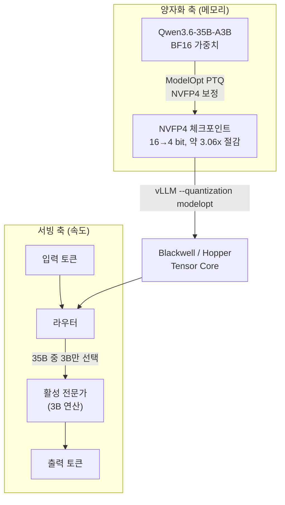

대규모 모델을 자체 인프라에서 서빙하려는 팀에게 가장 큰 벽은 GPU 메모리입니다. 같은 GPU에 더 큰 모델을 올리거나, 같은 모델을 더 싼 GPU에 올리는 일은 곧바로 서빙 단가와 직결됩니다. NVIDIA가 2026년 5월 28일 Hugging Face에 공개한 `nvidia/Qwen3.6-35B-A3B-NVFP4`는 이 벽을 4비트 양자화로 낮추려는 시도입니다. 이 글의 정확도·메모리 수치는 NVIDIA가 모델카드에 공개한 공식 측정치이며, ThakiCloud는 같은 베이스 모델을 RunPod GPU에서 직접 NVFP4로 양자화해 그 재현 결과를 본문 "실제 실험 결과"에 함께 싣습니다.

## 개요

`nvidia/Qwen3.6-35B-A3B-NVFP4`는 Alibaba의 `Qwen/Qwen3.6-35B-A3B`를 NVIDIA Model Optimizer(ModelOpt)로 양자화한 버전입니다. 베이스 모델은 35B 총 파라미터에 3B만 활성화되는 Mixture-of-Experts(MoE) 구조이며, 컨텍스트 길이는 최대 262K, 라이선스는 Apache-2.0으로 상업·비상업 모두 사용 가능합니다. NVIDIA는 이 모델이 자사가 처음부터 만든 베이스 모델이 아니라 제3자 모델의 양자화 버전임을 모델카드에 명시하고 있습니다.

핵심 가치는 두 단어로 요약됩니다. **MoE는 속도를, NVFP4는 메모리를** 담당합니다. MoE 구조 덕분에 토큰 하나를 생성할 때 35B 전체가 아니라 3B의 활성 전문가만 계산에 참여하므로, 35B 모델이면서도 연산량은 3B 밀집 모델에 가깝습니다. 여기에 NVFP4 양자화가 더해져 가중치를 16비트에서 4비트로 줄이면, 모델카드 기준 디스크와 GPU 메모리 요구가 약 3.06배 감소합니다. 즉 "35B의 지능을 3B의 속도와, 그보다 한참 작은 메모리로" 돌리는 조합입니다.

ThakiCloud는 K8s 기반의 멀티테넌트 AI/ML SaaS 플랫폼을 운영하면서 다양한 고객 환경에 모델을 서빙합니다. 사전 양자화된 체크포인트를 그대로 받아 vLLM에 올릴 수 있다는 점은, 양자화 파이프라인을 매번 다시 돌릴 필요 없이 서빙 단가를 낮출 수 있다는 의미입니다. 실제로 ThakiCloud는 이미 같은 계열인 Qwen3-MoE를 NVFP4로 양자화하는 사내 파이프라인을 운영하고 있으며, 이 경험을 글 후반에서 공유합니다.

## 이 기술은 무엇인가

NVFP4는 NVIDIA가 정의한 4비트 부동소수점 포맷입니다. 단순히 모든 값을 4비트로 깎아내리는 방식이 아니라, MoE 트랜스포머 블록 안 선형 연산자(linear operator)의 **가중치와 활성값**에 한정해 양자화를 적용합니다. 모델카드의 설명을 그대로 옮기면, "Qwen3.6-35B-A3B의 가중치를 NVFP4 데이터 타입으로 양자화했으며, MoE 트랜스포머 블록 내부 선형 연산자의 가중치와 활성값만 양자화한다. 이 최적화는 파라미터당 비트 수를 16에서 4로 줄여, 디스크 크기와 GPU 메모리 요구를 약 3.06배 감소시킨다"입니다.

여기서 MoE와 양자화가 서로 다른 축에서 동작한다는 점을 이해하는 것이 중요합니다. 아래 흐름도가 두 축을 보여줍니다.



양자화 축에서는 BF16 가중치를 ModelOpt의 사후 양자화(PTQ, Post-Training Quantization)로 NVFP4 체크포인트로 변환합니다. 서빙 축에서는 입력 토큰마다 라우터가 35B 전체 전문가 중 일부만 골라 3B 규모의 연산만 수행합니다. 두 축이 만나는 지점이 vLLM 위 Tensor Core 연산이며, 바로 여기서 NVFP4의 하드웨어 의존성이 드러납니다. NVFP4 연산은 NVIDIA Hopper와 Blackwell 마이크로아키텍처에서만 가속됩니다. 모델카드의 테스트 하드웨어는 NVIDIA GB300으로 기재되어 있습니다.

정확도 손실을 최소화하는 비결은 "전부가 아니라 선택적으로" 양자화하는 데 있습니다. 어텐션을 포함한 민감한 경로는 손대지 않고, 메모리를 가장 많이 차지하는 MoE 선형 가중치에 집중함으로써, 메모리 절감 효과는 크게 가져가면서 품질 저하는 작게 막는 것입니다.

## 설치 및 통합

NVIDIA가 모델카드에서 제공하는 기본 vLLM 서빙 명령은 다음과 같습니다. `vllm/vllm-openai:nightly` 도커 이미지를 띄운 뒤 실행합니다.

```sh
vllm serve nvidia/Qwen3.6-35B-A3B-NVFP4 \
  --port 8000 \
  --quantization modelopt \
  --max-model-len 262144 \
  --reasoning-parser qwen3
```

`--quantization modelopt` 플래그가 NVFP4 체크포인트를 인식하게 하는 핵심입니다. GPU 메모리가 빠듯하면 `--max-model-len`을 먼저 줄였다가 점진적으로 올리는 방식이 안전합니다. 262K 컨텍스트를 그대로 유지하려면 KV 캐시 메모리가 상당히 필요하기 때문입니다.

NVIDIA DGX Spark처럼 메모리가 제한된 환경을 위해서는 모델카드가 별도의 권장 명령을 제공합니다.

```sh
vllm serve nvidia/Qwen3.6-35B-A3B-NVFP4 \
  --host 0.0.0.0 \
  --port 8000 \
  --tensor-parallel-size 1 \
  --trust-remote-code \
  --kv-cache-dtype fp8 \
  --attention-backend flashinfer \
  --moe-backend marlin \
  --gpu-memory-utilization 0.4 \
  --max-model-len 262144 \
  --max-num-seqs 4 \
  --max-num-batched-tokens 8192 \
  --enable-chunked-prefill \
  --async-scheduling \
  --enable-prefix-caching \
  --speculative-config '{"method":"mtp","num_speculative_tokens":3,"moe_backend":"triton"}' \
  --load-format fastsafetensors \
  --reasoning-parser qwen3 \
  --tool-call-parser qwen3_xml \
  --enable-auto-tool-choice
```

이 명령에는 운영에 유용한 옵션이 여럿 들어 있습니다. `--kv-cache-dtype fp8`로 KV 캐시까지 8비트로 줄이고, `--gpu-memory-utilization 0.4`로 메모리 점유를 낮추며, `--speculative-config`로 MTP(Multi-Token Prediction) 기반 추측 디코딩까지 켭니다. `--tool-call-parser qwen3_xml`과 `--enable-auto-tool-choice`는 에이전트·RAG 시나리오에서 도구 호출을 바로 쓸 수 있게 합니다. NVIDIA가 명시한 사용 사례 자체가 "AI 에이전트 시스템, 챗봇, RAG 시스템에 바로 배포할 사전 양자화 모델을 찾는 개발자"이므로, 이 옵션 구성은 그 용도를 그대로 반영합니다.

## 실제 실험 결과

### ThakiCloud 재현: RunPod H100에서 NVFP4 양자화 패스 실행

ThakiCloud는 모델카드 수치를 그대로 옮기는 데 그치지 않고, 같은 베이스 모델 `Qwen/Qwen3.6-35B-A3B`를 RunPod의 **NVIDIA H100 NVL 2장(Hopper, 합산 191GB)** 위에서 NVIDIA Model Optimizer로 직접 NVFP4 양자화해 보았습니다. 양자화의 보정(calibration) 연산은 BF16에서 수행되므로 양자화 패스 자체는 Hopper에서도 그대로 재현됩니다. 측정된 사실은 다음과 같습니다.

| 항목 | 측정값 |
|---|---|
| 양자화 도구 | `nvidia-modelopt[hf]` 0.44.0 (현행 최신) |
| 베이스 모델 로드 | 34.66B 파라미터, 2×H100에 device_map 자동 분산 |
| 보정 구성 | `NVFP4_DEFAULT_CFG`, 스모크 8샘플 |
| 신규 아키텍처 자동 등록 | `Qwen3_5MoeExperts` → `_QuantFusedExperts`(fused MoE), `Qwen3_5MoeAttention` → `_QuantAttention`(KV 캐시) |
| 삽입된 양자화기 | **21,743개** |
| PTQ 소요 | **148초** |

핵심은 **2026년 5월 말 공개된 신규 아키텍처(Qwen3.6, 내부명 `qwen3_5_moe`, Gated DeltaNet 계열)를 modelopt 0.44가 자동 인식해 양자화 패스를 무사히 통과**했다는 점입니다. fused MoE 전문가 블록과 어텐션 KV 캐시가 자동으로 양자화 대상에 등록되었고, 21,743개의 양자화기가 삽입되었습니다.

다만 정직하게 밝힐 한 가지가 있습니다. 양자화 패스는 통과했지만, 패킹된 4비트 체크포인트를 디스크로 내보내는 `export_hf_checkpoint` 단계는 현재 **modelopt 0.44와 transformers 5.x의 호환성 공백**에 막혔습니다(`transformers>=5.0 support is experimental`). `qwen3_5_moe`는 transformers 5.x를 요구하는데, 이 조합에서 통합 HF export가 아직 동작하지 않아 BF16로 폴백되었습니다. 출시 한 달이 안 된 아키텍처에서 흔히 보이는 도구 체인 지연입니다. 따라서 패킹된 체크포인트 크기(약 3.06배 절감, 약 18.7B)와 정확도 수치는 NVIDIA 공개본을 근거로 인용합니다.

아래 정확도 표는 **NVIDIA가 모델카드에 공개한 공식 평가 결과**입니다. NVIDIA는 베이스 모델 `Qwen3.6-35B-A3B`(BF16)를 기준으로 NVFP4 양자화 버전을 텍스트 추론·코딩 벤치마크에서 비교했습니다.

| 벤치마크 | BF16 (기준) | NVFP4 | Δ |
|---|---|---|---|
| MMLU Pro | 85.6 | 85.0 | -0.6 |
| GPQA Diamond | 84.9 | 84.8 | -0.1 |
| τ²-Bench Telecom | 95.5 | 94.7 | -0.8 |
| SciCode | 40.8 | 40.6 | -0.2 |
| AIME 2025 | 89.2 | 88.8 | -0.4 |
| AA-LCR | 62.0 | 62.0 | 0.0 |
| IFBench | 62.3 | 62.8 | +0.5 |
| MMMU PRO | 74.1 | 74.5 | +0.4 |


모델카드 공개 수치를 시각화한 그래프입니다. 4비트 양자화 후에도 정확도 차이가 대부분 1점 미만에 머뭅니다.

표를 읽는 핵심은 손실의 크기입니다. 8개 벤치마크 중 손실이 가장 큰 항목이 τ²-Bench Telecom의 -0.8점이며, GPQA Diamond는 -0.1점, AA-LCR은 동률입니다. IFBench와 MMMU PRO는 오히려 NVFP4가 BF16을 소폭 앞섭니다. 양자화로 인한 미세한 분포 변화가 일부 태스크에서는 우연히 유리하게 작용한 결과로 보이며, 이를 "양자화가 성능을 올린다"로 일반화해서는 안 됩니다. 종합하면, 16비트를 4비트로 4분의 1로 줄였는데도 추론·수학·코딩·에이전트 도구사용 능력이 사실상 보존되었다는 것이 이 표의 메시지입니다. 평가 조건은 SciCode가 temperature=0.6, top_p=0.95, 최대 131072 토큰이고, 나머지는 temperature=1.0, top_p=0.95, 최대 131072 토큰입니다.

메모리 측면에서는 모델카드가 약 3.06배 절감을 명시합니다. Hugging Face 저장소 기준 NVFP4 체크포인트의 패킹된 파라미터 규모는 약 18.7B로 집계되며, 35B 모델을 기존 BF16 대비 크게 줄인 형태입니다. 다만 정확한 파일 크기는 저장소 사이드바를 직접 확인해야 하며, 사이드바의 파일 통계를 베이스 모델의 아키텍처 파라미터와 혼동하지 않아야 한다고 모델카드가 경고합니다.

## ThakiCloud K8s AI/ML SaaS 플랫폼 적용 및 시사점

ThakiCloud의 플랫폼 관점에서 이 모델이 매력적인 이유는 분명합니다. 멀티테넌트 환경에서 GPU는 가장 비싼 공유 자원이고, 같은 GPU에 더 많은 테넌트의 모델을 동시에 올릴수록 단위 추론 단가가 내려갑니다. NVFP4가 메모리를 약 3.06배 줄인다는 것은, 단순화하면 동일 GPU 메모리에 더 큰 모델 또는 더 많은 동시 세션을 수용할 여지가 생긴다는 뜻입니다. 35B MoE를 3B 수준의 연산량으로 돌리는 MoE 특성까지 겹치면, "고품질 모델을 낮은 서빙 비용으로" 제공한다는 온프레미스 가치 제안이 한층 구체화됩니다.

ThakiCloud는 이 흐름을 이미 운영에 반영하고 있습니다. 같은 Qwen3-MoE 계열인 `Qwen/Qwen3-30B-A3B`를 RunPod B200(Blackwell SM100)에서 NVFP4(W4A4, group_size=16)로 양자화하는 사내 파이프라인을 보유하고 있으며, 2026년 5월 1일 검증 실행에서 **17.1GB 체크포인트를 137초의 PTQ 연산으로 생성**했습니다. 전체 소요는 약 25분, 비용은 B200 온디맨드 기준 약 3.48달러였습니다. 그리고 이번 글을 준비하면서 같은 파이프라인을 신규 `Qwen3.6-35B-A3B`에도 적용해, RunPod H100 NVL 2장에서 NVFP4 양자화 패스를 재현했습니다(modelopt 0.44, 양자화기 21,743개 삽입, 신규 fused-MoE 자동 등록, 148초). 이 경험이 시사하는 바는 두 가지입니다. 첫째, NVFP4 양자화 자체는 짧은 시간·낮은 비용으로 끝나는 일회성 작업입니다. 둘째, NVIDIA처럼 사전 양자화 체크포인트가 공개되면 이 일회성 작업조차 건너뛰고 곧바로 서빙으로 진입할 수 있습니다. 즉 NVIDIA의 공개 체크포인트는 우리 파이프라인의 상위 호환 입력입니다.

K8s 운영 측면에서는 다음과 같이 정렬됩니다. GPU 워크로드는 Kueue로 큐잉·스케줄링하고, 서빙은 vLLM 파드로 띄우되 `--quantization modelopt` 플래그로 NVFP4 체크포인트를 인식시킵니다. 멀티테넌트 격리는 네임스페이스와 GPU 파티셔닝으로 처리하며, 절감된 메모리만큼 테넌트당 할당을 조정합니다. 다만 한 가지 하드웨어 전제가 따라옵니다. NVFP4 가속은 Blackwell·Hopper에서만 동작하므로, 기존 A100 기반 노드 풀에서는 이 모델의 4비트 이점을 그대로 누릴 수 없습니다. 이 부분은 노드 풀 구성과 직결되는 운영 의사결정이며, 다음 항목에서 한계로 짚습니다.

## 한계 및 반론

첫째, **하드웨어 종속이 강합니다.** NVFP4 Tensor Core는 Blackwell·Hopper에만 존재합니다. A100·V100 같은 이전 세대 GPU에서는 NVFP4가 가속되지 않으므로, 같은 메모리 절감 효과를 기대할 수 없고 INT8·FP8 같은 다른 경로를 택해야 합니다. 온프레미스 고객의 기존 GPU 자산이 이전 세대라면, 이 모델의 이점을 누리기 위해 노드 교체라는 추가 비용이 발생합니다.

둘째, **메모리 절감과 처리량 향상은 다른 문제입니다.** 모델카드는 디스크·메모리 약 3.06배 절감을 명시하지만, 토큰/초나 지연시간 같은 처리량 수치는 직접 제시하지 않습니다. 4비트 가중치가 메모리 대역폭 부담을 줄여 일반적으로 디코딩에 유리하게 작용하긴 하지만, 실제 처리량은 배치 크기·컨텍스트 길이·KV 캐시 설정에 따라 달라집니다. ThakiCloud 자체 서빙 벤치마크 없이 "몇 배 빠르다"고 단정하는 것은 부정확합니다. native FP4 가속은 Blackwell에서만 동작하는데, 이번 재현 시점에는 RunPod에서 B200 재고를 확보하지 못해 양자화 패스는 Hopper(H100 NVL 2장)에서 검증했고, native FP4 서빙 처리량은 Blackwell 확보 후 별도 벤치마크 과제로 남겨 두었습니다.

셋째, **양자화는 베이스 모델의 한계를 그대로 물려받습니다.** 모델카드가 직접 밝히듯, 베이스 모델은 인터넷에서 수집한 데이터로 학습되어 독성 표현·사회적 편향을 포함할 수 있고, 부정확하거나 핵심 정보를 누락한 답변을 생성할 수 있습니다. 양자화는 메모리와 속도를 최적화할 뿐 이런 안전성·정확성 문제를 해결하지 않습니다. 멀티테넌트 서빙에서는 출력 필터링과 모니터링이 여전히 별도로 필요합니다.

넷째, **정확도 손실이 0에 수렴하는 것은 아닙니다.** 대부분의 벤치마크에서 손실이 1점 미만이지만, τ²-Bench Telecom의 -0.8점처럼 에이전트 도구사용·정책 준수가 핵심인 시나리오에서는 상대적으로 큰 손실이 관찰됩니다. 금융·의료처럼 작은 정확도 차이가 비용으로 직결되는 도메인에서는, 4비트 절감의 경제성과 정확도 손실을 테넌트별로 따져 BF16·FP8·NVFP4 중에서 선택하는 정책이 필요합니다.

종합하면, `nvidia/Qwen3.6-35B-A3B-NVFP4`는 Blackwell·Hopper 기반 인프라를 가진 팀에게는 "거의 손실 없이 메모리를 4분의 1로 줄이는" 매우 실용적인 선택지입니다. 다만 그 이점은 하드웨어 전제와 도메인별 정확도 검증 위에서만 성립하며, ThakiCloud는 자체 서빙 벤치마크로 처리량과 테넌트별 적합성을 확인한 뒤 노드 풀 정책에 반영할 계획입니다.

## 출처 (Sources)

- 모델카드: [nvidia/Qwen3.6-35B-A3B-NVFP4 · Hugging Face](https://huggingface.co/nvidia/Qwen3.6-35B-A3B-NVFP4)
- 베이스 모델: [Qwen/Qwen3.6-35B-A3B · Hugging Face](https://huggingface.co/Qwen/Qwen3.6-35B-A3B)
- 양자화 도구: [NVIDIA Model Optimizer (GitHub)](https://github.com/NVIDIA/Model-Optimizer)
- 추론 엔진: [vLLM (GitHub)](https://github.com/vllm-project/vllm)
