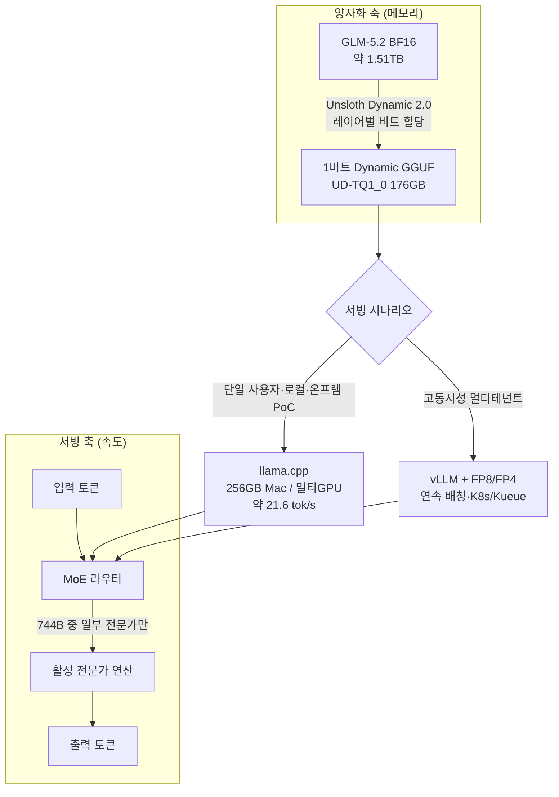

자체 인프라에서 큰 모델을 돌리려는 팀이 가장 먼저 부딪히는 벽은 언제나 메모리입니다. 프런티어급 모델을 외부 API로 부르면 데이터가 회사 밖으로 나가고, 직접 호스팅하려면 수백 GB에서 1TB가 넘는 가중치를 어딘가에 올려야 합니다. Unsloth가 2026년 6월 공개한 `unsloth/GLM-5.2-GGUF`는 이 벽을 양자화로 낮춘 사례입니다. 약 744B 파라미터의 MoE 오픈 모델 GLM-5.2를, 원본 BF16 기준 1.51TB에 달하던 가중치를 1비트 Dynamic GGUF로 176GB까지 줄였습니다. 이 글의 모든 수치는 Unsloth와 Hugging Face가 공개한 측정치이며, 744B 모델은 본 분석 환경에서 직접 실행이 불가능해 자체 재현 대신 공개 벤치마크를 인용하고 그 한계를 분명히 밝힙니다.


## 개요

GLM-5.2는 Z.ai(Zhipu)가 공개한 오픈웨이트 대형 언어 모델입니다. 약 744B 총 파라미터의 Mixture-of-Experts(MoE) 구조에 최대 100만 토큰 컨텍스트를 지원하며, Unsloth 문서와 여러 매체 보도에 따르면 Artificial Analysis를 비롯한 종합 벤치마크에서 Claude 4.8 Opus, GPT-5.5, Gemini 3.1 Pro와 대등한 수준으로 평가됩니다. "현재까지 가장 강한 오픈 모델"이라는 평가가 붙는 이유입니다.

문제는 크기입니다. 원본 BF16 체크포인트는 약 1.51TB로, 단일 서버에 그대로 올리기 어렵습니다. Unsloth가 한 일은 이 가중치를 Dynamic 2.0 GGUF 방식으로 양자화해, 1비트에서 4비트까지 단계별 버전을 만든 것입니다. 그 결과 1비트 버전은 176GB까지 내려가, 256GB 통합 메모리를 가진 Mac Studio 한 대나 멀티 GPU 한 대에서도 로딩이 가능해졌습니다. 프런티어급으로 평가받는 모델을 데이터센터 랙이 아니라 책상 위 장비에서 돌릴 수 있다는 뜻입니다.

ThakiCloud는 K8s 기반 멀티테넌트 AI/ML SaaS 플랫폼을 운영하면서, 고객이 데이터를 외부로 내보내지 않고도 강한 모델을 쓰도록 온프레미스·VPC 서빙을 다룹니다. 그래서 "프런티어급 오픈 모델을 얼마나 작은 하드웨어에서 돌릴 수 있는가"라는 질문은 곧 우리 고객의 서빙 단가와 데이터 주권에 직결됩니다. 다만 결론을 먼저 말하면, GGUF 양자화는 로컬·단일 사용자 시나리오에 강력하지만 고동시성 멀티테넌트 서빙에서는 결이 다릅니다. 이 글은 그 경계를 다룹니다.

## 이 기술은 무엇인가

GGUF는 llama.cpp 생태계에서 쓰는 모델 파일 포맷이고, 양자화는 16비트 부동소수점 가중치를 더 적은 비트로 표현해 용량과 메모리를 줄이는 기법입니다. 여기서 핵심은 Unsloth의 **Dynamic 2.0** 방식입니다. 모든 레이어를 똑같이 1비트로 깎는 것이 아니라, 정보 손실에 민감한 레이어는 더 높은 비트로 보존하고 둔감한 레이어만 공격적으로 압축합니다. "1비트"라는 이름이 붙어도 실제로는 레이어별로 비트 폭이 섞여 있고, 그래서 같은 평균 비트 수에서도 단순 양자화보다 정확도가 덜 떨어집니다.

GLM-5.2가 MoE라는 점이 이 조합을 특히 의미 있게 만듭니다. MoE는 토큰 하나를 생성할 때 744B 전체가 아니라 라우터가 고른 일부 전문가만 계산에 참여하므로, 연산량은 활성 파라미터 규모에 가깝습니다. 즉 **MoE가 연산을, Dynamic GGUF가 메모리를** 각각 담당하는 구조입니다. 아래 흐름도가 두 축과, ThakiCloud 관점에서 갈라지는 서빙 경로를 함께 보여줍니다.



양자화 축에서 BF16 가중치는 Unsloth Dynamic 2.0 보정을 거쳐 1비트 GGUF가 됩니다. 서빙 축에서는 MoE 라우터가 토큰마다 일부 전문가만 활성화합니다. 두 축이 만나는 지점에서 시나리오가 갈리는데, 단일 사용자·로컬 검증에는 llama.cpp + GGUF가, 고동시성 서빙에는 vLLM + GPU 양자화가 더 적합합니다. 이 분기는 글 후반에서 다시 다룹니다.

## 설치 및 통합

GGUF의 장점은 진입 장벽이 낮다는 점입니다. llama.cpp 또는 그 래퍼만 있으면 됩니다. Unsloth 문서가 안내하는 표준 경로는 다음과 같습니다.

Hugging Face에서 원하는 양자화 버전만 내려받습니다. 1비트 `UD-TQ1_0`을 예로 들면 다음과 같습니다.

```bash
# huggingface_hub로 1비트 GGUF 샤드만 선택 다운로드
pip install -U huggingface_hub hf_transfer
HF_HUB_ENABLE_HF_TRANSFER=1 \
huggingface-cli download unsloth/GLM-5.2-GGUF \
  --include "*UD-TQ1_0*" \
  --local-dir GLM-5.2-GGUF
```

내려받은 뒤 llama.cpp로 서버를 띄웁니다. MoE 모델이므로 `--n-gpu-layers`와 컨텍스트 길이를 환경에 맞춰 조정합니다.

```bash
# llama.cpp 서버 (OpenAI 호환 엔드포인트)
./llama-server \
  --model GLM-5.2-GGUF/GLM-5.2-UD-TQ1_0-00001-of-*.gguf \
  --ctx-size 16384 \
  --n-gpu-layers 999 \
  --jinja \
  --host 0.0.0.0 --port 8080
```

256GB 통합 메모리를 가진 Mac Studio(M3 Ultra)에서는 Metal 백엔드로 전체 레이어를 메모리에 올릴 수 있고, x86 멀티 GPU 환경에서는 GPU와 CPU/RAM에 레이어를 분할 배치(offload)하는 방식으로 돌립니다. 양자화 단계가 높을수록 더 많은 메모리가 필요하므로, 가진 하드웨어의 용량이 곧 선택 가능한 양자화 상한이 됩니다.

## 실제 실험 결과

여기서부터는 Unsloth와 Hugging Face가 공개한 측정치입니다. 744B 모델은 본 분석 환경에서 직접 호스팅이 불가능하므로, 자체 재현 수치가 아니라 출처가 분명한 공개 데이터임을 명시합니다. 아래는 양자화 단계별 파일 크기를 정리한 표입니다.

| 양자화 | 대표 버전 | 파일 크기 | BF16(1.51TB) 대비 |
|---|---|---|---|
| 1비트 | UD-TQ1_0 | 176GB | 약 88% 감소 |
| 1비트 | UD-IQ1_S | 204GB | 약 86% 감소 |
| 2비트 | UD-IQ2_M | 255GB | 약 83% 감소 |
| 3비트 | UD-Q3_K_XL | 332GB | 약 78% 감소 |
| 4비트 | Q4_K_M | 456GB | 약 70% 감소 |


정확도 측면에서 Unsloth는 Dynamic 양자화가 같은 평균 비트 수의 단순 양자화보다 손실이 작다고 보고합니다. 공개 자료에 따르면 Dynamic 1비트 버전은 자체 정확도 지표 기준 약 76%[추정], Dynamic 2비트 버전은 약 82% 수준을 유지하면서도 원본 대비 80% 이상 작아진다고 설명합니다. 정확한 측정 지표와 데이터셋 정의는 버전·평가셋에 따라 달라지므로, 이 수치는 절대값보다 "단계가 낮아질수록 손실이 점진적으로 늘지만 1비트에서도 사용 가능한 범위에 머문다"는 경향으로 읽는 편이 안전합니다. Unsloth는 별도로 Aider Polyglot 코딩 벤치마크에서 Dynamic GGUF 결과를 공개하고 있어, 코딩 과제에서의 단계별 품질 변화를 교차 확인할 수 있습니다.

처리 속도는 하드웨어에 크게 좌우됩니다. 공개 보도 기준, 256GB Mac Studio(M3 Ultra)에서 1비트 버전이 약 21.6 tok/s로 동작했습니다. 단일 사용자가 대화형으로 쓰기에는 충분하지만, 동시에 수십 개 요청을 받는 서버 부하에서는 다른 그림이 됩니다. 이 차이가 다음 절의 핵심입니다.

## ThakiCloud K8s AI/ML SaaS 플랫폼 적용 및 시사점

ThakiCloud는 다양한 고객 환경에서 모델을 서빙하며, 그중 적지 않은 수가 "데이터를 밖으로 내보낼 수 없다"는 제약을 가집니다. 금융·공공·의료처럼 데이터 주권이 핵심인 곳에서는, 프런티어급 모델을 외부 API로 부르는 선택지 자체가 닫혀 있습니다. 이때 GLM-5.2 Dynamic GGUF는 강력한 협상 카드가 됩니다. 1.51TB짜리 프런티어급 오픈 모델을, 256GB 단일 노드 수준의 하드웨어에서 실행 가능한 형태로 만들어 주기 때문입니다.


구체적인 적용 각도는 세 가지입니다. 첫째, **온프레미스 PoC와 평가**입니다. 고객 데이터센터에 들어가기 전, 모델이 해당 도메인에서 쓸 만한지 빠르게 검증할 때 GGUF 로컬 실행은 GPU 클러스터를 예약하지 않고도 한 대의 장비로 돌려볼 수 있는 가장 싼 경로입니다. 둘째, **저빈도·고민감 워크로드**입니다. 동시 사용자가 많지 않지만 데이터가 절대 외부로 나가면 안 되는 내부 분석·문서 처리에는, 단일 노드 GGUF 서빙이 비용과 보안을 동시에 만족시킵니다. 셋째, **하드웨어 다양성 흡수**입니다. llama.cpp는 Mac의 Metal, x86 GPU, CPU offload를 모두 지원하므로, 고객이 이미 보유한 잡다한 하드웨어를 그대로 활용하는 유연성을 줍니다.

ThakiCloud의 표준 서빙 스택은 K8s 위에서 Kueue로 GPU를 큐잉하고 vLLM으로 모델을 띄우는 구조입니다. 여기에 GGUF 경로를 더하면, "고동시성 멀티테넌트는 vLLM + FP8/FP4, 단일 노드 온프렘은 llama.cpp + Dynamic GGUF"라는 이원화된 서빙 메뉴를 고객 상황에 맞춰 제시할 수 있습니다. 같은 GLM-5.2 계열 안에서도 워크로드 성격에 따라 양자화 방식과 런타임을 바꿔 끼우는 것입니다. 이 선택지를 가진 벤더와 그렇지 않은 벤더의 차이는, 고객이 "우리 환경에서는 이게 안 된다"고 말할 때 드러납니다.

## 한계 및 반론

이 기술을 과대평가하지 않으려면 몇 가지를 분명히 해야 합니다.


첫째, **1비트는 공짜가 아닙니다.** Dynamic 양자화가 손실을 줄여 준다고 해도, 1비트 버전의 정확도는 원본보다 분명히 낮습니다. 복잡한 추론·장문 코딩처럼 오차가 누적되는 과제에서는 2~4비트 버전과의 차이가 체감됩니다. "프런티어급 모델을 1비트로"라는 문장은 매력적이지만, 실제 도입에서는 과제별로 어느 비트가 품질 손익분기점인지 직접 측정해야 합니다.

둘째, **GGUF는 멀티테넌트 서빙용 포맷이 아닙니다.** 21.6 tok/s라는 수치는 단일 스트림 기준입니다. vLLM의 연속 배칭(continuous batching)은 동시 요청을 묶어 처리량을 끌어올리는데, llama.cpp는 이 영역에서 약합니다. 수십~수백 동시 사용자를 받는 SaaS 멀티테넌트 서빙이라면, 1비트 GGUF보다 GPU 위 FP8/FP4 양자화 + vLLM 조합이 단위 비용당 처리량에서 보통 앞섭니다. GGUF의 자리는 "많은 사람에게 동시에"가 아니라 "한 환경에서 안전하게"입니다.

셋째, **하드웨어가 싸진 것은 아닙니다.** 256GB 통합 메모리 Mac Studio는 8×H100 같은 데이터센터 GPU보다는 훨씬 저렴하지만, 그 자체로는 결코 저가 장비가 아닙니다. "책상 위에서 돌아간다"는 표현이 "누구나 부담 없이"를 뜻하지는 않습니다.

넷째, **공개 수치는 대부분 Unsloth 자체 보고입니다.** 양자화 단계별 정확도와 속도는 평가셋·하드웨어·런타임 설정에 따라 흔들립니다. 도입 결정은 벤더 발표가 아니라 자사 데이터로 재현한 결과 위에서 내려야 합니다. 본 글이 자체 재현 대신 출처를 명시한 이유도 같은 원칙입니다.

정리하면, Unsloth GLM-5.2 Dynamic GGUF는 "프런티어급 오픈 모델의 온프레미스 진입 장벽을 한 단계 낮춘 도구"로 평가하는 것이 정확합니다. 모든 서빙을 대체하는 만능 해법이 아니라, 데이터 주권과 단일 노드 비용이 중요한 시나리오에서 강력한 선택지입니다. ThakiCloud처럼 워크로드별로 런타임을 갈아 끼울 수 있는 플랫폼에게는, 고객의 "안 된다"를 "이렇게 하면 된다"로 바꾸는 카드가 한 장 더 늘어난 셈입니다.


## 출처

- [unsloth/GLM-5.2-GGUF · Hugging Face](https://huggingface.co/unsloth/GLM-5.2-GGUF)
- [GLM-5.2 - How to Run Locally | Unsloth Documentation](https://unsloth.ai/docs/models/glm-5.2)
- [Unsloth Dynamic 2.0 GGUFs | Unsloth Documentation](https://unsloth.ai/docs/basics/unsloth-dynamic-2.0-ggufs)
- [unsloth/GLM-5.2-GGUF · GLM-5.2 GGUF Benchmarks! (Discussion)](https://huggingface.co/unsloth/GLM-5.2-GGUF/discussions/3)
- [Unsloth Quantizes GLM-5.2's 1.51TB to 217GB for Local Inference | AI Weekly](https://aiweekly.co/alerts/unsloth-quantizes-glm-52s-151tb-to-217gb-for-local-inference)
