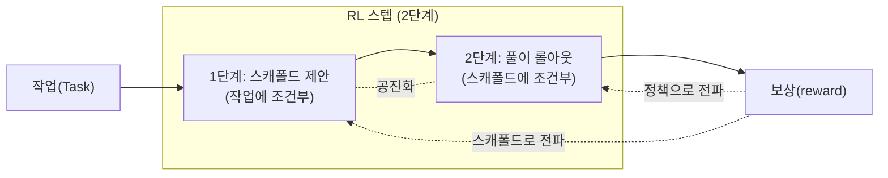

*스스로 훈련 발판을 쌓아 올리는 자가-스캐폴딩 강화학습을 형상화한 이미지입니다.*

오픈웨이트 코딩 모델의 경쟁은 이제 "벤치마크 점수가 몇 점이냐"를 넘어 "그 점수를 어떤 훈련 방법으로 끌어냈느냐"로 옮겨가고 있습니다. DeepReinforce가 2026년 6월 25일 공개한 `Ornith-1.0`은 그 방법론 자체가 헤드라인인 모델입니다. 모델이 풀이를 생성하는 동시에, 그 풀이를 유도하는 **훈련 스캐폴드(scaffold)를 스스로 작성**하도록 강화학습을 설계했습니다.

이 글은 본문의 벤치마크 수치를 직접 재현한 결과가 아닙니다. 397B 규모의 모델을 코딩 벤치마크로 돌리려면 다중 GPU 노드와 수 시간의 추론이 필요하므로, 이번 인트라데이 분석에서는 직접 실행하지 않았습니다. 따라서 본문의 점수는 모두 **DeepReinforce가 공개 자료에 명시한 수치**이며, 출처가 갈리는 값은 `[추정]`으로 표기합니다. 재현 수치를 임의로 만들어 넣지 않았습니다.

## 개요

`Ornith-1.0`은 단일 모델이 아니라 코딩에 특화된 오픈소스 모델 패밀리입니다. 9B 밀집(dense), 31B 밀집, 35B Mixture-of-Experts(MoE), 397B MoE 플래그십까지 네 가지 크기로 나뉘며, 모두 MIT 라이선스로 Hugging Face의 `deepreinforce-ai` 네임스페이스에 공개되어 즉시 내려받을 수 있습니다. 양자화 변형으로 9B·35B GGUF, 35B·397B FP8도 함께 올라와 있어, 엣지 단일 GPU부터 데이터센터 다중 노드까지 배포 스펙트럼을 처음부터 의도했습니다.

여기서 ThakiCloud 입장에서 먼저 눈에 들어오는 두 가지는 라이선스와 자가호스팅 가능성입니다. MIT는 상업·비상업을 가리지 않고, 카피레프트 전염이나 비상업 조항 같은 법적 마찰이 없습니다. 자체 인프라에서 코딩 에이전트를 운영하려는 조직에게 "내려받아 우리 GPU에 올려도 되는가"라는 질문에 가장 깔끔하게 "그렇다"라고 답하는 라이선스입니다.

핵심을 한 문장으로 요약하면 이렇습니다. **Ornith-1.0은 강화학습 단계에서 풀이만 학습하는 것이 아니라, 그 풀이를 이끄는 작업별 훈련 스캐폴드까지 함께 학습합니다.** 스캐폴드를 고정된 도구가 아니라 정책(policy)과 같이 진화하는 학습 대상으로 다루는 것이 다른 RL 코딩 모델과 갈리는 지점입니다.

원 트윗은 이 모델을 "프런티어급으로 코딩하는, 미국 연구소 최초의 오픈소스 모델"로 소개했습니다. 다만 DeepReinforce의 본사 소재지는 공개 자료에서 독립적으로 확인하지 못했으므로, 이 글은 국적 프레이밍보다 검증 가능한 메커니즘과 공개 수치에 무게를 둡니다.

## 이 모델은 무엇인가

`Ornith-1.0`은 사전학습된 베이스 모델 위에 후처리 학습(post-training)을 얹어 만들었습니다. DeepReinforce는 베이스로 Gemma 4와 Qwen 3.5 계열을 사용했다고 밝혔습니다. 즉 처음부터 사전학습한 모델이 아니라, 강력한 오픈 베이스에 **자사의 강화학습 후처리**를 적용해 코딩 능력을 끌어올린 구성입니다. 이 점은 NVIDIA가 제3자 모델을 양자화해 재배포하는 흐름과 비슷하게, "베이스는 공유 자산, 차별화는 후처리"라는 최근 오픈 생태계의 분업 구조를 보여줍니다.

모델 자체는 추론(reasoning) 모델입니다. 기본적으로 어시스턴트 응답을 `<think> … </think>` 블록으로 열어 사고 과정을 먼저 전개한 뒤 최종 답을 냅니다. 공개된 서빙 레시피는 이 사고 과정을 별도의 `reasoning_content` 필드로 분리하는 reasoning 파서와, 모델의 도구 호출 블록을 OpenAI 스타일 `tool_calls`로 노출하는 tool-call 파서를 활성화하도록 안내합니다. 에이전트 루프에 그대로 꽂아 쓰라는 설계 의도가 분명합니다. 최대 컨텍스트 길이는 262,144 토큰으로, 대형 리포지토리를 한 번에 밀어 넣는 장기 호라이즌 코딩 작업을 염두에 둔 길이입니다.

DeepReinforce는 이번이 첫 RL 작업이 아닙니다. 2025년 공개한 `CUDA-L1`은 강화학습으로 CUDA 커널을 자동 최적화해 다수 GPU 태스크에서 평균 3.12배, 피크로는 수십 배의 가속을 보고한 바 있습니다. "강화학습으로 코드/커널을 스스로 개선하게 만든다"는 일관된 연구 줄기가 이번 코딩 모델로 이어진 셈입니다.

## 핵심: 스스로 스캐폴드를 짜는 강화학습

대부분의 에이전트형 RL 학습은 스캐폴드(프롬프트 구조, 도구 사용 규약, 작업 분해 틀)를 사람이 고정해 두고, 그 안에서 정책만 학습합니다. 스캐폴드가 좋으면 점수가 오르고, 나쁘면 정책이 아무리 좋아도 한계에 부딪힙니다. 문제는 작업마다 좋은 스캐폴드가 다르다는 점입니다. Ornith-1.0은 이 스캐폴드를 **고정 상수가 아니라 학습 변수**로 끌어올립니다.

DeepReinforce의 설명에 따르면, 각 RL 스텝은 두 단계로 진행됩니다. 먼저 모델이 주어진 작업에 조건부로 **정제된 스캐폴드를 제안**합니다. 그다음 그 스캐폴드에 조건부로 **풀이 롤아웃(rollout)을 생성**합니다. 보상은 두 단계 모두에 전파됩니다. 즉 "어떤 발판을 세웠는가"와 "그 발판 위에서 무엇을 풀었는가"가 함께 채점되고, 함께 개선됩니다. 스캐폴드는 정책과 공진화(co-evolve)하는 학습 대상이 됩니다.



이 구조가 중요한 이유는 두 가지입니다. 첫째, 사람이 손으로 스캐폴드를 튜닝하는 병목이 사라집니다. 작업 분포가 바뀌어도 모델이 스스로 발판을 다시 짭니다. 둘째, 스캐폴드가 보상 신호에 직접 노출되므로, "정책은 멀쩡한데 발판이 나빠서 점수가 안 나오는" 흔한 실패 모드를 학습 루프 안에서 교정할 수 있습니다. 이는 [Loop Engineering 패턴](https://thakicloud.github.io/ko/llmops/)에서 외부 도구(컴파일러·테스트)를 보상 신호로 쓰는 발상과 같은 계열이되, 보상을 받는 대상에 **발판 자체**를 추가했다는 점에서 한 걸음 더 나아간 설계입니다.

## 공개 벤치마크

DeepReinforce가 공개한 플래그십 수치는 다음과 같습니다. 모두 자사 발표 기준이며, 본 환경에서 재현한 값이 아닙니다.

| 벤치마크 | Ornith-1.0-397B | 비교 |
|---|---|---|
| SWE-Bench Verified | 82.4 | Claude Opus 4.8 87.6 (목록 중 유일하게 상회) |
| Terminal-Bench 2.1 | 77.5 | 동급 오픈소스 중 SOTA로 보고 |
| SWE-Bench Pro | 62.2 `[추정]` | 출처 간 차이 있음 |

DeepReinforce는 Terminal-Bench 2.1, SWE-Bench, NL2Repo, OpenClaw 등 코딩 벤치마크에서 동급 크기 오픈소스 중 최고 수준을 주장합니다. 특히 35B MoE가 더 큰 일부 모델을 앞선다는 보고가 함께 나왔는데, 이는 MoE 희소성과 자가-스캐폴딩 후처리가 결합해 활성 파라미터 대비 효율을 끌어올린 결과로 읽힙니다. 다만 SWE-Bench 계열은 측정 변형(Verified/Pro/원본)에 따라 점수가 크게 갈리므로, 표의 어떤 변형인지를 확인하지 않은 단순 비교는 위험합니다. 표의 SWE-Bench Pro 값을 `[추정]`으로 둔 이유입니다.

벤치마크 점수보다 운영자 입장에서 더 의미 있는 것은 **점수의 출처가 공개 메커니즘이라는 점**입니다. 폐쇄 모델의 점수는 재현이 불가능하지만, MIT로 풀린 가중치와 공개된 학습 서술은 외부 검증의 길을 열어 둡니다.

## 설치 및 서빙

Ornith-1.0은 표준 추론 스택에 그대로 올라가도록 패키징되어 있습니다. 작은 모델부터 검증하는 것이 자가호스팅의 정석입니다. 9B는 단일 GPU에서 동작하도록 설계되어, 파이프라인 통합 테스트의 출발점으로 적합합니다.

```bash
# Hugging Face에서 가중치 받기 (예: 9B)
huggingface-cli download deepreinforce-ai/Ornith-1.0-9B \
  --local-dir ./ornith-1.0-9b
```

추론 모델이자 도구 호출 모델이므로, 서빙 시 reasoning 파서와 tool-call 파서를 함께 켜야 사고 과정과 도구 호출이 구조화된 필드로 분리됩니다. vLLM 기준 대표적인 기동 형태는 다음과 같습니다. 정확한 파서 이름은 각 모델카드의 서빙 레시피를 따릅니다.

```bash
# vLLM 서빙 (대표 형태, 파서 이름은 모델카드 기준)
vllm serve deepreinforce-ai/Ornith-1.0-9B \
  --max-model-len 262144 \
  --enable-auto-tool-choice \
  --tool-call-parser <모델카드 지정> \
  --reasoning-parser <모델카드 지정>
```

플래그십 397B MoE를 올릴 때는 메모리가 첫 벽입니다. FP8 변형(`Ornith-1.0-397B-FP8`)이 함께 공개된 이유가 여기에 있습니다. BF16 대비 가중치 메모리를 절반으로 낮춰 노드 수와 텐서 병렬 차수를 줄일 수 있습니다. 35B MoE는 "활성 파라미터는 작지만 지식 용량은 큰" MoE의 장점을 가장 균형 있게 보여주는 지점으로, 단일 노드 다중 GPU에서 현실적으로 운영 가능한 후보입니다.

```bash
# 397B는 FP8 변형 + 텐서 병렬로 메모리 벽 낮추기 (예시 골격)
vllm serve deepreinforce-ai/Ornith-1.0-397B-FP8 \
  --tensor-parallel-size 8 \
  --max-model-len 262144 \
  --enable-auto-tool-choice
```

## ThakiCloud 제품 적용 시사점

Paxis는 ThakiCloud의 Agent-Native Cloud PoC로, ai-platform K8s 인프라 위에서 에이전트 제어 평면 역할을 합니다. Paxis의 핵심 기능 가운데 '자가진화 스킬'은 Skill Harness가 BM25로 960개 이상의 스킬 중 최적 스킬을 선택하고, 실행 결과를 피드백으로 삼아 스킬 자체를 개선해 가는 루프입니다. Ornith-1.0이 RL 스텝마다 풀이를 이끌 스캐폴드를 스스로 제안하고, 그 스캐폴드를 보상 신호에 함께 노출시키는 구조는 Paxis의 자가진화 루프와 정확히 같은 추상 패턴을 공유합니다. 에이전트가 작업을 수행하는 데 필요한 '구조 자체'를 학습 대상으로 삼는다는 발상이 동형입니다.

Paxis의 에이전트는 DAG 멀티에이전트 협업과 NL Cron을 통해 일정과 할일을 스스로 관리하고, Sandbox 격리 실행 안에서 Tools와 MCP 커넥터를 조합해 복잡한 작업 흐름을 자율로 처리합니다. 이 자율 에이전트가 어떤 스킬을 어떤 순서로 어떤 도구 규약에 따라 실행할지를 스스로 정제해 가는 메커니즘은 Ornith-1.0이 스캐폴드를 정책과 함께 공진화시키는 방식과 직결됩니다. Paxis Skill Harness의 자가진화 스킬이 '사용 결과를 보고 스킬 명세를 업데이트하는 루프'라면, Ornith-1.0은 그 루프를 RL 수준에서 모델 파라미터 안에 내재화한 형태입니다.

ai-platform 관점에서도 시사점은 분명합니다. self-scaffolding 방식으로 학습된 모델의 파인튜닝이나 후처리 학습을 수행하려면 GPU를 탄력적으로 할당하고 작업 큐를 관리할 인프라가 필요합니다. ai-platform의 Kueue는 이 GPU 워크로드 스케줄링을 담당하고, vLLM은 학습 완료 모델의 멀티테넌트 추론 서빙을 처리합니다. Ornith-1.0 크기 패밀리(9B, 35B MoE, 397B MoE)를 Kueue의 테넌트별 우선순위 큐에 대응시키면, 비용과 품질의 트레이드오프를 워크로드 특성에 맞게 계층화할 수 있습니다. 모델 주권과 자가호스팅 요구가 강한 금융·공공·방산 환경에서 MIT 오픈웨이트를 Paxis 에이전트 제어 평면과 연결하는 경로가 이 조합으로 완성됩니다.

## 한계 및 반론

가장 큰 한계는 **검증의 비대칭**입니다. 가중치와 학습 서술은 공개됐지만, 발표 벤치마크는 자사 측정이고 본 환경에서 재현하지 않았습니다. SWE-Bench 계열은 변형에 따라 점수 차가 크고, 동일 모델도 하니스·온도·재시도 설정에 따라 결과가 흔들립니다. 표의 수치를 "프런티어를 따라잡았다"는 결론으로 곧장 옮기는 것은 성급합니다. 실제 도입 판단은 우리 코드베이스 표본에 대한 자체 평가를 거쳐야 합니다.

둘째, **운영 비용**입니다. 397B MoE는 점수는 매력적이지만 자가호스팅 시 GPU 메모리와 노드 수가 현실적 벽입니다. FP8 변형이 이를 완화하지만, "오픈이라 공짜"가 아니라 "오픈이라 인프라 비용을 우리가 진다"는 트레이드오프는 그대로 남습니다. 폐쇄 API의 토큰 단가와 자가호스팅의 노드 단가를 워크로드 패턴 위에서 비교해야 실익이 나옵니다.

셋째, **자가-스캐폴딩의 일반화 의문**입니다. 모델이 스스로 발판을 짠다는 설계는 우아하지만, 학습 분포 밖의 낯선 작업에서 스캐폴드 품질이 무너지지 않는다는 보장은 아직 외부 검증되지 않았습니다. 스캐폴드가 보상에 과적합되어 특정 벤치마크 형태에만 잘 맞는 발판을 학습했을 가능성도 배제할 수 없습니다. 이 부분은 공개 가중치로 누군가 독립 재현을 내놓을 때 비로소 가려질 문제입니다.

결론적으로 Ornith-1.0은 "점수"보다 "방법"으로 주목할 모델입니다. MIT 오픈웨이트라는 점에서 자가호스팅 코딩 에이전트의 현실적 후보이고, 자가-스캐폴딩이라는 메커니즘은 모델을 채택하든 안 하든 에이전트 학습 파이프라인 설계에 빌려올 가치가 있습니다. 다만 모든 벤치마크 주장은 자체 평가로 검증하기 전까지 "발표 수치"로만 받아들이는 것이 안전합니다.


## 관련 슬라이드

본문 내용을 NotebookLM(`prismatic_tech` 스타일)으로 요약한 슬라이드입니다.


## 출처

- DeepReinforce, "Ornith-1.0: Self-Scaffolding LLMs for Agentic Coding" (2026-06): <https://deep-reinforce.com/ornith_1_0.html>
- Hugging Face 모델카드: <https://huggingface.co/deepreinforce-ai/Ornith-1.0-397B>, <https://huggingface.co/deepreinforce-ai/Ornith-1.0-9B>
- GitHub: <https://github.com/deepreinforce-ai/Ornith-1>
- MarkTechPost, "DeepReinforce Releases Ornith-1.0" (2026-06-25): <https://www.marktechpost.com/2026/06/25/deepreinforce-releases-ornith-1-0-an-open-source-coding-model-family-that-learns-its-own-rl-scaffolds/>
- Tech Times (2026-06-26): <https://www.techtimes.com/articles/319122/20260626/open-source-coding-model-ornith-10-writes-its-own-training-scaffold-reinforcement-learning.htm>
- DeepReinforce, CUDA-L1 (이전 연구): <https://deepreinforce-ai.github.io/cudal1_blog/>
