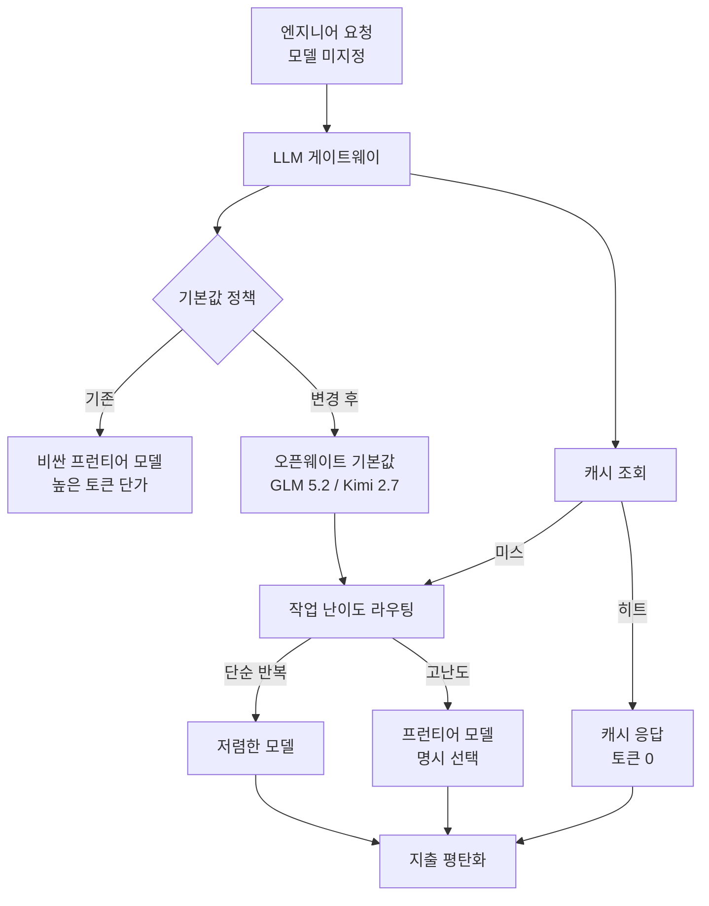

## 개요

AI를 본격적으로 쓰는 조직이라면 한 번쯤 마주치는 딜레마가 있습니다. 직원들이 LLM을 많이 쓸수록 생산성은 오르지만, 토큰 청구서도 함께 기하급수적으로 늘어납니다. 흔한 대응은 사용량에 상한을 걸고, 한도를 넘으면 경고를 보내고, 비싼 모델 사용을 까다롭게 만드는 것입니다. 그런데 이 방식은 비용을 누르는 대신 직원의 생산성에 마찰을 더하는 부작용을 낳습니다.

2026년 6월, 코인베이스 CEO 브라이언 암스트롱이 자사의 다른 해법을 공개했습니다. 그의 표현을 빌리면 "토큰 사용량이 기하급수적으로 늘어나는 와중에 AI 지출을 평평하게 유지하는 법"이고, 결론은 명확합니다. 마찰과 지출 경고가 아니라, 더 나은 기본값과 라우팅과 캐싱으로 푼다는 것입니다. 실제로 코인베이스는 토큰 사용량이 폭증하는 동안 AI 지출을 절반 가까이 줄였다고 밝혔습니다.

ThakiCloud는 다양한 고객 환경에서 모델을 서빙하는 ai-platform을 운영하므로, 추론 비용을 어떻게 통제하느냐는 남의 이야기가 아닙니다. 코인베이스의 전략은 단일 기업의 사내 정책이지만, 그 안에는 모델 서빙 인프라를 운영하는 누구에게나 적용되는 LLMOps 원칙이 담겨 있습니다. 이 글은 그 전략을 사실 그대로 정리하고, 서빙 플랫폼 관점에서 무엇을 시사하는지 분석한 기록입니다.

## 무엇이 핵심인가: 마찰이 아니라 기본값

코인베이스 접근의 출발점은 데이터입니다. 사용량 한도를 조이려다 발견한 사실은, 직원의 91%가 애초에 사용 한도에 닿지도 않는다는 것이었습니다. 즉 비용을 끌어올리는 주범은 "한도를 꽉 채우는 소수의 헤비 유저"가 아니라, 전체 사용의 기본 동작이 비싼 모델로 향해 있다는 구조적 문제였습니다.

여기서 나온 슬로건이 "사용량 제한이 아니라 더 나은 기본값(Better Defaults, not Usage Caps)"입니다. 엔지니어는 여전히 원하는 모델을 자유롭게 고를 수 있습니다. 다만 아무것도 지정하지 않았을 때 도달하는 기본 모델을, 비싼 프런티어 모델이 아니라 저렴한 오픈웨이트 모델로 바꾼 것입니다. 코인베이스는 자사 LLM 게이트웨이에서 GLM 5.2, Kimi 2.7 같은 오픈웨이트 모델을 기본값으로 두는 실험을 진행 중이라고 밝혔습니다.

이 발상의 힘은 인간의 행동 양식을 거스르지 않는다는 데 있습니다. 대부분의 사용자는 기본값을 그대로 씁니다. 기본값을 바꾸면 강제하지 않고도 다수의 행동이 자연스럽게 이동합니다. 한도를 낮추고 경고를 늘리는 방식이 사용자와 시스템 사이에 마찰을 만드는 것과 정반대입니다. 전체 흐름을 도식으로 그리면 다음과 같습니다.

## 세 가지 기법

암스트롱이 제시한 비용 통제는 세 개의 축으로 정리됩니다. 어느 것도 새로운 발명은 아니지만, 셋을 게이트웨이 한 곳에서 조합한다는 점이 핵심입니다.

첫째, **더 똑똑한 모델 라우팅**입니다. 모든 작업을 같은 모델로 처리하지 않고, 각 작업을 그 작업을 완수할 수 있는 가장 저렴한 모델로 보냅니다. 요약이나 분류처럼 단순 반복 작업은 작은 모델로 충분하고, 복잡한 추론이 필요한 작업만 프런티어 모델로 올립니다. 핵심은 "최고 성능 모델이 항상 필요하지는 않다"는 인식입니다. 프런티어 모델의 성능이 결과에 아무 차이를 만들지 않는 일상 작업에 굳이 비싼 모델을 쓸 이유가 없습니다.

둘째, **공격적 캐싱**입니다. 반복되는 질의에 대해 중복 출력을 제거합니다. 같은 질문이 여러 번 들어오면 매번 모델을 호출하는 대신 캐시된 응답을 돌려줍니다. 캐시 히트는 토큰을 전혀 쓰지 않으므로, 반복성이 높은 워크로드일수록 절감 효과가 큽니다. 코드 어시스턴트나 사내 문서 질의처럼 비슷한 질문이 반복되는 환경에서 캐싱은 단순하지만 강력한 레버입니다.

셋째, **저렴한 오픈웨이트 모델로의 전환**입니다. 프런티어 성능이 가치를 더하지 않는 일상 작업에서는 오픈웨이트 모델로 옮깁니다. 앞의 기본값 전략과 맞물려, 라우팅의 기본 종착지 자체를 오픈웨이트로 두는 것입니다. 암스트롱은 더 나아가, 18개월 안에 AI 워크로드의 80%가 99% 더 저렴한 모델로 이동할 것이며, 인공지능 성장의 상한을 정하는 것은 모델 품질이 아니라 에너지와 연산 인프라가 될 것이라고 전망했습니다.

세 기법은 서로를 강화합니다. 라우팅이 작업을 적절한 모델로 분배하고, 캐싱이 반복 호출을 걷어내며, 오픈웨이트 기본값이 분배의 무게중심을 저비용 쪽으로 옮깁니다. 이 조합이 사용량 폭증과 비용 평탄화를 동시에 성립시킨 비결입니다.

## ThakiCloud 제품 적용 시사점

코인베이스의 전략은 사내 LLM 게이트웨이를 가진 단일 기업의 이야기지만, 그 원리는 ThakiCloud의 **ai-platform**이 제공하는 멀티테넌트 모델 서빙의 가치 제안과 정확히 겹칩니다. ai-platform은 쿠버네티스와 Kueue 기반 GPU 스케줄링 위에서 vLLM 등으로 모델을 서빙하는데, 코인베이스가 게이트웨이 한 곳에서 한 일을 우리는 서빙 플랫폼 차원에서 더 깊게 제공할 수 있습니다.

첫째, **라우팅을 플랫폼 기능으로**. 코인베이스는 게이트웨이에서 작업을 모델로 분배했습니다. ThakiCloud ai-platform은 멀티테넌트 환경에서 여러 모델을 동시에 서빙하므로, 테넌트별로 "단순 작업은 작은 모델, 고난도 작업만 큰 모델"이라는 라우팅 정책을 인프라 레벨에서 설정할 수 있습니다. 모델을 직접 호스팅하기 때문에, 외부 API에 의존할 때보다 라우팅 결정의 자유도와 비용 투명성이 큽니다.

둘째, **오픈웨이트 서빙의 경제성**. 코인베이스가 GLM 5.2, Kimi 2.7 같은 오픈웨이트 모델을 기본값으로 둔 핵심 이유는 저비용입니다. ai-platform은 바로 이 오픈웨이트 모델을 온프레미스나 소버린 환경에서 직접 서빙하는 데 특화되어 있습니다. 컨슈머 GPU 양자화 서빙, vLLM 기반 고처리량 추론, 멀티테넌트 자원 격리를 통해 토큰당 서빙 비용을 낮추는 것이 우리의 경쟁력입니다. 외부 프런티어 API의 토큰 단가에 묶이지 않고, 자체 인프라에서 오픈웨이트 모델을 효율적으로 돌릴수록 코인베이스가 말한 "99% 더 저렴한" 영역에 실제로 도달할 수 있습니다.

셋째, **에너지와 연산이 상한이라는 통찰**. 암스트롱은 AI 성장의 상한을 정하는 것이 모델 품질이 아니라 에너지와 연산 인프라라고 봤습니다. 이는 ThakiCloud가 GPU 자원을 Kueue로 효율적으로 스케줄링하고, 온프레미스 비용 효율을 강조하는 방향과 같은 지점을 가리킵니다. 추론 비용이 워크로드를 결정하는 시대에는, 같은 모델을 더 싸게 더 많이 돌리는 서빙 인프라 자체가 차별화 요소가 됩니다.

한편 정책과 감사 관점에서는 ThakiCloud의 Agent-Native Cloud인 **Paxis**도 맞물립니다. 코인베이스의 "기본값 정책"은 본질적으로 게이트웨이를 지나는 모든 요청에 적용되는 정책 게이트입니다. Paxis는 모든 에이전트 행동을 정책 게이트와 감사 로그로 통과시키므로, 어떤 모델이 어떤 작업에 기본으로 쓰였고 비용이 어디서 발생했는지를 추적 가능한 형태로 남길 수 있습니다. 비용 통제는 결국 가시성에서 시작하고, 가시성은 모든 호출이 기록될 때 성립합니다.

## 한계 및 반론

이 전략에도 분명한 한계가 있습니다. 먼저, 라우팅의 정확도 문제입니다. "이 작업은 작은 모델로 충분하다"는 판단이 틀리면 품질이 떨어지고, 그 손실은 토큰 절감액보다 클 수 있습니다. 단순해 보이는 작업이 사실은 미묘한 추론을 요구하는 경우, 저렴한 모델로 라우팅한 대가가 잘못된 결과로 돌아옵니다. 라우팅 정책은 한 번 짜고 끝나는 것이 아니라 지속적인 평가와 보정이 필요합니다.

둘째, 캐싱의 적용 범위입니다. 캐싱은 반복 질의에서 강력하지만, 매번 다른 맥락과 다른 입력이 들어오는 창의적 작업이나 개인화된 작업에서는 히트율이 낮습니다. 모든 워크로드가 캐싱의 혜택을 똑같이 받지는 않으므로, 절감 효과는 워크로드 성격에 크게 의존합니다.

셋째, 오픈웨이트 모델의 품질 격차입니다. "18개월 안에 80%가 99% 저렴한 모델로 이동한다"는 전망은 공격적입니다. 오픈웨이트 모델이 빠르게 따라잡고 있는 것은 사실이지만, 고난도 추론이나 긴 컨텍스트, 안정성이 중요한 영역에서는 여전히 프런티어 모델과의 격차가 존재합니다. 기본값을 오픈웨이트로 두되, 언제 프런티어로 올려야 하는지의 경계를 잘못 그으면 사용자 경험이 나빠집니다. 이 전망은 단정이라기보다 방향성으로 읽는 편이 안전합니다.

그럼에도 코인베이스 사례의 핵심 교훈은 견고합니다. 비용 통제는 사용자에게 마찰을 더하는 방식이 아니라, 기본값과 인프라를 바꾸는 방식으로 풀어야 한다는 것입니다. 그리고 그 인프라를 직접 소유할수록, 즉 모델을 자체 서빙할수록 통제의 폭이 넓어집니다. ThakiCloud ai-platform이 지향하는 저비용 멀티테넌트 서빙이 바로 그 통제의 토대입니다.

## 출처

- [Brian Armstrong 트윗](https://x.com/brian_armstrong/status/2070670644577280109): "How to keep AI spend flat while token usage grows exponentially" (2026-06-27)
- [Coinbase Says AI Costs Are Staying Flat As Token Usage Explodes (CryptoAdventure)](https://cryptoadventure.com/coinbase-says-ai-costs-are-staying-flat-as-token-usage-explodes/)
- [Coinbase CEO Halved AI Costs (Yahoo Finance)](https://finance.yahoo.com/markets/crypto/articles/coinbase-ceo-halved-ai-costs-130000536.html)
