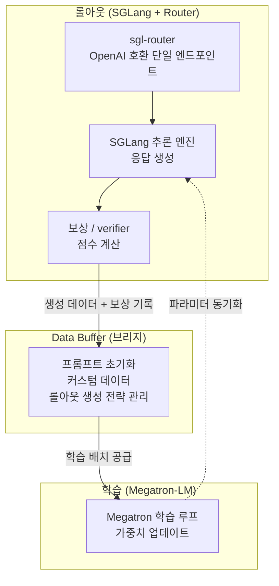

*롤아웃과 학습을 분리해 처리량을 끌어올리는 slime의 비동기 RL 구조를 형상화한 이미지입니다.*

## 개요

Z.ai(구 Zhipu AI)가 2026년 6월 공개한 GLM-5.2는 1M 토큰 컨텍스트와 MIT 라이선스를 가진 오픈웨이트 모델입니다. 코딩과 장기 호흡(long-horizon) 에이전트 작업에서 비공개 상용 모델과 경쟁하는 성능으로 주목을 받았습니다. 그런데 이번 공개에서 모델 가중치만큼이나 중요한 것이 따로 있습니다. 바로 이 모델의 후처리 학습(post-training)을 떠받친 강화학습 인프라 **slime**이 함께 완전 오픈소스로 풀렸다는 점입니다.

대부분의 프런티어 모델은 사전학습 가중치를 공개하더라도, 그 가중치를 실제 쓸만한 에이전트로 다듬은 RL 파이프라인은 공개하지 않습니다. 보상 설계, 롤아웃 생성, 학습 루프를 잇는 인프라야말로 모델 품질을 좌우하는 비공개 노하우이기 때문입니다. slime은 이 영역을 통째로 열어두었고, GLM-5.2뿐 아니라 GLM-5.1, GLM-5, GLM-4.7, GLM-4.6, GLM-4.5까지 동일한 프레임워크로 후처리 학습을 거쳤다고 밝혔습니다. 한 프레임워크가 여러 SOTA급 릴리스를 통과했다는 것은 실험실 코드가 아니라 production에서 검증된 인프라라는 뜻입니다.

ThakiCloud는 K8s 기반의 멀티테넌트 AI/ML SaaS 플랫폼을 운영하면서 다양한 고객 환경에서 모델을 서빙하고 에이전트를 돌립니다. 그래서 "어떤 모델이 좋은가"만큼이나 "그 모델을 어떤 인프라로 만들고 운용하는가"가 늘 핵심 질문입니다. slime은 후자에 대한 공개 레퍼런스라는 점에서 들여다볼 가치가 충분합니다. 이 글에서는 slime의 구조와 설계 철학을 정리하고, 우리 플랫폼의 Kueue GPU 스케줄링·SGLang/vLLM 서빙 스택에 어떤 시사점을 주는지 살펴보겠습니다.

## slime은 무엇인가

slime은 THUDM(칭화대 / Z.ai 계열)이 만든 **RL 스케일링용 LLM 후처리 학습 프레임워크**입니다. 핵심 발상은 단순합니다. 학습은 Megatron-LM이 잘하고, 고속 추론(롤아웃)은 SGLang이 잘하니, 이 둘을 하나의 데이터 흐름으로 묶자는 것입니다. RL 후처리 학습은 "모델이 답을 생성하고(롤아웃) → 그 답에 보상을 매기고 → 그 보상으로 모델을 업데이트"하는 루프를 수없이 반복하는 작업이라, 생성 엔진과 학습 엔진을 얼마나 매끄럽게 잇느냐가 전체 처리량을 결정합니다.

slime은 이 루프를 세 개의 컴포넌트로 분해합니다.

- **학습(Megatron-LM)**: 메인 학습 과정을 담당합니다. Data Buffer에서 데이터를 읽어 모델을 업데이트하고, 학습이 끝나면 롤아웃 모듈과 파라미터를 동기화합니다.
- **롤아웃(SGLang + Router)**: 새 데이터를 생성합니다. 보상과 verifier 출력까지 포함해 Data Buffer에 씁니다. 여기서 sgl-router는 복잡한 에이전트 환경이 단일 HTTP 엔드포인트로 모델과 상호작용할 수 있게 OpenAI 호환 API를 제공합니다.
- **Data Buffer**: 두 세계를 잇는 브리지입니다. 프롬프트 초기화, 커스텀 데이터, 롤아웃 생성 전략을 관리합니다.

자원 관리는 Ray가 맡습니다. 덕분에 학습과 롤아웃을 같은 GPU에 올릴지 다른 GPU로 분리할지를 플래그 하나로 전환할 수 있습니다.

## 두 가지 실행 모드: colocated와 disaggregated

slime의 가장 실용적인 설계 결정은 동일한 코드로 두 가지 배치 모드를 지원한다는 점입니다.

**Colocated(동거) / 동기 모드**는 학습과 롤아웃을 같은 GPU 풀에 올립니다. `--colocate` 플래그 하나로 켜집니다. GPU가 넉넉하지 않은 환경에서 자원을 최대한 아껴 쓰기에 좋고, 생성과 학습이 같은 자원을 시분할로 번갈아 사용합니다.

**Disaggregated(분리) / 비동기 모드**는 학습 GPU와 롤아웃 GPU를 분리합니다. 생성이 학습을 기다리지 않고 계속 돌 수 있어 처리량이 올라갑니다. GLM-5.2가 강조한 "비동기 에이전트 RL"이 바로 이 모드 위에서 동작합니다. 생성을 학습에서 떼어내면, 멀티턴·멀티툴 상호작용처럼 한 에피소드가 길고 불규칙한 워크로드에서 GPU가 노는 시간을 크게 줄일 수 있습니다.

이 선택지는 운영자에게 중요합니다. 같은 프레임워크로 소규모 실험은 colocated로 싸게 돌리고, 대규모 production 학습은 disaggregated로 throughput을 끌어올리는 식의 점진적 확장이 가능하기 때문입니다.

## 에이전트 RL을 위한 설계

slime이 GLM-5.x 같은 에이전트 모델 학습에 쓰인 데는 이유가 있습니다. 멀티턴 에이전트 워크로드를 정조준한 기능이 들어 있습니다.

- **PD Disaggregation**: prefill과 decode의 자원 요구가 다른 멀티턴·에이전트 워크로드를 위해 두 단계를 분리합니다.
- **Router의 session affinity**: 멀티턴 에이전트가 같은 세션을 유지하도록 라우팅 정책을 제공합니다. 한 에이전트의 여러 턴이 일관된 상태로 이어지게 합니다.
- **Delta Weight Sync**: 학습/추론 분리 환경에서 가중치 변화분만 동기화해 통신 비용을 줄입니다.
- **단일 OpenAI 호환 엔드포인트**: sgl-router 덕분에 복잡한 에이전트 환경이 HTTP 요청만으로 모델과 상호작용합니다. 환경 코드를 RL 프레임워크 내부에 욱여넣을 필요가 없습니다.

마지막 항목이 특히 실용적입니다. 코드 편집, 툴 사용, 다단계 문제 해결 같은 장기 호흡 작업의 환경을 OpenAI API 호출 형태로 추상화하면, 기존 에이전트 환경을 거의 그대로 RL 학습 루프에 연결할 수 있습니다. Z.ai는 여기에 reward hacking을 막는 "anti-hacking" 장치를 더해 장기 작업에서 모델이 보상을 편법으로 따먹는 것을 억제했다고 설명합니다.

## 설치와 사용 개요

slime은 GitHub([THUDM/slime](https://github.com/THUDM/slime))에서 받을 수 있고, SGLang-native로 설계되어 SGLang 추론 스택과 Megatron-LM 학습 스택을 전제로 합니다. AMD Instinct GPU에 대한 day-0 지원도 ROCm 블로그를 통해 공개되어, NVIDIA 외 가속기에서도 동작이 검증되어 있습니다.

다만 정직하게 말하면, slime의 실제 RL 후처리 학습 루프를 의미 있게 재현하려면 멀티 GPU 클러스터(통상 8장 이상의 데이터센터급 가속기)와 Megatron·SGLang·Ray가 함께 구성된 환경이 필요합니다. 본 글은 단일 노드 샌드박스에서 전체 RL 학습을 돌려 수치를 캡처하지 않았습니다. 따라서 학습 처리량이나 수렴 속도 같은 벤치마크 수치는 제시하지 않으며, 아래의 production 검증 사례는 공개된 1차 자료에 근거한 것입니다. 임의의 성능 수치를 지어내지 않는 것이 우리 블로그의 원칙입니다.

구조적으로 운영자가 만질 표면은 명확합니다. `--colocate` 같은 모드 플래그로 배치 방식을 정하고, Data Buffer의 커스텀 데이터 생성 인터페이스로 자신의 도메인 롤아웃 전략을 끼워 넣고, sgl-router 엔드포인트에 에이전트 환경을 붙이는 순서입니다. 프레임워크가 versatility를 강조하는 이유가 여기에 있습니다. 롤아웃 인터페이스가 완전히 커스터마이즈 가능하므로, 범용 RL 알고리즘부터 도메인 특화 에이전트 학습까지 같은 골격 위에서 구성할 수 있습니다.

## GLM-5.x 검증 사례

slime은 가장 잘 검증된 오픈 RL 후처리 학습 프레임워크 중 하나로 꼽힙니다. GLM-5.2, GLM-5.1, GLM-5, GLM-4.7, GLM-4.6, GLM-4.5까지 여러 SOTA급 릴리스가 이 프레임워크의 완전한 학습 루프를 통과했습니다. GLM-5.2는 generation을 training에서 분리하는 비동기 인프라 위에서 장기 호흡·멀티툴 상호작용으로부터 학습하는 새로운 async agent-RL 알고리즘으로 후처리되었다고 밝혔습니다. 보도된 바로는 GLM-5.2의 전체 후처리 학습이 약 이틀 만에 끝났다고 하는데, 이 소요 시간 수치는 1차 공식 문서로 교차검증하지 못해 [추정]으로 둡니다.

핵심은 숫자가 아니라 재현 가능성입니다. 모델 가중치(MIT)와 학습 프레임워크가 모두 공개되었다는 것은, 충분한 컴퓨트를 가진 조직이라면 GLM-5.2의 후처리 레시피를 자신의 도메인 데이터로 다시 밟아볼 수 있다는 뜻입니다. 이는 폐쇄형 모델에서는 불가능한, 오픈 생태계만의 레버리지입니다.

## ThakiCloud 제품 적용 시사점

slime의 비동기 RL 구조는 ThakiCloud의 두 제품 레이어에 직접 닿아 있습니다.

ai-platform 관점에서 보면, RL 학습 워크로드는 rollout(추론)과 train(역전파)이라는 성격이 다른 두 부하를 동시에 요구합니다. slime이 Ray로 colocated와 disaggregated를 전환하는 방식은 Kueue의 GPU 큐 모델과 구조적으로 잘 맞습니다. disaggregated 모드에서 rollout과 train을 별도 잡으로 분리하면 Kueue가 각각을 독립 큐로 스케줄할 수 있어, 멀티테넌트 클러스터에서 GPU 점유율을 높이고 컴퓨트 비용을 낮출 수 있습니다. rollout 서빙에 vLLM을 쓰는 우리 스택은 연속 배칭과 KV 캐시 관리 노하우를 학습 인프라와 공유합니다. 덕분에 데이터를 외부로 내보내지 않고 자체 클러스터에서 후처리까지 끝내는 온프레미스 RL 파이프라인이 현실적인 제품 선택지가 됩니다.

Paxis 관점에서는 연결이 더 직접적입니다. Paxis는 ai-platform 위에서 동작하는 ThakiCloud의 에이전트 제어 평면으로, 960개 이상의 스킬을 BM25로 선택하는 Skill Harness와 자가진화 스킬 루프를 핵심으로 합니다. slime 같은 RL 프레임워크는 바로 이 자가진화 루프의 학습 백엔드가 됩니다. 고객 도메인 데이터로 rollout을 생성하고 보상 신호를 매겨 스킬을 강화학습으로 갱신하면, Paxis의 도메인 에이전트는 반복 사용 속에서 점점 개선됩니다. sgl-router의 OpenAI 호환 엔드포인트는 Paxis의 MCP 커넥터와 기존 툴 환경을 RL 루프에 연결하는 접착제 역할을 합니다. 두 제품은 이렇게 맞물립니다. ai-platform이 GPU 큐와 온프레미스 RL 파이프라인을 제공하고, Paxis가 그 파이프라인을 스킬 진화의 엔진으로 소비합니다.

이는 현재의 완성 사실이 아니라 로드맵에 가깝습니다. 다만 K8s, Kueue, vLLM이라는 ai-platform 스택과 Paxis의 자가진화 스킬 아키텍처가 slime이 전제하는 구성 요소와 구조적으로 일치한다는 점은, 이 방향이 억지 끼워맞춤이 아님을 보여줍니다.

## 한계 및 반론

slime이 만능은 아닙니다. 몇 가지 현실적 제약을 분명히 해 둡니다.

가장 큰 진입 장벽은 **컴퓨트와 운영 복잡도**입니다. Megatron + SGLang + Ray를 동시에 세우고, 멀티 GPU에서 학습/롤아웃을 조율하는 일은 결코 가볍지 않습니다. 단일 GPU나 소규모 팀이 손쉽게 굴릴 수 있는 도구가 아니며, RL 후처리 학습 자체가 사전학습 못지않은 인프라 투자를 요구합니다. "프레임워크가 공개되었다"와 "우리가 RL 후처리를 돌릴 수 있다" 사이에는 상당한 거리가 있습니다.

둘째, **RL 후처리의 난이도**입니다. 보상 설계, reward hacking 방지, 학습 안정성은 프레임워크가 대신 풀어주지 않는 본질적 어려움입니다. slime은 인프라를 제공할 뿐, 좋은 보상 함수와 안정적인 학습 레시피는 여전히 사용자의 몫입니다. Z.ai가 anti-hacking을 별도로 강조한 것 자체가 이 영역이 까다롭다는 방증입니다.

셋째, **검증 범위의 한계**입니다. 본 글은 slime의 공개 문서와 보도를 근거로 구조를 분석했을 뿐, 전체 RL 학습 루프를 직접 재현해 처리량을 측정하지 않았습니다. 따라서 "GLM-5.2급 학습을 며칠 만에"와 같은 주장은 우리가 독립적으로 확인한 사실이 아닙니다. 도입을 검토한다면, 작은 모델·작은 태스크로 colocated 모드부터 파일럿해 우리 환경에서의 실제 비용을 측정하는 단계가 반드시 선행되어야 합니다.

그럼에도 모델 가중치와 학습 프레임워크가 함께 열린 사건은 오픈 LLM 생태계에서 드문 투명성입니다. ThakiCloud처럼 인프라를 직접 운용하는 플랫폼에게는, 남이 만든 모델을 쓰는 것을 넘어 후처리 단계까지 통제권을 가질 수 있는 선택지가 늘어난 셈입니다.

## 출처 (Sources)

- [THUDM/slime - GitHub](https://github.com/THUDM/slime)
- [slime: An SGLang-Native Post-Training Framework for RL Scaling - LMSYS Org](https://www.lmsys.org/blog/2025-07-09-slime/)
- [GLM-5.2: Built for Long-Horizon Tasks - Hugging Face Blog](https://huggingface.co/blog/zai-org/glm-52-blog)
- [Day-0 Support for the SGLang-Native RL Framework slime on AMD Instinct GPUs - ROCm Blogs](https://rocm.blogs.amd.com/artificial-intelligence/slime/README.html)
