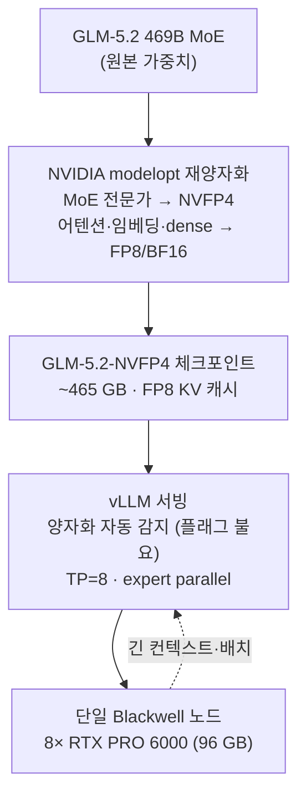

## 개요

469B 규모의 MoE 모델을 자체 인프라에서 서빙한다는 말은, 1년 전만 해도 멀티 노드 GPU 클러스터를 전제로 했습니다. 그런데 [vLLM 프로젝트](https://recipes.vllm.ai/zai-org/GLM-5.2)와 NVIDIA가 공개한 [GLM-5.2-NVFP4 체크포인트](https://huggingface.co/nvidia/GLM-5.2-NVFP4)는 이 전제를 단일 노드로 끌어내립니다. 8장짜리 Blackwell 노드 한 대에 469B 모델을 올리고 vLLM으로 바로 서빙하는 레시피가 나온 것입니다.

이 글은 그 레시피를 뜯어봅니다. NVFP4 포맷 자체의 배경은 이전 글 [NVFP4로 Blackwell GPU에서 LLM 서빙 비용 절반 줄이기](https://thakicloud.github.io/ko/llmops/nvfp4-blackwell-llm-serving-quantization/)에서 다뤘으니, 여기서는 "특정 프런티어 모델 하나를 실제로 어떻게 올리는가"에 집중합니다. 양자화 구조, 공식 vLLM 서빙 명령, 그리고 공개 수치를 근거로 한 메모리 사이징 계산을 차례로 정리하고, ThakiCloud ai-platform 운용 관점에서 무엇을 가져갈 수 있는지 짚습니다.

먼저 분명히 해두자면, 이 글의 실험은 실제 Blackwell 노드에서 모델을 띄운 것이 아닙니다. 해당 하드웨어를 이 세션에서 보유하지 못했기에, 모델 서빙 자체는 수행하지 않았습니다. 대신 공식 모델카드의 검증된 수치를 인용하고, 그 위에서 메모리 사이징을 결정론적으로 계산했습니다. 벤치마크 수치를 지어내지 않았습니다.


## GLM-5.2-NVFP4는 무엇인가

GLM-5.2-NVFP4는 GLM-5.2의 가중치와 활성화를 NVFP4 데이터 타입으로 양자화해, vLLM과 SGLang에서 곧바로 추론할 수 있게 만든 체크포인트입니다. 핵심은 "전부 4비트"가 아니라 **혼합 정밀도**라는 점입니다.

NVIDIA modelopt 재양자화 방식에서는 MoE 전문가 선형층(expert linears)만 NVFP4로 떨어지고, 공유 전문가(shared experts)·어텐션·임베딩·초기 dense 층은 FP8/BF16으로 남습니다. 여기에 KV 캐시는 FP8을 씁니다. 정밀도에 민감한 부분은 보존하고, 파라미터 대부분을 차지하는 MoE 전문가만 공격적으로 압축하는 전략입니다.

서빙 스택 전체를 그림으로 정리하면 다음과 같습니다.




여기에 더해, 커뮤니티에서는 REAP 가지치기를 적용한 `GLM-5.2-NVFP4-REAP-469B` 변형도 돌고 있습니다. 250K 이상 컨텍스트를 목표로 DeepSeek Sparse Attention과 MTP 추측 디코딩(speculative decode)을 함께 쓰는 레시피이며, 4× RTX PRO 6000(SM120) 구성이나 3× DGX Spark 파이프라인 병렬 구성 같은 변형이 공개돼 있습니다.

## 설치 및 통합

NVIDIA가 공식 모델카드에서 제시하는 vLLM 서빙 명령은 다음과 같습니다. 검증된 구성은 단일 노드 8× RTX PRO 6000 Blackwell(각 96 GB), 텐서 병렬 8입니다.

```bash
vllm serve nvidia/GLM-5.2-NVFP4 \
  --tensor-parallel-size 8 \
  --enable-expert-parallel \
  --reasoning-parser glm45 \
  --tool-call-parser glm47 \
  --enable-auto-tool-choice \
  --kv-cache-dtype fp8_e4m3 \
  --served-model-name glm-5.2-nvfp4
```

몇 가지가 눈에 띕니다.

- **`--quantization` 플래그가 없습니다.** vLLM이 체크포인트에서 양자화 방식을 자동 감지하기 때문입니다. 운영자가 포맷을 손으로 지정할 필요가 없습니다.
- **`--enable-expert-parallel`**: MoE 전문가를 GPU에 분산해 expert parallel로 처리합니다. TP와 함께 쓰여 469B 모델을 8장에 펼칩니다.
- **`--kv-cache-dtype fp8_e4m3`**: KV 캐시를 FP8로 둬 컨텍스트·배치 여유를 확보합니다.
- **`--reasoning-parser glm45` / `--tool-call-parser glm47`**: GLM 계열의 추론 토큰과 도구 호출 포맷을 파싱합니다. thinking은 기본 활성화입니다.

체크포인트를 실행할 vLLM 버전 요구는 모델카드의 토론 스레드에서 확인하는 것이 안전합니다. NVFP4 자동 감지와 expert parallel 경로는 비교적 최근 vLLM에서 안정화됐기 때문입니다.


## 실제 실험 결과

앞서 밝혔듯 모델 서빙은 직접 수행하지 못했습니다(Blackwell GPU 미보유). 그래서 **공개 수치만으로 메모리 사이징을 결정론적으로 계산**했습니다. 입력은 검증된 사실 세 가지뿐입니다. 469B 파라미터, 공개된 NVFP4-혼합 체크포인트 크기 ~465 GB, 그리고 8× 96 GB 노드 구성입니다.


계산 결과는 다음과 같습니다.

- BF16 기준 469B 가중치는 약 938 GB, FP8은 약 469 GB입니다.
- 공개된 NVFP4-혼합 체크포인트는 약 465 GB로, **순수 FP8(469 GB)과 거의 같습니다.** 순수 4비트라면 이론상 234 GB까지 떨어지지만, 이 체크포인트는 MoE 전문가만 4비트라 그 수준까지 내려가지 않습니다.
- 8× 96 GB = 총 768 GB 노드에 465 GB 가중치를 올리면, KV 캐시와 활성화에 약 303 GB가 남습니다. VRAM 사용률은 약 60.5%입니다.

여기서 정직하게 짚어야 할 점이 있습니다. **NVFP4-혼합의 진짜 이득은 "저장 용량 반토막"이 아닙니다.** 가중치 풋프린트만 보면 FP8과 비슷합니다. 실제 이득은 두 곳에서 나옵니다. 하나는 Blackwell 텐서 코어의 NVFP4 연산 처리량이고, 다른 하나는 FP8 KV 캐시가 만들어 주는 컨텍스트·배치 여유 공간입니다. 즉 이 체크포인트의 가치는 "더 작게"가 아니라 "한 노드에 올린 채로 더 빠르고 더 길게"에 있습니다. 마케팅 수사에 흔히 등장하는 "4비트로 메모리 절반" 같은 표현을 이 케이스에 그대로 적용하면 틀립니다.

## ThakiCloud 제품 적용 시사점

이 레시피는 ThakiCloud의 **ai-platform** 관점에서 직접적인 함의를 가집니다. ai-platform은 쿠버네티스와 Kueue 기반 GPU 스케줄링 위에서 vLLM 서빙과 멀티테넌트 격리를 제공하는 AI/ML 인프라입니다.

- **단일 노드 프런티어 서빙 = 스케줄링이 단순해집니다.** 469B 모델이 한 노드(TP=8)에 들어가면, 멀티 노드 분산 서빙에서 발생하는 노드 간 통신·배치 복잡도가 사라집니다. Kueue 입장에서는 "8 GPU를 가진 노드 한 대"라는 깔끔한 자원 단위로 큐잉할 수 있어, 멀티테넌트 환경에서 GPU 할당과 회수가 단순해집니다.
- **온프렘·소버린 시나리오에 잘 맞습니다.** 국정원 요구 대응이나 데이터 반출이 금지된 고객 환경에서, 프런티어급 모델을 단일 노드 온프레미스로 self-hosting할 수 있다는 것은 큰 차별점입니다. 외부 API 의존 없이 자체 인프라에서 469B 모델을 돌릴 수 있습니다.
- **VRAM 여유 = 멀티테넌트 처리량.** 계산된 303 GB의 KV·활성화 여유는 긴 컨텍스트나 큰 배치로 환산됩니다. 같은 노드에서 더 많은 동시 요청을 소화한다는 뜻이고, 이는 멀티테넌트 SaaS의 GPU당 단가 경쟁력으로 이어집니다.
- **양자화 자동 감지 = 운영 표준화.** vLLM이 포맷을 자동 감지하므로, 다양한 양자화 체크포인트를 같은 서빙 템플릿으로 배포할 수 있습니다. ai-platform의 서빙 매니페스트를 모델별로 분기하지 않아도 됩니다.

낮은 서빙 비용은 단순한 인프라 미덕이 아니라 제품 경쟁력입니다. 한 노드에 프런티어 모델을 올리고 VRAM의 40%를 처리량 여유로 남기는 구성은, 고객사에 제시하는 GPU당 TCO를 직접 끌어내립니다.


## 한계 및 반론

먼저 가장 큰 한계는 이 글 자체가 안고 있습니다. 실측 벤치마크가 없습니다. 토큰 처리량, 지연 시간, 정확도 회귀 같은 수치는 실제 Blackwell 노드에서 서빙해 봐야 나옵니다. 이 글의 숫자는 공개 체크포인트 크기에 기반한 사이징 계산이지, 런타임 측정이 아닙니다.

둘째, 혼합 정밀도 양자화의 품질 영향은 별도 검증이 필요합니다. MoE 전문가를 4비트로 떨어뜨리면 일부 태스크에서 정확도 회귀가 있을 수 있습니다. 모델카드의 평가 수치를 그대로 신뢰하기보다, 실제 사용 도메인에서 회귀 테스트를 돌려 확인해야 합니다.

셋째, 하드웨어 종속성입니다. 이 레시피의 전제는 Blackwell입니다. NVFP4 텐서 코어가 없는 Hopper(H100) 세대에서는 같은 체크포인트의 이점을 그대로 누릴 수 없습니다. 즉 이 구성은 "Blackwell을 이미 도입했거나 도입할 조직"에게만 직접적인 선택지입니다. 기존 H100 자산이 많은 환경에서는 FP8 경로가 여전히 현실적인 기준선입니다.


## 출처

- [nvidia/GLM-5.2-NVFP4 모델카드 (Hugging Face)](https://huggingface.co/nvidia/GLM-5.2-NVFP4)
- [GLM-5.2 vLLM 레시피](https://recipes.vllm.ai/zai-org/GLM-5.2)
- [GLM-5.2-NVFP4-REAP-469B SM120 서빙 레시피 (0xSero/glm-5.2-sm120)](https://github.com/0xSero/glm-5.2-sm120)
- [GLM-5.2 469B DGX Spark 파이프라인 병렬 서빙 (bird/GLM-spark)](https://github.com/bird/GLM-spark)
