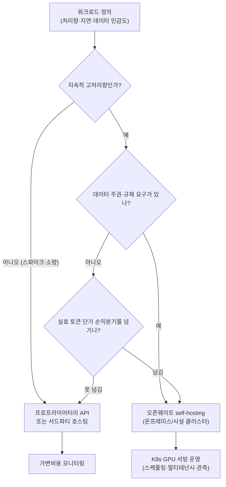

2026년 중반의 오픈웨이트 모델 지형을 한 문장으로 요약하면 이렇습니다. **격차는 좁혀졌고, 더 벌어지지 않고 있습니다.** OpenRouter가 6월에 정리한 라운드업은 오픈웨이트 모델이 프런티어 랩과 3~6개월 정도의 능력 격차를 유지하면서도 그 간격이 확대되지 않는다고 봅니다. 이 명제가 맞다면, 조직이 내려야 할 진짜 결정은 더 이상 "어떤 모델이 가장 똑똑한가"가 아닙니다. "이 워크로드를 어디서, 어떤 비용으로 돌릴 것인가"입니다.

저희 ThakiCloud는 K8s 기반 AI/ML SaaS 플랫폼에서 모델 서빙을 다룹니다. 그래서 이 변화를 모델 카탈로그가 아니라 **self-hosting 경제학**의 관점에서 읽습니다. 오픈웨이트가 프런티어급으로 올라온 순간, self-hosting은 이상주의가 아니라 비용 계산의 문제가 됩니다. 이 글에서는 2026년 중반의 대표 오픈웨이트 모델을 근거로 그 손익분기가 어디쯤 형성되는지, 그리고 그 결정을 K8s 위에서 어떻게 운영 가능하게 만드는지를 짚어보겠습니다.

## 격차는 더 벌어지지 않는다: 2026년 중반 오픈웨이트 지형

먼저 사실관계입니다. 아래 네 모델은 여러 독립 출처(Artificial Analysis, Hugging Face 모델 카드, 각 랩의 발표)로 교차검증한 수치이며, 단일 벤치 한 곳에만 의존하지 않았습니다.

| 모델 | 규모(총/활성) | 라이선스 | AA 지능지수 | 비고 |
|---|---|---|---|---|
| DeepSeek V4 Flash | 284B / 13B (MoE) | MIT | ~40 | SWE-bench Verified 79.0%, 1M 컨텍스트 |
| GLM-5.2 (Z AI) | 753B | MIT | 51 | 오픈웨이트 1위, 전체 4위권 |
| MiniMax M3 | 428B / 23B (MoE) | 커뮤니티 라이선스 | 44 | 네이티브 멀티모달, 1M 컨텍스트 |
| NVIDIA Nemotron 3 Ultra | 550B / 55B (MoE) | OpenMDW | 48 | 미국産 오픈모델, 300+ tok/s |

몇 가지가 눈에 띕니다. **GLM-5.2**는 Artificial Analysis 지능지수에서 51점으로 오픈웨이트 1위에 올랐고, 폐쇄형까지 포함해도 상위권에 자리합니다. 흥미로운 점은 같은 랭킹에서 상위 폐쇄형 모델(Fable 5, Opus 4.8, GPT-5.5)이 여전히 정상에 있다는 사실입니다. 즉 "오픈웨이트가 프런티어를 추월했다"는 과장은 정확하지 않습니다. 정확한 표현은 **"프런티어가 도망가지 못하고 있다"**입니다. 따라잡힌 쪽이 멈춘 게 아니라, 추격하는 쪽이 충분히 가까워졌다는 뜻입니다.

**DeepSeek V4 Flash**는 코딩 에이전트 파이프라인에 곧바로 투입할 만한 첫 오픈웨이트로 평가받습니다. SWE-bench Verified 79.0%는 같은 계열 Pro 변형과 1.6점 차이에 불과하면서, 가격은 백만 토큰당 입력 $0.14 / 출력 $0.28 수준입니다. **MiniMax M3**는 이 묶음에서 유일하게 네이티브 멀티모달(이미지·비디오)을 제공해 UI 자동화나 스크린샷-투-코드 같은 워크로드에 강점이 있습니다. **Nemotron 3 Ultra**는 NVIDIA가 Computex 2026에서 공개한 미국産 오픈모델로, 300 tok/s를 넘는 처리량과 엔터프라이즈 친화적 라이선스를 내세웁니다.

여기서 한 가지 단서를 답니다. OpenRouter 원문에는 "미국 수출통제로 특정 폐쇄형 모델이 비활성화되어 그 빈자리에서 GLM-5.2가 부상했다"는 지정학적 서술이 포함되어 있습니다. 그러나 같은 시점의 공개 벤치마크 랭킹에는 해당 폐쇄형 모델들이 여전히 정상에 올라 있어, 이 인과 주장은 교차검증되지 않습니다. 따라서 이 글에서는 검증된 모델·성능·가격 사실만 인용하고, 추측성 인과 해석은 다루지 않습니다.

## 비용의 재계산: 토큰당 단가가 아니라 운영 총비용

오픈웨이트가 프런티어급으로 올라오면 비용 논의의 축이 바뀝니다. 과거에는 "성능을 어디까지 포기하고 비용을 아낄 것인가"였다면, 지금은 **"같은 지능을 가장 싸게 어디서 얻을 것인가"**입니다. 그리고 이 질문의 답은 토큰당 단가표만으로는 나오지 않습니다.

세 가지 비용 모드를 구분해야 합니다.

첫째, **프로프라이어터리 API**입니다. 운영 부담이 없고 즉시 최고 성능에 접근하지만, 사용량에 정비례하는 가변비용이며 데이터가 외부로 나갑니다. 트래픽이 적거나 스파이크성이거나, 최상위 성능이 반드시 필요한 워크로드에 합리적입니다.

둘째, **오픈웨이트 + 서드파티 호스팅**입니다. 가중치는 공개되어 있되 실행은 외부 추론 제공자에 맡깁니다. 토큰 단가는 폐쇄형보다 크게 낮지만(오픈웨이트 라운드업이 강조하는 지점), 여전히 사용량 기반 과금이고 데이터 거버넌스는 제공자에 의존합니다.

셋째, **오픈웨이트 + self-hosting**입니다. 가중치를 직접 받아 자사(또는 온프레미스) GPU에서 서빙합니다. 비용 구조가 가변에서 **고정비(GPU 상각 + 운영)**로 바뀝니다. 핵심은 손익분기입니다. 일정 수준 이상의 지속적 처리량이 나오면, 고정비를 토큰 수로 나눈 실효 단가가 어떤 API 단가보다도 낮아지는 구간이 생깁니다. 데이터가 경계 밖으로 나가지 않는다는 점은 규제·주권 요구가 있는 조직에는 비용이 아니라 전제 조건입니다.

이 결정 흐름에서 가장 자주 빠지는 함정은 **2단계와 3단계를 토큰 단가표 한 줄로 판단하는 것**입니다. self-hosting의 진짜 비용은 가중치 가격(공개라 0원)이 아니라 GPU 확보·서빙 스택·스케줄링·관측·운영 인력입니다. 그래서 "오픈웨이트는 공짜"라는 문장은 절반만 맞습니다. 모델은 공짜지만 **운영은 공짜가 아닙니다.** 이 운영을 얼마나 싸고 안정적으로 만드느냐가 self-hosting 경제학의 본체입니다.

## ThakiCloud 제품 적용 시사점

오픈웨이트의 self-hosting 경제학은 ThakiCloud가 두 제품으로 정면으로 다루는 문제입니다.

**ai-platform 렌즈 (인프라·서빙).** ThakiCloud의 ai-platform은 K8s 기반에서 모델 서빙을 운영합니다. self-hosting의 손익분기를 실제로 당기는 것은 결국 인프라 효율입니다. Kueue 기반 GPU 잡 스케줄링으로 값비싼 가속기의 유휴를 줄이고, vLLM 같은 고처리량 서빙 엔진과 양자화(예: FP8, NVFP4)로 같은 하드웨어에서 더 많은 토큰을 뽑아내면, 위 결정 흐름의 "실효 토큰 단가 손익분기"가 더 낮은 처리량에서도 충족됩니다. 멀티테넌트 구조는 여러 워크로드가 GPU 풀을 공유하게 해 고정비를 분산시킵니다. 온프레미스·소버린 배포는 데이터 주권 요구를 비용 페널티 없이 충족하는 경로이며, 이는 국내 규제·보안 요건이 강한 환경에서 특히 중요합니다. 요컨대 ai-platform은 위 다이어그램의 가장 오른쪽 단계, **K8s GPU 서빙 운영**을 상품화한 것입니다.

**Paxis 렌즈 (에이전트 경제성).** 저비용 서빙은 그 자체로 끝나지 않고 에이전트 경제성을 만듭니다. DeepSeek V4 Flash처럼 프런티어급 코딩 성능을 백만 토큰당 수십 센트에 얻을 수 있게 되면, 다단계 에이전트 워크플로의 토큰 소비가 비로소 감당 가능해집니다. ThakiCloud의 Paxis는 ai-platform 위에서 도는 Agent-Native Cloud 제어 평면으로, 960개 이상의 스킬을 BM25로 선택해 격리된 샌드박스에서 실행하고 모든 행동을 정책 게이트와 감사 로그로 통과시킵니다. 싼 서빙(ai-platform)이 에이전트 호출의 단가를 낮추면, 같은 예산으로 더 깊은 DAG 멀티에이전트 오케스트레이션이 가능해집니다. 즉 self-hosting 경제학은 인프라 절감에 그치지 않고, 그 위에서 도는 에이전트 계층의 설계 자유도를 직접 넓힙니다.

## 한계 및 반론

이 글의 낙관을 스스로 반박해 보겠습니다.

첫째, self-hosting이 항상 더 싸지는 않습니다. 손익분기는 지속적 고처리량을 전제로 합니다. 트래픽이 적거나 불규칙하면 고정비를 회수하지 못해 API가 더 쌉니다. GPU 상각·전력·냉각·운영 인력을 빠뜨린 비교는 self-hosting을 실제보다 싸게 보이게 합니다.

둘째, 벤치마크 수치는 신뢰 구간을 가집니다. 여기 인용한 AA 지능지수나 SWE-bench 점수는 특정 평가 환경의 측정값이며, 실제 워크로드 성능과 정확히 일치하지 않습니다. 일부 신규 모델의 벤치는 발표 초기에 독립 재현이 충분치 않을 수 있어, 도입 전 자사 워크로드로 직접 평가하는 절차가 필요합니다.

셋째, 라이선스와 출처를 확인해야 합니다. "오픈웨이트"는 동질적이지 않습니다. MIT(DeepSeek, GLM)와 커뮤니티 라이선스(MiniMax), OpenMDW(Nemotron)는 상업적 재배포·파인튜닝 권리가 다릅니다. 모델 출처 국가와 데이터 정책도 규제 환경에 따라 도입 가능 여부를 가릅니다.

넷째, 모델 지형은 빠르게 늙습니다. 위 표는 2026년 중반의 스냅샷이며 몇 달이면 갱신됩니다. 그래서 핵심은 특정 모델 이름이 아니라 변하지 않는 원리입니다. **오픈웨이트가 프런티어급에 도달한 이상, 비용·주권 요구가 큰 워크로드일수록 self-hosting의 손익분기는 계속 유리해집니다.** 모델은 바뀌어도 이 방향은 바뀌지 않습니다.

## 출처

- [The Open Weight Models that Matter: June 2026 · OpenRouter Blog](https://openrouter.ai/blog/insights/the-open-weight-models-that-matter-june-2026/)
- [GLM-5.2 is the new leading open weights model on the Artificial Analysis Intelligence Index](https://artificialanalysis.ai/articles/glm-5-2-is-the-new-leading-open-weights-model-on-the-artificial-analysis-intelligence-index)
- [NVIDIA Nemotron 3 Ultra released · Artificial Analysis](https://artificialanalysis.ai/articles/nvidia-nemotron-3-ultra-released)
- [DeepSeek V4 Flash · OpenRouter](https://openrouter.ai/deepseek/deepseek-v4-flash)
- [GLM-5.2 is probably the most powerful text-only open weights LLM · Simon Willison](https://simonwillison.net/2026/jun/17/glm-52/)
