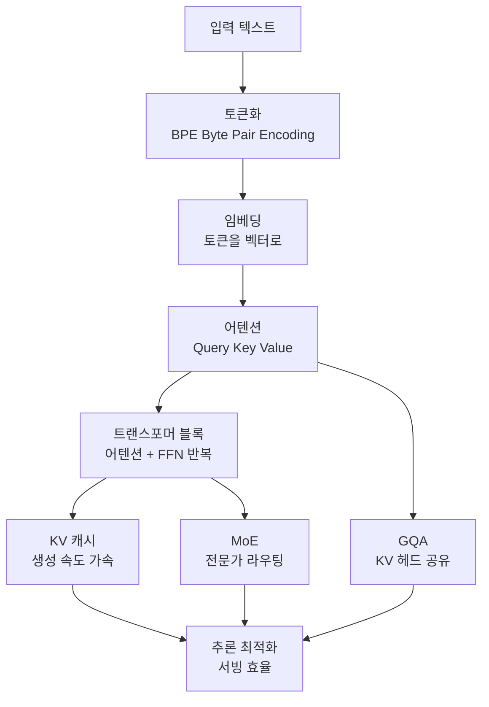

## 개요

LLM 서빙을 운영하다 보면 이상한 지점에 도달합니다. vLLM을 배포하고, GPU 사용률을 모니터링하고, 배치 크기를 조정하면서도 정작 "왜 이 요청이 KV 캐시를 이만큼 점유하는가", "GQA가 정확히 무엇을 줄여서 메모리 대역폭을 아끼는가"를 문장으로 설명하지 못하는 순간이 옵니다. 도구는 다룰 줄 알지만 그 아래의 원리는 흐릿한 상태입니다. 이 간극은 최적화를 감에 의존하게 만들고, 장애가 났을 때 원인을 추론하지 못하게 합니다.


이 문제를 정면으로 겨냥한 학습 리소스가 [amitshekhariitbhu/llm-internals](https://github.com/amitshekhariitbhu/llm-internals)입니다. 토큰화에서 시작해 어텐션, 트랜스포머 구조, KV 캐시, 그리고 추론 최적화까지 이어지는 순서로 블로그와 영상을 엮은 단계별 학습 리포지토리입니다. 원저자는 Amit Shekhar이며, 흩어진 일회성 튜토리얼 대신 하나의 정돈된 멘탈 모델을 세우도록 주제를 배열했습니다.

ThakiCloud는 K8s 위에서 다양한 고객 환경에 모델을 서빙하는 ai-platform을 운영합니다. 서빙 비용과 지연을 결정하는 요소는 대부분 이 리포지토리가 다루는 내부 구조에서 나옵니다. 그래서 이 글은 단순한 리소스 소개가 아니라, 각 주제가 인프라 엔지니어에게 왜 직접적인 무기가 되는지를 함께 정리합니다.

## 이 리소스는 무엇인가

llm-internals는 코드를 실행하는 프레임워크가 아니라 **학습 경로(learning path)** 입니다. LLM이 입력을 받아 다음 토큰을 내놓기까지의 파이프라인을 따라가면서, 각 단계에 필요한 개념을 외부 자료와 함께 순서대로 제시합니다. 핵심은 "무엇을 어떤 순서로 이해해야 전체 그림이 맞춰지는가"라는 커리큘럼 설계에 있습니다.


리포지토리가 다루는 주요 주제는 다음과 같은 흐름을 따릅니다.



이 순서가 중요한 이유는, 뒤쪽 주제가 앞쪽 주제 없이는 이해되지 않기 때문입니다. KV 캐시는 어텐션의 Key/Value가 무엇인지 알아야 의미가 통하고, GQA는 멀티헤드 어텐션의 헤드 구조를 알아야 "무엇을 공유하는지" 보입니다. 리포지토리의 가치는 자료 하나하나의 깊이보다 이 의존 관계를 무너뜨리지 않는 배열에 있습니다.

## 핵심 주제 톺아보기

### 토큰화: 모든 것의 출발점

LLM은 글자나 단어를 직접 다루지 않고 토큰 단위로 처리합니다. 현대 모델 대부분은 BPE(Byte Pair Encoding) 계열을 씁니다. 자주 함께 등장하는 바이트 쌍을 반복적으로 병합해 어휘를 구성하는 방식입니다. 토큰화는 사소해 보이지만 서빙 관점에서 직접적인 비용 요소입니다. 같은 문장이라도 언어와 토크나이저에 따라 토큰 수가 크게 달라지고, 토큰 수는 곧 KV 캐시 점유량과 연산량으로 이어집니다. 한국어·아랍어 같은 비영어 텍스트가 영어보다 토큰을 더 많이 소모하는 현상은 서빙 비용 산정에서 반드시 고려해야 하는 지점입니다.


### 어텐션: Query, Key, Value

트랜스포머의 심장은 셀프 어텐션입니다. 각 토큰은 세 벡터로 투영됩니다. Query는 "내가 무엇을 찾는가", Key는 "나는 무엇을 제공하는가", Value는 "실제로 전달할 내용"에 해당합니다. 어텐션 점수는 Query와 Key의 내적으로 계산되고, 스케일링과 소프트맥스를 거쳐 Value의 가중합을 만듭니다.

```
Attention(Q, K, V) = softmax( (Q · Kᵀ) / √d_k ) · V
```

이 수식 자체는 단순하지만, 시퀀스 길이 n에 대해 어텐션 연산이 O(n²)로 커진다는 사실이 이후의 모든 최적화를 낳습니다. 긴 컨텍스트가 왜 비싼지, 왜 서빙 인프라가 컨텍스트 길이에 민감한지가 여기서 출발합니다.

### 트랜스포머 블록과 KV 캐시

트랜스포머는 어텐션과 피드포워드 네트워크(FFN)를 묶은 블록을 여러 층 쌓은 구조입니다. 자기회귀 생성에서는 토큰을 하나씩 만들어 내는데, 매 스텝마다 이전 토큰들의 Key와 Value를 다시 계산하면 낭비가 큽니다. **KV 캐시**는 이미 계산한 Key/Value를 저장해 두고 재사용함으로써 생성 속도를 끌어올립니다.

문제는 이 캐시가 메모리를 먹는다는 점입니다. 캐시 크기는 대략 `2 × 층 수 × KV 헤드 수 × 헤드 차원 × 시퀀스 길이 × 배치 크기`에 비례합니다. 긴 컨텍스트와 많은 동시 요청은 이 값을 폭발적으로 키웁니다. vLLM의 PagedAttention이 KV 캐시를 페이지 단위로 관리해 단편화를 줄이는 이유가 바로 이 구조적 압박 때문입니다.


### MoE와 GQA: 효율을 위한 구조 변화

**Mixture of Experts(MoE)** 는 FFN을 여러 개의 전문가(expert)로 나누고, 라우터가 토큰마다 일부 전문가만 활성화합니다. 파라미터 총량은 크지만 토큰당 실제 연산량은 작아지는 구조입니다. 대신 서빙에서는 전문가 병렬화, 라우팅 불균형, 메모리 배치라는 새로운 과제를 안깁니다.


**Grouped-Query Attention(GQA)** 는 멀티헤드 어텐션(MHA)과 멀티쿼리 어텐션(MQA)의 절충안입니다. MHA는 모든 헤드가 각자의 Key/Value를 가지고, MQA는 모든 헤드가 하나의 Key/Value를 공유합니다. GQA는 헤드를 몇 개의 그룹으로 묶어 그룹 단위로 KV를 공유합니다. 결과적으로 **KV 캐시 크기와 메모리 대역폭이 줄어들면서** 품질 손실은 최소화됩니다. GQA를 이해하면 왜 최신 오픈웨이트 모델이 이 구조를 채택하는지, 그리고 서빙 시 메모리 예산이 왜 달라지는지가 선명해집니다.

## 왜 인프라 엔지니어에게 이 지식이 중요한가

위 주제들은 학문적 호기심의 대상이 아니라 서빙 비용의 직접 원인입니다. KV 캐시 크기 공식을 이해하면 동시 요청 수와 컨텍스트 길이가 GPU 메모리에 어떻게 부딪히는지 예측할 수 있습니다. GQA를 이해하면 같은 GPU에서 왜 어떤 모델은 더 많은 요청을 처리하는지 설명할 수 있습니다. MoE를 이해하면 전문가 병렬 배치가 왜 스케줄링을 복잡하게 만드는지 대비할 수 있습니다.

반대로 이 지식이 없으면, 장애 상황에서 "메모리가 부족합니다"라는 증상만 보고 배치 크기를 무작정 줄이거나 GPU를 늘리는 값비싼 대응만 반복하게 됩니다. 내부 구조를 아는 엔지니어는 KV 캐시 페이징, 컨텍스트 길이 상한, 양자화, GQA 모델 선택이라는 더 정밀한 레버를 손에 쥡니다.

## ThakiCloud 제품 적용 시사점

ThakiCloud의 **ai-platform**은 Kubernetes와 Kueue GPU 스케줄링 위에서 vLLM 기반 추론을 멀티테넌트로 제공합니다. 이 글에서 정리한 내부 구조는 그대로 운영 레버로 이어집니다.


- **KV 캐시**: PagedAttention과 KV 캐시 크기 공식을 근거로, 테넌트별 컨텍스트 길이 상한과 동시성 예산을 설정합니다. 캐시 점유를 예측하면 GPU 메모리 오버커밋 없이 처리량을 끌어올릴 수 있습니다.
- **GQA·양자화**: 같은 하드웨어에서 더 많은 요청을 담기 위해 GQA를 채택한 오픈웨이트 모델을 우선 후보로 검토하고, 양자화와 결합해 온프레미스·소버린 환경의 낮은 서빙 비용을 목표로 합니다.
- **MoE 서빙**: 전문가 병렬화가 필요한 MoE 모델은 Kueue 큐 설계와 노드 배치에서 별도 취급이 필요하다는 점을 사전에 반영합니다.

에이전트 관점에서는, ThakiCloud의 Agent-Native Cloud인 **Paxis**가 이런 내부 지식을 팀 자산으로 축적하는 데 유리합니다. Paxis는 스킬을 일급 리소스로 다루므로, "KV 캐시 예산 계산" 같은 반복 판단을 검증된 스킬로 굳혀 격리 샌드박스에서 재사용하고 감사 로그로 추적할 수 있습니다. 개별 엔지니어의 암묵지가 되기 쉬운 서빙 노하우를 조직의 절차적 지식으로 전환하는 통로가 됩니다.

## 한계 및 반론

이 리소스의 가장 큰 약점은 큐레이션 리포지토리의 숙명입니다. 외부 블로그와 영상을 엮는 구조이므로 링크가 낡거나 사라질 수 있고, 자료 간 표기·깊이의 편차도 존재합니다. 최신 아키텍처 변화(예: 새로운 어텐션 변형)가 즉시 반영된다는 보장도 없습니다.

또한 개념 이해와 실전 운영 사이에는 여전히 간극이 있습니다. KV 캐시 공식을 외운다고 해서 특정 GPU에서의 실제 처리량이 곧바로 나오지는 않습니다. 실측 벤치마크, 프로파일링, 워크로드별 튜닝은 별도의 실전 경험을 요구합니다. 이 학습 경로는 정확한 멘탈 모델을 세우는 출발점으로 가치가 크지만, 그 자체로 서빙 최적화의 종착점은 아닙니다. 원리를 이해한 뒤 실제 트래픽 위에서 검증하는 단계가 반드시 뒤따라야 합니다.

## 출처

- [amitshekhariitbhu/llm-internals (GitHub)](https://github.com/amitshekhariitbhu/llm-internals)
- 원 추천 트윗: Dan Kornas, "Stop learning LLM internals from random one-off tutorials"
