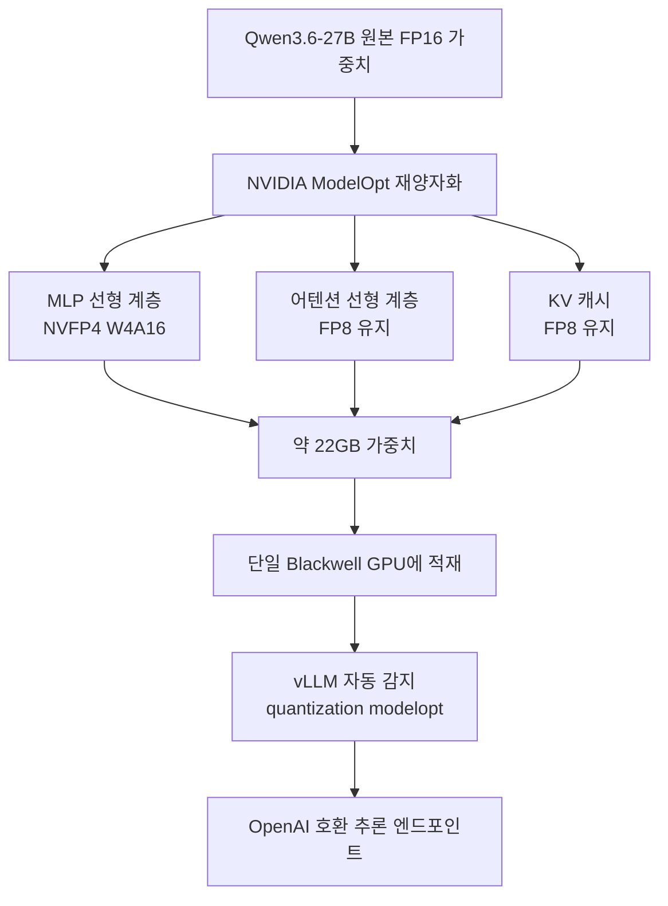

## 개요

27B 규모의 모델을 단일 GPU에서, 그것도 근사 무손실 정확도로 서빙할 수 있다면 온프레미스 추론의 경제학이 바뀝니다. NVIDIA가 공개한 nvidia/Qwen3.6-27B-NVFP4 체크포인트는 Qwen3.6-27B를 NVFP4 데이터 타입으로 재양자화해, 최신 vLLM에서 별도 설정 없이 바로 추론할 수 있게 만든 것입니다. vLLM 프로젝트가 Blackwell GPU에서 이 체크포인트가 추론 준비를 마쳤다고 알린 배경입니다.

핵심은 단순한 "4비트로 줄였다"가 아니라 **어디를 줄이고 어디를 남겼는가**에 있습니다. 이 글은 NVFP4 재양자화의 혼합 정밀도 설계를 뜯어보고, vLLM에서의 실제 서빙 방법을 정리한 뒤, 이 방식이 ThakiCloud ai-platform의 멀티테넌트 GPU 서빙 비용 구조에 무엇을 의미하는지 짚습니다. 실측이 필요한 대목은 정직하게 구분해 표기합니다.

## 이 기술은 무엇인가

NVFP4는 4비트 부동소수 포맷으로, 파라미터당 비트 수를 16에서 4로 낮춰 디스크와 GPU 메모리 요구를 약 2.5배 줄입니다. 하지만 nvidia/Qwen3.6-27B-NVFP4의 실제 설계는 전체를 4비트로 뭉개지 않습니다. NVIDIA ModelOpt의 재양자화는 **MLP 선형 계층만 NVFP4(W4A16)로 내리고, 어텐션 선형 계층과 KV 캐시는 FP8로 남깁니다.** 그 결과 약 22GB의 가중치가 단일 Blackwell GPU에 들어갑니다. NVIDIA는 이 구성이 FP8 기준선 대비 근사 무손실 정확도를 보인다고 보고합니다.

이 혼합 정밀도 선택에는 이유가 있습니다. MLP 계층은 파라미터 수가 압도적으로 많아 메모리 절감 효과가 크지만 4비트화에 상대적으로 관대합니다. 반면 어텐션과 KV 캐시는 긴 컨텍스트에서 품질에 민감하므로 FP8로 남겨 정확도를 지킵니다. 즉 "가장 무거운 곳을 가장 공격적으로 줄이고, 가장 민감한 곳은 보수적으로 남긴다"는 원칙입니다.



기존의 통짜 4비트 양자화(예: 전 계층 W4)와 비교하면, 이 방식은 메모리 절감의 대부분을 취하면서 품질 손실은 민감 계층을 FP8로 남겨 방어합니다. 절감과 정확도 사이의 트레이드오프를 계층 단위로 다르게 잡은 것이 NVFP4 재양자화의 핵심 차별점입니다.

## 설치 및 서빙

vLLM은 체크포인트에서 ModelOpt 양자화를 자동 감지하므로 별도의 양자화 플래그를 굳이 지정하지 않아도 됩니다. 다만 NVFP4/W4A16을 지원하는 최신 vLLM이 필요하며, NVIDIA는 nightly 또는 ModelOpt 지원이 포함된 소스 빌드를 권장합니다. Docker로 nightly 이미지를 띄운 뒤 다음과 같이 서빙합니다.

```bash
# NVFP4/ModelOpt 지원 최신 vLLM (nightly 이미지)
docker run --gpus all -p 8000:8000 \
  vllm/vllm-openai:nightly \
  vllm serve nvidia/Qwen3.6-27B-NVFP4 \
    --port 8000 \
    --quantization modelopt \
    --max-model-len 262144 \
    --reasoning-parser qwen3
```

`--max-model-len 262144`는 Qwen3.6 계열의 긴 컨텍스트를 그대로 활용하는 설정이고, `--reasoning-parser qwen3`는 추론 토큰 파싱을 위한 것입니다. 엔드포인트는 OpenAI 호환이므로 기존 클라이언트를 그대로 붙일 수 있습니다.

## 실제 실험 결과

정직하게 밝힙니다. 이 체크포인트는 Blackwell 계열 GPU를 전제로 하며, 본 글을 작성한 환경에는 해당 하드웨어가 없어 **로컬에서 직접 재현하지 못했습니다.** 따라서 아래 수치는 우리가 측정한 값이 아니라 공개 출처가 보고한 값이며, 그대로 인용하되 출처를 명시합니다.

- NVIDIA는 NVFP4 재양자화 구성이 FP8 기준선 대비 **근사 무손실 정확도**를 보인다고 보고합니다(모델 카드 기준).
- 가중치 크기는 약 **22GB**로, 단일 Blackwell GPU에 적재됩니다(모델 카드 기준).
- 한 서드파티 벤치마크(loFT LLC)는 듀얼 RTX PRO 6000 Blackwell Max-Q 환경에서 NVFP4+MTP 구성으로 **약 190 tok/s의 생성 처리량**을 보고합니다. [추정] 성격의 외부 측정치이며, 우리 환경의 값이 아닙니다.

우리가 검증할 수 있었던 것은 서빙 경로의 사실관계입니다. vLLM이 ModelOpt 양자화를 자동 감지한다는 점, 혼합 정밀도(MLP는 NVFP4, 어텐션·KV는 FP8) 구성이라는 점, 그리고 22GB 가중치가 단일 Blackwell에 들어간다는 점은 공개 모델 카드와 vLLM 레시피에서 확인됩니다. 실제 처리량과 지연은 하드웨어를 확보한 뒤 별도로 측정할 사안으로 남깁니다.

## ThakiCloud 제품 적용 시사점

이 체크포인트가 흥미로운 이유는 벤치마크 숫자 자체보다 **서빙 경제학의 이동**에 있습니다. ThakiCloud ai-platform은 K8s와 Kueue 기반으로 다양한 고객 환경에서 모델을 서빙하며, GPU는 언제나 가장 비싼 자원입니다. 27B급 모델을 단일 GPU에, 그것도 근사 무손실로 담을 수 있다면 테넌트당 GPU 점유를 낮추고 같은 하드웨어에서 더 많은 모델 또는 더 많은 테넌트를 수용할 수 있습니다.

멀티테넌트 관점에서 이 절감은 곱셈으로 커집니다. 모델 하나가 2개 GPU에서 1개로 내려가면, 클러스터 전체의 동시 서빙 슬롯이 두 배 가까이 늘어납니다. Kueue 기반의 GPU 할당에서 이는 대기 큐를 줄이고 테넌트 간 공정 배분을 쉽게 만드는 직접적 효과로 이어집니다. 온프레미스·소버린 요구가 강한 고객에게는 특히 의미가 큽니다. 도입해야 할 GPU 대수 자체가 줄어 초기 투자와 운영 비용의 문턱이 낮아지기 때문입니다.

혼합 정밀도 설계는 우리 운영 철학과도 맞닿아 있습니다. 무차별적으로 정밀도를 낮추는 대신, 품질에 민감한 부분은 남기고 무거운 부분만 공격적으로 줄이는 접근은 "비용 효율과 품질을 동시에"라는 목표에 부합합니다. ai-platform에서 새 양자화 체크포인트를 도입할 때, 벤치마크 점수뿐 아니라 어느 계층을 어떤 정밀도로 다뤘는지를 함께 검토하는 이유입니다. NVFP4 재양자화는 그 검토의 좋은 참조 사례이며, 실측 처리량을 확보하는 대로 우리 서빙 스택에서의 비용·품질 프로파일을 후속 글로 정리할 계획입니다.

## 한계 및 반론

첫째, 하드웨어 종속이 뚜렷합니다. NVFP4의 이점은 Blackwell 세대 GPU에서 극대화되며, 그 이전 세대에서는 동일한 효율을 기대하기 어렵습니다. 단일 GPU 서빙이라는 매력도 Blackwell을 확보했다는 전제 위에서만 성립합니다. GPU 조달 자체가 병목인 환경에서는 "단일 GPU면 충분"이라는 명제가 곧바로 비용 절감으로 이어지지 않을 수 있습니다.

둘째, 근사 무손실이라는 표현은 벤치마크 평균의 이야기입니다. 특정 도메인이나 긴 컨텍스트, 수치·코드처럼 정밀도에 민감한 과제에서는 FP8 기준선 대비 미세한 품질 저하가 드러날 수 있습니다. NVFP4 도입 판단은 모델 카드의 요약 수치가 아니라 실제 서빙할 워크로드에서의 평가로 확정해야 합니다.

셋째, 이 글의 처리량 수치는 우리 측정치가 아닙니다. 서드파티 벤치는 하드웨어 구성(듀얼 RTX PRO 6000, MTP 사용 여부)과 배치·컨텍스트 길이에 크게 좌우되므로, 우리 클러스터의 실제 값은 직접 측정하기 전까지는 미확정입니다. 이 글의 결론은 "NVFP4 단일 GPU 서빙이 서빙 경제학을 바꿀 잠재력이 있다"까지이며, "우리 환경에서 몇 tok/s가 나온다"는 별도 검증이 끝난 뒤에 말할 문제입니다.


## 관련 슬라이드

본문 내용을 NotebookLM(`neo_swiss` 스타일)으로 요약한 슬라이드입니다.


## 출처

- nvidia/Qwen3.6-27B-NVFP4 모델 카드, Hugging Face (<https://huggingface.co/nvidia/Qwen3.6-27B-NVFP4>)
- Qwen/Qwen3.6-27B, vLLM Recipes (<https://recipes.vllm.ai/Qwen/Qwen3.6-27B>)
- Measuring Qwen3.6-27B NVFP4+MTP on vLLM, loFT LLC (<https://loftllc.dev/en/docs/tech/llm-research/qwen3-6-27b-nvfp4-mtp-vllm-benchmark/>)
