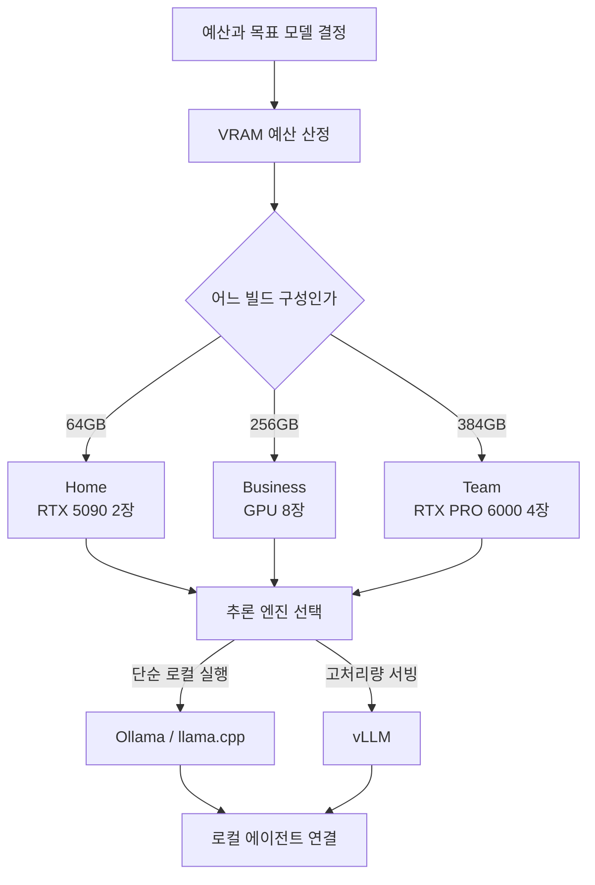

지난 며칠 사이 개발자 타임라인에서 조용히 화제가 된 프로젝트가 있습니다. "Personal AI Computer", 즉 클라우드 API를 빌리는 대신 집이나 사무실에 직접 AI 컴퓨터를 조립해 오픈웨이트 모델을 온전히 내 손으로 돌리는 빌드 가이드입니다. 최대 384GB VRAM 구성까지 정리되어 있어서, "그 정도면 어떤 모델까지 로컬에서 돌아가는가"라는 실무적인 질문이 자연스럽게 따라옵니다. 이 글은 온프레미스 AI 인프라를 검토하는 엔지니어링 리더와 ML 플랫폼 팀, 그리고 로컬에서 모델을 굴려보려는 데이터 과학자를 위한 것입니다. VRAM이 실행 가능한 모델을 어떻게 결정하는지 계산으로 확인하고, 개인용 한 대를 조직 규모의 서빙으로 확장할 때 무엇이 달라지는지를 ThakiCloud의 ai-platform 관점과 함께 다룹니다.

결론부터 말씀드리면 이렇습니다. 로컬 AI의 실행 가능성은 대부분 VRAM 한 가지 변수로 결정됩니다. 그리고 개인용 빌드가 증명하는 것은 "기술적으로 가능하다"는 사실이지, "조직이 그대로 운영할 수 있다"는 뜻은 아닙니다. 그 간극이 정확히 온프렘 서빙 플랫폼이 존재하는 이유입니다.

## 이 기술은 무엇인가

화제의 중심에 있는 저장소는 `autonomous-ai/autonomous-computer`입니다. MIT 라이선스로 공개된, 집에서 AI 컴퓨터를 처음부터 조립하는 오픈소스 가이드입니다. 특징은 "글로만 설명하지 않는다"는 점입니다. 각 빌드는 가격과 구매 링크가 붙은 부품 명세(BOM), 섀시를 직접 출력하거나 가공할 수 있는 3D 파일(STL과 STEP), 배선도, BIOS 튜닝 값, 그리고 조립 과정을 담은 단계별 사진으로 구성됩니다. 소프트웨어 쪽도 운영체제와 NVIDIA 드라이버 설치부터 추론 엔진 세 가지(Ollama, vLLM, llama.cpp), 마지막으로 로컬 에이전트를 붙이는 단계까지 이어집니다.

제시되는 구성은 세 가지입니다.

- **Home**: RTX 5090 2장, VRAM 합계 64GB
- **Business**: GPU 8장 구성, VRAM 합계 약 256GB
- **Team**: RTX PRO 6000 Blackwell 4장, VRAM 합계 384GB

프로젝트가 반복해서 강조하는 철학은 "Own your intelligence", 즉 지능을 소유하라는 것입니다. 클라우드에서 빌린 모델은 어느 날 밤 정책이 바뀌거나 서비스가 종료되면 사라질 수 있지만, 내 집에서 도는 모델은 그렇지 않다는 논리입니다. 데이터 주권과 통제권을 하드웨어 수준에서 확보하겠다는 관점이며, 온프렘 수요가 커지는 흐름과 정확히 맞닿아 있습니다.

전체 흐름을 정리하면 다음과 같습니다.

## VRAM이 실행 가능성을 결정한다

로컬에서 어떤 모델이 도는지는 사실상 VRAM 하나로 판가름 납니다. 커뮤니티에서 굳어진 어림 공식은 명료합니다. FP16(반정밀도)에서는 파라미터 10억 개당 약 2GB, INT4 계열 양자화(Q4)에서는 약 0.5GB가 필요하고, 여기에 KV 캐시와 활성화, 프레임워크 오버헤드로 15~20%를 더 얹습니다. 즉 Q4 기준으로 대략 "파라미터 수(B) × 0.5 × 1.2"가 최소 VRAM입니다.

이 공식을 대표 모델 크기에 적용하면 아래 표가 됩니다. 오버헤드 20%를 포함한 계산값입니다.

| 모델 규모 | Q4 필요 VRAM | Q8 필요 VRAM |
|---|---|---|
| 8B | 5GB | 10GB |
| 32B | 19GB | 38GB |
| 70B | 42GB | 84GB |
| 122B | 73GB | 146GB |
| 235B | 141GB | 282GB |
| 405B | 243GB | 486GB |

이 계산은 임의로 지어낸 수치가 아니라 공개된 가이드들과 교차 검증됩니다. 예를 들어 Llama 3 70B를 Q4_K_M으로 돌릴 때 실측 요구량은 약 40~43GB로 보고되는데, 위 계산값 42GB와 일치합니다. Qwen 3.5 122B급은 Q4에서 70~81GB가 필요하다고 알려져 있고 계산값 73GB가 그 범위 안에 들어옵니다. Llama 3.1 405B는 Q4에서 243GB로, 위 표와 정확히 맞아떨어집니다. 참고로 Q4_K_M은 대부분의 작업에서 Q8과 사실상 구분되지 않는 커뮤니티 표준으로, FP16 대비 perplexity가 0.2~0.5 정도만 증가합니다.

## 각 빌드가 실제로 무엇을 돌리는가

계산된 VRAM 요구량을 세 빌드 구성의 용량선과 겹쳐 보면 그림이 선명해집니다.

용량선 위에 막대가 걸치지 않아야 그 모델이 해당 구성에서 실행됩니다. 정리하면 이렇습니다.

- **Home(64GB)**: 70B를 Q8로, 122B를 Q4로 여유 있게 소화합니다. 개인 실험과 소규모 팀의 코딩 보조에는 충분한 급입니다.
- **Business(256GB)**: 235B급을 Q8 근처까지 밀어붙일 수 있고, 여러 중형 모델을 동시에 상주시켜 라우팅하기에 적합합니다.
- **Team(384GB)**: 405B를 Q4(243GB)로 올리고도 141GB가 남습니다. 이 여유분이 긴 컨텍스트의 KV 캐시와 동시 요청을 감당하는 실질적인 헤드룸이 됩니다.

여기서 놓치기 쉬운 지점이 하나 있습니다. 표의 숫자는 "가중치를 올리는 데 필요한 최소치"일 뿐입니다. 실사용에서는 컨텍스트 길이와 동시 사용자 수가 늘어날수록 KV 캐시가 선형 이상으로 부풀어 VRAM 예산을 잠식합니다. 즉 405B가 "겨우 들어가는" 구성과 "여유 있게 서빙되는" 구성은 전혀 다른 이야기입니다.

## ThakiCloud 제품 적용 시사점

Personal AI Computer가 증명하는 것은 강력하지만 동시에 제한적입니다. 한 대의 기계, 한 명의 사용자, 수동 운영이라는 전제 안에서만 성립하기 때문입니다. 이 "집에서 한 대"를 조직 규모로 올리는 순간 완전히 다른 문제들이 등장하고, 바로 그 지점이 ThakiCloud의 **ai-platform**이 다루는 영역입니다.

ai-platform은 Kubernetes 위에서 Kueue로 GPU를 큐잉하고 스케줄링하며, vLLM으로 모델을 멀티테넌트로 서빙합니다. 개인 빌드에서는 GPU 4장을 한 사람이 독점하지만, 조직에서는 여러 팀과 여러 모델이 같은 GPU 풀을 두고 경쟁합니다. 이때 필요한 것은 테넌트 격리, 공정한 큐잉, 우선순위 기반 스케줄링, 그리고 사용량과 비용의 관측입니다. 개인 빌드가 수동으로 "지금은 이 모델만 올린다"고 결정하는 일을, 플랫폼은 정책과 스케줄러로 자동화합니다.

경제학의 방향도 같습니다. 개인 빌드의 "Own your intelligence"가 데이터 주권과 통제권을 하드웨어로 확보하는 논리라면, ai-platform은 같은 논리를 조직 규모에서 실현합니다. 온프레미스와 소버린 배포, 낮은 단위 서빙 비용, 그리고 self-hosting을 통한 데이터 통제는 국내 규제 대응이 필요한 고객 환경에서 특히 무게를 가집니다. 개인이 감당하기 어려운 RTX PRO 6000급 GPU의 활용률을 여러 워크로드가 공유해 끌어올리는 것도 플랫폼만이 할 수 있는 일입니다.

로컬 모델 위에서 에이전트를 돌리는 경우라면 ThakiCloud의 **Paxis** 관점도 겹칩니다. Paxis는 ai-platform 위에서 도는 Agent-Native Cloud 제어 평면으로, 스킬을 격리 샌드박스에서 실행하고 모든 행동을 정책 게이트와 감사 로그로 통과시킵니다. 자체 하드웨어에서 도는 모델에 자체 통제 평면을 붙이면, "지능을 소유한다"는 개인 빌드의 철학이 조직 수준의 거버넌스로 확장됩니다.

## 한계 및 반론

개인 빌드의 낭만을 그대로 받아들이기 전에 짚어야 할 현실이 있습니다.

첫째, 하드웨어 자체의 비용과 운영 부담입니다. RTX PRO 6000 Blackwell 4장 구성은 초기 CAPEX가 상당하고, 전력과 발열, 소음, 유지보수까지 지속적으로 따라옵니다. 단일 기계는 곧 단일 장애점이기도 합니다.

둘째, 클라우드가 여전히 합리적인 경우가 분명히 존재합니다. 사용량이 들쭉날쭉한 버스티 워크로드, 최신 프론티어 모델이 반드시 필요한 작업, 글로벌 저지연 서비스는 온프렘 한 대로 대응하기 어렵습니다. 온프렘의 손익분기는 "꾸준히 높은 활용률"이라는 전제 위에서만 성립합니다.

셋째, Q4 양자화가 공짜는 아닙니다. 평균적으로는 품질 저하가 미미하지만, 코딩이나 수학처럼 정밀도에 민감한 작업에서는 열화가 드러날 수 있습니다. 또한 앞서 언급했듯 긴 컨텍스트와 높은 동시성은 KV 캐시를 통해 VRAM 예산을 빠르게 소진시켜, "가중치는 들어가는데 서빙은 안 되는" 상황을 만듭니다.

결국 Personal AI Computer는 훌륭한 출발점이자 강력한 개념 증명입니다. 다만 개인의 한 대가 주는 통제권을 조직 전체가 안정적으로 누리려면, 그 위에 격리와 스케줄링, 관측과 거버넌스를 얹는 플랫폼 계층이 반드시 필요합니다. 개인 빌드가 던진 질문("지능을 소유할 수 있는가")에 조직 규모로 답하는 일이, 온프렘 AI 플랫폼이 풀고 있는 문제입니다.

## 출처

- [autonomous-ai/autonomous-computer (GitHub)](https://github.com/autonomous-ai/autonomous-computer)
- [Autonomous Computer: Build Your Own Home AI (writeup)](https://pasqualepillitteri.it/en/news/4998/autonomous-computer-build-home-ai-locally)
- [Best Local AI Models by VRAM: 8GB to 384GB (2026)](https://www.modemguides.com/blogs/ai-infrastructure/best-local-ai-models-by-vram-2026)
- [GPU Memory Requirements for LLMs (Spheron)](https://www.spheron.network/blog/gpu-memory-requirements-llm/)
- [Build an AI PC in 2026: Complete Hardware Guide (Local AI Master)](https://localaimaster.com/blog/ai-pc-build-guide)
- 원 공유: [@tom_doerr, Personal AI Computer build guides](https://x.com/tom_doerr)
