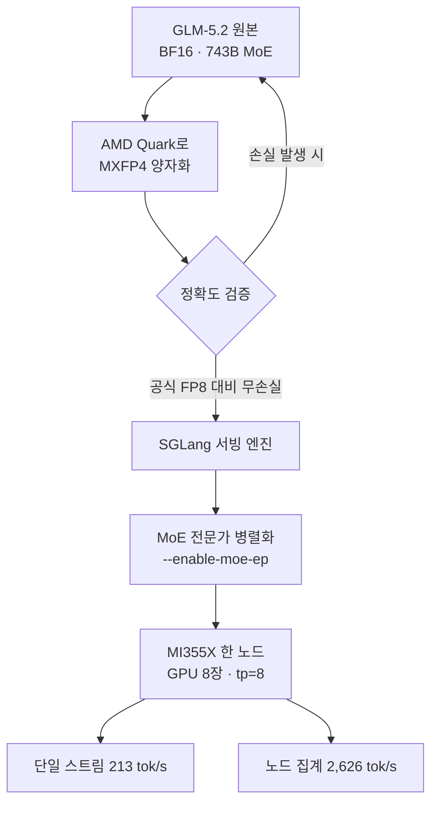

지난 주 개발자 타임라인에서 한 벤치마크 결과가 빠르게 퍼졌습니다. GLM-5.2를 AMD MI355X 한 노드에서 초당 2,626 토큰으로 서빙했고, 그것도 Blackwell 대비 2배 이상 낮은 비용으로 해냈다는 내용이었습니다. 숫자만 보면 흔한 "우리 하드웨어가 빠릅니다" 홍보처럼 들리지만, 이 사례가 흥미로운 이유는 따로 있습니다. NVIDIA가 아닌 AMD GPU 위에서, 743B 규모의 초대형 MoE 모델을, 정확도 손실 없이 4비트급으로 압축해 돌렸다는 조합이기 때문입니다.

이 글은 온프레미스와 멀티클라우드 서빙을 검토하는 엔지니어링 리더, GPU 벤더 선택을 고민하는 ML 플랫폼 팀, 그리고 대형 오픈웨이트 모델의 서빙 경제성을 따져야 하는 데이터 과학자를 위한 것입니다. 먼저 이 결과가 정확히 무엇을 측정했는지 원 소스로 확인하고, MXFP4 양자화와 SGLang의 MoE 병렬화가 왜 결정적이었는지 뜯어본 다음, ThakiCloud의 ai-platform이 이 흐름에서 어떤 위치에 서는지를 정리합니다.

결론부터 말씀드리면 이렇습니다. 이 벤치마크의 진짜 메시지는 "AMD가 빠르다"가 아니라, **서빙 스택(양자화 포맷과 추론 엔진)이 하드웨어 벤더의 잠금을 풀어버리기 시작했다**는 것입니다. 그리고 그 잠금이 풀리는 지점이 바로 온프렘 서빙 플랫폼의 존재 이유입니다.

## 이 기술은 무엇인가

세 가지 조각이 맞물린 결과입니다. 모델, 하드웨어, 그리고 그 둘을 잇는 서빙 스택입니다.

**모델, GLM-5.2.** Z.ai(구 Zhipu)가 공개한 오픈웨이트 MoE 모델로, 총 파라미터는 약 743B, 토큰당 활성화되는 파라미터는 약 39B입니다. 컨텍스트 길이는 100만 토큰(1M)에 이르고, 특히 프론트엔드 코딩 과제에서 강한 모델로 평가받습니다. 전체 파라미터는 크지만 활성 파라미터가 39B에 불과한 MoE 구조라, "무겁게 담아두고 가볍게 꺼내 쓰는" 전형적인 대형 스파스 모델입니다.

**하드웨어, AMD Instinct MI355X.** AMD의 최신 데이터센터 가속기로, GPU 한 장당 메모리 용량이 커서 대형 모델을 적은 수의 GPU에 담을 수 있는 것이 강점입니다. 이번 사례는 한 노드(GPU 8장, 텐서 병렬 tp=8) 구성에서 측정되었습니다. 참고로 FP8 기준 GPU당 메모리 점유가 약 89GB로, BF16의 약 175GB 대비 절반 수준입니다.

**서빙 스택, MXFP4 양자화(AMD Quark) + SGLang.** 여기가 핵심입니다. 원본 BF16 GLM-5.2를 AMD의 양자화 툴킷 **Quark**로 **MXFP4**(4비트 마이크로스케일링 부동소수점) 포맷으로 변환했는데, 원 소스는 이 변환이 공식 FP8 양자화 대비 정확도 손실이 없었다("lossless")고 밝힙니다. 그리고 추론 엔진으로는 **SGLang**을 선택했습니다. 이유는 명확합니다. 테스트한 프레임워크 중 SGLang이 MXFP4를 네이티브로 지원했고, `--enable-moe-ep` 옵션으로 전문가(expert)들을 GPU들에 분산 배치한 뒤 토큰을 NVLink/NVSwitch로 라우팅하는 MoE 병렬화를 제대로 태울 수 있었기 때문입니다.

전체 파이프라인을 정리하면 다음과 같습니다.

기존 접근과의 차이는 두 지점입니다. 첫째, 양자화 포맷이 FP8이 아니라 MXFP4라는 점입니다. 비트를 더 줄이면 보통 정확도가 흔들리는데, 마이크로스케일링 방식은 작은 블록 단위로 스케일을 따로 두어 4비트급에서도 품질을 유지하려는 설계입니다. 둘째, 이 모든 것이 CUDA 생태계 바깥, 즉 AMD ROCm 위에서 돌아갔다는 점입니다.

## 실제 벤치마크 결과

원 소스(Wafer.ai)가 공개한 수치는 두 갈래입니다. 워크로드 조건이 다르므로 나눠서 봐야 합니다.

**단일 스트림 지연 시나리오.** 입력 10k 토큰, 출력 1.5k 토큰의 단일 요청에서 **초당 213 토큰**을 냈습니다. 한 사용자가 긴 컨텍스트를 넣고 답변을 스트리밍으로 받는 상황에 해당하는 수치입니다.

**노드 집계 처리량 시나리오.** 입력 20k 토큰, 출력 1k 토큰, 캐시 적중률 60%의 조건에서, 초당 요청 2.4건(2.4 rps)을 처리하며 **노드당 2,626 tok/s**의 집계 처리량을 냈습니다. 이때 TTFT(첫 토큰까지 걸린 시간)는 5초 이하로 유지되었습니다. 여러 요청을 동시에 밀어 넣는 프로덕션 서빙에 가까운 조건입니다.

비용 측면의 주장은 이렇습니다. Wafer.ai는 이 MXFP4 구성이 **Blackwell 대비 2배 이상 낮은 비용**, 즉 달러당 처리량이 두 배 이상이라고 밝힙니다. 별개의 분석인 SemiAnalysis(InferenceX)는 조건이 다른 SGLang FP8 구성에서 MI355X가 B200 대비 **백만 토큰당 최대 40% 저렴**하다고 보고했습니다. 두 수치는 양자화 포맷과 워크로드가 서로 다르므로 직접 비교하기보다는, "여러 독립 출처가 같은 방향(MI355X의 비용 경쟁력)을 가리킨다"는 정도로 읽는 것이 정확합니다. 위 차트의 비용 지수는 Wafer.ai의 "2배 이상" 주장을 시각화한 것으로, 절대 단가가 아니라 상대 지표임을 밝혀 둡니다.

여기서 한 가지 주의가 필요합니다. 이 숫자들은 저희가 MI355X 노드를 직접 확보해 재현한 결과가 아니라 원 소스가 공개한 측정값입니다. MI355X 실물이 없어 독립 재현은 하지 못했고, 따라서 본문의 모든 수치는 인용값입니다. 하드웨어를 확보하는 대로 동일 조건 재현을 별도로 다룰 계획입니다.

## 왜 MXFP4와 SGLang이 결정적이었나

이 결과에서 하드웨어보다 더 중요한 것은 서빙 스택의 선택입니다. 세 가지 이유가 있습니다.

**첫째, 4비트 양자화가 대형 MoE를 적은 GPU에 담습니다.** 743B 파라미터를 BF16으로 올리면 메모리가 수백 GB 단위로 필요합니다. MXFP4로 내리면 가중치 메모리가 크게 줄어, 같은 모델을 더 적은 GPU, 더 좁은 노드에 넣을 수 있습니다. 서빙 비용의 상당 부분이 "이 모델을 담는 데 GPU 몇 장이 필요한가"에서 결정되므로, 무손실에 가까운 4비트 양자화는 곧바로 단가로 이어집니다.

**둘째, MoE 병렬화가 활성 파라미터만 계산하게 만듭니다.** MoE 모델은 토큰마다 소수의 전문가만 활성화됩니다. SGLang의 `--enable-moe-ep`는 전문가들을 GPU들에 흩어 놓고 토큰을 고속 인터커넥트로 해당 전문가에게 보냅니다. 743B를 다 계산하는 것이 아니라 39B 활성분만 계산하는 구조를 하드웨어 배치 수준에서 살려내는 것이 처리량의 핵심입니다.

**셋째, 포맷과 엔진의 궁합이 벤더 잠금을 풉니다.** 이번 성과의 조용한 결론은 여기 있습니다. MXFP4를 네이티브로 지원하는 엔진(SGLang)과 그 포맷으로 무손실 변환해 주는 툴킷(AMD Quark)이 갖춰지자, CUDA가 아닌 ROCm 위에서도 프로덕션급 서빙이 성립했습니다. 서빙 스택이 표준화될수록 "어느 벤더의 GPU인가"는 성능이 아니라 가용성과 단가의 문제로 내려옵니다. 이것이 구매자에게 협상력을 돌려주는 변화입니다.

## ThakiCloud 제품 적용 시사점

이 사례는 ThakiCloud **ai-platform**의 전략과 정면으로 맞닿아 있습니다. ai-platform은 Kubernetes 기반의 AI/ML SaaS 인프라로, 다양한 고객 환경에서 모델을 서빙하고 GPU 자원을 Kueue로 스케줄링합니다. 그 관점에서 이번 결과가 주는 시사점은 세 가지입니다.

**멀티벤더 서빙이 이제 성능 타협이 아닙니다.** 과거에는 "NVIDIA가 아니면 성능이 안 나온다"는 전제가 벤더 선택을 사실상 봉쇄했습니다. GLM-5.2 MI355X 사례는 그 전제가 흔들린다는 증거입니다. ai-platform이 vLLM과 SGLang을 서빙 백엔드로 추상화하고 그 위에서 NVIDIA와 AMD 노드를 함께 스케줄링할 수 있다면, 고객은 워크로드별로 가장 저렴한 가용 하드웨어에 요청을 태울 수 있습니다. 멀티테넌트 클러스터에서 이 유연성은 곧 서빙 단가 경쟁력입니다.

**양자화가 플랫폼의 1급 관심사입니다.** MXFP4처럼 무손실에 가까운 저비트 포맷은 "같은 SLA를 더 적은 GPU로" 달성하게 해 줍니다. 온프렘 고객, 특히 데이터 주권과 self-hosting이 요구되는 국내 공공·금융 환경에서는 확보 가능한 GPU 수량 자체가 제약입니다. 무손실 양자화는 그 제약 안에서 더 큰 모델을 돌릴 수 있게 하므로, ai-platform이 Quark 같은 툴체인을 서빙 파이프라인의 표준 단계로 흡수하는 것은 자연스러운 방향입니다.

**비용 효율이 온프렘 제안의 핵심 논거입니다.** ThakiCloud가 온프레미스와 소버린 클라우드를 제안할 때 가장 자주 받는 질문은 "그래서 얼마나 저렴한가"입니다. Blackwell 대비 2배 이상, B200 대비 최대 40% 저렴하다는 독립 벤치마크는, 적절한 서빙 스택 위에서 하드웨어 다변화가 실제 TCO를 낮춘다는 근거로 쓸 수 있습니다. 물론 고객 환경에서의 재현이 전제이며, 그 재현 능력 자체가 플랫폼이 제공하는 가치입니다.

## 한계 및 반론

균형을 위해 이 결과를 과신하면 안 되는 이유를 짚습니다.

**첫째, 벤치마크는 특정 조건의 스냅샷입니다.** 2,626 tok/s는 입력 20k·출력 1k·캐시 60%라는 특정 워크로드에서 나온 수치입니다. 짧은 프롬프트에 긴 생성이 몰리거나 캐시 적중이 낮은 워크로드에서는 처리량이 크게 달라집니다. 단일 스트림 213 tok/s와 노드 집계 2,626 tok/s의 간극이 이미 그 민감도를 보여 줍니다.

**둘째, MXFP4 "무손실"은 검증 범위 안의 주장입니다.** 원 소스는 공식 FP8 대비 무손실이라고 했지만, 이는 특정 평가 세트 기준일 가능성이 높습니다. 코딩·수학·긴 컨텍스트 등 과제별로 4비트 양자화의 영향은 다르게 나타날 수 있어, 실제 도입 전에는 자사 평가셋으로 품질 저하를 직접 측정해야 합니다.

**셋째, ROCm 생태계의 운영 성숙도는 여전히 변수입니다.** 벤치마크가 성립한다는 것과 프로덕션에서 안정적으로 운영된다는 것은 다른 문제입니다. 드라이버, 커널, 라이브러리 호환성, 장애 대응 도구의 성숙도에서 CUDA 생태계와의 격차는 아직 존재합니다. 하드웨어 단가만 보고 총소유비용을 판단하면 운영 인력과 다운타임 비용을 놓칠 수 있습니다.

그럼에도 방향성은 분명합니다. 서빙 스택의 표준화가 하드웨어 선택지를 넓히고 있고, 그 변화의 수혜자는 벤더 잠금에서 벗어나 워크로드별 최적 하드웨어를 고를 수 있는 서빙 플랫폼과 그 고객입니다. ThakiCloud ai-platform이 정확히 그 지점을 겨냥합니다.

## 출처

- Wafer.ai, "Performance per dollar is getting faster and cheaper": <https://www.wafer.ai/blog/glm52-amd>
- SemiAnalysis InferenceX, "AMD MI355X GLM-5 Inference: Up to 40% Cheaper per Million Tokens than B200 on SGLang FP8": <https://inferencex.semianalysis.com/blog/mi355x-glm5-fp8-sglang-40-cheaper-than-b200>
- LMSYS, "Win on TCO: How AMD Instinct MI355X Achieves Cost-Competitive Distributed Inference Through SGLang with MoRI": <https://www.lmsys.org/blog/2026-05-28-mori/>
- GLM-5.2 모델 카드(743B / 39B active · MoE · 1024K ctx): <https://recipes.vllm.ai/zai-org/GLM-5.2>
