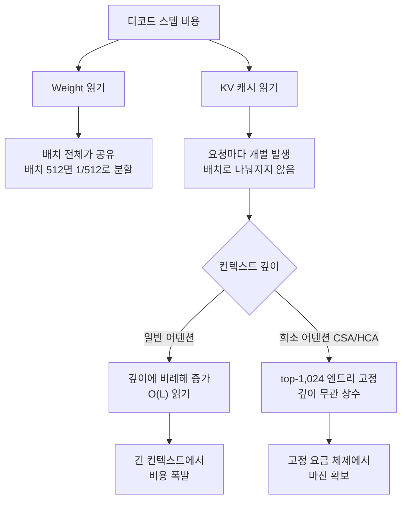

## 개요: 8배 큰 모델이 5배 싸다는 역설

최근 추론 인프라 커뮤니티에서 흥미로운 질문이 돌았습니다. DeepSeek V4 Flash는 총 284B 파라미터 모델인데, 35B짜리 Qwen3.6-35B-A3B보다 output 토큰 가격이 5배가량 저렴합니다. 실측 가격을 보면 input은 둘 다 $0.14/M 수준으로 비슷하지만, output은 DeepSeek V4 Flash가 $0.18~0.28/M, Qwen3.6이 $1.00~1.49/M입니다.

더 이상한 점이 있습니다. 토큰당 활성 파라미터로 보면 Qwen3.6은 3B, DeepSeek V4 Flash는 13B입니다. 연산량 기준으로는 오히려 Qwen이 4배 가벼운데도 시장 가격은 정반대입니다. 파라미터 수가 곧 비용이라는 직관이 두 번 연속으로 깨지는 셈입니다.

이 글은 그 역설을 세 가지 층위로 해부합니다. 첫째, 디코드 비용의 지배항이 왜 연산이 아니라 메모리 읽기인지. 둘째, KV 캐시 깊이와 고정 요금 사이의 구조적 긴장. 셋째, 8xH100 기준의 최적 서빙 형태를 roofline 모델로 직접 계산했을 때 무엇이 보이는지. ThakiCloud처럼 고객 환경에서 모델을 직접 서빙하는 입장에서는 이 구조가 곧 원가 경쟁력이기 때문에, 실무 관점의 시사점도 함께 정리합니다.

## 두 모델의 아키텍처 사실 확인

먼저 스펙을 정확히 잡고 시작하겠습니다.

DeepSeek V4 Flash는 284B total / 13B active MoE입니다. 라우터가 256개 routed expert 중 top-6과 shared expert 1개를 선택합니다. 어텐션은 CSA(Compressed Sparse Attention)와 HCA(Heavily Compressed Attention)를 결합한 하이브리드 스택으로, 쿼리 패스마다 압축된 KV 엔트리 top-1,024개만 읽습니다. 공식 자료 기준으로 V3.2 대비 1M 컨텍스트에서 토큰당 추론 FLOPs 27%, KV 캐시 10% 수준입니다. 체크포인트는 MoE expert가 FP4, 나머지가 FP8인 혼합 포맷입니다.

Qwen3.6-35B-A3B는 35B total / 3B active MoE입니다(256 experts, 8 routed + 1 shared). 어텐션은 Gated DeltaNet 선형 어텐션 층과 full attention 층(KV head 2개, head dim 256)의 하이브리드입니다. 네이티브 컨텍스트는 262K이고 YaRN으로 1M까지 확장됩니다. FP8 체크포인트 기준 약 35GB로 H100 한 장에 들어갑니다.

요약하면 둘 다 세대 최신의 효율 지향 설계입니다. Qwen이 순진한 dense 모델이라서 비싼 것이 아니라는 점이 이 비교를 더 흥미롭게 만듭니다.

## 디코드 비용의 실제 구조: roofline 모델

토큰 생성(디코드)은 연산이 아니라 메모리 대역폭에 묶입니다. 디코드 스텝 시간의 1차 근사는 다음과 같습니다.

```text
T_step = (읽어야 할 weight 바이트 + Σ 요청별 KV 읽기 바이트) / 메모리 대역폭
throughput = batch_size / T_step
```

여기서 두 항의 성격이 완전히 다릅니다.

Weight 읽기는 배치가 나눠 갖습니다. 한 스텝에 weight를 한 번 읽으면 배치 안의 모든 요청이 공유합니다. 배치가 512면 토큰당 weight 비용은 512분의 1로 떨어집니다. MoE의 총 파라미터가 "배치가 크면 거의 공짜"가 되는 이유입니다.

KV 읽기는 요청마다 개별입니다. 각 요청은 자기 컨텍스트의 KV 캐시를 읽어야 하고, 이 비용은 배치를 키워도 나눠지지 않습니다. 컨텍스트가 깊어질수록 선형으로 늘어납니다.

그래서 배치가 충분히 크고 컨텍스트가 길어지면 비용의 지배항은 weight가 아니라 KV 읽기가 됩니다. 그런데 API 요금은 컨텍스트 깊이와 무관하게 토큰당 고정입니다. 32K 히스토리를 가진 요청과 500K 히스토리를 가진 요청이 같은 output 단가를 냅니다. 서빙 사업자 입장에서는 KV 읽기를 깊이와 무관하게 묶어둘 수 있는 모델이 고정 요금 체제에서 마진을 만듭니다.



## 8xH100 서빙 형태: 숫자로 비교

이제 실제로 8xH100(SXM5, 장당 80GB HBM3, 3.35TB/s, 총 640GB, 집계 26.8TB/s) 위에 두 모델을 올려보겠습니다. 시간당 비용은 온디맨드 기준 약 $20로 잡았습니다.

모델링 전제는 다음과 같습니다. Qwen3.6은 FP8 weight 약 35GB, 하이브리드 40층 중 full attention 층을 10개로 가정하면 [추정] 토큰당 KV는 약 10KB입니다(2 KV head × 256 dim × K/V 2개 × 10층 × 1바이트). DeepSeek V4 Flash는 FP4 expert + FP8 dense로 실효 weight 약 150GB [추정], 저장 KV는 V3.2 대비 10% 공식 주장을 기준으로 토큰당 약 3.5KB [추정], 디코드 시 읽기는 top-1,024 엔트리로 요청당 스텝마다 약 4MB 상수입니다.

### 서빙 형태부터 다릅니다

Qwen3.6의 최적 형태는 독립 레플리카 8개(DP8)입니다. 모델이 한 장에 들어가니 GPU 간 통신이 전혀 없고, 장당 약 38GB의 KV 예산이 남습니다. 로컬호스트 지향 설계의 전형적인 서빙 형태입니다.

DeepSeek V4 Flash는 8장을 하나의 TP/EP 그룹으로 묶어야 합니다. all-to-all 통신이 발생하는 대신, 약 490GB의 KV 예산을 배치 전체가 공유합니다.

### 컨텍스트 깊이별 처리량 계산

roofline 계산 결과입니다(실제 달성치는 통상 이 값의 50~60%이고, EP 통신과 prefill은 미반영입니다).

8K 컨텍스트에서는 Qwen 클러스터 약 76k tok/s, DeepSeek V4 Flash 약 90k tok/s로 비슷합니다. 통신 오버헤드까지 감안하면 사실상 Qwen이 우세합니다. 짧은 컨텍스트에서는 작은 모델이 하드웨어적으로 더 싸거나 동급이라는 뜻입니다.

32K에서 격차가 벌어지기 시작합니다. Qwen은 요청당 KV 읽기가 320MB로 늘며 약 31k tok/s, DeepSeek V4 Flash는 KV 읽기가 여전히 상수라 약 90k tok/s를 유지합니다. 약 3배 차이입니다.

256K에서 Qwen은 요청당 KV가 2.56GB에 달해 저장 상한 때문에 장당 배치가 14로 묶이고 약 5.3k tok/s로 떨어집니다. DeepSeek V4 Flash는 약 45k tok/s로 8.5배 차이가 납니다.

1M에서 Qwen은 스텝마다 요청당 10GB를 읽어야 해서 약 1.2k tok/s, 동시 24세션이 한계입니다. DeepSeek V4 Flash는 약 11k tok/s에 동시 64세션으로 10배 가까이 벌어집니다.

달러로 환산하면 32K에서 Qwen $0.18/M vs DeepSeek V4 Flash $0.06/M, 1M에서 Qwen $4.6/M vs DeepSeek V4 Flash $0.5/M입니다. 에이전틱 워크로드의 평균 깊이인 수십에서 수백 K 구간에서 원가 격차가 3~10배로 벌어지는데, 이것이 관측된 API 가격 차이(약 5배)와 정확히 같은 자리수입니다.


한 가지 정직하게 밝혀둘 부분이 있습니다. DeepSeek V4 Flash의 토큰당 저장 KV에 대해 공개 자료 간 최대 40배의 모순이 존재합니다(vLLM recipes의 "V3.2 대비 10%" 주장과 일부 배포 가이드의 KV 표가 충돌). 위 계산은 1차 소스에 가까운 전자를 채택했고, 절대값보다 스케일링 방향(깊이에 따라 격차가 벌어지는 구조)이 결론이라는 점을 강조합니다.

## 계산이 드러내는 세 가지

첫째, Qwen의 병목은 KV 저장이 아니라 KV 읽기입니다. Gated DeltaNet 덕분에 저장(토큰당 약 10KB)은 이미 훌륭합니다. 문제는 full attention 층의 O(L) 읽기가 디코드 스텝마다 반복된다는 점입니다. DeepSeek V4 Flash는 저장도 작고 읽기는 아예 상수로 묶었습니다.

둘째, MoE 284B의 weight 읽기는 배치가 흡수합니다. 큰 배치에서 스텝당 weight 읽기는 약 150GB로 고정인데 512개 토큰이 나눠 가지면 토큰당 0.3GB입니다. 반면 Qwen DP8은 장마다 35GB를 각자 읽어 클러스터 집계로는 280GB/스텝입니다. 총 파라미터 8배 차이가 실효 읽기에서는 역전됩니다.

셋째, 짧은 컨텍스트에서는 Qwen이 하드웨어적으로 더 싼데도 시장 가격은 5배 비쌉니다. 가격표가 물리 원가를 반영하지 않는다는 정량적 증거입니다. DeepSeek는 1st-party API를 대규모 트래픽으로 굴리며 전용 커널(deep_gemm_mega_moe, FP4 indexer cache), prefill/decode 분리, MTP, 캐시 히트 98% 할인 같은 인프라 최적화의 원가 절감을 가격에 반영합니다. Qwen3.6-35B는 설계 자체가 로컬/싱글 GPU 지향이라 API 서빙은 주로 서드파티가 범용 vLLM 스택으로 담당하는데, 트래픽 밀도가 낮으면 GPU 유휴 시간까지 요금에 녹여야 하니 호가가 올라갑니다. 시장 가격은 원가가 아니라 수요 밀도와 최적화 수준의 함수입니다.

## ThakiCloud 제품 적용 시사점

이 분석은 ThakiCloud ai-platform이 매일 마주하는 의사결정과 직결됩니다. 온프렘과 소버린 클라우드 환경에서 고객의 GPU로 모델을 서빙할 때, 같은 하드웨어에서 토큰 원가를 결정하는 것은 모델 크기가 아니라 서빙 형태입니다. 위 계산이 보여주듯 같은 8xH100에서도 DP8과 TP/EP 그룹의 선택, KV 캐시 dtype, max-model-len 설정에 따라 실효 처리량이 몇 배씩 달라집니다. ai-platform은 K8s와 Kueue 기반 GPU 스케줄링 위에서 vLLM 서빙 파라미터를 워크로드 프로파일(평균 컨텍스트 깊이, 동시 세션 수)에 맞춰 구성하는 것을 표준 프로세스로 두고 있으며, 이 글의 roofline 모델이 그 사이징의 출발점입니다.

에이전트 워크로드 관점도 있습니다. Paxis(ThakiCloud의 Agent-Native Cloud)에서 에이전트는 긴 히스토리와 반복 tool call을 만드는데, 이는 정확히 KV 깊이가 깊은 트래픽입니다. 컨텍스트 깊이에 강한 모델과 prefix 캐시 인프라의 조합이 에이전트 경제성을 좌우한다는 것이 이 분석의 실무적 결론입니다. 낮은 서빙 원가(ai-platform)가 에이전트 단가(Paxis)를 만드는 구조입니다.

## 한계 및 반론

이 분석의 한계를 명시합니다. 첫째, roofline은 상한 모델입니다. 실제 처리량은 커널 효율, EP all-to-all 통신, prefill과 decode의 간섭 때문에 통상 50~60% 수준이고, MTP 같은 speculative 기법은 반대로 처리량을 끌어올립니다. 둘째, DeepSeek V4 Flash의 KV 수치는 공개 자료 간 모순이 있어 [추정] 라벨을 유지했습니다. 셋째, Qwen3.6의 full attention 층 수는 공개 config 기준의 추정이며, 하이브리드 비율이 다르면 절대값이 달라집니다. 넷째, 품질은 별개 축입니다. DeepSeek V4 Flash는 V4 Pro 대비 복잡한 다단계 추론에서 열세이므로, 원가만으로 모델을 고르는 것은 잘못된 결론입니다. 원가 분석은 "같은 품질 요구 수준에서 어떤 서빙 형태가 경제적인가"라는 질문에만 답합니다.

## 참고 자료

- [vLLM Recipes: DeepSeek-V4-Flash](https://recipes.vllm.ai/deepseek-ai/DeepSeek-V4-Flash)
- [vLLM Recipes: Qwen3.6-35B-A3B](https://recipes.vllm.ai/Qwen/Qwen3.6-35B-A3B)
- [DeepSeek API Docs: Models & Pricing](https://api-docs.deepseek.com/quick_start/pricing)
- [OpenRouter: DeepSeek V4 Flash](https://openrouter.ai/deepseek/deepseek-v4-flash)
- [OpenRouter: Qwen3.6 35B A3B](https://openrouter.ai/qwen/qwen3.6-35b-a3b)
- [Qwen 공식 블로그: Qwen3.6-35B-A3B](https://qwen.ai/blog?id=qwen3.6-35b-a3b)
- [Spheron: Deploy DeepSeek V4-Flash on GPU Cloud](https://www.spheron.network/blog/deploy-deepseek-v4-flash-gpu-cloud/)
