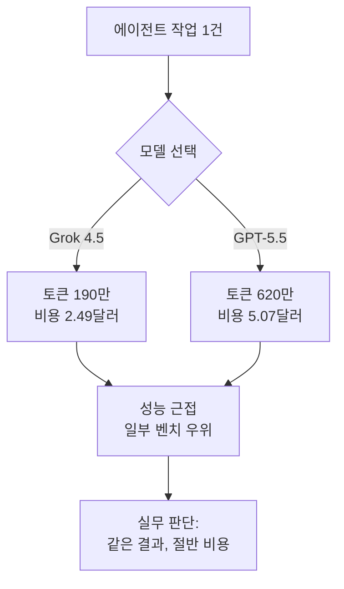

지난 몇 분기 동안 프론티어 모델 경쟁은 벤치마크 점수 한두 점을 두고 벌어졌습니다. 그런데 2026년 7월 8일 SpaceXAI가 공개한 Grok 4.5는 질문 자체를 바꿔 놓았습니다. Opus 4.8이나 GPT-5.5와 성능이 근접한다면, 그다음에 남는 질문은 "누가 더 똑똑한가"가 아니라 "같은 일을 누가 더 싸게 끝내는가"입니다. 이 글은 인프라를 운영하며 모델 비용을 매달 결제하는 엔지니어링 리더와 AI 팀을 위한 것입니다. Grok 4.5의 공개 수치를 근거로 모델 경제학이 어떻게 이동하고 있는지, 그리고 그 흐름이 ThakiCloud 같은 멀티테넌트 추론 플랫폼에 무엇을 의미하는지 다룹니다.

## 개요: 벤치마크 경쟁에서 경제성 경쟁으로

Grok 4.5는 xAI 계열인 SpaceXAI가 만들었고, Grok Build와 Cursor, 그리고 xAI 콘솔에서 곧바로 쓸 수 있습니다. 일론 머스크는 이 모델을 "Opus급(Opus-class) 모델"이라고 표현했고, 실제로 일부 벤치마크에서 Opus 4.8과 GPT-5.5를 앞섰습니다. 하지만 이 릴리스에서 가장 눈에 띄는 대목은 성능이 아니라 가격표입니다. Grok 4.5는 입력 100만 토큰당 2달러, 출력 100만 토큰당 6달러입니다. 같은 급으로 비교되는 GPT-5.5와 GPT-5.6이 입력 5달러, 출력 30달러라는 점을 감안하면, 출력 기준으로 5분의 1 수준입니다.

이 가격 구조가 왜 중요한지는 실제 작업 단위로 내려가 보면 분명해집니다. 벤치마크 점수는 리더보드에서 의미가 있지만, 청구서를 결정하는 것은 태스크당 실제 소비 토큰과 단가입니다. 그리고 바로 이 지점에서 Grok 4.5는 격차를 크게 벌립니다.

## 이 모델은 무엇인가: 근접한 성능, 벌어진 비용

먼저 성능부터 정직하게 보겠습니다. Grok 4.5는 모든 벤치마크에서 우위에 있지 않습니다. 공개된 수치를 그대로 옮기면 다음과 같습니다.

- Terminal Bench 2.1에서 Grok 4.5는 83.3%로, GPT-5.5의 83.4%와 사실상 동률입니다.
- 코딩 에이전트 인덱스(Coding Agent Index)에서 76점을 기록해, Codex 환경의 GPT-5.5와 같은 수준입니다.
- DeepSWE 1.1에서는 53%로, GPT-5.5의 67%에 크게 뒤집니다.
- Artificial Analysis의 지능 지수(Intelligence Index)에서는 54점으로, GPT-5.5의 55점과 근소한 차이입니다.

정리하면 코딩과 터미널 에이전트 작업에서는 최상위권과 어깨를 나란히 하지만, 어려운 소프트웨어 엔지니어링 과제(DeepSWE)에서는 아직 격차가 있습니다. 즉 Grok 4.5는 "모든 것을 이기는 모델"이 아니라 "대부분의 실무 작업을 최상위권 근처에서 처리하는 모델"입니다.

여기서 경제성이 등장합니다. 아래는 실제 에이전트 작업 한 건을 기준으로 공개된 수치입니다.

- 태스크당 비용: Grok Build의 Grok 4.5는 2.49달러, Codex의 GPT-5.5는 5.07달러입니다.
- 태스크당 평균 소비 토큰: Grok 4.5는 190만 토큰, GPT-5.5는 620만 토큰입니다.

성능이 몇 퍼센트 차이라면, 비용은 두 배 이상, 토큰 소비는 세 배 이상 차이가 납니다. 벤치마크 표에서는 한 줄 차이지만, 하루에 수천 건을 처리하는 운영 환경에서는 이 차이가 매달 청구서의 자릿수를 바꿉니다.

## 왜 지금 이 흐름이 중요한가

이 릴리스가 던지는 신호는 단순합니다. 프론티어 성능이 상향 평준화되면서, 모델을 고르는 기준이 "최고 지능"에서 "충분한 지능 × 낮은 단가"로 이동하고 있다는 것입니다. The Decoder가 지적한 것처럼, 벤치마크 격차가 이렇게 좁혀진 상황에서는 그 격차 자체가 실무 선택에서 별로 중요하지 않을 수 있습니다.

이 관점은 저희가 이전 글에서 다룬 원칙과 정확히 맞닿아 있습니다. 대부분의 에이전트 업무는 창의적 난제가 아니라 분류, 요약, 라우팅, 렌더링 같은 정형화된 작업입니다. 이런 작업의 품질은 모델 지능보다 코드 가드레일이 좌우합니다. 그렇다면 정형화된 작업은 값싼 모델로 내리고, 진짜 어려운 추론에만 최상위 모델을 남기는 라우팅이 합리적입니다. Grok 4.5는 이 라우팅에서 "충분히 똑똑한 싼 티어"의 선택지를 하나 더 넓혀 줍니다.

동시에 주의할 점도 분명합니다. 태스크당 토큰 소비가 세 배 적다는 것은 단가만의 문제가 아니라 모델이 같은 작업을 더 적은 왕복으로 끝낸다는 뜻일 수 있습니다. 이는 지연 시간과 처리량에도 유리하게 작용합니다. 다만 이 수치는 특정 벤치 환경(Grok Build 대 Codex)에서 나온 값이므로, 실제 워크로드에서는 자체 측정으로 확인해야 합니다.

## ThakiCloud 제품 적용 시사점

ThakiCloud의 ai-platform은 K8s와 Kueue 기반 GPU 스케줄링 위에서 다양한 고객 환경에 모델을 서빙하는 멀티테넌트 추론 플랫폼입니다. Grok 4.5 같은 릴리스는 저희에게 두 가지 층위에서 의미가 있습니다.

첫째는 모델 라우팅 경제학입니다. 저희는 이미 작업 성격에 따라 모델 티어를 나눕니다. 탐색과 분류는 값싼 티어, 구현과 리뷰는 중간 티어, 아키텍처와 복잡한 추론은 최상위 티어로 라우팅합니다. 프론티어 근처 성능을 절반 이하 가격에 제공하는 모델이 등장하면, "충분히 똑똑한 싼 티어"의 커버리지가 넓어지고, 최상위 모델을 호출해야 하는 구간이 줄어듭니다. 그 결과 같은 품질을 더 낮은 총비용으로 유지할 수 있습니다. 핵심은 이 판단을 사람의 직관이 아니라 코드가 측정한 실제 산출물 품질로 내려야 한다는 것입니다.

둘째는 온프레미스와 소버린 환경의 비용 논리입니다. 국내 공공과 금융, 국정원 요구 대응처럼 데이터를 외부로 내보낼 수 없는 고객에게는 self-hosting이 전제 조건입니다. 이런 환경에서 GPU 자원은 유한하므로, 태스크당 토큰 소비가 적은 모델은 같은 하드웨어로 더 많은 동시 요청을 처리하게 해 줍니다. 즉 토큰 효율은 API 청구서만의 문제가 아니라 온프렘 클러스터의 실질 처리량 문제이기도 합니다. ai-platform이 경쟁력을 갖는 지점이 바로 낮은 서빙 비용이며, 토큰 효율이 좋은 모델은 이 강점을 곧바로 증폭시킵니다.

셋째로, 에이전트 관점에서는 Paxis와 연결됩니다. Paxis는 ai-platform 위에서 도는 Agent-Native Cloud 제어 평면으로, 스킬을 격리 샌드박스에서 실행하고 모든 행동을 정책 게이트와 감사 로그로 통과시킵니다. 에이전트 경제성은 결국 "한 작업을 끝내는 데 드는 모델 비용"으로 수렴하는데, 저비용 고효율 모델의 등장은 에이전트 워크플로 한 건의 손익 구조를 개선합니다. 싼 서빙이 에이전트 경제성을 만든다는 명제가 여기서 다시 확인됩니다.

## 한계 및 반론

낙관만 하기 전에 반대편도 봐야 합니다. 먼저 이 수치들은 대부분 공급자와 초기 분석 기관이 제시한 값입니다. Terminal Bench나 Coding Agent Index 같은 지표는 실제 프로덕션 워크로드와 상관관계가 완벽하지 않습니다. DeepSWE 1.1에서 53% 대 67%라는 격차가 보여주듯, 어려운 과제에서는 여전히 최상위 모델이 우위입니다. 비용이 싸다는 이유로 어려운 추론까지 싼 모델에 몰아넣으면, 재시도와 실패 복구 비용이 오히려 늘어 총비용이 역전될 수 있습니다.

둘째, 태스크당 토큰 190만이라는 효율 수치는 특정 하니스(Grok Build)에서 측정된 것입니다. 다른 에이전트 프레임워크나 다른 프롬프트 구조에서는 재현되지 않을 수 있습니다. 벤더 발표 수치를 그대로 자기 청구서에 대입하는 것은 위험하며, 반드시 자체 골든셋으로 A/B 측정을 해야 합니다.

셋째, Grok 4.5는 오픈웨이트 모델이 아니라 API로 제공되는 폐쇄형 모델입니다. 따라서 데이터 주권이 핵심인 온프렘 환경에는 직접 배포할 수 없습니다. 소버린 고객에게는 여전히 self-hosting 가능한 오픈웨이트 모델이 필요하며, Grok 4.5의 경제성은 클라우드 API 워크로드에 한정된 이야기입니다.

결론적으로 Grok 4.5는 "프론티어 성능이 상향 평준화되면 다음 전장은 경제성"이라는 흐름을 상징적으로 보여주는 릴리스입니다. 벤치마크 몇 점을 좇기보다, 자기 워크로드에서 태스크당 비용과 토큰 효율을 실제로 측정하고, 그 결과로 모델을 라우팅하는 팀이 이 국면에서 이깁니다. 그리고 그 측정과 라우팅을 자동화하는 것이 바로 저희가 매일 밤 하는 일입니다.

## 출처

- [Introducing Grok 4.5 · Cursor](https://cursor.com/blog/grok-4-5)
- [SpaceXAI releases Grok 4.5, which Elon describes as an 'Opus-class model' · TechCrunch](https://techcrunch.com/2026/07/08/spacexai-releases-grok-4-5-which-elon-describes-as-an-opus-class-model/)
- [Grok 4.5 is so cheap compared to Fable 5 and GPT 5.5 that benchmark gaps may not matter much · The Decoder](https://the-decoder.com/grok-4-5-is-so-cheap-compared-to-fable-5-and-gpt-5-5-that-benchmark-gaps-may-not-matter-much/)
- [Grok 4.5 (high): Intelligence, Performance & Price Analysis · Artificial Analysis](https://artificialanalysis.ai/models/grok-4-5)
