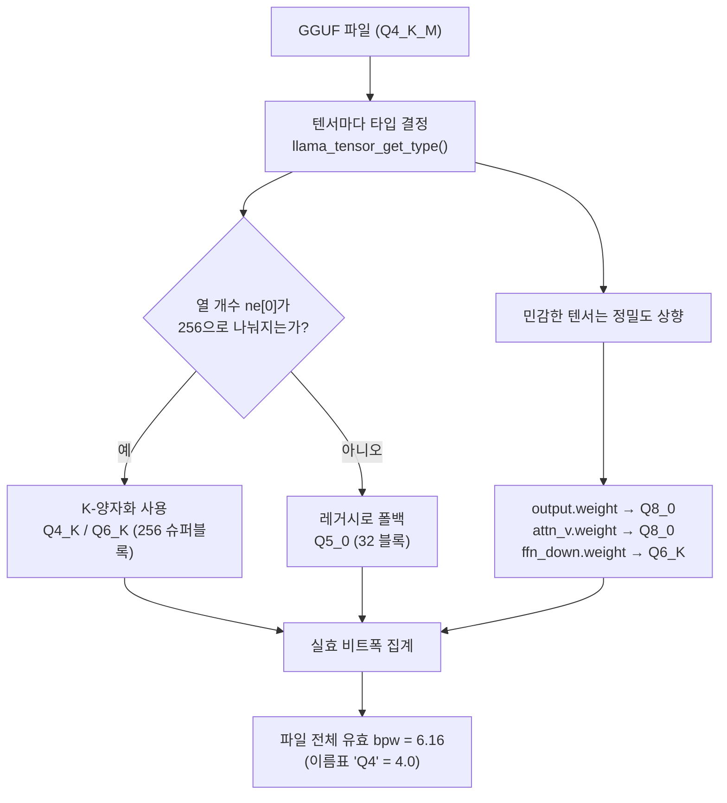

## 개요

로컬에서 LLM을 돌려 본 사람이라면 `Q4_K_M`, `Q5_K_M`, `Q8_0` 같은 이름표를 한 번쯤 봤을 것입니다. 대부분은 여기서 "Q4는 4비트라 가장 작고 빠르겠지" 정도로 이해하고 파일을 내려받아 실행합니다. 그런데 이 이름표는 생각보다 많은 것을 숨기고 있습니다. `Q4_K_M`이라고 적힌 파일이 정말 전부 4비트로 채워져 있는지, 실제로 파일을 열어 텐서 하나하나를 확인해 본 사람은 많지 않습니다.

이 글은 엔지니어링 리더와 추론 비용을 책임지는 실무자, 그리고 온프레미스로 모델을 서빙하려는 팀을 위한 것입니다. 저희는 Qwen2.5-0.5B-Instruct의 GGUF 파일을 여러 양자화 레벨로 받아 파일 크기를 실측하고, `Q4_K_M` 파일 하나를 텐서 단위로 완전히 해부했습니다. 결과는 직관과 상당히 달랐습니다. 이 차이를 이해하는 것이 왜 서빙 비용과 품질을 좌우하는지, 그리고 그것이 ThakiCloud의 추론 인프라에서 어떤 의미를 갖는지까지 정리합니다.

미리 결론을 말하면, 이 모델의 `Q4_K_M` 파일에서 진짜 4비트 K-양자화(Q4_K) 텐서는 전체 가중치 용량의 6.1퍼센트에 불과했고, 파일의 실효 비트폭은 4가 아니라 **6.16비트**였습니다. 이름표가 거의 거짓말에 가까웠던 셈입니다.


## 이 기술은 무엇인가

GGUF는 llama.cpp 생태계에서 쓰는 단일 파일 모델 포맷입니다. 하나의 파일 안에 메타데이터(아키텍처, 토크나이저, 하이퍼파라미터)와 모든 텐서의 양자화된 가중치가 함께 담깁니다. 핵심은 텐서마다 **서로 다른 양자화 타입**을 쓸 수 있다는 점입니다. 그래서 `Q4_K_M` 같은 파일 레벨 이름표는 "지배적인 타입"을 가리킬 뿐, 파일 전체가 그 타입이라는 뜻이 아닙니다.

llama.cpp의 양자화 타입은 크게 두 계열로 나뉩니다. 하나는 32개 가중치를 한 블록으로 묶는 **레거시 계열**(Q4_0, Q5_0, Q8_0)이고, 다른 하나는 256개 가중치를 하나의 슈퍼블록으로 묶는 **K-양자화 계열**(Q4_K, Q5_K, Q6_K)입니다. K-양자화는 슈퍼블록 안에서 스케일과 최솟값을 다시 잘게 나눠 저장하기 때문에, 같은 비트폭이라도 레거시보다 품질이 좋습니다. `Q4_K_M`의 `K`가 바로 이 K-양자화를 뜻하고, `M`은 민감한 텐서 일부를 더 높은 정밀도(Q6_K)로 올리는 "중간" 프리셋을 의미합니다.


슈퍼블록 구조를 조금 더 들여다보면 왜 K-양자화가 더 효율적인지 보입니다. 예를 들어 Q4_K는 256개 가중치를 144바이트에 담습니다. 이 중 순수 4비트 값은 256 × 4비트 = 128바이트이고, 나머지 16바이트가 슈퍼블록을 8개의 하위블록으로 나눠 각각의 스케일과 최솟값을 6비트로 다시 양자화해 저장하는 메타데이터입니다. 즉 값 자체는 4비트지만, 그 값을 복원하는 스케일을 촘촘히 두어 오차를 줄입니다. 레거시 Q4_0이 32개마다 스케일 하나만 두는 것과 대비됩니다. 그래서 Q4_K의 실제 비트폭은 144 × 8 ÷ 256 = 4.5비트로, 순수 4비트보다 약간 크지만 품질은 훨씬 안정적입니다.

여기서 결정적인 제약이 하나 있습니다. **K-양자화는 텐서의 열 개수(ggml 기준 `ne[0]`)가 256으로 나누어떨어질 때만 쓸 수 있습니다.** 슈퍼블록이 256개 단위이기 때문입니다. 이 조건을 만족하지 못하면 llama.cpp는 조용히 레거시 계열(주로 Q5_0)로 되돌아갑니다. 이 한 줄의 규칙이 오늘 실험의 결과를 전부 설명합니다.



## 설치 및 통합

실험은 별도 의존성 없이 재현할 수 있습니다. 파일 크기는 허깅페이스 API가 실제 바이트 수를 돌려주고, 텐서 타입은 `gguf` 리더로 파일을 직접 읽으면 됩니다.

```bash
# 1) 리더와 다운로더 설치
pip install gguf huggingface_hub

# 2) Q4_K_M 파일 한 개만 내려받기 (0.5B라 500MB 미만)
hf download Qwen/Qwen2.5-0.5B-Instruct-GGUF \
  qwen2.5-0.5b-instruct-q4_k_m.gguf --local-dir ./gguf
```

내려받은 파일의 텐서 타입을 열어 보는 코드는 다음과 같습니다. GGUF 헤더에는 각 텐서의 이름, 차원, 그리고 ggml 타입 정수가 그대로 박혀 있어서, 이 값만 집계하면 파일이 실제로 무엇으로 채워졌는지 알 수 있습니다.

```python
from collections import Counter
from gguf import GGUFReader

r = GGUFReader("gguf/qwen2.5-0.5b-instruct-q4_k_m.gguf")
hist = Counter()
for t in r.tensors:
    hist[t.tensor_type.name] += 1
    # 대표 텐서 몇 개의 실제 타입 확인
    if t.name in ("token_embd.weight", "output.weight",
                  "blk.0.attn_v.weight", "blk.0.ffn_down.weight",
                  "blk.0.attn_q.weight"):
        print(f"{t.name:26s} {t.shape} -> {t.tensor_type.name}")
print(dict(hist))
```

블록당 바이트 수는 ggml의 정의에서 그대로 나옵니다. 예를 들어 Q4_K는 256개 가중치를 144바이트로 저장하므로 가중치당 4.5비트, Q6_K는 256개를 210바이트로 저장하므로 6.5625비트, 레거시 Q5_0은 32개를 22바이트로 저장하므로 5.5비트입니다. 텐서마다 (원소 수 ÷ 블록 크기) × 블록 바이트를 더하면 파일의 실효 비트폭을 정확히 계산할 수 있습니다.

## 실제 실험 결과

먼저 파일 크기입니다. 같은 모델을 7개 레벨로 받아 fp16 원본(1266MB)과 비교한 실측치입니다.

| 양자화 | 파일 크기 | fp16 대비 |
|---|---|---|
| Q2_K | 415.2 MB | 32.8% |
| Q3_K_M | 432.0 MB | 34.1% |
| Q4_0 | 428.7 MB | 33.9% |
| **Q4_K_M** | **491.4 MB** | **38.8%** |
| Q5_K_M | 522.2 MB | 41.2% |
| Q6_K | 650.4 MB | 51.4% |
| Q8_0 | 675.7 MB | 53.4% |

여기서 이미 이상한 점이 보입니다. Q2_K(415MB)와 Q4_0(429MB)의 차이가 겨우 14MB입니다. 비트를 절반으로 줄였는데 파일은 거의 안 줄어든 것입니다. 그리고 `Q4_K_M`(491MB)이 순수 4비트인 `Q4_0`(429MB)보다 오히려 더 큽니다. 이름만 보면 이해되지 않는 결과입니다.

진짜 이유는 `Q4_K_M` 파일 내부를 텐서 단위로 열어 보면 드러납니다. 291개 텐서의 타입 분포는 다음과 같았습니다.

| 실제 타입 | 텐서 수 | 명목 bpw | 가중치 용량 비중 |
|---|---|---|---|
| Q5_0 | 133 | 5.5 | 54.9% |
| Q8_0 | 13 | 8.5 | 30.1% |
| Q6_K | 12 | 6.5625 | 8.8% |
| Q4_K | 12 | 4.5 | 6.1% |
| F32 (norm/bias) | 121 | 32.0 | 0.1% |


`Q4_K_M`이라는 이름표가 무색하게, 진짜 4비트 K-양자화(Q4_K)는 전체 가중치 용량의 **6.1퍼센트**뿐이었습니다. 대신 5.5비트 레거시인 Q5_0이 절반 이상(54.9퍼센트)을 차지했고, 8.5비트 Q8_0이 30퍼센트를 먹었습니다. 파일 전체의 실효 비트폭을 계산하면 **6.16비트**로, 이름표가 암시하는 4비트의 1.5배가 넘었습니다.

대표 텐서를 하나씩 확인해 보면 규칙이 명확해집니다. 실측한 타입은 다음과 같았습니다.

- `token_embd.weight` (896 × 151936) → **Q5_0**
- `output.weight` (896 × 151936) → **Q8_0**
- `blk.0.ffn_down.weight` (4864 × 896) → **Q6_K**
- `blk.0.attn_v.weight` (896 × 128) → **Q8_0**
- `blk.0.attn_q.weight` (896 × 896) → **Q5_0**


패턴이 보이시나요. K-양자화(Q4_K, Q6_K)가 붙은 텐서는 `ffn_down`처럼 열 개수 `ne[0]`가 4864인 경우뿐이었습니다. 4864는 256으로 나누어떨어집니다(19 × 256). 반면 대부분의 텐서는 `ne[0]`가 896인데, 896은 256으로 나누어떨어지지 않습니다(3.5 × 256). 그래서 이 텐서들은 K-양자화를 쓰지 못하고 전부 레거시 Q5_0으로 폴백했습니다. 여기에 임베딩과 출력, 어텐션 밸류처럼 품질에 민감한 텐서를 정밀도 상향(Q5_0, Q8_0)한 것이 겹치면서, 이름표는 `Q4_K_M`인데 실체는 5.5~8.5비트 덩어리가 된 것입니다.

실효 비트폭 6.16이 어디서 나왔는지 직접 계산해 보면 이렇습니다. 이 파일에는 총 6억 3천만 개의 양자화 대상 가중치가 들어 있고, 그것을 담는 데 쓰인 바이트는 약 485MB였습니다. 485,452,288바이트 × 8 ÷ 630,167,424개 = 가중치당 6.16비트입니다. 여기에 파일 메타데이터와 정렬 패딩 약 6MB를 더하면 실제 파일 크기 491MB와 정확히 맞아떨어집니다. 계산이 파일 크기와 일치한다는 것은 텐서 타입 판독이 정확했다는 방증이기도 합니다.

파일 크기 표의 두 가지 이상한 점도 이제 설명됩니다. Q2_K(415MB)가 Q4_0(429MB)보다 겨우 작은 이유는, 이 소형 모델에서 임베딩과 출력 텐서가 전체 가중치의 큰 몫을 차지하는데 이들은 어느 레벨에서도 고정밀도로 유지되기 때문입니다. 비트를 아무리 낮춰도 줄지 않는 고정 비용이 바닥을 받치는 셈입니다. 그리고 `Q4_K_M`이 순수 4비트 `Q4_0`보다 큰 이유는, `M` 프리셋이 민감한 텐서를 Q6_K와 Q8_0으로 끌어올린 대가를 파일 크기로 치렀기 때문입니다. 이름표의 숫자는 낮지만 실효 비트폭은 오히려 더 높습니다.

정리하면, 이 실험이 실측으로 보여 준 사실은 세 가지입니다. 첫째, 파일 레벨 이름표는 지배적 타입을 가리킬 뿐 실효 비트폭을 보장하지 않습니다. 둘째, 히든 사이즈가 256의 배수가 아닌 소형 모델에서는 K-양자화가 상당 부분 무력화되어 이름표와 실체의 괴리가 커집니다. 셋째, 소형 모델은 임베딩과 출력 텐서가 전체 용량에서 차지하는 비중이 커서, 이들을 고정밀도로 유지하는 순간 "4비트 양자화"의 절감 효과가 크게 희석됩니다.

## ThakiCloud 제품 적용 시사점

이 실험은 작은 모델 하나를 뜯어본 것에 불과하지만, 그 교훈은 프로덕션 서빙 인프라에 그대로 이어집니다. ThakiCloud의 ai-platform은 Kubernetes와 Kueue 기반 GPU 스케줄링 위에서 다양한 고객 환경에 모델을 서빙합니다. 이때 "어떤 양자화를 고를 것인가"는 단순한 취향이 아니라 GPU 메모리 배정, 배치 크기, 그리고 결국 토큰당 비용을 좌우하는 결정입니다.

이름표를 그대로 믿으면 용량 계획이 어긋납니다. `Q4_K_M`을 "4비트니까 원본의 4분의 1"로 가정하고 GPU 메모리를 배정하면, 실제로는 위 실험처럼 원본의 40퍼센트 안팎을 차지해 배치 슬롯이 예상보다 빨리 부족해집니다. 특히 소형 모델을 다수의 테넌트에 촘촘히 얹어야 하는 멀티테넌트 서빙에서는, 실효 비트폭을 실측해 두는 것과 이름표만 믿는 것의 차이가 노드당 수용 가능한 모델 수로 직결됩니다. 저희가 서빙 이미지를 빌드할 때 GGUF 파일을 텐서 단위로 검증하는 이유가 여기에 있습니다. 자체 호스팅과 온프레미스, 소버린 배포를 요구하는 고객일수록 이 실측 습관이 곧 비용 경쟁력이 됩니다.


이 검증 자체를 반복 가능한 작업으로 만드는 것은 Paxis의 몫입니다. Paxis는 ai-platform 위에서 도는 ThakiCloud의 Agent-Native Cloud 제어 평면으로, 스킬과 도구, 정책, 감사 로그를 일급 리소스로 다룹니다. "GGUF 파일을 받아 텐서 타입을 집계하고 실효 비트폭이 임계를 넘으면 경고한다"는 오늘의 실험을 하나의 스킬로 등록해 두면, 격리된 샌드박스에서 실행되고 모든 결과가 정책 게이트와 감사 로그를 통과합니다. 새 모델이 레지스트리에 올라올 때마다 사람이 매번 파일을 열어 보는 대신, 검증된 골격이 자동으로 돌아가는 셈입니다. 저비용 서빙(ai-platform)이 만드는 경제성과, 그 서빙을 안전하게 반복 가능하게 만드는 오케스트레이션(Paxis)이 이렇게 맞물립니다.

## 한계 및 반론

몇 가지는 분명히 해 둘 필요가 있습니다.

첫째, 이 결과는 히든 사이즈가 896인 Qwen2.5-0.5B에 국한된 극단적 사례에 가깝습니다. 히든 사이즈가 256의 배수인 대형 모델(예: 4096, 8192)에서는 K-양자화가 정상적으로 적용되어 `Q4_K_M`의 실효 비트폭이 4.8비트 안팎으로 훨씬 이름표에 가깝습니다.


즉 "이름표는 항상 거짓말"이라는 결론이 아니라, "이름표와 실체의 괴리는 모델 구조에 따라 크게 달라지며, 소형 모델일수록 크다"는 것이 정확한 교훈입니다.

둘째, 파일 크기가 크다고 해서 반드시 나쁜 것은 아닙니다. 임베딩과 출력 텐서를 고정밀도로 유지하는 것은 소형 모델의 품질 붕괴를 막기 위한 의도적 선택입니다. 다시 말해 이 `Q4_K_M`은 "잘못 만들어진" 파일이 아니라, 작은 모델에서 품질을 지키기 위해 자동으로 정밀도를 끌어올린 합리적 결과입니다. 다만 그 대가가 이름표에 드러나지 않을 뿐입니다.

셋째, 이 글은 파일 구조와 용량만 측정했지 실제 추론 품질(퍼플렉서티, 벤치마크 점수)은 측정하지 않았습니다. 비트폭과 품질의 관계는 별도의 실험이 필요하며, 이는 다음 글의 주제로 남겨 둡니다. 여기서 말할 수 있는 것은 "용량과 메모리 계획을 이름표로 세우지 말고 실측하라"는 운영상의 원칙뿐입니다.

로컬 모델을 실행 버튼만 눌러 돌리는 것과, 파일 안에 무엇이 들어 있는지 아는 것 사이의 차이는 바로 이런 실측 습관에서 갈립니다. 이름표 뒤의 숫자를 직접 확인하는 5분이 서빙 비용 계획 전체의 정확도를 바꿉니다.

## 출처

- Qwen2.5-0.5B-Instruct-GGUF 모델 저장소: [huggingface.co/Qwen/Qwen2.5-0.5B-Instruct-GGUF](https://huggingface.co/Qwen/Qwen2.5-0.5B-Instruct-GGUF)
- llama.cpp 양자화 문서: [github.com/ggml-org/llama.cpp](https://github.com/ggml-org/llama.cpp/blob/master/tools/quantize/README.md)
- 파일 크기, 텐서 타입 분포, 실효 비트폭은 위 저장소의 실제 파일을 직접 내려받아 측정한 값입니다.
