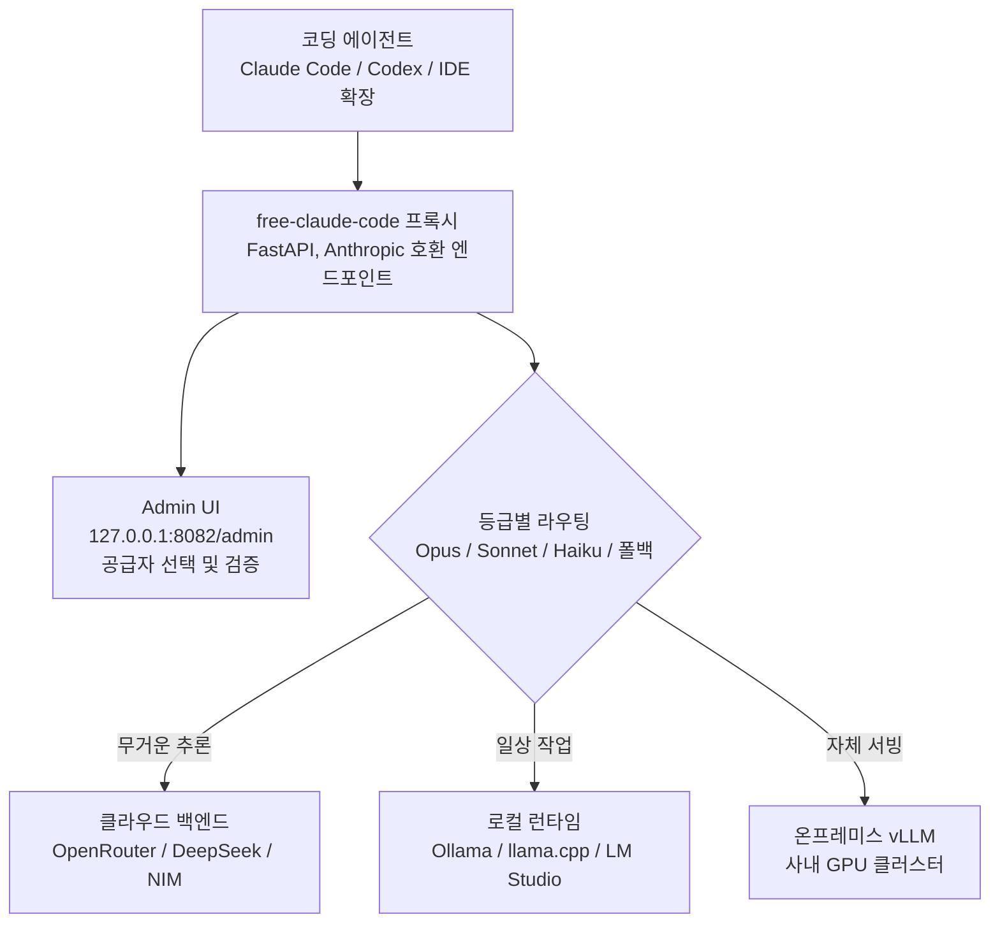

## 개요

Claude Code와 Codex는 지난 1년 사이 터미널과 IDE 안에서 가장 많이 쓰이는 코딩 에이전트로 자리 잡았습니다. 문제는 이 에이전트들이 각각 Anthropic과 OpenAI의 클라우드 API에 강하게 묶여 있다는 점입니다. 사내 규정상 소스 코드를 외부 API로 흘려보낼 수 없는 팀, 망 분리 환경에서 일하는 팀, 또는 자체 GPU에 이미 오픈 웨이트 모델을 서빙하고 있는 팀에게는 이 결합이 그대로 벽이 됩니다.

이 글은 코딩 에이전트의 운영 비용과 데이터 주권을 함께 고민하는 엔지니어링 리더, 그리고 온프레미스로 모델을 서빙하려는 실무자를 위한 것입니다. 최근 개발자 커뮤니티에서 화제가 된 `free-claude-code`라는 오픈소스 프록시를 실제 저장소 기준으로 해부했습니다. 이 도구는 "구독을 없앤다"는 다소 자극적인 홍보 문구로 알려졌지만, 기술적으로 흥미로운 부분은 따로 있습니다. Claude Code라는 검증된 에이전트의 사용자 경험을 그대로 유지하면서, 그 뒤편의 모델만 자체 인프라로 갈아 끼우는 구조입니다.

미리 정리하면, 이 프록시의 핵심 가치는 "공짜"가 아니라 "격리"입니다. 에이전트 UI와 모델 백엔드를 분리해, 같은 워크플로를 사내 GPU에서 도는 오픈 모델로 옮길 수 있게 해 줍니다. 이 분리가 왜 온프레미스 AI 인프라를 운영하는 관점에서 의미가 큰지, 그리고 어떤 한계를 함께 안고 가야 하는지를 짚습니다.

## 이 도구는 무엇인가

`free-claude-code`는 FastAPI 기반의 로컬 프록시 서버입니다. Anthropic API와 호환되는 엔드포인트를 제공하기 때문에, Claude Code CLI, Codex CLI, VS Code 확장, JetBrains ACP, 그리고 일부 챗봇이 이 프록시를 진짜 Anthropic 서버로 착각하고 그대로 붙습니다. 에이전트 입장에서는 바뀐 것이 없고, 실제로 요청을 받아 처리하는 모델만 뒤에서 교체됩니다.

지원하는 백엔드가 넓다는 점이 이 프로젝트의 특징입니다. 저장소 설명에 따르면 클라우드와 로컬을 합쳐 24개 공급자를 Admin UI에서 전환할 수 있고, 여기에는 NVIDIA NIM, OpenRouter, DeepSeek 같은 클라우드 API와 함께 LM Studio, llama.cpp, Ollama 같은 로컬 런타임이 포함됩니다. 즉 상용 API로 붙일 수도 있고, 자체 GPU에 띄운 오픈 모델로 붙일 수도 있습니다.

라우팅 구조도 단순한 스위치가 아닙니다. Claude Code는 내부적으로 Opus, Sonnet, Haiku라는 세 등급의 모델을 상황에 따라 나눠 씁니다. 무거운 추론은 Opus, 일상 작업은 Sonnet, 가벼운 탐색은 Haiku로 보내는 식입니다. `free-claude-code`는 이 세 등급과 폴백 트래픽을 각각 다른 백엔드 모델로 매핑할 수 있게 해 줍니다. 스트리밍, 도구 호출(tool use), 추론(reasoning) 지원은 호환되는 모델 범위 안에서 유지됩니다. 이 등급별 라우팅은 ThakiCloud 내부에서 이미 쓰는 원칙과 정확히 겹칩니다. 탐색은 값싼 모델로, 구현은 중간 모델로, 아키텍처 판단만 비싼 모델로 보내는 티어 분리가 바로 그것입니다.

전체 요청 흐름을 그림으로 정리하면 다음과 같습니다.



기존 방식과의 차이는 분명합니다. 지금까지 코딩 에이전트를 오픈 모델로 돌리려면 에이전트 자체를 포크하거나, 모델마다 다른 API 껍데기를 직접 맞춰야 했습니다. 이 프록시는 그 변환 계층을 한곳에 모아, 에이전트는 손대지 않고 모델만 바꾸는 방식으로 문제를 단순화합니다.

## 설치 및 통합

저장소가 제공하는 설치 경로는 두 가지입니다. 하나는 설치 스크립트를 한 번에 내려받아 실행하는 방식입니다.

```bash
curl -fsSL "https://github.com/Alishahryar1/free-claude-code/blob/main/scripts/install.sh?raw=1" | sh
```

이 스크립트는 `free-claude-code` 본체와 함께 `uv`, Python 3.14를 프로비저닝합니다. Claude Code와 Codex가 설치되어 있지 않으면 함께 설치하는데, 이 과정에서 npm이 필요하므로 Node.js가 먼저 깔려 있어야 합니다. 같은 명령을 다시 실행하면 업데이트로 동작합니다.

수동 설치를 선호한다면 저장소를 직접 클론한 뒤 환경 파일을 준비하는 방식도 있습니다.

```bash
git clone https://github.com/Alishahryar1/free-claude-code.git
cd free-claude-code
cp .env.example .env
pip install uv
```

프록시가 뜨면 브라우저에서 로컬 전용 Admin UI에 접속해 공급자를 고르고 연결을 검증합니다.

```text
http://127.0.0.1:8082/admin
```

이 화면에서 각 공급자의 키를 넣고 연결 상태를 확인한 뒤, Opus, Sonnet, Haiku, 폴백 슬롯에 어떤 모델을 배치할지 정합니다. 설정을 마치면 Claude Code가 이 프록시를 바라보도록 API 베이스 주소만 바꿔 주면 됩니다. 여기서부터는 평소 쓰던 Claude Code 명령을 그대로 쓰되, 실제 추론은 지정한 백엔드에서 일어납니다.

## 실제 동작 방식과 검증

이번 분석에서는 저장소의 공개 문서와 설치 스크립트를 실제로 확인해 위 명령과 구조를 검증했습니다. 다만 24개 백엔드 전체에 대해 실제 추론 지연이나 정확도를 측정하지는 않았습니다. 유의미한 서빙 벤치마크는 자체 GPU에 오픈 모델을 올린 상태에서 측정해야 하는데, 이 글을 작성한 환경에는 로컬 GPU가 없어 전체 백엔드 왕복 실측은 수행하지 못했습니다. 수치를 지어내지 않기 위해, 확인되지 않은 지연이나 처리량은 이 글에 넣지 않았습니다.

대신 구조적으로 검증 가능한 사실은 분명합니다. 프록시가 Anthropic 호환 엔드포인트를 노출하기 때문에, 에이전트는 백엔드가 무엇인지 알 필요가 없습니다. 이 계약(contract)이 유지되는 한, 백엔드를 Ollama에서 사내 vLLM으로 바꾸는 일은 Admin UI에서 슬롯 하나를 재지정하는 것으로 끝납니다. 에이전트 재설치도, 워크플로 변경도 필요 없습니다. 이 교체 비용이 사실상 0에 가깝다는 점이 이 아키텍처의 실질적 강점입니다.

품질 측면의 냉정한 사실도 함께 기록합니다. 오픈 모델로 붙였을 때의 코딩 품질은 Anthropic의 상위 모델과 동일하지 않습니다. 특히 긴 도구 호출 체인이나 복잡한 리팩터링에서는 상용 최상위 모델과 격차가 드러날 수 있습니다. 따라서 이 프록시는 "품질을 유지한 채 공짜로 쓰는 도구"가 아니라 "품질과 주권 사이의 균형점을 팀이 직접 고르게 해 주는 도구"로 이해하는 편이 정확합니다.

## ThakiCloud 제품 적용 시사점

이 도구가 던지는 질문은 ThakiCloud가 두 제품으로 풀고 있는 문제와 정확히 맞닿아 있습니다.

먼저 **Paxis** 관점입니다. Paxis는 ThakiCloud의 Agent-Native Cloud 제어 평면으로, 스킬과 도구, 정책, 감사 로그를 일급 리소스로 다룹니다. `free-claude-code`가 보여 준 "에이전트 UI와 모델 백엔드의 분리"는 Paxis가 지향하는 방향의 축소판입니다. Paxis에서는 코딩 에이전트의 모델 라우팅을 개인이 로컬 Admin UI에서 손으로 고르는 대신, 조직 단위 정책 게이트로 통제할 수 있습니다. 어떤 팀의 어떤 요청이 어떤 백엔드로 가는지, 민감한 저장소의 코드는 반드시 사내 모델로만 처리되도록 강제하는지가 정책과 감사 로그로 남습니다. 프록시 하나가 개인 생산성을 바꾼다면, Paxis는 같은 원리를 조직의 거버넌스로 끌어올립니다. 여기에 MCP 커넥터와 격리 샌드박스 실행이 더해지면, 외부 도구 호출까지 통제 범위 안으로 들어옵니다.

다음은 **ai-platform** 관점입니다. 이 프록시가 로컬 런타임으로 Ollama와 llama.cpp를 지원한다는 것은, 결국 누군가는 그 오픈 모델을 안정적으로 서빙해야 한다는 뜻입니다. 개인 노트북의 Ollama는 데모에는 충분하지만, 팀 전체가 코딩 에이전트를 온종일 돌리는 부하는 감당하지 못합니다. ThakiCloud의 ai-platform은 K8s와 Kueue 기반으로 GPU를 스케줄링하고 vLLM으로 오픈 모델을 멀티테넌트 환경에서 서빙합니다. 코딩 에이전트의 트래픽을 이 서빙 계층으로 보내면, 개인 장비의 한계 없이 팀 규모의 온프레미스 코딩 에이전트를 운영할 수 있습니다. 낮은 서빙 비용과 망 분리 대응이 여기서 경쟁력이 됩니다.

두 렌즈는 서로를 보완합니다. ai-platform이 오픈 모델을 값싸고 안정적으로 서빙하면, Paxis는 그 위에서 에이전트 트래픽을 정책과 감사로 통제합니다. 저비용 서빙이 에이전트의 경제성을 만들고, 거버넌스가 그 경제성을 조직이 안심하고 쓸 수 있는 형태로 바꿉니다.

## 한계 및 반론

첫째, 약관 문제를 정직하게 짚어야 합니다. Claude Code나 Codex 같은 클라이언트를 상용 구독을 우회하는 방식으로 쓰는 것은 각 서비스의 이용약관과 충돌할 수 있습니다. 이 글에서 의미 있게 보는 활용은 어디까지나 자체 소유 오픈 모델이나 정당하게 계약한 API 백엔드로 트래픽을 보내는 온프레미스 시나리오이지, 유료 서비스의 무단 우회가 아닙니다. 조직에서 도입한다면 각 클라이언트의 약관을 반드시 먼저 확인해야 합니다.

둘째, 보안 표면이 넓어집니다. 프록시는 정의상 에이전트와 모델 사이의 모든 트래픽, 즉 소스 코드와 프롬프트 전체를 가로채는 위치에 섭니다. 신뢰할 수 없는 프록시 구성은 코드 유출 경로가 될 수 있습니다. 자체 인프라 안에서, 감사 가능한 형태로 운영해야 이점이 살아납니다. 바로 이 지점이 Paxis의 정책 게이트와 감사 로그가 필요한 이유이기도 합니다.

셋째, 품질과 유지보수 부담입니다. 앞서 적었듯 오픈 모델의 코딩 품질은 상용 최상위 모델과 차이가 있고, 24개 백엔드를 지원한다는 것은 그만큼 공급자 API 변경에 취약하다는 뜻이기도 합니다. Anthropic이나 각 공급자가 API 계약을 바꾸면 프록시가 따라가야 합니다. 개인 프로젝트 수준의 유지보수에 조직의 핵심 워크플로를 통째로 얹는 것은 위험합니다.

정리하면, `free-claude-code`는 "공짜 Claude Code"라는 표어보다 "코딩 에이전트의 모델 계층을 분리하는 오픈소스 실험"으로 볼 때 가치가 분명합니다. 그 분리가 온프레미스 서빙과 만나면, 데이터 주권을 지키면서 팀 규모의 코딩 에이전트를 운영하는 현실적인 길이 열립니다. ThakiCloud가 ai-platform과 Paxis로 풀고 있는 것이 바로 그 길을 조직이 안전하게 걸을 수 있게 만드는 일입니다.

## 출처

- free-claude-code 저장소: [github.com/Alishahryar1/free-claude-code](https://github.com/Alishahryar1/free-claude-code)
- 설치 스크립트: [scripts/install.sh](https://github.com/Alishahryar1/free-claude-code/blob/main/scripts/install.sh)
