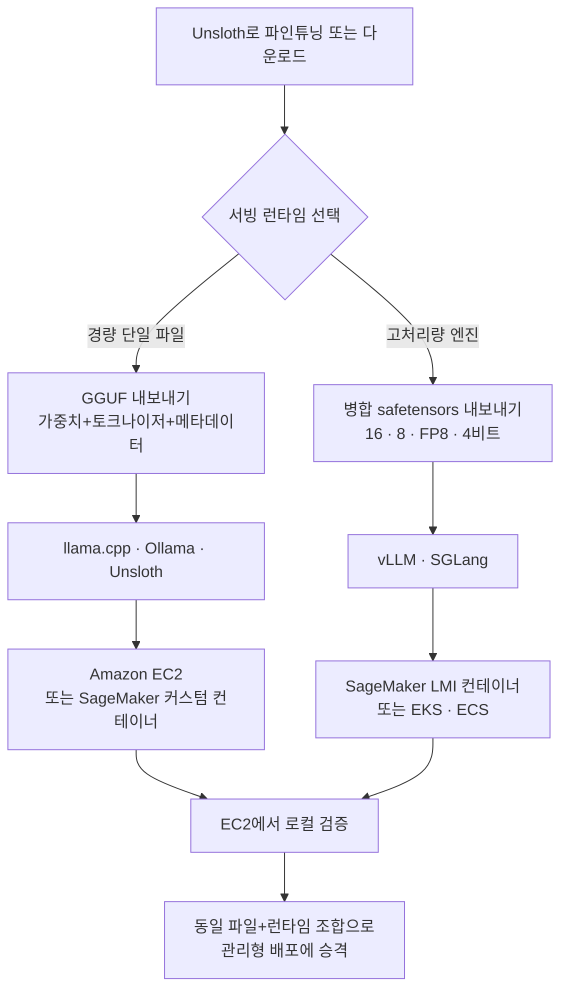

## 개요

모델을 양자화하는 방법을 다룬 글은 이미 넘칩니다. GPTQ, AWQ, GGUF, Unsloth Dynamic까지, 16비트 모델을 4비트로 줄이는 레시피는 검색 몇 번이면 찾을 수 있습니다. 그런데 정작 실무에서 팀이 멈추는 지점은 그다음입니다. 4비트로 줄인 그 파일을, 대체 어디에 어떻게 올려야 하는가. EC2 인스턴스에 직접 띄울 것인가, SageMaker 엔드포인트로 감쌀 것인가, 아니면 이미 굴리고 있는 EKS 클러스터의 파드로 넣을 것인가. 이 질문에는 정답이 하나가 아니라, 모델 파일의 형식에 따라 갈리는 지도가 있습니다.

이 글은 자체 인프라에 오픈웨이트 모델을 서빙하려는 플랫폼 엔지니어와 추론 비용을 설계하는 실무자를 위한 것입니다. 최근 AWS가 Unsloth와 함께 공개한 "Deploying quantized models on Amazon SageMaker AI with Unsloth" 가이드는 이 배포 결정을 네 가지 패턴으로 정리했습니다. 저희는 이 가이드의 핵심 논리를 뜯어보고, 왜 모델 파일 형식이 런타임을 정하고 런타임이 다시 AWS 서비스를 정하는지, 그리고 이 사고방식이 ThakiCloud처럼 Kubernetes 기반으로 멀티테넌트 서빙을 하는 인프라 설계와 어떻게 이어지는지 정리합니다.

먼저 밝혀 둘 것이 있습니다. 이 글의 명령 예시는 AWS 공식 가이드와 Unsloth 문서에서 확인한 경로이며, 벤치마크 수치를 지어내지 않았습니다. 본 검증 환경은 Apple Silicon이라 CUDA가 필요한 Unsloth 양자화와 vLLM 서빙을 로컬에서 실제로 돌려 재현하지는 못했습니다. 따라서 이 글은 실험 리포트가 아니라, 검증된 가이드에 대한 구조 분석입니다.

## 왜 배포 단계에서 양자화가 다시 중요해지는가

양자화는 흔히 학습이나 추론 속도의 문제로만 이야기됩니다. 하지만 AWS 가이드는 배포 단계에서 양자화가 세 가지를 동시에 바꾼다고 짚습니다. 첫째는 인스턴스 결정입니다. 큰 모델이 더 작은 GPU나 심지어 CPU에서도 실용적으로 돌아갈 수 있게 되면서, 필요한 인스턴스 등급 자체가 내려갑니다. 둘째는 기동과 저장 프로파일입니다. 모델 파일이 작아지면 옮기고 저장하는 속도가 빨라져 콜드 스타트와 스케일 아웃이 유리해집니다. 셋째는 배포 유연성입니다. 비용에 민감한 추론에는 더 작은 모델을, 품질에 민감한 추론에는 더 높은 정밀도의 내보내기를 골라 쓸 수 있습니다.

Unsloth의 장점은 파인튜닝, 실행, 내보내기, 배포를 하나의 워크플로로 묶는다는 데 있습니다. 특히 Unsloth Dynamic v2.0 양자화는 정확도를 최대한 보존하면서 양자화된 LLM을 실행하고 파인튜닝할 수 있게 하고, PyTorch와 협업한 양자화 인식 학습(QAT)은 순진한 4비트 양자화 대비 잃어버린 정확도를 상당 부분 회복한다고 보고됩니다. 즉 배포 전에 품질과 크기의 거래를 어느 지점에서 할지 세밀하게 고를 수 있습니다.

## 파일 형식이 런타임을 정하고, 런타임이 AWS를 정한다

가이드의 핵심 통찰은 배포 결정을 "어느 서비스를 쓸까"에서 시작하지 말라는 것입니다. 대신 "어떤 파일 형식으로 내보낼까"에서 출발하면 나머지가 자연스럽게 따라옵니다. 두 갈래가 있습니다.

한쪽은 GGUF입니다. GGUF는 가중치와 토크나이저, 메타데이터를 하나의 파일로 묶는 단일 파일 형식으로, llama.cpp, Ollama, Unsloth 같은 경량 런타임이 이걸 씁니다. AWS에서는 이 갈래가 Amazon EC2나 SageMaker AI 커스텀 컨테이너로 매핑됩니다. 가볍게 검증하고 직접 통제하고 싶을 때의 경로입니다.

다른 한쪽은 병합 safetensors입니다. Unsloth로 16비트, 8비트, FP8, 4비트 가중치를 병합해 내보내면 vLLM이나 SGLang 같은 고처리량 엔진에서 돌릴 수 있고, 이것은 SageMaker AI의 대형 모델 추론(LMI) 컨테이너나 EKS, ECS로 매핑됩니다. 처리량과 확장이 중요한 프로덕션 서빙의 경로입니다. 이 갈래를 도식으로 정리하면 다음과 같습니다.



## 설치 및 통합

가이드가 제시하는 워크플로는 네 단계로 요약됩니다. Unsloth에서 모델을 파인튜닝하거나 다운로드하고, 원하는 런타임에 맞는 형식으로 내보내고, EC2나 로컬에서 런타임을 검증한 뒤, 같은 파일과 런타임 조합을 그대로 관리형 배포로 승격하는 것입니다. 여기서 "같은 파일과 런타임 조합"이라는 점이 중요합니다. 검증 환경과 프로덕션 환경에서 형식이나 엔진이 달라지면 예상치 못한 동작이 끼어들기 때문입니다.

Unsloth에서 내보내기는 목적지 런타임에 따라 갈립니다. GGUF 경로는 다음과 같은 형태입니다.

```python
# GGUF 내보내기 (llama.cpp / Ollama / EC2 경로)
model.save_pretrained_gguf(
    "qwen-merged-gguf",
    tokenizer,
    quantization_method="q4_k_m",
)
```

병합 safetensors 경로는 vLLM이나 SGLang을 겨냥합니다.

```python
# 병합 safetensors 내보내기 (vLLM / SGLang / SageMaker LMI 경로)
model.save_pretrained_merged(
    "qwen-merged-16bit",
    tokenizer,
    save_method="merged_16bit",  # 또는 merged_4bit 등
)
```

내보낸 병합 모델은 vLLM으로 곧바로 서빙 검증을 할 수 있습니다.

```bash
# EC2 또는 로컬에서 서빙 검증
vllm serve ./qwen-merged-16bit --port 8000
```

컨테이너 기반 배포에서는 AWS Deep Learning Container(DLC)가 EC2, EKS, ECS에 걸쳐 최적화된 도커 환경을 제공합니다. 특히 vLLM DLC는 고성능 추론에 맞춰져 있어 여러 GPU와 노드에 걸친 텐서 병렬화와 파이프라인 병렬화를 기본 지원합니다. 즉 EC2에서 단일 인스턴스로 검증한 구성을, 같은 런타임을 쓰는 EKS 파드로 옮겨 수평 확장하는 흐름이 매끄럽게 이어집니다.

## ThakiCloud 제품 적용 시사점

이 배포 지도는 ThakiCloud의 ai-platform 설계 철학과 그대로 겹칩니다. ai-platform은 Kubernetes와 Kueue 기반 GPU 스케줄링 위에서 모델을 서빙하는데, AWS 가이드가 말하는 "형식이 런타임을 정하고 런타임이 인프라를 정한다"는 원칙은 특정 클라우드에 종속되지 않습니다. GGUF는 경량 검증과 엣지 배포로, 병합 safetensors는 vLLM 기반 고처리량 서빙으로 가른다는 분기는 AWS의 EKS든 온프레미스 Kubernetes든 동일하게 적용됩니다. 오히려 온프레미스와 소버린 클라우드를 요구하는 국내 고객이 많은 ThakiCloud에게는, 특정 관리형 서비스에 묶이지 않고 파일 형식과 런타임만으로 배포 경로를 표준화하는 이 사고방식이 이식성 측면에서 더 유리합니다.

실무적으로 ai-platform은 vLLM DLC가 제공하는 텐서 병렬화와 파이프라인 병렬화를 Kueue 큐잉과 결합해 멀티테넌트로 운용할 수 있습니다. 고객마다 다른 정밀도의 내보내기를 골라, 비용 민감 워크로드에는 4비트 병합 모델을, 품질 민감 워크로드에는 FP8이나 16비트를 배정하는 식의 세분화가 가능합니다. Unsloth의 QAT로 4비트에서도 정확도를 회복해 두면, 낮은 서빙 비용과 품질을 동시에 잡는 지점이 넓어집니다. ai-platform이 낮은 서빙 단가에서 경쟁력을 갖는 배경이 바로 이런 형식과 런타임의 세밀한 매칭입니다.

이 저비용 서빙은 다시 에이전트 경제성으로 이어집니다. ThakiCloud의 Agent-Native Cloud 제어 평면인 Paxis는 격리 샌드박스에서 스킬을 실행하며 대형 오픈웨이트 모델을 반복 호출하는데, 파인튜닝한 도메인 모델을 Unsloth로 양자화해 ai-platform에 올려 두면 Paxis 에이전트가 그 모델을 저렴하게 소비할 수 있습니다. 형식 기반 배포 표준화가 곧 에이전트 워크로드의 단가를 떨어뜨리는 구조입니다.

## 한계 및 반론

이 가이드는 배포 지도로서는 명확하지만 몇 가지 유의점이 있습니다. 먼저 양자화 방식과 런타임의 조합에 따라 실제 품질과 처리량은 크게 달라집니다. 4비트 병합 모델이 vLLM에서 얼마나 정확도를 유지하는지, 텐서 병렬화가 특정 모델에서 실제로 선형 확장을 주는지는 대상 모델과 하드웨어에서 직접 측정해야 하며, 가이드의 일반론만으로는 알 수 없습니다.

둘째, 관리형 서비스의 편의는 비용과 종속성을 대가로 합니다. SageMaker LMI 컨테이너는 운영 부담을 줄여 주지만, 온프레미스 요구가 강한 환경에서는 EKS나 자체 Kubernetes로 같은 런타임을 직접 운용하는 편이 통제와 비용 면에서 나을 수 있습니다. AWS 가이드가 좋은 지도인 것과 별개로, 그 지도를 자기 인프라에 옮길 때의 판단은 각 팀의 몫입니다.

셋째, 이 글은 앞서 밝힌 대로 로컬 재현을 하지 못한 구조 분석입니다. 실제 도입 전에는 대상 모델을 Unsloth로 내보내 vLLM에서 서빙해 보고, 형식별 지연 시간과 처리량, 정확도를 자체 벤치마크로 확인하는 과정이 반드시 필요합니다.

## 출처

- AWS Machine Learning Blog, "Deploying quantized models on Amazon SageMaker AI with Unsloth": [https://aws.amazon.com/blogs/machine-learning/deploying-quantized-models-on-amazon-sagemaker-ai-with-unsloth/](https://aws.amazon.com/blogs/machine-learning/deploying-quantized-models-on-amazon-sagemaker-ai-with-unsloth/)
- Unsloth Documentation: [https://unsloth.ai/docs](https://unsloth.ai/docs)
- AWS, "Deploy LLMs on Amazon EKS using vLLM Deep Learning Containers"
