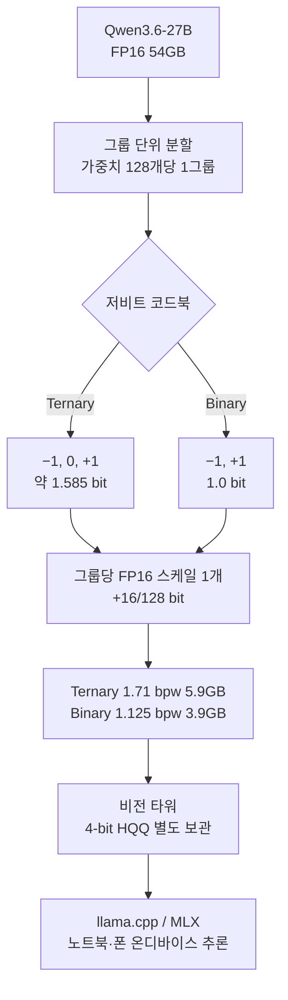

## 개요

큰 모델을 작은 장치에서 돌리려는 시도는 대부분 두 가지 방식으로 흘러갑니다. 하나는 작은 모델을 처음부터 새로 학습하는 것이고, 다른 하나는 큰 모델의 가중치를 사후에 압축하는 것입니다. 후자는 늘 같은 벽에 부딪혔습니다. 4비트 아래로 내려가면 짧은 벤치마크는 멀쩡해 보여도 수학이나 코딩 같은 긴 추론 과제에서 품질이 무너졌습니다.

2026년 7월 14일 PrismML이 공개한 Bonsai 27B는 이 벽을 정면으로 다룹니다. Bonsai 27B는 새로 학습한 모델이 아니라 Qwen3.6-27B를 그대로 두고 가중치만 저비트로 표현한 결과물입니다. 아키텍처는 바뀌지 않았습니다. 두 변형이 Apache 2.0으로 배포되었고, ternary 빌드는 5.9GB에서 원본 품질의 94.6%를, 1-bit 빌드는 3.9GB에서 89.5%를 유지한다고 보고했습니다.

이 글은 저비트 모델을 멀티테넌트로 서빙하는 ThakiCloud의 관점에서 Bonsai 27B를 읽습니다. 압축이 어떻게 작동하는지, 왜 용량이 아니라 메모리가 진짜 제약인지, 그리고 이 흐름이 우리 추론 인프라에 어떤 실무적 의미를 갖는지 순서대로 살펴봅니다. 미리 밝혀두자면 아래 벤치마크 수치는 전부 PrismML이 공개한 보고값이며, ThakiCloud가 직접 재현한 값이 아닙니다.

## 이 기술은 무엇인가

Bonsai 27B는 Qwen3.6-27B의 저비트 표현입니다. 언어 가중치 약 24.8B, 비전 타워 0.46B, 임베딩과 LM 헤드 2.5B로 구성된 멀티모달 모델을 대상으로, 행렬 연산이 밀집한 구성 요소 전체를 저비트로 바꿉니다. 임베딩, 어텐션 프로젝션, MLP 프로젝션, LM 헤드가 모두 포함되며, 정규화와 스케일 파라미터 같은 극소량의 꼬리만 높은 정밀도로 남습니다. 비전 타워는 4비트 HQQ로 별도 보관되어 이미지 입력이 있을 때만 로드됩니다.

두 변형의 성격은 다릅니다. Ternary Bonsai 27B는 `{−1, 0, +1}` 세 값으로 가중치를 표현해 실효 1.71비트, 이상적 용량 5.9GB를 갖습니다. 1-bit Bonsai 27B는 `{−1, +1}` 두 값만 써서 실효 1.125비트, 3.9GB입니다. 컨텍스트는 262K 토큰까지 지원하는데, 이것이 실용적으로 유지되는 이유는 Qwen3.6-27B 어텐션의 약 75%가 선형이기 때문입니다.

## 압축은 어떻게 작동하는가

핵심 아이디어는 단순합니다. 각 가중치는 코드 하나로 저장되고, 128개 가중치 그룹마다 FP16 스케일 하나를 공유합니다. 실제 가중치는 그룹 스케일과 코드의 곱으로 복원됩니다. 즉 `w_i = s_g · t_i` 형태입니다.

비트 계산을 따라가 보면 저장 비용이 명확해집니다. Ternary 값 하나는 `log2(3) ≈ 1.585`비트를 담습니다. 여기에 128개마다 FP16 스케일 하나가 붙으므로 `16/128`비트가 더해져 약 1.71비트가 됩니다. FP16 대비 약 9.4배 축소입니다. Binary는 값 자체가 1비트이고 같은 스케일 오버헤드가 붙어 `1 + 16/128 = 1.125`비트, 약 14.2배 축소입니다.

여기서 흥미로운 대조가 나옵니다. 흔히 4비트라 부르는 Qwen3.6-27B Q4_K_XL 빌드의 실제 평균은 5.2비트이고, 2비트라 부르는 IQ2_XXS는 2.8비트입니다. 이름과 실제 평균 비트가 다릅니다. Bonsai는 또한 BitNet과도 다릅니다. BitNet은 붕괴를 피하기 위해 처음부터 저비트로 학습하지만, Bonsai는 이미 학습된 모델을 사후에 압축합니다. PrismML은 재학습 없이도 붕괴를 피했다고 주장하는데, 이 주장의 세부는 공개된 기술 문서에 의존합니다.

## 보고된 벤치마크 결과

PrismML은 thinking 모드에서 15개 벤치마크를 EvalScope와 vLLM으로 H100에서 평가했다고 밝혔습니다. 아래 표는 그 보고값입니다. 다시 강조하지만 이 수치는 ThakiCloud가 재현한 값이 아니라 공급자가 공개한 값이며, 독립 재현은 별도 검증이 필요합니다.

| 빌드 | 실효 bpw | 용량 | Thinking 평균 | FP16 대비 |
|---|---|---|---|---|
| Qwen3.6-27B FP16 | 16.0 | 54GB | 85.07 | 기준 |
| Q4_K_XL (4-bit) | 5.2 | 17.6GB | 84.99 | 99.9% |
| IQ2_XXS (2-bit) | 2.8 | 9.4GB | 72.73 | 85.5% |
| Ternary Bonsai 27B | 1.71 | 5.9GB | 80.49 | 94.6% |
| 1-bit Bonsai 27B | 1.125 | 3.9GB | 76.11 | 89.5% |

카테고리별로 나눠 보면 압축이 균일하게 손실을 만들지 않는다는 점이 드러납니다. 수학은 FP16 95.33에서 ternary 93.40, 1-bit 91.66으로 비교적 잘 버팁니다. 반면 에이전트와 도구 호출은 80.00에서 ternary 74.01, 1-bit 66.03으로 크게 떨어지고, 비전은 72.61에서 1-bit 59.57까지 내려갑니다. 지시 따르기도 78.47에서 1-bit 65.74로 손실이 큽니다.

PrismML이 강조하는 대조는 기존 sub-4-bit 빌드의 선택적 붕괴입니다. IQ2_XXS는 MMLU-Redux 같은 단답형에서는 88.93을 유지하지만 AIME26에서 57.5, LiveCodeBench에서 56.4로 무너집니다. 짧은 벤치마크가 이 붕괴를 가린다는 지적입니다. 이 관찰 자체는 저비트 양자화를 다뤄본 사람이라면 공감할 만한 실무적 통찰입니다.

## 메모리가 진짜 제약이다

Bonsai 27B의 릴리스를 용량 숫자만으로 읽으면 핵심을 놓칩니다. 폰에 모델을 올리는 조건은 저장 용량보다 훨씬 까다롭습니다. iOS는 단일 앱이 물리 메모리의 약 절반만 쓰도록 제한하므로, 12GB 아이폰은 실제로 약 6GB만 노출합니다. 3.9GB 빌드가 의미를 갖는 이유가 여기 있습니다.

두 번째 예산은 KV 캐시입니다. 64개 레이어 중 16개만 증가하는 풀 어텐션 캐시를 갖기 때문에 FP16 기준 토큰당 약 64KiB가 듭니다. 262K 윈도우를 다 채우면 약 17.2GB이고, 4비트 KV 캐시를 쓰면 이것이 약 4.3GB로 줄어듭니다. 모델 가중치를 아무리 줄여도 컨텍스트가 길어지면 KV 캐시가 메모리를 잡아먹으므로, 저비트 가중치와 저비트 KV 캐시는 함께 가야 합니다.

PrismML은 캐시 압축의 품질 영향도 측정했다고 밝혔습니다. 자체 FP16-KV 기준선 대비 Ternary Bonsai는 MATH-500에서 출력 forward-KL 0.0011 nats를, Q4_K_XL은 0.0146을 보였다고 합니다. 100K 토큰에서 FP16 캐시를 쓰면 1-bit는 약 11.6GB, ternary는 약 14.7GB로 정점을 찍습니다. 즉 가중치를 줄여도 긴 컨텍스트에서는 캐시 정밀도를 함께 낮춰야 실제로 장치에 들어갑니다.

## 스루풋과 투기적 디코딩

생성은 메모리 대역폭에 묶여 있습니다. 스텝당 읽는 바이트가 적을수록 초당 토큰이 늘어납니다. 반면 프리필은 연산에 묶여 있어 압축 효과가 상대적으로 작습니다. PrismML이 공개한 처리량은 이 성질을 그대로 보여줍니다.

| 플랫폼 | 빌드 | tg128 (생성) | pp512 (프리필) |
|---|---|---|---|
| M5 Max | Binary | 66.4 | 874 |
| M5 Pro | Ternary | 26.2 | 393 |
| iPhone 17 Pro Max | Binary | 11.0 | 111 |
| H100 (CUDA) | Binary | 104.8 | 2755 |

PrismML은 Bonsai 27B 타깃에 맞춰 학습한 DSpark 드래프터도 함께 배포했습니다. H100에서 드래프트 깊이 k=4일 때 binary 타깃의 채택 길이는 τ=3.6, 즉 143.8 tok/s로 1.37배 가속이라고 보고했습니다. 검증은 무손실이라 출력 분포가 동일하게 유지됩니다. 다만 애플 실리콘에서는 배치 크기 1에서 드래프터가 기본 비활성입니다.

실행 자체는 표준적입니다. llama.cpp 서버를 띄우거나 llama-cli로 직접 생성할 수 있고, MLX 경로도 제공됩니다. 도구 호출은 OpenAI 스타일 `tools` 배열을 그대로 쓰며, 응답은 `choices[0].message.tool_calls`로 돌아옵니다. thinking 모드는 기본 활성이고 요청별로 토글할 수 있습니다.

## ThakiCloud 제품 적용 시사점

저비트 서빙은 ThakiCloud의 두 제품 모두와 맞닿아 있습니다.

**ai-platform 렌즈(인프라·서빙).** ThakiCloud의 ai-platform은 다양한 고객 환경에서 오픈웨이트 모델을 서빙합니다. Bonsai가 보여주는 것은 27B급 품질을 24GB 단일 GPU에 4비트 KV 캐시와 함께 올릴 수 있다는 가능성입니다. 이는 멀티테넌트 밀도에 직접 영향을 줍니다. 같은 GPU에 더 많은 테넌트를 태우거나, 더 작은 카드로 같은 SLA를 맞출 수 있으면 서빙 단가가 내려갑니다. 특히 온프렘과 소버린 배포에서 의미가 큽니다. 국내 공공과 규제 산업은 데이터를 외부로 내보내지 않는 self-hosting을 요구하는데, 하드웨어 예산은 제한적입니다. 모델 가중치와 KV 캐시를 함께 저비트로 낮추면 Kueue로 스케줄링하는 GPU 풀에서 더 촘촘한 배치가 가능해지고, 이것이 곧 우리가 강조해온 비용효율과 자원 밀도로 이어집니다. 다만 저비트가 항상 답은 아닙니다. 워크로드가 에이전트나 도구 호출 중심이면 아래 한계 절에서 보듯 품질 손실이 커서, 정밀도를 워크로드별로 다르게 가져가는 라우팅이 필요합니다.

**Paxis 렌즈(에이전트·엣지).** Paxis는 ai-platform 위에서 도는 Agent-Native Cloud 제어 평면으로, Skills와 Tools와 Policies와 Audit Logs를 일급 리소스로 다룹니다. 3.9GB로 폰에서 도는 모델은 프라이버시가 민감한 온디바이스 에이전트의 문을 엽니다. 프롬프트가 장치를 떠나지 않는 구성은 규제 대응과 오프라인 워크플로에 유용합니다. Paxis 관점에서는 이런 로컬 모델을 샌드박스 격리 실행 안에서 다루고, 모든 행동을 정책 게이트와 감사 로그로 통과시키는 구조가 자연스럽게 결합됩니다. 저비트 온디바이스 추론이 엣지 에이전트의 경제성을 만들고, 그 실행을 Paxis가 통제하는 그림입니다.

두 렌즈는 서로를 보완합니다. 저비용 서빙(ai-platform)이 에이전트의 경제성(Paxis)을 만들어내는 관계입니다.

## 한계 및 반론

가장 큰 유보는 벤치마크의 출처입니다. 위 수치는 전부 PrismML의 자체 평가이며 독립 재현이 아직 없습니다. IQ2_XXS의 선택적 붕괴를 지적하는 논리는 설득력이 있지만, Bonsai의 우위를 보이는 벤치마크 역시 같은 공급자의 자체 측정입니다. 공정한 판단에는 제3자 재현이 필요합니다.

품질 손실이 균일하지 않다는 점도 실무에서 중요합니다. 1-bit 빌드의 에이전트와 도구 호출 점수는 66.03에 그칩니다. 도구 호출 정확도가 이 수준이면 프로덕션 에이전트 파이프라인에는 위험합니다. 비전 59.57과 지시 따르기 65.74도 마찬가지로 큰 하락이라, 1-bit는 사실상 단순 텍스트 추론과 프라이버시 우선 온디바이스 용도에 한정됩니다. 품질이 필요한 경로는 ternary나 상위 정밀도로 올려야 합니다.

폰 성능도 숫자를 조심해서 봐야 합니다. 아이폰 11 tok/s는 짧은 상호작용에는 충분하지만 긴 생성에는 느립니다. 발열과 배터리, 지속 스루풋은 벤치 표에 드러나지 않습니다. 백서는 아이폰 배터리 1%당 672토큰을 측정했다고 하지만, 실사용 지연과 지속성은 별개의 문제입니다.

마지막으로 재학습 없이 붕괴를 피했다는 핵심 주장은 방법 세부가 공개 문서에 의존합니다. 라이선스는 Apache 2.0이지만 Qwen3.6 베이스의 라이선스 상속 관계는 상용 배포 전 확인이 필요합니다. 요약하면 Bonsai 27B는 저비트 양자화의 실무적 진전이 맞지만, 채택 결정은 워크로드별 품질 요구와 독립 재현을 함께 놓고 내려야 합니다.

## ThakiCloud 독립 재현 결과

위 한계에서 "독립 재현이 아직 없다"고 적었는데, 우리가 직접 재현을 돌렸습니다. 대상 독자는 자체 저비트 파이프라인을 고민하는 인프라 엔지니어입니다. 결론부터 말하면, PrismML이 공개한 1-bit 모델은 진짜로 작동하지만 압축 방법 자체는 재현할 수 없습니다. 방법이 공개되지 않았기 때문입니다.

먼저 백서 세 편을 전부 텍스트로 추출해 읽었습니다. 공개된 것은 저장 포맷과 추론 커널, 벤치마크뿐이고, 가중치를 어떻게 1-bit로 할당해 재학습 없이 붕괴를 피하는가 하는 알고리즘은 어디에도 없습니다. 8B 백서는 이를 "Caltech의 독점 지식재산"이라고 명시합니다. 방법은 봉인되어 있습니다.

그다음 그들이 공개한 `Bonsai-1.7B-unpacked`(1-bit 가중치를 FP16으로 되돌린 배포본)를 표준 도구로 로드해 검증했습니다. 128개 그룹 전부가 그룹당 스케일 하나만 쓰는 구조였고, 고정 문단 퍼플렉서티는 3.492로 같은 베이스 Qwen3-1.7B의 FP16 값 3.507과 사실상 같았습니다. 공개 모델은 진짜이며 거의 무손실입니다.

반대로 공개된 포맷만 가지고 우리가 문헌 표준(BWN 이진화)으로 순진하게 재현하면 같은 1.125비트에서 모델이 완전히 붕괴합니다. 4비트 대조군을 함께 넣어 파이프라인이 정상임을 확인했습니다.

| 변형 | bpw | 퍼플렉서티 | FP16 대비 |
|---|---|---|---|
| Qwen3-1.7B FP16 | 16 | 3.507 | 1.00배 |
| PrismML 1-bit (그들의 방법) | 1.125 | 3.492 | 0.995배, 무손실 |
| 순진한 이진화(공개 포맷) | 1.125 | 2,109,839 | 601,600배, 붕괴 |
| 4비트 대조군 | 4.125 | 4.209 | 1.14배, 정상 |

방법이 봉인되어 있어도 예측은 할 수 있습니다. 우리에게는 그들의 실제 1-bit 가중치가 있으므로, 베이스 가중치와 짝지어 방법의 지문을 역추적했습니다. 그들의 부호는 베이스 부호와 71.6%만 일치했습니다. 순진한 이진화가 부호를 100% 보존하는 것과 달리, 약 28%의 부호를 뒤집었다는 뜻입니다. 그룹 스케일도 순진한 평균보다 2.26배 컸습니다. 이는 가중치별 오차가 아니라 층의 출력 오차를 줄이는 오차보상 계열, 즉 GPTQ와 같은 기법의 지문입니다. 부호 일치율이 무작위인 50%보다 훨씬 높으므로 베이스는 재학습되지 않은 순정 Qwen이며, 이는 "재학습 없이"라는 그들의 주장과 맞습니다.

이 예측을 실제로 구현해 검증했습니다. 오차보상 이진 양자화(GPTQ 계열)를 직접 짜서 돌리니, 순진한 재현의 붕괴를 약 10배 되돌렸습니다. 방향은 맞았습니다. 그러나 되돌린 뒤에도 FP16과는 여전히 큰 차이가 남았습니다. 흥미롭게도 스케일만 2.26배로 키우면 오히려 더 나빠졌는데, 이는 큰 스케일이 부호 최적화와 결합될 때만 의미가 있다는 뜻입니다. 정리하면, 교과서적 오차보상은 필요조건이지만 충분조건이 아닙니다. 그들의 무손실 1-bit에 도달하려면 두드러진 가중치를 따로 다루거나 잔차를 쓰는 추가 기법이 필요하며, 바로 그 부분이 공개되지 않은 핵심입니다.

한 가지 유보를 밝힙니다. 위 퍼플렉서티는 짧은 문단 기반의 거친 신호이며, 소형 모델에서 잰 값입니다. 도구 호출이나 비전 같은 카테고리별 유지율의 완전한 재현은 그들의 커스텀 커널을 빌드해 27B를 서빙하고 전체 벤치마크를 돌려야 하므로 별도 작업으로 남겨둡니다. 다만 "1-bit가 실제로 작동하는가"라는 질문에는 그렇다고 답할 수 있고, "공개 자료만으로 그 품질을 재현할 수 있는가"에는 아니라고 답할 수 있습니다. 그 간극이 곧 이 기술의 가치입니다.

한 걸음 더 나아가, 공개된 최신 기법을 얼마나 밀어붙일 수 있는지도 실험했습니다. 최신 극저비트 연구(QuIP, BiLLM, QuaRot, SpinQuant)에서 가장 큰 레버는 incoherence 회전입니다. 랜덤 직교 회전으로 가중치의 outlier를 near-Gaussian으로 퍼뜨린 뒤 오차보상과 결합하면 순수 1-bit가 크게 살아납니다. 회전 단독은 오히려 악화되고, 오차보상(GPTQ)과 반드시 결합해야 한다는 점도 확인했습니다. 그들이 쓴 바로 그 베이스 Qwen3-1.7B에서 같은 하네스로 비교한 결과입니다.

| 방법 | eff bpw | 퍼플렉서티 | FP16 대비 | escape hatch |
|---|---|---|---|---|
| FP16 | 16 | 2.027 | 1.00배 | 없음 |
| PrismML Bonsai(그들 방법) | 1.125 | 1.971 | 0.97배 | 없음 |
| 우리 QuIP(회전+오차보상) | 1.125 | 4.213 | 2.1배 | 없음 |
| 우리 QuIP+salient 3% | 1.571 | 2.24 | 1.1배 | 3% |

공개 스택(QuIP+salient)은 품질에서 그들 1.971에 거의 근접한 2.24까지 갔습니다. 그러나 결정적 차이가 남습니다. 그들은 순수 1.125bpw에서 escape hatch 없이 그 품질을 내는 반면, 우리는 같은 품질에 1.57bpw와 3% 고정밀이 필요했고, 같은 순수-1-bit 지점에서는 4.21로 그들 1.97에 못 미쳤습니다. 즉 품질은 거의 붙었지만 효율에서는 그들이 앞선 Pareto 우위를 지킵니다. 흥미로운 관찰 하나는 회전의 효과가 모델이 클수록 급격히 커진다는 점입니다. 0.6B에서는 이득이 작았지만 1.7B에서 크게 벌어졌고, 이는 27B 규모에서 그들이 무손실에 도달한 배경의 일부를 설명합니다. 다만 이 수치는 짧은 문단 기반의 거친 신호이며, 확정적 판단에는 전체 벤치마크 평가가 필요합니다. 전체 재현 코드는 공개했습니다.

마지막으로 하나를 분명히 해둡니다. 이 실험 전체는 사후 양자화 제약 안에서 이뤄졌습니다. 그들의 재학습 없이라는 주장을 같은 조건에서 따라가기 위해서였습니다. 학습을 감수하면 무손실 저비트는 이미 알려진 길입니다. 처음부터 저비트로 학습하는 BitNet과 BitNet b1.58은 충분한 규모에서 1.58비트 모델이 FP16에 필적함을 보였고, 양자화 인지 학습과 지식 증류도 같은 방향입니다. 즉 무손실 1-bit 모델을 만들 수 있느냐는 질문의 답은, 그것을 위해 학습할 의향이 있다면 당연히 그렇다입니다. 어려운 것은 이미 학습된 모델을 재학습 없이 사후에 그 품질로 압축하는 일이고, 그것이 바로 PrismML이 해낸 부분입니다. 뒤집어 보면 학습을 직접 통제하는 조직에게는 BitNet식 네이티브 저비트 학습이 이 사후 압축의 격차를 아예 우회하는 실용 경로가 됩니다. GPU 비용을 품질과 맞바꾸는 선택입니다.

## 출처

- [prism-ml/Bonsai-27B-gguf (Hugging Face)](https://huggingface.co/prism-ml/Bonsai-27B-gguf)
- [PrismML Releases Bonsai 27B (MarkTechPost)](https://www.marktechpost.com/2026/07/14/prismml-releases-bonsai-27b-1-bit-and-ternary-builds-of-qwen3-6-27b-that-run-on-laptops-and-phones/)
- [PrismML Bonsai 27B docs](https://docs.prismml.com/models/bonsai-27b)
