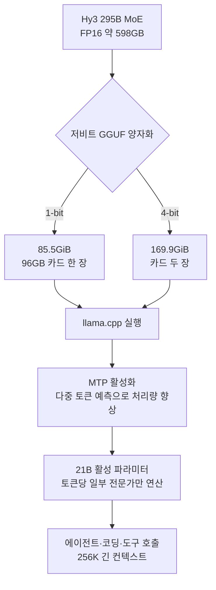

## 개요

대형 모델을 자체 인프라에서 돌리려는 팀이 가장 먼저 부딪히는 벽은 연산이 아니라 메모리입니다. 295B 규모의 모델을 FP16 그대로 올리려면 약 598GB의 가중치가 GPU 메모리에 상주해야 하고, 이는 H100 80GB 여덟 장을 묶어야 겨우 담기는 크기입니다. 그래서 플래그십 오픈웨이트 모델은 늘 "공개는 되었지만 우리가 실제로 서빙하기는 어렵다"는 애매한 위치에 놓여 있었습니다.

2026년 7월 14일 Tencent Hunyuan이 공개한 Hy3의 1-bit·4-bit GGUF 빌드는 이 지점을 정면으로 겨냥합니다. 295B MoE 모델을 저비트로 압축해 카드 한 장에서 돌아가게 만들었고, 가중치는 Apache 2.0으로 배포되었습니다. Tencent은 X에서 "단일 GPU에서 서빙 가능한 플래그십 규모 295B 모델"이라고 소개하며 llama.cpp와 MTP를 함께 언급했습니다.

이 글은 저비트 모델을 멀티테넌트로 서빙하는 ThakiCloud의 관점에서 Hy3의 양자화 빌드를 읽습니다. 압축이 실제로 무엇을 바꾸는지, "단일 GPU"라는 표현이 왜 조심스럽게 읽어야 하는 문구인지, 그리고 이 흐름이 우리 온프레미스 추론 인프라에 어떤 실무적 의미를 갖는지 순서대로 살펴봅니다. 미리 밝혀두자면 아래 용량과 성능 수치는 전부 Tencent과 커뮤니티가 공개한 보고값이며, ThakiCloud가 직접 재현한 값이 아닙니다.

## 이 기술은 무엇인가

Hy3는 총 295B 파라미터를 가진 Mixture-of-Experts 모델이지만, 토큰 하나를 처리할 때 활성화되는 파라미터는 약 21B입니다. 256K 토큰의 긴 컨텍스트를 지원하고, 에이전트 과제와 코딩, 도구 호출에 초점을 맞춘 모델입니다. 이번에 추가된 것은 새 모델이 아니라 기존 Hy3 가중치의 저비트 GGUF 표현입니다. 두 가지 변형이 공개되었습니다.

1-bit 빌드는 모델 크기를 약 598GB에서 85.5GiB로 줄입니다. 이 크기라면 96GB급 카드 한 장에 가중치가 들어갑니다. 4-bit 빌드는 169.9GiB를 차지해 두 장에 걸쳐 올려야 하지만, 대신 원본에 훨씬 가까운 품질을 유지한다고 보고되었습니다. 두 빌드 모두 llama.cpp로 실행하며, MTP(Multi-Token Prediction)를 켜서 토큰 생성 처리량을 끌어올리도록 설계되었습니다.



MoE 구조가 이 압축을 특히 매력적으로 만듭니다. 295B 가운데 토큰마다 실제로 계산에 참여하는 전문가는 21B어치뿐이므로, 연산량 자체는 21B 밀집 모델 수준입니다. 병목은 전적으로 "전체 전문가 가중치를 어디에 상주시키느냐"에 있습니다. 저비트 압축은 바로 그 상주 비용을 공격합니다.

## "단일 GPU"라는 표현을 조심해서 읽어야 하는 이유

마케팅 문구에서 가장 오해하기 쉬운 부분이 여기입니다. "단일 GPU에서 서빙"이라는 말은 사실이지만, 여기서 말하는 단일 GPU는 128GB급 통합 메모리를 갖춘 장치를 뜻합니다. DGX Spark, 128GB Mac Studio, Strix Halo 같은 부류입니다. 16GB짜리 RTX 3060 한 장을 떠올렸다면 그 기대는 어긋납니다.

이 구분이 중요한 이유는 실무 계산이 완전히 달라지기 때문입니다. 85.5GiB 가중치를 올리려면 최소 96GB 카드가 필요하고, 여기에 KV 캐시와 활성화 메모리, 그리고 긴 컨텍스트를 쓸 경우의 어텐션 상태까지 얹으면 실사용 여유는 더 줄어듭니다. 256K 컨텍스트를 실제로 채우는 워크로드라면 128GB급이라도 빠듯합니다. "카드 한 장"은 물리적 슬롯 수를 말하는 것이지, 저렴한 하드웨어를 말하는 것이 아닙니다.

그럼에도 이 발표가 의미 있는 이유는 비교 대상이 여덟 장짜리 H100 노드이기 때문입니다. FP16 서빙에 필요하던 다중 GPU 노드가 단일 고용량 카드로 대체된다면, 전력과 상면, 인터커넥트 복잡도가 크게 줄어듭니다. 절대 비용이 낮아지는 것이 아니라, 필요한 시스템의 형태가 근본적으로 단순해지는 것입니다.

## 1-bit와 4-bit: 무엇을 얻고 무엇을 잃는가

두 빌드는 서로 다른 선택지를 대표합니다. 1-bit 빌드는 최소 하드웨어에 모델을 밀어 넣는 데 최적화되어 있습니다. 85.5GiB라는 크기는 극단적인 압축의 결과이며, 그만큼 원본 대비 품질 손실을 감수합니다. 반면 4-bit 빌드는 169.9GiB로 두 배 가까운 메모리를 요구하지만, 커뮤니티 보고에 따르면 원본 성능에 거의 근접한 결과를 유지합니다.

여기서 실무적으로 유용한 판단 기준이 나옵니다. 에이전트 워크플로처럼 도구 호출과 긴 추론 체인이 이어지는 과제에서는 작은 품질 저하가 누적되어 최종 결과를 무너뜨리기 쉽습니다. 짧은 질의응답은 1-bit로도 멀쩡해 보이지만, 여러 단계를 거치는 자율 에이전트 작업에서는 4-bit의 여유가 안전 마진으로 작용합니다. 하드웨어 예산이 허락한다면 에이전트 서빙에는 4-bit를 우선 검토하는 편이 합리적입니다.

MTP가 함께 언급되는 것도 이 맥락에서 이해할 수 있습니다. 다중 토큰 예측은 한 번의 전방 계산으로 여러 토큰을 미리 제안하고 검증하는 방식으로, 메모리 대역폭에 묶인 디코딩 단계의 처리량을 끌어올립니다. 저비트 모델은 가중치가 작아 메모리 대역폭 여유가 상대적으로 생기므로, MTP 같은 처리량 기법과 잘 맞물립니다.

## 설치와 서빙 관점

llama.cpp 기반 GGUF이므로 서빙 흐름 자체는 익숙합니다. GGUF 파일을 받아 `llama.cpp`로 로드하고, MTP 옵션을 활성화한 뒤 OpenAI 호환 서버로 노출하는 형태입니다. 개념적으로는 다음과 같은 구조입니다.

```bash
# 1-bit GGUF 빌드 로드 (개념 예시, 실제 파일명·플래그는 배포 저장소 참조)
./llama-server \
  --model hy3-295b-1bit.gguf \
  --ctx-size 262144 \
  --n-gpu-layers 999 \
  --draft-max 4          # MTP 계열 다중 토큰 예측
```

FP8이나 더 높은 정밀도로 처리량을 우선하려는 경우에는 llama.cpp 대신 vLLM이나 SGLang에 Expert Parallelism을 결합해 다중 카드로 서빙하는 경로도 커뮤니티에서 문서화되어 있습니다. 저비트 GGUF 경로는 최소 하드웨어에서의 단일 노드 서빙을, vLLM 경로는 처리량과 동시 사용자 수를 각각 겨냥한다고 정리할 수 있습니다.

저희는 이번 글을 위해 실제로 85.5GiB 빌드를 내려받아 추론을 돌리지는 않았습니다. 96GB 이상 통합 메모리라는 하드웨어 요구가 이 드레인 환경의 범위를 벗어나기 때문입니다. 따라서 위 수치는 전부 Tencent과 커뮤니티가 공개한 보고값이며, 정직하게 재현 없음을 밝혀둡니다. 실제 도입을 검토한다면 대상 하드웨어에서 자체 벤치마크로 품질과 처리량을 확인하는 단계가 반드시 필요합니다.

## ThakiCloud 제품 적용 시사점

이 발표는 ThakiCloud의 **ai-platform** 관점에서 특히 의미가 큽니다. ai-platform은 K8s와 Kueue로 GPU를 스케줄링하고, vLLM을 중심으로 다양한 고객 환경에서 모델을 서빙하는 인프라입니다. 플래그십 규모 모델이 단일 고용량 노드에서 돌아간다는 것은, 멀티테넌트 서빙에서 노드 배치 단위가 단순해진다는 뜻입니다. 여덟 장짜리 H100 노드를 전제로 한 스케줄링 대신, 128GB급 카드 한 장을 하나의 서빙 단위로 다루면 Kueue의 큐 관리와 우선순위 배분이 훨씬 예측 가능해집니다.

온프레미스와 소버린 AI 맥락에서는 이 흐름이 더 직접적입니다. 국내 데이터를 외부로 내보낼 수 없는 고객은 자체 하드웨어에서 모델을 돌려야 하는데, 8-GPU 노드는 조달과 상면, 전력 측면에서 진입 장벽이 높습니다. 단일 128GB급 장치로 플래그십 모델을 서빙할 수 있다면, 소버린 배포의 하드웨어 문턱이 눈에 띄게 낮아집니다. 다만 저비트 품질 저하가 고객 워크로드에서 허용 가능한 수준인지 검증하는 단계는 저희가 소유해야 하는 책임입니다.

에이전트 워크로드 관점에서는 **Paxis**와도 맞닿습니다. Paxis는 ai-platform 위에서 도는 Agent-Native Cloud로, 격리된 샌드박스에서 스킬을 실행하고 모든 행동을 정책 게이트와 감사 로그로 통과시킵니다. Hy3처럼 에이전트와 도구 호출에 특화된 모델을 낮은 하드웨어 비용으로 서빙할 수 있다면, 에이전트 실행 단가가 내려가고 이는 곧 더 많은 자율 워크플로를 경제적으로 돌릴 수 있다는 의미가 됩니다. 저비용 서빙이 에이전트 경제성을 만드는 구조입니다.

## 한계 및 반론

가장 큰 반론은 "단일 GPU"의 실체입니다. 96GB에서 128GB급 통합 메모리 장치는 여전히 고가이며, 진정한 대중화 하드웨어가 아닙니다. 이 발표를 "이제 누구나 노트북에서 295B를 돌린다"로 읽으면 오해입니다. 정확히는 "다중 GPU 노드가 필요하던 워크로드가 단일 고용량 카드로 내려왔다"입니다.

두 번째로 1-bit 빌드의 품질 손실은 워크로드에 따라 치명적일 수 있습니다. 벤치마크 요약은 "원본에 근접"이라고 말하지만, 이는 대개 4-bit 기준이거나 짧은 과제 위주의 평가일 가능성이 있습니다. 긴 추론 체인과 정밀한 도구 호출이 반복되는 에이전트 과제에서 1-bit가 어떻게 견디는지는 실제 워크로드에서만 확인됩니다.

세 번째로 이 수치들은 아직 독립적으로 폭넓게 검증되지 않았습니다. Tencent과 초기 커뮤니티의 보고에 의존하고 있으며, 다양한 하드웨어와 과제에서의 재현 결과가 쌓이기 전까지는 신중하게 받아들이는 편이 안전합니다. 저희 역시 도입 검토 시에는 공개 수치를 출발점으로만 삼고, 대상 환경에서의 자체 측정을 정본으로 삼을 것입니다.

그럼에도 방향 자체는 분명합니다. 플래그십 오픈웨이트 모델의 서빙 단위가 다중 GPU 노드에서 단일 고용량 카드로 이동하는 흐름은, 온프레미스와 소버린 AI를 다루는 인프라에게 반가운 신호입니다.

## 출처

- [Tencent Hunyuan, Hy3 1-bit·4-bit 공개 (X)](https://x.com/TencentHunyuan/status/2076953120765280284)
- [tencent/Hy3 (Hugging Face)](https://huggingface.co/tencent/Hy3)
- [Tencent Hy3 GGUF 1-bit·4-bit Single GPU (explainX)](https://explainx.ai/blog/tencent-hy3-gguf-1-bit-4-bit-single-gpu-llama-cpp-july-2026)
- [Hunyuan Hy3 Quantized Release 분석 (Remio)](https://www.remio.ai/post/tencent-hunyuan-hy3-quantized-release-1bit-single-card-deployment-4bit-near-full-performance)
- [Deploy Hunyuan Hy3 with vLLM & Expert Parallelism (Spheron)](https://www.spheron.network/blog/deploy-hunyuan-3-gpu-cloud/)
