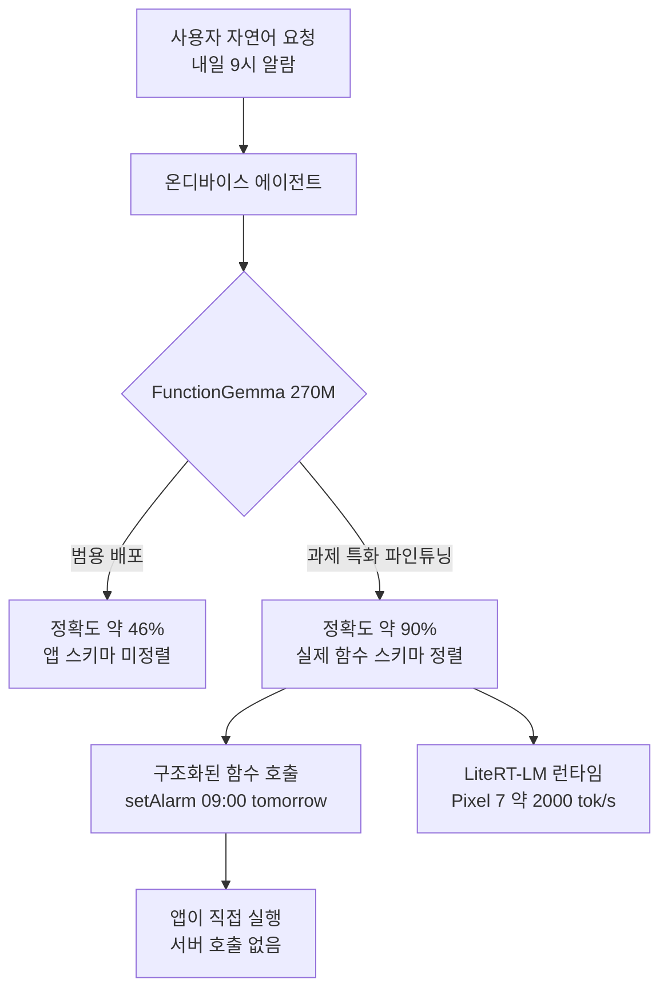

## 개요

작은 모델은 똑똑하지 않다는 통념이 오래갔습니다. 그래서 실무자들은 웬만한 과제를 전부 큰 모델에 던졌고, 그 대가로 지연과 비용과 데이터 유출 위험을 감수했습니다. 그런데 과제를 아주 좁게 잡으면 이야기가 달라집니다. 범용성을 버리고 한 가지 일만 잘하도록 작은 모델을 다듬으면, 그 좁은 영역에서는 큰 모델을 부를 이유가 사라집니다.

Google AI Edge의 Principal Engineer인 Cormac Brick이 발표한 "From 46% to 90%: Fine-Tuning Tiny LLMs for On-Device Agents"는 정확히 이 지점을 겨냥합니다. 270M 파라미터의 FunctionGemma를 특정 에이전트 과제에 맞춰 파인튜닝하자, 정확도가 46%에서 90%로 올랐다는 것이 발표의 제목이자 요지입니다. 이 모델은 Pixel 7에서 초당 약 2,000토큰의 prefill 처리량을 낸다고 보고되었습니다. 모두 폰 안에서, 서버 호출 없이 벌어지는 일입니다.

이 글은 멀티테넌트 추론 인프라를 운영하는 ThakiCloud의 관점에서 이 발표를 읽습니다. 왜 작은 특화 모델이 온디바이스에서 의미를 갖는지, 파인튜닝이 실제로 무엇을 바꾸는지, LiteRT-LM 같은 런타임이 배포를 어떻게 단순화하는지, 그리고 이 흐름이 저희의 서빙 인프라와 에이전트 플랫폼에 어떤 실무적 의미를 갖는지 순서대로 살펴봅니다. 아래에 인용한 정확도와 처리량, 소요 시간 수치는 모두 발표와 관련 보도의 보고값이며, ThakiCloud가 직접 재현한 값이 아닙니다.



위 영상은 Cormac Brick의 원 발표 전체입니다. 아래 분석은 이 발표와 공개 보도를 근거로 합니다.

## 이 기술은 무엇인가

FunctionGemma는 Gemma 계열에서 함수 호출(function calling)에 특화된 270M 파라미터 모델입니다. 함수 호출은 온디바이스 에이전트의 핵심 동작입니다. 사용자의 자연어 요청을 앱이 실행할 수 있는 구조화된 도구 호출로 바꾸는 일이기 때문입니다. "내일 오전 9시에 알람 맞춰줘"를 `setAlarm(time="09:00", date="tomorrow")` 같은 호출로 변환하는 것이 그 예입니다. 이 변환만 정확하다면, 굳이 수십억 파라미터의 범용 모델을 불러올 필요가 없습니다.

문제는 범용으로 배포된 작은 모델이 특정 앱의 도구 스키마에서는 정확도가 낮다는 점입니다. 발표가 말하는 46%가 바로 그 지점입니다. 여기서 파인튜닝이 등장합니다. 목표 앱의 실제 함수 스키마와 요청 패턴에 맞춰 모델을 좁게 다듬으면, 같은 270M 모델이 90%까지 올라간다는 것입니다.

## 46%에서 90%로: 파인튜닝이 하는 일

이 격차의 정체를 이해하는 것이 중요합니다. 큰 모델은 방대한 범용 지식으로 낯선 스키마도 어느 정도 추론해 냅니다. 작은 모델은 그 여유가 없습니다. 대신 좁은 분포에 집중시키면, 그 분포 안에서는 큰 모델 못지않게 정확해집니다. 파인튜닝은 모델에게 새로운 지능을 주입하는 것이 아니라, 이미 가진 용량을 목표 과제 쪽으로 몰아주는 작업에 가깝습니다.

발표에 따르면 이 파인튜닝은 대단히 짧은 시간에 끝납니다. 관련 소개에서는 약 21분 만에 학습이 완료된다고 전해집니다. 270M이라는 작은 규모 덕분에 학습 자체가 가볍고, 컨슈머 하드웨어로도 충분히 감당됩니다. 이는 데이터 과학 실무에 직접적인 함의를 갖습니다. 앱마다, 도구 세트마다 별도의 작은 특화 모델을 두고 각각을 짧게 학습시키는 운영 방식이 현실적이라는 뜻입니다. 하나의 거대한 범용 모델로 모든 앱을 커버하는 대신, 과제별로 잘게 나눈 특화 모델 여러 개를 두는 것입니다.

이 발상은 저희가 콘텐츠 배치 작업에서 지켜온 원칙과도 닿아 있습니다. 자유도가 높은 범용 해법보다, 검증된 좁은 골격에 채워 넣는 특화 해법이 평균 품질을 올립니다. 작은 모델의 파인튜닝은 이 원칙을 모델 수준에서 구현한 사례입니다.

## 온디바이스가 주는 것: 지연·프라이버시·오프라인·비용

발표가 온디바이스를 강조하는 이유는 네 가지로 정리됩니다.

지연이 줄어듭니다. 요청이 네트워크를 왕복하지 않으므로, 함수 호출 변환이 폰 안에서 즉시 끝납니다. 에이전트가 사용자 동작에 실시간으로 반응해야 하는 UI라면 이 차이는 결정적입니다.

프라이버시가 지켜집니다. 사용자의 요청과 개인 데이터가 기기를 벗어나지 않습니다. 헬스, 금융, 메시징처럼 민감한 맥락에서는 데이터가 서버로 나가지 않는다는 사실 자체가 제품의 요건이 됩니다.

오프라인에서 동작합니다. 네트워크가 없어도 에이전트가 기능합니다. 클라우드 모델은 연결이 끊기면 무력해지지만, 온디바이스 모델은 그렇지 않습니다.

비용이 사라집니다. 추론이 기기에서 일어나므로 토큰당 API 과금이 없습니다. 사용량이 많은 앱일수록 이 절감은 커집니다.

## LiteRT-LM과 배포 스택

작은 모델을 학습하는 것과 그것을 수많은 기기에 배포하는 것은 별개의 문제입니다. 발표는 LiteRT-LM을 배포 런타임으로 제시합니다. LiteRT-LM은 Gemma 4 같은 모델을 모바일부터 임베디드 시스템까지 폭넓은 하드웨어에 올릴 수 있게 하는 런타임입니다. 여기에 AI Core를 결합하면 온디바이스 에이전트 스킬을 구동할 수 있다고 설명합니다.

핵심은 하나의 모델을 다양한 하드웨어에 일관되게 배포하는 경로가 갖춰져 있다는 점입니다. 학습된 특화 모델을 각 기기의 가속기에 맞춰 다시 짜맞추는 수고 없이, 런타임이 그 이질성을 흡수합니다. 이것이 온디바이스 에이전트를 실험 수준에서 제품 수준으로 끌어올리는 실무적 조건입니다.

## ThakiCloud 제품 적용 시사점

온디바이스 특화 모델의 흐름은 클라우드 서빙을 운영하는 저희에게 반대 방향의 신호처럼 보일 수 있지만, 실제로는 두 제품 모두에 직접적인 함의를 줍니다.

**ai-platform 렌즈.** 작은 특화 모델의 부상은 서빙 인프라의 초점을 바꿉니다. ThakiCloud의 ai-platform은 K8s와 Kueue 기반 GPU 스케줄링, 멀티테넌트 격리, 온프레미스 서빙을 제공합니다. 여기서 온디바이스 파인튜닝이 던지는 질문은 "모든 것을 온디바이스로 보내면 서버는 필요 없어지는가"가 아닙니다. 오히려 반대입니다. 앱마다 별도의 특화 모델을 짧게 학습시키려면, 그 학습 잡을 저비용으로 대량 돌릴 인프라가 필요합니다. 270M 모델의 21분짜리 파인튜닝을 수백 개의 도구 세트에 대해 반복하는 워크로드는, Kueue가 GPU를 큐잉하고 멀티테넌트로 격리하는 인프라가 정확히 겨냥하는 종류입니다. 학습은 서버에서, 추론은 기기에서라는 분업이 자연스러운 귀결입니다.

동시에 모든 조직이 기기 추론만으로 충분하지는 않습니다. 더 큰 컨텍스트나 복잡한 추론이 필요한 순간에는 여전히 서버 모델이 개입합니다. 이때 소스 데이터를 외부 클라우드로 보내기 꺼리는 조직에게는 온프레미스 서빙과 self-hosting이 중요해집니다. 낮은 서빙 비용에서 경쟁력을 갖추는 것이 이 조직들을 붙잡는 핵심입니다.

**Paxis 렌즈.** FunctionGemma의 본질은 자연어를 구조화된 도구 호출로 바꾸는 것입니다. 이것은 Paxis가 하는 일의 축소판입니다. Paxis는 ThakiCloud의 Agent-Native Cloud로, 960개가 넘는 스킬을 BM25로 선택해 격리 샌드박스에서 실행하고, 모든 행동을 정책 게이트와 감사 로그로 통과시킵니다. 온디바이스 에이전트가 좁은 도구 세트에 대한 함수 호출을 폰에서 처리한다면, Paxis는 훨씬 넓은 스킬 공간에 대한 도구 라우팅을 클라우드에서 처리합니다. 두 층은 경쟁하지 않고 보완합니다. 가벼운 로컬 의도 해석은 기기가, 복잡한 멀티에이전트 오케스트레이션과 감사가 필요한 작업은 Paxis가 맡는 계층 구조가 그려집니다.

## 한계 및 반론

이 접근에도 분명한 한계가 있습니다.

첫째, 특화의 대가는 범용성입니다. 46%를 90%로 올린 그 모델은 학습된 좁은 과제에서만 강합니다. 도구 스키마가 바뀌거나 새로운 앱 영역으로 넘어가면 다시 파인튜닝해야 합니다. 앱과 도구가 자주 바뀌는 환경에서는 유지보수 부담이 그만큼 커집니다.

둘째, 90%가 충분한가는 과제에 달렸습니다. 함수 호출을 잘못하면 잘못된 동작을 실행하는 것이므로, 실패 비용이 큰 도메인에서는 10%의 오류가 치명적일 수 있습니다. 이 경우 온디바이스 결과를 서버 모델이 검증하는 이중 구조가 필요해집니다.

셋째, 학습이 21분이라는 수치는 규모와 하드웨어에 크게 의존합니다. 데이터 준비, 스키마 정렬, 평가까지 포함한 실제 운영 비용은 학습 시간만으로 판단할 수 없습니다. 발표의 인상적인 수치는 잘 정돈된 조건에서의 값임을 감안해야 합니다.

넷째, 온디바이스 배포는 기기 파편화와 마주합니다. LiteRT-LM이 이질성을 흡수한다고 해도, 실제 기기별 성능과 메모리 제약은 여전히 개별 검증을 요구합니다.

그럼에도 작은 특화 모델을 기기에서 돌린다는 방향은 설득력이 있습니다. 지연, 프라이버시, 오프라인, 비용이라는 네 가지 이점이 동시에 성립하는 지점이기 때문입니다. 저희에게 이 흐름은 서버가 필요 없어진다는 신호가 아니라, 학습과 추론의 분업이 어디에 놓여야 하는지를 다시 그리게 하는 신호입니다.

## 출처

- [From 46% to 90%: Fine-Tuning Tiny LLMs for On-Device Agents - Cormac Brick, Google (YouTube)](https://www.youtube.com/watch?v=-TiET_K-E_g)
- [Google's Cormac Brick on Tiny LLMs for On-Device Agents - StartupHub.ai](https://www.startuphub.ai/ai-news/ai-research/2026/google-s-cormac-brick-on-tiny-llms-for-on-device-agents)
- [Fine-tune FunctionGemma 270M for Mobile Actions - Google AI for Developers](https://ai.google.dev/gemma/docs/mobile-actions)
