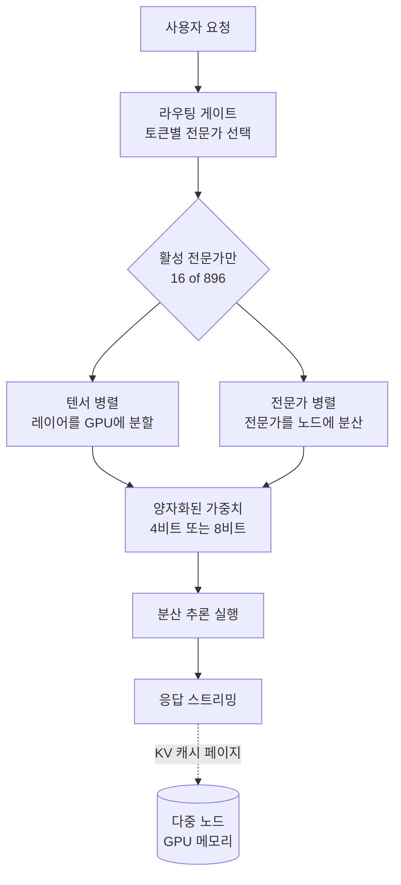

## 개요

2026년 7월 16일, 중국의 Moonshot AI가 Kimi K3를 공개했습니다. 총 2.8조 파라미터로, 현재까지 공개된 오픈웨이트 모델 가운데 가장 큰 규모입니다. 여러 매체가 이 릴리스를 두고 오픈웨이트 진영이 프론티어 수준에 도달한 사건이라고 평가했습니다.

가장 눈길을 끈 대목은 프론트엔드였습니다. AI 평가 플랫폼 Arena가 웹 인터페이스 구축 능력을 측정한 벤치마크에서 Kimi K3를 1위에 올렸고, 블라인드 테스트에서 개발자들은 프론트엔드 코딩에 있어 Anthropic의 Fable 5나 OpenAI의 GPT-5.6보다 Kimi를 더 선호했다고 보고되었습니다. Moonshot은 이를 웹 브라우저 안에서 Three.js와 WebGPU로 3D 오픈월드 게임을 만들어 내는 데모로 시연했습니다.

이 글은 벤치마크 순위를 되풀이하기보다, 그 다음 질문에 집중합니다. 오픈웨이트라는 말은 곧 누구나 이 모델을 자체 인프라에서 돌릴 수 있다는 뜻입니다. 그렇다면 2.8조 파라미터 모델을 실제로 서빙한다는 것은 무엇을 요구하는가. 다키클라우드는 고객사의 온프레미스 환경에서 모델을 서빙하는 것을 핵심 역량으로 삼고 있으므로, 이 릴리스를 운영자의 눈으로 읽어 보겠습니다.

## Kimi K3는 무엇인가

Kimi K3는 전문가 혼합, 곧 MoE 구조의 모델입니다. 총 2.8조 파라미터를 가지고 있지만, 하나의 토큰을 처리할 때 그 전부가 활성화되는 것은 아닙니다. 공개된 정보에 따르면 총 896개의 전문가 중 16개를 활성화하며, 이때 실제로 계산에 쓰이는 활성 파라미터 수는 약 500억 개 수준으로 추정됩니다[추정]. Moonshot은 활성 파라미터 수를 공식적으로 공개하지 않았습니다.

구조적으로는 두 가지 혁신이 소개되었습니다. 하나는 Kimi Delta Attention(KDA)이고, 다른 하나는 Attention Residuals(AttnRes)입니다. Moonshot은 이 둘이 효율과 추론 품질을 함께 끌어올린다고 설명합니다. 컨텍스트 길이는 100만 토큰으로, 긴 문맥을 다루는 에이전트 워크로드를 겨냥한 설계로 읽힙니다.

라이선스에 관해서는 신중할 필요가 있습니다. 직전 세대인 Kimi K2 계열은 2025년 7월에 수정 MIT 라이선스로 공개된 바 있으나, K3의 라이선스 조건 자체는 이 글을 쓰는 시점에 아직 확정 공개되지 않았습니다. Moonshot은 K3를 오픈이라고 부르며 전체 가중치를 2026년 7월 27일까지 공개하겠다고 예고했지만, 공개 시점 기준으로 공식 체크포인트가 Hugging Face 조직 계정에 아직 올라오지 않은 상태였습니다. 따라서 실제 도입을 검토한다면 최종 라이선스 문구와 가중치 공개 여부를 반드시 직접 확인해야 합니다.

## 왜 이 릴리스가 중요한가

오픈웨이트 모델이 특정 좁은 과제에서 최상위 폐쇄 모델을 앞서는 일은 이제 드물지 않습니다. 그러나 프론트엔드 코딩처럼 실무 개발자가 매일 쓰는 영역에서, 그것도 세계 최대 규모의 공개 가중치로 그 자리를 차지했다는 점은 의미가 다릅니다. 이는 성능 때문에 어쩔 수 없이 폐쇄 API에 종속되던 구조에, 자체적으로 운영 가능한 대안이 생겼다는 신호이기 때문입니다.

특히 프론트엔드와 UI 생성은 결과물을 눈으로 즉시 확인할 수 있는 영역입니다. Moonshot이 강조한 비전 인 더 루프, 곧 생성한 화면을 모델이 다시 보고 교정하는 순환 구조가 게임 개발, 사용자 인터페이스 설계, 컴퓨터 지원 설계 같은 시각적 과제에서 특히 유용하다는 주장도 이 맥락에 있습니다. 코드를 텍스트로만 생성하는 것을 넘어, 렌더링된 결과를 피드백으로 삼는다는 발상입니다.

## 2.8조 파라미터를 실제로 서빙한다는 것

여기서부터가 운영자의 영역입니다. 오픈웨이트라는 사실과 자체 서빙이 가능하다는 사실 사이에는 상당한 거리가 있습니다.

먼저 메모리입니다. 총 2.8조 파라미터를 원래의 정밀도로 그대로 올리려면 수 테라바이트 규모의 GPU 메모리가 필요합니다. 이는 단일 GPU는 물론이고 GPU 한 대에 여러 장을 꽂은 서버 한 대로도 감당하기 어려운 수준으로, 여러 노드에 걸친 분산 서빙이 전제됩니다. 다만 MoE 구조라는 점이 부담을 다소 덜어 줍니다. 매 토큰마다 전체가 아니라 일부 전문가만 활성화되므로, 계산량 자체는 활성 파라미터 규모에 가깝게 유지됩니다. 그럼에도 모든 전문가의 가중치는 언제든 호출될 수 있도록 메모리에 상주해야 하므로, 저장 부담은 총 파라미터를 따라갑니다.

그래서 현실적인 자체 서빙에는 두 가지 기법이 거의 필수로 따라옵니다. 하나는 양자화입니다. 가중치를 8비트나 4비트로 낮춰 메모리 사용량을 줄이면, 필요한 GPU 대수를 크게 낮출 수 있습니다. 다른 하나는 병렬화입니다. 텐서 병렬로 모델을 여러 GPU에 쪼개 싣고, MoE 모델의 경우 전문가 병렬을 더해 전문가들을 여러 장치에 분산합니다. 서빙 경로를 그림으로 잡으면 다음과 같습니다.

핵심은 이것입니다. 오픈웨이트는 가중치를 무료로 준다는 뜻이지, 서빙이 무료라는 뜻이 아닙니다. 이 규모의 모델을 자체 인프라에서 안정적으로 돌리려면 다중 노드 GPU 클러스터, 양자화 파이프라인, 분산 추론 엔진, 그리고 그것들을 묶는 스케줄링과 관측 계층이 함께 있어야 합니다. 바로 이 지점에서 플랫폼의 가치가 드러납니다.

## ThakiCloud 제품 적용 시사점

이 릴리스는 다키클라우드의 두 제품이 왜 필요한지를 동시에 보여 줍니다.

먼저 인프라 관점, 곧 ai-platform입니다. 다키클라우드의 ai-platform은 쿠버네티스 기반의 AI/ML 인프라로, Kueue를 통한 GPU 스케줄링, 멀티테넌트 격리, 분산 서빙, 관측성을 제공합니다. Kimi K3 같은 초대형 오픈웨이트 모델을 자체 인프라에서 서빙하려는 고객사에게 이 계층은 선택이 아니라 전제입니다. 다중 노드에 걸친 GPU 자원을 정책으로 관리하고, 양자화와 병렬화를 적용한 서빙을 운영 가능한 형태로 묶어 내는 일이 곧 도입 가능성 그 자체를 결정하기 때문입니다. 데이터를 외부로 내보낼 수 없는 소버린 환경에서, 프론티어급 오픈웨이트 모델을 자체적으로 돌릴 수 있다는 것은 그 자체로 강력한 도입 명분이 됩니다.

다음으로 에이전트 관점, 곧 Paxis입니다. Kimi K3의 강점이 프론트엔드 코딩과 시각적 생성에 있다는 점은 코딩 에이전트와 직결됩니다. Paxis는 다키클라우드의 Agent-Native Cloud로, 스킬과 도구, 정책, 감사 로그를 일급 리소스로 다룹니다. 격리된 샌드박스에서 스킬을 실행하고, 다중 에이전트를 DAG로 오케스트레이션하며, 모든 행동을 정책 게이트와 감사 로그로 통과시킵니다. 코드를 생성하고 그 결과를 다시 확인하며 교정하는 비전 인 더 루프 방식의 에이전트를, 안전한 실행 경계 안에서 운영하려는 조직에게 이런 제어 평면은 필수입니다. 강력한 오픈웨이트 코딩 모델과 안전한 에이전트 실행 환경이 결합할 때, 자체 인프라 위에서 도는 실용적인 코딩 에이전트가 완성됩니다.

두 관점은 서로를 보완합니다. 낮은 비용의 자체 서빙(ai-platform)이 있어야 에이전트를 상시 돌리는 경제성(Paxis)이 성립하고, 강력한 에이전트 워크로드(Paxis)가 있어야 그 서빙 인프라(ai-platform)에 존재 이유가 생깁니다.

## 한계 및 반론

과열된 분위기와 별개로, 냉정하게 남길 지점이 있습니다.

첫째, 이 글을 쓰는 시점에 전체 가중치가 아직 완전히 공개되지 않았을 가능성이 있고 최종 라이선스 조건도 확정되지 않았습니다. 벤치마크 성적과 실제로 손에 넣어 상업적으로 운영할 수 있는 모델은 다른 문제입니다. 도입을 검토한다면 발표 자료가 아니라 실제 공개된 가중치와 라이선스 문구를 근거로 판단해야 합니다.

둘째, 벤치마크 1위가 곧 모든 상황에서의 우위를 뜻하지는 않습니다. 프론트엔드 선호도 테스트는 특정 과제에서의 상대 평가이며, 자사의 실제 워크로드에서 어떻게 동작하는지는 직접 검증해야 합니다. 남이 보고한 순위를 그대로 자신의 결과로 가정하는 것은 위험합니다.

셋째, 자체 서빙의 총비용은 결코 작지 않습니다. 2.8조 파라미터 모델을 다중 노드에서 돌리는 데 드는 GPU, 전력, 운영 인력을 계산하면, 트래픽이 적은 조직에게는 폐쇄 API를 쓰는 편이 오히려 저렴할 수 있습니다. 오픈웨이트의 진짜 이점은 무조건적인 저비용이 아니라, 데이터 주권과 종속성 회피, 그리고 충분한 규모에서의 비용 통제 가능성에 있습니다. 자신의 트래픽 규모와 데이터 요구를 먼저 계산한 뒤에 결정해야 합니다.

## 출처

- [China's Moonshot AI releases Kimi K3, the largest open-source model ever (VentureBeat)](https://venturebeat.com/technology/chinas-moonshot-ai-releases-kimi-k3-the-largest-open-source-model-ever-rivaling-top-u-s-systems)
- [Moonshot AI Releases Kimi K3: A 2.8 Trillion Parameter Open MoE Model With Kimi Delta Attention (MarkTechPost)](https://www.marktechpost.com/2026/07/16/moonshot-ai-releases-kimi-k3-a-2-8-trillion-parameter-open-moe-model-with-kimi-delta-attention-and-1m-context/)
- [China's open-weight Kimi model stuns AI world with frontier-level results (Axios)](https://www.axios.com/2026/07/16/moonshot-kimi-ai-china-model-openai-anthropic)
- [China's Moonshot throws down the gauntlet with Kimi K3 (SiliconANGLE)](https://siliconangle.com/2026/07/16/chinas-moonshot-throws-gauntlet-kimi-k3-worlds-largest-open-weights-model/)
