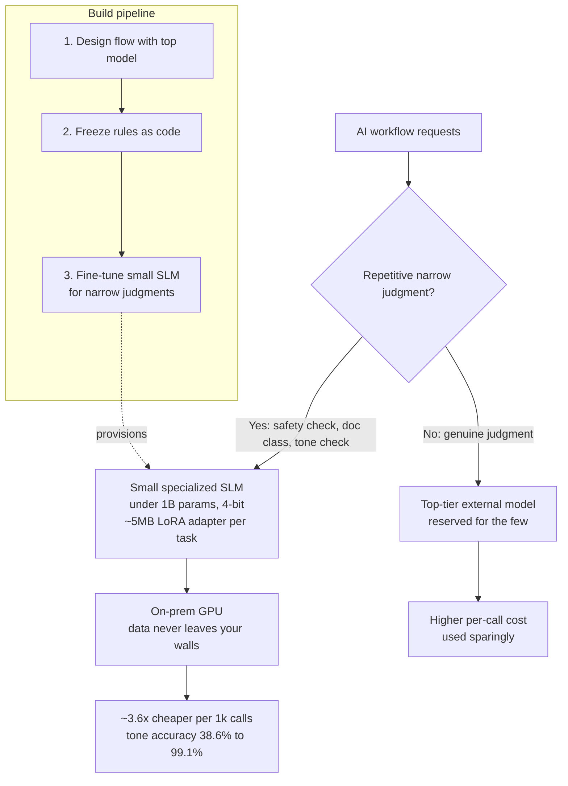

## 결론부터 말씀드립니다

AI 도입 비용의 상당 부분은 모델이 똑똑한 판단을 하기 때문에 발생하는 것이 아닙니다. 같은 판정을 하루에 수천, 수만 번 반복하는 단순 작업에서 발생합니다. "이 요청이 안전한가", "이 문서는 어느 범주인가", "이 문장의 어투는 적절한가"와 같은 판정입니다. 이 반복 작업에까지 매번 최상위 외부 모델을 호출하면, 비용은 호출량에 비례해 늘어나고 민감한 데이터는 매번 외부로 나가게 됩니다.

타키클라우드의 제안은 단순합니다. 이 반복 작업만 작은 전용 모델로 떼어내 고객사의 자체 인프라, 곧 온프레미스에서 운영하고, 값비싼 최상위 모델은 정말 판단이 필요한 소수의 업무에만 사용하는 것입니다. 저희는 이 방식이 실제로 통하는지를 예측이 아니라 측정으로 확인했으며, 그 과정을 전부 공개했습니다. 이 글은 그 비용 이야기를 의사결정권자의 관점에서 정리한 것입니다.

## 왜 지금 이 이야기가 중요한가

생성형 AI를 실무에 도입하기 시작하면 세 가지가 동시에 커집니다. 비용은 호출량을 따라 선형으로 늘어나고, 데이터 노출은 외부 API를 호출할 때마다 발생하며, 특정 외부 모델 공급자에 대한 종속성은 점점 깊어집니다. 세 가지 모두 경영진이 통제하고자 하는 리스크입니다.

핵심은 다음과 같습니다. 여러분의 AI가 수행하는 일을 살펴보면 대부분은 좁고 반복적인 판정이며, 진짜 창의적 판단은 소수입니다. 그런데 현재는 이 둘을 구분하지 않고 전부 같은 최상위 모델에 맡기고 있습니다. 단순한 서류 분류까지 가장 높은 연봉의 전문가에게 맡기는 것과 다르지 않습니다.

## 타키클라우드의 접근: 반복 작업을 전용 모델로, 온프레미스로

방법은 세 단계입니다. 첫째, 업무 흐름은 최상위 모델로 설계합니다. 둘째, 규칙으로 굳힐 수 있는 부분은 코드로 고정합니다. 셋째, 언어모델이 실제로 필요한 좁은 반복 판정만 작은 모델(파라미터 10억 개 이하, 4비트)로 특화 학습하여 연결합니다. 그러면 그 작업은 흔한 온프레미스 GPU 한 장에서 처리되고, 최상위 모델은 정말 중요한 판단에만 투입됩니다.

타키클라우드 플랫폼은 바로 이 워크플로를 제품으로 제공합니다. 작은 전용 모델을 관리형으로 파인튜닝하고(고객사가 GPU 인프라를 직접 다룰 필요가 없습니다), 그 결과를 고객사의 온프레미스 환경에서 서빙합니다. 이 글의 실험은 그 패턴이 작동한다는 증거이며, 플랫폼은 그 패턴을 반복 가능하고 운영 가능한 형태로 만들어 드립니다.

*반복적이고 좁은 판정은 온프레미스의 작은 전용 모델로 보내 호출당 비용을 낮추고 데이터를 내부에 두며, 진짜 판단이 필요한 소수 업무만 최상위 모델에 맡깁니다. 전용 모델은 작업당 약 5메가바이트 부착 파일로 만들어져 하나의 기본 모델 위에 여러 작업을 바꿔 끼울 수 있습니다.*

## 실측: 무엇을 확인했는가

과장을 피하기 위해 모든 수치를 직접 측정하고 공개했습니다. 실험 환경은 GPU 한 장이며, 학습과 추론 어느 단계에서도 외부 API를 호출하지 않았습니다. 즉 전 과정이 자체 인프라 안에서 완결됩니다. 이것이 데이터 주권의 실체입니다.

비용 측면입니다. 온프레미스에서 이 작은 전용 모델이 처리하는 1천 건당 비용은 최상위 외부 API 대비 약 3.6배 저렴했습니다. 이 수치는 단일 처리 기준이므로, 실제 운영처럼 묶어서 처리하면 격차는 더 벌어집니다.

품질 측면입니다. 좁은 반복 판정에서 작은 모델은 크게 향상되었습니다. 예를 들어 한국어 어투 판정은 학습 전 38.6퍼센트에서 학습 후 99.1퍼센트로, 뉴스 범주 분류는 거의 무작위 수준에서 80퍼센트 이상으로 올랐습니다. 학습에 사용하지 않은 실제 문장으로 다시 검증했을 때에도 안전 판정에서 88퍼센트, 범주 분류에서 89퍼센트 수준의 일치도를 보였습니다.

경제성 측면입니다. 이 전용 모델은 각 작업마다 약 5메가바이트의 작은 부착 파일로 만들어집니다. 전체 모델을 통째로 다시 학습하는 방식과 품질은 거의 같으면서(99.1퍼센트 대 96.9퍼센트) 크기는 약 300분의 1이며, 하나의 기본 모델 위에 여러 작업을 바꿔 끼울 수 있습니다. 하나의 작은 모델이 네 가지 반복 작업을 동시에 감당하기도 했습니다. 운영 관점에서 이는 적은 하드웨어로 더 많은 업무를 처리한다는 뜻으로 직결됩니다.

## 정직하게 남기는 한계

한 가지는 분명히 말씀드립니다. 최상위 모델이 이미 잘 처리하던 일반적인 작업에 성급하게 전용 학습을 적용했더니 오히려 성능이 떨어진 경우가 있었습니다. 즉 이 방식은 아무 작업에나 적용하는 것이 아니라, 반복적이고 좁은 작업을 선별하여 적용해야 효과가 납니다. 어디에 적용하고 어디에는 적용하지 않아야 하는지를 판단하는 일, 바로 그 지점에서 플랫폼과 전문성이 필요합니다. 저희는 좋은 결과와 좋지 않은 결과를 함께 공개합니다.

## 의사결정권자를 위한 요약

첫째, AI 운영비의 상당 부분은 반복 작업에서 새어나가고 있으며, 이 부분은 구조적으로 줄일 수 있습니다. 둘째, 그 방법은 반복 작업을 작은 전용 모델로 떼어내 온프레미스에서 운영하는 것이며, 이는 비용 절감과 데이터 주권을 동시에 확보해 줍니다. 셋째, 타키클라우드 플랫폼은 이 과정을 관리형으로 제공하여, 고객사가 GPU 인프라와 모델 학습의 복잡성을 직접 떠안지 않고도 도입하실 수 있게 합니다.

전체 실험 코드와 측정 결과는 누구나 재현할 수 있도록 공개해 두었습니다: [github.com/sylvanus4/tiny-skill-distill](https://github.com/sylvanus4/tiny-skill-distill). 여러분의 AI 워크로드 가운데 어느 부분을 전용 모델로 옮기면 비용이 얼마나 내려갈지, 저희가 함께 진단해 드리겠습니다.
