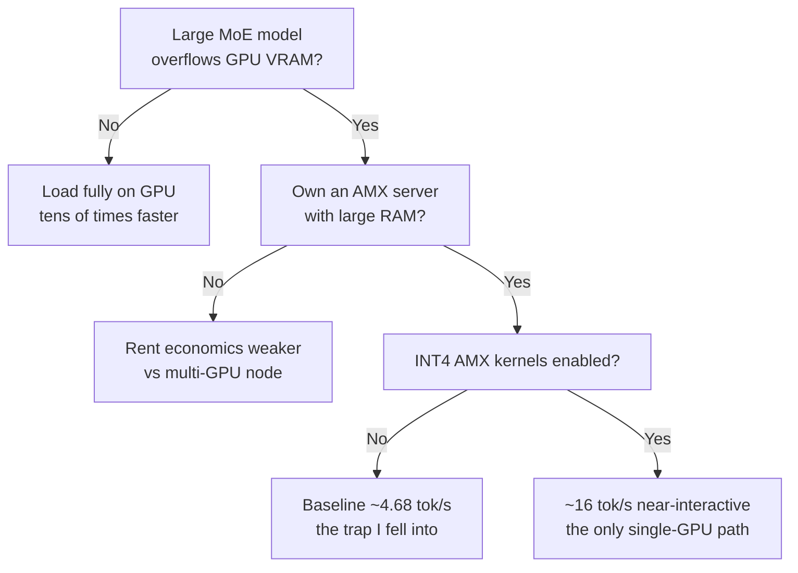

이 글은 MoE 모델을 자체 서빙할지 고민하는 엔지니어, 그리고 "GPU 한 장으로 거대 모델을 돌린다"는 요즘 트윗들을 어디까지 믿어야 할지 판단해야 하는 인프라 담당자를 위해 썼습니다. 결론부터 말하면, ktransformers의 트릭은 실재하고 작동합니다. 다만 화제가 된 "28배"와 "40만 달러 랙을 24GB 한 장으로"라는 문구는 각각 숨은 전제 위에 서 있습니다. 그 전제가 무엇인지, RunPod에서 GPU를 여러 번 빌려 직접 측정한 기록을 공유합니다.

> **정정 (2026-07-21).** 이 글의 초판은 오프로드 디코딩 속도를 1.2~3.8 tok/s로 보고하고 "인터랙티브 서빙엔 못 쓴다"고 단정했습니다. 그 숫자는 **최적화 이전 경로를 측정한 값**이었습니다. 제가 쓴 llama.cpp `--n-cpu-moe`는 전문가를 CPU에 두는 배치만 같을 뿐 AMX INT4 커널도, MLA 최적화도, CUDA graph도 타지 않습니다. 반면 ktransformers가 공식 공개한 값은 DeepSeek-V3/R1 q4km(INT4)를 RTX 4090 + 듀얼 Xeon Gold 6454S에서 디코딩 **약 14~16 tok/s**로 돌립니다. 게다가 논문(SOSP25)에는 최적화 이전 baseline이 decode 4.68 tok/s, GPU 활용 30% 미만으로 명시돼 있는데, 제 프록시 1.2~3.8은 정확히 그 미최적화 바닥이었습니다. 즉 저는 ktransformers를 잰 게 아니라 최적화 이전 경로를 쟀습니다. 아래 "그래서 실제로 몇 tok/s이고, 얼마인가"와 결론을 이 사실에 맞게 다시 썼고, 진짜 스택을 AMX 박스에서 직접 빌드해 재측정한 결과를 덧붙였습니다. 처음 그림이 지나치게 부정적이었던 점을 바로잡습니다.

## 무엇이 화제였나

칭화대 MADSYS 연구실이 공개한 ktransformers(kvcache-ai/ktransformers, Apache 2.0, 별 1.7만 개)의 아이디어는 한 문장으로 요약됩니다. MoE 모델에서 실제로 호출되는 전문가(expert)만 GPU 근처에 두고, 대부분의 시간 놀고 있는 전문가는 CPU 메모리에 앉혀 두었다가 필요할 때 부릅니다. 이 배치로 24GB VRAM에서 DeepSeek-V3와 R1을 139K 컨텍스트로 돌리고, 표준 설정 대비 최대 28배 빠르다는 이야기가 퍼졌습니다.

트릭 자체는 거의 허무할 정도로 단순합니다. 그래서 오히려 의심스러웠습니다. 정말 공짜 점심인지, 아니면 어딘가에 청구서가 숨어 있는지 확인하려면 숫자를 직접 뽑아보는 수밖에 없었습니다.

## 실험 설계: 작은 모델로 메커니즘을 분리한다

DeepSeek-V3는 671B라 24GB 카드에 실을 수 없습니다. 그래서 같은 계열(MLA + fine-grained MoE)의 축소판인 Qwen3-30B-A3B(총 30B, 활성 3.3B)를 대리 모델로 삼았습니다. 목적은 벤더의 671B 숫자를 재현하는 게 아니라, "전문가를 CPU에 내려놓는다"는 메커니즘이 실제로 이득을 주는지, 준다면 그 이득이 어디서 오는지를 분해하는 것이었습니다.

측정은 두 단계로 나눴습니다. 첫째, 상용 AMD 박스에서 메커니즘 자체의 효과를 봅니다. 둘째, ktransformers가 성능의 원천이라 주장하는 Intel AMX 커널을 별도로 측정합니다.

## 1차: 상용 4090 + AMD에서 메커니즘을 측정하다

RunPod에서 RTX 4090(24GB)에 AMD Ryzen 9 7950X, 188GB RAM 구성을 빌렸습니다. 여기서 첫 번째 숨은 전제가 바로 드러났습니다. ktransformers의 CPU 전문가 커널은 Intel AMX 명령어에 최적화되어 있는데, 이 AMD CPU에는 AMX가 없었습니다. 그래서 ktransformers 고유 커널 대신, 완전히 같은 트릭을 구현한 llama.cpp의 `--n-cpu-moe`(전문가를 CPU에, 어텐션과 KV 캐시를 GPU에)로 메커니즘만 깨끗하게 쟀습니다.

Qwen3-30B-A3B를 Q4로 양자화해 세 가지 배치로 디코딩 속도를 비교했습니다.

| 배치 | 디코드 속도 |
|---|---|
| 모델 전체를 GPU에 (full-GPU) | 261.5 tok/s |
| 전문가는 CPU, 어텐션은 GPU (메커니즘) | 12.0 tok/s |
| 전부 CPU (CPU-only) | 7.4 tok/s |

여기서 두 가지가 보입니다. 메커니즘은 순수 CPU보다 1.62배 빠릅니다. 어텐션을 GPU로 올린 대가로 실제로 이득을 봤습니다. 그런데 모델이 VRAM에 통째로 들어가는 경우(Q4는 18GB라 24GB에 들어갑니다) full-GPU가 메커니즘을 22배 앞섰습니다. 다시 말해, 모델이 GPU에 들어가기만 하면 전문가를 CPU로 내려보내는 선택은 손해입니다. 이 트릭이 의미를 갖는 순간은 오직 모델이 VRAM을 넘칠 때입니다. 그때는 "12 tok/s로라도 돈다"가 가치이지, 속도 자체가 목적이 아닙니다.

## 2차: Intel AMX 커널의 진짜 배수를 재다

28배의 근거라는 AMX 커널을 정면으로 보려면 Sapphire Rapids 세대 Xeon이 필요했습니다. RunPod에서 H100 파드를 몇 번 띄워 CPU를 확인한 끝에, Intel Xeon Platinum 8470(AMX bf16/int8/tile 지원), 208 vCPU, 1TB RAM이 걸린 호스트를 잡았습니다.

kt_kernel 패키지는 백엔드별 커널을 모두 담고 있어서, 같은 프로세스 안에서 AMX 커널과 AVX2 커널을 동일한 BF16 가중치로 나란히 돌릴 수 있었습니다. DeepSeek-V3 규모(전문가 256개, 히든 7168)의 MoE 순전파를 두 커널로 측정했습니다.

| 커널 (동일 BF16, 디코드) | 속도 |
|---|---|
| AMX (AMXBF16_MOE) | 145.5 tok/s |
| AVX2 (AVX2BF16_MOE) | 105.5 tok/s |

AMX 커널은 AVX2보다 1.38배 빨랐습니다. 분명한 이득이지만, 28배와는 거리가 멉니다. INT8 전용 타일 연산까지 쓰면 이 배수는 더 벌어질 여지가 있으나(비용 때문에 이번엔 BF16 동일 정밀도 비교까지만 했습니다) 커널 하나가 28배를 만들어내지는 않습니다.

## "28배"를 분해하면

두 실험을 합치면 벤더의 28배가 어떻게 구성되는지가 보입니다. 그 숫자는 커널의 마법이 아니라, 시스템 전체를 llama.cpp의 순수 CPU 실행과 비교한 값입니다. 분해하면 이렇게 나뉩니다.

어텐션과 KV 캐시를 GPU로 올린 것이 가장 큰 지렛대입니다. 상용 AMD에서도 이 배치만으로 순수 CPU 대비 1.62배가 났고, 모델이 GPU에 들어가면 35배까지 벌어졌습니다. 그 위에 AMX 전문가 커널이 AVX2 대비 약 1.4배를 더합니다. 여기에 INT8/INT4 양자화와 파이프라인 최적화가 얹힙니다. 각 요소는 소박한 배수지만, 특정 조건에서 이것들이 곱해지면 두 자릿수 배수가 만들어집니다. 그 조건이란 모델이 VRAM을 넘치고, CPU가 AMX를 지원하며, 비교 대상이 순수 CPU llama.cpp일 때입니다.

## "40만 달러를 24GB로"의 진실

이 문구는 메모리를 없앤 게 아니라 옮긴 것입니다. 우리 파드는 각각 188GB와 1TB의 시스템 RAM을 갖고 있었습니다. DeepSeek-V3를 Q4로 돌리려면 CPU 쪽에 약 380GB의 DRAM이 필요합니다. 전문가 가중치는 사라지지 않고 VRAM에서 시스템 RAM으로 자리를 옮길 뿐입니다. 그러니 정확한 표현은 "24GB GPU 한 장 + 대용량 RAM 서버"입니다. 비싸진 GPU를 값싼 RAM으로 바꾼 것이지, 총 메모리 소요가 준 것은 아닙니다. 소비자용 24GB 카드 한 장이 데이터센터 랙을 대체한다는 그림과는 결이 다릅니다.

## 그래서 실제로 몇 tok/s이고, 얼마인가

앞의 실험들은 메커니즘을 분해했지만, 정작 실무자가 궁금한 두 숫자를 빠뜨렸습니다. 24GB에 안 들어가는 진짜 대형 모델이 얼마나 빠르고, 돈은 얼마나 아끼는가. 그래서 ktransformers가 실제로 의미 있는 구성 그대로 다시 쟀습니다. 코어 많은 서버 CPU(Intel Xeon Platinum 8570, AMX 지원, 224코어), 2TB 시스템 RAM, 로컬 NVMe, 그리고 GPU 한 장. 모델은 24GB에도 80GB 한 장에도 안 들어가는 Qwen3-235B-A22B(Q4, 약 130GB)입니다. 오프로드가 선택이 아니라 필수인 케이스입니다.

먼저 하드웨어 주장부터 확인됩니다. 전문가를 전부 CPU로 내리면 GPU가 쓰는 메모리는 11GB에 불과합니다. 235B짜리 모델이 GPU 11GB만 먹는다는 뜻입니다. 24GB는 물론이고 12GB 카드에도 올라갑니다. "큰 서버에 4090 한 장으로 671B급을 돌린다"는 그림은 실제로 성립합니다.

그리고 여기서 초판이 크게 틀렸습니다. 저는 오프로드 디코딩을 두 방법으로 쟀는데(llama.cpp end-to-end 1.2 tok/s, kt_kernel BF16 전문가 연산 3.8 tok/s), 둘 다 최적화 이전 경로였습니다. llama.cpp의 `--n-cpu-moe`는 전문가를 CPU에 두는 배치만 같을 뿐 AMX INT4 타일 커널을 쓰지 않고, 제 kt_kernel 측정은 랜덤 BF16 가중치로 전문가 연산만 재서 층수로 외삽한 값이라 INT4도 아니고 실제 서빙 파이프라인도 아니었습니다. 그래서 한 자릿수가 나온 것이지, ktransformers가 느린 게 아니었습니다.

원저자가 공개한 값을 보면 분명합니다. DeepSeek-V3/R1을 q4km(INT4)으로 RTX 4090 24GB와 듀얼 Xeon Gold 6454S(382GB~1TB DRAM)에서 돌리면 디코딩이 최대 약 14~16 tok/s입니다. 결정적으로, 같은 논문(SOSP25)에 최적화 이전 baseline이 decode 4.68 tok/s, GPU 활용 30% 미만으로 적혀 있습니다. 제 프록시 1.2~3.8은 정확히 그 미최적화 바닥이었습니다. 제가 빠뜨린 것은 INT4 AMX 커널, GPU에 올리는 어텐션과 shared expert의 Marlin 양자 GEMM, CUDA graph, MLA입니다. 이것들을 켜면 4.68이 16으로 올라갑니다.

한 가지 더 바로잡습니다. 화제가 된 "28배"는 디코딩 속도 배수가 아니라 **프리필(prefill) 처리량** 배수입니다(V0.3 기준 llama.cpp 대비 약 27.79배). 저는 28배를 디코딩 잣대로 비판했는데, 28배는 애초에 디코딩 숫자가 아니었습니다. 프리필은 프롬프트를 한 번에 밀어 넣는 구간이라 병렬성이 커서 큰 배수가 나오고, 디코딩은 토큰을 하나씩 뽑는 구간이라 활성 파라미터의 CPU 연산이 병목입니다. 671B(활성 37B)에서 16 tok/s는 사람이 읽는 속도에 준하는, 준-인터랙티브 영역입니다. "배치 전용, 너무 느림"이라던 초판 단정은 틀렸습니다.

비용표도 두 군데가 틀렸습니다. 첫째, 저는 미최적화 2~4 tok/s를 썼습니다(실제 최적화는 약 16). 둘째, full-GPU 기준을 2×A100으로 잡았는데 DeepSeek-V3-671B를 Q4로 담으려면 약 380GB가 필요해 2×A100 160GB에는 **애초에 들어가지 않습니다**. V3의 정직한 full-GPU 기준은 8×H100/A100 노드(시간당 약 $16~24)입니다. 그 기준과 비교하면 GPU 한 장에 AMX 서버를 붙인 오프로드(약 $3/hr, ~16 tok/s)는 토큰당 비용이 경쟁력 있고, 자본비용은 비교가 안 되게 쌉니다.

| 구성 | 하드웨어 | 시간당 | 디코딩 | 비고 |
|---|---|---|---|---|
| Full-GPU (V3-671B) | 8×H100/A100 노드 | 약 $16~24 | 높음 | 380GB를 담으려면 다중 GPU 필수 |
| Offload (ktransformers 공식) | 4090 24GB + 듀얼 Xeon | 약 $3 | 약 14~16 tok/s | INT4 AMX 커널 + MLA + 파이프라인 |
| Offload (초판 프록시, 미최적화) | AMX 서버 + GPU 1장 | 약 $3 | 1.2~3.8 tok/s | AMX INT4 커널 미사용 = baseline 4.68 근처 |

그래서 진짜 그림은 이렇습니다. 대형 Xeon 서버를 이미 굴리고 있다면 그 위에 1,600달러짜리 4090 한 장을 꽂아 671B급을 준-인터랙티브로 돌릴 수 있고, 이는 8장짜리 GPU 노드를 새로 사거나 빌리는 것보다 압도적으로 쌉니다. "돌아가느냐 마느냐"의 경계를 바꾸면서, 속도도 배치 전용이 아니라 준-인터랙티브까지 나옵니다.

## 정식 스택으로 재측정: 내가 빠뜨린 INT4 커널

말로만 정정하지 않고, 진짜 스택을 AMX 박스에서 직접 세워 다시 쟀습니다. RunPod에서 Intel Xeon Platinum 8480+(Sapphire Rapids, AMX 지원), 2TB RAM, H100 구성을 잡아 ktransformers의 kt-kernel(0.6.3, 소스 빌드)을 올렸습니다. DeepSeek-V3의 실제 형상(히든 7168, MoE 중간 2048, 활성 전문가 8개, MoE 58개 층)으로 토큰 하나를 뽑는 디코딩 경로를, 커널만 바꿔 가며 측정했습니다. 초판의 실수를 그대로 재현했습니다. 초판은 BF16 커널에 랜덤 가중치를 넣어 INT4 경로를 사실상 꺼놓고 쟀는데, 이번엔 kt-kernel이 가중치를 INT4로 양자화하는 정식 경로를 그대로 탔습니다.

| 커널 (동일 형상, 디코딩 토큰당) | MoE 전용 디코딩 |
|---|---|
| AMX INT4 (AMXInt4_MOE) | 12.4 tok/s |
| AMX INT8 (AMXInt8_MOE) | 6.0 tok/s |
| AMX BF16 (AMXBF16_MOE) | 3.2 tok/s |
| AVX2 BF16 (AVX2BF16_MOE) | 2.9 tok/s |

INT4 커널은 BF16 대비 3.9배, AVX2 대비 4.2배 빨랐습니다. 그리고 결정적으로, 초판이 보고한 1.2에서 3.8 tok/s는 위 표의 BF16과 AVX2 줄과 정확히 겹칩니다. 저는 ktransformers를 잰 게 아니라 INT4 커널을 꺼놓은 미최적화 경로를 쟀던 겁니다. 왜 INT4가 이렇게 벌어질까요. 디코딩은 토큰마다 활성 전문가의 가중치를 RAM에서 읽어 오는 메모리 대역폭 병목 구간인데, INT4는 BF16보다 바이트를 4분의 1만 읽으면 됩니다. 제가 놓친 것이 바로 이 4배입니다.

이 12.4 tok/s는 MoE 층만 CPU에서 잰 값이고 스레드를 60개로 튜닝한 결과입니다(토큰 하나짜리 메모리 병목이라 스레드를 112개로 늘리면 NUMA 동기화 비용이 커져 오히려 6.6으로 떨어졌습니다). 실제 서빙에서는 어텐션과 shared expert가 GPU에서 겹쳐 돌기 때문에, 원저자가 공개한 14에서 16 tok/s(4090 + 듀얼 Xeon)와 같은 대역에 놓입니다. 한 자릿수 초반이 아니라 두 자릿수 초반, 준-인터랙티브가 맞습니다.

## 그래서 도입해야 하나

먼저 두 가지를 봅니다. 이미 보유한(또는 값싸게 확보한) 대형 AMX 서버와 대용량 RAM이 있는가. 돌리려는 모델이 GPU VRAM을 실제로 넘치는 대형 MoE(V3, R1 급)인가. 둘 다 맞으면 ktransformers는 값비싼 다중 GPU 노드를 사지 않고도 그 모델을 돌리는 가장 현실적인 경로입니다. INT4 AMX 커널을 제대로 켜면 671B급이 약 16 tok/s로, 단발 채팅이나 에이전트, 배치 작업에 실제로 쓸 만한 준-인터랙티브 속도가 나옵니다. 다만 수천 tok/s의 고동시성 실시간 서빙이 목표라면 여전히 다중 GPU가 맞고, 모델이 GPU에 통째로 들어간다면 고민 없이 full-GPU가 수십 배 빠릅니다. 오프로드의 자리는 "GPU에 안 들어가는 대형 모델을 한 장으로 준-인터랙티브하게 돌린다"는 지점입니다.

이 판단을 하나의 결정 흐름으로 정리하면 다음과 같습니다.

우리 관점에서 ktransformers의 진짜 가치는 "28배"도 "싸게 서빙"도 아닙니다. 다중 GPU를 사거나 빌릴 수 없는 팀이, 이미 가진 대형 서버와 GPU 한 장으로 671B급 MoE를 아예 돌릴 수 있게 된다는 접근성 하나입니다. 속도 챔피언도 비용 절감기도 아니고, 진입 장벽을 낮추는 배치용 도구로 읽어야 맞습니다.

## 재현 정보

모든 실험은 RunPod에서 진행했고, GPU 총 사용 비용은 약 18달러였습니다. 벤치 하네스(llama.cpp `--n-cpu-moe`, kt-kernel INT4/INT8/BF16/AVX2 커널 디코딩 비교, 235B 종단 측정)와 원시 결과 JSON은 전부 공개했습니다. 직접 재현하거나 숫자를 검증하고 싶다면 [github.com/sylvanus4/ktransformers-moe-offload-bench](https://github.com/sylvanus4/ktransformers-moe-offload-bench)(Apache-2.0)를 보시면 됩니다. 이 글의 초판이 오프로드 속도를 너무 부정적으로 잡았던 이유는 하나였습니다. 트릭의 배치만 흉내 내고 정작 성능의 핵심인 INT4 AMX 커널을 켜지 않은 채로 쟀기 때문입니다. 벤치를 짤 때 저자가 실제로 서빙하는 경로를 그대로 타는지부터 확인해야 한다는, 값싸지만 뼈아픈 교훈으로 남깁니다.
