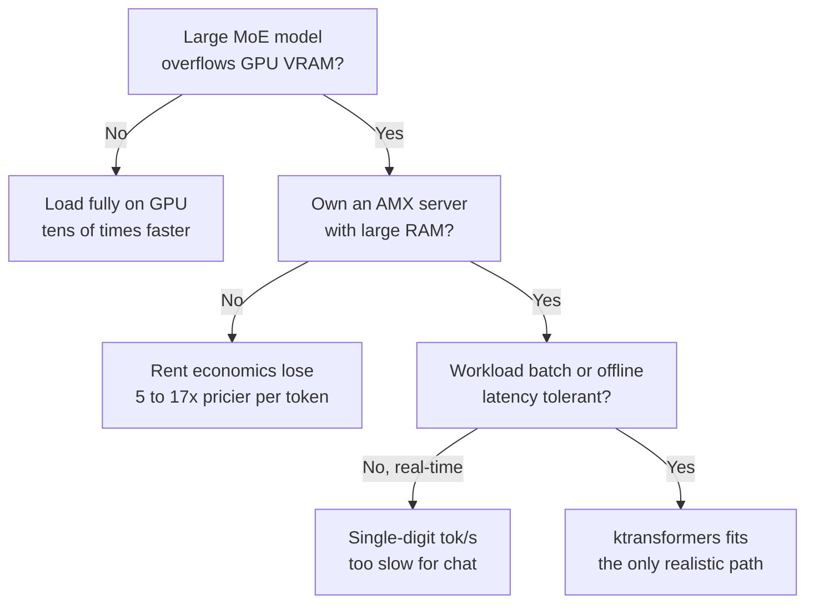

이 글은 MoE 모델을 자체 서빙할지 고민하는 엔지니어, 그리고 "GPU 한 장으로 거대 모델을 돌린다"는 요즘 트윗들을 어디까지 믿어야 할지 판단해야 하는 인프라 담당자를 위해 썼습니다. 결론부터 말하면, ktransformers의 트릭은 실재하고 작동합니다. 다만 화제가 된 "28배"와 "40만 달러 랙을 24GB 한 장으로"라는 문구는 각각 숨은 전제 위에 서 있습니다. 그 전제가 무엇인지, RunPod에서 GPU를 두 번 빌려 직접 측정한 기록을 공유합니다.

## 무엇이 화제였나

칭화대 MADSYS 연구실이 공개한 ktransformers(kvcache-ai/ktransformers, Apache 2.0, 별 1.7만 개)의 아이디어는 한 문장으로 요약됩니다. MoE 모델에서 실제로 호출되는 전문가(expert)만 GPU 근처에 두고, 대부분의 시간 놀고 있는 전문가는 CPU 메모리에 앉혀 두었다가 필요할 때 부릅니다. 이 배치로 24GB VRAM에서 DeepSeek-V3와 R1을 139K 컨텍스트로 돌리고, 표준 설정 대비 최대 28배 빠르다는 이야기가 퍼졌습니다.

트릭 자체는 거의 허무할 정도로 단순합니다. 그래서 오히려 의심스러웠습니다. 정말 공짜 점심인지, 아니면 어딘가에 청구서가 숨어 있는지 확인하려면 숫자를 직접 뽑아보는 수밖에 없었습니다.

## 실험 설계: 작은 모델로 메커니즘을 분리한다

DeepSeek-V3는 671B라 24GB 카드에 실을 수 없습니다. 그래서 같은 계열(MLA + fine-grained MoE)의 축소판인 Qwen3-30B-A3B(총 30B, 활성 3.3B)를 대리 모델로 삼았습니다. 목적은 벤더의 671B 숫자를 재현하는 게 아니라, "전문가를 CPU에 내려놓는다"는 메커니즘이 실제로 이득을 주는지, 준다면 그 이득이 어디서 오는지를 분해하는 것이었습니다.

측정은 두 단계로 나눴습니다. 첫째, 상용 AMD 박스에서 메커니즘 자체의 효과를 봅니다. 둘째, ktransformers가 성능의 원천이라 주장하는 Intel AMX 커널을 별도로 측정합니다.

## 1차: 상용 4090 + AMD에서 메커니즘을 측정하다

RunPod에서 RTX 4090(24GB)에 AMD Ryzen 9 7950X, 188GB RAM 구성을 빌렸습니다. 여기서 첫 번째 숨은 전제가 바로 드러났습니다. ktransformers의 CPU 전문가 커널은 Intel AMX 명령어에 최적화되어 있는데, 이 AMD CPU에는 AMX가 없었습니다. 그래서 ktransformers 고유 커널 대신, 완전히 같은 트릭을 구현한 llama.cpp의 `--n-cpu-moe`(전문가를 CPU에, 어텐션과 KV 캐시를 GPU에)로 메커니즘만 깨끗하게 쟀습니다.

Qwen3-30B-A3B를 Q4로 양자화해 세 가지 배치로 디코딩 속도를 비교했습니다.

| 배치 | 디코드 속도 |
|---|---|
| 모델 전체를 GPU에 (full-GPU) | 261.5 tok/s |
| 전문가는 CPU, 어텐션은 GPU (메커니즘) | 12.0 tok/s |
| 전부 CPU (CPU-only) | 7.4 tok/s |

여기서 두 가지가 보입니다. 메커니즘은 순수 CPU보다 1.62배 빠릅니다. 어텐션을 GPU로 올린 대가로 실제로 이득을 봤습니다. 그런데 모델이 VRAM에 통째로 들어가는 경우(Q4는 18GB라 24GB에 들어갑니다) full-GPU가 메커니즘을 22배 앞섰습니다. 다시 말해, 모델이 GPU에 들어가기만 하면 전문가를 CPU로 내려보내는 선택은 손해입니다. 이 트릭이 의미를 갖는 순간은 오직 모델이 VRAM을 넘칠 때입니다. 그때는 "12 tok/s로라도 돈다"가 가치이지, 속도 자체가 목적이 아닙니다.

## 2차: Intel AMX 커널의 진짜 배수를 재다

28배의 근거라는 AMX 커널을 정면으로 보려면 Sapphire Rapids 세대 Xeon이 필요했습니다. RunPod에서 H100 파드를 몇 번 띄워 CPU를 확인한 끝에, Intel Xeon Platinum 8470(AMX bf16/int8/tile 지원), 208 vCPU, 1TB RAM이 걸린 호스트를 잡았습니다.

kt_kernel 패키지는 백엔드별 커널을 모두 담고 있어서, 같은 프로세스 안에서 AMX 커널과 AVX2 커널을 동일한 BF16 가중치로 나란히 돌릴 수 있었습니다. DeepSeek-V3 규모(전문가 256개, 히든 7168)의 MoE 순전파를 두 커널로 측정했습니다.

| 커널 (동일 BF16, 디코드) | 속도 |
|---|---|
| AMX (AMXBF16_MOE) | 145.5 tok/s |
| AVX2 (AVX2BF16_MOE) | 105.5 tok/s |

AMX 커널은 AVX2보다 1.38배 빨랐습니다. 분명한 이득이지만, 28배와는 거리가 멉니다. INT8 전용 타일 연산까지 쓰면 이 배수는 더 벌어질 여지가 있으나(비용 때문에 이번엔 BF16 동일 정밀도 비교까지만 했습니다) 커널 하나가 28배를 만들어내지는 않습니다.

## "28배"를 분해하면

두 실험을 합치면 벤더의 28배가 어떻게 구성되는지가 보입니다. 그 숫자는 커널의 마법이 아니라, 시스템 전체를 llama.cpp의 순수 CPU 실행과 비교한 값입니다. 분해하면 이렇게 나뉩니다.

어텐션과 KV 캐시를 GPU로 올린 것이 가장 큰 지렛대입니다. 상용 AMD에서도 이 배치만으로 순수 CPU 대비 1.62배가 났고, 모델이 GPU에 들어가면 35배까지 벌어졌습니다. 그 위에 AMX 전문가 커널이 AVX2 대비 약 1.4배를 더합니다. 여기에 INT8/INT4 양자화와 파이프라인 최적화가 얹힙니다. 각 요소는 소박한 배수지만, 특정 조건에서 이것들이 곱해지면 두 자릿수 배수가 만들어집니다. 그 조건이란 모델이 VRAM을 넘치고, CPU가 AMX를 지원하며, 비교 대상이 순수 CPU llama.cpp일 때입니다.

## "40만 달러를 24GB로"의 진실

이 문구는 메모리를 없앤 게 아니라 옮긴 것입니다. 우리 파드는 각각 188GB와 1TB의 시스템 RAM을 갖고 있었습니다. DeepSeek-V3를 Q4로 돌리려면 CPU 쪽에 약 380GB의 DRAM이 필요합니다. 전문가 가중치는 사라지지 않고 VRAM에서 시스템 RAM으로 자리를 옮길 뿐입니다. 그러니 정확한 표현은 "24GB GPU 한 장 + 대용량 RAM 서버"입니다. 비싸진 GPU를 값싼 RAM으로 바꾼 것이지, 총 메모리 소요가 준 것은 아닙니다. 소비자용 24GB 카드 한 장이 데이터센터 랙을 대체한다는 그림과는 결이 다릅니다.

## 그래서 실제로 몇 tok/s이고, 얼마인가

앞의 실험들은 메커니즘을 분해했지만, 정작 실무자가 궁금한 두 숫자를 빠뜨렸습니다. 24GB에 안 들어가는 진짜 대형 모델이 얼마나 빠르고, 돈은 얼마나 아끼는가. 그래서 ktransformers가 실제로 의미 있는 구성 그대로 다시 쟀습니다. 코어 많은 서버 CPU(Intel Xeon Platinum 8570, AMX 지원, 224코어), 2TB 시스템 RAM, 로컬 NVMe, 그리고 GPU 한 장. 모델은 24GB에도 80GB 한 장에도 안 들어가는 Qwen3-235B-A22B(Q4, 약 130GB)입니다. 오프로드가 선택이 아니라 필수인 케이스입니다.

먼저 하드웨어 주장부터 확인됩니다. 전문가를 전부 CPU로 내리면 GPU가 쓰는 메모리는 11GB에 불과합니다. 235B짜리 모델이 GPU 11GB만 먹는다는 뜻입니다. 24GB는 물론이고 12GB 카드에도 올라갑니다. "큰 서버에 4090 한 장으로 671B급을 돌린다"는 그림은 실제로 성립합니다.

문제는 속도입니다. 같은 모델을 2×A100 80GB에 통째로 올리면 디코딩이 51.5 tok/s로, 실시간 대화에 넉넉합니다. 그런데 전문가를 CPU로 내린 오프로드 상태는 완전히 다른 세계입니다. 두 가지 독립된 방법으로 쟀는데 둘 다 한 자릿수였습니다. llama.cpp로 끝까지 돌리면 1.2 tok/s, ktransformers의 실제 AMX 커널(kt_kernel)로 전문가 연산만 재면 BF16 기준 3.8 tok/s입니다. 전문가 일부를 24GB GPU에 올려도 1.2에서 1.5로 조금 오를 뿐입니다.

왜 커널을 바꿔도 한 자릿수를 못 벗어날까요. 활성 파라미터 22B를 토큰마다 CPU에서 계산하는 것이 근본 병목이기 때문입니다. AMX 커널이 AVX2보다 1.3배가량 빠른 것은 맞지만, 그 배수로는 벽을 넘지 못합니다. ktransformers가 공개한 8에서 15 tok/s(더 큰 DeepSeek-V3 기준)는 INT4 양자화와 GPU 전문가 배치, 파이프라이닝을 모두 얹은 값이고, 그마저도 배치급이지 인터랙티브 서빙 속도는 아닙니다.

이 숫자가 결론을 뒤집습니다. RunPod 실가로 토큰 100만 개당 비용을 계산하면 이렇습니다.

| 구성 | 하드웨어 | 시간당 | 디코딩 | 100만 토큰당 |
|---|---|---|---|---|
| Full-GPU | 2×A100 80GB | 약 $3 | 51.5 tok/s | 약 $16 |
| Offload | AMX 서버 + GPU 1장 | 약 $3 | 약 2~4 tok/s | 약 $80~280 |

렌트 기준으로 오프로드는 토큰당 5배에서 17배 더 비쌉니다. 클라우드에서 운영비를 아끼는 도구가 전혀 아니라는 뜻입니다. 게다가 큰 AMX 서버 자체가 싸지 않습니다. RunPod에는 "값싼 4090에 AMX 대형 서버"라는 조합이 아예 없어서, AMX는 데이터센터 GPU와 묶여 나옵니다.

그렇다면 경제성이 성립하는 지점은 단 하나, 온프레미스에서 이미 보유한 서버입니다. 대형 Xeon 서버를 이미 굴리고 있다면, 그 매몰비용 위에 1,600달러짜리 4090 한 장을 꽂아 671B급 모델을 배치로 돌리는 편이, 3만 달러어치 A100 두 장을 새로 사는 것보다 압도적으로 쌉니다. 운영비를 깎는 도구가 아니라, 이미 가진 자원으로 "돌아가느냐 안 돌아가느냐"의 경계를 바꾸는 도구입니다. 그리고 그 용도는 실시간 서빙이 아니라 배치와 오프라인, 에이전트 같은 지연에 둔감한 작업입니다.

## 그래서 도입해야 하나

먼저 이 세 가지를 모두 만족하는지 봅니다. 이미 보유한(또는 값싸게 확보한) 대형 AMX 서버와 대용량 RAM이 있는가. 돌리려는 모델이 GPU VRAM을 실제로 넘치는 대형 MoE(V3, R1 급)인가. 그리고 그 작업이 실시간 응답이 아니라 배치나 오프라인, 에이전트처럼 지연에 둔감한가. 세 가지가 다 맞으면 ktransformers는 값비싼 다중 GPU를 사지 않고도 그 모델을 돌리는 유일한 현실적 경로가 됩니다. 하나라도 어긋나면 답은 달라집니다. 실시간 대화가 필요하면 오프로드의 한 자릿수 tok/s로는 부족하고, 모델이 GPU에 들어간다면 고민 없이 그냥 GPU에 통째로 올리는 편이 수십 배 빠릅니다.

이 판단을 하나의 결정 흐름으로 정리하면 다음과 같습니다.

우리 관점에서 ktransformers의 진짜 가치는 "28배"도 "싸게 서빙"도 아닙니다. 다중 GPU를 사거나 빌릴 수 없는 팀이, 이미 가진 대형 서버와 GPU 한 장으로 671B급 MoE를 아예 돌릴 수 있게 된다는 접근성 하나입니다. 속도 챔피언도 비용 절감기도 아니고, 진입 장벽을 낮추는 배치용 도구로 읽어야 맞습니다.

## 재현 정보

세 차례의 실험 모두 RunPod에서 진행했고, GPU 총 사용 비용은 약 15달러였습니다. 벤치 하네스(llama.cpp `--n-cpu-moe`, kt_kernel AMX/AVX2 커널 비교, 235B 종단 측정)와 원시 결과 JSON은 전부 공개했습니다. 직접 재현하거나 숫자를 검증하고 싶다면 [github.com/sylvanus4/ktransformers-moe-offload-bench](https://github.com/sylvanus4/ktransformers-moe-offload-bench)(Apache-2.0)를 보시면 됩니다. 남은 검증 후보는 INT4 양자화와 GPU 전문가 배치, 파이프라이닝을 모두 켠 ktransformers 정식 서빙 스택을 세워, 배치급 처리량이 실제로 어디까지 오르는지 끝까지 재보는 것입니다.
