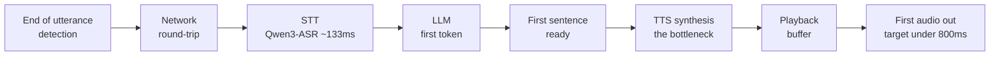

실시간 음성 에이전트를 만들어 본 사람이라면 같은 벽에 부딪힙니다. 사용자가 말을 멈추고 나서
에이전트가 첫 소리를 내기까지의 지연이 조금만 길어져도 대화가 어색해집니다. 그런데 막상 "내
스택의 어느 단계가 느린가"를 물으면 답이 쉽게 나오지 않습니다. 발화 종료 감지, 네트워크 왕복,
음성 인식(STT), LLM 첫 토큰, 음성 합성(TTS)이 사슬처럼 엮여 있고, 각 벤더의 SDK는 자기 구간의
숫자만 보여주기 때문입니다. 이 글은 그 전체 사슬을 한눈에 진단하려고 만든 공개 도구
voice-latency-budget와, 그 도구의 자가호스팅 시나리오를 실제 GPU에서 측정한 결과를 다룹니다.
이 글을 읽을 대상은 실시간 음성 에이전트를 직접 서빙하려는 인프라·AI 엔지니어입니다. 결론부터
말하면, GPU 자가호스팅에서 지연의 병목은 흔히 짐작하는 LLM이 아니라 동시성 설계와 TTS 선택에
있었습니다.

## 왜 지연 예산이라는 관점이 필요한가

사람과 사람이 대화할 때 상대의 말이 끝나고 내가 반응하기까지의 간격은 언어에 상관없이 중앙값이
약 200밀리초로 수렴한다는 연구가 있습니다(Stivers 외, 2009, PNAS). 실시간 음성 에이전트가
"사람 같다"고 느껴지려면 발화 종료부터 첫 응답 소리까지가 이 구간에 가까워야 하고, 실무에서는
서브초, 즉 800밀리초 아래를 유지하는 것을 흔한 목표로 삼습니다. 이 숫자는 벤더가 공개한 목표와도
대체로 맞습니다. Deepgram은 300밀리초 미만, Vapi는 500밀리초 미만을 이야기합니다.

문제는 이 총예산을 어떻게 나눠 쓰느냐입니다. 네트워크가 왕복 40밀리초를 먹고, STT가 300밀리초,
LLM 첫 토큰이 500밀리초를 쓰면 이미 예산이 초과됩니다. 어느 단계를 줄여야 가장 크게 이득인지
감으로 판단하기는 어렵습니다. 그래서 각 단계의 예상 지연을 넣으면 누적 타임라인과 병목, 그리고
자연스러운 대화 구간에 드는지 여부를 즉시 보여주는 계산기를 만들었습니다. 완전히 클라이언트
사이드로 동작하고, 서버도 API 키도 없으며, 입력은 브라우저를 벗어나지 않습니다. 특정 제품을
홍보하지 않는 공공재 도구를 지향했습니다.

도구는 발화 종료 감지, 네트워크 왕복, STT, LLM 첫 토큰, 첫 문장 생성, TTS 합성, 재생 버퍼의
일곱 단계를 다룹니다. 각 단계의 슬라이더 힌트에는 2025년부터 2026년까지의 공개 자료에서 뽑은
일반 범위가 붙어 있고, 병목이 그 범위를 넘으면 처방을 띄웁니다. 프리셋으로 시작점을 잡고,
비교 모드로 두 구성을 겹쳐 보고, 부하가 걸렸을 때의 대략적인 p95도 함께 보여줍니다.

일곱 단계는 사슬처럼 이어지고, 이 지연들의 총합이 목표 예산 안에 들어와야 대화가 자연스럽게 느껴집니다. 아래 흐름에서 실제로 예산을 가장 크게 잡아먹는 병목은 비스트리밍 TTS였습니다.

## 자가호스팅이라면 숫자가 어떻게 바뀌나

관리형 스트리밍 API의 지연 범위는 문서로 어느 정도 알 수 있습니다. 그러나 "우리가 실제로 쓰는
엔진을 GPU에 올리면 얼마가 나오는가"는 직접 재보지 않으면 알 수 없습니다. 그래서 우리가 로컬
MacBook에서 개발용으로 돌리던 바로 그 스택을 RunPod H200(141GB)에 올려 측정했습니다. 엔진은
STT에 Qwen3-ASR-1.7B, TTS에 VoxCPM2와 Qwen3-TTS-1.7B 두 가지, LLM에 최신 Qwen3.5-9B를 썼습니다.

비용을 아끼는 방식부터 적어 둡니다. GPU pod마다 수십 기가바이트의 모델과 CUDA 휠을 매번 새로
내려받으면 비싼 GPU가 다운로드를 기다리며 노는 시간에 요금이 붙습니다. 그래서 네트워크 볼륨 하나에
가상환경과 가중치를 딱 한 번만 내려받고(67기가바이트), GPU pod이 그 볼륨을 마운트해 재다운로드
없이 벤치했습니다. 끝나면 pod과 볼륨을 전부 삭제하도록 teardown을 finally 블록과 이름 기반
안전망으로 보장했습니다. 디버깅까지 포함한 전체 비용은 약 17달러였고 누수된 자원은 없었습니다.

## 측정 결과: 병목은 LLM도 STT도 아닌 TTS였다

단일 요청 기준으로 H200에서 재본 값은 이렇습니다.

| 엔진 | 모델 | 지연(단일) | 실시간 계수(RTF) |
|---|---|---|---|
| STT | Qwen3-ASR-1.7B | 133밀리초 / 10초 오디오 | 0.013 |
| TTS | VoxCPM2 (비스트리밍) | 673밀리초 / 문장 | 0.149 |
| TTS | Qwen3-TTS-1.7B (비스트리밍) | 6778밀리초 / 문장 | 1.205 |

STT는 걱정할 단계가 아니었습니다. Qwen3-ASR가 10초 오디오를 133밀리초에 전사합니다. 실시간
계수 0.013이면 사실상 즉시입니다. 진짜 이야기는 TTS에 있었습니다. 같은 한국어 문장을 같은 H200
에서 VoxCPM2는 0.67초에, Qwen3-TTS는 6.8초에 합성했습니다. 같은 카드에서 VoxCPM2가 열 배 가까이
빠릅니다. 그리고 두 엔진 모두 비스트리밍이라는 점이 중요합니다. 문장 전체를 합성한 뒤에야 첫
소리가 나오기 때문에, VoxCPM2의 0.67초조차 "스트리밍 100밀리초 TTFA"가 아니라 "0.67초 뒤 첫
소리"입니다. 로컬 MPS에서 초 단위였던 VoxCPM2가 GPU에서 0.67초로 준 것은 맞지만, 그렇다고
스트리밍이 된 것은 아닙니다. 실시간 턴을 만들려면 스트리밍 TTS로 바꾸거나 문장을 짧게 쪼개
합성해야 합니다. 이 도구를 만든 이유가 바로 이 지점을 숫자로 보이게 하려는 것이었습니다.

## 정직한 공백: LLM은 이 호스트에서 막혔다

Qwen3.5-9B의 vLLM 서빙 수치는 이번에 얻지 못했습니다. 원인은 성능이 아니라 인프라 버전 불일치
였습니다. 2026년 7월 기준 최신 vLLM은 CUDA 13용 torch를 당겨오는데, 우리가 배정받은 H200 호스트의
드라이버가 CUDA 12.8이라 "드라이버가 너무 낡았다"며 엔진이 뜨지 않았습니다. torch를 12.8용으로
낮추면 이번엔 vLLM의 컴파일된 연산이 깨졌고, transformers로 우회하니 멀티모달 생성 경로에서
에러가 났습니다. 엔진마다 요구하는 torch가 달라 하나를 맞추면 다른 하나가 깨지는 전형적인
의존성 충돌입니다. 깨끗한 vLLM 수치를 얻으려면 CUDA 13 드라이버가 깔린 호스트가 필요합니다.
계산기의 LLM 슬라이더에는 추정치를 넣고 추정임을 명시했습니다. 최신 모델을 최신 스택으로
서빙하려다 구형 드라이버에 걸리는 것도 자가호스팅의 현실적인 함정이라, 감추기보다 그대로 적어
둡니다.

## 어떻게 셋팅해서 서비스할까

측정을 레시피로 옮기면 이렇게 됩니다. STT는 Qwen3-ASR로 충분하니 그대로 두고, TTS는 두 엔진
중 열 배 빠른 VoxCPM2를 택하되 스트리밍이나 문장 청크로 첫 소리를 앞당깁니다. Qwen3-TTS의
비스트리밍 6.8초는 실시간 턴에 그대로 쓸 수 없습니다. LLM은 CUDA 13 드라이버 호스트에서 vLLM으로
올립니다. 세 엔진을 같은 노드에 두어 네트워크 홉을 없애고, 첫 문장이 나오는 즉시 TTS를 시작하는
문장 단위 스트리밍을 씁니다. 우리 로컬 MacBook 스택은 개발용이지 서빙 시스템이 아니며, 계산기의
로컬 프리셋도 "실시간 부적합 사례"로 명시해 두었습니다.

이 과정은 재현 가능하게 공개했습니다. 계산기는 브라우저에서 바로 열 수 있고, 벤치 하네스는 볼륨
생성부터 다운로드, GPU 벤치, 전체 삭제까지를 한 스크립트로 묶었습니다. 실측 결과 JSON과 서빙
가이드도 저장소에 정리해 두었습니다. 자가호스팅 음성 스택의 지연을 감이 아니라 숫자로 이야기하고
싶은 분들에게 출발점이 되기를 바랍니다.

- 계산기: [voice-latency-budget](https://sylvanus4.github.io/voice-latency-budget/)
- 저장소와 벤치 하네스, 서빙 가이드: [github.com/sylvanus4/voice-latency-budget](https://github.com/sylvanus4/voice-latency-budget)
