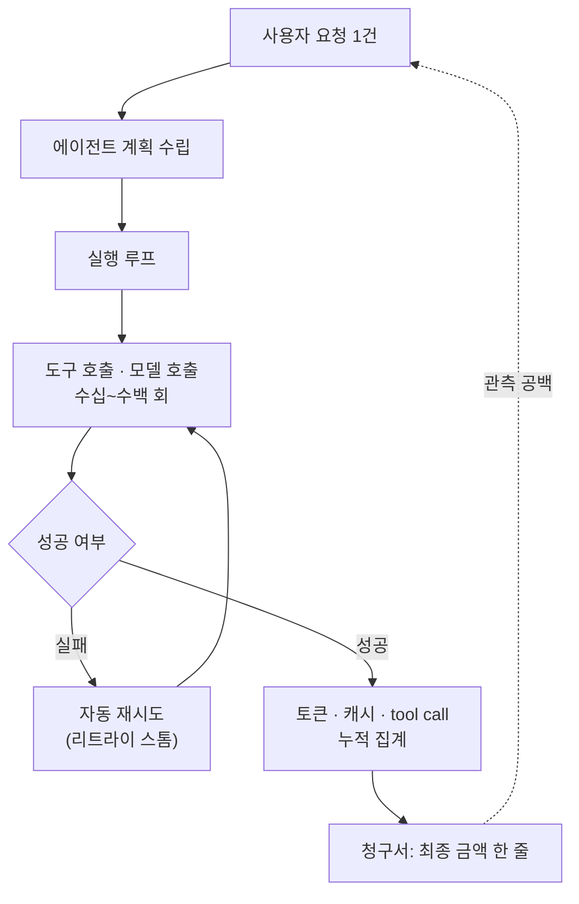

이 글은 조직에 Claude Code나 AI 에이전트를 도입하려는 플랫폼·인프라 담당자, 그리고 다음 달 AI 청구서를 설명해야 하는 재무·구매 담당자를 위해 썼습니다. 결론을 먼저 말씀드리면, 최근 한 달 동안 쏟아진 AI 비용 뉴스는 "AI가 비싸다"는 이야기가 아닙니다. 진짜 문제는 **청구서가 무엇에 대한 것인지 설명해 주지 않는다**는 데 있습니다. 한 번의 사용자 요청이 수십에서 수백 번의 모델 호출과 도구 실행, 그리고 실패 시 자동 재시도로 번지는 에이전트 구조에서, 최종 금액만으로는 어느 루프에서 돈이 샜는지 알 수가 없습니다. 저희는 이 관측 공백이야말로 지금 시장이 겪는 통증의 핵심이라고 봅니다.

## 개요

2026년 6월 말부터 7월까지의 뉴스를 한 줄로 요약하면 이렇습니다. 프런티어 모델을 모든 작업에 무차별로 쓰면 비용을 감당하기 어렵고, 그 비용이 어디서 발생했는지조차 추적하기 어렵다는 것입니다. 사건은 극적인 형태로 드러났습니다. 국내 한 사용자에게 처음 약 25억 원, 이후 약 250억 원의 결제가 시도됐습니다. 다행히 카드 한도 초과로 실제 출금은 없었지만, 비정상적인 금액이 표시 오류를 넘어 카드 승인 요청 단계까지 반복해서 전달됐다는 점이 사건의 무게를 다르게 만듭니다.

같은 시기, 다른 층위의 뉴스도 이어졌습니다. AI 비용 감사 업체가 기업 60곳의 청구서를 검토해 상당한 과다 청구를 주장했고, 여러 대기업이 프런티어 모델 사용을 조건에 따라 저가 모델로 분산하기 시작했으며, 미국·유럽 기업들이 비용을 이유로 중국 오픈웨이트 모델로 옮겨 갔다는 보도가 나왔습니다. 흥미롭게도 모델 공급사 스스로도 "모든 작업에 최고 성능 모델을 오래 돌리는 방식은 지속 가능하지 않다"는 취지로 대응하기 시작했습니다. 여러 방향의 뉴스가 같은 지점을 가리키고 있었습니다.

## 지난 한 달, 무슨 일이 있었나

가장 먼저 눈에 띈 것은 청구 시스템의 신뢰성 문제였습니다. 지디넷코리아 보도에 따르면, 국내 대학생 이용자에게 발생한 청구액은 약 166만 달러에서 시작해 열 배 규모인 약 1,662만 달러까지 늘어났습니다. 앤트로픽은 이후 답변에서 자동 충전 금액이 비정상적으로 높게 설정된 오류였다고 설명했지만, 당사자는 자동 충전 기능을 설정한 적이 없다고 밝혀 설정이 왜 생성됐는지는 여전히 명확하지 않습니다. 사용자가 여러 부서에 열다섯 통 넘는 메일을 보낸 뒤 나흘이 지나서야 자동 응답을 받았다는 대목은 기술 오류보다 대응 체계의 공백을 더 선명하게 보여 줍니다.

두 번째는 에이전트 비용의 관측 가능성 문제였습니다. AI타임스와 디인포메이션 보도에 따르면, 비용 감사 스타트업 보디트(Vaudit)는 기업 60곳의 약 3,400만 달러 청구서를 검토해 약 170만 달러를 과다 청구로 판단했다고 밝혔습니다. 검토 대상의 상당 부분은 Claude Code 사용 내역이었고, 파나소닉·HP·혼다 등이 고객사로 언급됐습니다. 이 업체가 주장한 유형은 저가 모델을 썼는데 고가 모델 요금으로 기록되거나, 작업을 완료하지 못했는데 비용이 발생하거나, 오류 후 자동 재시도가 반복되는 이른바 **리트라이 스톰(retry storm)**이었습니다. 여기서 짚어 둘 점이 두 가지 있습니다. 첫째, 앤트로픽은 완료되지 않은 요청이나 오류 응답에 비용을 청구하지 않으며 광범위한 과다 청구 증거도 없다고 반박했습니다. 둘째, 보디트는 환불 성공액의 일부를 수수료로 받는 상업적 감사 업체이므로, 이 수치는 독립 회계감사가 아니라 한쪽 당사자의 조사 결과로 읽는 것이 정확합니다. 즉 지금은 감사 업체의 주장과 공급사의 부인이 맞서는 국면입니다.

세 번째는 시장의 반응이었습니다. 디인포메이션은 기업들이 단순 분류·요약·변환 같은 작업은 저가 모델로, 복잡한 코딩·에이전트 작업은 프런티어 모델로, 반복적인 대량 작업은 오픈웨이트 또는 자체 호스팅 모델로 분리하기 시작했다고 보도했습니다. 파이낸셜타임스는 도어대시·지멘스·에어비앤비 등이 비용 절감을 위해 딥시크나 문샷 계열 모델을 도입했다고 전했습니다. 비즈니스인사이더 보도에서는 앤트로픽의 플랫폼 책임자들조차 부서별로 제각각 도입하는 이른바 **섀도 IT** 때문에 일부 기업의 AI 비용이 폭증했다고 인정하면서도, 사용 중단이나 일괄 예산 상한이 아니라 작업별 모델 선택과 조직 차원의 중앙 비용 관리가 필요하다고 주장했습니다. 요금 정책 자체도 자주 바뀌었습니다. 최신 고성능 모델의 구독 포함 여부와 종량제 전환 시점이 여러 차례 조정됐고, 프로모션 종료 시점이 반복해서 연장됐습니다. 실제로 Claude Fable 5 무료 제공이 7월 19일까지 연장됐다는 보도도 있었습니다. 성능보다 다음 달 비용을 예측하기 어렵다는 점이 구매 담당자에게는 더 큰 골칫거리였습니다.

## 에이전트 비용은 왜 관측되지 않는가

세 갈래의 뉴스를 관통하는 공통 원인은 결국 하나입니다. 에이전트 워크로드에서는 사용자가 보는 것과 청구서가 기록하는 것 사이의 거리가 너무 멀어졌습니다. 전통적인 API 호출은 요청 한 번에 응답 한 번, 비용 한 줄이었습니다. 반면 코딩 에이전트나 에이전트 SDK는 한 번의 지시가 계획 수립, 도구 호출, 파일 편집, 검증, 실패 시 재시도로 확장됩니다. 이 확장은 사용자에게 보이지 않는 곳에서 일어나고, 청구서에는 그 총합만 한 줄로 찍힙니다.

이 구조에서 비용이 새는 지점은 대부분 사용자의 시야 밖에 있습니다. 재시도 루프가 조용히 돌면서 호출 수를 부풀리고, 중간 클라우드 사업자를 거치면서 실제 모델 사용량과 최종 청구 내역이 어긋나며, 자동 충전 같은 설정 하나가 잘못되면 카드 승인 단계까지 비정상 금액이 흘러갑니다. 세 뉴스는 서로 다른 사건처럼 보이지만, 전부 이 관측 공백의 다른 얼굴입니다. 그래서 개인별 월 한도를 거는 것만으로는 부족합니다. 필요한 것은 모델별 비용, 세션별 토큰, 캐시 토큰, 도구 호출 횟수, 실패와 재시도 비용, 일별 이상 증가율을 **호출이 일어나는 그 순간에** 중앙에서 붙잡는 계측 계층입니다. 관측이 없으면 통제도 없고, 통제가 없으면 청구서는 늘 사후에 놀라는 서류가 됩니다.

## ThakiCloud 제품 적용 시사점

이 문제는 ThakiCloud가 운용하는 두 제품이 각기 다른 각도에서 겨냥하는 지점입니다. 인프라 관점과 에이전트 관점이 서로를 보완하기 때문에, 이번 주제에는 두 렌즈를 함께 씁니다.

**ai-platform 렌즈, 반복 워크로드는 소유가 답입니다.** 시장이 도달한 결론은 명료합니다. 쉬운 작업까지 프런티어 모델로 처리하면 비용이 감당되지 않고, 반복적인 대량 작업은 오픈웨이트 모델을 자체 호스팅하는 편이 경제적입니다. ThakiCloud의 ai-platform은 바로 이 지점을 위한 K8s 기반 AI/ML 인프라입니다. Kueue로 GPU를 큐잉해 활용률을 끌어올리고, vLLM으로 오픈웨이트 모델을 서빙하며, 멀티테넌트 격리로 부서별 사용량을 분리해 과금합니다. 종량제 API가 예측 불가능한 청구서를 만든다면, 자체 호스팅은 고정된 GPU 비용 위에서 사용량이 늘어도 단가가 튀지 않는 구조를 만듭니다. 요금 정책이 수시로 바뀌는 외부 종량제와 달리, 온프렘·소버린 배치는 비용의 예측 가능성 자체를 자산으로 돌려줍니다. 데이터가 외부로 나가지 않는다는 점은 국내 규제·보안 요구가 큰 조직에는 별도의 가치가 됩니다.

**Paxis 렌즈, 에이전트의 모든 행동을 감사 가능하게 만듭니다.** 관측 공백의 핵심은 에이전트 루프였고, 이것은 정확히 Paxis가 다루는 영역입니다. Paxis는 ai-platform 위에서 도는 ThakiCloud의 Agent-Native Cloud 제어 평면으로, Skills·Tools·Policies·Audit Logs를 일급 리소스로 취급합니다. 에이전트가 어떤 스킬을 어떤 도구로 몇 번 호출했는지, 어느 샌드박스에서 실행했는지가 전부 감사 로그로 남습니다. 이 구조에서는 리트라이 스톰이 조용히 청구서를 부풀리는 대신, 재시도 루프가 감사 로그에 그대로 드러나고 정책 게이트가 임계를 넘는 호출을 차단합니다. 960개가 넘는 스킬을 BM25로 선택해 격리 샌드박스에서 실행하고 모든 행동을 정책과 감사로 통과시키는 설계는, "청구서만 보고 어느 루프에서 비용이 났는지 확인하기 어렵다"는 바로 그 문제에 대한 구조적 답입니다. 저비용 서빙(ai-platform)이 에이전트를 경제적으로 만들고, 행동 단위 관측(Paxis)이 그 경제성을 예측 가능하게 만듭니다. 두 렌즈는 이렇게 맞물립니다.

## 한계 및 반론

균형을 위해 반대편도 분명히 해 두겠습니다. 첫째, 프런티어 모델이 무조건 낭비인 것은 아닙니다. 월스트리트저널 보도에 따르면 쇼피파이 같은 기업은 복잡한 코딩과 다단계 에이전트 작업에서 프런티어 모델이 엔지니어의 시간을 아껴 준다면 높은 가격도 정당화될 수 있다고 봅니다. 반대로 스포티파이나 트윌리오는 소폭의 성능 향상이 추가 비용을 정당화하는지 신중하게 따지고 있습니다. 즉 답은 "프런티어를 버리라"가 아니라 "작업 난이도에 따라 나누라"입니다. 자체 호스팅도 만능이 아닙니다. 최고 난도의 추론이 필요한 작업까지 오픈웨이트로 내리면 품질이 떨어지고, GPU 운영·모델 업데이트·보안 패치라는 새로운 운영 부담이 생깁니다.

둘째, 이 글에 인용한 과다 청구 수치는 확정된 사실이 아닙니다. 보디트의 주장은 상업적 감사 업체의 발표이고 앤트로픽은 이를 부인했으므로, 현재로서는 양측의 입장이 맞서는 상태로 읽는 것이 정확합니다. 250억 원 청구 사건 역시 실제 출금은 이뤄지지 않았고, 자동 충전 설정이 왜 생성됐는지에 대한 기술적 설명은 아직 공개되지 않았습니다. 저희가 이 뉴스에서 끌어내는 결론은 특정 공급사를 겨냥하는 것이 아니라, 에이전트 시대에는 어느 공급사를 쓰든 비용 관측성과 거버넌스를 사용자 쪽에서 확보해야 한다는 원칙입니다. 좋은 모델을 고르는 문제와 그 모델을 다스리는 문제는 별개이고, 최근 한 달의 뉴스는 후자가 그동안 비어 있었다는 사실을 드러냈을 뿐입니다.

## 출처

- [지디넷코리아, "250억원 결제 요청 받은 국내 이용자…앤트로픽 빌링 오류 논란" (2026-07-09)](https://zdnet.co.kr/view/?no=20260709165452)
- [지디넷코리아, "250억원 청구한 앤트로픽, 알고 보니 자동 충전 설정 오류" (2026-07-16)](https://zdnet.co.kr/view/?no=20260716093004)
- [AI타임스, "앤트로픽, 'AI 비용 과다 청구' 논란…실패한 작업도 돈 받았다" (2026-06)](https://www.aitimes.com/news/articleView.html?idxno=212155)
- [The Information, 기업의 AI 비용 통제와 모델 분산 도입 보도 (2026-06-23)](https://www.theinformation.com/titv/fedld)
- [Financial Times, "Companies turn to Chinese AI models to cut costs" (2026-07)](https://www.ft.com/content/9c8ff45b-7c20-4c2e-93c9-c52339ffdcee)
- [Business Insider, "Anthropic Official Warns Against 'Wrong' AI Cost Response" (2026-07-15)](https://www.businessinsider.com/anthropic-ai-costs-responses-routers-2026-7)
- [The Wall Street Journal, "Meet the Companies Shelling Out for Top AI Models" (2026-07)](https://www.wsj.com/cio-journal/meet-the-companies-shelling-out-for-top-ai-models-e1fe3375)
