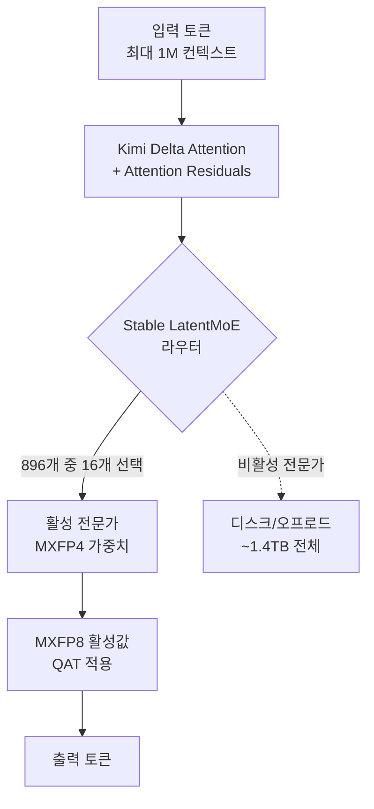

새 모델이 나올 때마다 가장 먼저 눈에 들어오는 것은 표 한 장입니다. 벤치마크 점수가 나란히 찍힌 그 표를 보고 우리는 "이 모델이 그 모델보다 낫다"고 빠르게 결론을 내립니다. 그런데 2026년 7월, Moonshot AI가 오픈웨이트 역사상 가장 큰 모델인 Kimi K3를 공개하자마자 이 습관에 제동을 거는 논쟁이 함께 터졌습니다. 점수는 분명히 최상위권인데, 곧바로 "벤치마크에 과적합된 것 아니냐"는 의심이 따라붙은 것입니다.

이 글은 Kimi K3가 무엇인지 확인된 사실로 짚은 다음, 화려한 점수판을 어떻게 읽어야 하는지, 그리고 운영자가 이 모델을 실제 제품에 넣기 전에 무엇을 검증해야 하는지로 이어집니다. ThakiCloud처럼 여러 고객 환경에서 모델을 서빙하고 운용하는 인프라 회사에게 이 질문은 학술적 호기심이 아니라 도입 의사결정 그 자체입니다. 점수 한 줄을 믿고 2.8조 파라미터짜리 모델을 온프렘에 올렸다가 실제 업무에서 기대에 못 미치면, 그 비용은 고스란히 우리와 고객이 떠안기 때문입니다.

## Kimi K3는 무엇인가

Kimi K3는 Moonshot AI가 2026년 7월 16일 공개한 대규모 Mixture-of-Experts(MoE) 모델입니다. 전체 파라미터는 2.8조 개로, 오픈웨이트로 공개되는 모델 가운데 처음으로 3조 파라미터 급에 들어섰습니다. 다만 이 2.8조은 전체 크기이고, 실제 추론에서는 896개 전문가(expert) 가운데 16개만 활성화하는 희소(sparse) 구조라 매 토큰마다 전체 파라미터가 다 도는 것은 아닙니다. 이 점을 놓치면 "2.8조을 통째로 돌린다"는 오해로 이어지기 쉽습니다.

아키텍처에는 여러 새 요소가 들어갔습니다. Moonshot은 이를 Stable LatentMoE 프레임워크라고 부르며, Kimi Delta Attention(KDA)과 Attention Residuals(AttnRes)를 통해 100만 토큰 컨텍스트를 지원한다고 설명합니다. 여기에 전문가 배분을 위한 Quantile Balancing, Per-Head Muon 최적화, SiTU 활성화, Gated MLA 같은 구성 요소가 더해졌습니다. 회사는 이런 개선이 전작 K2 대비 약 2.5배의 스케일링 효율 향상으로 이어졌다고 주장합니다. 이 수치는 발표자 주장이므로, 제3자 재현이 나오기 전까지는 참고치로 읽는 편이 안전합니다.

서빙 관점에서 가장 실무적인 부분은 양자화입니다. K3는 가중치를 MXFP4, 활성값을 MXFP8로 다루며, 지도 미세조정(SFT) 단계부터 양자화 인식 학습(QAT)을 적용했습니다. 그 결과 전체 2.8조 모델의 가중치 저장 용량이 약 1.4TB로, FP16 가중치가 요구했을 약 5.6TB의 4분의 1 수준으로 줄었습니다. 그래도 1.4TB는 여전히 큰 숫자입니다. 완전한 가중치는 7월 27일 수정된 MIT 라이선스로 공개될 예정입니다.

아래는 K3의 추론 경로를 단순화한 그림입니다.

## 벤치마크가 말하는 것

점수만 보면 Kimi K3는 확실히 인상적입니다. 공개 시점에 K3는 GPQA Diamond에서 93.5%를 기록했는데, 이는 당시 공개된 오픈웨이트 모델 가운데 가장 높은 결과였습니다. Terminal-Bench 2.1에서는 88.3%를 받았고, 지속적인 코딩 세션을 측정하는 SWE Marathon과 Program Bench, 그리고 BrowseComp, OmniDocBench에서 선두에 올랐습니다. 긴 호흡의 에이전트 작업과 코딩에서 특히 강점을 보인다는 해석이 가능합니다.

다만 모든 지표에서 1등은 아닙니다. K3는 FrontierSWE와 HLE-Full에서는 Anthropic의 Fable 5에 뒤졌고, 까다로운 에이전트·코딩 종합 평가에서는 Fable 5와 GPT-5.6 Sol에 이어 3위 정도의 위치로 평가됩니다. 정리하면 아래와 같습니다.

| 벤치마크 | Kimi K3 위치 | 비고 |
|---|---|---|
| GPQA Diamond | 93.5% | 공개 시점 오픈웨이트 최고 |
| Terminal-Bench 2.1 | 88.3% | 터미널 에이전트 작업 |
| SWE Marathon / Program Bench | 선두 | 장기 코딩 세션 강점 |
| BrowseComp / OmniDocBench | 선두 | 브라우징·문서 이해 |
| FrontierSWE / HLE-Full | Fable 5에 뒤짐 | 최상위 난도에서 격차 |
| 종합 에이전트·코딩 | 3위권 | Fable 5·GPT-5.6 Sol 뒤 |

시장은 이 발표에 민감하게 반응했습니다. 여러 매체는 K3 공개 직후를 두고 과거 DeepSeek 충격에 빗대며, 중국발 초대형 오픈 모델이 미국 반도체 관련 종목에 압력을 줬다고 보도했습니다. 즉 이 모델은 기술 문서 안의 사건이 아니라 자본시장이 반응하는 사건이었습니다.

## 그런데 벤치마크를 믿어도 될까

여기서부터가 이 글의 본론입니다. 점수가 높다는 사실과 그 점수가 우리 업무에서 재현된다는 사실은 다른 이야기입니다. K3 공개 직후 X에서는 "Moonshot이 벤치마크에 과적합한 것 아니냐"는 의견이 돌았습니다. Vercel의 Guillermo Rauch는 내부 평가를 근거로 K3가 사이버 보안 과제에서 최상위급이며 "겉으로 드러난 점수 밖의 원초적 지능(raw IQ)"을 보인다고 언급했는데, 이는 공개 벤치마크가 아니라 자체 평가에 기댄 주장이라는 점에서 오히려 흥미롭습니다. 공개 리더보드 점수와 비공개 평가 결과가 갈릴 수 있다는 신호이기 때문입니다.

보안·평가 업계에서도 비슷한 지적이 나왔습니다. 한 매체는 Kimi K3 사례가 AI 벤치마크 리더보드의 한계를 드러낸다고 짚었습니다. 리더보드 점수는 특정 테스트셋에 대한 최적화를 유도하기 쉽고, 학습 데이터에 벤치마크와 유사한 분포가 섞이면 실제 일반화 능력보다 점수가 부풀려질 수 있습니다. 개발자 Simon Willison은 널리 쓰이는 표준 벤치마크 대신 "펠리컨을 그려보라" 같은 비표준 과제로 모델을 흔들어 보는 방식이 여전히 유효하다고 지적했는데, 이는 공개 벤치마크가 오염되기 쉬운 상황에서 held-out 평가의 가치를 다시 강조하는 대목입니다.

과적합 의심이 곧 부정행위를 뜻하는 것은 아닙니다. 초대형 모델이 특정 능력에서 실제로 강할 수도 있습니다. 요점은 다릅니다. 공개 점수만으로는 그것이 진짜 일반화인지, 아니면 리더보드에 맞춰 다듬은 결과인지 우리가 구분할 수 없다는 것입니다. 그리고 이 구분은 모델을 실제 제품에 넣는 순간 비용으로 되돌아옵니다.

## 운영자는 무엇을 검증해야 하는가

그래서 도입 판단은 리더보드가 아니라 우리 손에 있는 held-out 평가에서 나와야 합니다. 실무적으로는 다음 순서를 권합니다.

첫째, 우리 도메인의 실제 과제로 만든 비공개 평가셋을 준비합니다. 고객 데이터에서 뽑되 학습에 노출되지 않았을 자료여야 하며, 정답과 채점 기준을 우리가 소유해야 합니다. 공개 벤치마크는 참고용 상한선일 뿐입니다.

둘째, 같은 하네스에서 후보 모델들을 나란히 돌립니다. 프롬프트, 도구, 토큰 예산, 온도 같은 조건을 통일하지 않으면 점수 차이가 모델의 실력 차이인지 세팅 차이인지 알 수 없습니다. bankinfosecurity가 짚은 리더보드의 함정도 결국 조건 불일치에서 옵니다.

셋째, 단발 정확도보다 장기 세션에서의 일관성을 봅니다. K3가 SWE Marathon에서 강했다는 사실은 유용한 힌트이지만, 그것이 우리 워크플로의 20단계짜리 작업에서도 유지되는지는 별도로 확인해야 합니다.

넷째, 실패 모드를 기록합니다. 모호한 상황에서 K3가 되묻지 않고 곧장 행동하는 경향이 관측된다는 보고가 있는데, 이런 습성은 자동화 파이프라인에서 조용한 사고로 이어질 수 있습니다. 정확도 표에는 안 잡히지만 운영에서는 치명적인 항목입니다.

## ThakiCloud 제품 적용 시사점

이 논의는 ThakiCloud의 두 제품 모두와 직접 맞닿습니다.

먼저 ai-platform 관점입니다. 1.4TB MXFP4 가중치를 온프렘에서 서빙한다는 것은 GPU 메모리와 인터커넥트, 그리고 전문가 오프로드 전략을 함께 설계해야 한다는 뜻입니다. ThakiCloud의 ai-platform은 K8s와 Kueue 기반의 GPU 스케줄링, vLLM 계열 서빙, 멀티테넌트 격리를 통해 이런 초대형 오픈 모델을 고객 환경에 올릴 수 있는 토대를 제공합니다. 국정원 요구나 데이터 주권처럼 외부 API가 애초에 선택지가 아닌 고객에게, 2.8조 파라미터 오픈 모델을 자기 인프라에서 돌린다는 선택지는 그 자체로 가치가 큽니다. 다만 앞서 강조한 대로, 어떤 모델을 서빙할지는 리더보드가 아니라 고객 도메인 평가에서 결정되어야 합니다.

다음은 Paxis 관점입니다. Paxis는 ai-platform 위에서 도는 Agent-Native Cloud 제어 평면으로, Skills·Tools·Policies·Audit Logs를 일급 리소스로 다룹니다. 모델 도입 검증이라는 이 글의 주제는 Paxis의 정책 게이트와 감사 로그가 정확히 겨냥하는 문제입니다. 새 모델을 에이전트 워크플로에 붙이기 전에 held-out 평가를 통과했는지 정책으로 강제하고, 실제 운용에서 어떤 모델이 어떤 판단을 내렸는지를 감사 로그로 남기면, "점수가 높으니 믿자"는 충동을 시스템 차원에서 억제할 수 있습니다. 벤치마크 신뢰성 문제를 사람의 규율이 아니라 플랫폼의 게이트로 옮기는 것, 그것이 Paxis가 제공하는 가치입니다.

## 한계 및 반론

이 글은 K3를 폄하하려는 것이 아닙니다. 오픈웨이트로 3조 파라미터 급 모델이 나왔고, 여러 능력 지표에서 최상위권에 올랐다는 사실 자체가 큰 진전입니다. 과적합 의심은 아직 정황이며, 완전한 가중치가 7월 27일 공개되고 독립적인 재현 평가가 쌓이면 상당 부분 해소될 수 있습니다.

반대 방향의 주장도 존중할 만합니다. "완벽한 검증을 기다리다 보면 아무 모델도 도입하지 못한다"는 반론은 현실적입니다. 그래서 이 글의 결론은 "믿지 말라"가 아니라 "리더보드를 도입 결정의 근거로 삼지 말라"입니다. 공개 점수는 후보를 추리는 필터로 쓰고, 최종 판단은 우리 도메인의 held-out 평가와 운영 관측에서 내리는 것. 초대형 오픈 모델이 몇 주 간격으로 쏟아지는 지금, 이 규율이 없으면 우리는 매번 가장 최근에 나온 점수판에 끌려다니게 됩니다.

## 출처

- [Moonshot AI Releases Kimi K3: A 2.8 Trillion Parameter Open MoE Model With Kimi Delta Attention and 1M Context - MarkTechPost](https://www.marktechpost.com/2026/07/16/moonshot-ai-releases-kimi-k3-a-2-8-trillion-parameter-open-moe-model-with-kimi-delta-attention-and-1m-context/)
- [Kimi K3 Model Overview: 2.8T Parameters, MXFP4 Quantization - Hugging Face](https://huggingface.co/blog/ResterChed/kimi-k3-model-overview-mxfp4-quantization-open-wei)
- [China's 2.8-trillion-parameter Kimi K3 - Tom's Hardware](https://www.tomshardware.com/tech-industry/artificial-intelligence/moonshot-releases-2-8-trillion-parameter-kimi-k3)
- [Kimi K3 Highlights Limits of AI Benchmark Leaderboards - BankInfoSecurity](https://www.bankinfosecurity.com/kimi-k3-highlights-limits-ai-benchmark-leaderboards-a-32264)
- [Kimi K3, and what we can still learn from the pelican benchmark - Simon Willison](https://simonwillison.net/2026/Jul/16/kimi-k3/)
- [Guillermo Rauch on internal evals (X)](https://x.com/rauchg/status/2078647648307880209)
