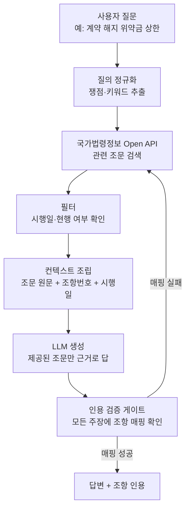

## 왜 읽어야 하나

이 글은 LLM에 법률·규정 질문을 붙이려는 개발자, 그리고 고위험 도메인의 답변 품질을 책임져야 하는 인프라 담당자를 위해 썼습니다. 결론부터 말씀드리면, 법률 질의에서 LLM이 가짜 조문을 만들어 내는 문제는 모델을 더 큰 것으로 바꿔서 풀리지 않습니다. 답을 검증된 법령 원문에 묶는 근거 기반(RAG) 설계로만 풀립니다. 법제처가 공개한 국가법령정보 Open API를 근거원으로 붙이면, 모델이 조문을 지어내는 대신 실제 조항 번호와 시행일을 인용하게 만들 수 있습니다.

## 개요

한 소셜 타임라인에서 "ChatGPT나 Claude로 법률 자문을 받고 싶은데 가짜 조문을 만들어낼까 걱정된다면 국내 법령 데이터를 쓰라"는 팁이 돌았습니다. 걱정은 근거가 있습니다. 미국에서는 ChatGPT가 자격 없이 법률 자문을 제공하도록 방치했다는 이유로 OpenAI를 상대로 한 소송이 제기됐고, 전문가들은 법적 문제를 챗봇과 그냥 상의하는 것 자체가 위험할 수 있다고 경고합니다. 모델은 문장을 그럴듯하게 완성하는 데 최적화돼 있을 뿐, 존재하지 않는 조문을 실제 조문처럼 써 내려가는 것을 스스로 막지 못하기 때문입니다.

그런데 같은 시장에서 정반대의 신호도 나옵니다. 한국에서는 Claude가 유료 생성형 AI 시장에서 ChatGPT를 처음으로 앞질렀고, 법률 스타트업 로앤컴퍼니는 Claude를 얹은 AI 법률 비서 SuperLawyer로 출시 180일 만에 국내 변호사의 약 20%에 해당하는 6,000명을 확보했다고 밝혔습니다. 같은 기술을 두고 한쪽은 위험하다 하고 다른 쪽은 실무에 안착시켰다면, 차이는 모델이 아니라 답을 다루는 설계에 있습니다. 이 글은 그 설계, 즉 LLM의 법률 답변을 검증된 원문에 묶는 근거 기반 파이프라인을 국가법령정보 Open API를 예로 들어 뜯어봅니다.

## 이 기술은 무엇인가

핵심 개념은 단순합니다. 모델에게 "법이 뭐라고 하는지 아느냐"고 묻는 대신, "이 질문에 관련된 조문을 먼저 찾아 온 뒤 그 원문만 근거로 답하라"고 시키는 것입니다. 검색이 답의 재료를 공급하고, 생성은 그 재료 안에서만 이뤄지며, 모든 주장에는 조항 번호와 시행일이라는 인용이 붙습니다. 이렇게 하면 모델이 상상으로 채우던 빈칸이 검증된 텍스트로 대체됩니다.

이때 재료의 신뢰도가 전부를 결정합니다. 아무 웹 문서나 긁어 온 법령 요약본은 개정 전 조문이거나 출처 불명일 수 있습니다. 그래서 근거원은 권위 있는 원본이어야 합니다. 법제처의 국가법령정보 공동활용 Open API는 현행 법령 본문, 조항 번호, 시행일, 개정 이력, 소관 부처를 구조화된 형태로 제공합니다. 특정 날짜 기준으로 그날 효력이 있던 법령을 조회하는 기능까지 있어서, "지금 유효한 조문"과 "당시 유효했던 조문"을 구분해 인용할 수 있습니다. 법률 질의에서 시행일 구분은 사소한 디테일이 아니라 답의 정오를 가르는 축입니다.

전체 흐름을 세로로 정리하면 다음과 같습니다.



기존 접근과의 차이는 검증 게이트에 있습니다. 단순 RAG는 검색한 문서를 프롬프트에 붙이고 답을 받는 데서 멈춥니다. 고위험 도메인에서는 여기에 한 단계를 더 얹습니다. 생성된 답의 모든 법적 주장이 실제로 검색해 온 조문에 매핑되는지 코드로 검사하고, 매핑되지 않는 주장이 하나라도 있으면 그 답을 사용자에게 내보내지 않습니다. 이 게이트가 "모델이 근거 밖에서 지어낸 문장"을 걸러 내는 마지막 방벽입니다.

## 설치 및 통합

근거원을 붙이는 첫 단계는 API 키 발급입니다. 국가법령정보 공동활용 포털(open.law.go.kr)에서 사용자 등록 후 인증키를 받습니다. 이후 조문 검색과 본문 조회는 URL 기반 호출로 이뤄지며, 공식 가이드는 Python과 Node.js를 포함한 여러 언어의 예시를 제공합니다.

아래는 특정 쟁점 키워드로 현행 법령을 조회한 뒤, 그 원문만 컨텍스트로 조립하는 최소 패턴입니다. 실제 응답 스키마와 파라미터는 포털의 활용가이드를 기준으로 삼습니다.

```python
import requests

LAW_API = "https://www.law.go.kr/DRF/lawSearch.do"

def search_statutes(keyword: str, oc_key: str) -> list[dict]:
    """국가법령정보 Open API로 현행 법령 검색. 조항 원문을 근거원으로 반환."""
    params = {
        "OC": oc_key,          # 발급받은 인증키
        "target": "law",       # 법령 검색
        "type": "JSON",
        "query": keyword,
        "display": 5,
    }
    resp = requests.get(LAW_API, params=params, timeout=10)
    resp.raise_for_status()
    return resp.json().get("LawSearch", {}).get("law", [])

def build_context(hits: list[dict]) -> str:
    """검색된 조문을 인용 가능한 컨텍스트로 조립. 시행일·소관부처를 함께 실어 근거를 명시."""
    lines = []
    for h in hits:
        lines.append(
            f"[{h.get('법령명한글')}] "
            f"시행일 {h.get('시행일자')}, 소관 {h.get('소관부처명')}\n"
            f"{h.get('법령상세링크')}"
        )
    return "\n\n".join(lines)
```

이 컨텍스트를 프롬프트에 실을 때는 지시를 분명히 못 박습니다. "아래 제공된 조문만 근거로 답하고, 제공되지 않은 조문은 인용하지 말라. 관련 조문이 없으면 없다고 답하라." 근거가 없을 때 "없다"고 말하게 만드는 지시가 환각을 막는 핵심입니다. 모델이 빈칸을 지어내는 대신 정직하게 비워 두게 하는 것입니다.

마지막으로 검증 게이트를 코드로 소유합니다. 생성된 답에서 인용된 조항 번호를 추출해, 실제로 컨텍스트에 실린 조문 목록과 대조합니다. 목록에 없는 조항을 인용했다면 그 답은 재검색 루프로 되돌립니다. 이 판정은 모델의 자기 보고가 아니라 결정론적 코드가 내려야 신뢰할 수 있습니다.

## 근거 기반 설계가 만드는 차이

직접 벤치마크를 돌려 새 수치를 만들지는 않았습니다. 대신 이미 공개된 실무 지표가 근거 기반 설계의 효과를 보여 줍니다. 로앤컴퍼니의 SuperLawyer는 Claude를 얹되 답을 판례와 법령에 묶는 방식으로 설계됐고, Anthropic이 공개한 고객 사례에 따르면 출시 180일 만에 6,000명의 변호사(국내 변호사의 약 20%)를 확보했으며, 무료에서 유료로의 전환율 60.2%, 2개월 차 재사용률 79.1%, 첫 180일 동안 누적 230만 시간 절감을 기록했습니다. 전문가가 매일 검증하는 도구에서 이 정도의 유지율이 나온다는 것은, 답이 그냥 그럴듯한 수준을 넘어 실제로 신뢰할 만했다는 신호로 읽힙니다.

반대편에는 근거 없이 법을 답하게 뒀을 때의 비용이 있습니다. 미국의 OpenAI 소송과 "법적 문제를 챗봇과 상의하지 말라"는 경고는, 근거 게이트 없는 법률 답변이 법적 책임 문제로까지 번질 수 있음을 보여 줍니다. 같은 모델이라도 원문에 묶었는가 아닌가에 따라 결과가 이렇게 갈립니다. 지표가 말하는 교훈은 명확합니다. 고위험 도메인에서 품질을 끌어올리는 지렛대는 모델 등급이 아니라 근거 설계입니다.

## ThakiCloud 제품 적용 시사점

이 패턴은 ThakiCloud의 두 제품에 자연스럽게 맞물립니다.

Paxis 관점에서 보면, 근거 기반 법률 답변은 Agent-Native Cloud가 다루는 전형적인 워크로드입니다. Paxis는 Skills, Tools, Policies, Audit Logs를 일급 리소스로 취급합니다. 법령 검색은 격리 샌드박스에서 실행되는 Tool로, 인용 검증 게이트는 답을 내보내기 전에 통과해야 하는 Policy로, 그리고 어떤 조문을 근거로 어떤 답을 냈는지는 Audit Log로 남습니다. 법률처럼 책임 소재가 중요한 도메인에서는 "왜 이렇게 답했는가"를 사후에 추적할 수 있어야 하는데, 정책 게이트와 감사 로그가 그 추적성을 기본으로 제공합니다. 모든 주장에 조항 인용을 강제하는 근거 게이트 자체를 재사용 가능한 스킬로 묶어 두면, 법률뿐 아니라 의료·금융·규정 준수처럼 원문 인용이 필요한 다른 고위험 도메인에도 그대로 옮겨 쓸 수 있습니다.

ai-platform 관점도 있습니다. 법령이나 판례 같은 데이터는 외부 API로 나가는 것 자체가 민감할 수 있고, 공공·규제 기관은 데이터 주권과 온프렘 서빙을 요구하는 경우가 많습니다. ThakiCloud의 ai-platform은 K8s와 Kueue 기반 GPU 스케줄링 위에서 모델을 멀티테넌트로 서빙하며, 자체 인프라에서 근거원과 모델을 함께 운용하도록 설계돼 있습니다. 법령 데이터를 내부에 두고 그 위에서 검색과 생성을 모두 돌리면, 근거 기반의 정확성과 데이터 주권을 동시에 지킬 수 있습니다. 낮은 서빙 비용은 이런 도메인 특화 파이프라인을 상시 운용할 수 있게 하는 전제 조건입니다.

## 한계 및 반론

근거 기반 설계가 만능은 아닙니다. 첫째, 근거원이 최신이 아니면 답도 틀립니다. 국가법령정보 데이터가 개정을 즉시 반영하더라도, 파이프라인이 캐시한 스냅샷이 오래됐다면 폐지된 조문을 인용할 수 있습니다. 시행일 필터와 정기 동기화가 뒷받침돼야 합니다. 둘째, 조문을 정확히 인용한다고 해서 그 해석이 옳다는 보장은 없습니다. 법률 자문의 본질은 조문 검색이 아니라 사안에 대한 적용이며, 그 판단은 여전히 자격 있는 전문가의 몫입니다. 이 파이프라인은 전문가를 대체하는 도구가 아니라 초안을 근거 위에 세우는 보조 도구로 봐야 합니다. 셋째, 검증 게이트가 인용 매핑만 검사한다면, 조문은 맞게 인용하되 논리를 잘못 편 답은 통과시킬 수 있습니다. 게이트는 환각의 하한선을 지킬 뿐 논증의 품질까지 보증하지는 못합니다.

## 정리

LLM에 법을 물을 때 가짜 조문이 나오는 문제는 모델의 한계가 아니라 설계의 공백입니다. 답을 검증된 원문에 묶고, 근거가 없으면 없다고 말하게 하고, 모든 주장에 인용을 강제하는 게이트를 코드로 소유하면, 같은 모델이 전혀 다른 신뢰도를 냅니다. 한국에서 Claude를 얹은 법률 도구가 실무에 안착한 것과 근거 없는 챗봇 자문이 소송으로 번진 것의 차이가 바로 여기서 갈립니다. 다음 행동은 분명합니다. 고위험 도메인에 LLM을 붙이려 한다면, 더 큰 모델을 찾기 전에 국가법령정보 Open API 같은 권위 있는 근거원을 먼저 연결하고, 인용 검증 게이트부터 세우시기 바랍니다. 지렛대는 언제나 근거 쪽에 있습니다.

## 출처

- [법제처 국가법령정보 공동활용 Open API](https://open.law.go.kr/LSO/openApi/guideList.do)
- [법제처 국가법령정보 공유서비스 (공공데이터포털)](https://www.data.go.kr/data/15000115/openapi.do)
- [Anthropic 고객 사례: Law&Company](https://www.anthropic.com/customers/law-and-company)
- [KED Global: Claude, 한국 유료 생성형 AI 시장에서 ChatGPT 추월](https://www.kedglobal.com/artificial-intelligence/newsView/ked202604270002)
- [Forbes: OpenAI 법률 자문 관련 소송](https://www.forbes.com/sites/lanceeliot/2026/03/09/landmark-lawsuit-against-openai-for-allowing-chatgpt-to-provide-legal-advice-could-be-a-huge-game-changer-for-all-ai-makers/)
