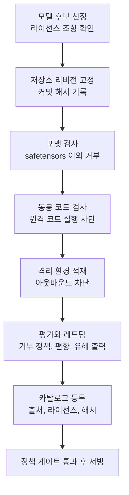

*가중치 자체보다 그것을 감싼 반입 절차가 안전을 결정한다는 구조를 형상화했습니다.*

## 왜 읽어야 하나

이 글은 온프레미스나 소버린 환경에 오픈웨이트 모델을 들여올지 결정해야 하는 MLOps 엔지니어, 플랫폼 운영자, 그리고 그 결정을 승인해야 하는 보안 담당자를 위해 썼습니다. 중국산 모델을 써도 되는지 물었을 때 정치적 인상이 아니라 절차로 답하고 싶은 분들이 대상입니다.

먼저 결론을 말씀드리겠습니다. 가중치 파일에 백도어가 심어져 있다는 통념은 기술적으로 근거가 약합니다. 그 점에서 젠슨 황의 말은 대체로 맞습니다. 다만 이것은 위험이 없다는 뜻이 아니라 위험이 다른 곳에 있다는 뜻입니다. 실제 공격면은 가중치 숫자가 아니라 그것을 감싸고 있는 로더 포맷과 저장소에 딸려 오는 파이썬 코드, 그리고 실행 환경의 네트워크 경계에 있습니다. 그래서 도입 여부는 모델의 국적이 아니라 반입 절차로 판단해야 합니다.

## 무슨 일이 있었나

2026년 7월 22일 NVIDIA의 젠슨 황 CEO가 중국산 오픈소스 모델을 두고 이례적으로 직설적인 발언을 내놨습니다. 여러 매체가 전한 발언의 요지는 이렇습니다.

미국 기업이 중국 AI 모델을 쓸 수 있어야 한다는 것이 첫 번째 주장이었습니다. 그는 중국과 연결된 백도어가 어떤 식으로든 존재한다는 것은 오해라고 말하면서, 모델을 내려받아 파인튜닝하고 원하는 방식으로 가드레일을 씌우면 된다고 설명했습니다. 중국의 오픈소스 모델이 훌륭하다는 평가도 덧붙였고, 시장이 딥시크의 영향을 처음에 잘못 읽었듯 이번 키미의 영향도 잘못 읽고 있다고 지적했습니다.

두 번째 주장은 보안 논리를 뒤집는 쪽이었습니다. 공개된 모델은 외부 연구자가 들여다보고 약점을 드러낼 수 있기 때문에 오히려 더 안전해진다는 것입니다. 그는 모든 것이 단일 모델로 수렴하면 단일한 공격 지점이자 단일한 실패 지점이 생기고 그때 세상이 훨씬 취약해진다고 말했습니다.

이 발언에는 배경이 있습니다. 같은 날 스콧 베선트 재무장관이 폭스비즈니스와의 인터뷰에서 중국 AI 모델이 미국 기업의 지식재산을 도용해 만들어졌는지 들여다보고 있다고 밝혔고, 도용이 확인되면 제재할 수단이 있다고 언급했습니다. 워싱턴이 중국 모델 차단을 검토하는 시점에 최대 수혜 기업의 CEO가 정면으로 반대 의견을 낸 셈입니다.

한편 논의의 중심에 있는 키미 K3는 문샷 AI가 7월 16일 공개한 모델입니다. 전체 파라미터 2.8조 규모의 혼합 전문가 구조로, 896개 전문가 중 16개를 활성화하는 방식이며 100만 토큰 문맥과 멀티모달 입력을 지원합니다. 가중치는 수정 MIT 라이선스로 7월 27일까지 공개하겠다고 예고됐습니다.

## 백도어는 없다는 말은 어디까지 맞나

이 대목을 정확히 나눠 봐야 합니다.

가중치 파일 자체는 숫자 텐서의 집합입니다. safetensors 포맷은 텐서의 이름과 자료형, 모양, 바이트 오프셋만 담는 직렬화 형식이고 실행 가능한 코드를 담을 수 없습니다. 이 포맷으로 배포된 가중치를 읽어 들이는 행위만으로는 임의 코드가 실행되지 않습니다. 여기까지는 발언이 정확합니다. 모델이 스스로 외부와 통신하는 기능 같은 것은 파라미터에 넣을 수 없습니다.

문제는 그 주변입니다.

첫째, 포맷입니다. 예전 방식인 파이토치 pickle 기반 파일은 역직렬화 과정에서 임의 코드를 실행할 수 있습니다. 이 위험은 모델의 국적과 무관하며 오래전부터 알려져 있습니다. 그래서 safetensors 이외의 가중치 파일은 받지 않는 것이 첫 번째 방어선이 됩니다.

둘째, 저장소에 함께 담기는 파이썬 코드입니다. 새로운 아키텍처는 라이브러리 본체가 아직 지원하지 않는 경우가 많아 모델 저장소가 자체 모델링 코드를 포함하고, 이를 쓰려면 원격 코드 실행을 허용하는 옵션을 켜야 합니다. 이 옵션을 켜는 순간 저장소에 들어 있는 임의의 파이썬 파일이 여러분의 추론 서버 프로세스에서 실행됩니다. 진짜 공격면은 여기입니다. 가중치를 의심할 것이 아니라 이 옵션을 의심해야 합니다.

셋째, 실행 환경입니다. 모델이 통신하지 못하더라도 그 모델을 감싼 컨테이너 이미지와 추론 서버, 그 서버가 열어 둔 아웃바운드 경로는 통신할 수 있습니다. 데이터 유출은 파라미터가 아니라 네트워크 경계에서 일어납니다. 반대로 말하면 아웃바운드가 차단된 격리 환경에서는 이 경로가 구조적으로 닫힙니다.

정리하면 황의 주장은 첫 번째 층위에서 맞고, 두 번째와 세 번째 층위를 다루지 않았습니다. 그리고 실무에서 사고가 나는 곳은 대부분 두 번째와 세 번째입니다.

## 백도어가 아닌, 남아 있는 진짜 리스크

공급망 무결성이 첫 번째입니다. 어느 저장소의 어느 리비전을 받았는지 고정하지 않으면 같은 이름의 모델이 시간이 지나 다른 내용으로 바뀔 수 있습니다. 커밋 해시로 고정하고 파일 체크섬을 기록해 두는 절차가 없다면 재현도 안 되고 감사도 안 됩니다.

안전장치의 상태가 두 번째입니다. 오픈웨이트 생태계에서는 원본보다 파생 모델이 훨씬 빠르게 늘어납니다. 파인튜닝 과정에서 거부 정책과 안전장치가 약해지거나 통째로 벗겨지는 일이 흔하고, 그렇게 만들어진 체크포인트가 원본과 비슷한 이름으로 유통됩니다. 국적보다 훨씬 현실적인 위험입니다. 실제로 최근에는 대형 상용 모델의 출력을 대량으로 수집해 파생 모델을 학습시켰다는 증류 논란이 이어졌고, 이런 경로로 만들어진 모델은 원본이 갖고 있던 안전 계층을 물려받지 못합니다.

법적이고 정책적인 변수가 세 번째입니다. 라이선스 조항을 실제로 읽어야 하고, 지식재산 출처를 둘러싼 분쟁이 제재로 이어질 가능성도 계산에 넣어야 합니다. 이 항목은 기술로 통제할 수 없으므로 모델을 교체할 수 있는 구조를 미리 갖추는 것이 유일한 대비책입니다. 특정 모델에 파이프라인을 고착시키지 않는 설계가 곧 정책 리스크 헤지가 됩니다.

## 온프레미스 반입 절차

위 분석을 실행 가능한 순서로 옮기면 다음과 같습니다.



*국적을 묻는 대신 이 여덟 단계를 통과했는지 묻습니다.*

내려받는 단계에서는 리비전을 고정하고 포맷을 제한합니다. 허깅페이스 CLI는 특정 커밋을 지정하고 받을 파일 패턴을 한정할 수 있으므로, pickle 계열 파일을 애초에 가져오지 않도록 막을 수 있습니다.

```bash
hf download <org>/<model> \
  --revision <commit-sha> \
  --include "*.safetensors" "*.json" "tokenizer*" \
  --local-dir /srv/models/<model>
```

받은 뒤에는 pickle 계열 파일이 섞여 들어오지 않았는지 확인하고, 파일 목록의 해시를 기록해 둡니다.

```bash
find /srv/models/<model> -name "*.bin" -o -name "*.pt" -o -name "*.pkl"
sha256sum /srv/models/<model>/*.safetensors > /srv/models/<model>/SHA256SUMS
```

서빙 단계에서는 원격 코드 실행 옵션을 켜지 않는 것이 원칙입니다. 추론 서버가 해당 아키텍처를 정식으로 지원할 때까지 기다리거나, 정말 필요하다면 동봉된 모델링 코드를 직접 읽고 검토한 뒤 저장소를 내부로 포크해 고정된 사본을 씁니다. 새 아키텍처를 급하게 띄우느라 이 옵션을 습관처럼 켜 두는 것이 가장 흔한 실수입니다.

```bash
# 원격 코드 실행을 켜지 않은 상태로 기동합니다
vllm serve /srv/models/<model> \
  --served-model-name <alias> \
  --tensor-parallel-size 8
```

마지막으로 실행 환경을 격리합니다. 추론 파드에서 외부로 나가는 트래픽을 기본 차단하고 필요한 목적지만 허용하면, 설령 어딘가에 문제가 있어도 데이터가 밖으로 나가지 못합니다. 쿠버네티스에서는 네트워크 정책으로 이 경계를 코드로 고정할 수 있습니다.

## 들여온 다음에 무엇을 재야 하나

반입이 끝났다고 검증이 끝난 것은 아닙니다. 여기서 많은 팀이 표준 벤치마크 점수만 확인하고 넘어가는데, 공개된 리더보드 점수는 도입 판단에 필요한 정보의 절반도 알려주지 않습니다. 오픈웨이트 모델을 실제 서비스에 붙이기 전에 최소한 네 가지는 자체 데이터로 재야 합니다.

첫째는 거부 정책의 모양입니다. 같은 유해 요청에 대해 모델이 어디서 멈추고 어디서 응답하는지는 파인튜닝 이력에 따라 크게 달라집니다. 원본 모델과 파생 모델을 같은 프롬프트 세트로 나란히 돌려보면 안전 계층이 얼마나 남아 있는지 드러납니다. 파생 모델이 원본보다 훨씬 잘 응답한다면 성능이 좋아진 것이 아니라 안전장치가 벗겨진 것일 수 있습니다.

둘째는 언어와 도메인 편차입니다. 다국어를 지원한다고 표기된 모델도 한국어 업무 문서나 국내 규정 용어에서는 품질이 급격히 떨어지는 경우가 많습니다. 영어 기준 벤치마크가 높다는 이유로 도입했다가 실제 트래픽에서 실망하는 전형적인 경로입니다. 자사 데이터로 만든 소규모 평가 세트가 공개 벤치마크보다 훨씬 유용합니다.

셋째는 정치적으로 민감한 주제에 대한 응답 성향입니다. 국가나 기업이 학습 단계에서 넣은 성향은 시스템 프롬프트로 완전히 덮이지 않습니다. 고객 대면 서비스라면 이 성향이 그대로 브랜드 리스크가 되므로, 도입 전에 해당 영역의 응답을 샘플링해 확인하고 필요하면 출력 필터를 별도로 둬야 합니다.

넷째는 실제 하드웨어에서의 처리량입니다. 대형 혼합 전문가 모델은 파라미터 총량과 활성 파라미터가 크게 다르기 때문에, 메모리 요구량과 실효 처리량을 발표 스펙만으로 추정하기 어렵습니다. 목표 동시 요청 수와 문맥 길이를 정해 두고 자사 GPU 구성에서 직접 측정해야 도입 비용을 말할 수 있습니다.

## ThakiCloud 제품 적용 시사점

저희가 이 문제를 다루는 방식은 두 층으로 나뉩니다.

ai-platform 층에서는 실행 자체를 통제합니다. 쿠버네티스 위에서 모델 서빙 워크로드를 네임스페이스 단위로 격리하고, 네트워크 정책으로 아웃바운드를 기본 차단하며, vLLM 기반 서빙 구성을 표준화해 각 팀이 임의로 원격 코드 실행 옵션을 켜지 못하게 합니다. 온프레미스와 소버린 환경을 전제로 설계했기 때문에 데이터가 국경을 넘지 않는다는 조건이 배포 형상 자체에 들어 있습니다. 규제 산업 고객에게 중국산이든 미국산이든 특정 모델을 쓸 수 있다고 말하려면 이 조건이 먼저 성립해야 합니다.

Paxis 층에서는 무엇을 들여올지와 무엇을 실행할지를 통제합니다. Paxis는 ThakiCloud의 에이전트 네이티브 클라우드로, 스킬과 도구, 정책, 감사 로그를 일급 리소스로 다룹니다. 모델 카탈로그는 출처와 라이선스, 리비전 해시를 함께 보관해 위 반입 절차의 마지막 두 단계를 시스템으로 강제합니다. 정책 게이트는 검증되지 않은 체크포인트가 에이전트 실행 경로에 끼어드는 것을 막고, 감사 로그는 어떤 모델이 언제 무엇을 했는지 사후에 추적할 수 있게 합니다. 모델을 교체할 수 있는 구조 역시 여기서 나옵니다. 작업마다 적합한 모델을 고르는 선택권이 있으면 정책 환경이 바뀌어도 파이프라인을 통째로 다시 만들 필요가 없습니다.

## 한계 및 반론

이 글의 주장에도 약점이 있습니다.

절차만으로 잡히지 않는 위험이 남습니다. 학습 데이터에 심어진 트리거로 특정 입력에서만 다르게 반응하도록 만드는 백도어는 파일 포맷 검사로 걸러지지 않습니다. 이런 유형은 현재의 공개 평가로 완전히 검출하기 어렵고, 이 글이 제시한 체크리스트도 그 부분까지 보장하지 않습니다. 다만 이 위험 역시 특정 국가의 모델에만 있는 것이 아니라 출처를 검증하지 않은 모든 체크포인트에 공통으로 존재합니다.

반대 방향의 반론도 있습니다. 위험이 관리 가능하다는 이유로 도입을 서두를 필요는 없다는 지적입니다. 조직에 따라서는 국산 모델이나 검증된 상용 모델만 쓰는 편이 총비용 측면에서 합리적일 수 있고, 특히 조달 요건에 원산지 제약이 걸려 있다면 기술적 안전성 논의 자체가 무의미해집니다. 이 글은 쓰라는 권유가 아니라 쓸지 말지를 판단할 기준을 제시하는 데 목적이 있습니다.

마지막으로 발언 자체의 이해관계를 감안해야 합니다. 오픈웨이트 모델이 널리 쓰일수록 가속기 수요가 늘어나는 위치에 있는 인물의 주장이며, 실제로 그는 개방형 모델이 산업 전체에 이롭고 그만큼 컴퓨팅 수요가 커진다고 말했습니다. 논리가 타당한 것과 화자가 중립적인 것은 별개입니다.

## 정리

젠슨 황의 발언에서 취할 것과 버릴 것을 나누면 이렇습니다. 가중치 파일 자체에 통신하는 백도어가 있다는 통념은 근거가 약하다는 지적은 받아들일 만합니다. 반면 내려받아 파인튜닝하고 가드레일을 씌우면 된다는 요약은 실제 반입 과정에서 확인해야 할 항목을 지나치게 단순화합니다.

실무자가 가져갈 기준은 하나입니다. 모델의 국적을 묻는 대신 반입 절차를 통과했는지 물으십시오. safetensors만 받았는지, 리비전을 해시로 고정했는지, 원격 코드 실행을 켜지 않았는지, 아웃바운드가 차단된 환경에서 도는지, 출처와 라이선스가 카탈로그에 기록됐는지 이 다섯 가지에 답할 수 있으면 그 모델은 어느 나라에서 왔든 통제 가능한 자산입니다. 답할 수 없다면 미국산이어도 마찬가지로 위험합니다.

## 참고 자료

- Axios, [Exclusive: Nvidia's Jensen Huang defends Chinese AI amid Kimi panic](https://www.axios.com/2026/07/22/nvidia-jensen-huang-china-open-source-ai)
- Fortune, [As Washington panics about Chinese AI, Jensen Huang says open-source models like Kimi are 'excellent' and should be embraced, not banned](https://fortune.com/2026/07/22/jensen-huang-chinese-open-source-ai-models-kimi-deepseek-washington-ban-nvidia-chips-data-centers-security/)
- Cybernews, [Nvidia's Jensen Huang defends China's open-source models](https://cybernews.com/ai-news/nvidia-china-models/)
- Quartz, [Jensen Huang says U.S. firms should use Chinese AI models](https://qz.com/jensen-huang-chinese-open-source-ai-models-072226)
- Moonshot AI, [Kimi K3 Tech Blog: Open Frontier Intelligence](https://www.kimi.com/blog/kimi-k3)
- Interconnects, [Kimi K3: The open-weights escalation](https://www.interconnects.ai/p/kimi-k3-the-open-weights-escalation)

## 관련 슬라이드

본문 내용을 NotebookLM(`tech_pitch` 스타일)으로 요약한 슬라이드입니다.


