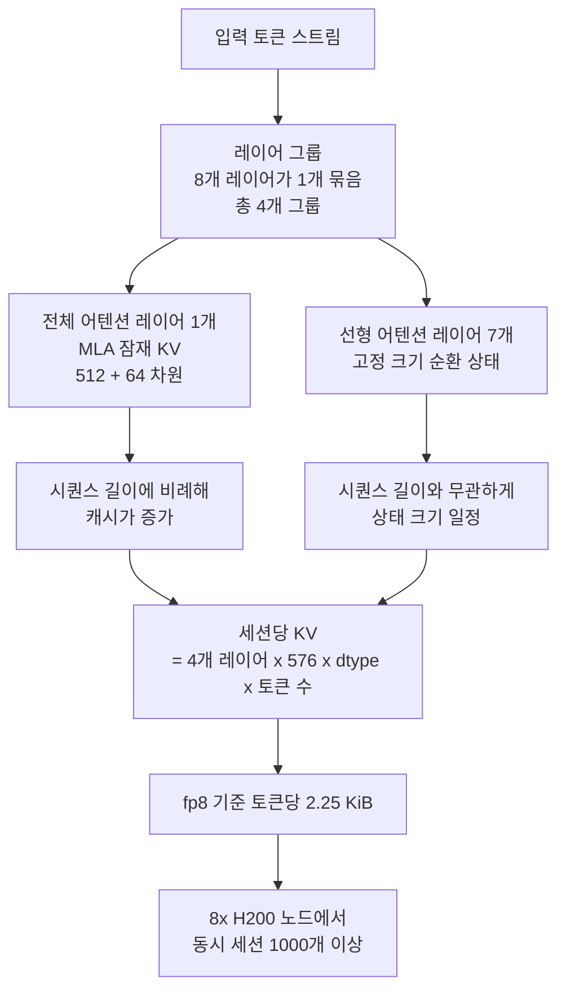

*전체 용량은 크게 두되 토큰마다 극히 일부만 켜는 MoE 구조를 형상화했습니다.*

## 왜 읽어야 하나

이 글은 새로 발표된 오픈웨이트 모델을 사내 GPU 클러스터에 올릴지 결정해야 하는 인프라 엔지니어와, 그 결정에 필요한 노드 수를 산정해야 하는 플랫폼 운영자를 위해 썼습니다. 결론부터 말씀드리면, Ling-3.0-flash는 아직 내려받을 수 없으므로 오늘 배포 계획을 세울 수는 없지만, 공개된 전작을 실측해 두면 가중치가 열리는 날 검토 없이 바로 스케줄링할 수 있습니다. 그리고 그 실측 과정에서 대부분의 용량 산정이 쓰는 KV 캐시 공식이 이 계열 모델에서는 113배 과대평가한다는 사실을 확인했습니다.

## 개요

7월 23일 앤트그룹의 inclusionAI가 Ling-3.0-flash를 발표했습니다. 총 1240억 파라미터 규모의 Mixture-of-Experts인데 토큰 하나를 처리할 때 켜지는 파라미터는 51억뿐입니다. 발표문에서 팀은 총 파라미터의 8분의 1, 활성 파라미터의 12분의 1만으로 자사 1조 파라미터 플래그십과 대부분의 벤치마크에서 대등하거나 앞선다고 밝혔습니다. 네이티브 256K 컨텍스트를 지원하고 100만 토큰까지 확장하는 것을 목표로 한다고도 했습니다.

이 정도 사양이면 온프레미스 서빙을 검토하는 쪽에서는 즉시 반응하게 됩니다. 활성 파라미터가 51억이라는 말은 연산량이 소형 모델 수준이라는 뜻이고, 에이전트처럼 토큰을 많이 쓰는 워크로드에서 비용 곡선이 완전히 달라지기 때문입니다. 실제로 SGLang 팀은 발표 당일 day-0 지원을 준비 중이라고 알렸고, vLLM 쪽도 축하 메시지를 냈습니다. 이 계열은 전작인 Ling-2.6-flash와 Ling-2.6-1T가 모두 day-0 vLLM 지원을 받았습니다.

그런데 저희가 실제로 받아보려고 하자 문제가 생겼습니다. 가중치가 없었습니다.

## 이 기술은 무엇인가

먼저 확인부터 했습니다. HuggingFace API로 inclusionAI 조직의 모델 목록을 최신순으로 조회해 보니 Ling-3.0으로 시작하는 저장소는 한 건도 없었습니다. 가장 최근 항목은 6월 22일에 올라온 Ling-2.6-flash-base였습니다. `inclusionAI/Ling-3.0-flash`의 config.json을 직접 요청하면 익명 접근에서는 401, 유효한 토큰을 붙이면 404가 돌아옵니다. 저장소가 비공개인 것이 아니라 아직 존재하지 않는다는 뜻입니다.

정리하면 Ling-3.0-flash는 추론 제공자 연동을 통해 먼저 나왔습니다. OpenRouter에서 8월 3일까지 무료로 호출할 수 있지만, 모델 카드도 기술 보고서도 다운로드 가능한 체크포인트도 아직 없습니다. 발표문과 여러 매체가 이 모델을 오픈웨이트 계열로 소개하지만 지금 시점에서 실제로 가능한 것은 API 호출뿐입니다. 온프레미스 도입을 검토한다면 이 구분이 결정적입니다. 데이터를 밖으로 내보내지 않는 것이 도입 이유였다면 현재 상태로는 요건 자체가 성립하지 않습니다.

그래서 저희는 접근을 바꿨습니다. 같은 팀이 같은 아키텍처 계열로 이미 공개한 Ling-2.6-flash를 대상으로 실측하고, 그 결과를 Ling-3.0-flash가 열렸을 때의 준비 자료로 쓰기로 했습니다. 세대가 다르므로 숫자를 그대로 옮길 수는 없지만, 캐시 구조와 노드 산정 방식은 그대로 이어집니다.

Ling-2.6-flash의 config.json을 열어 보면 이 계열의 특징이 그대로 드러납니다. 모델 타입은 `bailing_hybrid`이고, 레이어는 32개인데 `layer_group_size`가 8입니다. 8개 레이어를 한 묶음으로 보고 그중 하나만 전체 어텐션, 나머지 일곱은 선형 어텐션으로 처리한다는 뜻입니다. 전체 32개 레이어 중 전체 어텐션은 4개뿐입니다. 그리고 그 4개마저 일반적인 방식이 아닙니다. `kv_lora_rank`가 512, `qk_rope_head_dim`이 64로 잡혀 있는데, 이것은 키와 값을 헤드마다 그대로 저장하지 않고 512차원 잠재 표현으로 압축해 두는 MLA 구조입니다.


*32개 레이어 중 캐시를 쌓는 레이어는 4개뿐이고, 전문가는 256개 중 8개만 켜집니다.*

전문가 라우팅도 극단적입니다. 라우팅 대상 전문가가 256개인데 토큰당 8개만 선택합니다. 32분의 1만 켜는 셈입니다. Ling-3.0-flash는 공개된 요약에 따르면 KDA와 MLA 레이어를 5대 1로 쌓고 전문가 희소성을 64분의 1까지 밀었다고 알려져 있습니다[추정]. 이 두 수치는 1차 문서가 아직 없어 2차 출처에 근거합니다. 다만 방향은 분명합니다. 전체 어텐션 레이어를 줄이고 전문가를 더 희소하게 만드는 쪽입니다.



이 구조가 왜 중요한지는 다음 절의 숫자가 보여줍니다.

## 설치 및 통합

실험은 두 단계로 했습니다. 먼저 어떤 체크포인트가 실제로 존재하는지 조회하고, 그다음 존재하는 체크포인트의 실제 바이트 수와 설정값을 읽어 계산했습니다. 두 스크립트 모두 저장소에 남겨 두었으니 다른 모델에도 그대로 쓸 수 있습니다.

```bash
# 1) 어떤 Ling 저장소가 실제로 공개돼 있는지 확인합니다
.venv/bin/python scripts/experiments/ling3-flash-serving/probe_repo.py

# 2) 공개된 체크포인트의 실제 용량과 캐시 구조를 계산합니다
.venv/bin/python scripts/experiments/ling3-flash-serving/fetch_and_size.py
```

두 번째 스크립트는 파라미터 수에 바이트를 곱하는 추정을 하지 않습니다. HuggingFace 파일 트리 API로 safetensors 샤드의 실제 크기를 모두 더합니다. 양자화 체크포인트는 임베딩이나 게이트처럼 양자화하지 않는 텐서가 섞여 있어서 곱셈 추정과 실측이 어긋나는 일이 잦기 때문입니다.

KV 캐시는 두 가지 공식을 나란히 계산하도록 했습니다. 하나는 운영자들이 습관적으로 쓰는 GQA 공식이고, 다른 하나는 이 아키텍처가 실제로 따르는 공식입니다.

```python
# 흔히 쓰는 공식: 모든 레이어가 헤드별 K와 V를 통째로 저장한다고 가정합니다
naive = 2 * layers * kv_heads * head_dim * bytes_per_element

# 실제 구조: 전체 어텐션 레이어에서만, 그것도 잠재 차원으로 압축해 저장합니다
mla = full_attention_layers * (kv_lora_rank + qk_rope_head_dim) * bytes_per_element
```

가중치를 실제로 내려받는 단계에서는 HuggingFace를 직접 치지 않습니다. 저희 클러스터는 외부 egress가 느려서 수십 기가바이트를 받으면 몇 시간이 걸립니다. 내부 오브젝트 스토리지에 스테이징된 레지스트리를 먼저 확인하고, 없을 때만 외부에서 받아 레지스트리에 올립니다.

```bash
python3 scripts/skills/model_registry.py --from-secret tkai-stage <ns> ls
python3 scripts/skills/model_registry.py pull inclusionAI/Ling-2.6-flash /work/models/ling-2.6-flash
```

## 실제 실험 결과

측정 결과는 아래와 같습니다. 모든 수치는 실행 로그 `outputs/blog-impl/ling-3-0-flash-moe-serving/run-5.log`에서 그대로 가져왔고, 차트도 같은 로그를 파싱해 그렸습니다.


*왼쪽은 공개 체크포인트의 실제 safetensors 바이트, 오른쪽은 세션당 KV 캐시를 통상 공식과 실제 구조로 각각 계산한 값입니다.*

가중치 용량부터 보겠습니다. bf16 원본은 27개 샤드에 걸쳐 200.2 GiB였습니다. fp8 버전은 101.5 GiB, int4 버전은 26개 샤드에 60.4 GiB입니다. int4까지 내리면 H200 한 장의 141 GiB 안에 들어가지만, 실제로는 KV 캐시와 활성화 메모리가 함께 올라가야 하므로 한 장에 밀어 넣는 구성은 권하지 않습니다.

흥미로운 부분은 KV 캐시입니다. 통상 공식을 적용하면 토큰당 512 KiB가 나옵니다. 32개 레이어가 모두 32개 KV 헤드를 128차원으로 저장한다고 가정한 값입니다. 그런데 이 모델에서 실제로 캐시를 쌓는 레이어는 4개뿐이고, 그 4개는 576차원 잠재 표현만 저장합니다. 실제 값은 토큰당 4.5 KiB입니다. 113.8배 차이입니다.

세션 단위로 환산하면 차이가 더 크게 다가옵니다. fp8 캐시 기준으로 128K 컨텍스트 세션 하나는 통상 공식으로 32 GiB, 실제 구조로는 0.295 GiB입니다. 선형 어텐션 레이어 28개가 들고 있는 고정 상태는 세션당 14 MiB 정도로 추정되는데, 이 값은 config에 직접 적혀 있지 않아 헤드 수와 헤드 차원에서 유도했습니다[추정]. 컨텍스트가 길어져도 이 부분은 늘지 않습니다.


*토큰당 요구량과 128K 세션 요구량을 통상 공식과 실제 구조로 각각 표시한 값입니다.*

노드 단위 산정으로 넘어가면 결론이 바뀝니다. H200 여덟 장짜리 노드는 HBM이 1128 GiB이고, 활성화와 단편화를 위해 10퍼센트를 남기면 int4 가중치를 올린 뒤 954.8 GiB가 남습니다. 통상 공식대로라면 256K 세션을 15개도 못 담습니다. 실제 구조로 계산하면 1657개입니다.


*같은 가용 풀에 통상 공식으로는 15개 미만, 실제 구조로는 1657개가 들어갑니다.*

여기서 중요한 것은 1657이라는 숫자 자체가 아닙니다. 병목의 위치가 바뀐다는 사실입니다. 통상 공식을 믿으면 이 모델은 메모리 바운드로 보이고, 그러면 노드를 더 사거나 컨텍스트를 줄이는 결정을 하게 됩니다. 실제로는 메모리에 여유가 크고 병목은 연산과 스케줄링 쪽으로 이동합니다. 잘못된 공식 하나가 조달 결정을 통째로 바꿔 놓을 수 있습니다.

한 가지 단서를 붙여야 합니다. 표의 256K 열은 Ling-2.6-flash의 네이티브 윈도우인 131072 토큰을 넘어섭니다. Ling-3.0-flash가 목표로 밝힌 256K를 전작의 기하 구조에 투영해 본 값이므로, 실제 3.0 체크포인트가 열리면 다시 재야 합니다. 저희가 붙잡아 두려는 것은 숫자가 아니라 재는 방법입니다.

## ThakiCloud 제품 적용 시사점

ThakiCloud의 ai-platform은 쿠버네티스 위에서 Kueue로 GPU를 스케줄링하고 vLLM으로 모델을 서빙합니다. 고객이 새 오픈웨이트 모델을 요청할 때 저희가 가장 먼저 답해야 하는 질문은 성능이 아니라 몇 장이 필요한가입니다. 이번 실측은 그 답변 절차를 하나 정리해 줬습니다. 모델 카드의 파라미터 수만 보고 곱셈으로 답하지 않고, config.json의 어텐션 구조를 먼저 읽은 뒤 캐시 공식을 고르는 순서입니다. MLA나 선형 어텐션이 섞인 모델이 늘어나는 중이라 이 차이는 앞으로 더 자주 문제가 됩니다.

멀티테넌트 환경에서는 이 차이가 곧바로 단가로 이어집니다. 노드 하나에 담기는 동시 세션 수가 백 배 단위로 달라지면 테넌트당 할당 정책과 과금 모델이 함께 바뀝니다. 저희가 온프레미스와 소버린 환경에서 경쟁력을 갖는 지점도 여기입니다. 같은 하드웨어에서 몇 명을 태울 수 있는지를 실측으로 답할 수 있으면 도입 검토가 짧아집니다.

에이전트 워크로드 쪽에서는 Paxis 관점이 붙습니다. Paxis는 ai-platform 위에서 도는 Agent-Native Cloud 제어 평면으로, 스킬과 도구와 정책을 일급 리소스로 다룹니다. 에이전트는 사람보다 훨씬 많은 토큰을 훨씬 긴 컨텍스트로 씁니다. 활성 파라미터가 작고 긴 컨텍스트의 캐시 비용이 낮은 모델은 에이전트 경제성을 직접 바꿉니다. 토큰당 비용이 내려가면 그동안 비싸서 못 돌리던 스킬 조합을 상시로 돌릴 수 있게 됩니다. 저비용 서빙이 에이전트 상시 가동의 전제가 되는 구조입니다.


*노드당 세션 수의 변화가 단가와 에이전트 운용과 도입 절차에 각각 어떻게 이어지는지 정리했습니다.*

다만 지금 단계에서 저희가 고객에게 권하는 답은 분명합니다. Ling-3.0-flash는 아직 온프레미스 후보가 아닙니다. 가중치가 열리기 전까지는 API 평가 대상이고, 데이터 반출이 제약인 고객에게는 평가조차 권하기 어렵습니다.

## 한계 및 반론

이 글의 숫자는 벤치마크가 아닙니다. 실제로 모델을 띄워 처리량이나 지연을 잰 값이 아니라, 공개된 파일 크기와 설정에서 유도한 용량 계산입니다. 실제 서빙에서는 페이지 단위 할당의 내부 단편화, CUDA 그래프 버퍼, 프리필 단계의 활성화 메모리가 추가로 들어가므로 동시 세션 수는 계산값보다 줄어듭니다. 1657이라는 값은 상한에 가깝다고 보는 편이 안전합니다.

선형 어텐션 상태 크기도 유도값입니다. 헤드 수와 헤드 차원에서 계산했지만 구현이 상태를 다른 형태로 들고 있을 수 있고, 그러면 세션당 고정 비용이 달라집니다. 다만 이 값은 컨텍스트가 길어질수록 전체에서 차지하는 비중이 줄어들어 긴 컨텍스트 산정의 결론은 바뀌지 않습니다.

Ling-3.0-flash에 관한 아키텍처 수치는 대부분 2차 출처입니다. KDA와 MLA를 5대 1로 쌓았다는 설명과 64분의 1 전문가 희소성은 기술 보고서가 나오면 확인해야 합니다. 성능 주장 역시 제조사 자체 발표이며 독립 검증이 없습니다.

마지막으로 반론 하나를 세워 두겠습니다. 가중치가 없는데 미리 사이징하는 것이 시간 낭비라는 지적은 타당합니다. 실제로 공개가 몇 달 늦어지거나 끝내 열리지 않을 수도 있습니다. 그런데 이번 작업의 산출물은 특정 모델에 묶여 있지 않습니다. 스크립트는 저장소 이름만 바꾸면 다른 모델에도 그대로 돌아가고, 어텐션 구조를 먼저 읽는 습관은 어느 모델에서든 유효합니다.

## 정리

Ling-3.0-flash는 발표는 됐지만 아직 내려받을 수 없습니다. 저희가 직접 확인한 결과 HuggingFace에 저장소 자체가 없었고, 지금 가능한 것은 API 호출뿐입니다. 온프레미스 도입을 검토 중이라면 이 사실이 첫 번째 판단 기준입니다.

그래서 저희는 전작인 Ling-2.6-flash를 실측했습니다. 가중치는 bf16 200.2 GiB, fp8 101.5 GiB, int4 60.4 GiB였고, KV 캐시는 통상 공식이 113.8배 과대평가하고 있었습니다. 실제 구조로 계산하면 H200 여덟 장짜리 노드 하나가 256K 세션을 천 개 단위로 받습니다. 병목은 메모리가 아니라 연산 쪽에 있습니다.

다음에 새 오픈웨이트 모델을 검토하실 때 두 가지만 챙기시면 됩니다. 첫째, 가중치가 실제로 공개돼 있는지 API로 직접 확인하십시오. 발표문과 실제 공개 상태는 다를 수 있습니다. 둘째, 용량을 산정하기 전에 config.json의 어텐션 구조를 먼저 읽으십시오. MLA나 선형 어텐션이 섞여 있으면 익숙한 공식은 두 자릿수 배율로 틀립니다.

## 참고 자료

- Ant Ling, [Ling-3.0-flash 발표](https://x.com/AntLingAGI/status/2080351022028095681)
- SGLang, [Ling-3.0-flash day-0 지원 준비 공지](https://x.com/sgl_project/status/2080372971219415458)
- inclusionAI, [Ling-2.6-flash 모델 카드](https://huggingface.co/inclusionAI/Ling-2.6-flash)
- inclusionAI, [Ling-2.6-flash-int4 체크포인트](https://huggingface.co/inclusionAI/Ling-2.6-flash-int4)
- OpenRouter, [Ling-3.0-flash 제공 현황](https://openrouter.ai/inclusionai/ling-3.0-flash)
