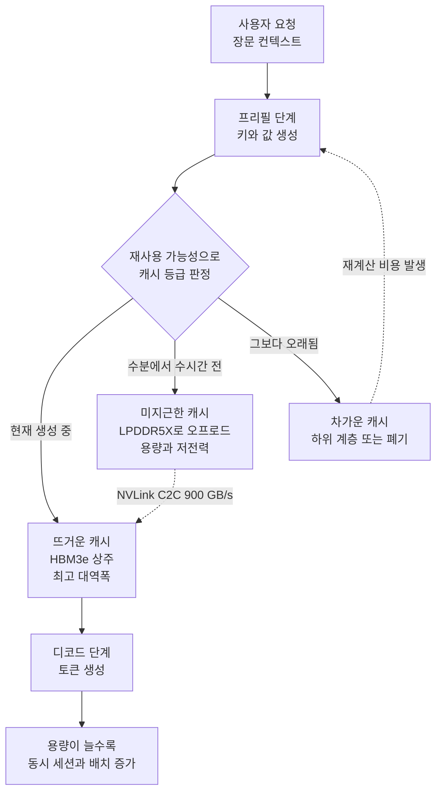

*좁고 뜨거운 HBM 코어와 넓고 차가운 LPDDR 계층이라는 이 백서의 구조를 형상화했습니다.*

## 왜 읽어야 하나

이 글은 장문 컨텍스트 서비스를 온프레미스에 올려야 하는데 GPU를 몇 장 사야 할지 결정하지 못한 인프라 엔지니어와, 그 견적서에서 메모리 항목이 왜 이렇게 커졌는지 설명해야 하는 플랫폼 운영자를 위해 썼습니다. 결론부터 말씀드리면 장문 추론의 병목은 모델을 올릴 자리가 아니라 대화가 쌓아 놓은 KV 캐시를 둘 자리이며, 이 캐시를 GPU 밖의 저전력 메모리로 내리는 순간 같은 GPU로 감당할 수 있는 동시 사용자 수가 달라집니다. 마이크론이 그 차이를 실측한 백서를 냈고, 저희는 그 전제가 되는 계산을 직접 다시 해봤습니다.

## 개요

7월 말 타임라인에 마이크론과 메타가 함께 백서를 냈다는 이야기가 돌았습니다. 확인해 보니 두 갈래가 섞여 있었습니다. 하나는 마이크론이 단독으로 낸 [LPDDR at Scale: Enabling Efficient LLM Inference Through High-Capacity Memory](https://www.micron.com/content/dam/micron/global/public/products/memory/mobile-dram/lpddr5/documents/lpddr-at-scale-llm-inference-white-paper.pdf)이고, 다른 하나는 마이크론과 메타 엔지니어가 나란히 앉아 메타의 오픈소스 벤치마크 스위트인 DCPerf로 LPDDR을 하이퍼스케일 워크로드에 돌려본 공동 작업입니다. 앞의 백서가 지금 전문을 읽을 수 있는 쪽이고, 이 글의 수치는 대부분 여기서 왔습니다.

읽어 보면 메모리 업체의 홍보물이라고 넘기기 어려운 문장이 하나 있습니다. 추론에서 메모리 수요를 끌어올리는 지배적 요인은 모델의 파라미터 수가 아니라 KV 캐시의 증가라는 진술입니다. 컨텍스트가 수십만 토큰으로 늘어나면 KV 캐시 요구량이 수백 기가바이트에서 테라바이트 단위로 올라가고, 기존의 시스템 메모리 구성으로는 감당이 안 된다는 것입니다. 용량을 어떻게 잡아야 하는지가 근본적으로 바뀐다는 주장인데, 저희가 계산기를 두드려 보니 과장이 아니었습니다.

한국에서 이 주제가 더 절실한 이유도 있습니다. 국내에서 자체 GPU 클러스터를 운영하는 팀은 대부분 카드 수가 빠듯하고, 컨텍스트를 늘려 달라는 요구는 계속 들어옵니다. 카드를 더 사는 대신 카드 옆의 메모리를 늘려서 같은 문제를 풀 수 있다면 견적서의 모양 자체가 달라집니다.

## 이 기술은 무엇인가

KV 캐시는 이미 계산한 어텐션 키와 값을 저장해 두고 재사용하는 장치입니다. 저장해 두지 않으면 토큰을 하나 뽑을 때마다 앞의 모든 토큰에 대한 키와 값을 다시 계산해야 하므로, 사실상 모든 서빙 엔진이 이 캐시를 씁니다. 문제는 이 캐시가 시퀀스 길이와 동시 요청 수에 정비례해서 커진다는 점입니다. 모델 가중치는 한 번 올리면 크기가 고정되지만 캐시는 사용자가 대화를 이어갈수록 계속 부풀어 오릅니다.

백서는 이 캐시를 재사용 가능성에 따라 세 등급으로 나눕니다. 지금 생성 중인 세션이 쓰는 활성 작업 집합은 뜨거운 캐시이고 대역폭이 가장 높은 HBM에 둡니다. 몇 분에서 몇 시간 전에 만들어진 캐시는 미지근한 등급으로 보고 LPDDR5X로 내립니다. 이보다 오래된 것은 차가운 등급으로 더 아래 계층에 두거나 버립니다. 소프트웨어 쪽에서 LMCache 같은 계층이 GPU 메모리에서 CPU 메모리, 다시 SSD로 캐시를 밀어내는 것과 발상이 같습니다. 다른 점은 마이크론이 그 두 번째 계단을 아예 하드웨어 사양으로 못 박고 용량을 키웠다는 것입니다.

하드웨어 구성도 특이합니다. 시험대는 NVIDIA GH200 그레이스 호퍼 슈퍼칩입니다. 그레이스 CPU에는 LPDDR5X가 붙어 있고 호퍼 GPU에는 HBM3e가 붙어 있으며, 둘은 NVLink C2C로 이어져 캐시 일관성을 유지합니다. 이 구성에서는 프레임워크가 LPDDR을 GPU 메모리의 연장으로 다룰 수 있습니다. 백서는 단일 슈퍼칩 구성과 512GB LPDDR5X를 가진 슈퍼칩 두 개를 묶어 1TB를 흉내 낸 구성을 쓰고, 여기서 192GB LPDDR5X SOCAMM2 모듈 여덟 장으로 CPU당 1.5TB까지 가는 경우를 투사합니다. 모델은 Llama 3 70B를 FP16으로 올렸고 서빙 엔진은 TensorRT-LLM과 vLLM을 썼습니다.

*시험대인 GH200에서는 LPDDR이 GPU 메모리의 연장선으로 다뤄집니다.*

## 숫자를 직접 확인해 봤습니다

백서의 전제가 맞는지 보려면 남의 그래프를 읽는 것보다 직접 계산하는 편이 빠릅니다. Llama 3 70B는 공개된 설정에서 레이어 80개, KV 헤드 8개, 헤드 차원 128을 씁니다. 키와 값 두 벌을 FP16으로 들고 있으므로 토큰 하나가 차지하는 캐시는 2 곱하기 80 곱하기 8 곱하기 128 곱하기 2바이트, 즉 320KiB입니다. 이 값을 컨텍스트 길이로 곱하기만 하면 세션 하나의 발자국이 나옵니다.

*세션 하나의 KV 발자국을 계층별 용량선과 겹쳐 그렸습니다. 500K 토큰 지점에서 이미 H100 한 장의 HBM 용량선을 크게 넘어섭니다.*

결과는 다음과 같습니다. 8K 컨텍스트에서는 세션당 2.7GB로 가볍습니다. 128K로 늘리면 42.9GB가 되고, 백서가 실시간 추론 시험에 쓴 500K 컨텍스트에서는 세션 하나가 163.8GB를 요구합니다. 100만 토큰이면 327.7GB입니다. 같은 모델의 FP16 가중치가 141.2GB라는 점과 나란히 놓고 보면 백서의 주장이 그대로 확인됩니다. 500K 컨텍스트에서는 사용자 한 명의 캐시가 모델 전체보다 큽니다.

여기서 시험대의 H100이 96GB HBM3를 달고 있다는 사실이 다시 읽힙니다. 이 GPU는 Llama 3 70B의 FP16 가중치조차 혼자 담지 못합니다. 그레이스 쪽 LPDDR을 통합 메모리로 끌어 쓰지 않으면 시험 자체가 성립하지 않는 구성입니다. 저희 계산으로는 가중치를 뺀 나머지를 캐시에 모두 쓴다고 가정할 때 512GB 구성은 500K 세션을 두 개, 1.5TB 구성은 여덟 개 담습니다. 128K 컨텍스트로 낮추면 각각 여덟 개와 서른한 개로 늘어납니다. 이 계산은 프레임워크 오버헤드와 활성화 메모리를 무시한 상한이므로 실제 배치는 이보다 작게 잡아야 합니다.

## 마이크론이 측정한 결과

백서가 보고하는 핵심 수치는 두 갈래입니다. 실시간 장문 추론에서 CPU당 LPDRAM 용량을 512GB에서 1.5TB로 늘리자 첫 토큰까지 걸리는 시간이 최대 98% 줄었습니다. 500K 컨텍스트에서 Llama 3 70B를 FP16으로 돌린 조건이고, 이 개선으로 시스템 한 대가 최대 16명까지 감당했다고 적혀 있습니다. 회의 녹취를 일괄 변환하는 식의 오프라인 배치 추론에서는 같은 용량 증설이 동시 처리 요청 수, 즉 배치 크기를 두 배로 만들었습니다. 용량이 모자란 쪽은 키와 값을 반복해서 다시 계산해야 하므로 처리 속도가 떨어진다는 설명이 붙어 있습니다.

*500K 컨텍스트에서 Llama 3 70B를 FP16으로 돌렸을 때 백서가 보고한 세 가지 수치입니다.*

98%라는 숫자가 커 보이지만 기전은 단순합니다. 캐시를 둘 자리가 없으면 재계산이 일어나고, 재계산은 프리필을 통째로 다시 도는 일이라 첫 토큰 지연에 그대로 얹힙니다. 자리를 만들어 주면 그 작업이 사라집니다. 성능이 좋아졌다기보다 낭비가 없어졌다고 읽는 편이 정확합니다.

또 하나의 갈래는 앞서 나온 기술 브리프 [The role of low-power (LP) memory in data center workloads](https://assets.micron.com/adobe/assets/urn:aaid:aem:5a10a15d-ae6c-40f9-8fc2-e522e7c6749f/renditions/original/as/lp-in-data-center-technical-brief.pdf)에 있습니다. 마이크론은 GH200의 LPDDR5X 시스템과 2022년에서 2023년 사이 세대의 x86 DDR5 서버를 맞붙였습니다. 멀티체이스 마이크로벤치마크의 읽기 쓰기 혼합 조건에서 LPDDR5X는 293GB/s, DDR5는 215GB/s를 냈고 차이는 36%입니다. 메모리 전력은 조건에 따라 최대 77%까지 낮았습니다. Llama 3 8B에서는 와트당 성능이 10% 좋았고, 70B에서는 처리량이 다섯 배 이상, 지연은 약 80% 낮았으며 에너지 소비는 73% 적었다고 보고합니다.

여기서 마이크론 자신이 달아 놓은 단서가 중요합니다. 70B의 다섯 배는 메모리 종류만의 효과가 아니라 그레이스 CPU와 저전력 메모리와 NVLink의 조합에서 나온 결과라고 명시합니다. 실제로 두 시스템은 CPU 아키텍처가 다르고, GPU 연결도 한쪽은 양방향 900GB/s의 NVLink C2C, 다른 쪽은 128GB/s의 PCIe입니다. 일곱 배 차이 나는 링크를 사이에 두고 KV 캐시를 옮기는 실험이므로 이 결과를 LPDDR 대 DDR5의 순수 비교로 인용하면 틀립니다.

*두 시스템은 메모리만 다른 것이 아니라 CPU와 인터커넥트도 다릅니다.*

## 메타와 함께 확인한 부분

마이크론과 메타의 공동 작업은 성격이 다릅니다. 마이크론 데이터센터 워크로드 엔지니어링 팀의 카얌 안잠이 정리한 소개에 따르면, 두 회사 엔지니어가 함께 메타의 오픈소스 벤치마크 스위트 [DCPerf](https://engineering.fb.com/2024/08/05/data-center-engineering/dcperf-open-source-benchmark-suite-for-hyperscale-compute-applications/)를 써서 LPDDR이 실제 하이퍼스케일 워크로드에서 어떻게 동작하는지 측정했습니다. DCPerf는 메타가 자사 프로덕션 서버 플릿의 대형 애플리케이션을 참조해 만든 벤치마크 묶음이고, 합성 워크로드보다 데이터센터 애플리케이션의 전력과 주파수 특성을 가깝게 재현하도록 설계됐습니다.

이 조합이 의미 있는 이유는 검증 주체가 갈라져 있기 때문입니다. 메모리 업체가 자사 제품을 자사 벤치마크로 재면 아무도 믿지 않습니다. 반면 세계 최대급 플릿을 굴리는 사업자가 자기 워크로드를 본떠 공개한 도구로 재면 결과의 성격이 달라집니다. 다만 이 공동 작업의 문서 전문은 이 글을 쓰는 시점에 확보하지 못했습니다. 마이크론 제품 페이지의 소개 문구와 DCPerf 자체 문서까지만 확인했고, 개별 수치는 인용하지 않았습니다. 문서가 공개되면 그때 숫자를 따로 다루겠습니다.

## ThakiCloud 제품 적용 시사점

*이 백서를 저희 운영 관점으로 옮기면 세 갈래로 정리됩니다.*

다키클라우드의 ai-platform은 쿠버네티스 위에서 고객사 GPU 자원을 나눠 쓰고 vLLM 기반 서빙을 운용합니다. 이 백서를 저희 관점으로 옮기면 세 가지가 남습니다.

첫째, 용량 산정 공식을 바꿔야 합니다. 모델이 GPU에 올라가는지만 보고 노드 수를 잡으면 장문 서비스에서 반드시 어긋납니다. 앞의 계산처럼 500K 컨텍스트에서는 세션 하나가 가중치보다 큰 캐시를 요구하므로, 목표 동시 세션 수와 목표 컨텍스트 길이를 먼저 정하고 거기서 필요한 메모리를 역산하는 편이 맞습니다. 저희가 최근 다른 글에서 다룬 [MoE 모델의 KV 캐시 산정](/tech-blog/ko/llmops/ling-3-0-flash-moe-serving/)과 같은 작업이며, 계산을 건너뛰면 배포 당일에 배치 크기를 줄이는 일이 반복됩니다.

둘째, 하드웨어를 바꾸지 않고도 같은 방향으로 갈 수 있습니다. GH200이 없어도 KV 캐시를 GPU 메모리에서 CPU 메모리로, 다시 NVMe로 밀어내는 계층화는 LMCache 계열 구성으로 오늘 적용할 수 있습니다. 마이크론이 하드웨어로 넓힌 두 번째 계단을 소프트웨어로 흉내 내는 셈인데, 링크 대역폭이 PCIe 수준이라면 오프로드 이득이 재계산 비용보다 큰 구간이 좁아진다는 점을 함께 봐야 합니다. 그 교차점을 워크로드별로 재보는 일이 실제 운영에서 남는 숙제입니다.

셋째, 전력 항목이 견적에 들어옵니다. 온프레미스와 소버린 구축을 검토하는 고객사는 랙당 전력과 냉각이 곧 도입 가능 여부인 경우가 많습니다. 메모리 서브시스템 전력을 크게 낮추는 선택지가 생기면 같은 전력 예산 안에서 더 많은 토큰을 만들 수 있고, 이는 저희가 제안서에서 계속 강조해 온 총소유비용 논리와 직결됩니다.

에이전트 워크로드 쪽에서는 결이 조금 다릅니다. 다키클라우드의 Paxis는 에이전트 네이티브 클라우드로 스킬과 도구, 정책, 감사 로그를 일급 리소스로 다루는데, 에이전트는 사람보다 훨씬 긴 컨텍스트를 훨씬 자주 재사용합니다. 같은 시스템 프롬프트와 같은 문서 묶음을 수백 번 다시 읽는 구조이므로 KV 캐시 재사용률이 사람 대화보다 높습니다. 캐시를 둘 자리를 넓히는 일이 에이전트 경제성에 직접 반영되는 이유이고, 서빙 원가를 낮추는 인프라 선택이 그 위에서 도는 에이전트 플랫폼의 단가를 함께 낮춥니다.

## 한계 및 반론

가장 큰 한계는 출처의 성격입니다. 이 백서는 LPDDR을 파는 회사가 냈고, 비교 대상으로 고른 x86 DDR5 서버는 2022년에서 2023년 세대입니다. 최신 x86 플랫폼이나 MRDIMM 구성과 붙였을 때도 같은 격차가 나오는지는 이 문서로 알 수 없습니다. 독립적인 제삼자 재현도 아직 보이지 않습니다.

두 번째로 98%와 다섯 배 같은 수치는 최선 조건의 값입니다. 98%는 500K 컨텍스트라는 극단적인 장문에서 용량 부족으로 재계산이 일어나던 기준선을 없앤 결과이고, 컨텍스트가 짧아지면 이득도 함께 줄어듭니다. 다섯 배 역시 앞서 적었듯 CPU와 링크가 함께 바뀐 비교입니다.

세 번째로 오프로드는 공짜가 아닙니다. 캐시를 GPU 밖에 두면 필요할 때 다시 끌어와야 하고, 그 전송 시간이 재계산 시간보다 길어지는 지점이 반드시 존재합니다. 링크 대역폭이 낮을수록 그 교차점은 빨리 옵니다. NVLink C2C를 전제로 얻은 결론을 PCIe 환경에 그대로 옮기면 오히려 느려질 수 있습니다.

마지막으로 조달 관점의 문제가 있습니다. LPDDR5X는 보드에 직접 실장하는 형태라 현장에서 증설하거나 교체하기 어렵습니다. SOCAMM2 같은 모듈형 규격이 이 문제를 겨냥하고 있지만 아직 새로운 폼팩터이고, 공급과 유지보수 경로가 기존 RDIMM만큼 익숙하지 않습니다.

## 정리

장문 추론의 용량 문제는 모델을 어디에 올릴지가 아니라 대화가 쌓은 캐시를 어디에 둘지의 문제입니다. Llama 3 70B를 FP16으로 돌릴 때 토큰 하나가 320KiB를 요구하고 500K 컨텍스트에서는 세션 하나가 가중치보다 큰 163.8GB를 차지한다는 계산이 그 사실을 그대로 보여줍니다. 마이크론은 이 자리를 저전력 메모리로 넓혀 첫 토큰 지연을 최대 98% 줄이고 배치 크기를 두 배로 만들었다고 보고했고, 그 결과에는 그레이스 CPU와 NVLink라는 조건이 함께 붙어 있습니다.

당장 할 일은 분명합니다. 지금 운영 중인 서빙 구성에서 목표 컨텍스트와 목표 동시 세션 수를 정한 뒤 KV 발자국을 계산해 보시기 바랍니다. 그 값이 GPU 메모리를 넘어선다면 카드를 더 사기 전에 캐시 계층화부터 검토할 차례입니다. 하드웨어 세대를 바꾸는 결정은 그다음에 해도 늦지 않습니다.

## 출처

- [LPDDR at Scale: Enabling Efficient LLM Inference Through High-Capacity Memory](https://www.micron.com/content/dam/micron/global/public/products/memory/mobile-dram/lpddr5/documents/lpddr-at-scale-llm-inference-white-paper.pdf), Micron White Paper, 2026년 2월
- [The role of low-power (LP) memory in data center workloads](https://assets.micron.com/adobe/assets/urn:aaid:aem:5a10a15d-ae6c-40f9-8fc2-e522e7c6749f/renditions/original/as/lp-in-data-center-technical-brief.pdf), Micron Technical Brief
- [Every watt matters: How low-power memory is transforming data centers](https://www.micron.com/about/blog/applications/data-center/every-watt-matters-how-low-power-memory-is-transforming-data-centers), Micron Blog
- [DCPerf: An open source benchmark suite for hyperscale compute applications](https://engineering.fb.com/2024/08/05/data-center-engineering/dcperf-open-source-benchmark-suite-for-hyperscale-compute-applications/), Engineering at Meta
- KV 발자국 계산 스크립트: `scripts/blog/kv_cache_calc.py` (Llama 3 70B 공개 설정 기반)
