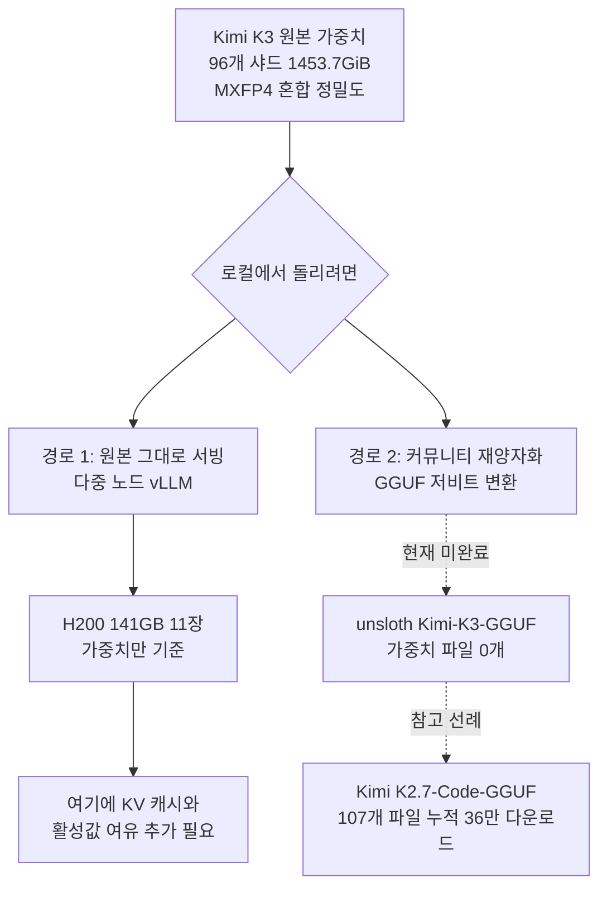

오픈웨이트 모델이 공개되면 반나절 안에 로컬에서 돌려 봤다는 글이 올라옵니다. 그런데 이번 Kimi K3는 사정이 좀 다릅니다. 저희가 HuggingFace API로 공개된 가중치 파일을 전수 집계해 보니 96개 샤드에 1,453.7GiB였습니다. 141GB짜리 H200을 11장 붙여야 가중치가 겨우 올라가는 크기이고, 여기에는 KV 캐시도 활성값도 아직 포함되지 않았습니다.


## 왜 읽어야 하나

이 글은 오픈웨이트 모델을 사내에 들여올지 판단하시는 인프라 담당자와, GPU 예산을 세우는 플랫폼 엔지니어를 위한 글입니다. 모델의 벤치마크 점수를 비교하려는 분보다는, 공개된 가중치를 실제로 서빙할 때 무엇이 필요한지 숫자로 알고 싶은 분에게 쓸모가 큽니다. 핵심 결론은 이렇습니다. 프런티어급 오픈웨이트가 나왔다는 사실과 그 모델을 우리 환경에서 돌릴 수 있다는 사실 사이에는 지금 열한 장 분량의 간극이 있고, 이 간극을 메우는 일은 모델 제작자가 아니라 양자화 커뮤니티와 서빙 스택이 합니다. 그래서 릴리스 당일에 봐야 할 것은 모델 카드가 아니라 GGUF 저장소의 파일 목록입니다.

## 개요

Moonshot AI가 Kimi K3를 공개했습니다. 모델 카드 기준으로 총 파라미터 2.8T, 활성 파라미터 104B인 Mixture-of-Experts 모델이고, 네이티브 멀티모달에 1,000,000 토큰 컨텍스트를 지원합니다. 저장소 설명은 이 모델을 세계 최초의 공개 3T급 모델로 소개하고 있습니다.

이 글을 쓰게 된 계기는 조금 사소합니다. 양자화 도구를 만드는 Unsloth가 Moonshot 쪽에 감사를 표하면서 로컬에서 돌아가게 만들어 보겠다고 밝힌 짧은 글이 타임라인에 올라왔습니다. 보통은 그냥 지나칠 인사말인데, 이 경우에는 그 한 문장이 실제로 얼마나 큰 작업을 가리키는지 궁금했습니다. 그래서 감상 대신 숫자를 확인하기로 했습니다.

확인 시점 기준으로 세 저장소의 상태는 이렇습니다. 원본인 `moonshotai/Kimi-K3`는 좋아요 6,064개에 다운로드 2,850건이고 마지막 수정은 2026년 7월 27일이었습니다. Unsloth가 만든 미러 `unsloth/Kimi-K3`는 같은 날 오후에 생성되어 원본과 동일한 가중치를 담고 있었습니다. 그리고 `unsloth/Kimi-K3-GGUF`는 같은 날 생성되었지만 그 안에는 README와 gitattributes 두 파일뿐이었습니다. 가중치 파일은 아직 하나도 올라오지 않은 상태였습니다.

## 이 모델은 무엇인가

Kimi K3의 구조를 모델 카드와 공개된 설정 파일에서 그대로 옮기면 다음과 같습니다.

| 항목 | 값 |
|---|---|
| 총 파라미터 | 2.8T |
| 활성 파라미터 | 104B |
| 레이어 수 | 93 (밀집 레이어 1개 포함) |
| 어텐션 구성 | KDA 69개 + Gated MLA 24개 |
| 전문가 수 | 896개 중 16개 활성 |
| 어텐션 은닉 차원 | 7168 |
| 어텐션 헤드 수 | 96 |
| 컨텍스트 길이 | 1,048,576 토큰 |
| 어휘 크기 | 163,840 |
| 공개 형식 | MXFP4 compressed-tensors |

아키텍처 이름 몇 가지가 새롭습니다. Kimi Delta Attention과 Attention Residuals라는 두 요소 위에 Stable LatentMoE라는 틀로 희소성을 키웠고, 모델 카드는 이 조합으로 K2 대비 전체 스케일링 효율이 약 2.5배 개선되었다고 설명합니다. 이 수치는 제작자 측 주장이므로 독립 검증 전까지는 그대로 받아들이지 않는 편이 좋겠습니다.

실무에 직접 영향을 주는 부분은 공개 형식입니다. 설정 파일의 양자화 항목을 보면 `mxfp4-pack-quantized` 형식에 4비트, 그룹 크기 32, 대칭 양자화로 되어 있습니다. 그런데 제외 목록이 꽤 깁니다. 셀프 어텐션, 공유 전문가, 밀집 MLP의 게이트와 업과 다운 투영, 언어 모델 헤드, 비전 타워, 멀티모달 투영기가 모두 4비트 양자화 대상에서 빠져 있습니다. 즉 이 릴리스는 전체를 4비트로 누른 모델이 아니라, 라우팅되는 전문가 가중치만 4비트로 누르고 나머지는 더 높은 정밀도로 남긴 혼합 정밀도 배포입니다.

이 사실은 용량 계산과 바로 이어집니다. 2.8T 파라미터를 순수하게 4비트로만 담으면 이론상 1.27TiB 정도입니다. 저희가 실제로 집계한 값은 1,453.7GiB, 즉 약 1.42TiB였습니다. 차이인 150GiB 남짓이 양자화에서 제외된 부분과 스케일 텐서가 차지하는 몫입니다. 숫자가 서로 맞아떨어지므로 집계 방식에 큰 오류는 없다고 판단했습니다.



## 설치 및 통합

가중치를 내려받는 절차 자체는 평범합니다.

```bash
# 원본 가중치 (1.4TiB 이상의 여유 공간이 필요합니다)
hf download moonshotai/Kimi-K3 --local-dir ./Kimi-K3

# 파일 목록과 용량만 먼저 확인하고 싶다면
curl -s "https://huggingface.co/api/models/moonshotai/Kimi-K3?blobs=true" \
  | python3 -c "import json,sys; d=json.load(sys.stdin); \
print(sum((s.get('lfs') or {}).get('size',0) for s in d['siblings'])/1024**3, 'GiB')"
```

저희가 쓴 방법이 두 번째입니다. 1.4TiB를 실제로 내려받지 않고도 HuggingFace API가 알려 주는 LFS 블롭 크기를 모두 더하면 정확한 배포 용량이 나옵니다. 용량 산정 단계에서는 이 편이 훨씬 빠르고, 저장소가 어떤 파일로 구성되어 있는지도 함께 보입니다.

서빙은 단일 노드로는 성립하지 않습니다. 141GB HBM을 가진 H200 기준으로도 가중치만 11장이므로, 텐서 병렬과 파이프라인 병렬을 노드에 걸쳐 조합해야 합니다.

```bash
# 개념적인 형태입니다. 실제 병렬 조합과 노드 수는 클러스터 구성에 따라 달라집니다.
vllm serve moonshotai/Kimi-K3 \
  --tensor-parallel-size 8 \
  --pipeline-parallel-size 2 \
  --max-model-len 131072 \
  --trust-remote-code
```

컨텍스트 길이를 100만 토큰 그대로 열지 않고 줄여 잡은 이유는 KV 캐시 때문입니다. 어텐션 레이어가 93개이고 헤드가 96개인 모델에서 100만 토큰 창을 전부 여는 구성은 가중치와 별개로 상당한 메모리를 더 요구합니다. 실제 운영에서는 필요한 최대 길이를 먼저 정하고 거기에 맞춰 캐시 예산을 잡는 편이 안전합니다.

한 가지 더 확인해 두실 것이 라이선스입니다. 이전 세대인 `moonshotai/Kimi-K2.7-Code`는 수정된 MIT 라이선스였지만, K3는 Kimi K3 License라는 별도 조건으로 나왔습니다. 본문은 MIT에 가까운 허용 조항으로 시작하지만 두 가지 단서가 붙습니다. 모델을 서비스 형태로 제공하는 사업의 매출이 연속 12개월 동안 2천만 달러를 넘으면 상업적 사용 전에 Moonshot AI와 별도 계약을 맺어야 합니다. 또한 월간 활성 사용자 1억 명 또는 월 매출 2천만 달러를 넘는 제품에 쓰는 경우 사용자 화면에 Kimi K3를 눈에 띄게 표시해야 합니다. 내부 사용, 즉 모델과 그 출력과 능력을 외부에 제공하지 않는 사용에는 두 조항이 적용되지 않습니다. 대부분의 사내 도입은 여기에 해당하겠지만, 고객에게 추론을 파는 형태라면 도입 전에 법무 검토를 거치셔야 합니다.

## 실제 실험 결과

측정은 HuggingFace 모델 API를 통해 각 저장소의 모든 LFS 블롭 크기를 합산하는 방식으로 했습니다. 가중치 확장자만 대상으로 삼았고, 내려받지 않았으므로 네트워크 비용은 API 호출 몇 번이 전부입니다.


| 저장소 | 가중치 파일 수 | 합계 용량 | 다운로드 |
|---|---:|---:|---:|
| moonshotai/Kimi-K3 | 96 | 1,453.7 GiB | 2,850 |
| unsloth/Kimi-K3 | 96 | 1,453.7 GiB | 0 |
| unsloth/Kimi-K3-GGUF | 0 | 0 GiB | 0 |
| moonshotai/Kimi-K2.7-Code | 64 | 554.3 GiB | 695,744 |
| unsloth/Kimi-K2.7-Code-GGUF | 107 | 4,007.1 GiB | 364,041 |

이 표에서 읽히는 것이 세 가지입니다.

첫째, 세대 간 도약이 큽니다. K2.7-Code가 554.3GiB였는데 K3는 1,453.7GiB로 2.6배가 되었습니다. 지난 세대 기준으로 장비를 갖춘 팀이라면 같은 장비로 이번 세대를 받을 수 없습니다.


이 배수를 그대로 예산에 대입하면 곤란합니다. 용량이 2.6배가 되었다고 해서 필요한 카드가 정확히 2.6배가 되는 것은 아니고, 노드 경계를 넘는 순간 통신 비용이라는 다른 항목이 추가되기 때문입니다. 단일 노드에 여덟 장을 꽂아 해결되던 구성과, 두 노드 이상을 묶어야 하는 구성은 운영 난이도가 다른 문제입니다.

둘째, 미러링과 양자화는 전혀 다른 작업입니다. Unsloth는 원본과 동일한 1,453.7GiB를 공개 당일에 미러링해 두었지만, GGUF 저장소는 같은 날 만들어졌음에도 가중치 파일이 하나도 없었습니다. 파일을 복사하는 일은 대역폭 문제이고, 저비트로 다시 누르는 일은 캘리브레이션과 검증이 필요한 별개의 공정입니다.


셋째, 완성된 파이프라인이 어떤 모습인지는 이전 세대가 보여 줍니다. `unsloth/Kimi-K2.7-Code-GGUF`에는 107개 파일이 올라와 있고 합계는 4,007.1GiB입니다. 이 값이 원본보다 큰 이유는 하나의 모델이 아니라 여러 비트 수준의 변환본이 한 저장소에 함께 들어 있기 때문입니다. 누적 다운로드는 364,041건으로 원본의 절반을 넘습니다. 사람들이 실제로 가져다 쓰는 것은 원본이 아니라 이 재양자화본이라는 뜻입니다.

GPU 환산도 함께 정리했습니다. 1,453.7GiB는 약 1,560GB이므로, 가중치만 담는다고 가정하면 H200 141GB는 11장, H100 80GB는 20장, RTX 5090 32GB는 49장이 필요합니다. 다시 강조하지만 이 값에는 KV 캐시와 활성값과 단편화 여유가 들어 있지 않습니다. 실제 서빙 구성은 여기에서 더 늘어납니다.


여기서 오해하기 쉬운 지점을 하나 짚고 넘어가겠습니다. 활성 파라미터가 104B라는 사실이 메모리 요구량을 104B 수준으로 줄여 주지는 않습니다. MoE는 토큰마다 896개 전문가 중 16개만 계산에 쓰지만, 어느 전문가가 선택될지는 토큰이 들어와야 알 수 있습니다. 따라서 전문가 가중치는 전부 어딘가에 상주해야 합니다. 활성 파라미터 수가 줄여 주는 것은 연산량이지 메모리가 아닙니다. 이 구분을 놓치면 용량 산정이 한 자릿수 단위로 틀어집니다.

KV 캐시 쪽도 구조를 봐야 합니다. 이 모델의 어텐션 93개 레이어는 KDA 69개와 Gated MLA 24개로 나뉩니다. MLA 계열은 잠재 공간에 캐시를 압축해 두는 방식이라 같은 컨텍스트 길이에서도 캐시 부담이 표준 어텐션보다 작습니다. 즉 100만 토큰이라는 컨텍스트 숫자를 단순히 레이어 수와 헤드 수로 곱해 캐시 용량을 추정하면 과대평가가 됩니다. 정확한 값은 저희가 실행해 보지 않아 말씀드릴 수 없고, 여기서는 곱셈으로 어림잡는 방식이 이 구조에는 맞지 않다는 점만 남겨 두겠습니다.

## ThakiCloud 제품 적용 시사점

이 측정은 ThakiCloud의 ai-platform이 풀려는 문제와 정확히 겹칩니다. ai-platform은 Kubernetes와 Kueue 위에서 GPU를 배분하고 vLLM으로 모델을 서빙하는 플랫폼이며, 온프레미스와 소버린 요구가 있는 고객 환경에서 모델을 고객 경계 안에 두고 운영합니다.

특히 소버린 요구가 있는 고객에게 이 숫자는 추상적인 이야기가 아닙니다. 모델을 외부 API로 부르지 않고 경계 안에서 돌리겠다는 결정은, 곧 열한 장에서 스무 장 규모의 GPU를 어디에 어떻게 놓을지에 대한 결정으로 바뀝니다. 전력과 냉각과 노드 간 대역폭이 모두 여기에 딸려 옵니다. 도입 논의가 모델 성능에서 시작해 데이터센터 설비에서 끝나는 일이 실제로 벌어집니다.

가장 실질적인 시사점은 용량 산정을 릴리스 당일에 자동화해 둘 가치가 있다는 점입니다. 저희가 이번에 쓴 방식은 API 호출 몇 번으로 끝나므로, 새 오픈웨이트가 나올 때마다 가중치 총량과 필요한 카드 수를 자동으로 계산해 두면 도입 검토의 첫 관문을 사람 손 없이 통과시킬 수 있습니다. 1.4TiB짜리 모델을 받아 본 뒤에 못 올린다는 사실을 알게 되는 것과, 받기 전에 열한 장이 필요하다는 사실을 아는 것은 비용이 다릅니다.

두 번째는 스케줄링 관점입니다. 열한 장에서 스무 장 규모를 하나의 추론 작업이 점유하는 상황은 멀티테넌트 환경에서 다루기 까다롭습니다. Kueue로 큐를 나눠 두더라도 이런 크기의 작업은 사실상 클러스터 한 구획을 통째로 잡습니다. 여러 팀이 쓰는 클러스터라면 이 급의 모델은 상시 서빙이 아니라 예약된 구획에서 돌리는 편이 현실적입니다.

세 번째는 재양자화본을 기다리는 동안의 운영 방침입니다. 이전 세대 통계가 보여 주듯 실제 도입에서 더 많이 쓰이는 쪽은 원본이 아니라 커뮤니티 변환본입니다. 그런데 변환본은 원본과 달리 검증 주체가 분산되어 있어, 어떤 비트 수준의 어떤 변환본을 표준으로 삼을지 사내에서 정해 두지 않으면 팀마다 다른 파일을 쓰게 됩니다. 저희는 새 모델을 들일 때 변환본 후보를 몇 개로 좁히고 동일한 평가 세트로 비교한 뒤 하나를 사내 표준으로 고정하는 절차를 씁니다. 릴리스 직후에 변환본이 없는 이번 같은 상황에서는 그 절차를 시작할 수조차 없으므로, 도입 일정을 모델 공개일이 아니라 변환본 공개일 기준으로 잡는 편이 현실적입니다.

네 번째는 모델 선택 자체입니다. 프런티어급 오픈웨이트를 자체 서빙하는 선택지는 항상 열려 있지만, 대부분의 사내 업무에는 훨씬 작은 모델이 맞습니다. 저희가 고객 환경에서 반복해서 확인한 사실은 서빙 비용이 낮은 구간에서 경쟁력이 생긴다는 점입니다. 2.8T급 모델은 그 자체로 인상적이지만, 도입 판단은 이 모델이 아니면 안 되는 업무가 실제로 있는지에서 시작해야 합니다. 필요하다면 저희는 다중 노드 구성으로 올릴 수 있고, 필요하지 않다면 같은 예산으로 훨씬 많은 동시 사용자를 받는 편이 낫습니다.

## 한계 및 반론

이 글의 숫자는 용량에 관한 것이지 성능에 관한 것이 아닙니다. 저희는 모델을 실행하지 않았고 품질도 지연도 측정하지 않았습니다. 1.4TiB를 내려받아 다중 노드에 올리는 일은 별도의 준비가 필요한 작업이며, 이 글은 그 앞 단계인 용량 산정만 다룹니다.

GGUF 저장소가 비어 있다는 관찰도 시점의 문제입니다. 저희가 확인한 것은 2026년 7월 27일 저녁 상태이고, 이 글을 읽으시는 시점에는 이미 변환본이 올라왔을 가능성이 높습니다. 이전 세대에서 Unsloth가 107개 파일을 채워 넣은 전례가 있으므로 방향은 분명합니다. 저희가 강조하려는 것은 저장소가 부실하다는 이야기가 아니라, 릴리스와 실행 가능성 사이에 시차가 존재한다는 구조적 사실입니다.

GPU 장수 계산도 단순화된 값입니다. 실제로는 가중치를 카드에 균등하게 쪼갤 수 없고, 병렬 방식에 따라 중복되는 부분이 생기며, 통신 버퍼도 필요합니다. 따라서 열한 장은 하한이며 실제 구성은 이보다 여유가 있어야 합니다.

마지막으로 저비트 양자화가 만능은 아닙니다. 변환본이 올라온다고 해서 품질이 그대로 유지되는 것은 아니며, 특히 에이전트 용도처럼 긴 호흡의 작업에서는 낮은 비트 수준에서 열화가 누적되기 쉽습니다. 실제 도입 시에는 변환본마다 저희 업무 기준으로 다시 평가하셔야 합니다.

## 정리

Kimi K3는 공개된 가중치 기준으로 1,453.7GiB이고, 가중치만 올리는 데 H200 141GB가 11장 필요합니다. 이전 세대의 2.6배이며, 라이선스도 수정 MIT에서 매출 조항이 붙은 별도 조건으로 바뀌었습니다. 그리고 릴리스 당일 기준으로 저비트 변환본은 아직 존재하지 않았습니다.

여기서 가져가실 것은 특정 모델의 크기가 아니라 습관 하나입니다. 새 오픈웨이트가 공개되면 벤치마크 표보다 먼저 가중치 총량과 재양자화본의 존재 여부를 확인해 보시기 바랍니다. API 호출 몇 번이면 끝나고, 그 결과가 도입 검토의 절반을 결정합니다. 저희도 이 확인을 릴리스 감지 파이프라인에 붙여 두고, 새 모델이 뜰 때마다 카드 수부터 계산하도록 바꿔 두었습니다.

## 출처

- Kimi K3 모델 카드: <https://huggingface.co/moonshotai/Kimi-K3>
- Kimi K3 라이선스 전문: <https://huggingface.co/moonshotai/Kimi-K3/blob/main/LICENSE>
- Kimi K3 기술 블로그: <https://www.kimi.com/blog/kimi-k3>
- Unsloth 미러 저장소: <https://huggingface.co/unsloth/Kimi-K3>, <https://huggingface.co/unsloth/Kimi-K3-GGUF>
- 이전 세대 비교 대상: <https://huggingface.co/unsloth/Kimi-K2.7-Code-GGUF>
- 용량 수치는 2026년 7월 28일 HuggingFace 모델 API로 저희가 직접 전수 집계한 값입니다.
