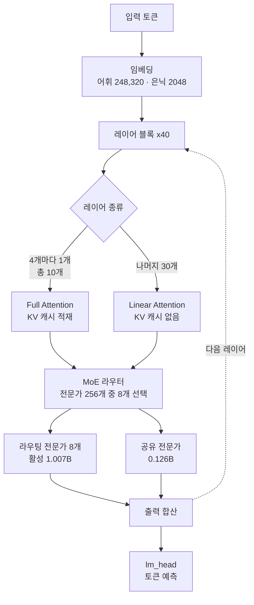

35B 모델이라는 말을 들으면 보통 GPU 여러 장을 먼저 떠올립니다. 그런데 이번에 Kwaipilot이 공개한 KAT-Coder-V2.5-Dev는 총 35B 중에서 토큰 하나당 3B만 켜지는 구조입니다. 저희가 공개된 `config.json`과 safetensors 인덱스를 직접 집계해 보니 전문가 256개 가운데 8개만 활성화되고, 라우팅되는 전문가 파라미터 32.2B 중 실제로 계산에 참여하는 몫은 1.007B였습니다. 비율로 3.12%입니다.


## 왜 읽어야 하나

이 글은 사내에 코딩 에이전트를 직접 띄우려는 플랫폼 엔지니어와, 어떤 오픈웨이트 모델에 GPU 예산을 쓸지 결정해야 하는 인프라 담당자를 위해 썼습니다. 벤치마크 순위표를 한 줄 더 보태려는 글은 아닙니다. 핵심 결론부터 말씀드리면, KAT-Coder-V2.5-Dev는 성능 대비 요구 자원이 낮아서가 아니라 **자원이 배치되는 모양이 달라서** 온프레미스에 유리합니다. 가중치는 bf16으로 65.2GiB를 잡아 H200 한 장에 들어가고, 26만 토큰짜리 긴 컨텍스트를 물려도 KV 캐시가 5GiB에 그칩니다. 이 두 숫자가 왜 그렇게 나오는지가 이 글의 내용입니다.

## 개요

Kwaipilot은 7월에 KAT-Coder-V2.5를 먼저 공개했고, 그 뒤 오픈웨이트 버전인 KAT-Coder-V2.5-Dev를 Hugging Face에 올렸습니다. 라이선스는 Apache-2.0이고, 베이스 모델은 Qwen3.6-35B-A3B입니다. 즉 처음부터 새로 학습한 모델이 아니라, 이미 검증된 MoE 백본 위에 KAT-V2.5의 사후학습 레시피를 얹은 결과물입니다.

이 구성이 흥미로운 이유는 두 가지입니다. 첫째, 사후학습만으로 베이스 대비 성능이 얼마나 올라가는지가 같은 아키텍처 안에서 깔끔하게 드러납니다. 모델 카드의 표를 보면 SWE-bench Verified 기준으로 베이스인 Qwen3.6-35B-A3B가 64.40인 데 반해 KAT-Coder-V2.5-Dev는 69.40입니다. 5점 차이가 순수하게 SFT와 RL에서 나온 셈입니다. 둘째, 베이스가 같다는 말은 서빙 스택 입장에서 새로 대응할 것이 거의 없다는 뜻이기도 합니다.

한 가지 미리 짚어둘 점이 있습니다. 이번 공개본은 언어 모델 가중치만 담고 있고 비전 타워는 빠져 있습니다. 모델 카드도 텍스트 전용으로 동작한다고 명시하고 있습니다. 저희가 체크포인트 인덱스에서 텐서 이름을 분류해 보니 실제로 vision 계열 텐서는 한 개도 잡히지 않았습니다. 이 사실이 뒤에서 설명할 서빙 옵션과 직결됩니다.

## 이 모델은 무엇인가

공개된 `config.json`의 `text_config`에서 그대로 옮긴 구성입니다.

| 항목 | 값 |
|---|---|
| 총 파라미터 | 35B (활성 3B) |
| 레이어 수 | 40 |
| 은닉 차원 | 2048 |
| 전문가 수 | 256개 중 8개 활성 |
| 전문가 중간 차원 | 512 |
| 어텐션 헤드 | 16 (KV 헤드 2, 헤드 차원 256) |
| 레이어 구성 | full attention 10개 + linear attention 30개 |
| 컨텍스트 길이 | 262,144 토큰 |
| 어휘 크기 | 248,320 |
| 라이선스 | Apache-2.0 |


주목할 부분은 아래 두 줄입니다.

먼저 전문가 구성입니다. 전문가 하나가 은닉 차원 2048에서 중간 차원 512로 오가는 아주 작은 FFN이라, 개별 전문가는 가볍고 대신 개수가 256개로 많습니다. 요즘 MoE가 공통적으로 가는 방향인데, 전문가를 잘게 쪼갤수록 라우터가 조합할 수 있는 경우의 수가 늘어나 같은 활성 파라미터로 더 넓은 표현을 만들 수 있습니다.

다음은 어텐션 구성입니다. 40개 레이어가 전부 같은 어텐션을 쓰지 않고, 네 개마다 하나씩만 full attention이고 나머지는 linear attention입니다. `layer_types` 배열을 세어 보면 full attention이 10개, linear attention이 30개입니다. KV 캐시는 full attention 레이어에서만 시퀀스 길이에 비례해 늘어나므로, 이 배치가 긴 컨텍스트 비용을 직접 결정합니다.


두 요소를 합치면 아래와 같은 흐름이 됩니다.



## 설치 및 통합

모델 카드가 제시하는 서빙 명령은 다음과 같습니다. 여기서 걸리는 부분이 하나 있어 함께 적습니다.

vLLM은 0.19.0 이상을 권장합니다.

```shell
uv pip install vllm --torch-backend=auto

vllm serve Kwaipilot/KAT-Coder-V2.5-Dev \
    --port 8000 \
    --tensor-parallel-size 8 \
    --max-model-len 262144 \
    --reasoning-parser qwen3 \
    --enable-auto-tool-choice \
    --tool-call-parser qwen3_coder \
    --language-model-only
```

마지막 줄의 `--language-model-only`가 선택 사항이 아니라 필수입니다. 앞서 말씀드린 대로 이번 공개본에는 비전 타워 가중치가 없는데, 이 플래그가 없으면 vLLM이 존재하지 않는 비전 인코더를 초기화하려다 기동에 실패합니다. 모델 카드도 같은 내용을 경고로 달아두었습니다.

SGLang은 0.5.10 이상을 권장하고, 도구 호출까지 쓰려면 파서를 지정합니다.

```shell
uv pip install sglang[all]

python -m sglang.launch_server \
    --model-path Kwaipilot/KAT-Coder-V2.5-Dev \
    --port 8000 \
    --tp-size 8 \
    --mem-fraction-static 0.8 \
    --context-length 262144 \
    --reasoning-parser qwen3 \
    --tool-call-parser qwen3_coder
```

SGLang 쪽에는 vLLM의 `--language-model-only`에 대응하는 단일 플래그가 없습니다. 버전에 따라 멀티모달 구성 요소를 로드하려다 실패할 수 있으니, 그런 경우 해당 버전의 언어 모델 전용 옵션을 `--help`에서 확인하라는 것이 모델 카드의 안내입니다.

에이전트로 쓸 때 눈여겨볼 옵션이 하나 더 있습니다. 이 모델은 기본적으로 최신 사용자 메시지에 대한 사고 블록만 유지하는데, `preserve_thinking`을 켜면 이전 턴의 사고 흔적까지 이어서 활용합니다.

```python
chat_response = client.chat.completions.create(
    model="Kwaipilot/KAT-Coder-V2.5-Dev",
    messages=messages,
    max_tokens=32768,
    temperature=0.7,
    top_p=0.8,
    presence_penalty=1.5,
    extra_body={
        "top_k": 20,
        "chat_template_kwargs": {"preserve_thinking": True},
    },
)
```

모델 카드는 이 옵션이 에이전트 시나리오에서 의사결정 일관성을 높이고, 같은 추론을 반복하지 않게 되면서 오히려 전체 토큰 소비를 줄이는 경우가 많다고 설명합니다. KV 캐시 재사용률도 함께 올라갑니다.

## 실제 실험 결과

먼저 솔직하게 밝히겠습니다. 이번에는 모델을 실제로 서빙해 추론 지연이나 처리량을 재지 못했습니다. tensor parallel 8장을 요구하는 구성을 이 환경에서 띄울 수 없었고, MCP SDK 설치처럼 별도 승인이 필요한 단계도 있었습니다. 그래서 대신 **가중치를 내려받지 않고 확인할 수 있는 것**을 전수 집계했습니다. 공개된 `config.json`과 `model.safetensors.index.json`을 받아 텐서 이름과 형상에서 파라미터 분포와 메모리 요구량을 계산했습니다. 스크립트는 `scripts/experiments/kat-coder-v25-dev/analyze_checkpoint.py`에 두었습니다.

체크포인트 구조부터 보겠습니다.

```
tensors=31333 shards=13
tensor counts by bucket: {"backbone": 451, "embedding": 2,
                          "routed_expert": 30720, "shared_expert": 160}
```

텐서 31,333개 중 30,720개가 라우팅 전문가 가중치입니다. 전체의 98%가 전문가인 셈인데, 레이어 40개에 전문가 256개, 전문가마다 gate와 up과 down 세 개의 행렬이니 40 곱하기 256 곱하기 3으로 정확히 30,720이 나옵니다. 계산이 맞아떨어지는 것을 확인하고 나면 나머지 숫자도 신뢰할 수 있습니다.

파라미터를 갈래별로 나누면 이렇습니다.

| 갈래 | 파라미터 |
|---|---|
| 라우팅 전문가 (전체) | 32.212B |
| 라우팅 전문가 (토큰당 활성) | 1.007B |
| 공유 전문가 | 0.126B |
| 라우터 | 0.021B |
| 임베딩 + lm_head | 1.017B |
| **전문가 희소성** | **3.12%** |


여기서 한 가지가 분명해집니다. 이 모델의 덩치는 거의 전부 전문가입니다. 그리고 그 전문가 중 3.12%만 매 토큰 계산에 참여합니다. 다만 **계산에 참여하지 않는 나머지도 메모리에는 올라가 있어야 합니다.** MoE를 두고 흔히 생기는 오해가 여기인데, 활성 파라미터가 3B라고 해서 3B짜리 모델처럼 메모리를 쓰지는 않습니다.

정밀도별 가중치 적재량입니다.

| 정밀도 | 전체 가중치 상주 | (참고) 활성 파라미터만 |
|---|---|---|
| bf16 | 65.2 GiB | 5.6 GiB |
| fp8 | 32.6 GiB | 2.8 GiB |
| int4 | 16.3 GiB | 1.4 GiB |

오른쪽 열은 이론값일 뿐 실제 서빙에서 도달할 수 있는 값이 아닙니다. 라우터가 어떤 전문가를 고를지 미리 알 수 없기 때문입니다. 실무에서 봐야 할 값은 왼쪽 열입니다.

그리고 이 글에서 가장 실용적인 숫자가 KV 캐시입니다.


262,144 토큰을 꽉 채운 시퀀스 하나가 잡는 KV 캐시는 bf16 기준 5.00GiB입니다. 만약 40개 레이어가 전부 full attention이었다면 같은 조건에서 20.00GiB가 필요했습니다. 하이브리드 어텐션 배치 하나로 긴 컨텍스트 비용이 75% 줄어든 것입니다. 코딩 에이전트는 저장소 전체를 컨텍스트에 밀어 넣는 일이 잦아서 동시 세션 수가 곧 KV 캐시 총량이 되는데, 이 구조에서는 같은 GPU로 네 배 많은 세션을 감당할 수 있다는 뜻이 됩니다.

가중치만 놓고 GPU 장수를 계산하면 이렇습니다. 가용률을 85%로 잡았습니다.

| GPU | bf16 (65.2GiB) | fp8 (32.6GiB) | int4 (16.3GiB) |
|---|---|---|---|
| H200 NVL 141GB | 1장 | 1장 | 1장 |
| H100 / A100 80GB | 1장 | 1장 | 1장 |
| RTX 5090 32GB | 3장 | 2장 | 1장 |
| RTX 4090 24GB | 4장 | 2장 | 1장 |

모델 카드가 `--tensor-parallel-size 8`을 예시로 든 것은 26만 토큰 컨텍스트를 여러 세션에 걸쳐 최대 처리량으로 돌리는 상황을 가정한 값입니다. 가중치와 단일 시퀀스 KV만 놓고 보면 H200 한 장에 65.2 더하기 5.0으로 70.2GiB이니 여유가 남습니다. 팀 단위 사내 코딩 어시스턴트처럼 동시 사용자가 수십 명 수준이라면 시작 지점이 8장일 필요는 없습니다.

## ThakiCloud 제품 적용 시사점

이 모델은 저희 두 제품 모두에 걸칩니다.

**ai-platform 관점**입니다. ThakiCloud의 ai-platform은 Kubernetes와 Kueue로 GPU를 나눠 쓰는 멀티테넌트 AI/ML 인프라입니다. 위 계산이 실제로 의미가 있는 지점이 여기입니다. bf16 65.2GiB는 H200 NVL 한 장 안에 들어가므로, 이 모델을 팀별 코딩 어시스턴트로 띄울 때 노드 전체를 점유하는 대신 GPU 한 장짜리 워크로드로 스케줄링할 수 있습니다. 남은 GPU는 다른 테넌트의 학습 잡이 씁니다. 여기에 더해 베이스인 Qwen3.6-35B-A3B는 이미 사내 모델 레지스트리에 스테이징되어 있어서, 클러스터 안에서 가중치를 당겨오는 편이 외부에서 내려받는 것보다 훨씬 빠릅니다. 사내 소스 코드를 외부 API에 보내지 않고 코딩 어시스턴트를 운영해야 하는 고객, 특히 망 분리나 소버린 요건이 있는 환경에서 Apache-2.0 라이선스와 이 크기의 조합은 현실적인 선택지입니다.

**Paxis 관점**입니다. Paxis는 ai-platform 위에서 도는 Agent-Native Cloud 제어 평면으로, Skills와 Tools와 Policies와 Audit Logs를 일급 리소스로 다룹니다. 그래서 저희가 이 모델에서 가장 눈여겨본 대목은 벤치마크 점수가 아니라 이상 행동 수치였습니다. 모델 카드는 RL 학습으로 비정상 도구 레이블이 9.34%에서 0.28%로, 단일 턴 반복 생성이 0.34%에서 0%로 줄었다고 밝힙니다. 에이전트 하네스를 운영해 보면 알 수 있듯이, 도구 호출이 100번 중 9번씩 깨지는 모델은 아무리 추론이 좋아도 자동화에 넣을 수 없습니다. 재시도와 파싱 예외 처리가 파이프라인을 잠식하기 때문입니다. Paxis가 960개가 넘는 스킬을 BM25로 골라 격리 샌드박스에서 실행하고 모든 행동을 정책 게이트와 감사 로그로 통과시키는 구조에서, 도구 호출 신뢰도는 곧 하네스 전체의 신뢰도입니다. 소수점 자리의 개선처럼 보이는 이 숫자가 실제 운영에서는 체감 차이를 만듭니다.


학습 레시피에도 참고할 대목이 있습니다. Kwaipilot은 하네스 실행 피드백에서 계층적 보상을 만들었다고 설명합니다. 실패한 시도라도 중간에 의미 있는 진전이 있었다면 부분 점수를 주는 방식인데, 성공과 실패만 나누는 이진 보상보다 학습 신호가 촘촘해집니다. 저희가 에이전트 루프에 검증 게이트를 붙일 때 통과와 실패만이 아니라 어디까지 갔는지를 함께 기록하는 것과 같은 발상입니다.

## 한계 및 반론

가장 큰 제약은 벤치마크 수치가 전부 제작자 발표라는 점입니다. SWE-bench Verified 69.40이라는 숫자는 독립 검증 전까지 참고값으로 두는 편이 안전합니다. 특히 에이전틱 코딩 벤치마크는 하네스 구성과 시도 횟수에 따라 점수가 크게 흔들립니다. Terminal-Bench 2.1 항목에서 KAT-Coder-V2.5-Dev의 평균이 41.02인데 하네스별 값이 32.60과 49.44로 나뉘어 표기된 것 자체가 그 변동성을 보여줍니다.

두 번째로, 이 글의 숫자는 전부 정적 분석 결과입니다. 실제 서빙에서는 활성값 메모리와 CUDA 그래프 버퍼와 조각화가 더해지므로 위 표보다 여유를 두고 잡아야 합니다. 특히 MoE는 전문가 로드가 배치마다 불균형해지는 문제가 있어서, 텐서 병렬과 전문가 병렬을 어떻게 섞느냐에 따라 실제 처리량이 크게 달라집니다. 저희가 계산한 것은 하한선이지 운영 사양이 아닙니다.

세 번째로, 비전 타워가 빠졌다는 사실은 생각보다 넓게 영향을 미칩니다. 스크린샷을 읽고 UI를 고치는 작업이나 다이어그램을 해석하는 작업은 이 공개본으로 할 수 없습니다. 코딩 에이전트의 용도가 텍스트 저장소 작업에 한정된다면 문제가 없지만, 프런트엔드 쪽 자동화를 염두에 두셨다면 다른 선택지를 함께 검토하셔야 합니다.

마지막으로 반대 방향의 주장도 짚어두겠습니다. 3B 활성이라는 사실이 곧 저렴함을 뜻하지는 않습니다. 앞서 본 대로 메모리는 35B 모델만큼 필요하고, 절약되는 것은 연산량입니다. 이미 GPU 메모리가 병목인 환경이라면 이 모델의 이점은 생각보다 작을 수 있습니다. 반대로 GPU는 있는데 처리량이 부족한 환경이라면 이점이 큽니다. 어느 쪽인지 먼저 확인하시는 편이 좋겠습니다.

## 정리

KAT-Coder-V2.5-Dev를 두고 저희가 확인한 것은 세 가지입니다. 전문가 256개 중 8개만 켜지는 3.12% 희소성으로 연산량을 줄이고, 40개 레이어 중 10개만 full attention으로 두어 26만 토큰 KV 캐시를 5GiB에 묶고, 그 결과 bf16 가중치 65.2GiB가 H200 한 장 안에 들어갑니다. 서두에서 말씀드린 결론이 여기서 회수됩니다. 이 모델이 온프레미스에 맞는 이유는 작아서가 아니라 자원이 놓이는 자리가 다르기 때문입니다.

그래서 다음 행동은 분명합니다. 사내 코딩 어시스턴트를 검토하신다면 GPU 여덟 장짜리 예시 명령을 기준선으로 삼지 마시고, 동시 세션 수부터 정한 다음 KV 캐시를 역산해 필요한 장수를 구하시기 바랍니다. 이 글에 쓴 계산 스크립트를 그대로 돌리면 다른 MoE 모델에도 같은 방식으로 적용할 수 있습니다. 그리고 도입을 결정하기 전에 벤치마크 점수보다 도구 호출 실패율을 먼저 재보시길 권합니다. 에이전트를 운영하는 입장에서는 그쪽이 훨씬 정직한 지표입니다.

## 출처

- [Kwaipilot/KAT-Coder-V2.5-Dev 모델 카드](https://huggingface.co/Kwaipilot/KAT-Coder-V2.5-Dev)
- [KAT-Coder 기술 보고서](https://huggingface.co/papers/2607.05471)
- [KAT-Coder 프로젝트 페이지](https://kwaipilot.github.io/KAT-Coder/)
