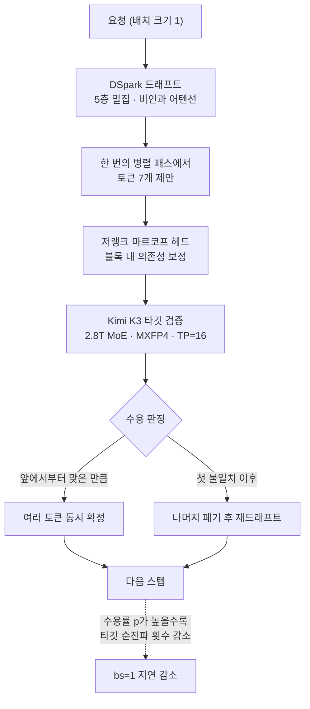

서빙 벤치마크는 대부분 처리량을 자랑합니다. 배치를 키우고 동시 요청을 늘려서 초당 총 토큰 수를 보여 주는 식입니다. 그런데 코딩 에이전트나 추론 모델을 붙여 쓰는 쪽에서는 그 숫자가 잘 와닿지 않습니다. 사용자는 한 번에 하나의 응답을 기다리고 있고, 그 응답이 끝나야 다음 도구 호출이 시작되기 때문입니다. 이번에 vLLM이 공개한 숫자는 그 자리를 정확히 겨냥합니다. 배치 크기 1에서 464 tok/s입니다.


## 왜 읽어야 하나

이 글은 사내에 추론 모델이나 코딩 에이전트를 직접 서빙하시는 플랫폼 엔지니어와, GPU 투자 대비 체감 응답 속도를 책임지는 분들을 위한 글입니다. 어느 모델이 더 똑똑한가를 비교하려는 분보다는, 같은 하드웨어에서 단일 스트림 지연을 어떻게 줄일 수 있는지 알고 싶은 분에게 쓸모가 큽니다. 핵심 결론을 먼저 말씀드립니다. 단일 스트림 속도를 결정하는 변수는 GPU를 몇 장 붙였는가가 아니라 드래프트 토큰이 얼마나 받아들여지는가이고, 그래서 투기 디코딩의 이득은 워크로드의 예측 가능성에 정비례합니다. 저희가 공개 수치로 역산해 보니 3.14배 가속의 뒤에는 토큰당 수용률 0.73 언저리가 있었고, 수용률이 0.9에서 0.6으로 떨어지면 같은 하드웨어에서 속도가 절반 아래로 내려갑니다.

## 개요

Moonshot AI의 Kimi K3는 총 파라미터 2.8T의 Mixture-of-Experts 모델입니다. 토큰당 896개 전문가 중 16개를 활성화하고, 컨텍스트는 최대 100만 토큰이며, 비전을 포함한 네이티브 멀티모달을 지원합니다. 어텐션은 선형과 풀 어텐션을 섞은 Kimi Delta Attention이고, 가중치는 네이티브 MXFP4로 배포됩니다.

vLLM은 이 모델을 공개 당일부터 지원했습니다. 2026년 7월 27일 공개된 릴리스 노트에는 FlashKDA 통합, KDA 디코드와 프로젝션 및 컨볼루션 퓨전, AttnRes 퓨전, MLA 모듈 재구현, SiTU를 활성화한 MXFP4 MoE 실행 경로, 전문가 라우팅 최적화가 들어 있습니다. 검증은 16 GPU DP16 및 EP16 구성에서 이뤄졌습니다.

같은 글에 실린 단일 스트림 수치가 이 글의 출발점입니다. 투기 디코딩 없이 118 tok/s, DSpark 드래프트 모델을 붙여 370 tok/s로 3.14배였습니다. 그리고 이틀 뒤인 7월 29일, vLLM 팀은 같은 조합에서 464 tok/s라는 새 최고치를 알렸습니다. 조건은 저엔트로피 추론 워크로드, 배치 크기 1, 텐서 병렬 16입니다. 공개 이미지 `vllm/vllm-openai:kimi-k3`와 Inferact의 DSpark 드래프트 모델로 재현 가능하다고 밝히고 있습니다.

## 이 기술은 무엇인가

투기 디코딩 자체는 새롭지 않습니다. 작고 빠른 드래프트 모델이 다음 토큰 여러 개를 미리 제안하고, 크고 정확한 타깃 모델이 그 후보들을 한 번의 순전파로 검증합니다. 맞은 만큼 한꺼번에 확정하고 틀린 지점부터 버립니다. 타깃 모델의 순전파 횟수가 줄어드는 만큼 빨라집니다.

DSpark가 기존 접근과 다른 지점은 드래프트를 만드는 방식입니다. EAGLE 계열이 타깃 모델의 마지막 은닉 상태를 받아 한 토큰씩 자기회귀로 이어 붙인다면, DSpark는 비인과 어텐션을 쓰는 5층 밀집 블록 디퓨전 백본으로 7개 토큰을 한 번의 병렬 패스에서 한꺼번에 뽑습니다. 블록 안의 토큰 사이 의존성은 저랭크 순차 마르코프 헤드가 따로 채워 주고, 신뢰도 헤드가 자원 인지 스케줄링에 쓰일 확신도를 내놓습니다. 드래프트를 만드는 데 드는 순차 단계 수 자체가 줄어드는 구조입니다.

학습 방식에도 실무적인 선택이 있습니다. 드래프트는 vLLM에서 직접 뽑아낸 타깃 은닉 상태로 학습됩니다. 학습에서 본 수치와 추론에서 만나는 수치가 같은 엔진에서 나온다는 뜻입니다. 양자화와 커널 퓨전이 겹겹이 들어간 서빙 스택에서 드래프트와 타깃의 분포가 어긋나면 수용률이 떨어지는데, 그 어긋남을 학습 단계에서 없앤 셈입니다. 모델 카드는 이 구조가 긴 컨텍스트에서도 수용률을 유지한다고 밝히면서 약 95,000 토큰 규모의 다문서 프롬프트로 구성된 AA-LCR에서 검증했다고 적고 있습니다.



## 실제 실험 결과

먼저 분명히 해 둘 부분이 있습니다. 저희는 이 벤치마크를 재현하지 않았습니다. 재현에는 GB300 16장이 필요하고 저희 사내 클러스터에는 그 구성이 없습니다. 아래 내용은 공개된 수치를 앵커로 삼아 비용 모델을 명시하고 역산한 계산값이며, 실측이 아닙니다.

앵커로 쓴 공개 수치는 셋입니다.

| 구성 | bs=1 디코딩 | 출처 |
|---|---:|---|
| Kimi K3, 투기 디코딩 없음 | 118 tok/s | vLLM 블로그 (2026-07-27) |
| Kimi K3 + DSpark | 370 tok/s (3.14배) | vLLM 블로그 (2026-07-27) |
| Kimi K3 + DSpark, 이후 최고치 | 464 tok/s | vLLM 공지 (2026-07-29) |

하드웨어 표기는 출처마다 조금씩 다릅니다. 블로그는 GB300 NVL72 16장을, 공지는 4×4 GB300을, 모델 카드는 4 × GB300에 텐서 병렬 16을 적고 있습니다. 셋 다 텐서 병렬 16, 즉 GPU 16장을 가리키는 것으로 읽었습니다. 다만 464 tok/s는 118 tok/s와 다른 날 다른 공지에서 나온 값이므로, 두 수치를 나눈 3.93배는 같은 실험 안의 통제된 비교가 아닙니다. 이 점을 감안하고 보셔야 합니다.

역산에 쓴 모델은 단일 스트림 투기 디코딩의 표준적인 형태입니다. 한 스텝에서 타깃이 후보 `1 + γ`개를 한 번에 검증하고, 드래프트 패스 비용은 타깃 패스 비용의 `r`배라고 둡니다. 토큰당 수용 확률을 `p`로 두고 독립을 가정하면 스텝당 기대 확정 토큰 수는 `(1 - p^(γ+1)) / (1 - p)`이고, 가속비는 이 값을 `1 + r`로 나눈 값입니다. `γ`는 모델 카드가 밝힌 7을 그대로 썼고, `r`은 2.8T MoE 타깃 대비 5층 밀집 드래프트라는 점을 근거로 0.10을 가정했습니다. 이 0.10은 저희의 가정이며 공개된 수치가 아닙니다.

```
=== implied per-token acceptance p ===
p implied by 3.14x        0.7347   E[accepted]/step 3.45
p implied by 3.93x        0.8129   E[accepted]/step 4.33
```

3.14배 뒤에는 토큰당 수용률 0.73, 스텝당 확정 토큰 3.45개가 있습니다. 7개를 제안해서 평균 3.45개를 건지는 셈입니다. 464 tok/s에 해당하는 3.93배는 수용률 0.81, 스텝당 4.33개가 됩니다. 이틀 사이의 개선이 대략 수용률 0.07 정도의 차이로 설명된다는 뜻입니다. 드래프트 모델이든 커널이든, 이 구간에서의 작업은 수용률을 몇 퍼센트포인트 끌어올리는 싸움입니다.


민감도를 펼쳐 보면 왜 vLLM이 저엔트로피 추론 워크로드라는 조건을 명시했는지 분명해집니다.

| 수용률 p | 가속비 | 환산 tok/s |
|---:|---:|---:|
| 0.95 | 6.12배 | 722.1 |
| 0.90 | 5.18배 | 611.0 |
| 0.80 | 3.78배 | 446.4 |
| 0.70 | 2.86배 | 337.0 |
| 0.60 | 2.23배 | 263.7 |
| 0.50 | 1.81배 | 213.7 |

수용률이 0.9에서 0.6으로 떨어지면 같은 GPU 16장에서 611 tok/s가 264 tok/s가 됩니다. 하드웨어는 하나도 바뀌지 않았는데 체감 속도는 절반 아래입니다. 투기 디코딩의 이득이 워크로드 의존적이라는 말은 이런 뜻입니다. 정형화된 추론 체인이나 반복적인 코드 생성처럼 다음 토큰이 예측 가능한 작업에서는 드래프트가 잘 맞고, 창작이나 개방형 대화처럼 분기가 넓은 작업에서는 같은 설정으로도 이득이 크게 줄어듭니다.

여기서 한 가지 실무적인 함의가 나옵니다. 투기 디코딩을 도입할지 판단할 때 벤더가 공개한 가속 배수를 그대로 옮겨 적으면 거의 틀립니다. 그 배수는 특정 워크로드에서 관측된 수용률의 결과이지 기술의 고정 성능이 아니기 때문입니다. 판단에 필요한 것은 우리 트래픽의 수용률이고, 그 값은 남의 벤치마크에서 빌려 올 수 없습니다. 다행히 이 값은 직접 재기 어렵지 않습니다. vLLM은 투기 디코딩을 켜면 제안 토큰 수와 수용 토큰 수를 지표로 내보내므로, 실제 트래픽을 흘려 보내면서 그 비율만 집계하면 됩니다. 저희가 권하는 순서는 가속 배수를 목표로 잡는 대신 수용률을 먼저 재고, 위 표에서 그 수용률에 해당하는 지점을 읽는 것입니다. 그러면 도입 여부가 기대가 아니라 계산으로 정해집니다.

드래프트 토큰 수 `γ`도 함께 볼 값입니다. 수용률이 낮은 워크로드에서 `γ`를 크게 잡으면 버려지는 후보가 늘어 드래프트 비용만 커집니다. 반대로 수용률이 충분히 높다면 `γ`를 키울수록 스텝당 확정 토큰이 늘어납니다. DSpark가 7을 택한 것도 이 균형점에 대한 선택으로 보입니다.

## ThakiCloud 제품 적용 시사점

이 숫자가 저희에게 중요한 이유는 두 가지입니다.

첫째, ai-platform 관점입니다. 저희는 K8s 위에서 Kueue로 GPU를 스케줄링하고 vLLM으로 모델을 서빙합니다. 서빙 용량을 늘리는 통상적인 방법은 배치를 키우고 동시 요청을 모으는 것인데, 이 방식은 총 처리량은 올려도 개별 응답의 지연은 줄이지 못합니다. 투기 디코딩은 반대편의 손잡이입니다. 같은 GPU 수에서 단일 스트림 지연을 직접 줄이므로, 온프레미스로 들어오는 고객처럼 GPU를 더 붙일 수 없는 환경에서 특히 값이 큽니다. 다만 이 손잡이는 워크로드마다 이득이 다르므로, 서빙 프로필을 워크로드별로 나누는 편이 낫습니다. 저희가 이미 운영 중인 이중 풀 토큰 예산 라우팅과 같은 방향입니다.

둘째, Paxis 관점입니다. Paxis는 ai-platform 위에서 도는 Agent-Native Cloud 제어 평면이고, 에이전트 루프가 실제 워크로드입니다. 에이전트 실행은 본질적으로 배치 크기 1입니다. 스킬을 고르고, 도구를 부르고, 결과를 보고, 다음 행동을 정하는 각 단계가 앞 단계의 완료를 기다립니다. DAG로 멀티에이전트를 병렬화해도 개별 노드 안에서는 여전히 한 스트림입니다. 그래서 에이전트 플랫폼에서 단일 스트림 디코딩 속도는 그대로 사용자 체감 시간이 됩니다.

여기에 좋은 소식이 하나 겹칩니다. 에이전트 워크로드는 대체로 저엔트로피입니다. 정해진 스킬 계약을 따르고, 정해진 스키마로 도구를 호출하고, 정해진 형식으로 결과를 냅니다. 저희가 포맷을 코드가 소유하도록 파이프라인을 설계해 온 이유는 품질 일관성 때문이었는데, 그 선택이 투기 디코딩의 수용률에도 유리하게 작용합니다. 출력이 규격화될수록 드래프트가 잘 맞습니다. 반대로 자유 서술이 많은 경로에서는 같은 이득을 기대하기 어렵습니다.

## 한계 및 반론

먼저 이 글의 계산에 대한 반론입니다. 토큰당 수용을 독립으로 두는 가정은 실제와 다릅니다. 드래프트가 한 번 어긋나면 그 뒤 토큰들이 함께 틀릴 가능성이 높으므로, 실제 수용은 앞쪽에 몰리고 뒤쪽에서 급격히 떨어지는 형태가 됩니다. DSpark가 블록 내 의존성을 별도 헤드로 보정하는 것도 이 상관을 다루기 위해서입니다. 따라서 저희가 역산한 0.73과 0.81은 같은 가속비를 만들어 내는 등가 수용률이지, 측정된 수용률이 아닙니다.

드래프트 비용 비율 0.10도 가정입니다. 실제 비율은 커널 구현과 배치 형태, 어텐션 백엔드에 따라 달라집니다. 이 값을 0.05로 낮추면 같은 가속비를 설명하는 수용률이 내려가고, 0.2로 올리면 올라갑니다. 곡선의 형태와 기울기는 유지되지만 절대값은 이동합니다.

기술 자체의 한계도 있습니다. 투기 디코딩은 드래프트 모델을 하나 더 메모리에 올려야 하고, 여기서는 그 드래프트가 타깃과 같은 서빙 스택에 정합해야 합니다. 타깃 모델을 바꾸면 드래프트도 다시 준비해야 합니다. 배치를 키우면 타깃 순전파가 이미 잘 채워지므로 투기 디코딩의 상대 이득은 줄어듭니다. 이번 수치가 배치 크기 1에서 나왔다는 점을 그대로 받아들여야 하고, 동시 사용자가 많은 서비스에 그대로 옮겨 적을 수는 없습니다.

마지막으로 접근성 문제가 남습니다. 이 벤치마크의 전제는 2.8T 모델을 16장짜리 GB300에 올릴 수 있다는 것입니다. 대부분의 온프레미스 고객에게 이 구성은 현실적이지 않습니다. 저희가 앞선 글에서 K3 가중치만으로 H200 11장이 필요하다고 집계했던 것과 같은 이야기입니다. 이 글에서 옮겨 올 수 있는 것은 464라는 숫자가 아니라 수용률이 손잡이라는 구조적 사실입니다.

## 정리

vLLM이 공개한 Kimi K3의 배치 1 디코딩 수치는 118 tok/s에서 시작해 DSpark를 붙여 370 tok/s가 됐고, 이틀 뒤 464 tok/s까지 올라갔습니다. 저희가 명시한 비용 모델로 역산해 보니 그 차이는 토큰당 수용률 0.73에서 0.81 사이의 이동으로 설명됩니다. 수용률이 0.9에서 0.6으로 떨어지면 같은 하드웨어에서 속도가 절반 아래로 내려갑니다.

서두의 결론을 다시 확인해 드립니다. 단일 스트림 속도를 정하는 것은 GPU 장수가 아니라 드래프트 토큰이 얼마나 받아들여지는가입니다. 그래서 투기 디코딩을 도입할 때 먼저 물어야 할 것은 몇 배 빨라지느냐가 아니라 우리 워크로드가 얼마나 예측 가능한가입니다.

에이전트를 서빙하시는 분께 권해 드리는 다음 행동은 간단합니다. 자사 트래픽을 저엔트로피 경로와 개방형 경로로 나눠 각각의 수용률을 먼저 재 보시기 바랍니다. 그 수치가 나오면 투기 디코딩에 얼마를 투자할지, 어느 경로에만 켤지가 계산으로 결정됩니다. 저희도 같은 순서로 진행할 계획이며, 에이전트 루프의 규격화된 출력 경로부터 측정할 생각입니다.

## 출처

- [vLLM 공지: Kimi-K3 bs=1 디코딩 464 tok/s (2026-07-29)](https://x.com/vllm_project/status/2082267336279814173)
- [vLLM 블로그: Kimi K3 Is Here: Efficient Day-0 Support on vLLM (2026-07-27)](https://vllm.ai/blog/2026-07-27-k3)
- [vLLM 블로그: A Preview of Production-Scale Kimi K3 Support on vLLM](https://vllm.ai/blog/2026-07-22-kimi-k3-preview)
- [Inferact/Kimi-K3-DSpark 모델 카드](https://huggingface.co/Inferact/Kimi-K3-DSpark)
- [moonshotai/Kimi-K3 모델 카드](https://huggingface.co/moonshotai/Kimi-K3)
- [vLLM 레시피: moonshotai/Kimi-K3](https://recipes.vllm.ai/moonshotai/Kimi-K3)
- 역산 스크립트와 원시 로그: `scripts/experiments/kimi-k3-dspark-bs1-decode/spec_decode_acceptance.py`, `outputs/blog-impl/kimi-k3-dspark-bs1-decode/run-1.log`
