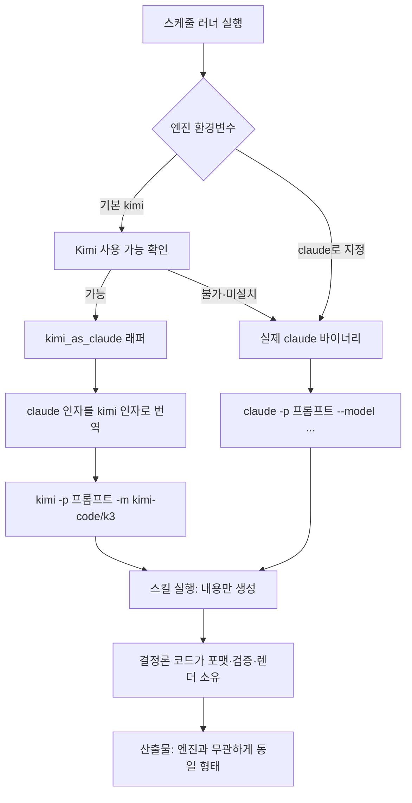

> 📊 **슬라이드 요약 (NotebookLM)**: 글 전체를 읽기 전에 핵심만 슬라이드로 보고 싶다면 [3층 비용 절감 슬라이드 덱 (PDF)](/assets/images/2026-07-30-launchd-fleet-model-cost-kimi-nlm-ko.pdf)를 참고하세요.

매일 아침 수십 개의 자동화가 Claude API로 깨어나는 환경이라면, 모델 티어를 한 칸 내리는 것만으로 API 청구서의 40~60%가 사라집니다. 더 의외의 사실은, 흔히 "저렴한 대안"으로 알려진 Kimi K3조차 output 토큰 정가는 Claude Sonnet 5와 똑같다는 점입니다. 그래서 비용 최적화의 핵심은 "어느 모델이 싼가"가 아니라 "어떤 작업을 어느 티어로 내려도 안전한가"를 가르는 판단에 있습니다.

저희 맥에서는 90개의 사용자 영역 `launchd` 작업이 돌고 있습니다. 뉴스 다이제스트, 영업 브리프, 트위터 포스팅, 사내 리포트, 밤중 논문 작성, 주식 모니터까지 대부분이 헤드리스 LLM 호출을 씁니다. 이 플릿의 모델을 단계적으로 낮추면서 실제 청구서가 어떻게 움직였는지, 그리고 무엇을 낮춰도 되고 무엇은 건드리면 안 되는지를 이 글에 정리했습니다. 운영자 입장에서 바로 적용할 수 있는 숫자와 가드레일이 목표입니다.

## 먼저 결론: 비용 지도는 세 층으로 나뉩니다

작업을 실제로 옮겨 보면 절감은 한 방에 오지 않고 세 개의 층으로 쌓입니다. 첫째 층은 Opus에서 Sonnet으로 내리는 것으로, 여기서 40~60%가 한 번에 빠집니다. 둘째 층은 Sonnet에서 Kimi K3로 옮기는 것인데, 놀랍게도 metered API 정가로는 추가 절감이 거의 없습니다. K3의 진짜 값어치는 정액 구독과 캐시 할인, 그리고 Claude 주간 한도를 건드리지 않는다는 데 있습니다. 셋째 층은 아직 대부분 손대지 않은 영역으로, 가벼운 분류·요약 작업을 Haiku나 Kimi K2.5 같은 더 작은 모델로 내리면 여기서 80~89%가 추가로 빠집니다.

이 순서가 중요합니다. 많은 팀이 "더 싼 모델로 갈아타자"부터 생각하지만, 실제로 청구서를 가장 크게 줄이는 첫 삽은 티어를 한 칸 내리는 것이고, 그다음이 작업별 라이트사이징이며, 벤더 교체는 그 위에 얹는 마지막 손질입니다.

## 첫째 층, Opus에서 Sonnet으로 내려 챙긴 절감

기준 가격부터 고정하겠습니다. 2026년 7월 기준 Anthropic의 100만 토큰당 API 정가는 Opus 5가 입력 5달러·출력 25달러, Sonnet 5가 입력 3달러·출력 15달러(2026년 8월 31일까지는 입력 2달러·출력 10달러의 프로모션가), Haiku 4.5가 입력 1달러·출력 5달러, 그리고 최상위 Fable 5가 입력 10달러·출력 50달러입니다.

여기서 눈여겨볼 규칙이 하나 있습니다. 모든 티어에서 출력 토큰이 입력의 5배로 책정된다는 점입니다. 자동화 작업은 대개 긴 컨텍스트를 읽고 짧게 결정을 내리지만, 에이전트형 작업은 사고 과정과 도구 호출로 출력이 부풀기 쉽습니다. 그래서 티어를 내릴 때 체감 절감은 출력 비중이 높은 작업에서 더 크게 나타납니다.

중간 규모의 에이전트형 작업 한 건이 입력 30만 토큰과 출력 8만 토큰을 쓴다고 가정해 보겠습니다(플릿 평균에 맞춘 추정치입니다[추정]). Opus 5로 돌리면 한 건에 약 3.5달러, Sonnet 5 표준가로는 약 2.1달러, 프로모션가로는 약 1.4달러가 나옵니다. Opus 대비 표준가로 40%, 프로모션가로 60%가 그대로 사라집니다. 하루 30건, 한 달 900건을 돌린다고 보면 월 3,150달러가 1,890달러 또는 1,260달러로 내려갑니다[추정]. 코드가 포맷과 검증을 소유하는 오케스트레이션 작업이라면 이 강등은 품질 손실이 거의 없이 이뤄집니다.

## 둘째 층, Kimi K3의 진짜 값어치는 정가가 아닙니다

여기서 가장 흔한 오해를 바로잡아야 합니다. Kimi K3의 API 정가는 100만 토큰당 입력 3달러(캐시 미스), 출력 15달러입니다. 이 숫자는 Sonnet 5 표준가와 정확히 같고, Sonnet 5 프로모션가보다는 오히려 비쌉니다. 게다가 K3는 항상 사고(thinking)하는 모델이라 추론 토큰이 출력으로 과금되므로, 눈에 보이는 답변보다 사고 과정이 더 많은 토큰을 먹는 경우도 있습니다.

그러니 "K3라서 싸다"는 표현은 metered API 기준으로는 정확하지 않습니다. 정확한 문장은 이렇습니다. "K3는 정액 구독으로 돌릴 수 있어 Claude의 주간 한도를 소모하지 않고, 캐시 히트 입력이 100만 토큰당 0.3달러로 10배 저렴하다." 저희 플릿이 Kimi Code 구독의 헤드리스 토큰으로 돌아가는 이상, 개별 호출은 사실상 정액제 안에서 소진되며 Claude의 종량·주간 한도와 완전히 분리됩니다. 아침 8시에 90개 작업이 동시에 깨어나 한 계정의 주간 한도를 태워 버리던 문제가, 부하를 두 벤더로 쪼개는 것만으로 사라집니다.

캐시 관점도 중요합니다. 같은 시스템 프롬프트와 스킬 정의를 반복해서 싣는 헤드리스 작업은 입력의 상당 부분이 캐시 히트로 잡힙니다. K3의 캐시 히트 입력이 0.3달러라면, 앞의 예시에서 입력의 80%가 캐시된다고 볼 때 한 건 비용은 약 1.45달러로 내려가 Sonnet 프로모션가와 비슷해집니다[추정]. 결론적으로 Sonnet에서 K3로의 이동은 "추가로 싸진다"가 아니라 "비용은 비슷하되 Claude 쿼터를 해방하고 벤더 리스크를 분산한다"로 이해하는 편이 정직합니다.

## 셋째 층, 아직 안 챙긴 가장 큰 레버는 라이트사이징입니다

진짜 큰 절감은 벤더 교체가 아니라 작업별 라이트사이징에 있습니다. 플릿의 candidate 60개 중 상당수는 헬스체크, 상태 비교, 뉴스 분류, 다이제스트 요약처럼 판단이 가볍고 포맷이 코드로 고정된 작업입니다. 이런 작업을 Haiku 4.5(입력 1달러·출력 5달러)나 Kimi K2.5(입력 0.6달러·출력 2.5달러)로 내리면, 앞의 예시 기준 한 건이 각각 약 0.7달러와 0.38달러로 떨어집니다. Opus 대비 80~89% 절감입니다[추정].

여기에 함정도 하나 있습니다. candidate로 분류된 60개 중 다수는 사실 순수 파이썬 모니터라 LLM 호출 자체가 없습니다. 이런 작업은 "옮길 것이 없는" 것이므로 비용 계산에서 빼야 합니다. 실제 절감의 무대는 LLM을 호출하는 리포트·다이제스트·오케스트레이션 작업이고, 그 안에서 판단 난도에 따라 티어를 정밀하게 배정하는 것이 핵심입니다.

## 모델을 바꿔도 산출물이 흔들리지 않게 만드는 여섯 가지 가드레일

모델을 낮추거나 벤더를 바꿀 때 가장 큰 두려움은 "산출물 품질이 조용히 나빠지는 것"입니다. 저희가 이 두려움을 관리하는 방식은 하나로 요약됩니다. 모델에게는 내용만 생성시키고, 포맷·수치·검증·렌더링은 결정론적 코드가 소유하게 하는 것입니다. 그러면 모델은 자유 변수가 되고, 아래 여섯 가지 장치가 교체의 안전벨트가 됩니다.

가장 먼저, 포맷을 코드가 소유합니다. 워커는 본문 텍스트만 반환하고, 글자 수·상태 enum·우선순위·헤더·이모지 같은 렌더링은 결정론 스크립트가 붙입니다. 모델이 무엇을 쓰든 최종 산출물의 모양이 같으므로, 티어를 내려도 포맷이 흔들리지 않습니다.

능력은 하네스가 아니라 스킬에 쌓습니다. 러너는 얇게 유지하고 도메인 지식과 절차는 스킬에 둡니다. 그러면 엔진은 러너 바깥의 교체 가능한 변수가 됩니다. 저희는 `claude -p` 호출을 그대로 두고, 엔진만 `kimi -p`로 번역하는 얇은 래퍼와 공용 리졸버를 만들었습니다. 스킬과 프롬프트는 단 한 줄도 바뀌지 않습니다.

검증 게이트는 코드가 판정합니다. 트윗 작성기는 글자 수와 출처 개수를 정규식과 `len()`으로 실측해 통과 여부를 정하고, 코드 작업은 테스트의 종료 코드로 통과를 판정합니다. 품질을 모델의 자기 보고가 아니라 결정론 검사가 주장하므로, 약한 모델이 게이트를 통과하면 그대로 쓰고 실패하면 자동으로 재배포합니다.

폴백과 가역성은 기본값입니다. 엔진 리졸버는 Kimi가 없거나 실행 불가일 때 자동으로 Claude로 되돌아갑니다. 특정 작업을 되돌리고 싶으면 환경 변수 한 줄이면 충분합니다. 교체가 절대 플릿을 멈추지 않게 만드는 것이 원칙입니다.

스왑은 스코프로 제한합니다. 플릿 전체를 무작정 한 모델로 바꾸지 않습니다. 값싼 워커 단계만 K3로 내리고, 품질이 결과물 자체인 단계는 상위 모델에 고정합니다. 예를 들어 트위터 자동화에서 개별 트윗 작성기는 K3로 내렸지만, 블로그 초안 작성 단계는 Opus에 그대로 고정했습니다. 한 러너 안에서도 단계별로 엔진을 다르게 배정하는 것이 핵심입니다.

마지막으로, 승격은 회고 기반으로만 합니다. 모든 스케줄 작업은 값싼 모델로 시작하고, 연속 실패가 임계를 넘을 때만 그 작업에 한해 상위 모델로 자동 승격합니다. 성공하면 다시 내려갑니다. 비용은 데이터가 요구할 때만 올리고, 그 전에는 최저 티어를 유지합니다.

## 엔진 교체는 이렇게 흐릅니다

아래는 러너 하나가 엔진을 고르는 흐름입니다. 스킬과 프롬프트는 그대로 두고, 리졸버가 엔진 바이너리만 바꿔 끼웁니다.

핵심은 마지막 두 단계입니다. 어느 엔진을 타든 스킬은 내용만 생성하고, 결정론 코드가 포맷과 검증을 소유하므로 최종 산출물의 모양은 엔진과 무관하게 같습니다. 이것이 없으면 모델 교체는 매번 포맷 회귀와의 싸움이 됩니다.

## ThakiCloud 관점에서 본 플랫폼 운영 시사점

이 실험은 저희가 AI 플랫폼을 운영하며 지켜 온 원칙 하나를 다시 확인해 줍니다. 품질은 모델 등급이 아니라 하네스가 결정한다는 것입니다. 포맷·검증·렌더링을 코드가 소유하면 모델은 비용·가용성·주권을 기준으로 자유롭게 고를 수 있는 변수가 됩니다. 이는 저희가 고객에게 제공하는 멀티 클러스터 추론 플랫폼의 라우팅 철학과 정확히 같습니다. 요청의 난도에 따라 모델과 GPU 풀을 정밀 배정하고, 품질 게이트는 인프라가 소유하는 구조입니다.

비용 관점에서도 시사점이 분명합니다. 헤드리스 자동화 플릿을 운영하는 조직이라면, 벤더 협상보다 먼저 해야 할 일은 작업별 티어 배정과 캐시 활용, 그리고 부하의 벤더 분산입니다. 온프레미스나 사설 클러스터에서 오픈 웨이트 모델을 직접 서빙하는 선택지까지 더하면, 같은 워크로드를 훨씬 낮은 한계비용으로 돌릴 수 있습니다. 저희가 온프레미스 GPU 위에서 vLLM 기반 서빙과 Kueue 스케줄링으로 추론 단가를 낮춰 온 방식이 바로 이 연장선에 있습니다.

무엇을 낮추지 말아야 하는지도 분명히 해 둡니다. 산출물 자체가 사람이 읽는 긴 산문의 품질인 작업, 예를 들어 대외 공개 논문 작성이나 기술 블로그 집필은 상위 모델에 그대로 둡니다. 거래·투자와 직결되는 작업 역시 사람 승인 게이트를 유지하며 자동 교체 대상에서 제외합니다. 비용 최적화는 되돌릴 수 있고 명백히 이득인 곳에서만 공격적으로 하고, 되돌리기 어려운 품질과 리스크 영역에서는 보수적으로 가는 것이 원칙입니다.

## 정리

모델 비용 다이어트는 세 층으로 쌓입니다. Opus에서 Sonnet으로 내려 40~60%를 챙기고, Kimi K3로 부하를 분산해 Claude 쿼터를 해방하며 캐시 할인을 얻고, 마지막으로 가벼운 작업을 Haiku나 K2.5로 라이트사이징해 80~89%까지 밀어붙이는 순서입니다. 그리고 이 모든 교체를 안전하게 만드는 것은 결국 하네스입니다. 모델에게 내용만 맡기고 포맷·검증·렌더링을 코드가 소유하면, 모델은 언제든 갈아 끼울 수 있는 부품이 됩니다. 비용은 데이터가 요구할 때만 올리고, 품질이 결과물인 곳만 지키면 됩니다.

---

*가격 출처: Anthropic 및 Moonshot 공개 API 요금(2026년 7월 기준). Claude 요금 [BenchLM](https://benchlm.ai/anthropic/api-pricing), Kimi K3 요금 [BenchLM](https://benchlm.ai/moonshot/api-pricing), Kimi K2 계열 요금 [OpenRouter](https://openrouter.ai/moonshotai/kimi-k2), Moonshot 공식 [platform.moonshot.ai](https://platform.moonshot.ai/). 플릿 규모·토큰량 기반 절감액은 저희 환경 추정치입니다.*
