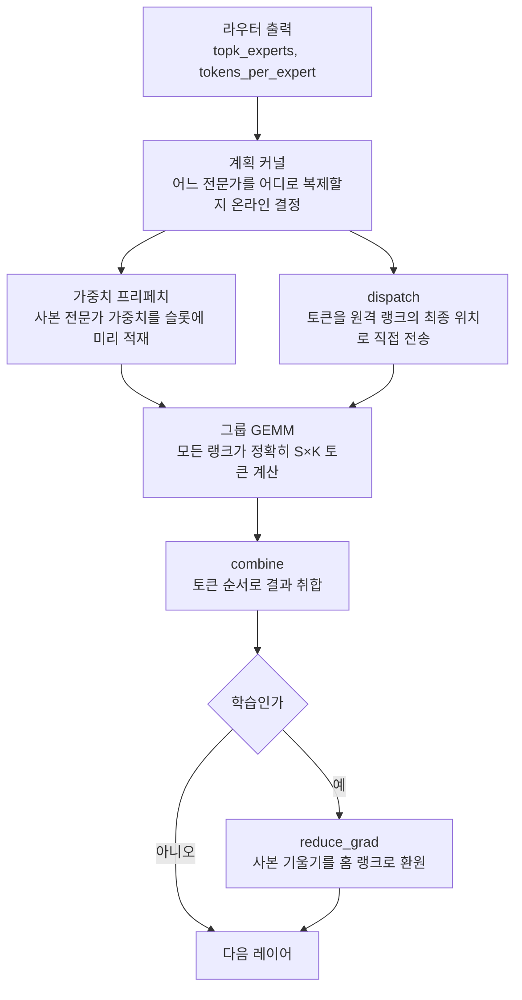
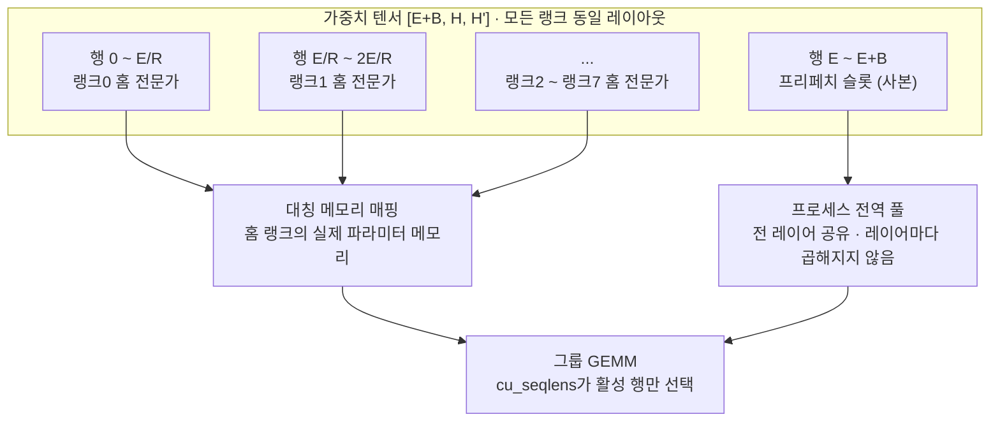

## 왜 읽어야 하나

이 글은 MoE 모델을 여러 장의 GPU에 나눠 학습하거나 서빙하면서 GPU 활용률이 왜 기대만큼 안 나오는지 찾고 있는 인프라 엔지니어를 위해 썼습니다. 전문가 병렬을 처음 접하는 분보다는, 이미 DeepEP 같은 라이브러리를 붙여놓고 반복 시간이 들쭉날쭉한 이유를 설명해야 하는 분에게 쓸모가 큽니다. 결론부터 말씀드리면, MoonEP가 파는 것은 통신 속도가 아니라 **예측 가능성**입니다. 저희가 저장소의 계획 코드를 직접 돌려보니 라우터가 극단적으로 치우친 상황에서도 모든 랭크가 정확히 같은 수의 토큰을 받았고, 그 대가로 토큰의 약 30퍼센트가 원래 있어야 할 랭크를 떠났습니다. 이 교환이 우리 클러스터에 유리한지 판단하는 데 필요한 숫자를 아래에 정리했습니다.

## 개요

Moonshot AI가 MoonEP를 MIT 라이선스로 공개했습니다. 전문가 병렬 통신 라이브러리이고, 한 줄 소개는 "동적 중복 전문가로 랭크 간 토큰 부하를 완벽히 균형 맞춘다"입니다.

이 문장이 왜 중요한지 보려면 MoE 학습에서 시간이 어디로 새는지 알아야 합니다. MoE 레이어는 토큰마다 라우터가 전문가 몇 개를 고르고, 그 전문가가 어느 GPU에 사는지에 따라 토큰을 그 GPU로 보냅니다. 문제는 라우터가 공평하지 않다는 데 있습니다. 학습 초반이든 후반이든 특정 전문가로 토큰이 몰리는 현상은 흔하고, 몰린 전문가를 담고 있는 랭크는 다른 랭크보다 훨씬 많은 토큰을 계산하게 됩니다.

분산 학습에서 한 스텝은 가장 느린 랭크가 끝나야 끝납니다. 나머지 일곱 장이 먼저 끝나도 기다립니다. 즉 **평균 부하가 아니라 최대 부하가 반복 시간을 정합니다.** 여기에 두 번째 문제가 붙습니다. 스텝마다 랭크가 받는 토큰 수가 달라지므로 활성화 텐서의 모양도 매번 달라지고, 그 결과 GPU 메모리가 조각납니다. Moonshot은 이 조각화 때문에 편향이 심할 때 DeepEP가 결국 메모리 부족으로 학습을 멈춘다고 밝히고 있습니다.

MoonEP는 이 두 문제를 같은 방법으로 풉니다. 모든 랭크가 항상 정확히 `S × K`개의 토큰을 받게 만드는 것입니다. `S`는 랭크당 입력 토큰 수, `K`는 토큰당 라우팅되는 전문가 수입니다. 이 값이 고정이면 최대 부하와 평균 부하가 같아지고, 텐서 모양이 상수가 되므로 조각화도 사라집니다.

## 이 기술은 무엇인가

핵심 장치는 **동적 중복 전문가**입니다. 어떤 전문가로 토큰이 몰리면 그 전문가의 사본을 여유 있는 다른 랭크에 임시로 만들고, 넘치는 토큰을 그쪽으로 보냅니다. 사본은 미리 정해두는 것이 아니라 **현재 스텝의 라우터 출력을 보고 그때그때 계획합니다.** 학습이라면 사본이 만든 기울기를 역전파에서 원래 주인 랭크로 되돌려 보내 합칩니다.

전체 흐름은 이렇습니다.



여기에 두 가지 구현 결정이 붙습니다. 하나는 **제로 카피**입니다. 보통은 통신 버퍼로 토큰을 받은 뒤 전문가별로 다시 정렬해서 계산용 버퍼로 옮깁니다. MoonEP는 보내는 쪽에서 이미 수신 랭크의 전문가별 최종 위치를 계산해 그 자리에 직접 씁니다. 정렬과 복사가 통째로 사라지고, 계산 커널은 통신 버퍼를 그대로 들여다봅니다.

다른 하나는 **정적 모양**입니다. 버퍼가 항상 `S × K` 크기로 고정이므로 컴파일 시점에 모양을 알 수 있고, 레이어마다 호스트와 GPU가 동기화하며 "이번엔 토큰이 몇 개인가"를 확인할 필요가 없어집니다. MoE 학습에서 이 호스트 동기화는 생각보다 비쌉니다.

Moonshot이 공개한 벤치마크는 H20 8랭크 환경에서 측정했고, 라우터 불균형을 나타내는 maxvio 값을 키워가며 DeepEP v2와 비교합니다. 통신 시간은 MoonEP가 모든 불균형 구간에서 더 낮고, 불균형이 커져도 거의 평평하게 유지됩니다. 반면 DeepEP는 가장 바쁜 랭크가 지연을 정하므로 꾸준히 나빠집니다. 계획 커널과 프리페치 커널처럼 MoonEP에만 있는 추가 작업까지 포함한 수치라고 밝히고 있습니다.

## 설치 및 통합

설치 자체는 간단합니다.

```bash
git clone https://github.com/MoonshotAI/MoonEP.git
cd MoonEP
pip install -e .
```

다만 테스트를 돌리려면 NVLink로 묶인 GPU 여러 장이 필요합니다.

```bash
torchrun --nproc_per_node=8 -m pytest tests/test_planning.py
torchrun --nproc_per_node=8 -m pytest tests/test_dispatch.py
torchrun --nproc_per_node=8 -m pytest tests/test_e2e.py
```

프레임워크에 붙일 때의 계약은 두 가지입니다. 전문가 projection마다 **연속된 대칭 메모리 가중치 텐서 하나**를 두고, 계획 단계가 만들어준 `cu_seqlens`로 이번 스텝에 어떤 전문가 행이 활성인지 고릅니다. 가중치 텐서는 `[E+B, H, H']` 모양이고 모든 랭크에서 레이아웃이 동일해야 합니다. 앞쪽 `[0, E)` 구간은 각 랭크의 실제 전문가 파라미터 메모리를 대칭 메모리로 매핑한 것이고, 뒤쪽 `[E, E+B)` 구간이 사본을 올려두는 프리페치 슬롯입니다.



API는 이렇게 생겼습니다.

```python
from moonep import Buffer

buffer = Buffer(S=4096, H=7168, K=8, E=256, num_ep_ranks=8,
                num_sms=32, token_padding=128)

hidden_nvsh, route_weights_nvs, cu_seqlens, plan = buffer.dispatch(
    hidden_sh,          # [S, H] bf16
    route_weights_sk,   # [S, K] fp32
    topk_experts_sk,    # [S, K] int32
    tokens_per_expert,  # [E] int32
)

buffer.prefetch_weight(plan=plan,
                       full_gate_weight=full_gate_weight,   # [E+B, H, H'] bf16
                       full_up_weight=full_up_weight,
                       full_down_weight=full_down_weight)

output_sh, gathered_route_weights_sk, _ = buffer.combine(
    plan=plan, hidden_nvsh=expert_output_nvsh,
    route_weights_nvs=route_weights_nvs,
)
```

여기서 실무적으로 가장 중요한 값이 `B`, 즉 랭크당 프리페치 슬롯 수입니다. 문서는 **학습이면 반드시 `B = E/R`을 쓰라**고 못 박습니다. 계획 단계가 한 랭크당 최대 한 개의 원격 홈 그룹에서만 전문가를 복제하므로, 그룹 GEMM이 건드리는 전문가가 전부 로컬에 있으려면 그만큼의 슬롯이 필요하기 때문입니다. 추론이라면 기울기가 없으니 `B`를 3에서 4 정도로 줄여도 되고, 슬롯이 모자라면 대칭 매핑을 통해 홈 랭크의 가중치를 원격으로 읽습니다. 조금 느려질 뿐 결과는 같습니다.

## 실제 실험 결과

먼저 하지 못한 것을 밝히겠습니다. **통신 커널은 실행하지 못했습니다.** CUDA와 NVLink로 묶인 GPU 여러 장이 필요한데 이 환경에 없습니다. 그래서 대신 저장소에 들어 있는 **계획 단계의 torch 레퍼런스 구현**을 CPU에서 그대로 실행했습니다. `tests/planning_reference.py`가 계획 커널과 같은 결과를 내도록 작성된 참조 구현이고, `tests/generate_topk_routing.py`가 벤치마크에서 쓰는 것과 동일한 편향 라우팅 생성기입니다. 두 파일 모두 저장소의 실제 코드이고, 저희는 여기에 측정 코드만 덧붙였습니다.

실험 설정은 전문가 256개, EP 8랭크, 랭크당 2048토큰, top-8입니다. 랭크당 용량은 `S × K`이므로 16,384 토큰입니다. 라우터 편향은 생성기가 쓰는 로그정규 분포의 시그마 값으로 조절했습니다. 0은 완전 균형, 1은 문서가 "전형적인 dropless MoE 편향"이라고 부르는 수준, 5는 거의 퇴화한 라우팅입니다.


측정값은 이렇습니다.

| 편향 시그마 | 베이스라인 최대 부하 | 베이스라인 최소 부하 | 최대/평균 | MoonEP 최대/평균 | 이주 토큰 | 사본 슬롯 |
|---|---|---|---|---|---|---|
| 0.0 | 16,384 | 16,384 | 1.000 | 1.000000 | 0.00% | 0 |
| 0.5 | 20,343 | 14,168 | 1.242 | 1.000000 | 3.65% | 9 |
| 1.0 | 25,525 | 11,282 | 1.558 | 1.000000 | 8.95% | 9 |
| 2.0 | 35,864 | 5,335 | 2.189 | 1.000000 | 20.81% | 8 |
| 5.0 | 44,929 | 747 | 2.742 | 1.000000 | 29.82% | 7 |

베이스라인은 전문가를 홈 랭크에 고정했을 때의 부하입니다. 편향 시그마가 1인 전형적인 상황에서 이미 가장 바쁜 랭크가 평균의 1.56배를 받고, 가장 한가한 랭크는 11,282 토큰만 받습니다. 시그마 5에서는 한쪽이 44,929 토큰을 계산하는 동안 다른 쪽은 747 토큰만 계산합니다. 60배 차이입니다. 이 상태로 학습을 돌리면 GPU 여덟 장 중 일곱 장이 대부분의 시간을 대기에 씁니다.

MoonEP 계획을 통과시키면 다섯 가지 편향 수준 **전부에서 여덟 개 랭크가 정확히 16,384 토큰**을 받았습니다. 근사치가 아니라 정확히 같은 값입니다. 코드에서도 `alloc.sum(dim=0) > CAP`이면 예외를 던지도록 되어 있어 용량 초과가 원천 차단됩니다. 문서의 "완벽한 균형"이라는 표현은 마케팅 수사가 아니라 말 그대로였습니다.

대가는 오른쪽 열입니다. 균형을 맞추려면 토큰이 원래 가야 할 랭크를 떠나야 하고, 그 비율이 편향에 비례해 늘어납니다. 시그마 1에서 8.95퍼센트, 시그마 5에서 29.82퍼센트입니다. 이 토큰들은 NVLink를 타고 다른 랭크로 이동하므로 통신량이 그만큼 늘어납니다. MoonEP가 제로 카피로 통신 자체를 싸게 만들어 두지 않았다면 성립하지 않았을 거래입니다.

한 가지 더 눈에 띈 것은 사본 슬롯 수입니다. 편향이 아무리 심해져도 **7개에서 9개 사이**에 머물렀습니다. 전문가가 256개인데 그중 열 개 미만만 복제하면 충분하다는 뜻입니다. 편향이 심할수록 소수의 전문가에 토큰이 집중되므로, 그 소수만 복제하면 나머지가 따라온다는 구조입니다. 문서가 "소수의 중복 전문가"라고 표현한 부분이 이 숫자로 확인됩니다.

메모리 비용도 문서에 적힌 형상으로 계산해 봤습니다. `S=4096`, `H=7168`, projection 3개 기준이고 전문가 FFN 중간 차원은 2048로 잡았습니다. 이 값은 모델마다 다르므로 `[추정]`입니다.

| 모드 | B | 프리페치 가중치 | 기울기 리듀스 버퍼 | dispatch 버퍼 | 합계 |
|---|---|---|---|---|---|
| 추론 | 4 | 0.33 GiB | 없음 | 0.44 GiB | 0.77 GiB |
| 학습 | 32 | 2.62 GiB | 5.25 GiB | 0.44 GiB | 8.31 GiB |

추론에서는 랭크당 1 GiB 미만이라 부담이 거의 없습니다. 학습에서는 8 GiB가 넘는데, 랭크가 원래 들고 있는 홈 전문가 가중치가 2.6 GiB인 것과 비교하면 작지 않은 추가분입니다. 다만 문서는 프리페치 풀과 리듀스 버퍼가 **프로세스 전역 풀에서 나오며 모든 레이어가 공유한다**고 밝히고 있습니다. 레이어 수만큼 곱해지지 않으므로, 레이어가 수십 개인 실제 모델에서는 상대적 비중이 훨씬 작아집니다.

## ThakiCloud 제품 적용 시사점

ThakiCloud의 **ai-platform**은 쿠버네티스 위에서 GPU 워크로드를 스케줄링하고 모델을 학습, 서빙하는 인프라입니다. Kueue로 GPU를 큐잉하고 여러 테넌트가 같은 클러스터를 나눠 쓰는 구조라, 저희에게 GPU 활용률은 성능 지표이기 전에 **원가 지표**입니다. 한 장이 놀면 그 시간만큼 다른 테넌트에게 팔 수 있었던 용량이 사라집니다.

이 관점에서 MoonEP가 겨냥하는 문제는 정확히 저희 문제입니다. 최근 저희가 다룬 오픈웨이트 모델들은 대부분 MoE입니다. 전문가 256개에 top-8을 쓰는 구성이 흔하고, 이번 실험 설정을 그대로 가져온 것도 그래서입니다. 이런 모델을 8랭크 전문가 병렬로 학습할 때 라우터 편향이 시그마 1 수준이라면, 위 측정대로 가장 바쁜 랭크가 평균의 1.56배를 받습니다. 반복 시간이 최대 부하로 정해지므로 이론상 클러스터의 3분의 1 이상을 대기에 쓰고 있는 셈입니다.

두 번째로 중요한 것은 메모리 조각화입니다. 멀티테넌트 환경에서 가장 곤란한 실패는 느린 잡이 아니라 **밤새 돌던 잡이 메모리 부족으로 죽는 것**입니다. 모양이 매 스텝 달라지는 활성화 텐서는 조각화를 만들고, 조각화는 재현이 어려워 디버깅 비용이 큽니다. MoonEP처럼 텐서 모양이 상수인 구조는 이 실패 유형 자체를 없앱니다. 저희가 용량 산정을 할 때도 "최악의 경우 얼마"가 아니라 "항상 얼마"로 계산할 수 있게 되므로, GPU 할당 정책을 훨씬 촘촘하게 짤 수 있습니다.

다만 지금 바로 프로덕션에 넣을 대상은 아닙니다. 대칭 메모리와 NVLink를 전제하므로 노드 안에서 GPU가 NVLink로 묶인 구성이라야 하고, 저희 학습 파이프라인은 전문가 병렬 통신 계층을 직접 다루지 않습니다. 현실적인 다음 단계는 H200 노드 한 대에서 위 벤치마크를 재현해 저희 하드웨어에서도 통신 시간이 평평하게 유지되는지 확인하는 것입니다. 이번 글에서 확인한 것은 계획 단계의 정확성까지이고, 통신 이득은 저희 손으로 아직 재지 못했습니다.

## 한계 및 반론

첫째, 이번 검증은 계획 단계에 한정됩니다. MoonEP의 가치 주장은 "균형을 맞춘다"와 "통신이 빠르다" 두 개인데, 저희가 확인한 것은 앞의 하나뿐입니다. 뒤의 주장은 Moonshot이 공개한 H20 벤치마크 그림에 의존하고 있고, 저희가 독립적으로 재현하지 못했습니다.

둘째, 완벽한 균형이 항상 이득은 아닙니다. 편향이 심할수록 이주 토큰이 늘어나 통신량이 증가합니다. 시그마 5에서 30퍼센트에 가까운 토큰이 이동한다는 것은, 계산 시간보다 통신 시간이 지배적인 구성이라면 균형을 맞추는 쪽이 오히려 손해일 수 있다는 뜻입니다. 어느 쪽이 이기는지는 모델 크기, 은닉 차원, 인터커넥트 대역폭에 달려 있어 일반화할 수 없습니다.

셋째, 라우터 편향은 학습 과정에서 줄어드는 것이 정상입니다. 대부분의 MoE 학습은 보조 손실이나 편향 항으로 부하를 분산시키고, 그 장치가 잘 동작하면 시그마가 2나 5까지 가지 않습니다. MoonEP의 이득이 가장 큰 구간은 이런 장치가 없거나 약한 경우, 또는 라우터가 아직 불안정한 학습 초반입니다. 이미 부하가 잘 분산된 학습에 붙이면 남는 것은 제로 카피에서 오는 통신 개선뿐입니다.

넷째, 통합 비용이 낮지 않습니다. 전문가 가중치를 projection마다 하나의 연속된 대칭 메모리 텐서로 재배치해야 하고, 이는 기존 학습 코드의 파라미터 관리 방식을 바꾸는 작업입니다. 기울기 환원도 프레임워크 자체의 기울기 리듀스와 충돌하지 않게 분리해야 합니다. 라이브러리를 임포트하고 함수 하나 바꾸는 수준이 아닙니다.

다섯째, 하드웨어 선택지가 좁습니다. 현재 지원은 NVIDIA GPU이고 Zhenwu PPU는 검토 중입니다. 다양한 가속기를 함께 운용하는 환경이라면 적용 범위가 제한됩니다.

## 정리

MoonEP가 실제로 하는 일은 통신을 빠르게 만드는 것이 아니라 **반복 시간을 라우터로부터 떼어내는 것**입니다. 저희가 저장소의 계획 코드를 그대로 돌려 확인한 결과, 라우터가 어떻게 치우치든 여덟 개 랭크가 정확히 16,384개의 토큰을 받았습니다. 그 대신 전형적인 편향에서 토큰의 8.95퍼센트가, 극단적인 편향에서는 29.82퍼센트가 홈 랭크를 떠났고, 그 균형을 만드는 데 필요한 전문가 사본은 256개 중 열 개도 되지 않았습니다.

MoE를 여러 장에 나눠 돌리고 계시다면, 다음 학습 잡에서 랭크별 수신 토큰 수를 한 번 찍어보시길 권합니다. 최대와 평균의 비율이 1.5를 넘는다면 GPU를 산 만큼 쓰지 못하고 있다는 뜻이고, MoonEP가 정확히 그 격차를 겨냥한 도구입니다. 저희도 H200 노드에서 통신 벤치마크를 재현하는 것을 다음 과제로 두었습니다.

이 글의 측정에 쓴 코드는 MoonEP 저장소의 `tests/planning_reference.py`와 `tests/generate_topk_routing.py`를 그대로 호출하며, 저희가 추가한 것은 부하 집계 부분뿐입니다.

## 출처

- [MoonEP: A Perfectly Balanced Expert Parallelism Library via Dynamic Redundant Experts (GitHub)](https://github.com/MoonshotAI/MoonEP)
- [DeepEP (비교 대상)](https://github.com/deepseek-ai/DeepEP)
- [Echo (arXiv 2603.07685)](https://arxiv.org/abs/2603.07685)
- [UltraEP](https://github.com/Dots-Infra/UltraEP)
