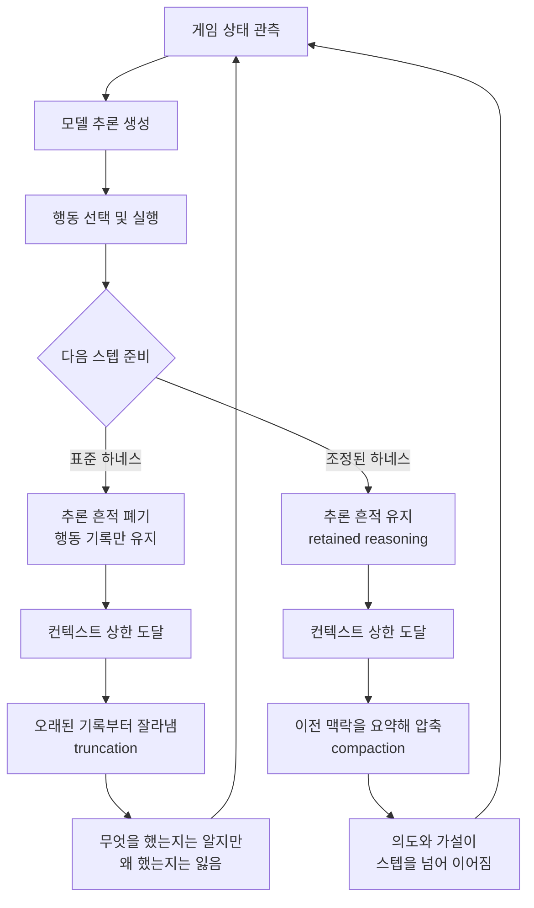

에이전트를 여러 스텝 돌려 본 팀이라면 익숙한 증상이 있습니다. 첫 몇 스텝은 똑똑한데 뒤로 갈수록 앞에서 알아낸 것을 잊고 같은 실수를 반복합니다. 모델을 상위 등급으로 올려도 잘 낫지 않습니다. 2026년 7월 OpenAI가 공개한 ARC-AGI-3 재측정 보고는 이 증상의 원인이 모델이 아니라 그 바깥에 있을 수 있다는 것을 꽤 극적인 숫자로 보여줍니다.

## 왜 읽어야 하나

이 글은 다중 스텝 에이전트를 운영하거나 LLM 추론 비용을 책임지고 계신 분, 그리고 벤치마크 수치를 근거로 모델을 선택해야 하는 분을 위해 썼습니다. 결론부터 말씀드리면, **같은 모델의 점수가 13.3%에서 38.3%로 세 배 가까이 벌어진 원인은 모델 능력이 아니라 하네스가 모델의 작업 기억을 어떻게 다루느냐였습니다.** 추론 흔적을 스텝마다 버리느냐 유지하느냐, 컨텍스트가 넘칠 때 잘라내느냐 요약하느냐. 이 두 가지 선택이 정확도와 토큰 비용을 동시에 바꿨습니다. 벤치마크 순위 자체보다 이 사실이 우리 파이프라인에 훨씬 실용적인 함의를 갖습니다.

## 개요

ARC-AGI-3는 ARC Prize 재단이 운영하는 벤치마크로, 모델이 처음 보는 2차원 퍼즐 게임을 시행착오로 학습해 클리어할 수 있는지를 봅니다. 앞선 ARC-AGI-1이나 2가 정적인 격자 변환 문제를 한 번에 푸는 형태였다면, 3은 여러 번 움직이면서 규칙을 스스로 알아내야 하는 에이전트형 과제입니다. 한 스텝의 정답이 아니라 수십 스텝에 걸친 학습과 기억이 평가 대상이 됩니다.

이 벤치마크에서 GPT-5.6 Sol은 공식 리더보드 기준 7.78%를 기록했습니다. 직전 세대인 GPT-5.5가 0.4%에 그쳤던 것에 비하면 처음으로 의미 있는 진전이 나온 수치였지만, 같은 리더보드에서 Opus 5가 기록한 30.2%와는 큰 격차가 있었습니다. 수학의 미해결 문제를 다루는 데 쓰이는 모델이 2차원 퍼즐 게임에서 한 자릿수에 머무는 그림은 누가 봐도 이상했습니다.

GPT-5.6 Sol이 이 벤치마크를 처음 의미 있게 돌파한 배경 자체는 [앞선 글](/tech-blog/ko/research/gpt-5-6-sol-arc-agi-3/)에서 정향 능력의 관점으로 다룬 바 있습니다. 이번 글은 그 이후에 벌어진 측정 방식 논쟁을 다룹니다.

OpenAI는 이 격차를 모델의 한계가 아니라 측정 환경의 문제로 보고 조사에 들어갔고, 7월에 그 결과를 [공식 블로그](https://openai.com/index/how-two-settings-tripled-our-arc-agi-3-scores/)로 공개했습니다. 요지는 이렇습니다. 표준 하네스가 매 행동마다 모델의 내부 추론을 폐기하고, 컨텍스트가 차면 오래된 행동 기록부터 잘라냈다는 것입니다. 모델은 자기가 무엇을 했는지는 기억하지만 왜 그렇게 했는지는 대부분 잃은 상태로 다음 수를 두고 있었습니다.

*스텝 사이에서 무엇을 남기고 무엇을 버리느냐가 다중 스텝 에이전트의 성능을 가릅니다.*

## 하네스란 무엇이고 왜 결과를 바꾸는가

하네스는 모델을 실제로 굴리는 바깥쪽 소프트웨어입니다. 게임의 현재 상태를 모델에게 보여 주고, 모델의 응답을 받아서 행동을 추출하고, 그 행동을 실행하고, 바뀐 상태를 다시 모델에게 돌려주는 루프 전체가 하네스입니다. 프롬프트 템플릿, 대화 이력을 어디까지 붙일지, 추론 토큰을 다음 턴에 넘길지, 컨텍스트 상한에 닿았을 때 무엇을 버릴지가 전부 여기에 들어갑니다.

벤치마크는 보통 모델을 비교하기 위해 하네스를 하나로 고정합니다. 공정한 비교를 위한 합리적인 선택입니다. 문제는 그 고정된 하네스가 특정 모델의 동작 방식과 잘 맞지 않을 때 발생합니다. 추론 모델은 답을 내기 전에 상당한 양의 내부 사고를 생성하는데, 그 사고를 다음 스텝으로 넘길 수 있는지가 구현마다 다릅니다. 넘기지 못하면 모델은 매 스텝을 사실상 백지에서 다시 시작합니다.

*같은 모델이 두 갈래 경로를 지납니다. 갈라지는 지점은 스텝 사이에서 무엇을 남기느냐입니다.*

## 두 설정이 실제로 하는 일

OpenAI가 켠 설정은 두 가지입니다.

**retained reasoning**은 모델이 생성한 추론 흔적을 다음 턴으로 넘겨 줍니다. 표준 구현에서는 행동을 뽑아낸 뒤 그 뒤에 있던 사고 과정을 버립니다. 이력에는 "보라색 블록을 오른쪽으로 옮겼다"는 사실만 남고, "저 블록이 색이 같은 칸에 붙으면 점수가 오르는지 확인해 보려고 옮겼다"는 가설은 사라집니다. 시행착오로 규칙을 발견해야 하는 과제에서 가설이 사라지면, 모델은 이미 기각한 가설을 다시 세우고 같은 실험을 반복하게 됩니다.

**compaction**은 컨텍스트가 상한에 닿았을 때 오래된 내용을 잘라내는 대신 요약해서 압축합니다. 잘라내기는 구현이 단순하고 예측 가능하다는 장점이 있지만, 초반 스텝에 발견한 핵심 규칙이 정확히 그 잘려 나가는 구간에 들어 있다는 것이 문제입니다. 게임을 오래 플레이할수록 가장 중요한 발견이 가장 먼저 버려집니다. 압축은 그 정보를 밀도 높은 형태로 남깁니다.

두 설정 모두 OpenAI의 Responses API에서 제공됩니다. 이전 세대 인터페이스인 Chat Completions API는 매 요청이 독립적인 구조라 추론 흔적을 서버 쪽에서 이어 주는 개념이 없습니다. 그래서 OpenAI의 권고는 세 문장으로 요약됩니다. Chat Completions 대신 Responses API를 쓰고, 턴 사이에 추론을 유지하고, 장기 실행 작업에는 압축을 켜라는 것입니다.

## 숫자를 정확히 읽기

공개된 수치를 헷갈리지 않게 정리하면 다음과 같습니다.

| 구분 | 하네스 | 세트 | 점수 |
|---|---|---|---|
| GPT-5.6 Sol | 공식 표준 | 세미프라이빗 | 7.78% |
| GPT-5.6 Sol | 공식 표준 | 공개 | 13.33% |
| GPT-5.6 Sol | Responses API + 두 설정 | 공개 | 38.3% |
| Opus 5 | 공식 표준 | 세미프라이빗 | 30.2% |
| GPT-5.5 | 공식 표준 | 세미프라이빗 | 0.4% |

핵심 비교는 세 번째 행과 두 번째 행입니다. 같은 모델, 같은 공개 세트에서 13.33%가 38.3%로 올랐습니다. 상대 증가율로 약 188%입니다. 그리고 여기서 자주 놓치는 대목이 하나 더 있습니다. **정확도가 세 배 가까이 오르는 동안 게임당 출력 토큰은 대략 6분의 1로 줄었습니다.** 보통 추론 품질을 올리려면 토큰을 더 쓰게 되는데, 이 경우는 반대로 움직였습니다.

이유는 생각해 보면 자연스럽습니다. 앞 스텝의 사고를 잃은 모델은 매번 상황을 처음부터 다시 추론해야 합니다. 이미 확인한 규칙을 다시 검증하고, 기각한 선택지를 다시 검토합니다. 그 반복 추론이 전부 출력 토큰입니다. 맥락이 이어지면 모델은 "이건 지난번에 확인했으니 다음 가설로 간다"는 식으로 짧게 판단할 수 있습니다. 정확도와 비용이 같은 방향으로 개선되는, LLMOps 관점에서 드물게 좋은 형태의 개선입니다.

다만 마지막 행과 세 번째 행을 나란히 놓는 것은 조심해야 합니다. Opus 5의 30.2%는 공식 표준 하네스에서 세미프라이빗 세트로 측정한 값이고, GPT-5.6 Sol의 38.3%는 조정된 하네스에서 공개 세트로 측정한 값입니다. 하네스도 다르고 데이터 세트도 다릅니다. 공식 리더보드 기준으로는 Opus 5가 여전히 선두이며, OpenAI의 재측정이 같은 표에 들어갈 자격이 있는지는 독립 재현이 이뤄지기 전까지 열린 질문입니다.

## 자체 스택으로 옮길 때의 점검 항목

Responses API를 쓰지 않는 환경, 예를 들어 vLLM이나 SGLang으로 오픈웨이트 모델을 자체 서빙하는 경우라면 같은 효과를 직접 만들어야 합니다. 실무적으로 확인할 지점은 네 가지입니다.

**첫째, 추론 블록이 이력에 남는가.** 대부분의 에이전트 프레임워크는 모델 응답에서 도구 호출과 최종 텍스트만 파싱해 이력에 넣고 사고 부분은 버립니다. 파싱 코드를 열어 보면 대개 한눈에 보입니다. 사고 블록을 다음 턴 프롬프트에 넣도록 바꾸는 것은 코드 몇 줄이지만, 입력 토큰이 늘어나므로 아래 셋과 함께 봐야 합니다.

**둘째, 컨텍스트 상한 처리 방식이 무엇인가.** 앞에서부터 자르는 방식인지, 뒤에서부터 자르는 방식인지, 요약을 끼우는지를 확인하십시오. 가장 흔한 구현은 앞에서부터 잘라내는 것이고, 이것이 초반 발견을 잃는 원인입니다. 요약을 넣을 때는 무엇을 반드시 보존할지 명시적으로 지정하는 편이 안전합니다. 확정된 규칙, 기각된 가설, 현재 목표 정도가 최소 보존 대상입니다.

**셋째, 요약 비용을 어디서 낼 것인가.** 압축은 요약 호출을 필요로 하고, 그 호출은 지연과 비용을 추가합니다. 본 모델과 같은 등급을 쓸 이유는 없습니다. 요약은 상대적으로 쉬운 작업이라 작은 모델로 충분한 경우가 많고, 이 선택이 전체 경제성을 좌우합니다.

**넷째, 개선을 무엇으로 판정할 것인가.** 이 사건의 교훈을 그대로 적용하면, 개선 여부는 정확도와 출력 토큰을 함께 봐야 합니다. 한쪽만 보면 착시가 생깁니다. 추론 유지로 입력 토큰이 늘었는데 출력 토큰 감소가 그보다 크지 않으면 총비용은 오릅니다. 실제 워크로드로 두 값을 동시에 측정하는 것이 유일하게 믿을 만한 판정 방법입니다.

## ThakiCloud 제품 적용 시사점

이 사건은 ThakiCloud가 운영하는 두 제품 모두에 직접 닿습니다.

**ai-platform 관점.** ThakiCloud의 ai-platform은 Kubernetes와 Kueue 위에서 고객 워크로드를 서빙하는 AI/ML 인프라입니다. 이 사례가 주는 실무적 함의는 명확합니다. 다중 스텝 워크로드에서 컨텍스트 관리 정책은 튜닝 파라미터가 아니라 성능 그 자체입니다. GPU 시간을 늘리거나 모델 등급을 올리기 전에, 스텝 사이에 무엇이 버려지고 있는지를 먼저 봐야 합니다. 출력 토큰이 6분의 1로 줄었다는 대목은 특히 중요합니다. 온프레미스나 소버린 환경에서 vLLM으로 자체 서빙하는 고객에게 출력 토큰은 곧 GPU 점유 시간이고, 디코딩 단계는 배치 효율이 낮아 실제 비용에서 차지하는 비중이 큽니다. 컨텍스트 압축을 서빙 계층에서 일급 기능으로 다루면 같은 하드웨어로 더 많은 동시 세션을 받을 수 있습니다.

**Paxis 관점.** Paxis는 ai-platform 위에서 도는 ThakiCloud의 Agent-Native Cloud 제어 평면으로, 스킬과 도구와 정책과 감사 로그를 일급 리소스로 다룹니다. 여기서 하네스는 벤치마크 얘기가 아니라 제품의 핵심 부품입니다. 스킬 하네스가 960개가 넘는 스킬 중 BM25로 후보를 고르고, 격리된 샌드박스에서 실행하고, 그 결과를 다시 루프에 넣습니다. 이 루프에서 스텝 사이에 무엇을 유지할지는 우리가 직접 설계하는 영역입니다. 도구 호출 결과만 남기고 왜 그 도구를 골랐는지를 버리면, 이번 사례의 표준 하네스와 정확히 같은 상태가 됩니다. 반대로 의도와 기각된 가설을 압축해 유지하면 같은 모델로 더 나은 결과를 얻습니다. 모델 등급을 올리기 전에 하네스를 먼저 점검하라는 원칙이, 우리 내부 운영 규칙에도 이미 같은 문장으로 들어가 있습니다.

두 렌즈는 서로를 보완합니다. 저렴한 서빙이 에이전트의 경제성을 만들고, 잘 설계된 하네스가 그 경제성을 실제 품질로 바꿉니다.

## 한계 및 반론

이 사건을 "설정 두 개만 켜면 된다"로 요약하면 몇 가지를 놓칩니다.

첫째, **독립 재현이 아직 없습니다.** 38.3%는 OpenAI가 자사 API로 자사 모델을 측정한 값이고, 세미프라이빗 세트에서 제3자가 재현한 결과가 아닙니다. 벤치마크에서 자체 측정과 독립 측정이 벌어지는 일은 드물지 않습니다. ARC Prize 쪽 검증이 나오기 전까지는 방향성을 보여 주는 수치로 읽는 편이 안전합니다.

둘째, **표준 하네스를 그냥 결함으로 부르기는 어렵습니다.** 벤치마크가 하네스를 고정하는 이유는 모델 간 비교를 가능하게 하려는 것입니다. 각 벤더가 자사에 유리한 하네스를 들고 오면 리더보드는 무의미해집니다. 물론 고정된 하네스가 특정 모델의 능력을 과소평가할 수 있다는 지적도 정당합니다. 이 긴장은 "누가 옳은가"로 풀리지 않으며, 표준 조건과 최적 조건을 별도 트랙으로 함께 보고하는 방향이 더 현실적입니다.

셋째, **retained reasoning과 compaction은 공짜가 아닙니다.** 추론 흔적을 유지하면 입력 토큰이 늘어납니다. 출력 토큰이 줄어드는 폭이 더 커서 총 비용이 내려간 것이지, 모든 워크로드에서 자동으로 그렇게 되지는 않습니다. 스텝 수가 적은 작업이라면 유지 비용만 늘고 이득은 작을 수 있습니다. 압축은 요약 과정에서 정보를 잃을 위험도 있어서, 무엇을 남길지 정하는 요약 정책 자체가 새로운 튜닝 대상이 됩니다.

넷째, **벤더 종속 문제가 있습니다.** 이 두 설정은 OpenAI Responses API의 기능입니다. 자체 호스팅 모델을 vLLM이나 SGLang으로 서빙하는 환경이라면 같은 동작을 직접 구현해야 합니다. 추론 흔적 보존은 프롬프트 조립 단계에서 가능하지만, 압축은 요약 모델을 따로 붙여야 해서 지연과 비용이 추가됩니다.

## 정리

이 사건에서 가져갈 것은 리더보드 순위가 아닙니다. **같은 모델이 하네스 설정 하나로 정확도 세 배와 출력 토큰 6분의 1을 동시에 오갔다는 사실**입니다. 다중 스텝 에이전트에서 성능은 모델 안에만 있지 않고, 스텝 사이의 기억을 누가 어떻게 관리하느냐에 상당 부분 걸려 있습니다.

당장 해 볼 일은 단순합니다. 운영 중인 에이전트 루프를 열어서 스텝 사이에 무엇이 버려지는지 확인하십시오. 도구 호출 결과만 남기고 그 선택의 이유를 버리고 있다면, 그리고 컨텍스트가 찰 때 오래된 것부터 잘라내고 있다면, 이 글의 표준 하네스와 같은 구조입니다. 모델 등급을 올리기 전에 그 두 지점을 먼저 고쳐 보는 편이 비용 대비 효과가 큽니다. 벤치마크 수치를 볼 때도 모델 이름 옆에 어떤 하네스였는지를 함께 읽는 습관이 필요합니다. 그 정보 없이는 두 숫자가 같은 것을 재고 있는지조차 알 수 없습니다.

## 관련 슬라이드

본문 내용을 NotebookLM(`neo_constructivist` 스타일)으로 요약한 슬라이드입니다.

## 출처

- [How enabling two settings tripled our scores on the ARC-AGI-3 benchmark, OpenAI](https://openai.com/index/how-two-settings-tripled-our-arc-agi-3-scores/)
- [GPT-5.6 Sol, ARC-AGI Results](https://arcprize.org/results/openai-gpt-5-6-sol)
- [OpenAI on X](https://x.com/OpenAI/status/2082616636989952217)
