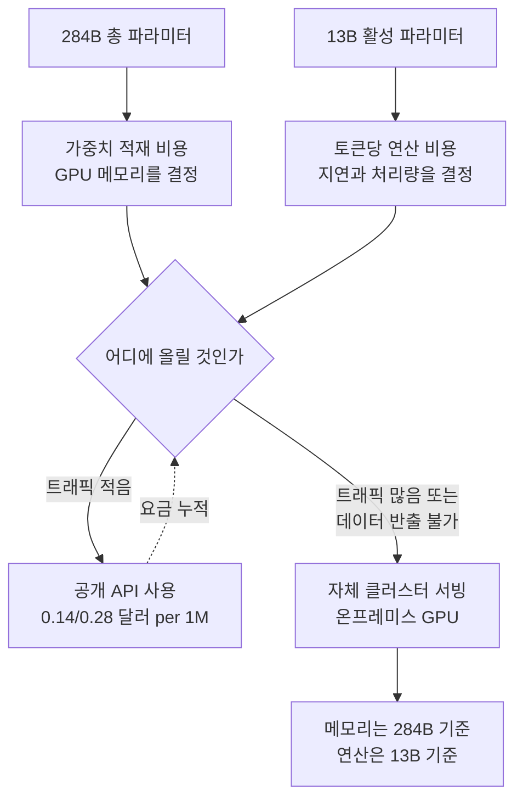

모델 발표를 볼 때 가장 먼저 보게 되는 숫자는 보통 파라미터 수입니다. 그런데 실제로 그 모델을 우리 GPU 위에 올려야 하는 입장이 되면, 총 파라미터보다 훨씬 중요한 숫자가 따로 있습니다. 2026년 7월 31일 공개 베타로 열린 DeepSeek-V4-Flash는 그 차이를 설명하기에 좋은 사례입니다. 총 284B인데 한 토큰을 만들 때 실제로 켜지는 건 13B입니다.

*대부분은 꺼져 있고 일부만 켜집니다. 희소 전문가 구조를 한 장으로 옮기면 이런 그림입니다.*

## 왜 읽어야 하나

이 글은 에이전트 워크로드에 쓸 모델을 고르는 ML 엔지니어와, 상용 API를 계속 쓸지 자체 클러스터에 올릴지를 판단해야 하는 인프라 담당자를 위해 썼습니다. 결론을 먼저 말씀드리면, **이번 릴리스에서 주목할 부분은 벤치마크 순위가 아니라 아키텍처를 그대로 두고 사후 학습만으로 에이전트 성능을 끌어올렸다는 점과, 활성 13B라는 구조가 자체 서빙의 손익분기를 크게 앞당긴다는 점입니다.** 점수표를 훑고 끝내는 대신, 이 두 가지가 각각 파이프라인 설계와 GPU 예산에 무엇을 바꾸는지 짚습니다.

## 개요

DeepSeek이 V4-Flash 공식 API를 공개 베타로 열었다고 발표한 것은 2026년 7월 31일입니다. [Bloomberg](https://www.bloomberg.com/news/articles/2026-07-31/deepseek-unveils-public-beta-api-for-flagship-ai-model)와 [TechNode](https://technode.com/2026/07/31/deepseek-puts-v4-flash-api-into-public-beta/)가 같은 날 이를 보도했고, 회사는 공식 계정을 통해 에이전트 능력을 대폭 끌어올렸다고 밝혔습니다.

발표에서 가장 눈에 띄는 대목은 상하 관계의 역전입니다. 공식 V4-Flash 빌드가 여러 코드 벤치마크에서 상위 등급인 V4-Pro-Preview를 앞질렀다는 것입니다. 보통 Flash 계열은 속도와 단가를 위해 성능을 양보하는 자리인데, 이번에는 그 자리에서 상위 라인을 넘겼습니다.

사양은 이렇습니다. 총 284B 파라미터의 Mixture-of-Experts 구조이고, 토큰당 활성 파라미터는 13B, 컨텍스트 창은 100만 토큰입니다. 공개 API 단가는 입력 100만 토큰당 0.14달러, 출력 100만 토큰당 0.28달러로 집계되어 있습니다. 종합 지표에서는 Artificial Analysis 지능 지수 50이 기록되어 있습니다.

*사양을 한 장에 모으면 활성 파라미터가 총 파라미터의 20분의 1 수준이라는 점이 눈에 들어옵니다.*

여기에 하나 더, 형식 호환성이 붙었습니다. Responses API 형식을 네이티브로 지원하고 Codex와 호환된다는 점입니다. 구조화된 JSON 출력 스키마를 쓰는 애플리케이션이라면 어댑터 계층 없이 바로 붙일 수 있다는 뜻입니다.

## 무엇이 실제로 바뀌었나

이번 릴리스에서 기술적으로 가장 흥미로운 진술은 성능 수치가 아니라 이 문장입니다. 아키텍처는 프리뷰와 동일하고 사후 학습 단계만 반복했다는 것입니다.

같은 뼈대에 같은 크기인데 에이전트 성능이 크게 올랐다면, 올라간 원인은 모델 용량이 아니라 학습 신호에 있습니다. 도구를 언제 부르고 언제 멈출지, 실패한 명령을 어떻게 복구할지, 여러 스텝에 걸친 작업을 어떻게 이어갈지 같은 행동 패턴은 파라미터를 늘려서 얻는 것이 아니라 그 행동을 담은 데이터로 학습시켜 얻습니다.

이 관찰은 최근 하네스 연구가 말하는 것과 같은 방향을 가리킵니다. [하네스 설계와 사후 학습의 상호작용을 다룬 논문(arXiv:2606.25447)](https://arxiv.org/abs/2606.25447)은 도구 환경이 바뀌었을 때 성능이 얼마나 버티는지가 사후 학습이 어떤 하네스를 전제했는지에 크게 달려 있음을 보였습니다. 즉 모델 쪽에서 에이전트 성능을 올리는 작업과 하네스 쪽에서 올리는 작업은 별개가 아니라 짝입니다. 같은 맥락은 [ARC-AGI-3에서 하네스 설정이 점수를 갈랐던 사례](/tech-blog/ko/llmops/arc-agi-3-harness-settings-context-memory/)에서도 이미 확인했습니다.

*모델 쪽 개선과 하네스 쪽 개선은 별개가 아니라 맞물려 돕니다.*

## 벤치마크 숫자를 어떻게 읽을 것인가

발표를 인용한 보도 기준으로 공식 빌드의 점수는 다음과 같습니다.

*공식 발표를 인용한 보도 기준 수치이며 자체 재측정값이 아닙니다.*

| 벤치마크 | 점수 | 무엇을 재나 |
|---|---|---|
| Terminal Bench 2.1 | 82.7 | 터미널에서 다단계 작업을 끝내는 능력 |
| Cybergym | 76.7 | 보안 과제 해결 |
| DSBench-FullStack | 68.7 | 풀스택 데이터 작업 |
| DeepSWE | 54.4 | 실제 소프트웨어 수정 |
| NL2Repo | 54.2 | 자연어 요구에서 저장소 생성 |

숫자를 볼 때 두 가지를 함께 기억하는 것이 좋습니다. 첫째, 이 점수들은 벤더가 발표한 값이고 우리가 재측정한 값이 아닙니다. 둘째, 앞서 언급했듯 에이전트 벤치마크 점수는 하네스 구성에 민감합니다. 같은 모델이라도 어떤 도구 세트와 컨텍스트 관리 정책으로 감쌌는지에 따라 점수가 크게 흔들립니다. 그래서 이 표는 순위표라기보다 후보 목록을 좁히는 용도로 쓰는 편이 안전합니다. 최종 선택은 우리 하네스에 얹어서 우리 과제로 재봐야 합니다.

Terminal Bench 계열이 다른 항목보다 유독 높다는 점도 눈여겨볼 만합니다. 터미널 작업은 명령을 실행하고 출력을 읽어 다음 행동을 고르는 반복 구조인데, 이 패턴은 사후 학습으로 개선하기 가장 쉬운 축에 속합니다. 반대로 DeepSWE와 NL2Repo가 50점대에 머문 것은 저장소 전체를 이해해야 하는 과제가 여전히 어렵다는 신호입니다.

## 서빙 관점에서 본 284B MoE

여기서부터가 인프라 담당자에게 실질적인 부분입니다. MoE 모델의 비용 구조는 두 개의 서로 다른 숫자에 걸려 있습니다.

메모리는 총 파라미터가 정합니다. 284B를 FP8로 적재하면 가중치만 약 284GB이고, BF16이면 약 568GB입니다. 여기에 KV 캐시와 실행 오버헤드가 더 붙습니다. 100만 토큰 컨텍스트를 실제로 쓰겠다면 KV 캐시가 가중치 못지않게 커진다는 점을 각오해야 합니다. 이 계산은 파라미터 수에서 직접 유도한 값이며 실측이 아닙니다.

연산은 활성 파라미터가 정합니다. 토큰 하나를 만들 때 13B만 관여하므로, 순수 연산량 기준으로는 13B급 밀집 모델과 비슷한 속도 특성을 가집니다. 즉 이 모델은 메모리를 많이 먹지만 그 메모리 대비 빠릅니다.

*메모리 축과 연산 축이 서로 다른 숫자에 걸려 있습니다. 이 비대칭이 판단을 바꿉니다.*

이 비대칭이 자체 서빙 판단을 바꿉니다. 밀집 284B 모델이었다면 메모리도 연산도 감당하기 어려워 애초에 후보가 아니었을 것입니다. 그런데 활성 13B라면 이야기가 달라집니다. 메모리만 충분히 확보하면 처리량은 상당히 나옵니다. 결국 질문이 "이 모델을 우리가 돌릴 수 있는가"에서 "고정 GPU 비용과 API 종량 요금 중 어디가 싼가"로 내려옵니다.

손익분기 계산은 간단합니다. 공개 API가 입출력 합산 기준 100만 토큰당 대략 0.4달러 수준이므로, 하루에 수십억 토큰을 처리하는 워크로드가 아니라면 API가 여전히 저렴합니다. 반대로 데이터 반출이 금지된 환경이라면 계산 자체가 필요 없습니다. 그때는 비용이 아니라 가능 여부의 문제이고, 활성 13B라는 구조가 그 가능 여부를 긍정 쪽으로 밀어줍니다.

## 사이징을 손으로 계산해보면

숫자를 조금 더 밀어보겠습니다. 아래는 공개된 사양에서 유도한 산술이며 실제 벤치마크가 아닙니다. 도입을 결정하기 전에는 반드시 실측으로 대체해야 합니다.

가중치부터 봅니다. 284B 파라미터를 FP8로 적재하면 파라미터당 1바이트이므로 약 284GB입니다. 여기에 임베딩과 정렬 오버헤드가 붙어 실제로는 이보다 여유를 잡아야 합니다. 141GB 메모리를 가진 H200 카드 기준으로 계산하면 가중치만으로 최소 3장이 필요하고, KV 캐시와 활성화 메모리를 감안하면 텐서 병렬 8장 구성이 현실적인 출발점입니다. BF16으로 올리면 약 568GB가 되어 8장으로도 빠듯해집니다. 그래서 이 크기대 MoE는 사실상 FP8 이하 양자화를 전제로 운용하게 됩니다.

다음은 KV 캐시입니다. 컨텍스트 상한이 100만 토큰이라는 말은 그 길이를 실제로 쓸 때 캐시가 그만큼 커진다는 뜻이기도 합니다. 긴 컨텍스트를 여러 동시 요청에 걸어 두면 가중치보다 캐시가 먼저 메모리를 잠식하는 구간이 옵니다. 실무에서는 컨텍스트 상한을 그대로 열어두기보다 워크로드별로 상한을 나눠 거는 편이 안전하고, 이 판단은 모델 스펙이 아니라 운영 정책의 영역입니다.

연산 쪽은 훨씬 여유롭습니다. 토큰당 13B만 활성화되므로 순수 부동소수점 연산량은 13B급 밀집 모델과 유사합니다. 다시 말해 이 모델의 병목은 계산이 아니라 메모리 대역폭과 전문가 라우팅 오버헤드 쪽에서 먼저 나타납니다. 배치를 키워 처리량을 올리는 전략이 잘 먹히는 유형이고, 반대로 단일 요청 지연을 극한까지 줄이는 데는 유리하지 않습니다.

이 세 가지를 합치면 운영 그림이 그려집니다. 노드를 오래 점유하되 그 노드에서 많은 요청을 동시에 처리해야 본전이 나오는 모델입니다. 산발적인 저빈도 호출에 이 크기를 전용으로 붙여두면 GPU가 대부분 놀게 됩니다. 자체 서빙을 검토한다면 먼저 우리 트래픽이 배치를 채울 만큼 꾸준한지부터 확인하는 편이 순서에 맞습니다.

## ThakiCloud 제품 적용 시사점

**ai-platform** 관점에서 이 릴리스는 온프레미스 서빙 후보군이 한 칸 넓어졌다는 의미입니다. ThakiCloud의 ai-platform은 K8s와 Kueue 기반 GPU 스케줄링 위에서 vLLM 서빙을 운용하며, 멀티테넌트 환경에서 여러 모델을 동시에 띄웁니다. MoE 모델은 이 구조에서 다루기가 까다로운 편입니다. 가중치가 커서 노드를 오래 점유하는데 활성 파라미터가 작아 유휴 시간에는 GPU가 남습니다. 그래서 MoE 서빙은 단일 모델 전용 노드보다 여러 워크로드를 겹쳐 태우는 스케줄링이 잘 맞습니다. 큐 기반으로 학습 잡과 추론 잡을 같은 풀에서 조율하는 구조가 여기서 이득을 냅니다.

금융과 공공처럼 데이터 반출이 제한된 고객에게는 선택지 자체가 다릅니다. 공개 API 단가가 아무리 낮아도 쓸 수 없는 환경에서는 자체 서빙 가능한 고성능 모델의 존재가 곧 사업 가능 여부입니다. 활성 파라미터가 작은 대형 MoE는 이 요구에 특히 잘 맞습니다.

**Paxis** 관점에서는 Responses API 네이티브 지원이 더 중요합니다. Paxis는 ai-platform 위에서 도는 Agent-Native Cloud 제어 평면으로 Skills와 Tools, Policies, Audit Logs를 일급 리소스로 다룹니다. 에이전트 제어 평면 입장에서 모델을 갈아 끼우는 비용은 대부분 모델 성능이 아니라 인터페이스 차이에서 발생합니다. 도구 호출 형식과 구조화 출력 스키마가 제각각이면 모델마다 어댑터를 따로 유지해야 하고, 그 어댑터가 조용히 낡습니다. 널리 쓰이는 형식을 네이티브로 지원하는 모델이 늘어날수록 제어 평면은 모델 교체를 설정 변경 수준으로 낮출 수 있습니다. 저비용 서빙이 에이전트 경제성을 만들고, 표준 인터페이스가 그 경제성을 실제로 갈아 끼울 수 있게 만듭니다.

*인프라 렌즈는 스케줄링을, 제어 평면 렌즈는 인터페이스 교체 비용을 봅니다.*

## 한계 및 반론

이 릴리스를 낙관적으로만 볼 이유는 없습니다.

첫째, 공개 베타입니다. 베타 기간의 안정성과 정식 전환 후의 조건은 다를 수 있습니다. 프로덕션 의존도를 급하게 올릴 단계는 아닙니다.

둘째, 점수는 벤더 발표입니다. 앞서 짚었듯 에이전트 벤치마크는 하네스 구성에 민감하고, 발표 측이 자사 모델에 가장 잘 맞는 구성을 골랐을 가능성을 배제할 수 없습니다. 우리 과제로 재보기 전까지는 참고값입니다.

셋째, 100만 토큰 컨텍스트는 광고 문구와 실제 사용이 가장 크게 갈리는 항목입니다. 긴 컨텍스트를 실제로 채우면 KV 캐시 메모리와 지연이 함께 늘고, 긴 입력에서 정확도가 유지되는지는 별도 검증이 필요합니다. 컨텍스트 상한을 처리량 보증으로 오해하면 용량 계획이 어긋납니다.

넷째, 이 글의 서빙 계산은 파라미터 수에서 유도한 값이지 실측이 아닙니다. 실제 배치 크기와 양자화 방식, 병렬화 전략에 따라 필요한 GPU 수는 달라집니다. 도입을 검토한다면 우리 클러스터에서 소규모로 먼저 세워보고 실제 수치를 잡아야 합니다.

## 정리

발표 자료에서 가져갈 문장 하나를 고르라면 벤치마크 점수가 아니라 이것입니다. 아키텍처를 바꾸지 않고 사후 학습만으로 에이전트 성능을 끌어올렸다는 진술입니다. 이는 에이전트 성능이 모델 크기보다 행동 학습과 그 행동을 감싸는 하네스에 더 많이 달려 있다는 최근의 관찰과 정확히 같은 방향입니다.

서두에서 세운 결론을 다시 확인하면, 인프라 담당자에게 이번 릴리스의 실질적 의미는 활성 13B라는 구조입니다. 총 284B라는 숫자만 보고 후보에서 지웠다면 다시 넣어볼 만합니다. 메모리는 큰 모델처럼 요구하지만 속도는 작은 모델처럼 나오는 조합이고, 이 조합이야말로 데이터 반출이 막힌 환경에서 선택지를 만들어 줍니다.

다음 행동을 하나만 제안하면, 지금 쓰는 에이전트 파이프라인에서 모델 인터페이스가 어댑터 몇 개에 묶여 있는지부터 세어 보시길 권합니다. 그 개수가 곧 다음 모델로 갈아탈 때 지불할 비용이고, 이번처럼 좋은 후보가 나올 때마다 그 비용이 반복해서 청구됩니다.

## 출처

- [DeepSeek unveils public beta API for flagship AI model (Bloomberg)](https://www.bloomberg.com/news/articles/2026-07-31/deepseek-unveils-public-beta-api-for-flagship-ai-model)
- [DeepSeek puts V4-Flash API into public beta (TechNode)](https://technode.com/2026/07/31/deepseek-puts-v4-flash-api-into-public-beta/)
- [DeepSeek Launches V4-Flash API Public Beta with Major Agent Capability Leap (BigGo Finance)](https://finance.biggo.com/news/a9264fb5-e34c-4455-acfa-6ca8f82db46b)
- [DeepSeek V4 Flash: 284B MoE, 1M Context, Benchmarks, Pricing](https://www.morphllm.com/deepseek-v4-flash)
- [DeepSeek V4 Flash 0731 Intelligence, Performance & Price Analysis (Artificial Analysis)](https://artificialanalysis.ai/models/deepseek-v4-flash)
- [DeepSeek V4 Flash API Pricing & Benchmarks (OpenRouter)](https://openrouter.ai/deepseek/deepseek-v4-flash)
- [DeepSeek API Change Log](https://api-docs.deepseek.com/updates/)
- [The Interplay of Harness Design and Post-Training in LLM Agents (arXiv:2606.25447)](https://arxiv.org/abs/2606.25447)
