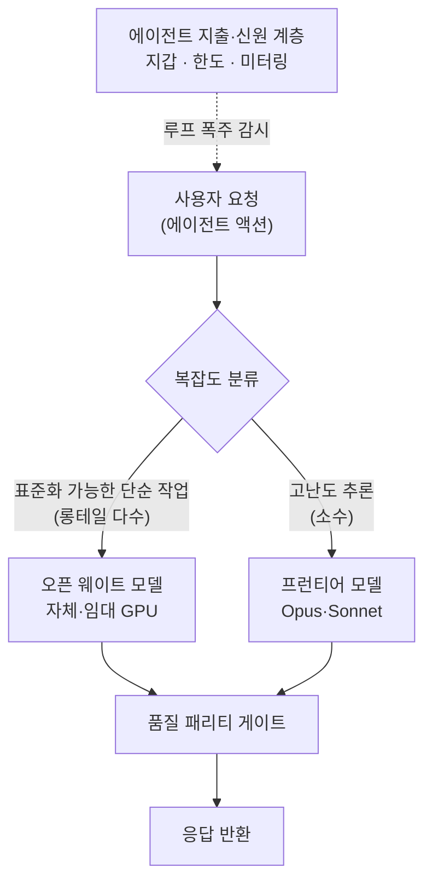

*대부분의 트래픽은 싼 레인으로, 소수만 프리미엄 레인으로. 에이전트 제품의 비용 구조는 이 분류에서 갈립니다.*

## 왜 읽어야 하나

이 글은 에이전트형 제품을 운영하며 추론 청구서가 매출보다 빠르게 늘어나는 것을 지켜보는 엔지니어와, 상용 API를 계속 쓸지 자체 클러스터로 내릴지를 판단해야 하는 인프라 담당자를 위해 썼습니다. 결론을 먼저 말씀드리면, 에이전트 제품의 비용은 어떤 모델을 쓰느냐가 아니라 **어떤 요청을 어느 모델로 보내느냐**에서 갈립니다. 최근 공개된 한 창업자의 인터뷰가 이 지점을 아주 선명하게 보여줍니다. 모든 에이전트 액션을 프런티어 모델로 처리하던 제품이 월 120만 달러까지 청구서를 키웠다가, 두 달의 재설계 끝에 약 10만 달러로 내렸습니다. 무엇을 바꿔서 열두 배가 빠졌는지, 그리고 같은 판단이 자체 플랫폼의 어디에 해당하는지를 정리했습니다.

## 청구서가 먼저 무너진 제품

사례의 주인공은 Polsia라는 제품입니다. 창업자 Ben Broca가 직원 없이 혼자 운영하며, 사용자가 아이디어만 넣으면 AI 에이전트 함대가 코딩·마케팅·고객 확보·지원까지 하나의 회사를 대신 굴려 주는 것을 목표로 합니다. 회사의 데이터룸 정리와 투자자 브리핑까지 에이전트가 처리한 상태에서 직원 0명으로 2억 5천만 달러 밸류에 3천만 달러를 유치했다는 이야기로 화제가 됐습니다. 흥미로운 건 성공담이 아니라, 그 과정에서 비용 구조가 먼저 무너졌다는 사실입니다.

창업자가 [인터뷰](https://www.youtube.com/watch?v=bzf2YZa0Vkg)에서 밝힌 숫자는 이렇습니다. 3월에 유료 사용자가 500명에서 5,000명으로 늘자 추론 비용이 한 달 만에 50만 달러를 찍었고, 이후 100만 달러를 넘겨 정점에서는 월 120만 달러에 달했습니다. 원인은 단순합니다. 제품 안에서 무언가가 일어날 때마다 그 실행 주체는 에이전트였고, 그 에이전트는 대부분 Opus나 Sonnet 같은 프런티어 모델을 호출했습니다. 자동화를 더 붙일수록, 사용자가 더 복잡한 작업을 시킬수록 호출량은 선형이 아니라 그 이상으로 늘었습니다.

여기서 첫 번째 교훈이 나옵니다. 자금을 넣는 것은 제품을 고치지 못합니다. 창업자는 투자 유치로 한동안 비용을 감당할 여유를 얻었지만, 스스로도 "현금은 숨 쉴 틈을 줬을 뿐 제품을 해결하지는 못했다"고 말합니다. 사용자를 5,000명에서 5만 명으로 늘리면 몇 달 안에 유치한 자금을 전부 소진한다는 계산이 나왔고, 그래서 확장하기 전에 구조 자체를 바꿔야 했습니다. 청구서가 감당 가능한 시점에 이미 아키텍처 문제로 인식한 것이 이 사례에서 가장 중요한 판단입니다.

## 무엇을 바꿨나: 요청을 나누고, 싼 레인을 만들다

재설계의 출발점은 트래픽을 정직하게 들여다본 관찰이었습니다. 창업자의 표현을 그대로 옮기면, 사용자 대부분은 "생각보다 단순한 것을 물어보고, 생각보다 단순한 코드베이스를 가지고 있어서, 그걸 전부 표준화할 수 있다"는 것이었습니다. 즉 요청이 균질하지 않다는 사실이 지렛대였습니다. 소수의 고난도 요청과 다수의 표준화 가능한 단순 요청이 섞여 있는데, 이 둘을 같은 프런티어 모델로 처리하는 것이 낭비의 실체였습니다.

그래서 바꾼 구조는 이렇습니다. 표준화 가능한 롱테일 요청은 임대 GPU 위에 올린 오픈 웨이트 모델로 내리고, 진짜로 어려운 추론만 프런티어 모델에 남깁니다. 요청이 들어오면 먼저 복잡도를 분류하고, 그 분류 결과에 따라 목적지 모델을 정하는 것입니다. 이 구성을 잡는 데 약 두 달이 걸렸고, 6월에 청구서는 120만 달러에서 약 10만 달러로 떨어졌습니다. 열두 배 차이는 더 싼 모델을 하나 골랐기 때문이 아니라, 트래픽의 대부분을 애초에 비싼 레인에서 빼냈기 때문에 나온 숫자입니다.

이 대목에서 두 번째 교훈을 강조하고 싶습니다. 이것은 공짜가 아닙니다. 두 달이라는 시간은 분류기를 만들고, 오픈 모델을 서빙하고, 무엇보다 싼 모델로 내린 요청의 품질이 사용자 경험을 해치지 않는지 검증하는 데 든 실제 엔지니어링입니다. 라우팅은 품질 패리티 게이트와 짝을 이루지 않으면 비용을 줄이는 대신 이탈을 늘립니다. 저렴한 레인이 성립하려면 "이 요청은 싼 모델로 내려도 결과가 같은가"를 결정론적으로 판정하는 장치가 함께 있어야 합니다.

분류기가 무엇을 보고 판단하는지가 이 설계에서 가장 어려운 부분입니다. 요청 텍스트만으로는 부족합니다. 작업의 종류가 생성인지 수정인지 조회인지, 대상 코드베이스의 크기와 구조가 어떤지, 예상되는 툴 콜의 깊이가 얼마나 되는지, 과거의 유사 요청이 어떻게 처리됐는지 같은 신호를 함께 봐야 표준화 가능 여부가 갈립니다. 그리고 이 판정을 모델의 자기 보고에 맡겨서는 안 됩니다. "이건 쉬운 요청입니다"라는 모델의 주장이 아니라, 결과물이 상위 모델과 같은 기준을 통과하는지를 코드가 결정론적으로 재는 게이트가 있어야 라우팅이 신뢰를 얻습니다. 값싼 레인의 실패를 조용히 통과시키는 분류기는 비용을 줄이는 게 아니라 품질 사고를 뒤로 미룰 뿐입니다.

*표준화 가능한 다수는 싼 레인으로, 소수의 고난도만 프리미엄 레인으로 보내는 복잡도 기반 라우팅입니다. 품질 패리티 게이트가 없으면 비용 절감이 이탈로 바뀝니다.*

## 하나의 사례가 아니라 하나의 계층이 만들어지고 있다

이 이야기를 개별 제품의 무용담으로만 보면 절반만 읽은 것입니다. 인터뷰에는 세 개의 회사가 등장하고, 이들을 겹쳐 놓으면 에이전트 시대의 비용을 다루는 계층이 어떻게 분화하는지가 보입니다.

맨 위에는 제품 계층이 있습니다. Polsia처럼 에이전트 함대가 24시간 루프를 돌며 실제 작업을 수행하는 곳입니다. 이 계층의 특성은 모든 액션이 곧 모델 호출이라는 점이고, 그래서 비용이 사용량과 함께 폭발합니다.

그 아래에 지출과 신원 계층이 있습니다. 인터뷰에서 Polsia가 에이전트 인프라로 지목한 Sapiom이 여기에 해당합니다. Sapiom은 사람에게 KYC가 있듯 에이전트에 고유 신원과 지갑을 부여하고, 단일 API로 외부 툴·API·컴퓨트를 사용량 기반으로 결제하게 하며, 지출 한도와 위험 탐지로 루프 폭주를 막는 것을 목표로 합니다. 전 Shopify 엔지니어링 디렉터 Ilan Zerbib이 창업했고, [SiliconANGLE 보도](https://siliconangle.com/2026/02/06/sapiom-reels-15-75m-equip-ai-agents-payment-features/)에 따르면 1,575만 달러 시드를 유치했습니다. 자율 에이전트가 스스로 자원을 구매하는 순간, 누가 얼마를 썼는지를 신원 단위로 계측하고 한도를 거는 장치가 인프라의 한 축이 된다는 신호입니다.

가장 아래에는 서빙 계층이 있습니다. AMD와 SignalFire가 후원해 약 1,200만 달러를 유치한 Sciforium이 대표적입니다. 대부분의 AI 클라우드가 엔비디아에 의존하는 상황에서, Sciforium은 AMD 하드웨어 위에 자체 고효율 서빙 스택을 얹어 멀티모달 추론을 기존 대비 낮은 비용으로 제공하는 것을 내세웁니다. AMD 엔지니어가 직접 붙어 런타임을 다듬는다는 점에서, 단일 벤더 프리미엄을 우회하는 이기종 가속기 전략이 자본과 인력을 확보하며 현실이 되고 있음을 보여줍니다.

세 회사를 관통하는 논리는 하나입니다. 프런티어 모델을 기본값으로 두는 순간 에이전트 제품의 단가는 지속 불가능해지고, 그래서 요청을 나누고, 지출을 계측하고, 서빙을 값싼 하드웨어로 내리는 계층이 각각 독립된 사업이 될 만큼 커지고 있다는 것입니다.

## ThakiCloud 제품 적용 시사점

이 사례를 우리 스택에 겹쳐 보면, 낯선 새 요구가 아니라 이미 우리가 서 있는 자리를 확인하게 됩니다. 여기서는 새로 무엇을 구현하겠다는 이야기가 아니라, 이 패턴이 우리 플랫폼의 어느 지점에 해당하는지를 짚습니다.

서빙과 플랫폼 계층은 Metis의 값 제안과 정확히 겹칩니다. Polsia가 "GPU를 임대해 오픈 모델을 OpenAI 호환 엔드포인트로 서빙한다"는 결론에 두 달을 들여 도달했다면, Metis Serve와 ML Studio, 그리고 Kueue 기반 GPU 스케줄링과 모델 레지스트리는 바로 그 결론을 제품화한 형태입니다. 특히 Sciforium이 증명하려는 이기종 가속기 서빙, 즉 엔비디아만이 아니라 AMD나 국산 NPU 위에서도 같은 API로 모델을 올리는 방향은 Metis가 가속기 중립적으로 설계된 이유와 같은 곳을 바라봅니다. 이 사례는 우리가 만들고 있는 서빙 계층의 시장 수요를 외부에서 재확인해 주는 근거입니다.

에이전트 런타임 계층은 Praxis의 문제 영역과 맞닿습니다. 에이전트 함대가 24시간 돌며 모든 액션이 모델 호출이 되는 구조에서 비용을 통제하는 방법은 두 가지인데, 하나는 노드별 복잡도 기반 모델 라우팅이고 다른 하나는 예산 상한과 지출 가드레일입니다. Sapiom이 신원·지갑·한도로 담으려는 지출 거버넌스는 Praxis 에이전트가 프로덕션에서 필요로 하는 통제 계층과 같은 성격입니다. 자율 루프가 값비싼 모델을 무한히 부르지 못하게 막는 장치는 선택이 아니라 전제라는 점을, 이 사례가 청구서로 증명합니다.

덧붙이면, 복잡도에 따라 값싼 티어로 시작해 필요할 때만 상위 모델로 올리는 방식은 우리가 내부 자동화에서 이미 규율로 삼고 있는 원칙이기도 합니다. 탐색과 단순 조회는 가벼운 모델로, 진짜 추론이 필요한 단계만 상위 모델로 보내고, 반복 실패가 관측될 때만 등급을 올리는 회고 기반 승급이 그것입니다. Polsia가 외부에서 도달한 결론과 우리가 내부에서 운용하는 라우팅 규율은 같은 문장을 말하고 있습니다. 비용은 모델 단가가 아니라 어떤 요청을 어디로 보내느냐에서 결정된다는 것입니다.

열두 배라는 숫자가 중요한 이유는 단순한 원가 절감을 넘어 사업의 상태 자체를 바꾸기 때문입니다. 창업자는 이 재설계로 적자에서 흑자로 전환했고, 무료 버전을 열 수 있게 됐다고 말합니다. 추론 단가를 내리는 일은 비용 항목 하나를 줄이는 데 그치지 않고, 가격을 낮춰 더 많은 사용자를 받아들일 수 있는 성장의 문을 여는 일이라는 뜻입니다. 반대로 말하면, 추론 비용을 통제하지 못하는 에이전트 제품은 성장할수록 손실이 커지는 구조에 갇힙니다. 라우팅 설계가 인프라 팀의 세부 최적화가 아니라 제품의 생존 조건인 이유가 여기에 있습니다.

## 정리

에이전트 제품을 만들 때 가장 비싼 실수는 모든 액션을 프런티어 모델로 처리하는 기본값을 방치하는 것입니다. Polsia의 사례는 그 기본값이 어떻게 월 120만 달러의 청구서가 되는지, 그리고 요청을 복잡도로 나누어 표준화 가능한 다수를 오픈 웨이트 모델로 내리는 재설계가 어떻게 열두 배의 차이를 만드는지를 청구서로 보여 줍니다. 다만 그 절감은 두 달의 엔지니어링과 품질 패리티 게이트라는 대가를 함께 치른 결과이지, 더 싼 모델을 하나 고르는 일이 아니었습니다. 그리고 이 재설계에 필요한 세 계층, 즉 에이전트 런타임과 지출 거버넌스와 이기종 서빙은 각각 독립된 사업으로 커질 만큼 시장이 분화하고 있으며, 그 가운데 서빙과 라우팅 계층은 우리가 Metis와 Praxis로 이미 서 있는 자리입니다.
