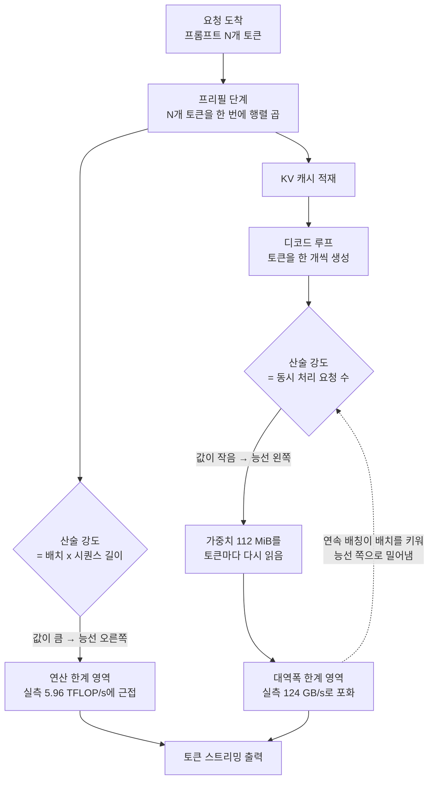

*연산기는 넓은데 통로가 하나입니다. LLM 디코드 스텝의 모양이 정확히 이렇습니다.*

## 왜 읽어야 하나

이 글은 GPU를 직접 사서 모델을 올려야 하는 인프라 담당자와, 서빙 파라미터를 어디까지 밀어야 할지 판단해야 하는 ML 엔지니어를 위해 썼습니다. 결론을 먼저 말씀드리면, **한 개의 요청만 처리하는 디코드 스텝은 GPU 연산기의 2%대만 쓰고 나머지 시간을 전부 메모리에서 가중치를 읽는 데 씁니다. 그래서 추론 서빙에서 늘려야 할 것은 GPU의 연산 성능이 아니라 동시에 처리하는 요청 수이고, 그 임계점은 장비마다 계산으로 구할 수 있습니다.** 아래에서 그 임계점을 직접 측정해 보겠습니다.

이 주제는 [AI 엔지니어가 배워야 할 것](https://x.com/hjguyhan/status/2084039209313350116)을 묶은 타임라인 글에서 출발했습니다. 그 목록의 앞자리에 "루프라인 모델을 배우고 디코드가 왜 메모리 바운드인지 이해하라", "vLLM과 SGLang을 배포해 보라"가 나란히 있었습니다. 두 항목은 사실 하나의 이야기입니다. 앞의 것을 이해하면 뒤의 것이 왜 그렇게 설계되었는지가 자동으로 따라옵니다.

## 개요

LLM 추론은 성격이 완전히 다른 두 단계로 나뉩니다. 프롬프트 전체를 한 번에 밀어 넣는 프리필과, 토큰을 한 개씩 뽑아내는 디코드입니다. 사용자가 체감하는 응답 속도의 대부분은 디코드에서 나옵니다. 500 토큰짜리 답변이면 디코드 스텝을 500번 도는 것이고, 그 500번의 합이 곧 응답 시간입니다.

여기서 직관이 어긋나기 시작합니다. 디코드 스텝 한 번에 필요한 연산량은 아주 적습니다. 토큰 하나에 대해 행렬 곱을 한 번씩 통과시키면 끝입니다. 그런데도 느립니다. 이유는 연산량이 아니라 **그 연산을 하기 위해 읽어야 하는 가중치의 양**에 있습니다. 8B 모델이면 fp16 기준 16GB를 토큰 하나마다 메모리에서 끌어와야 합니다. 연산기는 그 데이터가 도착하기를 기다리며 대부분의 시간을 놀고 있습니다.


*토큰 하나를 얻기 위해 옮겨야 하는 데이터의 양을 길이로 그리면 이런 비율이 됩니다.*

이 관계를 한 장에 그리는 도구가 루프라인 모델입니다. 2009년 Williams, Waterman, Patterson이 정리한 이 모델은 커널 하나의 성능 상한을 두 개의 하드웨어 상수, 즉 최대 연산 성능과 최대 메모리 대역폭으로 설명합니다. 커널마다 **산술 강도**, 그러니까 메모리에서 읽은 1바이트당 수행하는 부동소수점 연산 횟수를 계산하면, 그 커널이 연산에 묶이는지 대역폭에 묶이는지가 결정됩니다.

핵심은 이 산술 강도를 LLM 디코드에 대입했을 때 나오는 값입니다. 가중치 행렬 하나를 놓고 배치 B개의 토큰을 통과시키면 연산량은 배치에 비례해 늘지만 읽어야 할 가중치의 양은 그대로입니다. 즉 **디코드의 산술 강도는 곧 배치 크기**입니다. 배치 1이면 산술 강도 1이고, 이 값은 어떤 가속기에서도 처참하게 낮은 축에 듭니다.

## 이 기술은 무엇인가

루프라인 모델의 좌표계는 단순합니다. 가로축이 산술 강도, 세로축이 실제 달성 성능입니다. 상한선은 두 직선이 만나 만드는 지붕 모양입니다. 왼쪽은 기울기가 메모리 대역폭인 사선이고, 오른쪽은 최대 연산 성능에서 평평해지는 수평선입니다. 둘이 만나는 지점을 능선이라고 부르며, 그 x좌표는 최대 연산 성능을 최대 대역폭으로 나눈 값입니다.


*지붕의 꺾이는 지점이 능선입니다. 디코드는 배치 1일 때 이 지붕의 가장 왼쪽 끝에 놓입니다.*

능선 왼쪽에 있는 커널은 대역폭에 묶여 있습니다. 이 영역에서는 GPU를 더 빠른 연산기로 바꿔도 성능이 그대로입니다. 반대로 능선 오른쪽은 연산에 묶여 있어서 메모리를 아무리 넓혀도 소용이 없습니다. 최적화의 방향을 정하는 데 이보다 명확한 나침반은 드뭅니다.



이 그림에서 점선으로 표시한 되먹임이 vLLM과 SGLang 같은 서빙 엔진이 하는 일의 본질입니다. 개별 요청의 산술 강도는 사용자가 정하는 것이 아니라 스케줄러가 정합니다. 같은 순간에 처리 중인 요청을 한 배치로 묶으면 가중치를 한 번 읽어 여러 요청을 동시에 진행시킬 수 있고, 산술 강도는 묶은 개수만큼 올라갑니다. vLLM은 이를 위해 KV 캐시를 고정 크기 블록으로 쪼개 물리적으로 연속되지 않아도 되게 만들었고([PagedAttention](https://docs.vllm.ai/en/v0.4.2/models/performance.html)), 긴 프롬프트의 프리필을 여러 조각으로 나눠 디코드 스텝 사이에 끼워 넣는 청크 프리필로 배치가 비는 순간을 줄입니다. [SGLang](https://github.com/sgl-project/sglang)은 여기에 더해 요청들의 공통 프리픽스를 래딕스 트리로 공유하는 [RadixAttention](https://arxiv.org/pdf/2312.07104)을 얹어 프리필 연산 자체를 줄입니다. 세 기법은 서로 배타적이지 않고 [함께 쓰입니다](https://github.com/vllm-project/vllm/issues/2560).


*세 기법은 서로 다른 최적화가 아니라 같은 좌표축 위에서 요청을 오른쪽으로 미는 서로 다른 방법입니다.*

## 설치 및 통합

실제로 재보겠습니다. 필요한 것은 파이토치 하나뿐입니다. 저장소의 공용 가상환경에 이미 들어 있는 버전을 그대로 썼습니다.

```bash
# 저장소 공용 .venv (Python 3.12.8) 기준
VIRTUAL_ENV="$PWD/.venv" uv pip install torch matplotlib
.venv/bin/python -c "import torch; print(torch.__version__, torch.backends.mps.is_available())"
# 2.13.0 True
```

측정 코드는 세 부분입니다. 첫째, 256MiB짜리 fp16 버퍼를 장치 내부에서 복사해 읽기와 쓰기를 합한 실효 대역폭을 잽니다. 둘째, 4096 정사각 fp16 행렬 곱으로 연산 상한을 잽니다. 셋째, Llama-3-8B의 FFN up 프로젝션과 같은 모양인 `4096 x 14336` 가중치를 놓고 배치를 1부터 512까지 훑습니다.

```python
K, N = 4096, 14336          # Llama-3-8B hidden / intermediate
w = torch.empty(K, N, dtype=torch.float16, device="mps").uniform_(-0.02, 0.02)

for b in [1, 2, 4, 8, 16, 32, 64, 128, 256, 512]:
    x = torch.empty(b, K, dtype=torch.float16, device="mps").uniform_(-1, 1)
    secs = timed(lambda: torch.matmul(x, w), "mps")   # warmup 3 + 20회 평균
    flops = 2.0 * b * K * N
    total_bytes = w.numel() * 2 + (x.numel() + b * N) * 2
    # 산술 강도 = flops / total_bytes ≈ b
```

세 번째 부분이 왜 이런 모양인지 짚고 넘어가겠습니다. 연산량은 `2 x B x K x N`이고 읽는 바이트는 가중치 `K x N x 2`가 지배합니다. 둘을 나누면 정확히 `B`가 남습니다. 다시 말해 이 스윕은 **배치 크기를 바꿔 가며 루프라인의 가로축 위를 걸어가는 실험**입니다. 별도의 모델 가중치를 내려받을 필요도, 서빙 엔진을 띄울 필요도 없습니다.

실행은 격리된 작업 트리 안에서 돌렸습니다.

```bash
bash scripts/blog/impl_sandbox.sh setup llm-decode-roofline
bash scripts/blog/impl_sandbox.sh run  llm-decode-roofline -- .venv/bin/python roofline_bench.py
bash scripts/blog/impl_sandbox.sh teardown llm-decode-roofline
```

## 실제 실험 결과

측정 환경은 macOS 26.5.2 arm64, 파이토치 2.13.0, MPS 백엔드입니다. 아래 숫자는 전부 `run-1.log`에서 그대로 가져온 값이며 추정치가 아닙니다.

먼저 하드웨어 상수 두 개입니다.

| 항목 | 측정값 |
|---|---|
| 복사 기준 실효 메모리 대역폭 | 124.4 GB/s |
| fp16 4096³ 행렬 곱 성능 | 5.96 TFLOP/s |
| 루프라인 능선 | 48.0 FLOP/byte |

능선이 48이라는 것은, 메모리에서 1바이트를 읽을 때마다 48회 이상 연산하지 않으면 이 장비의 연산기를 다 쓸 수 없다는 뜻입니다. 그리고 앞에서 확인했듯 디코드의 산술 강도는 배치 크기와 같습니다. 즉 **배치가 48에 도달하기 전까지 디코드는 예외 없이 대역폭에 묶여 있습니다.**

배치 스윕 결과가 이를 그대로 보여 줍니다.

| 배치 | 스텝 시간 | 달성 연산 성능 | 토큰당 시간 |
|---|---|---|---|
| 1 | 0.834 ms | 140.8 GFLOP/s | 834.2 µs |
| 8 | 0.904 ms | 1,038.8 GFLOP/s | 113.1 µs |
| 16 | 0.920 ms | 2,042.9 GFLOP/s | 57.5 µs |
| 32 | 1.033 ms | 3,637.6 GFLOP/s | 32.3 µs |
| 64 | 1.413 ms | 5,317.9 GFLOP/s | 22.1 µs |
| 512 | 10.015 ms | 6,003.9 GFLOP/s | 19.6 µs |

가장 눈여겨볼 구간은 배치 1에서 16까지입니다. 처리하는 토큰은 열여섯 배로 늘었는데 스텝 시간은 0.834ms에서 0.920ms로, 겨우 10% 늘었습니다. 열다섯 개의 토큰을 사실상 공짜로 처리한 셈입니다. 가중치 112MiB를 읽는 시간이 전체를 지배하고 있으니, 그 한 번의 읽기에 몇 개의 토큰을 태우든 비용이 거의 같기 때문입니다.


*연산기 사용률 2.36%, 대역폭 포화 113%. 같은 가중치 로드에 열여섯 배의 일을 태운 결과입니다.*

배치 64를 넘어서면 성격이 바뀝니다. 스텝 시간이 배치에 비례해 늘기 시작하고 토큰당 시간은 22.1µs에서 19.6µs로 거의 움직이지 않습니다. 능선을 넘어 연산 한계 영역에 들어선 것입니다. 계산으로 구한 능선 48과 관측된 변곡점이 32와 64 사이에 놓인 것은 잘 맞아떨어지는 결과입니다.


*측정점이 사선 위에 정확히 얹혀 있습니다. 배치를 키우는 것은 최적화가 아니라 좌표 위를 오른쪽으로 이동하는 일입니다.*

배치 1의 상태를 두 지표로 요약하면 이렇습니다. 연산기 사용률은 최대 성능의 **2.36%**입니다. 반면 실효 대역폭은 복사 기준 상한의 **113.2%**로 나왔습니다. 100%를 넘는 수치는 오차가 아니라 기준선의 성격 때문입니다. 복사 벤치마크는 읽기와 쓰기를 모두 포함하는데 쓰기에는 캐시 라인을 먼저 채우는 추가 트래픽이 붙습니다. 읽기만 하는 행렬 곱은 그 오버헤드가 없어서 더 높은 실효 대역폭을 냅니다. 결론은 분명합니다. 배치 1의 디코드는 메모리 버스를 완전히 포화시킨 상태이며, 연산기는 사실상 놀고 있습니다.

배치 1과 배치 512의 토큰당 시간 격차는 **42.6배**입니다. 같은 하드웨어, 같은 커널, 같은 정밀도인데 스케줄링만으로 벌어진 차이입니다.

## ThakiCloud 제품 적용 시사점

다키클라우드의 ai-platform은 쿠버네티스 위에서 고객별로 격리된 추론 워크로드를 운용합니다. 위 측정은 저희가 GPU 용량을 산정할 때 쓰는 사고방식을 그대로 압축한 것이기도 합니다.

첫째, **GPU 선택 기준이 달라집니다.** 디코드 위주의 워크로드에서는 카탈로그의 TFLOPS 숫자보다 메모리 대역폭과 용량이 훨씬 직접적으로 처리량을 결정합니다. 같은 예산이라면 연산 성능이 조금 낮아도 대역폭이 넓은 쪽이 토큰당 비용에서 유리한 구간이 분명히 존재합니다. 어느 쪽이 유리한지는 취향이 아니라 위와 같은 15줄짜리 스윕으로 장비마다 확인할 수 있습니다.

둘째, **테넌트를 나누는 방식이 비용을 좌우합니다.** 고객마다 GPU를 하나씩 전용으로 떼어 주면 관리는 편하지만, 각 GPU가 배치 1 근처에서 돌게 되어 연산기의 2%대만 쓰는 상태가 됩니다. 저희가 Kueue로 큐를 나누고 같은 모델을 쓰는 요청을 한 서빙 인스턴스로 모으는 이유가 여기 있습니다. 배치를 능선 근처까지 채우는 것이 곧 GPU 대수를 줄이는 일입니다.


*전용 할당은 관리가 편한 대신 배치 1의 함정에 갇힙니다. 큐로 모아 배치를 채우는 쪽이 같은 장비로 더 많은 토큰을 냅니다.*

셋째, **온프레미스 도입 검토에서 손익분기가 앞당겨집니다.** 자체 클러스터의 토큰당 원가는 GPU 시간당 비용을 실제 달성 처리량으로 나눈 값입니다. 배치를 채우지 못하면 분모가 40배 작아지고, 그 상태의 원가는 상용 API를 절대 이길 수 없습니다. 반대로 트래픽이 충분해 배치가 차기 시작하면 같은 장비의 원가 곡선이 급격히 내려갑니다. 국내 규제나 데이터 주권 요건 때문에 온프레미스를 검토하시는 고객께 저희가 먼저 확인해 드리는 것이 바로 이 트래픽 밀도입니다.

에이전트 워크로드에는 한 가지 반가운 성질이 있습니다. 다키클라우드의 Agent-Native Cloud인 Paxis는 스킬 하네스가 960개 이상의 스킬 중에서 후보를 골라 격리된 샌드박스에서 실행하는 구조인데, 이 과정에서 짧고 동시적인 추론 요청이 다수 발생합니다. 사람이 채팅창 앞에 하나씩 앉아 있는 트래픽과 달리 에이전트 트래픽은 자연스럽게 동시성이 높습니다. 위 곡선에서 보듯 동시성이 높다는 것은 곧 토큰당 원가가 낮은 구간에서 논다는 뜻입니다. 에이전트 플랫폼과 추론 인프라를 같은 회사가 함께 운용할 때 생기는 이점이 여기 있습니다.

## 한계 및 반론

이 실험은 통합 메모리 구조의 노트북급 가속기에서 측정했습니다. H100이나 H200처럼 HBM을 쓰는 데이터센터 GPU는 대역폭이 한 자릿수 TB/s대로 훨씬 높고 연산 성능도 그만큼 큽니다. 절대값은 당연히 다릅니다. 다만 능선이 존재한다는 사실과 디코드의 산술 강도가 배치 크기와 같다는 관계는 하드웨어와 무관하게 성립합니다. 실제로 고대역폭 데이터센터 GPU는 연산 성능이 대역폭보다 더 가파르게 성장해 온 탓에 능선이 더 오른쪽에 있는 경우가 많고, 그만큼 배치를 더 키워야 연산기를 채울 수 있습니다.

측정 대상을 FFN의 행렬 곱 하나로 좁힌 것도 한계입니다. 실제 디코드 스텝에는 어텐션 커널이 함께 들어가는데, 어텐션은 가중치가 아니라 KV 캐시를 읽으므로 시퀀스가 길어질수록 읽는 양이 늘어납니다. 배치를 키우면 KV 캐시도 같이 커져서 메모리 용량이 먼저 한계에 걸리는 경우가 흔합니다. 그래서 실전에서 배치 상한을 정하는 것은 능선이 아니라 KV 캐시가 차지할 수 있는 여유 메모리인 경우가 더 많습니다. PagedAttention이 조각 낭비를 줄이는 데 집중한 이유도 결국 이 지점입니다.

배치를 키우는 데 공짜가 없다는 점도 분명히 해야 합니다. 배치 512의 스텝 시간은 10ms로, 배치 1의 0.834ms보다 열두 배 깁니다. 처리량은 최고지만 개별 사용자가 느끼는 토큰 간 지연은 나빠집니다. 대화형 서비스라면 처리량과 지연 사이 어디에 서 있을지 서비스 수준 목표로 먼저 정하고, 그 제약 안에서 최대 배치를 잡아야 합니다. 능선은 상한을 알려 줄 뿐 목표점을 알려 주지는 않습니다.

## 정리

배치 1의 디코드가 연산기의 2.36%만 쓰고 메모리 버스는 완전히 포화시킨다는 사실, 그리고 그 상태에서 배치를 키우면 토큰당 시간이 42.6배 줄어든다는 사실이 오늘 실측의 전부입니다. 이 두 숫자를 알고 나면 vLLM의 연속 배칭과 청크 프리필, SGLang의 프리픽스 공유가 왜 하나같이 "배치를 채우는" 방향으로 수렴했는지가 설명됩니다. 이들은 서로 다른 최적화가 아니라 같은 좌표축 위에서 요청을 오른쪽으로 밀어내는 서로 다른 방법입니다.

그래서 다음에 추론 성능을 개선해야 할 때는 더 빠른 GPU를 찾기 전에 순서를 하나 넣으시길 권합니다. 쓰려는 장비에서 대역폭과 연산 성능을 재서 능선을 구하고, 지금 배치가 그 왼쪽에 있는지 오른쪽에 있는지 확인하는 것입니다. 왼쪽에 있다면 답은 하드웨어 교체가 아니라 스케줄러 설정에 있습니다. 이 글에 실린 스윕은 모델 가중치도 서빙 엔진도 필요 없이 파이토치만으로 15분 안에 끝납니다.

## 출처

- 원 논의: [AI 엔지니어가 배워야 할 것 (타임라인)](https://x.com/hjguyhan/status/2084039209313350116)
- Roofline: An Insightful Visual Performance Model for Multicore Architectures, Williams·Waterman·Patterson, CACM 2009
- [vLLM 성능 및 튜닝 문서 (청크 프리필, PagedAttention)](https://docs.vllm.ai/en/v0.4.2/models/performance.html)
- [SGLang 저장소](https://github.com/sgl-project/sglang) · [SGLang 논문 (RadixAttention)](https://arxiv.org/pdf/2312.07104)
- [vLLM 이슈 #2560: RadixAttention과 기존 기법의 호환성 논의](https://github.com/vllm-project/vllm/issues/2560)
- 측정 로그: 본문 수치는 모두 `outputs/blog-impl/llm-decode-roofline/run-1.log`에서 가져왔습니다.
