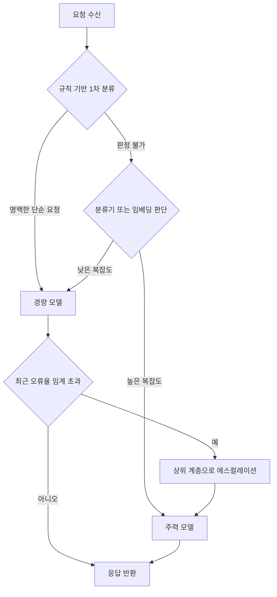

프로덕션에 LLM 기능을 올려본 엔지니어라면 익숙한 장면이 있습니다. 초기에는 가장 성능이 좋은 모델 하나로 모든 요청을 처리합니다. 트래픽이 늘어나면서 청구서가 예상보다 빠르게 불어나고, 그제야 "이 요청까지 굳이 최고 모델로 보내야 했나"라는 질문이 나옵니다. 이 글은 그 질문에 답하는 실무 방법인 모델 라우팅을 다룹니다. 어떤 계층으로 모델을 나누고, 어떤 기준으로 요청을 배정하며, 그 판단이 왜 종종 틀어지는지를 순서대로 짚습니다.

라우팅은 캐시나 토큰 예산처럼 단독으로 비용을 줄이는 장치가 아닙니다. 어떤 요청에 얼마짜리 모델을 쓸지 결정하는 경제적 판단입니다. 판단이 좋으면 품질 손실 없이 비용이 크게 줄어들고, 판단이 나쁘면 품질만 떨어지고 절약은 미미해집니다. 그 경계가 어디인지 아는 것이 이 글의 목표입니다.


*글의 핵심 개념을 형상화했습니다.*

## 계층을 먼저 정하지 않으면 라우팅은 성립하지 않습니다

여러 모델을 섞어 쓰기로 했다면 가장 먼저 할 일은 라우팅 로직을 짜는 것이 아니라 계층을 정하는 일입니다. 계층이 없는 상태에서 "이 요청은 어느 모델로 보낼까"를 매번 판단하면 기준이 요청마다 흔들리고, 나중에 비용을 분석할 때도 무엇이 왜 비쌌는지 설명할 수 없습니다.

계층은 보통 세 층으로 나눕니다. 첫 번째는 주력 모델입니다. 가장 비싸고 가장 똑똑한 모델로, 복잡한 추론이나 창의적 생성처럼 실수의 대가가 큰 작업에 씁니다. 호출 빈도는 가장 낮게 유지하는 것이 설계 목표입니다. 두 번째는 라우팅 모델입니다. 요청의 난이도를 먼저 가늠해서 주력 모델로 올릴지 걸러낼지 결정하는 역할을 맡습니다. 이 모델 자체는 최종 답변을 만드는 것이 아니라 분류를 하는 것이므로, 주력 모델보다 저렴한 모델로도 충분한 경우가 많습니다. 세 번째는 경량 모델입니다. 단순 분류, 정형화된 요약, 반복적인 사실 조회처럼 실수해도 되돌리기 쉬운 작업을 담당합니다. 호출 빈도가 가장 높고 단가는 가장 낮습니다.

이 구조의 핵심은 트래픽의 형태를 뒤집는 데 있습니다. 계층이 없으면 모든 요청이 주력 모델로 몰리는 피라미드 모양이 됩니다. 계층을 세우면 대부분의 요청이 경량 모델에서 끝나고, 정말 필요한 일부만 주력 모델까지 올라가는 역피라미드 모양이 됩니다. 이 뒤집힘이 곧 비용 절감의 실체입니다. 캐시가 반복되는 요청을 없애는 방식이라면, 라우팅은 애초에 비싼 모델에 도달하는 요청의 수를 줄이는 방식입니다. 둘은 서로 다른 축에서 작동하므로 함께 두는 것이 자연스럽습니다.

계층을 나눌 때 자주 하는 실수는 모델의 절대적인 크기만 보고 계층을 정하는 것입니다. 실제로 계층을 가르는 기준은 크기가 아니라 역할입니다. 라우팅 모델의 역할은 정답을 만드는 것이 아니라 판정을 내리는 것이므로, 크기가 작아도 판정 정확도만 확보되면 충분합니다. 반대로 경량 모델에 최종 응답 생성을 맡기면서 주력 모델 수준의 품질을 기대하면 계층 설계 자체가 무너집니다. 역할을 먼저 정하고 그 역할에 맞는 모델을 배정하는 순서를 지켜야 합니다.

## 라우팅 판단은 무엇을 근거로 삼는가

계층을 정했다면 다음 질문은 "이 요청을 어느 계층으로 보낼지 무엇을 보고 결정하는가"입니다. 실무에서 쓰이는 접근은 크게 세 가지이고, 각각 구현 난이도와 커버리지가 다릅니다.

가장 단순한 방법은 규칙 기반 결정입니다. 요청 길이, 포함된 키워드, 요청 유형 같은 표면적인 속성으로 분기합니다. 구현이 쉽고 판단 이유를 사람이 바로 설명할 수 있다는 장점이 있습니다. 다만 규칙으로 설명되지 않는 요청이 항상 일정 비율 남습니다.

```python
def rule_based_route(request: str) -> str:
    length = len(request)
    if any(k in request for k in ("분류", "요약")) and length < 500:
        return "light"
    if any(k in request for k in ("분석", "작성", "전략")) and length >= 1000:
        return "primary"
    return "router"  # 규칙으로 판정되지 않으면 라우팅 모델에 위임
```

두 번째는 분류기 기반 접근입니다. 과거 요청과 그 요청이 실제로 필요로 했던 품질 수준을 라벨로 쌓아 작은 분류 모델을 훈련합니다. 규칙보다 미묘한 차이를 잡아냅니다. 예를 들어 같은 단어를 포함해도 "사랑이라는 개념을 철학적으로 탐구해줘"와 "사랑의 영어 단어를 알려줘"는 요구되는 추론의 깊이가 다릅니다. 규칙으로는 이 둘을 가르기 어렵지만 분류기는 문맥과 어투에서 그 차이를 학습할 수 있습니다. 대가는 라벨링된 훈련 데이터와 분류기 자체의 유지보수 비용입니다.

세 번째는 임베딩 기반 유사도 판단입니다. 새 요청을 임베딩하고 과거에 각 계층으로 처리했던 요청들과의 거리를 계산합니다. 과거 주력 모델 처리 이력과 거리가 가까우면 주력 모델로, 경량 모델 처리 이력과 가까우면 경량 모델로 보냅니다. 라벨링된 훈련 데이터가 필요 없다는 점이 분류기 대비 장점입니다.

```python
import numpy as np

def embedding_route(query_vec, primary_vecs, light_vecs, threshold=0.82):
    def max_sim(vecs):
        sims = query_vec @ np.array(vecs).T
        return float(sims.max()) if len(vecs) else 0.0

    if max_sim(primary_vecs) >= threshold:
        return "primary"
    if max_sim(light_vecs) >= threshold:
        return "light"
    return "router"  # 어느 쪽과도 충분히 가깝지 않으면 판정을 위임
```

이 임계값 하나가 임베딩 기반 라우팅의 전체 성패를 좌우합니다. 임계값을 높이면 애매한 요청이 라우팅 모델로 더 많이 흘러가 안전해지지만 절약 효과가 줄어듭니다. 낮추면 더 많은 요청이 즉시 판정되어 절약은 늘지만 오판의 위험도 함께 커집니다. 이 값은 이론으로 정하는 것이 아니라 실제 트래픽에서 오판율을 관찰하며 조정해야 하는 값입니다.

세 방식을 놓고 어느 것이 정답인지 고르는 문제로 접근하면 안 됩니다. 실무에서는 규칙으로 명백한 경우를 먼저 걸러내고, 규칙으로 판정되지 않는 나머지만 분류기나 임베딩으로 넘기는 조합이 흔합니다. 규칙은 빠르고 저렴하며 설명 가능하므로 1차 필터로 두고, 더 정교한 판단이 필요한 부분에만 비용이 드는 방법을 쓰는 것이 합리적입니다.

라우팅 판단의 기준을 정할 때는 판단 축이 두 가지라는 점도 함께 고려해야 합니다. 하나는 "이 요청이 복잡한 추론을 요구하는가"를 묻는 의사결정 라우팅이고, 다른 하나는 "이 응답에 어느 정도의 품질이 요구되는가"를 묻는 품질 라우팅입니다. 전자는 요청 자체의 난이도를, 후자는 비즈니스 맥락에서의 요구 수준을 봅니다. 고객에게 직접 노출되는 응답과 내부 로그 요약이 같은 난이도의 요청이라도 다른 계층으로 가야 하는 이유가 여기에 있습니다. 라우팅 로직을 설계할 때 이 두 축을 하나로 뭉뚱그리면 판단 기준이 흐려지므로, 어느 축을 우선할지 먼저 정하고 시작하는 편이 낫습니다.

## 비용-품질 곡선에서 중간 계층이 무용해지는 이유

라우팅을 도입하기 전에 반드시 확인해야 할 것이 하나 있습니다. 지금 쓰려는 계층 구조가 실제로 절약을 만들어내는지, 아니면 복잡도만 더하고 있는지입니다. 이를 확인하는 방법이 비용-품질 트레이드오프 곡선입니다.

이 곡선은 가로축에 비용, 세로축에 품질 점수를 두고 각 계층이 실제로 어디에 위치하는지 찍어보는 작업입니다. 세 계층이 있다면 이론적으로는 점 세 개가 대각선을 그리며 나란히 놓여야 합니다. 저비용 저품질, 중간 비용 중간 품질, 고비용 고품질이라는 예상입니다.

| 계층 | 비용 특성 | 품질 특성 |
|---|---|---|
| 경량 모델 | 가장 낮음 | 단순 작업에서는 기대보다 높은 경우가 흔함 |
| 라우팅 모델 | 중간 | 애매한 위치에 머무는 경우가 많음 |
| 주력 모델 | 가장 높음 | 가장 높지만 특정 구간부터 증가폭이 급격히 줄어듦 |

실제로 이 곡선을 그려보면 예상과 다른 모양이 자주 나옵니다. 경량 모델의 품질이 생각보다 높은 구간이 있고, 주력 모델은 어느 지점을 넘어서면 추가 비용 대비 품질 향상이 눈에 띄게 둔화됩니다. 그리고 이 곡선에서 가장 자주 문제가 되는 지점이 중간 계층입니다. 중간 계층은 비용은 확실히 더 들지만 품질은 경량 모델과 크게 차이 나지 않는 구간에 자주 위치합니다. 즉 돈은 더 쓰는데 결과는 별로 나아지지 않는 위치입니다.

이 현상이 일어나는 이유는 두 가지로 요약됩니다. 첫째, 라우팅 모델을 만들 때 흔히 "적당히 좋은 모델"을 고르는데, 이 적당함이 특정 작업 유형에서는 경량 모델과 체감 품질 차이를 만들지 못합니다. 둘째, 애초에 요청 분포 자체가 양극화되어 있는 경우가 많습니다. 실제 트래픽을 보면 정말 단순한 요청과 정말 복잡한 요청이 대부분이고, 그 사이의 애매한 요청은 생각보다 적습니다. 중간 난이도의 요청이 적다면 중간 계층의 존재 이유도 함께 약해집니다.

이 곡선이 알려주는 실전 결론은 명확합니다. 품질 요구가 높은 요청은 주력 모델로, 낮은 요청은 경량 모델로 보내는 이분법만으로도 상당 부분의 절약이 달성됩니다. 중간 계층은 곡선을 그려본 뒤에 정말 필요한 경우에만 유지하는 편이 낫습니다. 곡선을 그리는 절차 자체는 어렵지 않습니다. 과거 요청 표본을 주력 모델과 경량 모델 양쪽에 동시에 흘려보내고 응답 품질을 비교합니다. 두 응답의 품질 차이가 미미한 요청의 비율이 곧 이분법 라우팅만으로 절약할 수 있는 비용의 규모입니다. 이 비율이 낮게 나온다면 그때 비로소 중간 계층을 추가할 근거가 생깁니다.

## 라우팅이 만드는 두 가지 부작용

라우팅을 도입하면 비용은 확실히 줄어들지만 공짜로 줄어드는 것은 아닙니다. 대표적인 부작용이 두 가지 있고, 설계 단계에서 미리 다뤄두지 않으면 운영 중에 신뢰도 문제로 되돌아옵니다.

첫 번째는 처리되지 못한 경계 사례입니다. 라우팅 엔진이 어떤 요청을 애매한 난이도로 판단해 라우팅 모델로 보냈는데, 라우팅 모델이 그 요청에서 잘못된 응답을 내놓는 경우입니다. 문제는 사용자 입장에서 이 실패가 라우팅 판단의 오류가 아니라 서비스 전체의 품질 저하로 느껴진다는 점입니다. 사용자는 어떤 모델이 응답했는지 알지 못하므로, 라우팅 모델의 실수도 서비스의 실수로 인식됩니다.

이 부작용을 다루는 방법은 두 가지입니다. 하나는 라우팅 모델의 오류율을 계층별, 요청 유형별로 계속 관찰해서 특정 패턴에서 오류가 몰리는지 확인하는 것입니다. 다른 하나는 에스컬레이션 경로를 만드는 것입니다. 사용자가 응답에 불만을 표시하거나 재작성을 요청하면 그 요청을 주력 모델로 다시 보내는 흐름을 미리 준비해 둡니다.

```python
def route_with_escalation(request_id, tier, error_tracker):
    error_rate = error_tracker.recent_error_rate(tier, window=100)
    if tier != "primary" and error_rate > ERROR_RATE_THRESHOLD:
        # 최근 오류율이 임계치를 넘으면 해당 계층 라우팅을 일시 중단
        return "primary"
    return tier
```

두 번째 부작용은 품질 불안정입니다. 경량 모델은 같은 요청을 두 번 보내도 다른 응답을 내놓을 수 있습니다. 출력이 비결정적인 모델일수록 이 편차가 두드러집니다. 일관성이 중요한 기능, 예를 들어 같은 데이터에 대해 매번 같은 분류 결과가 나와야 하는 기능이라면 이 편차는 단순한 품질 저하를 넘어 신뢰도 문제로 번집니다.

완화 방법은 상황에 따라 다릅니다. 생성 온도를 낮추거나 결정적 모드를 지원하는 모델을 선택하는 것이 가장 직접적인 대응입니다. 일관성이 특히 중요한 기능이라면 경량 모델의 응답 자체를 캐시해서 동일 요청에는 항상 동일 응답을 돌려주는 방식도 함께 고려할 만합니다. 다만 캐시로 일관성을 확보하는 방법은 응답이 시간에 따라 달라져야 하는 요청에는 맞지 않으므로, 어떤 기능이 진짜로 결정적 응답을 필요로 하는지부터 먼저 구분해야 합니다.

라우팅 시스템 전체를 그려보면 아래와 같은 흐름이 됩니다. 규칙이 먼저 명백한 요청을 걸러내고, 남은 요청만 더 정교한 판단으로 넘기며, 그 판단 이후에도 오류율을 계속 관찰해 필요하면 상위 계층으로 되돌리는 구조입니다.



이 그림에서 중요한 지점은 화살표가 한 방향으로만 흐르지 않는다는 것입니다. 경량 모델에서 주력 모델로 되돌아가는 경로가 없다면 라우팅은 절약 장치가 아니라 품질 저하 장치가 됩니다. 되돌아가는 경로를 만드는 비용은 처음부터 모든 요청을 주력 모델로 보내는 비용보다 훨씬 낮으므로, 이 경로를 생략하는 것은 절약을 위해 치를 필요가 없는 위험입니다.

## ThakiCloud 관점에서

저희는 고객사 온프렘 환경에 모델을 직접 서빙하는 입장이라, 라우팅을 바라보는 시각이 API 종량제를 쓰는 팀과는 조금 다릅니다. API 기반 서비스에서 라우팅은 순수하게 청구 비용을 줄이는 문제입니다. 반면 자체 서빙 환경에서는 각 모델 계층이 GPU 노드 위의 실제 서빙 인스턴스로 존재하고, 그 인스턴스가 점유하는 자원 자체가 원가입니다. 요청을 경량 모델로 돌리는 것이 곧 더 작은 GPU 풀에서 더 많은 동시 요청을 처리하게 만드는 일이 되고, 반대로 주력 모델 인스턴스는 트래픽에 비해 과도하게 늘리지 않는 편이 자원 효율에 직접 이어집니다.

이 때문에 저희 플랫폼에서는 라우팅 판단을 애플리케이션 코드 안에만 두지 않고 스케줄링 계층과 함께 설계하는 편을 권합니다. 계층별로 다른 우선순위 큐와 GPU 리소스 풀을 배정해 두면, 경량 모델로 몰리는 트래픽이 주력 모델용 자원을 잠식하지 않고, 반대로 주력 모델이 필요한 요청이 대기열에 밀려 지연되는 일도 줄어듭니다. 저희 플랫폼이 Kueue 기반 우선순위 스케줄링을 GPU 서빙 계층에 적용하는 이유 중 하나가 바로 이 지점입니다. 라우팅 로직이 아무리 정교해도 그 판단이 실제 자원 배치와 어긋나 있으면 절약은 종이 위에만 남습니다.

## 정리

모델 라우팅은 계층을 나누는 것에서 시작해서, 그 계층에 요청을 배정하는 판단 기준을 정하고, 그 판단이 실제로 절약을 만드는지 비용-품질 곡선으로 확인하는 순서로 설계해야 합니다. 규칙과 분류기와 임베딩은 각각 다른 장단점을 가지므로 하나만 고집하기보다 명백한 경우는 규칙으로, 애매한 경우만 더 정교한 방법으로 넘기는 조합이 실무에서 잘 작동합니다. 중간 계층은 곡선을 그려보기 전까지는 존재 이유가 확실하지 않다는 점을 기억해 둘 필요가 있습니다. 그리고 어떤 라우팅 시스템이든 처리되지 못한 경계 사례와 품질 불안정이라는 두 부작용을 함께 설계해야, 절약이 신뢰도를 갉아먹는 방식으로 되돌아오지 않습니다.

이 글의 내용은 저희가 사내 자동화 파이프라인을 운영하면서 정리한 전자책 "AI 비용 공학: 프로덕션 LLM 앱의 토큰, 라우팅, 캐시 설계"의 일부를 블로그용으로 다시 쓴 것입니다.

## 출처

- [Kueue (Kubernetes SIG: batch·HPC·AI/ML 워크로드를 위한 잡 큐잉 시스템. 우선순위 기반 선점을 지원하는 스케줄링)](https://kueue.sigs.k8s.io/)
- [RouteLLM: Learning to Route LLMs with Preference Data (arXiv 2406.18665. 추론 시 더 강한 LLM과 약한 LLM을 동적으로 선택해 비용을 줄이되 응답 품질을 유지하는 라우터)](https://arxiv.org/abs/2406.18665)
