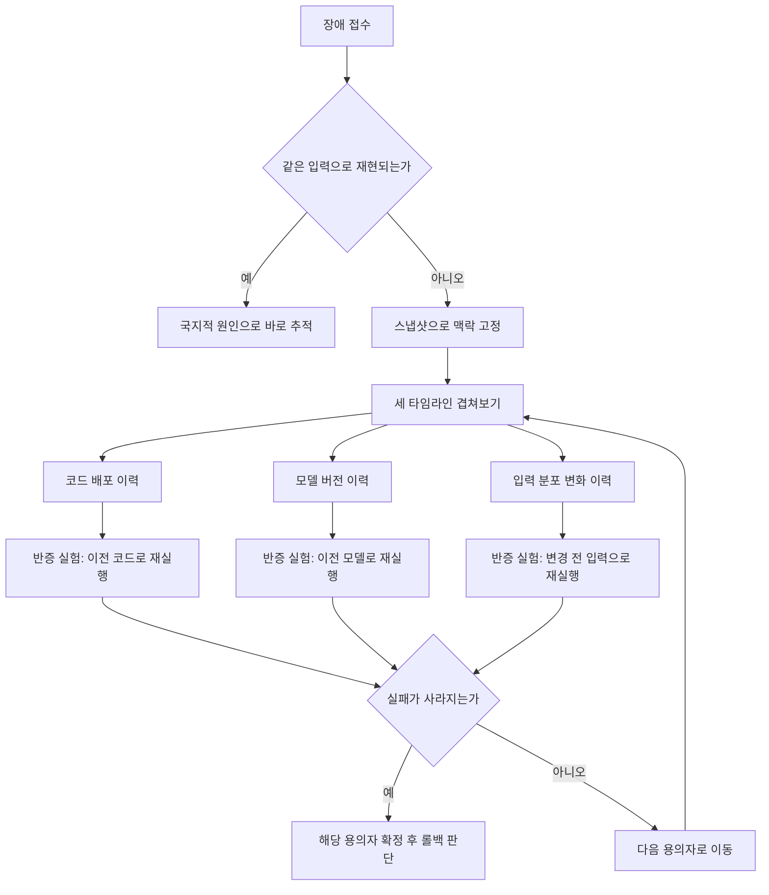

AI 기능에서 장애가 터졌는데 스택트레이스가 없는 상황을 겪어본 엔지니어를 위한 글입니다. 같은 입력을 다시 넣어도 재현되지 않고, 에러 로그는 깨끗한데 사용자 불만은 쌓이는 경험을 해보셨다면 이 글이 도움이 될 겁니다. 재현되지 않는 실패를 붙잡는 방법, 원인을 입력 분포와 모델 변경과 코드 변경 세 갈래로 좁혀가는 순서, 조용히 나빠지는 품질을 사고 조사 과정에서 알아채는 법, 그리고 롤백을 결정하는 기준을 다룹니다.


*글의 핵심 개념을 형상화했습니다.*

## 재현이 안 되는 것 자체가 첫 번째 단서입니다

일반적인 소프트웨어 디버깅은 재현을 전제로 합니다. 같은 입력을 넣으면 같은 출력이 나오고, 그 사이 어딘가에 브레이크포인트를 걸면 원인이 보입니다. AI 시스템은 이 전제가 자주 무너집니다. 샘플링 온도가 있으면 같은 입력도 매번 다른 출력을 냅니다. 배치 처리 과정에서 GPU 커널의 실행 순서가 미묘하게 달라지면 부동소수점 연산 결과가 흔들립니다. 검색 증강 구조라면 참조 문서 자체가 색인 갱신으로 바뀌어 버립니다. 무엇보다 API로 제공되는 모델은 우리가 모르는 사이 뒤에서 교체됩니다.

그래서 신고가 들어왔을 때 첫 반응이 같은 입력으로 재현을 시도하는 것이면 시간을 버릴 확률이 높습니다. 대신 해야 할 일은 그 순간의 맥락을 통째로 붙잡아 두는 것입니다. 실패가 일어난 그 순간의 조건은 다시 오지 않을 가능성이 크기 때문입니다.

여기서 맥락이란 입력 텍스트만이 아닙니다. 어떤 모델 버전이 응답했는지, 어떤 프롬프트 템플릿 버전이 쓰였는지, 실행 중이던 코드의 커밋 해시, 샘플링 파라미터, 검색이나 도구 호출 결과, 후처리를 거치기 전의 원본 응답까지를 포함합니다. 이 중 하나라도 사후에 따로 조회하는 방식이라면 이미 사라졌을 가능성이 높습니다. 모델은 새 버전으로 갱신되고, 색인은 다시 빌드되고, 캐시는 만료됩니다.

```python
def capture_failure_snapshot(request_id, prompt, raw_response, metadata):
    """실패 또는 에스컬레이션 시점에 전체 맥락을 그대로 저장합니다."""
    snapshot = {
        "request_id": request_id,
        "timestamp": metadata["timestamp"],
        "model_version": metadata["model_version"],
        "prompt_template_version": metadata["prompt_template_version"],
        "code_revision": metadata["git_sha"],
        "sampling_params": metadata["sampling_params"],
        "retrieved_context": metadata.get("retrieved_context"),
        "raw_response": raw_response,
        "postprocessed_response": metadata.get("postprocessed_response"),
    }
    durable_store.put(f"snapshot/{request_id}", snapshot)
    return snapshot
```

이 스냅샷은 사후 재현이 아니라 사후 분석을 위한 것입니다. 나중에 원인을 세 갈래로 좁힐 때, 이 스냅샷이 그 시점의 유일한 증거가 됩니다.

여러 턴이 이어지는 대화형 기능이라면 문제는 더 커집니다. 실패는 세 번째 턴에서 나타났는데 원인은 첫 번째 턴에서 잘못 붙은 문맥일 수 있습니다. 스냅샷을 요청 단위가 아니라 세션 단위로 묶어 두지 않으면, 실패한 턴만 따로 들여다봐서는 아무것도 보이지 않습니다. 세션 전체를 순서대로 복원할 수 있어야 그 대화가 어디서 궤도를 이탈했는지 짚을 수 있습니다. API로 제공되는 모델을 쓰는 경우에는 이 문제가 한 겹 더 있습니다. 제공사가 공지 없이 내부 가중치나 시스템 프롬프트를 조정하는 일이 드물지 않기 때문에, 응답 헤더에 모델 버전 식별자가 실려 온다면 그것도 스냅샷에 함께 남겨 둬야 합니다. 그렇지 않으면 몇 주 뒤에 "그날 어떤 모델이 응답했는지" 자체를 알 방법이 없어집니다.


## 세 용의자를 순서대로 심문합니다

AI 시스템에서 뭔가 잘못됐을 때 바뀔 수 있는 것은 크게 세 가지뿐입니다. 사람들이 무엇을 보내는지, 즉 입력 분포입니다. 모델이 무엇을 하는지, 즉 모델 버전이나 가중치입니다. 우리 코드가 무엇을 하는지, 즉 프롬프트 템플릿이나 후처리 로직입니다. 세 가지를 동시에 파고들면 시간이 흩어집니다. 순서를 정해야 합니다.



가장 효율적인 순서는 메커니즘을 먼저 추론하는 것이 아니라 시간을 먼저 겹쳐보는 것입니다. 코드 배포 이력, 모델 버전 변경 이력, 입력 분포가 뚜렷하게 흔들린 시점을 하나의 타임라인 위에 나란히 올려놓습니다. 장애가 시작된 시각과 정확히 겹치는 변경이 가장 유력한 용의자입니다. 새벽 세 시에 조용한 품질 저하가 시작됐다면, 우연한 트래픽 패턴 변화보다는 두 시 오십팔 분에 있었던 후처리 정규식 변경이 훨씬 유력합니다.

다만 시간이 겹친다고 곧바로 확정 짓지는 않습니다. 함정이 하나 있습니다. 코드 배포와 설정 변경과 예정된 모델 교체가 비슷한 시각에 몰리는 경우입니다. 세 타임라인을 각자 다른 대시보드에서 보면 이 겹침이 눈에 띄지 않습니다. 사고 조사를 시작할 때는 세 이력을 하나의 통합된 표로 병합해 두는 습관이 필요합니다.

세 용의자 중 어느 것이 진짜 원인인지 확인하는 가장 빠른 방법은 확인이 아니라 반증입니다. 앞서 붙잡아 둔 스냅샷을 고정 입력으로 삼아, 한 번에 변수 하나만 이전 상태로 되돌려 재실행하면서 실패가 사라지는지를 봅니다. 세 변수를 동시에 되돌리면 어느 것이 원인인지 다시 알 수 없게 됩니다.

| 용의자 | 반증 실험 | 소요 시간 감 |
|---|---|---|
| 입력 분포 | 최근 요청 샘플을 변경 이전 코드와 모델로 재실행 | 수 분 |
| 모델 버전 | 같은 스냅샷 입력을 직전 모델 버전으로 재실행해 출력 비교 | 수 분에서 수십 분 |
| 코드 변경 | 직전 커밋으로 되돌린 환경에서 같은 스냅샷 재실행 | 배포 파이프라인에 좌우 |

세 실험 중 실패가 사라지는 실험이 진짜 원인에 가장 가깝습니다. 셋 다 실패가 재현되지 않는다면, 그 실패는 세 변수의 조합에서만 나타나는 것이므로 조합 실험으로 넘어가야 합니다.


## 조용히 나빠지는 품질은 사고 통계로 잡습니다

앞서 다룬 것은 눈에 보이는 실패입니다. 더 까다로운 쪽은 에러도 없고 크래시도 없이 품질만 서서히 나빠지는 경우입니다. 이 조사는 새로운 계측을 설계하는 자리가 아닙니다. 이미 쌓여 있는 것, 예를 들어 사용자의 부정 피드백 비율이나 사람 상담으로 넘어간 비율, 기존 검증 로직이 걸러낸 출력의 비율을 재료로 씁니다. 진단 단계에서 새롭게 더할 수 있는 것은 표시 지표를 늘리는 일이 아니라, 앞서 모은 스냅샷을 이용한 눈가림 비교입니다.

구체적으로는 의심되는 변경 시점 이전과 이후에서 같은 크기의 스냅샷 표본을 뽑습니다. 같은 유형의 요청끼리 짝을 지어, 변경 전후 응답을 나란히 놓고 익명으로 비교합니다. 이 리뷰는 그 변경을 만든 사람이 아니라 제삼자가 맡아야 합니다. 자기가 쓴 코드를 놓고 판단하면 무의식적으로 관대해지기 쉽습니다. 자동 지표가 놓치는 의미적 저하는 여전히 사람 눈이 가장 잘 잡습니다.

```python
def sample_before_after_pairs(store, cutover_time, cluster_key, n=40):
    """의심 시점 전후로 유사한 요청을 짝지어 익명 비교용 표본을 만든다."""
    before = store.query(before=cutover_time, cluster=cluster_key, limit=n)
    after = store.query(after=cutover_time, cluster=cluster_key, limit=n)
    pairs = match_by_input_similarity(before, after)
    return [
        {"pair_id": i, "left": p.before.response, "right": p.after.response}
        for i, p in enumerate(pairs)
    ]
```

여기서 `cluster_key`가 중요합니다. 앞 절에서 특정 용의자가 좁혀졌다면 비교 표본을 전체 트래픽이 아니라 그 용의자가 관여한 요청군으로 한정해야 합니다. 저빈도 저하는 전체 트래픽 안에서 희석되면 눈가림 비교로도 잡히지 않습니다.

숫자로 된 지표만 보고 안심하는 경우도 자주 봅니다. 응답 길이나 응답 시간 같은 표면적 통계는 변화가 없는데, 내용의 정확도만 조용히 떨어지는 경우가 실제로 흔합니다. 예를 들어 요약 기능이 문장 구조와 길이는 그대로 유지하면서 핵심 수치만 슬쩍 틀리게 뽑는 경우, 길이 분포나 응답 시간 지표로는 절대 걸리지 않습니다. 눈가림 비교에서 사람이 직접 내용을 읽어야만 드러나는 유형의 저하입니다. 그래서 사고 조사 중의 눈가림 비교는 표면 지표가 멀쩡할 때일수록 오히려 더 필요합니다. 지표가 이상 없다는 사실 자체가 조용한 저하를 배제하는 근거가 되지는 않습니다.


## 롤백은 확신이 아니라 손실 비교로 결정합니다

롤백 결정이 지연되는 가장 흔한 이유는 팀이 행동하기 전에 원인을 완전히 확신하고 싶어 하기 때문입니다. 그러나 장애는 확신이 설 때까지 기다려 주지 않습니다. 롤백을 결정하는 데 필요한 것은 원인의 완전한 확인이 아니라, 최근 변경이 그럴듯한 용의자라는 판단과 롤백 비용이 저하를 방치하는 비용보다 낮다는 판단, 이 둘뿐입니다.

```python
def should_rollback(time_overlap, impact_per_hour, rollback_cost_min, elapsed_min):
    """용의자와 시간이 겹치고, 방치 비용이 롤백 비용을 넘으면 롤백을 권고합니다."""
    if not time_overlap:
        return False
    ongoing_cost = impact_per_hour * (elapsed_min / 60)
    return ongoing_cost > rollback_cost_min * 2
```

이 비대칭을 이해하는 것이 핵심입니다. 코드 배포나 모델 버전 고정을 되돌리는 일은 대체로 몇 분 안에 끝나고 되돌릴 수 있습니다. 반면 확인되지 않은 용의자를 그대로 운영하면 피해는 시간과 트래픽에 비례해 계속 쌓입니다. 그래서 진단 중의 기본 자세는 먼저 롤백하고 조사를 이어가는 쪽이어야 합니다. 예외는 롤백 자체가 비슷한 크기의 위험을 지닐 때뿐입니다. 예를 들어 롤백이 데이터 스키마까지 함께 되돌리거나, 직전 버전에 이미 알려진 다른 결함이 있는 경우입니다.

롤백을 반사적으로 실행해도 되는 조건과 그러지 말아야 할 조건을 미리 정해 두면 사고 중의 논쟁을 줄일 수 있습니다. 용의자와 장애 시작 시각이 명확히 겹치고, 되돌릴 버전이 이미 충분히 오래 안정적으로 운영됐던 이력이 있다면 반사적으로 롤백해도 됩니다. 반대로 롤백이 데이터베이스 마이그레이션이나 스키마 변경을 함께 되돌려야 하는 경우, 또는 직전 버전 자체가 별개의 알려진 결함을 안고 있던 경우라면 반사적 롤백을 멈추고 먼저 판단해야 합니다. 이 두 조건을 인시던트 대응 문서에 미리 적어 두면, 사고 한가운데서 담당자가 혼자 판단의 무게를 지지 않아도 됩니다.

롤백은 결정으로 끝나지 않습니다. 결정 시각과 근거를 기록해 두고, 다시 확인할 시점을 명확히 정해야 합니다. 롤백 이후 지표가 회복되면 그것은 용의자가 맞았다는 강한 정황이지 확정 증거는 아닙니다. 회복되지 않으면 다음 용의자로 넘어가면 됩니다. 이때 롤백은 실패가 아니라 하나의 가설을 값싸게 검증한 결과로 취급하면 됩니다.


## ThakiCloud 관점에서

저희는 고객사 온프레미스 쿠버네티스 환경에 모델을 직접 서빙합니다. 그래서 하나의 공유된 외부 로깅이나 추적 서비스에 기대기 어렵고, 여러 고객 클러스터가 조금씩 다른 코드와 모델과 데이터 버전으로 동시에 돌아갑니다. 앞서 말한 세 타임라인의 병합은 저희에게는 전사 단위가 아니라 클러스터 단위로 해야 하는 작업입니다.

실무에서 자주 쓰는 반증 실험이 하나 더 있습니다. 한 클러스터에서 장애가 났을 때, 같은 코드와 모델 버전이 다른 고객 클러스터에서는 같은 시각에 안정적으로 돌고 있는지를 먼저 확인합니다. 여기서 다르다면 코드나 모델 자체의 결함일 가능성은 낮아지고, 그 클러스터로 들어오는 입력 분포나 환경 설정 쪽이 유력해집니다. 새로운 계측을 만들지 않고도 몇 분 안에 확인할 수 있는 반증입니다.

롤백 비용도 환경마다 다르다는 점을 감안합니다. 모델 버전 포인터를 되돌리는 일은 가볍지만, GPU 스케줄링에 물린 배포를 되돌리는 일은 큐 대기 시간이 함께 걸립니다. 저희는 Kueue 기반으로 GPU 작업을 스케줄링하기 때문에, 롤백 결정을 내릴 때 이 대기 시간을 미리 감안해 둡니다.

세션 단위 스냅샷도 온프레미스 환경에서 특히 값어치가 큽니다. 고객사 데이터가 외부로 나가지 않는 조건에서 서빙하다 보니, 장애가 났을 때 저희가 직접 볼 수 있는 것은 그 순간 저장해 둔 맥락뿐입니다. 사후에 재현해 보겠다고 같은 입력을 다시 넣어 볼 수 있는 여지가 일반적인 클라우드 서비스보다 좁습니다. 그래서 실패 시점의 맥락을 놓치지 않고 붙잡아 두는 습관이 저희에게는 선택이 아니라 전제에 가깝습니다.

## 정리

재현되지 않는 AI 장애 앞에서 가장 먼저 할 일은 재현 시도가 아니라 그 순간의 맥락을 통째로 붙잡는 것입니다. 그다음은 입력과 모델과 코드 세 타임라인을 하나로 겹쳐 시간이 일치하는 변경을 찾고, 한 번에 하나씩 되돌리는 반증 실험으로 좁혀갑니다. 에러 없이 조용히 나빠지는 품질은 이미 쌓인 신호를 재료로 삼아 눈가림 비교로 잡습니다. 그리고 롤백은 완전한 확신이 아니라 방치 비용과 롤백 비용의 비교로 결정합니다. 이 순서가 없으면 팀은 원인을 찾는 데 몇 시간을 쓰고도 결정을 내리지 못한 채 장애를 방치하게 됩니다.

이 글의 내용은 저희가 사내 자동화 파이프라인을 운영하면서 정리한 전자책 『AI 프로덕션 디버깅』의 일부를 블로그용으로 다시 쓴 것입니다.

## 참고 자료

본문에서 언급한 도구와 연구 결과는 아래 자료로 확인할 수 있습니다.

- [Kueue: Kubernetes 기반 잡 큐잉 시스템](https://kueue.sigs.k8s.io/)
- [Defeating Nondeterminism in LLM Inference (Thinking Machines Lab)](https://thinkingmachines.ai/blog/defeating-nondeterminism-in-llm-inference/)
- [How Is ChatGPT's Behavior Changing over Time? (arXiv:2307.09009)](https://arxiv.org/abs/2307.09009)


## 챕터 삽화


