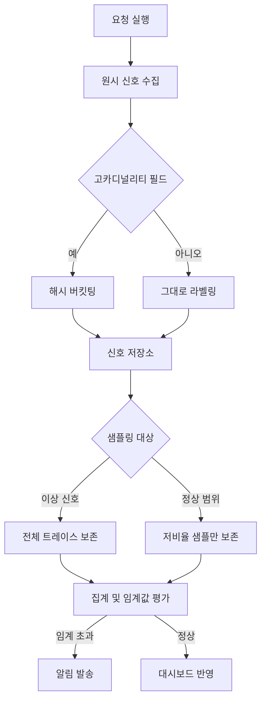

이 글은 LLM 기능을 이미 운영 중이지만 지금 잘 돌아가고 있는지 확신하지 못하는 엔지니어를 위해 씁니다. 지연 시간과 에러율 그래프는 평소와 다를 게 없는데 사용자 문의는 늘어나는 상황에서, 무엇을 측정 대상으로 삼아야 그 간극이 화면에 보이는지를 정리합니다.

기존 APM(Application Performance Monitoring) 도구는 요청이 몇 밀리초 만에 끝났는지, 응답 코드가 몇 번이었는지를 아주 잘 잽니다. 문제는 LLM 시스템에서 진짜 사고는 대부분 200 OK 안에서 일어난다는 점입니다. 응답은 제때 왔고 형식도 맞는데 내용이 틀립니다. 그래서 이 글은 지연이나 토큰 사용량을 측정하는 방법 자체보다, 무엇을 신호로 뽑아야 하고 그 신호를 어떤 기준으로 대시보드와 알림에 올릴지에 집중합니다.

## 기존 APM 지표가 놓치는 지점

전통적인 백엔드 서비스를 관찰할 때 쓰는 지표 묶음은 대체로 요청률, 에러율, 지연 시간 세 가지로 요약됩니다. 이 조합이 오래 살아남은 이유는 명확합니다. 이 서비스에서는 실패가 대체로 시끄럽기 때문입니다. 쿼리가 타임아웃되면 500이 뜨고, 디스크가 가득 차면 쓰기가 실패하고, 의존 서비스가 죽으면 헬스체크가 빨간불로 바뀝니다. 실패와 성공의 경계가 뚜렷하니 그 경계를 세는 것만으로 시스템 상태를 상당히 정확하게 요약할 수 있습니다.

LLM을 호출부에 끼워 넣는 순간 이 전제가 무너집니다. 모델은 같은 입력에도 매번 조금씩 다른 문장을 내놓고, 그 문장이 사실에 부합하는지는 HTTP 상태 코드로 알 수 없습니다. 요청이 800밀리초 만에 끝났고 JSON 파싱도 성공했지만, 요약이 원문의 핵심을 빠뜨렸거나 존재하지 않는 수치를 인용했을 수 있습니다. 이런 실패는 로그에 에러로 찍히지 않습니다. 정상 응답과 똑같은 모양으로 시스템을 통과합니다. 그래서 지연과 에러율만 보는 대시보드는 실제로는 나빠지고 있는 서비스를 계속 초록불로 보여줄 수 있습니다.

이 간극을 메우려면 관찰 대상 자체를 넓혀야 합니다. 요청이 성공했는지가 아니라 그 성공이 얼마나 믿을 만한지를 나타내는 대리 지표가 필요합니다. 다음 절에서 다루는 것이 바로 이 대리 지표를 어디서 뽑아낼지에 대한 이야기입니다. 참고로 그 신뢰도를 어떤 방법론으로 채점할지, 즉 골든셋을 어떻게 구성하고 LLM 심사자를 어떻게 설계할지는 그 자체로 별도의 주제이므로 여기서는 다루지 않고, 채점된 결과를 신호로 어떻게 흘려보낼지에 집중합니다.

## 품질 저하를 신호로 바꾸는 법

품질이라는 말은 그 자체로는 계측할 수 없습니다. 계측 가능한 대리 지표로 쪼개야 대시보드에 올릴 수 있습니다. 다행히 LLM 파이프라인 안에는 품질 저하와 상관관계가 있는 구조적 신호가 이미 여러 개 존재합니다. 새로 만들 필요 없이 지금 파이프라인에서 뽑아내기만 하면 됩니다.

가장 값싼 신호는 `finish_reason`의 분포입니다. 정상 종료(stop) 비율이 갑자기 줄고 최대 길이 도달(length)이나 콘텐츠 필터 차단이 늘었다면, 모델이 답을 끝맺지 못하고 있거나 입력 분포가 필터에 걸리는 방향으로 이동했다는 뜻입니다. 이 값은 API 응답에 이미 들어 있어서 별도 계산 없이 집계만 하면 됩니다.

재시도율도 비슷하게 값쌉니다. 스키마 검증 실패나 출력 형식 오류로 재시도가 걸리는 요청의 비율이 평소보다 높아졌다면, 모델이 지시를 잘못 해석하는 빈도가 늘었다는 신호입니다. 여기에 검증 성공률을 얹으면 더 촘촘해집니다. 응답을 구조화된 필드로 파싱하는 시스템이라면 필드별로 검증 함수를 두고, 그 검증을 통과한 비율을 시계열로 쌓아두면 어떤 필드에서 오류가 늘고 있는지까지 좁혀볼 수 있습니다.

세 번째는 도구 호출 결과와 생성문 사이의 연결 무결성입니다. 에이전트가 외부 API를 호출하고 그 결과를 바탕으로 문장을 만드는 구조에서는, 도구가 돌려준 값과 최종 문장에 등장하는 값이 실제로 일치하는지를 점검하는 코드를 끼워 넣을 수 있습니다. 숫자나 고유명사처럼 정확히 비교 가능한 필드만 대상으로 삼아도 충분한 신호가 됩니다.

아래는 이런 신호를 하나의 요청 로그 스트림에서 뽑아내는 예시입니다. 판정 로직을 복잡하게 만들지 않고, 이미 파이프라인이 알고 있는 값만 모아서 비율로 바꾸는 것이 핵심입니다.

```python
from collections import Counter
from dataclasses import dataclass

@dataclass
class RequestSignal:
    finish_reason: str
    schema_retry_count: int
    field_validation_passed: bool
    tool_result_matched: bool | None  # 도구 호출이 없으면 None

def summarize(signals: list[RequestSignal]) -> dict:
    total = len(signals)
    reasons = Counter(s.finish_reason for s in signals)
    tool_calls = [s for s in signals if s.tool_result_matched is not None]

    return {
        "finish_reason_ratio": {k: v / total for k, v in reasons.items()},
        "retry_rate": sum(s.schema_retry_count > 0 for s in signals) / total,
        "field_validation_rate": sum(s.field_validation_passed for s in signals) / total,
        "tool_mismatch_rate": (
            sum(not s.tool_result_matched for s in tool_calls) / len(tool_calls)
            if tool_calls else None
        ),
    }
```

이 네 개의 비율만 시간 축으로 쌓아도 "요약이 왜 이상해졌지"라는 막연한 질문이 "필드 검증률이 어제 오후부터 12퍼센트 떨어졌다"는 구체적인 질문으로 바뀝니다. 원인을 완전히 설명하지는 못해도, 어디서부터 들여다볼지를 알려주는 역할은 충분히 합니다.

## 신호의 세 층을 하나의 언어로 묶기

지연, 토큰, 검증이라는 세 종류의 신호는 따로 보면 각자 다른 이야기를 합니다. 지연이 늘었다고 해서 품질이 떨어졌다는 뜻은 아니고, 토큰 소비가 늘었다고 해서 반드시 나쁜 신호도 아닙니다. 이 세 층을 같은 요청 단위로 묶어야 서로가 서로를 설명해 주기 시작합니다.

예를 들어 지연이 늘면서 동시에 출력 토큰 수도 늘고 검증 실패율까지 함께 올라갔다면, 모델이 같은 내용을 반복 생성하며 시간을 끌고 있을 가능성이 큽니다. 반대로 지연은 그대로인데 검증 실패율만 올랐다면 원인은 속도가 아니라 입력 분포나 프롬프트 쪽에 있을 확률이 높습니다. 세 층을 같은 요청 ID로 묶어 두지 않으면 이런 대조 자체가 불가능합니다.

이 통합을 그림으로 그리면 아래와 같은 흐름이 됩니다. 요청 하나에서 여러 원시 신호를 뽑아내고, 라벨을 정리한 뒤, 보존할 것과 버릴 것을 가른 다음, 집계와 임계값 평가를 거쳐 대시보드나 알림으로 갈라집니다.



여기서 강조하고 싶은 것은 저장 형태의 차이입니다. 지연이나 토큰 수, 검증 통과율처럼 숫자로 요약되는 신호는 시계열 메트릭으로 저장해 낮은 비용으로 오래 보관합니다. 반면 어떤 요청이 왜 그런 값을 냈는지 재구성해야 하는 상황에서는 프롬프트와 도구 호출 순서가 통째로 담긴 트레이스가 필요합니다. 두 저장 형태의 비용 구조가 다르기 때문에, 모든 신호를 트레이스 하나로 몰아넣기보다 요약값은 메트릭으로 흘리고 원본은 필요한 경우에만 남기는 구조가 유리합니다. 다음 절에서 다루는 카디널리티와 샘플링이 바로 이 구분을 실제로 구현하는 방법입니다.

## 카디널리티와 샘플링: 무엇을 얼마나 남길 것인가

메트릭 시스템에서 카디널리티는 라벨 조합의 가짓수를 뜻합니다. `user_id`나 세션 식별자, 프롬프트 해시처럼 값의 종류가 사실상 무한한 필드를 라벨로 그대로 붙이면, 시계열 데이터베이스는 그 조합 수만큼 새로운 시계열을 만들어냅니다. LLM 시스템은 사용자 수가 늘수록, 대화가 길어질수록 이 문제에 특히 취약합니다. 요청마다 새로운 세션이 생기고, 그 세션마다 새로운 라벨 조합이 생기기 때문입니다.

해법은 고유값을 라벨에서 지우는 것이 아니라 위치를 옮기는 것입니다. 집계에 쓰이는 메트릭 라벨에는 값의 종류가 적은 필드만 남기고, 사용자나 세션을 식별하는 고유값은 해시 버킷으로 뭉치거나 트레이스 속성으로만 남깁니다. 트레이스는 요청 단위로 저장되므로 라벨 폭발이 일어나지 않습니다.

```python
import hashlib

BUCKET_COUNT = 64

def bucket_label(raw_id: str) -> str:
    """고유 식별자를 라벨용 버킷으로 축소합니다.
    원본 raw_id는 메트릭 라벨이 아니라 트레이스 속성에만 남깁니다."""
    digest = hashlib.sha256(raw_id.encode()).hexdigest()
    bucket = int(digest, 16) % BUCKET_COUNT
    return f"bucket_{bucket:02d}"

# 메트릭 라벨: model, request_type, finish_reason, user_bucket
# 트레이스 속성: user_id, session_id, prompt_hash (전수 보존)
```

이렇게 하면 사용자 편차가 큰 이상치를 완전히 잃지는 않으면서도, 라벨 조합 수는 사용자 수와 무관하게 버킷 수로 고정됩니다. 특정 버킷의 값이 튀면 그 버킷에 속한 트레이스를 다시 찾아 실제 원인을 좁혀가는 식으로 두 저장 형태를 함께 씁니다.

샘플링도 같은 원리로 설계합니다. 모든 요청의 트레이스를 전부 저장하면 저장 비용이 트래픽에 정비례해서 늘어나고, 그렇다고 균일하게 낮은 비율로만 샘플링하면 정작 봐야 할 이상 요청을 놓치기 쉽습니다. 실용적인 절충은 꼬리 샘플링입니다. 요청이 끝난 뒤에 결과를 보고 보존 여부를 정하는 방식으로, 지연이 특정 분위수를 넘었거나 검증이 실패했거나 도구 결과 불일치가 감지된 요청은 전량 보존하고, 나머지 정상 범위 요청은 낮은 비율로만 남깁니다.

```python
def should_retain(latency_ms: float, p95_ms: float,
                   validation_failed: bool, tool_mismatch: bool,
                   base_sample_rate: float = 0.02) -> bool:
    if validation_failed or tool_mismatch:
        return True
    if latency_ms > p95_ms:
        return True
    import random
    return random.random() < base_sample_rate
```

이 방식의 장점은 저장 비용이 트래픽 총량이 아니라 이상 요청의 비율에 붙는다는 데 있습니다. 서비스가 커져도 정상 요청 비중이 유지되는 한 저장소 비용은 완만하게만 늘어나고, 정작 들여다봐야 할 요청은 하나도 놓치지 않습니다. 다만 기준값 자체, 즉 무엇을 이상으로 볼지는 정적으로 고정해 두지 말고 최근 분포를 기준으로 주기적으로 다시 계산해야 합니다. 트래픽 패턴이 계절을 타거나 새 기능 출시로 프롬프트 구조 자체가 바뀌면 어제의 p95가 오늘은 더 이상 이상치의 기준이 아니게 됩니다.

## 대시보드와 알림의 설계 기준

신호를 다 모아 놓아도 대시보드가 산만하면 아무도 보지 않습니다. 대시보드 설계에서 가장 흔한 실수는 수집한 모든 신호를 같은 화면에 같은 크기로 늘어놓는 것입니다. 그러면 정작 지금 봐야 할 신호가 다른 스무 개의 패널 사이에 묻힙니다. 화면 상단에는 세 가지 층(지연, 토큰, 검증) 각각의 요약 하나씩만 두고, 세부 분해는 그 아래 계층에서 필요할 때만 펼쳐 보는 구조가 낫습니다.

지연 신호는 평균이 아니라 분위수로 봐야 합니다. 평균은 소수의 매우 느린 요청에 쉽게 가려지고, 반대로 그 소수의 요청이야말로 사용자가 이탈하는 지점입니다. p50은 일반적인 체감을, p95나 p99는 꼬리에서 무슨 일이 벌어지는지를 보여주므로 둘 다 같이 그려야 의미가 생깁니다.

알림 임계값은 정적 숫자 하나로 고정하기보다 최근 기준선 대비 편차로 잡는 편이 오탐을 줄입니다. 다만 기준선 계산에는 시간이 걸리므로, 데이터가 아직 충분히 쌓이지 않은 신규 신호에는 절대 임계값을 백업으로 함께 둡니다. 그리고 한 번의 튀는 값으로 곧바로 알림을 울리기보다, 연속된 관측 구간 중 일정 비율 이상이 기준을 넘었을 때만 발화하도록 하면 일시적인 노이즈로 인한 알림 피로를 크게 줄일 수 있습니다.

알림의 우선순위는 신호의 종류가 아니라 그 신호가 가리키는 비즈니스 위험도로 나눠야 합니다. 검증 실패율이 조금 오른 것과 도구 호출 결과와 최종 답변이 완전히 어긋난 것은 같은 무게로 다룰 수 없습니다. 후자처럼 사용자가 잘못된 정보를 사실로 받아들일 위험이 큰 신호는 즉시 담당자에게 가는 채널로 보내고, 전자처럼 추세를 지켜보면 되는 신호는 하루 단위 요약으로 묶어서 보냅니다. 모든 신호를 같은 강도의 알림으로 보내면 결국 담당자는 알림을 끄는 방향으로 반응하게 되고, 그 순간 옵저버빌리티는 있으나 마나 한 것이 됩니다.

## ThakiCloud 관점에서

저희는 고객사 온프렘 환경에 쿠버네티스 기반 AI 플랫폼을 서빙하고 있습니다. 이 조건에서는 위에서 다룬 신호 설계 원칙에 제약이 하나 더 붙습니다. 외부 매니지드 관측 서비스로 프롬프트나 트레이스를 그대로 내보내는 선택지가 애초에 없는 경우가 많다는 점입니다.

그래서 카디널리티와 샘플링 설계가 저희에게는 선택이 아니라 필수에 가깝습니다. 내부에 두는 저장소가 감당할 수 있는 만큼만 트레이스를 보존해야 하고, 그 한도 안에서 정말 봐야 할 요청을 놓치지 않으려면 이상 신호 기준의 꼬리 샘플링이 거의 유일한 답입니다. 또한 여러 팀이 같은 플랫폼 위에서 서로 다른 모델을 서빙하는 구조이다 보니, 신호의 라벨 스키마를 팀마다 따로 정의하게 두면 나중에 팀을 가로질러 비교하는 일이 불가능해집니다. 플랫폼 레벨에서 신호 스키마 하나를 정의하고 그 위에 각 팀의 대시보드를 얹는 편이 결국 더 단순합니다.

이 글의 내용은 저희가 사내 자동화 파이프라인을 운영하면서 정리한 전자책 『AI 프로덕션 옵저버빌리티』의 일부를 블로그용으로 다시 쓴 것입니다.

## 챕터 삽화


