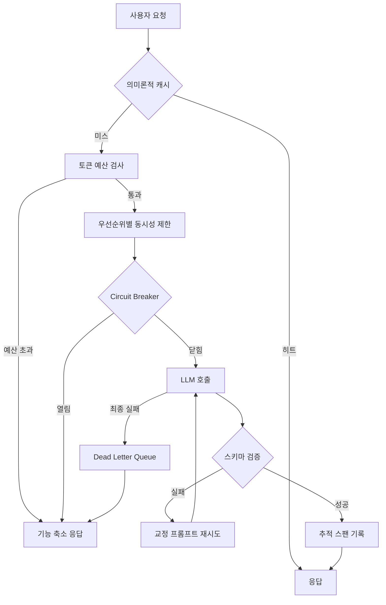

LLM 호출을 서비스 코드 한가운데 넣어본 엔지니어라면 이미 겪으셨을 겁니다. 어제까지 `{"result": "ok"}`를 돌려주던 모델이 오늘은 `{"status": "success", "data": null}`을 돌려줍니다. 이 글은 그 변동성을 감수하고 사는 대신 **구조로 가두는 방법**을 다룹니다. 네 개의 통제점만 제자리에 두면 LLM은 요행을 바라는 외부 서비스가 아니라 계약이 있는 부품이 됩니다.

일반적인 HTTP API와 결정적으로 다른 점이 하나 있습니다. 보통의 API는 실패하거나 성공합니다. LLM API는 **성공한 채로 틀립니다.** 200 OK를 받았고 JSON 파싱도 됐는데 필드 이름이 다릅니다. 그래서 통제점이 네 군데나 필요합니다.

## 요청 하나가 지나가는 길

먼저 전체 그림을 봅니다. 아래는 요청 하나가 통과하는 경로와, 그 위에 놓이는 네 개의 통제점입니다.



왼쪽 위에서 오른쪽 아래로 갈수록 비용이 커집니다. 캐시에서 끊으면 0원이고, 예산 검사에서 끊으면 요청 하나 값이며, 모델까지 갔다가 스키마 검증에서 실패하면 그 요청을 두 번 낸 셈이 됩니다. 통제점의 순서 자체가 비용 설계입니다.

## 첫째, 출력 형식은 부탁하지 말고 강제합니다

프롬프트에 "JSON으로만 답하세요"라고 적는 것은 통제가 아니라 희망입니다. 실제로 작동하는 것은 스키마이고, 스키마에는 세 개의 지렛대가 있습니다.

`enum`은 선택지 자체를 없앱니다. 상태 코드나 분류 라벨처럼 값의 집합이 닫혀 있는 필드에 특히 잘 듣습니다. 모델이 `"status": "maybe"`를 만들어낼 여지를 구조적으로 지워버리기 때문입니다.

`const`는 항상 같아야 하는 값을 고정합니다. API 버전이나 구분자 역할을 하는 필드가 여기 해당합니다.

`description`은 조금 다른 종류의 지렛대입니다. 스키마는 기계가 읽는 규격이지만 LLM은 그 안의 자연어까지 읽습니다. description을 비워두면 모델이 자기 방식대로 해석하고, 채워두면 그 해석의 방향을 잡아줄 수 있습니다.

```python
from pydantic import BaseModel, Field
from openai import OpenAI
from instructor import from_openai

class ExtractionResult(BaseModel):
    name: str = Field(description="회사 이름")
    founded_year: int = Field(description="설립 연도, 숫자만")
    intent: str = Field(
        description="사용자 요청의 의도를 한 문장으로. 해석 불가면 'unclear'."
    )

client = from_openai(OpenAI())
result = client.chat.completions.create(
    model="gpt-4o",
    messages=messages,
    response_model=ExtractionResult,
)
```

여기서 놓치기 쉬운 지점이 재시도입니다. 스키마 검증에 실패했을 때 **같은 프롬프트를 그대로 다시 보내는 것은 거의 의미가 없습니다.** 모델이 규격을 잘못 해석했다면 같은 입력에 같은 오해를 반복합니다. 재시도는 입력을 바꿔서 해야 합니다.

```python
SCHEMA_RETRY_HINT = """이전 응답이 요청된 스키마를 따르지 않았습니다.
- 스키마에 없는 필드를 만들지 마세요
- 필수 필드를 빠뜨리지 마세요
- 각 필드의 타입과 description을 지키세요"""

for attempt in range(MAX_RETRIES):
    try:
        return client.chat.completions.create(
            model="gpt-4o",
            messages=messages,
            response_model=ExtractionResult,
            max_retries=0,  # 재시도는 이 루프가 소유합니다
        )
    except ValidationError:
        if attempt == MAX_RETRIES - 1:
            raise
        messages.append({"role": "user", "content": SCHEMA_RETRY_HINT})
```

스키마에는 비용이라는 뒷면도 있습니다. 필드가 많아지고 중첩이 깊어질수록 모델이 그 구조를 채우느라 더 많은 토큰을 씁니다. 디버깅용으로 넣어둔 임시 필드를 프로덕션까지 데려가지 않는 것만으로도 응답 토큰이 줄어듭니다. 필드 수를 줄이고, 중첩을 펴고, description을 짧게 쓰는 세 가지가 그대로 원가 절감입니다.

## 둘째, 스트리밍은 토큰이 아니라 의미 단위로 끊습니다

스트리밍을 붙이는 이유는 속도가 아니라 체감입니다. 첫 글자가 빨리 나오면 사용자는 기다림을 짧게 느낍니다.

다만 토큰이 오는 대로 화면에 흘리면 문장이 반쯤 만들어졌다 지워지는 장면이 그대로 노출됩니다. 문장이나 문단처럼 **의미가 완결되는 단위로 모아서 내보내는 편**이 읽기에 낫습니다. 구현은 생각보다 단순합니다. 버퍼에 쌓다가 문장 경계에서 흘려보내면 됩니다.

```python
async def semantic_chunks(stream, boundaries=(". ", "다.\n", "?\n", "!\n"), cap=120):
    buf = ""
    async for chunk in stream:
        delta = chunk.choices[0].delta.content or ""
        buf += delta
        # 문장이 닫혔거나 버퍼가 너무 길어지면 내보냅니다
        if any(buf.endswith(b) for b in boundaries) or len(buf) >= cap:
            yield buf
            buf = ""
    if buf:
        yield buf
```

`cap`이 필요한 이유가 있습니다. 코드 블록이나 표를 생성할 때는 문장 부호가 한참 나오지 않기 때문에, 경계만 기다리면 화면이 몇 초씩 멈춘 것처럼 보입니다. 길이 상한이 그 정지를 막아줍니다.

전송 계층은 단방향이면 Server-Sent Events로 충분하고, 사용자 입력을 중간에 받아야 할 때만 WebSocket을 씁니다. SSE 쪽이 재연결 로직을 브라우저가 알아서 해준다는 점에서 운영 부담이 적습니다.

스트리밍에서 진짜 어려운 부분은 상태 관리입니다. 연결이 끊겼을 때 어디까지 보냈는지, 부분 결과를 저장할지 버릴지, 서버 쪽 생성을 중단시킬지를 정해두지 않으면 **끊긴 연결마다 토큰이 조용히 새어 나갑니다.** 사용자가 탭을 닫아도 서버는 끝까지 생성하고 요금은 그대로 청구되기 때문입니다. 클라이언트 연결 종료를 감지해 생성을 취소하는 경로를 반드시 만들어 두시길 권합니다.

지표도 하나로는 부족합니다. TTFT(첫 토큰까지의 시간)와 전체 완료 시간을 따로 재야 어디가 느린지 보입니다. 둘을 합친 평균 응답 시간만 보면 모델이 느린 건지 큐가 밀린 건지 구분되지 않습니다.

## 셋째, 실패는 막는 게 아니라 가둡니다

LLM API는 실패합니다. rate limit에 걸리고, 게이트웨이가 흔들리고, 가끔은 아무 이유 없이 느려집니다. 목표는 실패를 없애는 것이 아니라 **실패가 번지지 않게 하는 것**입니다. 층위가 다른 네 개의 장치를 씁니다.

**지수 백오프와 jitter.** 재시도 간격을 2배씩 늘리는 것만으로는 부족합니다. 동시에 실패한 요청들은 동시에 재시도하기 때문에 같은 파도가 그대로 다시 밀려옵니다. 대기 시간에 난수를 섞어 파도를 흩어야 합니다.

```python
def backoff_with_jitter(attempt, base=1.0, cap=60.0, ratio=0.5):
    delay = min(base * (2 ** attempt), cap)
    half = delay * ratio
    return half + random.uniform(0, half)
```

**Circuit breaker.** 계속 실패하는 요청은 재시도할수록 손해입니다. 실패가 임계치를 넘으면 회로를 열어 즉시 실패를 돌려주고, 일정 시간 뒤 소수의 요청만 통과시켜 회복 여부를 확인합니다. LLM API는 rate limit 실패가 잦은 편이라 임계치를 낮게 잡는 쪽이 대체로 유리합니다.

**Bulkhead.** 앞의 둘이 사고 후 대응이라면 이건 사고 확률 자체를 낮춥니다. 이름은 선박의 방수격벽에서 왔습니다. 한 칸에 물이 들어와도 배 전체가 가라앉지 않게 하는 구조입니다. 우선순위별로 동시 실행 수를 나눠두면 대량의 배치 작업이 사용자 대면 요청의 자리를 빼앗지 못합니다.

```python
class PrioritySemaphore:
    def __init__(self):
        self.high = asyncio.Semaphore(10)
        self.normal = asyncio.Semaphore(5)
        self.low = asyncio.Semaphore(2)
```

**Dead letter queue.** 그래도 실패한 요청은 남깁니다. 원본 메시지와 오류 유형, 재시도 횟수를 함께 적어두면 나중에 재처리할 수 있습니다. DLQ의 진짜 가치는 재처리보다 신호에 있습니다. 여기 쌓이는 양과 종류가 곧 시스템 상태를 알려줍니다.

## 넷째, 비용과 추적은 나중에 붙일 수 없습니다

LLM 비용은 한 번에 오르지 않고 조용히 쌓입니다. 대화 이력이 길어지고, 캐시가 없어 같은 질문을 반복해서 계산하고, `max_tokens`를 넉넉하게 잡아둔 것이 겹칩니다.

입력 쪽에서 가장 효과가 큰 통제는 대화 이력 길이 제한입니다. 프롬프트를 압축하는 정교한 기법보다 오래된 메시지를 버리는 단순한 규칙이 대체로 더 잘 듣습니다. 출력 쪽은 `max_tokens`인데, 크게 잡으면 낭비이고 작게 잡으면 잘립니다. `finish_reason`이 `length`로 오는 비율을 지표로 두고 조정하는 편이 안전합니다.

예산이 바닥났을 때의 동작도 미리 정해야 합니다. 전부 거절하면 서비스가 멈추므로, 우선순위별로 다르게 대응합니다. 중요한 요청은 끝까지 통과시키고, 보통 요청은 더 싼 모델로 우회하며, 낮은 요청만 차단하는 식입니다.

```python
TIERS = {                       # 소진율이 이 값을 넘으면 해당 동작
    "critical": (1.00, "proceed"),
    "high":     (0.90, "warn"),
    "normal":   (0.80, "fallback"),   # 더 싼 모델로 우회
    "low":      (0.50, "reject"),
}

def decide(priority, used_ratio):
    limit, action = TIERS.get(priority, TIERS["normal"])
    return "proceed" if used_ratio < limit else action
```

이 표에서 중요한 것은 숫자가 아니라 **낮은 우선순위가 먼저 죽는다는 순서**입니다. 배치 색인 작업이 월말에 멈추는 것과 결제 화면의 요약이 멈추는 것은 전혀 다른 사건입니다.

**의미론적 캐싱**은 정확히 같은 문자열이 아니어도 캐시 히트를 인정합니다. 요청을 임베딩해 유사도로 판단하는 방식인데, 여기서 유일하게 중요한 값은 임계치입니다. 0.95는 히트가 거의 나지 않고, 0.85로 내리면 히트율은 오르지만 다른 질문에 남의 답을 돌려줄 위험이 함께 커집니다. 이 숫자는 이론이 아니라 실제 트래픽을 보면서 정해야 합니다.

**추적**은 처음부터 넣어야 합니다. 요청 하나가 모델 호출과 캐시 조회와 벡터 검색을 거치기 시작하면, 로그만으로는 어디가 느린지 알 수 없습니다. 선택지는 세 갈래입니다. LangSmith는 LangChain이 운영하는 매니지드 서비스로 붙이기 쉽고, LangFuse는 자체 호스팅이 가능해 데이터를 밖으로 내보내지 않아도 되며, OpenTelemetry는 업계 표준이라 백엔드를 나중에 갈아끼울 수 있습니다.

```python
with tracer.start_as_current_span("llm_call") as span:
    span.set_attribute("llm.model", model)
    response = client.chat.completions.create(model=model, messages=messages)
    span.set_attribute("llm.tokens_used", response.usage.total_tokens)
    span.set_attribute("llm.ttft_ms", ttft * 1000)
```

무엇을 스팬에 남길지가 나중의 분석 가능성을 결정합니다. 모델 이름, 입출력 토큰 수, TTFT, 전체 소요 시간, 그리고 실패했다면 오류 유형까지는 최소한으로 남겨두시길 권합니다.

마지막은 사용자에게 보이는 얼굴입니다. 재시도도 실패하고 회로까지 열렸을 때 "일시적인 오류가 발생했습니다"만 내보내면 사용자는 무엇을 해야 할지 모릅니다. rate limit이면 얼마 뒤에 다시 시도하면 되는지, 입력이 너무 길었다면 얼마나 줄이면 되는지를 함께 주는 편이 낫습니다. AI 요약이 실패했을 때 키워드 요약으로 내려앉는 것처럼, 기능을 끄는 대신 낮추는 선택지를 미리 만들어두면 실패가 서비스 중단으로 번지지 않습니다.

## ThakiCloud 관점에서

저희는 고객사 환경에서 모델을 직접 서빙합니다. 그래서 이 네 통제점이 애플리케이션 코드가 아니라 플랫폼 쪽에 있어야 한다는 것을 반복해서 확인했습니다.

토큰 예산과 우선순위 격리는 특히 그렇습니다. 팀마다 각자의 애플리케이션 코드에 예산 로직을 심으면 그 규칙은 팀 수만큼 갈라집니다. GPU 스케줄링 계층에서 우선순위와 동시성을 한 번 정의하는 편이 훨씬 단순합니다. 저희 플랫폼이 Kueue 기반으로 우선순위 큐를 다루는 이유이기도 합니다.

추적도 마찬가지입니다. 온프렘 환경에서는 외부 매니지드 추적 서비스로 프롬프트를 내보내는 선택지가 애초에 없는 경우가 많습니다. OpenTelemetry 스팬 규격에 맞춰두고 백엔드를 안에 두는 구성이 현실적인 답입니다.

## 정리

LLM API를 부품으로 만드는 일은 모델을 잘 고르는 문제가 아니라 **모델 주변에 무엇을 두느냐의 문제**입니다. 형식은 스키마로 가두고, 스트리밍은 의미 단위로 끊고, 실패는 회로와 격벽으로 가두며, 비용과 추적은 처음부터 자리를 잡아둡니다. 네 가지가 함께 있을 때에야 일부 요청이 실패해도 전체가 흔들리지 않습니다.

이 글의 내용은 저희가 사내 자동화 파이프라인을 운영하면서 정리한 전자책 『AI API 엔지니어링』의 일부를 블로그용으로 다시 쓴 것입니다.
