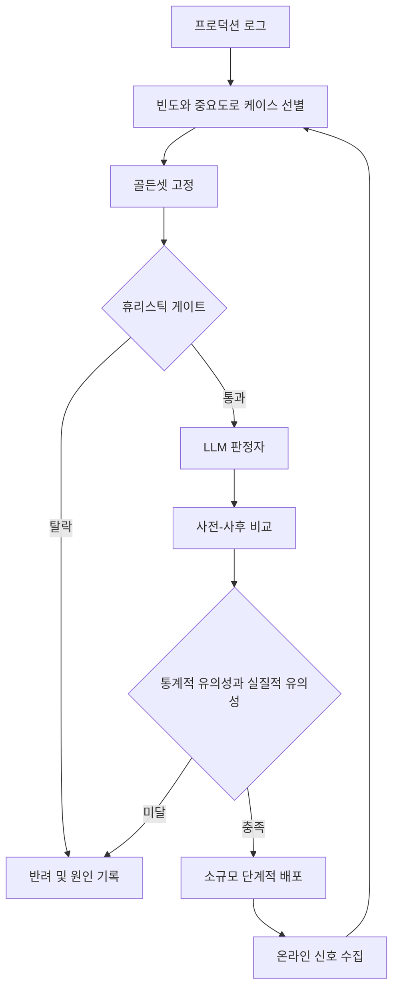

"이 모델, 실제로 괜찮은 거야?"라는 질문을 받아본 적이 있다면 이 글이 필요한 사람입니다. LLM 기능을 서비스에 넣고 품질을 책임지는 엔지니어라면, "테스트해보니 잘 되던데요"라는 대답이 왜 검증이 되지 못하는지, 그리고 그 자리를 무엇으로 채워야 하는지를 알아야 합니다. 이 글은 그 질문에 시스템적으로 답하는 방법, 즉 평가 엔지니어링을 다룹니다.

일반 소프트웨어의 유닛 테스트는 통과와 실패가 명확합니다. LLM은 다릅니다. 어제까지 잘 작동하던 프롬프트가 오늘은 미묘하게 다른 답을 내놓는데, 그 답이 틀렸다고 단정하기도 애매합니다. 그래서 "괜찮다"는 판단을 사람의 인상에 맡기면 그 인상은 평가자가 우연히 넣어본 몇 개 입력에 갇히고, 확증 편향까지 더해집니다. 성공한 사례를 보면 전체가 잘 될 거라 믿고, 실패한 사례를 보면 전체가 위태롭다고 믿는 식입니다. 두 판단 모두 표본 크기와 무관하게 반복됩니다.

이 글은 API 호출 자체를 안정화하는 재시도나 회로 차단, 혹은 배포 후 지표를 추적하는 옵저버빌리티는 다루지 않습니다. 그 앞 단계, 즉 무엇을 좋다고 정의하고 그 정의를 어떻게 데이터로 증명할지에 집중합니다.

## 평가가 답해야 하는 세 가지 질문

평가를 시스템으로 만든다는 것은 결국 하나의 순환을 갖추는 일입니다. 프로덕션 로그에서 어떤 입력을 평가 대상으로 남길지 고르고, 그 입력에 대한 출력을 빠른 규칙과 정밀한 판정으로 걸러내고, 이전 버전과 비교해 실제로 나아졌는지 확인한 뒤, 그 결과를 다시 다음 케이스 선별의 근거로 되먹입니다. 전체 그림은 아래와 같습니다.



이 그림에서 가장 중요한 것은 맨 아래의 화살표입니다. 온라인에서 관찰한 신호가 다시 케이스 선별로 돌아가지 않으면 평가는 한 번 만들고 끝나는 스냅샷에 머뭅니다. 실제로 신뢰할 수 있는 평가 체계는 이 순환이 멈추지 않고 도는 시스템입니다.

이 순환을 돌리기 전에 먼저 정해야 할 것이 있습니다. 무엇을 좋다고 부를 것인가입니다. 여기에는 세 가지 질문이 따라옵니다. 출력이 사실적으로 맞는가, 그 출력이 실제로 사용자의 문제를 해결하는가, 같은 입력을 반복했을 때도 그 결과를 믿을 수 있는가입니다. 편의상 정밀성, 영향성, 안정성이라 부르겠습니다.

정밀성만 측정하고 나머지 둘을 빼놓는 실수가 흔합니다. 답변이 사실관계는 정확한데 사용자가 원하는 형태가 아니라면, 혹은 매번 다른 뉘앙스로 대답한다면 그 시스템은 정밀성 점수와 무관하게 신뢰를 잃습니다. 챗봇이 제품 사양을 한 글자도 틀리지 않고 인용해도 응답이 매번 다른 톤으로 나오면 사용자는 그 답을 예측할 수 없다고 느낍니다. 세 층위를 나란히 추적해야 하는 이유입니다.

여기서 짚을 함정이 하나 더 있습니다. 평가자가 "이 답변 좋다"고 느끼는 인상 자체가 편향되어 있다는 점입니다. 사람은 자신이 직접 테스트한 몇 개의 입력에 대해서만 판단을 내리는데, 그 입력은 애초에 전체 분포를 대표하지 못합니다. 게다가 같은 텍스트를 두 번 평가해도 같은 점수가 나오지 않는 경우가 흔합니다. 그래서 평가는 사람의 개별 판단이 아니라, 그 판단을 구조화한 절차 위에 세워야 합니다.

## 골든셋을 편향 없이 만드는 법

세 가지 질문에 답하려면 무엇을 테스트할지부터 정해야 합니다. 이 고정된 테스트 케이스 집합을 골든셋이라 부릅니다. 문제는 골든셋을 아무렇게나 만들면 그 자체가 편향의 근원이 된다는 점입니다.

가장 흔한 실수는 개발자가 상상한 케이스로 골든셋을 채우는 것입니다. "이런 질문이 들어오겠지"라는 추측은 실제 트래픽과 다를 때가 많습니다. 더 교묘한 실수는 적응형 편향입니다. 모델이 특정 유형의 입력에서 실패하면 그 유형의 테스트 케이스를 늘리고, 다음 평가에서 그 유형의 점수가 오르면 모델이 좋아졌다고 판단합니다. 실제로는 그 유형에만 과적합됐을 가능성이 큽니다.

이 문제를 피하는 실용적인 방법은 실제 트래픽을 빈도와 중요도 두 축으로 나누는 것입니다.

|  | 자주 등장 | 드물게 등장 |
|---|---|---|
| **영향도 높음** | 최우선 평가 대상 | 반드시 포함해야 할 대상 |
| **영향도 낮음** | 가볍게만 확인 | 우선순위 최하위 |

자주 등장하면서 영향도가 높은 입력은 평가의 중심축이 되어야 합니다. 드물지만 영향도가 높은 입력, 이를테면 환불이나 계약 해지처럼 한 번 잘못 답하면 손해가 큰 케이스는 등장 빈도와 무관하게 골든셋에 반드시 넣어야 합니다. 이 매트릭스를 만들려면 과거 프로덕션 로그를 카테고리로 분류하고, 각 카테고리가 실제로 사용자의 다음 행동에 얼마나 영향을 미쳤는지 추정하는 작업이 먼저입니다.

골든셋은 한 번 만들고 끝나는 자료가 아닙니다. 프로덕션에서 새로운 실패 케이스가 발견될 때마다 회귀 테스트 스위트에 추가해야, 다음 배포에서 같은 실패가 조용히 되풀이되는 일을 막을 수 있습니다. 다만 모든 지표가 동시에 통과해야 회귀 테스트를 통과한 것으로 보는 방식은 피하는 편이 낫습니다. 응답 속도 개선과 내용 품질 개선을 한 번의 배포에서 동시에 요구하면 팀에 불필요한 부담이 쌓입니다. 반드시 지켜야 할 필수 지표와 점진적으로 나아지면 되는 바람직 지표를 나눠서 관리하는 편이 현실적입니다.

빈도와 중요도로 케이스를 골랐다면 그 케이스에 우선순위 점수를 매겨두는 것도 도움이 됩니다.

```python
def golden_set_priority(frequency, impact_score, is_recent_failure):
    # frequency, impact_score는 0에서 1 사이로 정규화된 값
    base = frequency * 0.4 + impact_score * 0.6
    if is_recent_failure:
        base += 0.3  # 최근 실패 케이스는 가중치를 얹어 우선 포함
    return min(base, 1.0)
```

점수가 높은 순으로 골든셋을 채우면 예산이 한정된 상황에서도 가장 중요한 케이스부터 커버리지를 확보할 수 있습니다.

## LLM 판정자를 쓰는 법과 믿지 않는 법

골든셋이 준비되면 그 출력을 무엇으로 채점할지가 남습니다. 여기서 두 가지 도구를 섞어 씁니다. 규칙 기반의 휴리스틱 게이트와 LLM 판정자입니다.

휴리스틱은 빠르고 재현 가능합니다. 응답 길이가 특정 범위를 벗어났는지, 금지어가 섞였는지, 필수 필드가 빠졌는지는 문자열 검사만으로 판정할 수 있습니다. 다만 이런 규칙으로 잡을 수 있는 것은 평가 전체 중 일부일 뿐입니다. 답변이 자연스러운지, 여러 턴에 걸친 응답이 논조를 유지하는지처럼 규칙으로 표현하기 어려운 항목은 LLM이 판정합니다.

문제는 LLM 판정자도 사람 평가자와 비슷한 약점을 갖는다는 점입니다. 같은 출력을 두 번 판정해도 다른 점수가 나올 수 있고, 판정 대상이 어느 모델의 출력인지 안다는 사실만으로 점수가 달라지기도 합니다. 그래서 판정자에게는 어떤 모델의 출력인지 알리지 않는 블라인드 평가를 기본값으로 두는 편이 안전합니다.

비용 문제도 있습니다. 모든 출력을 LLM 판정자에게 넘기면 평가 시간과 비용이 함께 늘어납니다. 그래서 2단계 구조가 실무에서 흔히 쓰입니다. 먼저 휴리스틱으로 대부분을 걸러내고, 거기서 통과한 케이스만 LLM 판정자에게 넘기는 방식입니다.

```python
def evaluate_output(output, context):
    verdict = heuristic_gate(output)  # 길이, 금지어, 필수 필드 검사
    if verdict.rejected:
        return verdict

    # 통과한 케이스만 판정자에게 넘겨 호출 비용을 줄인다
    judge_result = llm_judge(
        output=output,
        context=context,
        criteria="응답이 사용자의 질문을 실제로 해결했는가",
        reveal_model_identity=False,  # 블라인드 평가
    )
    return judge_result
```

절대 점수를 매기게 하는 대신 상대 비교를 시키는 것도 판정자의 일관성을 높이는 방법입니다. "이 답변은 5점 만점에 몇 점인가"보다 "두 답변 중 어느 쪽이 더 나은가"를 물으면, 판정자마다 다른 척도를 쓰는 데서 오는 오차가 줄어듭니다. 사람 평가자를 쓸 때도 같은 원리가 적용됩니다. 다만 사람 평가는 비용이 가장 크므로, 판정자의 확신이 낮은 케이스, 즉 두 후보 사이의 점수 차이가 거의 없는 케이스에만 사람을 투입하는 편이 예산을 아낍니다. 판정자가 이미 확신하는 케이스까지 사람이 다시 보는 것은 정보 가치가 거의 없는 작업입니다.

## 오프라인 신호와 온라인 신호를 분리합니다

골든셋과 판정자로 구성한 평가는 오프라인에서 돌아갑니다. 배포 전에 실행하고, 결과가 나오는 데 시간이 걸려도 괜찮습니다. 문제는 오프라인 평가가 아무리 촘촘해도 실제 트래픽의 다양성을 완전히 흉내 낼 수 없다는 점입니다. 그래서 온라인에서도 신호를 따로 모아야 하는데, 이때 두 가지 방식을 구분해서 씁니다.

섀도 모드는 새 버전을 기존 버전 옆에 나란히 띄우고 같은 입력을 동시에 흘려보내되, 새 버전의 출력은 사용자에게 보여주지 않고 로그로만 남기는 방식입니다. 사용자 경험에 아무 영향을 주지 않으면서 실제 트래픽에서 새 버전이 어떻게 반응하는지 확인할 수 있습니다.

A/B 테스트는 실제 사용자 일부에게 새 버전을 직접 노출합니다. 섀도 모드보다 현실에 가까운 결과를 얻지만, 새 버전이 실제로 사용자 경험에 영향을 주는 만큼 위험도 함께 커집니다. 그래서 실무에서는 섀도 모드로 먼저 안정성을 확인한 뒤에만 A/B 테스트로 넘어가는 순서를 권합니다.

이 두 신호를 오프라인 골든셋과 구분해서 보는 이유는 명확합니다. 골든셋은 우리가 이미 알고 있는 실패 패턴을 반복 검증하는 도구이고, 온라인 신호는 우리가 아직 모르는 실패 패턴을 찾아내는 도구입니다. 온라인에서 새로 발견한 실패 케이스는 다음 골든셋 갱신 주기에 그대로 편입되어야, 위 그림 맨 아래의 화살표가 실제로 작동합니다.

## 개선을 증명하는 절차

새 버전이 골든셋과 온라인 신호를 모두 통과했다고 해도, 개선되었다는 말은 절차를 갖춰야 신뢰할 수 있는 주장이 됩니다. 사전과 사후를 비교하는 절차가 그 근거입니다.

먼저 지표를 배포 전에 확정해야 합니다. "더 정확해졌다"는 판단할 수 없는 표현이고, "사실 정확도가 85점에서 89점으로 올랐다"는 판단할 수 있는 표현입니다. 두 번째로 사전과 사후 테스트는 반드시 같은 골든셋으로 돌려야 합니다. 입력이 다르면 차이의 원인이 모델 때문인지 입력 때문인지 구분할 수 없습니다. 세 번째로 온도와 시드, 하드웨어 같은 측정 환경도 동일하게 맞춰야, 환경 차이로 생긴 변동을 개선으로 착각하지 않습니다.

결과를 볼 때는 두 가지 유의성을 구분합니다. 통계적 유의성은 이 차이가 우연히 나왔을 확률이 낮다는 뜻이고, 실질적 유의성은 그 차이가 사용자 경험이나 업무 성과에 실제로 영향을 줄 만큼 크다는 뜻입니다. 클릭률이 2.10퍼센트에서 2.15퍼센트로 올랐다면 통계적으로는 유의미할 수 있지만, 그 0.05퍼센트포인트가 연간 목표를 흔들 정도인지는 별개의 질문입니다. 배포를 결정하려면 두 유의성을 모두 충족해야 한다는 기준을 팀 안에서 미리 정해두는 편이 안전합니다.

```python
def is_real_improvement(pre_scores, post_scores, min_effect_size):
    diff = mean(post_scores) - mean(pre_scores)
    ci_low, ci_high = bootstrap_ci(post_scores, pre_scores)
    statistically_significant = ci_low > 0  # 신뢰구간이 0을 넘지 않는다
    practically_significant = diff >= min_effect_size
    return statistically_significant and practically_significant
```

마지막으로 놓치기 쉬운 것이 의도하지 않은 회귀입니다. 목표 지표만 좋아지고 다른 지표는 확인하지 않으면, 유창성을 높이려다 사실 정확도를 깎아 먹는 식의 상충 관계를 놓칩니다. 그래서 배포 전 기준선을 목표 지표뿐 아니라 관련 지표 전체에 대해 잡아두고, 배포 후에는 그 전체 집합을 다시 측정해야 합니다. 그리고 개선이 확인되었다고 해서 곧바로 전체 트래픽에 적용하기보다, 1퍼센트, 10퍼센트, 50퍼센트 순서로 단계를 넓히며 각 단계에서 정해진 기준을 통과했을 때만 다음 단계로 넘어가는 편이 안전합니다. 이 단계적 확대가 앞서 본 순환 구조의 마지막 고리이자, 오프라인에서 세운 가설을 실제 트래픽으로 확인하는 관문입니다.

## ThakiCloud 관점에서

저희는 고객사 온프렘 환경에 K8s 기반 AI 플랫폼을 서빙합니다. 이 환경에서는 평가를 사후에 붙이는 방식이 잘 통하지 않는다는 것을 여러 번 확인했습니다.

가장 크게 부딪히는 지점은 골든셋의 소유권입니다. 고객사마다 트래픽 분포와 위험이 큰 케이스가 다르기 때문에, 하나의 공통 골든셋으로 모든 배포를 검증할 수 없습니다. 그래서 각 환경의 프로덕션 로그에서 빈도와 중요도를 다시 추정하고, 그 결과로 골든셋을 그 환경 전용으로 유지하는 절차를 플랫폼 쪽에 표준화해두는 방향으로 가고 있습니다.

섀도 모드도 마찬가지입니다. 온프렘에서는 실제 트래픽을 외부로 내보내지 않고도 새 버전을 검증해야 하는 경우가 많아서, 같은 클러스터 안에서 기존 버전과 신규 버전을 나란히 띄우고 결과만 비교하는 구조가 현실적인 답입니다.

LLM 평가를 시스템으로 만드는 일은 결국 무엇을 측정할지 미리 정의하고, 그 정의를 뒷받침하는 케이스를 편향 없이 고르고, 개선 여부를 절차로 증명하는 반복입니다. 감으로 판단하는 대신 이 순환을 계속 돌리는 팀이 결국 더 빠르게 신뢰를 쌓습니다.

이 글의 내용은 저희가 사내 자동화 파이프라인을 운영하면서 정리한 전자책 『LLM 평가 엔지니어링』의 일부를 블로그용으로 다시 쓴 것입니다.

## 챕터 삽화


