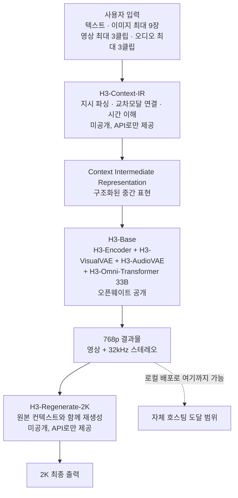

오픈웨이트 모델이 공개되면 가장 먼저 도는 문장은 대개 이런 형태입니다. 이제 누구나 자기 서버에서 돌릴 수 있습니다. MiniMax가 2026년 7월 31일 공개한 H3에도 같은 문장이 붙었습니다. 텍스트와 이미지, 영상, 오디오를 한 컨텍스트에서 이해하고 최대 2K 해상도로 15초짜리 영상을 네이티브 스테레오 오디오와 함께 생성하는 모델입니다. 그런데 가중치가 공개됐다는 사실과 우리 클러스터에서 돌아간다는 사실 사이에는, 파일 목록을 열어 보고 계산해 봐야 알 수 있는 거리가 있습니다.


*영상과 소리를 따로 만들어 붙이는 대신 하나의 시퀀스에서 함께 뽑는다는 것이 H3 설계의 출발점입니다.*

> **라이선스 안내 (2026년 8월 9일 추가).** MiniMax H3 커뮤니티 라이선스는 2026년 8월 2일자로
> 발효됐고, 적용 지역 정의에서 대한민국과 미국, 유럽연합, 영국을 제외합니다. 이 지역에서는
> 오픈웨이트를 내려받아 로컬에서 실행하거나 수정하는 행위, 그리고 그 출력물을 사용하거나
> 배포하는 행위가 라이선스되지 않습니다. 이 글은 그 사실이 확인되기 전에 작성됐습니다.
> 아래의 설치와 실행 절차는 적용 지역 안에 있는 독자를 기준으로 읽어 주시고, 국내에서는
> 공급자의 호스팅 API를 쓰거나 MiniMax에 개별 라이선스를 문의하는 경로를 검토하시기 바랍니다.
> 조항 대조는 [오픈 영상 모델 라이선스 실사](/tech-blog/ko/llmops/open-video-model-license-territory-audit/)에
> 정리해 두었습니다.

## 왜 읽어야 하나

사내 GPU 클러스터를 운영하면서 영상 생성 모델을 자체 호스팅할지 API를 쓸지 판단해야 하는 분을 위한 글입니다. 결론을 먼저 말씀드리면, H3-Base는 33B 파라미터 단일 스트림 트랜스포머라 숫자만 보면 LLM 서빙과 비슷해 보이지만 실제 병목은 가중치가 아니라 시퀀스 길이에 있습니다. 15초짜리 2K 클립 하나가 32만 토큰이 넘는 시퀀스를 만들고, 초기 공개본에는 이를 감당할 sparse attention 구현이 빠져 있습니다.

## 개요

MiniMax H3는 범용 옴니모달 생성 시스템입니다. 텍스트와 이미지, 영상, 오디오가 뒤섞인 멀티모달 컨텍스트를 통합적으로 이해하고, 거기서 스테레오 오디오가 붙은 영상을 생성합니다. 출력 사양은 4초에서 15초 길이, 24 FPS, 32 kHz 스테레오 오디오이고 기본 짧은 변 해상도는 768픽셀입니다. 21대9부터 9대16까지 다양한 화면비를 지원하고 대사는 아랍어와 한국어를 포함해 11개 언어를 안정적으로 지원합니다.

기존 영상 생성 모델과의 차이는 모달리티를 실로 꿰맨 자리가 없다는 점입니다. 텍스트와 시각, 오디오 토큰이 각자의 사일로에 있다가 마지막에 합쳐지는 것이 아니라 하나의 트랜스포머 스트림을 공유합니다. 모델 카드의 표현을 빌리면 어텐션 레이어에도 FFN 레이어에도 모달리티 전용 구조가 없고, 모달리티별 파라미터는 입출력 레이어와 AdaLN 분기에만 있습니다.

라이선스는 MiniMax H3 Community License입니다. Apache나 MIT 같은 표준 오픈소스 라이선스가 아니라 자체 커뮤니티 라이선스이므로, 상업적 배포를 검토하신다면 조항을 먼저 읽어 보셔야 합니다.

## 이 기술은 무엇인가

H3는 하나의 모델이 아니라 세 개의 모듈로 이루어진 시스템입니다. 이 구분이 자체 호스팅을 계획할 때 가장 먼저 알아야 할 사실입니다. 세 모듈 중 오픈소스로 풀린 것은 가운데 하나뿐이기 때문입니다.



H3-Context-IR은 자유 형식 멀티모달 입력을 전처리하고 조율하는 호스팅 시스템입니다. 여러 단계의 워크플로와 여러 호스팅 모델에 의존하기 때문에 이번 공개에 포함되지 않았습니다. MiniMax는 공식 워크플로를 재현할 수 있는 API와 직접 전처리 시스템을 만들 수 있는 프롬프팅 가이드를 함께 제공합니다. 다만 모델 카드가 명시적으로 밝히듯 H3-Context-IR은 최종 출력 품질에 결정적이므로, 이것을 빼고 H3-Base만 돌리면 공식 데모와 같은 결과를 기대하기 어렵습니다.

H3-Regenerate-2K도 미공개입니다. 흥미로운 점은 이것이 별도의 초해상도 모듈이 아니라는 것입니다. 768p 결과물을 원본 멀티모달 컨텍스트와 함께 H3에 다시 넣어 2K로 재생성합니다. 통상적인 초해상도가 추측으로 채워야 하는 작은 글자나 미세한 디테일을 원본 컨텍스트에서 복원할 수 있다는 것이 이 설계의 장점입니다.

가운데의 H3-Base가 공개된 부분입니다. 구성은 이렇습니다. 텍스트는 H3-Encoder가 인코딩하는데, 이것은 Qwen3-VL-32B의 사전학습 가중치를 그대로 쓰고 50번째 레이어의 은닉 상태를 트랜스포머에 넘깁니다. 시각 입력은 H3-Encoder와 H3-VisualVAE 양쪽을 거치고 오디오는 H3-AudioVAE만 거칩니다. 그리고 H3-Omni-Transformer가 영상과 오디오 잠재를 동시에 예측합니다.

VAE 사양이 나중에 계산에 쓰이니 적어 두겠습니다. H3-VisualVAE는 시간적으로 인과적인 영상 오토인코더로 공간 압축 16배, 시간 압축 4배, 잠재 채널 24개입니다. 여기에 시간과 높이, 너비 축으로 1대2대2 패치화가 더해지므로 트랜스포머에 들어가는 시각 토큰의 유효 공간 압축률은 32배가 됩니다. 시간 압축률은 4배 그대로입니다. H3-AudioVAE는 좌우 채널에 같은 인코더와 디코더를 쓰되 각 채널을 독립 처리하며, 32 kHz 오디오를 채널당 40 Hz 잠재 토큰 열로 압축합니다.

## 설치 및 통합

전체 무게를 먼저 봅니다. HuggingFace API로 파일 매니페스트를 받아 safetensors만 합산했습니다.

```bash
curl -s "https://huggingface.co/api/models/MiniMaxAI/MiniMax-H3?blobs=true" \
  | jq '[.siblings[] | select(.rfilename|endswith(".safetensors"))
         | {f:.rfilename, b:(.lfs.size // .size)}]'
```

계산 스크립트는 다키클라우드 저장소에 두었습니다. 모듈별 바이트 합산과 시퀀스 길이 유도를 함께 수행합니다.

```bash
.venv/bin/python scripts/experiments/minimax_h3_serving_budget.py
```

Diffusers로 불러오는 최소 경로는 모델 카드에 나와 있습니다.

```bash
pip install -U diffusers transformers accelerate
```

```python
import torch
from diffusers import DiffusionPipeline

pipe = DiffusionPipeline.from_pretrained(
    "MiniMaxAI/MiniMax-H3", dtype=torch.bfloat16, device_map="cuda"
)
```

정직하게 밝혀 둡니다. 이번 작업에서 H3-Base를 실제로 로드해 추론하지는 못했습니다. 아래에 필요한 자원을 계산해 두었지만 그만한 단일 노드를 이 작업에 붙이지 않았기 때문입니다. 따라서 이 글에는 생성 품질이나 실측 지연 시간에 관한 수치가 없습니다. 있는 것은 공개된 파일 크기와 공개된 압축 계수에서 결정론적으로 유도한 자원 수치뿐입니다.

## 실제 실험 결과

리포지토리 전체의 safetensors 합계는 464 GiB입니다. 다만 이 숫자를 그대로 필요 용량으로 읽으면 안 됩니다. FL2VA와 Ref2VA, 그리고 루트 레벨에 같은 가중치가 여러 레이아웃으로 배치돼 있기 때문입니다. 실제로 한 벌을 배포할 때 필요한 크기는 이렇습니다.

| 모듈 | bf16 가중치 | 환산 파라미터 |
|---|---|---|
| H3-Omni-Transformer (H3-Base) | 61.73 GiB | 33.14B |
| H3-Encoder (Qwen3-VL-32B) | 62.13 GiB | 33.36B |
| H3-VisualVAE | 9.70 GiB | 5.21B |
| H3-AudioVAE | 0.56 GiB | 0.30B |
| **단일 변형 합계** | **134.12 GiB** | 71.9B |

바이트에서 환산한 33.14B가 모델 카드가 밝힌 33B와 일치합니다. 계산 경로가 맞다는 확인입니다.

여기서 모델 카드의 한 문장이 중요해집니다. H3-Omni-Transformer의 33B 중 약 13B가 AdaLN 관련 분기에 있는데, AdaLN 변조 출력은 미리 계산해 캐시할 수 있으므로 추론 전용 배포에서는 이 파라미터를 로드할 필요가 없습니다. 전체 가중치를 공개한 것은 파인튜닝을 포함한 후속 개발을 지원하기 위해서입니다. 그러니 추론만 하실 계획이라면 트랜스포머 쪽은 약 20B, bf16 기준 37.5 GiB로 줄어듭니다.


*왼쪽은 파일 매니페스트에서 합산한 모듈별 가중치이고 오른쪽은 VAE 압축 계수로 유도한 시퀀스 길이입니다.*

그런데 진짜 문제는 가중치가 아닙니다. 시퀀스입니다. 위 압축 계수로 계산해 보면 이렇습니다.

| 클립 설정 | 잠재 프레임 | 비디오 토큰 | 오디오 토큰 | 합계 |
|---|---|---|---|---|
| 768p 16대9, 4초 | 24 | 24,768 | 320 | 25,088 |
| 768p 16대9, 15초 | 90 | 92,880 | 1,200 | 94,080 |
| 2K 16대9, 15초 | 90 | 324,000 | 1,200 | 325,200 |

읽는 법은 이렇습니다. 15초 클립은 원본 360프레임이지만 시간 압축 4배를 거쳐 잠재 프레임 90개가 됩니다. 768p 16대9를 1376 곱하기 768로 잡으면 유효 공간 압축 32배 후 잠재 프레임당 43 곱하기 24, 즉 1,032개 토큰입니다. 90개 잠재 프레임을 곱하면 92,880개이고 여기에 오디오 1,200개가 더해집니다. 2K로 가면 잠재 프레임당 토큰이 3,600개로 뛰어 합계 32만 5천 개가 됩니다.

토큰 수는 3.5배 늘었는데 풀 어텐션 연산량은 제곱으로 늘어 약 12배가 됩니다. 그리고 모델 카드는 이 지점에서 중요한 사실을 밝힙니다. 긴 멀티모달 시퀀스의 연산 비용을 줄이려고 학습 마지막 단계에 네이티브 sparse attention을 도입했지만, **초기 오픈소스 공개본은 풀 어텐션 추론만 제공**하며 sparse attention 구현은 추후 별도로 공개한다는 것입니다.

이것이 자체 호스팅 계획에서 가장 중요한 문장입니다. 공식 API가 내는 결과와 지금 내려받은 가중치로 로컬에서 낼 수 있는 결과 사이에는 품질 차이만 있는 것이 아니라 연산 비용 차이도 있습니다. 9만 4천 토큰짜리 시퀀스를 풀 어텐션으로 처리하는 것은 sparse 구현이 있을 때와는 완전히 다른 예산입니다.

## 다키클라우드 제품 적용 시사점

다키클라우드의 ai-platform은 K8s와 Kueue 위에서 GPU 워크로드를 스케줄링하고 vLLM 기반 서빙을 멀티테넌트로 운영합니다. H3 같은 모델은 이 구조에 몇 가지 구체적인 요구를 만듭니다.

먼저 배치 단위가 달라집니다. 단일 변형 134 GiB는 H200 한 장의 141 GB에 가중치만으로도 거의 찹니다. 9만 4천 토큰짜리 시퀀스의 활성값과 어텐션 작업 공간까지 생각하면 한 장으로는 부족하고, 추론 전용으로 AdaLN을 덜어내도 여유가 크지 않습니다. 현실적인 구성은 H200 두 장 이상이며, FL2VA와 Ref2VA 두 변형을 모두 서비스하면 그만큼 더 듭니다. Kueue 워크로드로 표현할 때 이 모델은 LLM 서빙 파드와 같은 큐에 놓기 어렵습니다. 요청당 점유 시간이 길고 메모리 프로필이 다르기 때문에 별도 리소스 플레이버로 분리하는 편이 낫습니다.

둘째로 큐 설계가 달라집니다. LLM 서빙은 토큰 단위 스트리밍이라 요청이 짧게 여러 번 지나가지만, 영상 생성은 요청 하나가 GPU를 길게 붙듭니다. 여기에 2K 워크플로는 768p 생성 이후 재생성 단계가 한 번 더 붙습니다. 사용자에게 보이는 응답 시간이 두 단계의 합이 되므로, 대기열 정책은 처리량이 아니라 완료 시간 기준으로 설계해야 합니다.

셋째로 온프렘 수요와 잘 맞습니다. 영상 생성은 소재 자체가 민감한 경우가 많습니다. 촬영 원본, 제품 이미지, 사내 인물이 담긴 영상은 외부 API로 내보내기 어려운 자산입니다. 오픈웨이트 모델을 고객사 경계 안에서 돌릴 수 있다는 점은 그 자체로 요구사항을 만족시킵니다. 다만 H3-Context-IR과 H3-Regenerate-2K가 미공개인 지금 상태에서는 완전한 온프렘 구성이 되지 않습니다. 프롬프팅 가이드를 따라 자체 전처리 시스템을 만들어야 하고, 2K는 API를 타거나 768p로 만족해야 합니다. 이 격차를 고객에게 정확히 설명하는 것이 지금 단계에서 할 수 있는 가장 정직한 일입니다.

Paxis 관점에서 덧붙일 것이 하나 있습니다. H3-Context-IR이 하는 일, 그러니까 자유 형식 멀티모달 입력을 파싱하고 교차모달 관계를 해석해 구조화된 중간 표현으로 직렬화하는 일은 사실 에이전트 오케스트레이션 문제입니다. 이 부분이 미공개라는 것은 반대로 말하면 그 자리를 직접 채울 수 있다는 뜻이기도 합니다. Paxis의 DAG 멀티에이전트 구성과 정책 게이트를 쓰면 입력 정제 파이프라인을 감사 가능한 형태로 만들 수 있고, 어떤 프롬프트 보강이 어떤 출력으로 이어졌는지 추적할 수 있습니다. 생성 결과에 책임을 물어야 하는 조직이라면 이 추적성이 화질보다 먼저 필요한 조건입니다.

## 한계 및 반론

이 글의 수치에는 분명한 경계가 있습니다. 실제로 모델을 로드해 영상을 뽑아 보지 않았으므로 생성 품질, 실제 지연 시간, 실제 최대 메모리 사용량은 여기 없습니다. 가중치 크기는 파일 매니페스트에서 정확히 나오지만 활성값과 어텐션 작업 공간은 구현에 따라 크게 달라집니다. 따라서 위의 134 GiB는 필요 VRAM의 하한이지 실제 요구량이 아닙니다.

시퀀스 길이 계산도 가정을 하나 깔고 있습니다. 768p 16대9의 실제 픽셀 크기를 1376 곱하기 768로 잡았는데, 모델 카드는 짧은 변이 768이라고만 밝히고 있어 구현에 따라 긴 변이 조금 다를 수 있습니다. 다만 유효 공간 압축 32배와 시간 압축 4배는 공개된 값이므로 자릿수는 흔들리지 않습니다.

라이선스도 짚어야 합니다. MiniMax H3 Community License는 표준 오픈소스 라이선스가 아니고 사용 제한 조항을 포함합니다. 모델 카드는 사용자 제출 텍스트와 이미지, 영상 그리고 보강된 프롬프트가 자동 검열 대상이며 위법하거나 음란하거나 제3자 권리를 침해하는 것으로 의심되는 콘텐츠가 차단될 수 있다고 밝힙니다. 이 안전 가드레일이 라이선스상의 의무를 대신하지 않는다는 점도 명시돼 있습니다. 상업 서비스를 계획하신다면 법무 검토가 기술 검토보다 먼저입니다.

마지막으로 자체 호스팅이 항상 이기는 것은 아닙니다. sparse attention이 빠진 지금 상태에서 15초 2K 클립을 로컬에서 뽑는 비용은 API 호출 단가와 비교했을 때 유리하지 않을 수 있습니다. 생성 빈도가 낮고 소재가 민감하지 않다면 API가 합리적인 선택입니다. 자체 호스팅의 근거는 대개 단가가 아니라 데이터 경계입니다.

## 정리

MiniMax H3는 영상과 오디오를 한 스트림에서 함께 만드는 옴니모달 모델이고, 그 중심인 H3-Base 33B가 오픈웨이트로 공개됐습니다. 자체 호스팅을 검토하실 때 확인할 숫자는 세 개입니다. 단일 변형 가중치 134 GiB, 15초 768p 클립의 9만 4천 토큰, 그리고 2K로 갈 때의 32만 5천 토큰입니다. 여기에 조건이 하나 붙습니다. 초기 공개본에는 sparse attention이 없어 이 시퀀스를 풀 어텐션으로 처리해야 합니다.

다음 행동을 하나만 고르신다면 이것입니다. 지금 H3를 도입할지 결정하기보다, 사내에서 영상 생성이 필요한 소재가 실제로 외부로 내보낼 수 없는 것인지부터 확인해 보시기 바랍니다. 그렇다면 H3-Base 768p 로컬 배포와 자체 전처리 파이프라인이 지금 바로 시작할 수 있는 구성입니다. 그렇지 않다면 sparse attention 구현과 나머지 두 모듈이 공개되기를 기다렸다가 다시 계산하는 편이 낫습니다. 그때는 이 글의 스크립트를 그대로 다시 돌리시면 됩니다.

## 출처

- 모델 카드: [MiniMaxAI/MiniMax-H3 on HuggingFace](https://huggingface.co/MiniMaxAI/MiniMax-H3)
- 공식 소개: [MiniMax H3: An Open Model Breaking the Boundaries Between Tasks and Modalities](https://www.minimax.io/blog/minimax-h3)
- 파일 매니페스트 API: `https://huggingface.co/api/models/MiniMaxAI/MiniMax-H3?blobs=true`
- 이 글의 계산 스크립트: `scripts/experiments/minimax_h3_serving_budget.py` (다키클라우드 내부 저장소)
