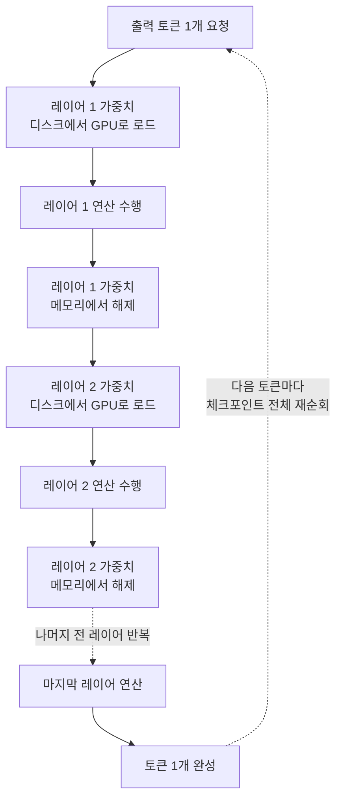

타임라인에 이런 문장이 돌면 일단 클릭하게 됩니다. 누군가 Kimi K3 2.8조 파라미터를 4GB GPU에서 공짜로 돌렸다. 사실이었습니다. AirLLM이 현존 최대 오픈웨이트 모델 지원을 추가했고, 공개된 측정 로그에는 VRAM 3.72GB라는 숫자가 찍혀 있습니다. 그런데 같은 로그에 토큰 하나를 뽑는 데 약 292초가 걸린다는 숫자도 함께 있습니다. 이 두 숫자를 같이 읽어야 이 기술이 실제로 무엇인지가 보입니다.


*전체를 한꺼번에 통과시키는 대신 한 장씩 좁은 문으로 밀어 넣는 것이 레이어 오프로딩의 발상입니다.*

## 왜 읽어야 하나

사내 GPU 예산을 짜면서 대형 오픈웨이트 모델을 자체 호스팅할지, API를 쓸지, 아니면 클러스터를 증설할지 판단해야 하는 인프라 담당자를 위한 글입니다. 결론을 먼저 말씀드리면, 레이어 단위 오프로딩은 GPU 메모리 제약을 디스크 대역폭 제약으로 바꾸는 기술이지 없애는 기술이 아닙니다. 그래서 실험과 검증에는 쓸 만하고 서비스에는 쓸 수 없으며, 용량 산정을 할 때 이 둘을 섞으면 예산이 통째로 틀립니다.

## 개요

Moonshot AI가 2026년 7월 Kimi K3의 가중치를 공개했습니다. 2.8조 파라미터 희소 MoE 모델이고, 토큰마다 896개 전문가 중 16개만 활성화합니다. Kimi Delta Attention과 Attention Residuals라는 두 구조를 새로 넣었고 컨텍스트는 100만 토큰, 네이티브 비전을 지원합니다. 공개 시점 기준 최대 규모의 오픈웨이트 모델입니다.

문제는 규모입니다. 체크포인트 전체가 1.56TB입니다. 정식 서빙 경로인 vLLM은 같은 세대 하드웨어에서 B200이나 GB200 기준 최소 16장을 요구하고, 현실적인 하한선은 텐서 병렬을 쓰는 8-GPU 노드입니다. 개인이나 소규모 팀이 만져 볼 수 있는 물건이 아닙니다.

AirLLM은 이 벽을 정면으로 뚫는 대신 옆으로 돌아갑니다. 트랜스포머가 레이어를 순차적으로 통과한다는 사실을 이용해서, 한 번에 레이어 하나만 GPU에 올립니다. 계산이 끝나면 즉시 내리고 다음 레이어를 올립니다. 전체 모델이 동시에 메모리에 있을 필요가 없어지므로 VRAM 요구량이 모델 크기가 아니라 가장 큰 레이어 하나의 크기로 결정됩니다. 이 방식으로 405B Llama와 671B DeepSeek-V3를 이미 돌린 전력이 있고, 70B 모델의 경우 140GB짜리 요구량을 4GB 아래로 내렸습니다. 라이선스는 MIT입니다.

Kimi K3 지원은 사용자가 이슈를 열어 요청하면서 추가됐습니다. 그 결과가 RTX 6000 Ada 한 장에서 측정된 VRAM 3.72GB입니다.

## 이 기술은 무엇인가

레이어 단위 추론의 논리는 단순합니다. 트랜스포머의 레이어들은 서로 병렬로 도는 것이 아니라 앞 레이어의 출력을 뒤 레이어가 받는 직렬 구조입니다. 그렇다면 레이어 40을 계산하는 순간에 레이어 1의 가중치는 메모리에 있을 이유가 없습니다.



*레이어를 하나씩 올렸다 내리므로 VRAM은 가장 큰 레이어 하나로 결정됩니다. 대신 토큰마다 디스크를 다시 훑습니다.*


*VRAM 요구량을 결정하는 것은 모델 전체 크기가 아니라 가장 큰 레이어 하나의 크기입니다.*

여기서 중요한 것은 이 방식이 양자화나 증류, 가지치기를 쓰지 않는다는 점입니다. 모델을 압축해서 작게 만드는 것이 아니라 원본 가중치를 그대로 두고 로딩 순서만 바꿉니다. 그래서 출력 품질이 원본과 같습니다. 압축 기반 접근이 항상 품질을 조금씩 깎는다는 점을 생각하면 이건 진짜 장점입니다.

디스크 준비 단계에도 실용적인 고민이 들어가 있습니다. 레이어별로 파일을 쪼개려면 원래는 1.56TB를 한 번 더 복사해야 하는데, AirLLM은 하드링크가 가능한 상황을 감지해서 복사 대신 하드링크를 겁니다. 쪼개진 레이어 파일들이 원본 바이트를 그대로 가리키므로 디스크 사용량은 1.56TB에서 늘지 않고, 몇 시간 걸릴 준비 작업이 몇 초로 끝납니다.

대가는 명확합니다. 토큰을 하나 만들 때마다 모든 레이어를 처음부터 끝까지 다시 읽어야 합니다. 두 번째 토큰이라고 해서 첫 번째 토큰이 읽어 둔 가중치를 재사용할 수 없습니다. 이미 메모리에서 내렸기 때문입니다. 병목이 연산에서 디스크 입출력으로 이동합니다.

이 접근이 K3에서 처음 나온 것도 아닙니다. AirLLM은 이미 405B 규모의 Llama와 671B DeepSeek-V3를 같은 방식으로 돌린 이력이 있고, K3는 그 궤적의 연장선에서 규모만 한 단계 더 밀어 올린 사례입니다. 모델이 커질수록 이 기법의 상대적 매력이 커진다는 점도 자연스럽습니다. 정식 서빙에 필요한 GPU 장수는 모델 크기에 따라 가파르게 늘어나는데, 레이어 오프로딩에 필요한 VRAM은 가장 큰 레이어 하나의 크기에 묶여 있어서 거의 늘지 않기 때문입니다. 진입 장벽이 높아질수록 우회로의 가치가 커지는 구조입니다.

참고로 K3의 규모감을 잡아 두면 이후 논의가 편합니다. 2.8조 파라미터는 직전 세대인 K2.6의 약 2.8배이고, 같은 시기 중국 진영의 DeepSeek V4 Pro가 1.6조, Zhipu AI의 GLM 5 계열이 7440억 규모입니다. 오픈웨이트 진영에서 한 단계 위의 체급이 새로 열린 셈이고, 그만큼 서빙 인프라 요구도 한 단계 올라갔습니다.

## 설치 및 통합

패키지 자체는 평범한 파이썬 라이브러리입니다.

```bash
pip install airllm
```

기본 사용 패턴은 허깅페이스 모델을 로드하듯이 쓰고, 내부에서 레이어 분할과 순차 로딩을 대신 처리해 주는 형태입니다.

```python
from airllm import AutoModel

model = AutoModel.from_pretrained("<모델 저장소 또는 로컬 경로>")
```

다만 K3 경로는 최근에 추가된 부분이라 모델 로딩 인자와 레이어 분할 옵션이 저장소 문서를 따라가는 것이 안전합니다. 정확한 스니펫은 `lyogavin/airllm` 저장소의 README에서 확인하시기 바랍니다. 여기에 임의로 적어 두면 다음 릴리스에서 어긋납니다.

실제로 K3를 돌리려면 라이브러리보다 저장소 쪽 준비가 더 큽니다. 1.56TB 체크포인트를 받을 공간과, 그 파일을 토큰마다 순차적으로 읽어 낼 수 있는 대역폭이 필요합니다. 네트워크 스토리지에 올려 두면 지연이 그대로 곱해집니다. 로컬 NVMe가 사실상 전제 조건입니다.

## 실제 실험 결과

이 글을 쓰면서 1.56TB 체크포인트를 내려받아 재현하지는 못했습니다. 저장 공간과 시간 모두 현실적이지 않아서, 아래 수치는 전부 공개된 측정 결과를 인용한 것입니다. 직접 측정한 숫자가 아님을 명시합니다.

RTX 6000 Ada 48GB 한 장에서 1.56TB 전체 체크포인트를 대상으로 실제 토큰을 생성하며 끝에서 끝까지 측정한 결과입니다.

| 항목 | 측정값 |
|---|---|
| 최대 VRAM 사용량 | 3.72GB |
| 토큰당 생성 시간 | 약 292초 (약 5분) |
| 500토큰 답변 소요 시간 | 약 42시간 |
| 체크포인트 크기 | 1.56TB |
| 측정 하드웨어 | RTX 6000 Ada 48GB 1장 |

여기서 몇 가지를 직접 계산해 보면 그림이 선명해집니다. 토큰당 292초는 초당 약 0.205토큰이고, 시간당 열두 토큰 남짓입니다. 500토큰이면 약 40.6시간이 나오고, 인용된 42시간과 거의 일치합니다.

더 흥미로운 계산은 대역폭 쪽입니다. 토큰마다 1.56TB를 훑는다고 보면 292초 동안 초당 약 5.3GB를 읽어야 합니다. 이건 고성능 NVMe SSD의 순차 읽기 대역폭과 거의 정확히 겹치는 수치입니다. 다시 말해 이 구성은 GPU가 놀고 SSD가 전력으로 일하는 상태입니다. 측정자가 병목은 연산이 아니라 디스크이며 어떤 메모리 관리 기법도 SSD가 읽는 속도를 바꾸지는 못한다고 정리한 것과 같은 결론입니다.


*연산 자원이 아니라 스토리지 대역폭이 상한을 정하는 구조입니다.*

비교 대상을 놓으면 격차가 더 분명합니다. vLLM은 K3에 대해 day-0 지원을 발표하면서 하이브리드 KDA 프리픽스 캐싱, DSpark 추측 디코딩, 프로덕션 규모의 분리 배치를 함께 내놓았고, B200급 하드웨어에서 초당 100토큰 이상이 가능하다고 밝혔습니다.

| 경로 | GPU 요구 | 처리량 | 성격 |
|---|---|---|---|
| AirLLM 레이어 오프로딩 | 4GB급 1장 | 약 0.2 토큰/초 | 실행 가능성 검증 |
| vLLM 정식 서빙 | B200급 16장 (하한 8장 노드) | 100 토큰/초 이상 | 서비스 운영 |


*같은 모델을 놓고도 목적이 다르면 필요한 인프라가 완전히 갈립니다.*

처리량 격차가 약 500배입니다. 하드웨어 비용 격차는 그보다 훨씬 크고, 방향이 반대입니다. 이 표가 이 글의 핵심입니다.

vLLM 쪽 설명에서 함께 눈여겨볼 대목은 병렬화 전략의 상충 관계입니다. 텐서 병렬은 응답성에는 좋지만 유효 KV 캐시 크기가 제한되어 전체 처리량이 낮고, 대규모 전문가 병렬은 네트워크 대역폭이 병목이 되면서 사용자당 출력 속도를 떨어뜨립니다. 2.8조 파라미터급에서는 GPU를 몇 장 붙이느냐만큼 어떻게 쪼개느냐가 성능을 좌우한다는 뜻입니다. 카드 한 장으로 돌리는 구성에는 애초에 존재하지 않는 고민이고, 바로 그 점이 두 경로가 다른 문제를 풀고 있다는 증거이기도 합니다.

경제성 축도 같이 보면 판단이 쉬워집니다. Moonshot이 책정한 K3 API 가격은 입력 100만 토큰당 3달러, 출력 100만 토큰당 15달러입니다. 중국 AI 랩 중에서는 가장 높은 편이지만 작업당 비용으로 환산하면 Claude Opus 4.8의 절반 수준입니다. 자체 호스팅을 검토한다면 이 가격이 손익분기점의 기준선이 됩니다. 16장짜리 B200 노드의 감가상각과 전력, 운영 인력을 이 단가로 나눠서 월간 토큰 소비량이 어디를 넘어야 자체 운용이 유리한지를 먼저 계산해야 합니다. 그 계산 없이 가중치가 공개됐으니 자체 호스팅한다는 결정으로 넘어가면 대체로 후회합니다.

## ThakiCloud 제품 적용 시사점

ThakiCloud의 ai-platform은 쿠버네티스 위에서 GPU 자원을 Kueue로 큐잉하고 vLLM으로 모델을 서빙하는 멀티테넌트 인프라입니다. 고객이 온프레미스나 소버린 환경에서 대형 모델을 직접 운용하려 할 때 가장 먼저 부딪히는 질문이 정확히 이 글의 주제입니다. 우리 GPU로 이 모델이 돌아갑니까.

이 질문에는 두 개의 답이 있고 둘을 구분해서 말씀드리는 것이 정직합니다.

첫째, 실행 가능성 검증 단계에서 레이어 오프로딩은 실질적인 도구입니다. 신규 오픈웨이트 모델이 나왔을 때 클러스터 전체를 잡아 두지 않고 카드 한 장으로 토크나이저 동작, 프롬프트 포맷, 출력 품질, 라이선스 적합성을 확인할 수 있습니다. 이 단계는 처리량이 필요 없고 정확도만 필요합니다. 압축을 쓰지 않아 원본 품질이 그대로 나온다는 점이 여기서 특히 유용합니다. 열여섯 장을 며칠 점유하고 나서야 이 모델은 우리 용도에 안 맞는다는 결론이 나오는 것보다 훨씬 낫습니다.

둘째, 용량 산정 단계에서 이 숫자를 인용하면 안 됩니다. 4GB에서 돌았다는 사실은 서빙 노드 크기를 줄여도 된다는 근거가 되지 못합니다. 실제 서빙은 여전히 8장에서 16장 규모의 노드와 그에 맞는 인터커넥트를 요구합니다. 이 구분이 흐려지면 예산 계획이 두 자릿수 배수로 틀립니다. 고객 미팅에서 4GB 기사 링크를 받는 일이 늘어날수록, 실행 가능성과 서비스 가능성을 분리해서 설명하는 일이 인프라 팀의 실무가 됩니다.

셋째, 병목이 디스크로 이동한다는 관찰 자체가 플랫폼 설계에 쓰입니다. 대형 MoE 모델을 다루는 클러스터에서 스토리지 계층과 모델 캐시 배치는 GPU 개수만큼 중요한 변수입니다. 체크포인트를 어느 계층에 두고 노드에 어떻게 미리 배포할지는 콜드 스타트 시간을 직접 결정합니다. 1.56TB짜리 모델이 표준이 되어 가는 흐름에서 이건 곧 일상적인 운영 과제가 됩니다.


*인프라 팀이 이 기술을 다루는 세 갈래를 한 장으로 정리하면 이렇게 됩니다.*

## 한계 및 반론

이 기법을 과소평가하는 반대 방향의 오해도 짚어야 공정합니다.

우선 42시간이라는 숫자는 대화형 사용을 가정했을 때의 이야기입니다. 배치 성격의 작업, 예를 들어 소량의 고난도 문제를 하룻밤 걸려 풀어도 되는 오프라인 평가라면 이 처리량으로도 의미가 있습니다. 저녁에 걸어 두고 아침에 결과를 보는 워크플로는 실재합니다.

또한 측정에 쓰인 하드웨어가 RTX 6000 Ada 48GB라는 점을 놓치면 안 됩니다. VRAM 3.72GB만 썼다는 것이지 4GB 카드에서 측정했다는 뜻이 아닙니다. 실제로 4GB급 카드에 꽂으면 PCIe 대역폭과 시스템 메모리 구성이 달라 같은 수치가 나온다고 보장할 수 없습니다. 헤드라인의 4GB는 VRAM 상한을 가리키는 것이지 검증된 실행 환경 전체를 가리키는 것이 아닙니다.

MoE 구조와 관련해서도 열린 질문이 남습니다. K3는 토큰마다 896개 전문가 중 16개만 활성화하므로, 이론적으로는 활성 전문가만 읽으면 되는 여지가 있습니다. 인용된 측정치는 사실상 체크포인트 전체를 순회하는 수준의 시간을 보여 주는데, 라우팅을 고려한 선택적 로딩이 어디까지 구현되어 있는지는 저장소 코드를 직접 확인해야 알 수 있습니다. 이 부분은 확인하지 못했으므로 단정하지 않겠습니다. 만약 선택적 전문가 로딩이 더 들어간다면 처리량이 개선될 여지가 있습니다.

마지막으로 이 기술이 겨냥하는 자리를 오해하면 안 됩니다. AirLLM은 vLLM의 경쟁자가 아닙니다. vLLM이 처리량과 동시성을 최적화하는 서빙 엔진이라면 AirLLM은 메모리 제약을 시간으로 환전하는 접근성 도구입니다. 둘을 같은 축에 놓고 비교하는 순간 양쪽 다 잘못 평가하게 됩니다.

## 정리

4GB GPU에서 2.8조 파라미터가 돌아간다는 문장은 사실입니다. 다만 그 문장이 답하는 질문은 이 모델을 서비스할 수 있는가가 아니라 이 모델을 만져 볼 수 있는가입니다. 두 질문의 답 사이에는 처리량 기준으로 약 500배의 거리가 있고, 그 거리는 디스크 대역폭이라는 물리 법칙이 만들어 냅니다.

인프라 담당자에게 남길 실무 지침은 한 줄로 요약됩니다. 레이어 오프로딩은 도입 검토 단계의 검증 도구로 예산 없이 도입하시고, 용량 산정에는 vLLM 기준 숫자만 쓰십시오. 신규 대형 모델이 나올 때마다 카드 한 장으로 먼저 확인하고, 통과한 모델에만 클러스터를 붙이는 순서가 가장 저렴합니다. 그리고 다음번에 4GB 기사가 타임라인에 돌면, 같은 로그의 토큰당 시간을 함께 확인하시면 됩니다.

## 출처

- [Unbelievable! Run Kimi K3, 2.8 Trillion Parameters, on a Single 4GB GPU (Gavin Li, AI Advances)](https://ai.gopubby.com/unbelievable-run-kimi-k3-2-8-trillion-parameters-on-a-single-4gb-gpu-23590e7a16c2)
- [Kimi K3 Really Does Run on a 4GB GPU. A 500-Token Answer Takes 42 Hours. (CodeToDeploy)](https://medium.com/codetodeploy/kimi-k3-really-does-run-on-a-4gb-gpu-a-500-token-answer-takes-42-hours-ace78fcc665d)
- [lyogavin/airllm (GitHub, MIT)](https://github.com/lyogavin/airllm)
- [Kimi K3 Is Here: Efficient Day-0 Support on vLLM (vLLM Blog)](https://vllm.ai/blog/2026-07-27-k3)
- [China's Moonshot AI releases Kimi K3, the largest open-source model ever (VentureBeat)](https://venturebeat.com/technology/chinas-moonshot-ai-releases-kimi-k3-the-largest-open-source-model-ever-rivaling-top-us-systems)
- [원 트윗](https://x.com/hjguyhan/status/2084763811740111283)
