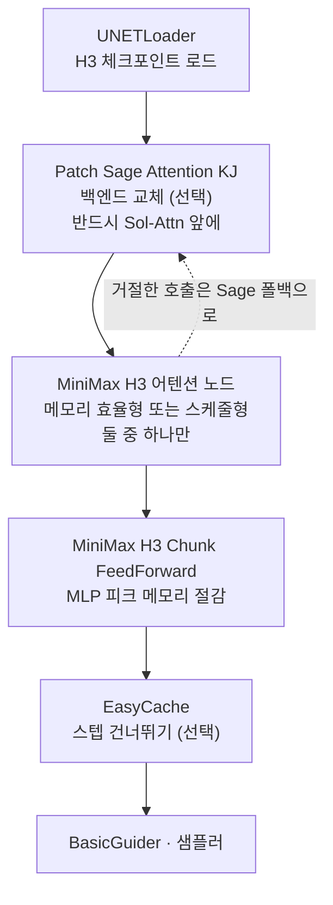

영상 생성 모델을 쓰다 보면 커뮤니티에서 이런 형태의 팁을 자주 만납니다. 노드 몇 개를 끼우면 생성 시간이 줄어든다는 이야기입니다. MiniMax-H3에 대해서도 같은 팁이 돌고 있습니다. EasyCache와 Patch Sol-Attn, Patch Sage Attention KJ를 워크플로에 추가하라는 것입니다. 팁 자체는 맞습니다. 다만 세 노드가 서로 어떤 관계이고 얼마나 빨라지는지는 한 줄짜리 팁에 담기지 않습니다. 그래서 각 노드의 소스 코드와 공개된 벤치마크를 직접 열어 확인했습니다.


*측정된 구간은 생각보다 짧고, 실제 작업은 그 바깥에서 벌어집니다.*

## 왜 읽어야 하나

ComfyUI에서 MiniMax-H3를 돌리면서 생성 시간을 줄이려는 분, 또는 영상 생성 워크로드를 사내 GPU에 올릴지 판단해야 하는 분을 위한 글입니다. 결론을 먼저 말씀드리면, 이 가속 스택의 실제 이득은 커널 벤치마크가 보여 주는 1.44배가 아니라 파이프라인 기준 1.11배이고, 그마저도 여러분이 실제로 돌리는 렌더 길이는 벤치마크가 측정한 구간의 오른쪽 바깥에 있습니다. 노드를 끼우는 것은 5분이면 끝나지만, 어느 노드가 어느 순서로 들어가야 하는지를 틀리면 아무 일도 일어나지 않습니다.

## 개요

MiniMax-H3는 MiniMax가 2026년 8월 초에 공개한 옴니모달 영상 생성 모델입니다. 텍스트와 이미지, 영상, 오디오를 하나의 컨텍스트에서 다루고 스테레오 오디오가 붙은 영상을 생성합니다. 저희는 앞선 글에서 이 모델을 자체 인프라에 올릴 때 필요한 가중치 용량과 시퀀스 길이를 계산했습니다. 그 글의 결론은 병목이 가중치가 아니라 시퀀스 길이라는 것이었습니다.

이번 글은 그 병목을 실제로 공격하는 도구들을 봅니다. 커뮤니티가 정착시킨 조합은 세 갈래입니다. 어텐션 연산 자체를 더 빠른 커널로 바꾸는 것, 어텐션이 볼 범위를 줄이는 것, 그리고 샘플링 스텝 자체를 건너뛰는 것입니다. EasyCache는 세 번째, Sol-Attn은 첫 번째와 두 번째, Sage Attention은 첫 번째에 해당합니다. 셋은 경쟁 관계가 아니라 서로 다른 층위에서 동작하기 때문에 함께 쓸 수 있습니다. 다만 함께 쓰는 방법에 규칙이 있고, 그 규칙이 팁에는 빠져 있습니다.

여기서 다루는 수치는 두 종류입니다. 하나는 상류 저장소가 공개한 실측값이고, 다른 하나는 저희가 공개 사양에서 유도한 계산값입니다. 두 종류를 섞지 않도록 매번 구분해서 표시하겠습니다. 저희 GPU에서 H3를 다시 돌려 얻은 자체 측정값은 이 글에 없습니다.

## 이 기술은 무엇인가

세 노드가 파이프라인의 어느 지점에 앉는지부터 정리하겠습니다.



가장 아래 층에 있는 것이 어텐션 커널입니다. SageAttention은 어텐션 연산을 양자화된 커널로 바꿔치기합니다. ComfyUI에서는 KJNodes의 Patch Sage Attention 노드가 이 역할을 하고, 하는 일은 백엔드를 sage로 지정하는 것뿐입니다.

Sol-Attn은 여기서 한 걸음 더 들어갑니다. 엔비디아가 공개한 Sol-Attn 트리톤 참조 커널을 기반으로 하되, 엔비디아 공식 디스패처가 활성화하지 않는 컨슈머 블랙웰(SM120, RTX 50 시리즈)에서도 돌도록 저장소가 직접 손을 봤습니다. 커널 소스는 아파치 2.0으로 벤더링되어 있고 SM120 활성화는 저장소의 변경 사항이라고 명시되어 있습니다. 지원 범위는 SM89부터 SM120까지이고, SM90과 SM100, SM120은 TMA 디스크립터 커널 경로를, SM89(RTX 40 시리즈)는 포인터 커널 트윈을 씁니다. 다만 하드웨어에서 실제로 검증된 것은 SM120뿐이고 SM89 경로는 강제 디스패치로만 확인했다고 저장소가 밝히고 있습니다.

Sol-Attn이 단순한 커널 교체와 다른 지점은 희소성입니다. `tau`라는 파라미터가 블록 점수의 평균에서 몇 표준편차 위를 근사 경로로 보낼지 정합니다. 값이 높을수록 더 많은 KV 블록이 근사 경로를 타고 더 빨라집니다. 여기에 샘플링 진행에 따라 tau를 램프시키는 스케줄 기능이 붙어 있어서 초반에는 희소하게, 후반에는 조밀하게 계산할 수 있습니다. H3 전용 노드는 융합된 qkv 프로젝션의 스트라이드 뷰를 커널에 그대로 넘겨 q와 k, v 복사를 없애고, H3가 패킹해 둔 조건화 행에 대해서는 정확한 KV 싱크를 유지합니다.

가장 위층이 캐싱입니다. EasyCache는 ComfyUI 코어에 들어 있는 노드이고, 카테고리는 `advanced/debug`입니다. 동작 원리는 소스를 보면 분명합니다. 직전 스텝의 입력을 서브샘플링해 두고 현재 입력과의 변화율을 누적한 뒤, 그 누적 변화율이 `reuse_threshold` 미만이면 모델 평가를 통째로 건너뛰고 캐시된 출력 차분을 재사용합니다. 기본값은 `reuse_threshold` 0.2, `start_percent` 0.15, `end_percent` 0.95이고 서브샘플 배수는 8입니다. 즉 샘플링 초반 15퍼센트와 후반 5퍼센트에서는 캐시가 개입하지 않습니다.

같은 파일에 LazyCache라는 형제 노드가 있습니다. 코드 주석이 스스로를 이렇게 설명합니다. EasyCache의 자작 버전이고 전반적으로 더 나쁘게 동작하지만 드문 경우에 더 낫고 ComfyUI의 모든 것과 호환된다는 것입니다. 특정 모델에서 EasyCache가 붙지 않으면 이쪽을 시도해 볼 수 있습니다.

## 설치 및 통합

Sol-Attn 노드는 커스텀 노드 디렉토리에 클론해서 설치합니다.

```bash
cd ComfyUI/custom_nodes
git clone https://github.com/Saganaki22/ComfyUI-sol-attn
```

요구 사항은 SM89 이상의 엔비디아 GPU와 트리톤입니다. tau 스케줄 미리보기 이미지를 쓰려면 matplotlib이 추가로 필요하지만 필수는 아닙니다. H3 전용 노드를 쓰려면 H3 체크포인트가 `ComfyUI/models/diffusion_models/`에 있어야 합니다. ComfyUI 공식 튜토리얼이 배포하는 H3 체크포인트는 다음과 같습니다.

```text
minimax_h3_fl2va_pruned_int8_convrot.safetensors   # 텍스트 기반 생성, INT8 ConvRot
minimax_h3_ref2va_pruned_int8_convrot.safetensors  # 레퍼런스 기반 생성, INT8 ConvRot
minimax_h3_nvfp4_awq.safetensors                   # NVFP4 AWQ 변형
minimax_h3_video_vae_fp16.safetensors
minimax_h3_audio_vae_fp32.safetensors
```

여기까지는 흔한 설치 과정입니다. 정작 중요한 것은 배선 순서이고, 이 부분이 트윗 한 줄에 들어가지 않습니다. 저장소 문서가 명시하는 규칙은 세 가지입니다.

첫째, H3 어텐션 노드 두 개는 서로 대안이지 함께 쓰는 것이 아닙니다. 스케줄형 노드가 메모리 효율형 노드의 상위 집합이어서, `tau_start`와 `tau_end`를 같게 두면 두 노드가 동일해집니다. 둘 다 끼우면 안 됩니다.

둘째, Sage는 뒤가 아니라 앞에 붙입니다. KJNodes의 Patch Sage Attention은 백엔드를 교체할 뿐이므로, Sol-Attn 노드가 처리를 거절한 호출(초반 조밀 스텝, 짧은 시퀀스, 부적합한 형상)이 스톡 forward를 타고 sage로 흘러갑니다. Sol-Attn 뒤에 붙이면 아무 일도 하지 않습니다.

셋째, 제로카피 변형을 쓸 때 KJNodes의 MiniMax H3 Memory Efficient Sage Attention Patch를 앞에 붙이면 폴백 forward로 채택되지만, 뒤에 붙이면 Sol-Attn 노드를 통째로 가려 버립니다. 순서가 성능이 아니라 동작 여부를 결정합니다.

FeedForward 청킹 노드는 어텐션 백엔드와 독립적으로 동작합니다. H3의 토큰 단위 FFN을 패킹된 시퀀스 차원으로 쪼개되 각 청크 안에서는 ComfyUI의 구현을 그대로 유지합니다. 기본 청크 수는 2, `min_tokens`는 8192입니다. 그보다 짧은 시퀀스에서는 아무 일도 하지 않습니다.

## 실제 실험 결과

여기서부터가 이 글의 핵심입니다. 저장소가 공개한 커널 벤치마크와, 그 벤치마크 위에 실제 렌더 설정을 얹어 저희가 계산한 결과를 함께 봅니다.


*왼쪽은 저장소가 공개한 실측 곡선이고, 오른쪽은 같은 저장소가 기록한 동일 조건 대조군입니다.*

먼저 커널 수준 실측값입니다. RTX 5090(SM120)에서 torch 2.10.0과 트리톤 3.6.0으로, H3의 어텐션 형상(배치 1, 헤드 56, 헤드 차원 128, bf16)에 대해 20회 중앙값으로 측정한 값입니다.

| 토큰 수 | PyTorch SDPA | SageAttention | Sol-Attn strided | Sage 대비 |
|---:|---:|---:|---:|---:|
| 2,048 | 1.45 ms | 0.60 ms | 0.89 ms | 0.67배 |
| 8,192 | 23.96 ms | 3.72 ms | 3.25 ms | 1.14배 |
| 16,384 | 84.95 ms | 13.94 ms | 10.08 ms | 1.38배 |
| 32,768 | 352.15 ms | 55.90 ms | 38.73 ms | 1.44배 |
| 65,536 | 1,350.54 ms | 221.06 ms | 153.56 ms | 1.44배 |

2,048 토큰에서 0.67배라는 숫자에 주의해야 합니다. 그 구간에서는 Sage가 더 빠르다는 뜻입니다. 저장소도 대략 4K 토큰 아래에서는 Sage가 완승한다고 적어 두었고, 그래서 노드의 `min_tokens` 기본값이 4,096입니다. 측정된 승리만 취하고 싶다면 이 값을 8,192 쪽으로 올리라는 권고까지 붙어 있습니다.

이제 저희가 계산한 부분입니다. H3-VisualVAE의 공개 사양은 공간 16배, 시간 4배 압축에 잠재 채널 24개이고, 여기에 1대2대2 패치화가 더해져 트랜스포머 입력 기준 유효 공간 압축은 32배가 됩니다. 오디오는 채널당 40Hz 잠재 토큰이고 스테레오이므로 두 배입니다. 이 사양으로 렌더 설정별 패킹 시퀀스 길이를 계산했습니다.

| 렌더 설정 | 패킹 토큰 수 | 벤치마크 구간 | FF 청킹 절감 |
|---|---:|---|---:|
| 480x864 · 15초 (저장소 대조군) | 37,650 | 32K~65K 구간 안 | 1.01 GiB |
| 1344x768 · 4초 (ComfyUI 기본) | 24,512 | 16K~32K 구간 안 | 0.65 GiB |
| 1344x768 · 15초 (ComfyUI 기본) | 91,920 | 측정 구간 초과 | 2.45 GiB |
| 1080p · 15초 | 179,400 | 측정 구간 초과 | 4.79 GiB |
| 2K · 15초 (Regenerate-2K) | 325,200 | 측정 구간 초과 | 8.68 GiB |

같은 공식으로 2K 15초를 계산하면 325,200 토큰이 나오는데, 이는 저희가 앞선 글에서 별도로 계산한 32만 토큰과 일치합니다. 공식이 어긋나지 않았다는 뜻입니다.

표에서 읽어야 할 것은 두 가지입니다. 첫째, ComfyUI 기본 해상도로 15초짜리를 뽑는 순간 시퀀스는 91,920 토큰이 되어 커널 벤치마크의 최고점인 65,536을 넘어섭니다. 1.44배라는 숫자는 그 지점에서 측정된 적이 없습니다. 저장소의 표는 65,536에서 끝나고, 그보다 긴 구간에 대해 정직한 답은 모른다는 것입니다. 어텐션 비용이 시퀀스 제곱에 비례하므로 더 벌어질 여지도 있고, 메모리 대역폭에 먼저 막혀 이득이 줄어들 여지도 있습니다. 어느 쪽인지는 측정되지 않았습니다.

둘째, FF 청킹의 절감량은 반대로 시퀀스에 선형으로 커집니다. 중간 텐서가 토큰당 56KB이므로 청크 2개 기준 절감은 8K 토큰에서 약 238MiB, 65K 토큰에서 약 1.9GiB로 저장소가 실측했습니다. 같은 계수를 2K 15초에 적용하면 8.68GiB가 됩니다. 어텐션 가속이 불확실해지는 구간에서 메모리 절감은 오히려 확실해집니다. 긴 렌더에서 이 노드가 어텐션 노드보다 실질적인 도움이 될 수 있다는 뜻입니다.

그리고 이 글의 제목이 된 숫자가 남았습니다. 같은 저장소가 동일 조건 대조군을 하나 기록해 두었습니다. MiniMax H3, 15초, 480x864, 20스텝, `res_multistep`, 고정 시드, 동일 입력 이미지에서 Sage가 반복당 9.91초, Sol-Attn이 8.92초였습니다. 배속으로 환산하면 1.11배입니다. 그런데 이 설정의 시퀀스 길이는 37,650 토큰이고, 커널 표에서 그 지점의 배속은 1.44배입니다.

커널이 1.44배 빨라졌는데 파이프라인은 1.11배만 빨라졌습니다. 커널 이득의 약 75퍼센트가 어텐션 바깥에서 사라진 것입니다. 놀랄 일은 아닙니다. 확산 샘플링 한 스텝에는 어텐션 말고도 FFN과 정규화, VAE 인코딩과 디코딩, 조건화 처리가 들어 있고, 어텐션을 아무리 빠르게 만들어도 나머지는 그대로입니다. 다만 커널 벤치마크의 숫자를 그대로 기대하고 노드를 끼우면 실망하게 된다는 점은 분명히 해 둘 필요가 있습니다.

정확도 쪽 수치도 기록해 둡니다. 저장소는 INT8 경로에서 K의 블록별 잔차만 양자화하고 평균 항은 bf16으로 정확히 유지하는데, 정확 경로 대비 상대 L2 오차가 0.008로 전체 키를 양자화하는 설계(0.030)보다 약 3.7배 가깝다고 밝히고 있습니다. `int8_qk`를 켜면 bf16 기준 대비 8,192에서 0.97배, 16,384에서 1.30배, 32,768에서 1.21배, 65,536에서 1.18배로 측정되며 수치 오차는 약 1퍼센트 늘어납니다. 8,192 토큰에서는 오히려 느려지므로 무조건 켜는 옵션은 아닙니다.

## ThakiCloud 제품 적용 시사점

이 결과는 저희가 Metis에서 추론 최적화를 다루는 방식과 정확히 맞닿아 있습니다. Metis는 ThakiCloud의 추론 서빙 계층으로, 모델을 Dedicated Endpoint나 Serverless로 올리고 GPU와 NPU 사이에서 라우팅합니다. 커널 교체와 희소 어텐션, 스텝 캐싱은 전부 Metis가 관리해야 할 손잡이인데, 이번 분석이 말해 주는 것은 그 손잡이를 하나씩 자랑하는 방식이 위험하다는 점입니다. 고객에게 의미 있는 숫자는 커널 배속이 아니라 클립 하나를 뽑는 데 걸린 시간과 그때 소모한 GPU 시간입니다. Metis의 벤치마크를 파이프라인 종단 기준으로 잡아야 하는 이유가 여기 있습니다.

GPU 세대 문제도 실무적입니다. Sol-Attn은 SM89부터 SM120까지를 지원하고 SM90과 SM100은 TMA 커널 경로를 탑니다. 저희가 Telox로 제공하는 H200 클러스터는 SM90이므로 이 경로에 해당합니다. 다만 저장소가 하드웨어에서 실제로 검증한 것은 SM120뿐이라고 밝혔으므로, H200에서 쓰려면 저희가 직접 검증해야 합니다. 이것은 저희 쪽 다음 과제로 남겨 둡니다. 컨슈머 GPU에서 검증된 최적화를 데이터센터 GPU에 그대로 옮겨 쓸 수 있다고 가정하지 않는 편이 안전합니다.

한 층 위로 올라가면 Paxis 이야기가 됩니다. Paxis는 저희의 Enterprise Agent Platform이고, 영상 생성은 그 안에서 하나의 워크플로 단계로 소비됩니다. 마케팅 소재를 만들거나 제품 설명 영상을 자동으로 뽑는 업무가 그렇습니다. 이때 Paxis가 관리해야 하는 단위는 어텐션 커널이 아니라 업무 한 건입니다. 15초 클립 하나에 몇 분이 걸리고 비용이 얼마인지가 워크플로 설계를 결정합니다. 커널 1.44배가 파이프라인 1.11배가 되는 이번 사례는, 하위 계층의 개선을 업무 단위 지표로 환산해 보고하는 절차가 왜 필요한지를 보여 줍니다. Paxis의 실행 Trace와 비용 측정이 그 환산을 담당합니다.

오래 걸리는 렌더를 사내에서 돌려야 하는 고객이라면 Aegis도 선택지에 들어옵니다. 영상 소재에는 미공개 제품 이미지나 계약 관계가 있는 원본이 섞이는 경우가 많아 외부 API로 보내기 어렵습니다. 온프레미스에 H3를 올리고 위 최적화를 적용하는 구성은 데이터 주권과 비용을 동시에 다루는 방법이 됩니다.

## 한계 및 반론

이 글이 근거로 삼은 커널 수치는 전부 단일 머신에서 나온 값입니다. 저장소 스스로도 실제 숫자가 붙은 스모크 테스트로 취급하라고 적었습니다. RTX 5090 한 대, 커널 빌드 하나에서 나온 결과이므로 다른 GPU와 드라이버, 다른 트리톤 버전에서 그대로 재현된다는 보장이 없습니다.

시퀀스 길이 계산은 공개된 VAE 압축 계수에서 유도한 값이지 실행 중에 계측한 값이 아닙니다. 실제 구현이 패딩을 넣거나 조건화 토큰을 추가로 붙이면 실측치는 이보다 늘어납니다. 방향은 맞되 정확한 자릿수까지 믿을 값은 아닙니다.

측정 구간 밖이라는 지적도 양날입니다. 65,536 토큰을 넘으면 이득이 줄어든다고 이 글이 주장한 것은 아닙니다. 모른다고 말했을 뿐입니다. 어텐션 비용이 시퀀스 제곱으로 커지는 만큼 긴 시퀀스에서 희소 어텐션의 상대 이득이 더 커질 가능성도 충분히 있습니다. 필요한 것은 추측이 아니라 그 구간에서의 측정입니다.

마지막으로 캐싱은 공짜가 아닙니다. EasyCache는 스텝을 건너뛰어 시간을 벌지만 건너뛴 스텝만큼 출력이 달라집니다. `reuse_threshold`를 올릴수록 빨라지고 그만큼 원본과 멀어집니다. 어텐션 커널 교체가 대체로 출력을 보존하는 것과 성격이 다릅니다. FF 청킹은 출력이 비트 단위로 동일하다고 저장소가 밝혔지만, 캐싱에는 그런 보장이 없습니다. 품질 저하를 감시할 눈이 없다면 캐싱부터 켤 이유는 없습니다.

## 정리

노드 세 개를 끼우면 빨라진다는 팁은 사실입니다. 다만 이 글에서 확인한 것은 세 가지입니다. 첫째, 세 노드는 서로 다른 층에서 동작하고 배선 순서가 성능이 아니라 동작 여부를 결정합니다. Sage는 Sol-Attn 앞에 두어야 하고, H3 어텐션 노드 두 개는 함께 쓰면 안 됩니다. 둘째, 커널 수준 1.44배는 같은 저장소의 동일 조건 대조군에서 파이프라인 1.11배로 줄어듭니다. 셋째, 여러분이 실제로 돌리는 15초짜리 렌더는 91,920 토큰이어서 커널 벤치마크가 측정한 범위 밖에 있습니다.

그래서 다음 행동은 이렇게 정리됩니다. 짧은 렌더를 주로 돌린다면 `min_tokens`를 8,192로 올려 측정된 승리 구간에서만 Sol-Attn이 개입하게 하고, 긴 렌더를 돌린다면 어텐션 노드보다 FeedForward 청킹에서 얻을 것이 더 확실합니다. 그리고 어느 쪽이든 A/B는 커널 지연이 아니라 클립 하나를 뽑는 벽시계 시간으로 재야 합니다. 저희가 다음에 할 일은 SM90인 H200에서 이 경로를 직접 검증하는 것이고, 그 결과는 측정한 뒤에 다시 적겠습니다.

## 출처

- [Saganaki22/ComfyUI-sol-attn](https://github.com/Saganaki22/ComfyUI-sol-attn) (커널 벤치마크, 노드 파라미터, 배선 규칙)
- [ComfyUI MiniMax H3 튜토리얼](https://docs.comfy.org/tutorials/video/minimax/minimax-h3) (공식 워크플로, 체크포인트 목록, 기본 해상도)
- [ComfyUI 코어 `comfy_extras/nodes_easycache.py`](https://github.com/comfyanonymous/ComfyUI) (EasyCache와 LazyCache 구현, 기본값)
- [MiniMaxAI/MiniMax-H3](https://huggingface.co/MiniMaxAI/MiniMax-H3) (VAE 압축 계수, 모델 사양)
- [kijai/ComfyUI-KJNodes](https://github.com/kijai/ComfyUI-KJNodes) (Patch Sage Attention 노드)
- 원 트윗: [@SD_Tutorial](https://x.com/SD_Tutorial/status/2084696987107229868)
