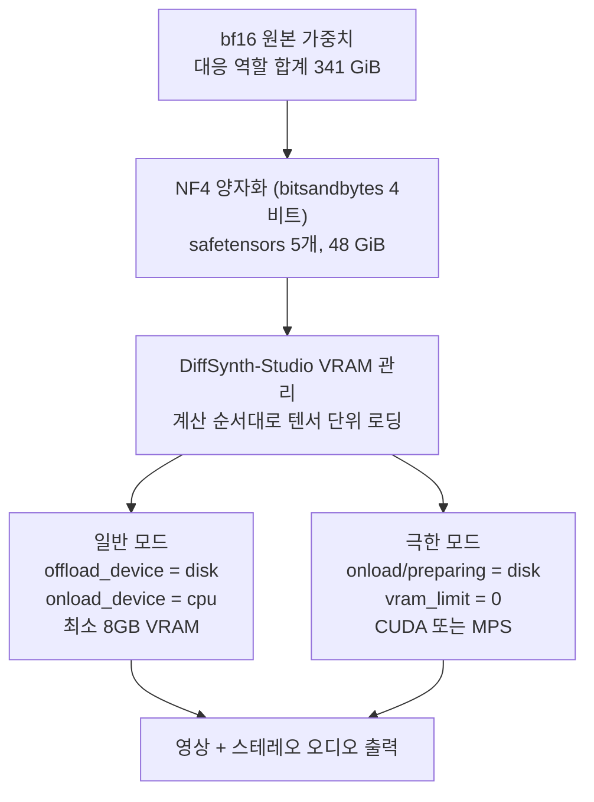

오픈웨이트 모델이 공개되면 며칠 안에 양자화본이 따라 나옵니다. MiniMax-H3도 그랬습니다. ModelScope가 4비트 양자화본을 DiffSynth-Studio와 묶어 공개하면서 최소 8GB VRAM으로 돌릴 수 있다고 알렸고, 맥에서도 된다는 말이 붙었습니다. 영상 생성 모델 하나가 게이밍 그래픽카드에 들어간다는 이야기라 눈길이 갑니다. 그래서 파일 목록을 열어 실제 용량을 재 봤습니다. 숫자를 맞춰 보니 이야기의 주인공이 양자화가 아니라는 것이 드러났습니다.


*압축은 절반의 이야기이고, 나머지 절반은 한 번에 하나씩 흘려보내는 방식에 있습니다.*

> **라이선스 안내 (2026년 8월 9일 추가).** MiniMax H3 커뮤니티 라이선스는 2026년 8월 2일자로
> 발효됐고, 적용 지역 정의에서 대한민국과 미국, 유럽연합, 영국을 제외합니다. 이 지역에서는
> 오픈웨이트를 내려받아 로컬에서 실행하거나 수정하는 행위, 그리고 그 출력물을 사용하거나
> 배포하는 행위가 라이선스되지 않습니다. 이 글은 그 사실이 확인되기 전에 작성됐습니다.
> 아래의 설치와 실행 절차는 적용 지역 안에 있는 독자를 기준으로 읽어 주시고, 국내에서는
> 공급자의 호스팅 API를 쓰거나 MiniMax에 개별 라이선스를 문의하는 경로를 검토하시기 바랍니다.
> 조항 대조는 [오픈 영상 모델 라이선스 실사](/tech-blog/ko/llmops/open-video-model-license-territory-audit/)에
> 정리해 두었습니다.

## 왜 읽어야 하나

컨슈머 GPU나 맥에서 영상 생성 모델을 돌려 보려는 분, 또는 양자화본을 사내 서빙 후보로 검토하는 분을 위한 글입니다. 결론을 먼저 말씀드리면, NF4 양자화는 중복을 걷어낸 고유 가중치 196GiB를 48GiB로 줄이지만 그 48GiB는 여전히 8GB VRAM의 6배입니다. 8GB에서 돌아가는 이유는 양자화가 아니라 DiffSynth-Studio의 VRAM 관리, 즉 계산 순서대로 텐서를 디스크에서 하나씩 올리는 방식입니다. 이 구분을 하지 않으면 용량 계획과 성능 기대치를 둘 다 틀리게 잡습니다.

## 개요

MiniMax-H3는 2026년 8월 초에 오픈웨이트로 공개된 옴니모달 영상 생성 모델입니다. 텍스트와 이미지, 영상, 오디오가 섞인 컨텍스트를 하나의 트랜스포머 스트림에서 다루고 스테레오 오디오가 붙은 영상을 만듭니다. 공개 직후 DiffSynth-Studio가 이 모델을 지원 목록에 추가하면서 저VRAM 추론과 NF4 양자화 추론을 함께 넣었습니다.

NF4는 bitsandbytes의 4비트 양자화 방식입니다. 여기서 검토할 것은 세 가지입니다. 실제로 몇 배 줄었는가, 줄어든 결과가 8GB에 들어가는가, 그리고 들어가지 않는다면 무엇이 그 격차를 메우는가입니다. 세 번째 질문의 답이 이 글에서 가장 실용적인 부분입니다.

이 글의 용량 수치는 HuggingFace 파일 매니페스트 API에서 받은 바이트를 직접 합산한 값입니다. 성능과 화질에 대한 수치는 없습니다. 저희가 이 모델을 로컬에서 돌려 계측하지 않았기 때문이고, 없는 숫자를 만들지 않는 편이 낫다고 판단했습니다.

## 이 기술은 무엇인가

양자화본이 어떻게 8GB 장비에 도달하는지를 층으로 나누면 이렇게 됩니다.



아래층이 양자화입니다. NF4는 4비트 정규 부동소수점 표현으로 가중치를 저장하고 계산 시점에 복원합니다. 저장 용량과 메모리 대역폭을 줄이는 것이 목적입니다.

위층이 이 글의 주인공인 VRAM 관리입니다. DiffSynth-Studio는 모델 로딩을 `offload_dtype`, `offload_device`, `onload_device`, `preparing_device`, `computation_device` 다섯 개의 손잡이로 제어합니다. 모델 카드가 제시하는 기본 설정은 offload 대상을 디스크로 두고 onload를 CPU로, 계산을 CUDA로 보냅니다. 프레임워크가 가용 VRAM을 보고 파라미터 로딩을 자동으로 조절하며, 이 상태에서 최소 요구치가 8GB입니다.

성능이 극히 제한된 장비를 위한 설정이 따로 있습니다. 모델 카드가 극한 하드웨어 최적화라고 부르는 구성인데, `onload_device`와 `preparing_device`까지 디스크로 내리고 `vram_limit`을 0으로 둡니다. 이렇게 하면 모델의 텐서가 계산 순서에 따라 디스크에서 VRAM으로 하나씩 올라갑니다. 모델 전체가 메모리에 상주하지 않으므로 요구 VRAM이 사실상 사라집니다. 그리고 이 극한 설정 블록에 `computation_device`를 `mps`로, `device`를 `mps`로 두는 변형이 함께 실려 있습니다. 맥에서도 된다는 말의 출처가 여기입니다.

즉 8GB라는 숫자는 모델이 8GB에 들어간다는 뜻이 아니라, 한 번에 VRAM에 올라와 있는 부분이 8GB 안에 들어가도록 프레임워크가 스트리밍한다는 뜻입니다.

## 설치 및 통합

설치는 DiffSynth-Studio를 소스에서 받는 방식입니다.

```bash
git clone https://github.com/modelscope/DiffSynth-Studio
cd DiffSynth-Studio
pip install -e ".[all]"
```

추론 코드는 모델 카드가 제시하는 형태를 그대로 씁니다. 아래는 텍스트에서 영상과 오디오를 만드는 FL2VA 경로입니다.

```python
import torch
from diffsynth.pipelines.minimax_h3_audio_video import MiniMaxH3Pipeline, ModelConfig

vram_config = {
    "offload_dtype": "disk",
    "offload_device": "disk",
    "onload_device": "cpu",
    "preparing_device": "cuda",
    "computation_device": "cuda",
}

pipe = MiniMaxH3Pipeline.from_pretrained(
    torch_dtype=torch.bfloat16,
    device="cuda",
    model_configs=[
        ModelConfig(model_id="DiffSynth-Studio/MiniMax-H3-NF4",
                    origin_file_pattern="minimax-h3-fl2va-nf4.safetensors", **vram_config),
        ModelConfig(model_id="DiffSynth-Studio/MiniMax-H3-NF4",
                    origin_file_pattern="minimax-h3-text-encoder-nf4.safetensors", **vram_config),
        ModelConfig(model_id="DiffSynth-Studio/MiniMax-H3-NF4",
                    origin_file_pattern="video_vae_nf4.safetensors", **vram_config),
        ModelConfig(model_id="DiffSynth-Studio/MiniMax-H3-NF4",
                    origin_file_pattern="audio_vae_nf4.safetensors", **vram_config),
    ],
    processor_config=ModelConfig(model_id="MiniMax/MiniMax-H3",
                                 origin_file_pattern="FL2VA/processor/"),
)
pipe.enable_vram_management(vram_limit=torch.cuda.mem_get_info("cuda")[1] / (1024 ** 3) - 4)
```

`vram_limit` 계산에서 전체 VRAM에서 4를 빼는 부분이 눈에 띕니다. 활성화와 중간 텐서를 위한 여유를 남겨 두는 것입니다. 레퍼런스 기반 생성인 Ref2VA 경로에서는 같은 자리에서 5를 뺍니다. 그만큼 여유가 더 필요하다는 뜻입니다.

맥이나 극저사양 장비에서는 위 `vram_config`를 이렇게 바꿉니다.

```python
vram_config = {
    "offload_dtype": "disk",
    "offload_device": "disk",
    "onload_device": "disk",
    "preparing_device": "disk",
    "computation_device": "mps",   # CUDA 장비면 "cuda"
}
# from_pretrained(device="mps", ...) 그리고 enable_vram_management(vram_limit=0)
```

파인튜닝도 가능합니다. 모델 카드는 데이터센터 GPU 기준으로 H20에서 48GB VRAM으로 LoRA를 돌리는 설정과, 컨슈머 GPU 기준으로 RTX 4090에서 24GB로 돌리는 설정을 함께 제시합니다. 후자는 두 단계로 쪼개고 그래디언트 체크포인팅 오프로드를 켜는 방식입니다. 1단계에서 텍스트 인코더와 두 VAE로 캐시를 만들고, 2단계에서 FL2VA 트랜스포머만 학습합니다.

## 실제 실험 결과

HuggingFace 파일 매니페스트 API로 두 저장소의 safetensors 바이트를 전부 합산했습니다. 추정치가 아니라 파일 크기 그 자체입니다.

원본 저장소인 `MiniMaxAI/MiniMax-H3`의 safetensors는 104개 파일에 464.11GiB입니다. 디렉토리별로 나누면 이렇습니다.

| 디렉토리 | 용량 |
|---|---:|
| FL2VA | 134.13 GiB |
| Ref2VA | 134.13 GiB |
| text_encoder | 62.13 GiB |
| transformer | 61.73 GiB |
| transformer_ref | 61.73 GiB |
| vae | 9.70 GiB |
| audio_vae | 0.56 GiB |

이 표를 보다가 숫자 하나가 눈에 걸렸습니다. `transformer`와 `text_encoder`, `vae`, `audio_vae`를 더하면 134.13GiB인데, 이것이 `FL2VA` 디렉토리 단독 용량과 같습니다. 스크립트로 바이트 단위까지 맞춰 보니 차이가 0.0MiB, 오차율 0.000퍼센트로 정확히 일치했습니다. 우연으로 보기는 어려운 수준입니다.

가장 자연스러운 해석은 `FL2VA`와 `Ref2VA`가 각각 자족적인 번들이라는 것입니다. 트랜스포머와 텍스트 인코더, 두 VAE를 한 디렉토리에 묶어 두어 그 폴더만 받으면 바로 쓸 수 있게 만든 구성입니다. 그렇다면 저장소가 표시하는 464.11GiB 중 상당 부분은 같은 가중치의 사본입니다. 중복을 걷어내고 고유한 가중치만 세면 195.85GiB가 남습니다. 다운로드 계획을 세울 때 464GiB를 받을 준비를 할 필요가 없다는 뜻이고, 이것만으로도 매니페스트를 열어 볼 값어치가 있습니다.

양자화본 `DiffSynth-Studio/MiniMax-H3-NF4`는 safetensors 5개에 48.01GiB이고, 파일 이름을 보면 번들이 아니라 단품에 대응합니다.


*왼쪽은 중복을 제거한 역할별 실측 용량이고, 오른쪽은 양자화본과 요구 VRAM 사이에 남은 거리입니다.*

| 역할 | bf16 단품 | NF4 | 압축비 |
|---|---:|---:|---:|
| FL2VA 트랜스포머 | 61.73 GiB | 15.98 GiB | 3.86배 |
| Ref2VA 트랜스포머 | 61.73 GiB | 15.98 GiB | 3.86배 |
| 텍스트 인코더 | 62.13 GiB | 14.27 GiB | 4.35배 |
| VisualVAE | 9.70 GiB | 1.50 GiB | 6.46배 |
| AudioVAE | 0.56 GiB | 0.26 GiB | 2.13배 |
| 합계 | 195.85 GiB | 48.01 GiB | 4.08배 |

여기서 압축비를 어떻게 계산하느냐에 따라 숫자가 크게 갈립니다. 저장소 전체 표기인 464.11을 48.01로 나누면 9.67배라는 인상적인 숫자가 나옵니다. 중복 사본을 분자에 그대로 두고 계산한 값이므로 이 숫자는 쓰지 않는 편이 좋습니다. 중복을 제거한 195.85를 기준으로 하면 4.08배입니다.

그리고 4.08배라는 숫자는 4비트 양자화에서 기대할 만한 값입니다. bf16이 가중치당 16비트이므로 순수한 4비트 저장이라면 이론적으로 4배가 되고, 블록별 스케일 값과 양자화하지 않고 남겨 둔 레이어가 더해져 보통 4배를 살짝 밑돌거나 웃돕니다. 트랜스포머 두 개가 나란히 3.86배인 것은 스케일 오버헤드가 실려 이론치보다 조금 낮아진 형태이고, VisualVAE의 6.46배는 원본 쪽에 여러 정밀도의 사본이 함께 들어 있을 가능성을 시사합니다. AudioVAE는 2.13배로 가장 낮은데, 0.56GiB짜리 작은 모듈이라 스케일과 메타데이터의 상대 비중이 커진 결과로 보입니다. 이 두 해석은 파일 크기에서 유추한 것이라 확정된 사실이 아닙니다.

이제 핵심입니다. 48.01GiB는 8GB의 6.0배입니다. 4비트로 줄인 뒤에도 가중치는 요구 VRAM의 여섯 배가 남습니다. FL2VA 트랜스포머 하나만 떼어 봐도 15.98GiB로 여전히 두 배입니다. 여기에 텍스트 인코더 14.27GiB를 더해야 한 번의 생성이 끝나므로, 순수하게 양자화만으로는 이 장비에서 모델이 뜨지 않습니다.

격차를 메우는 것이 앞서 본 VRAM 관리입니다. 모델 카드의 문장을 그대로 옮기면, 이 구성에서 모델의 텐서는 계산 순서에 따라 디스크에서 VRAM으로 하나씩 로드됩니다. 다시 말해 8GB라는 숫자는 모델 크기의 함수가 아니라 가장 큰 단일 계산 단계가 요구하는 작업 공간의 함수입니다. 그래서 양자화는 그 작업 공간과 전송량을 줄여 이 방식을 실용적인 속도로 만드는 조력자이지 주역이 아닙니다.

실무적으로 중요한 함의가 하나 따라옵니다. 이 구성에서 성능을 결정하는 것은 GPU 연산 능력이 아니라 저장장치 대역폭입니다. 매 스텝마다 수십 기가바이트를 디스크에서 읽어야 하므로 NVMe와 SATA SSD의 차이가 그대로 생성 시간에 반영됩니다. 8GB 그래픽카드를 구했다고 끝이 아니라, 그 옆에 빠른 디스크와 넉넉한 여유 공간이 함께 있어야 합니다.

같은 논리로 양자화의 진짜 효용도 다시 정의됩니다. 스트리밍 로딩 구성에서 4비트 가중치가 주는 이득은 메모리에 더 많이 담는 것이 아니라 매 스텝 읽어야 할 바이트를 4분의 1로 줄이는 것입니다. 병목이 디스크에 있는 상황에서 전송량을 4분의 1로 줄이는 것은 곧 시간을 4분의 1 근처로 줄인다는 뜻이므로, 양자화는 이 구성에서 용량 기술이 아니라 대역폭 기술로 작동합니다. 두 기술이 각자 절반씩 기여하는 것이 아니라 순서가 있는 셈입니다. 스트리밍이 실행을 가능하게 만들고 양자화가 그것을 견딜 만한 속도로 만듭니다.

`vram_limit` 설정도 이 관점에서 읽으면 이해가 쉽습니다. 전체 VRAM에서 4를 빼거나 5를 빼는 것은 프레임워크에게 가중치 스트리밍에 쓸 예산을 알려 주는 행위입니다. 남긴 여유는 활성화와 중간 텐서의 몫이고, H3처럼 시퀀스가 긴 모델에서는 이 여유가 부족하면 가중치가 다 들어와도 계산 중에 넘칩니다. 반대로 여유를 너무 크게 잡으면 상주 가능한 가중치가 줄어 디스크 왕복이 늘어납니다. 장비마다 이 값을 한 번은 조정해 봐야 하는 이유입니다.

## ThakiCloud 제품 적용 시사점

저희가 Metis에서 모델을 서빙할 때 이 사례는 두 가지를 상기시킵니다. 첫째, 최소 요구 사양이라는 숫자는 단독으로 의미가 없습니다. 그 숫자가 어떤 로딩 전략을 전제하는지 함께 적혀야 합니다. Metis가 엔드포인트 사양을 제시할 때 가중치 용량과 상주 메모리, 스트리밍 여부를 분리해 표기해야 하는 이유입니다. 둘째, 스트리밍 로딩은 지연 시간을 저장장치로 옮기는 거래입니다. Metis의 Serverless와 Scale-to-Zero처럼 콜드 스타트가 존재하는 구성에서는 이 거래의 비용이 그대로 첫 응답 시간에 나타나므로, 모델 배치를 결정할 때 GPU 메모리만 보아서는 안 됩니다.

Maxis 쪽 시사점은 파인튜닝 경로에 있습니다. 모델 카드가 RTX 4090 24GB에서 두 단계 분할과 그래디언트 체크포인팅 오프로드로 LoRA를 돌리는 설정을 제시한다는 것은, 영상 생성 모델의 고객 특화 학습이 데이터센터 전용 작업에서 내려오고 있다는 신호입니다. Maxis는 학습과 증류를 담당하는 계층이므로, 이런 저사양 학습 레시피를 표준 템플릿으로 흡수해 두면 고객이 자기 소재로 스타일을 맞추는 작업을 훨씬 싸게 제공할 수 있습니다.

이 모든 것이 결국 Paxis에서 만납니다. Paxis는 저희의 Enterprise Agent Platform이고 영상 생성은 그 안의 한 워크플로 단계입니다. 업무 자동화 관점에서 중요한 질문은 이 모델이 어느 GPU에 올라가느냐가 아니라 소재 한 편을 만드는 데 얼마가 드느냐입니다. NF4 양자화와 스트리밍 로딩은 그 단가를 낮추는 선택지를 하나 늘려 줍니다. 대량 처리는 Telox의 GPU 클러스터에서, 사양이 낮은 현장이나 폐쇄망 환경은 Aegis 위의 소형 구성에서 같은 워크플로를 돌리는 그림이 가능해집니다. 하나의 Paxis 워크플로가 실행 환경을 바꿔 가며 도는 것이 저희가 지향하는 형태입니다.

## 한계 및 반론

이 글에는 화질 비교가 없습니다. 4비트 양자화가 영상 품질에 어떤 영향을 주는지는 측정하지 않았고 모델 카드도 수치를 제시하지 않습니다. 참고로 같은 DiffSynth-Studio 문서는 다른 모델에 대해 FP8 양자화가 이미지 품질을 크게 떨어뜨리므로 권장하지 않는다고 명시적으로 적어 두었습니다. 양자화 방식과 모델에 따라 결과가 갈린다는 뜻이고, H3 NF4에 대해서는 아직 공개된 품질 근거가 없습니다. 실사용 전에 직접 비교해 보셔야 합니다.

속도 수치도 없습니다. 디스크에서 텐서를 하나씩 올리는 방식이 얼마나 느린지는 장비마다 다르고, 8GB에서 돌아간다는 말이 실용적인 시간 안에 끝난다는 말과 같지 않습니다. 몇 분과 몇 시간의 차이는 매우 큽니다.

맥 지원도 조심스럽게 읽어야 합니다. 모델 카드에 MPS 설정 블록이 실려 있는 것은 사실이지만, 그것이 검증된 성능 수치를 동반하지는 않습니다. MiniMax 공식 문서에서 애플 실리콘이나 MPS 지원을 확인하는 문구는 찾지 못했습니다. 프레임워크가 경로를 제공하는 것과 그 경로가 실전에서 쓸 만한 것은 별개입니다.

번들 중복에 대한 해석도 확정이 아닙니다. 저희가 확인한 것은 `FL2VA` 디렉토리 용량이 네 개 단품의 합과 바이트 단위로 일치한다는 사실뿐입니다. 텐서 이름과 해시까지 비교하지는 않았으므로, 같은 크기의 다른 가중치일 가능성을 완전히 배제하지는 못합니다. 다만 우연히 0.000퍼센트로 맞을 확률은 낮고, 번들 구성이라는 설명이 파일 이름과도 잘 맞습니다. 중요한 결정을 이 해석 위에 올리실 거라면 실제로 받아서 텐서 목록을 비교해 보시는 편이 안전합니다.

마지막으로 이 글의 압축비는 온디스크 기준입니다. 추론 중 실제 메모리 점유는 활성화와 KV 상태, 중간 텐서를 포함하므로 가중치 크기와 다릅니다. 특히 H3는 시퀀스가 길어 활성화 쪽 비중이 큰 모델입니다. 저희가 앞선 글에서 계산한 바로는 2K 15초 클립 하나가 32만 토큰이 넘는 시퀀스를 만듭니다. 용량 계획을 세울 때 이 표의 숫자만으로 결론을 내리면 부족합니다.

## 정리

숫자를 정리하면 이렇습니다. 원본 저장소가 표시하는 464.11GiB에는 번들 중복이 들어 있고, 걷어내면 고유 가중치는 195.85GiB입니다. NF4 양자화는 이것을 48.01GiB로, 4.08배 줄입니다. 4비트 양자화의 이론적 상한에 가까운 정직한 수치이지 흔히 인용되는 9.67배가 아닙니다. 그리고 48GiB는 여전히 8GB VRAM의 6배입니다. 8GB에서 돌아가는 이유는 계산 순서대로 텐서를 디스크에서 하나씩 올리는 DiffSynth-Studio의 VRAM 관리에 있고, 양자화는 그 왕복에서 읽어야 할 바이트를 줄여 속도를 견딜 만하게 만드는 조연입니다.

그래서 이 조합을 검토하신다면 확인할 것은 그래픽카드가 아니라 세 가지입니다. 저장장치가 얼마나 빠른지, 디스크에 200GiB 안팎의 여유가 있는지, 그리고 4비트로 떨어진 화질이 여러분의 용도에 맞는지입니다. 앞의 두 가지는 사양표로 알 수 있고 마지막 하나는 직접 뽑아 봐야 압니다. 최소 요구 사양이라는 한 줄을 읽을 때 그 숫자가 어떤 전제 위에 서 있는지 되묻는 습관, 그리고 저장소가 표시하는 총량을 그대로 믿지 않고 매니페스트를 열어 보는 습관이 이 사례가 남기는 두 가지 교훈입니다.

## 출처

- [DiffSynth-Studio/MiniMax-H3-NF4 모델 카드](https://huggingface.co/DiffSynth-Studio/MiniMax-H3-NF4) (VRAM 설정, MPS 경로, 학습 레시피)
- [modelscope/DiffSynth-Studio](https://github.com/modelscope/DiffSynth-Studio) (설치, VRAM 관리, H3 지원 발표)
- [HuggingFace 모델 파일 매니페스트 API](https://huggingface.co/api/models/MiniMaxAI/MiniMax-H3?blobs=true) (용량 실측 근거)
- [MiniMaxAI/MiniMax-H3](https://huggingface.co/MiniMaxAI/MiniMax-H3) (원본 가중치, 모델 사양)
- 원 트윗: [@ModelScope2022](https://x.com/ModelScope2022/status/2084625441940279770)
