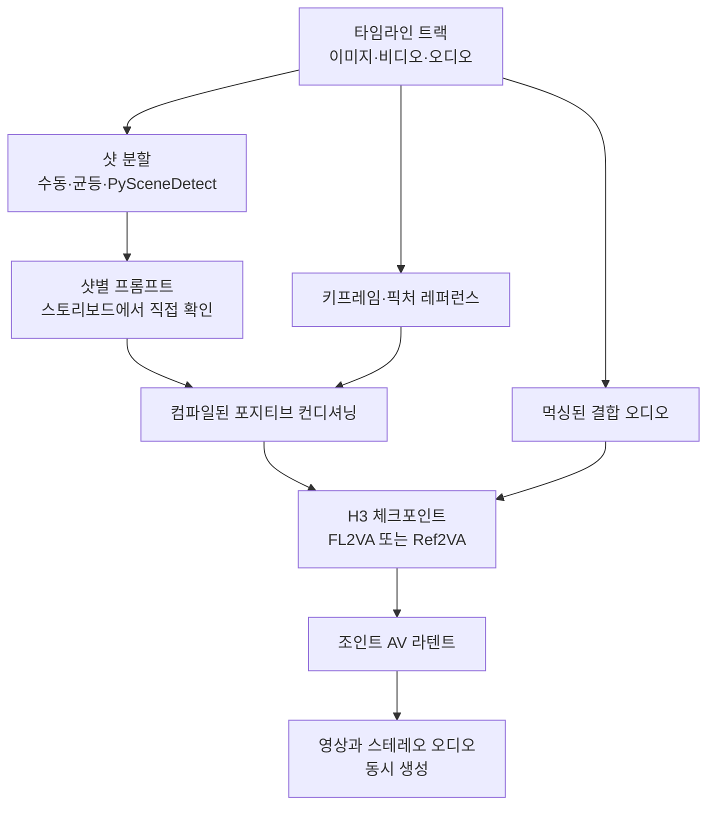

## 왜 읽어야 하나

영상 생성 모델을 자체 인프라에 올릴지 검토 중이거나 ComfyUI 파이프라인을 운영하는 분들을 위한 글입니다. 결론부터 말씀드리면, MiniMax H3는 가중치와 오디오까지 함께 열린 드문 릴리스이고 Director 노드 덕분에 멀티샷 저작이 실무 수준으로 올라왔지만, 한국은 커뮤니티 라이선스의 적용 지역에서 빠져 있어 국내 팀이 이 가중치를 내려받아 자체 서빙하는 경로는 지금 막혀 있습니다. 기술 검토와 법무 검토를 같은 주에 시작하셔야 하는 사안입니다.

*샷이 순서를 이루고 오디오가 같은 축 위에서 함께 흐르는 구조를 형상화했습니다.*

## 개요

지난주 타임라인에서 눈에 띈 것은 [ComfyUI-MiniMaxH3-Director](https://github.com/seesee75-commits/ComfyUI-MiniMaxH3-Director)라는 커스텀 노드였습니다. ComfyUI 안에 영상 편집기의 타임라인을 통째로 옮겨놓고, 그 위에서 샷 단위로 프롬프트를 쓰는 도구입니다. 겉보기에는 편의 기능이지만 실제로는 영상 생성 워크플로의 단위가 클립에서 시퀀스로 바뀌는 지점을 보여줍니다.

그런데 이 노드를 이해하려면 먼저 그 아래 깔린 모델을 봐야 합니다. MiniMax는 하이루오 라인의 기반인 옴니모달 비디오 모델 H3를 8월 3일 오픈소스로 공개했습니다. 텍스트, 이미지, 비디오, 오디오를 입력으로 받아 실제 스테레오 사운드가 있는 영상을 만들며, 오디오가 나중에 덧붙는 것이 아니라 같은 패스에서 함께 생성됩니다. 공개된 H3-Base는 33.1B 옴니 트랜스포머이고 네이티브 출력은 768p입니다. ComfyUI 네이티브 지원이 같은 날 [PR #15224](https://github.com/Comfy-Org/ComfyUI/pull/15224)로 들어가면서 노드 네 개와 공식 워크플로 템플릿 여섯 개가 함께 추가됐습니다.

여기까지는 좋은 소식입니다. 문제는 라이선스에 있습니다.

## 이 도구는 무엇인가

공개 릴리스는 태스크별 체크포인트 두 개로 나뉩니다. 입력 조건이 서로 다릅니다.

| 체크포인트 | 용도 | 입력 조건 |
|---|---|---|
| FL2VA | 텍스트 투 비디오, 첫 프레임 또는 마지막 프레임 조건화 | 이미지 0장이면 텍스트 투 비디오, 1장이면 첫 또는 마지막 프레임, 2장이면 첫과 마지막 프레임 동시 |
| Ref2VA | 레퍼런스 기반 생성 | 레퍼런스 이미지 최대 9장, 비디오 최대 3개, 오디오 최대 3개. 비디오와 오디오는 각각 2초에서 15초, 합계 15초 이내이며 오디오는 항상 이미지나 비디오와 함께 사용 |

여기에 H3 비디오 VAE와 오디오 VAE, 그리고 Qwen3-VL-32B 텍스트 인코더가 함께 배포됩니다. 인코더 체크포인트 파일명이 `qwen3vl_32b_minimax_h3_nvfp4_awq.safetensors`인 점은 눈여겨볼 만합니다. 32B 인코더를 NVFP4와 AWQ로 양자화해 배포함으로써, 텍스트 인코더 크기 때문에 진입이 막히는 상황을 사전에 없앴습니다. 전체 가중치는 42.5GB 규모입니다.

Director 노드는 이 위에 저작 계층을 얹습니다. 이미지와 비디오, 음악을 트랙에 끌어다 놓고 눈금자 위에서 길이를 다듬으면, 트랙의 각 구간이 타임스탬프를 가진 샷이 됩니다. 트랙에 올린 이미지는 키프레임이나 픽처 레퍼런스로 해석되고, 샷마다 프롬프트를 따로 씁니다. 핵심은 스토리보드 화면에서 모델이 실제로 받게 될 프롬프트를 그대로 보면서 계속 고칠 수 있다는 점입니다. 긴 영상을 넣어 균등 분할하거나 PySceneDetect로 장면 경계를 자동 검출해 나누는 것도 노드 안에서 처리됩니다.

노드가 최종적으로 내보내는 것은 패치된 모델, 컴파일된 포지티브 컨디셔닝, 비어 있는 조인트 AV 라텐트, 먹싱된 결합 오디오, 그리고 fps와 해상도, 길이, 프롬프트, 리테이크 정보입니다.

이 구조를 한 줄로 요약하면, 타임라인이라는 선언적 편집 결과가 컨디셔닝으로 컴파일된다는 것입니다. 사람이 프롬프트 문자열을 손으로 이어 붙이는 대신, 편집 상태가 곧 명세가 됩니다. 참고로 이 노드는 WhatDreamsCost가 만든 LTX Director 타임라인 에디터를 H3로 이식한 것으로, 편집 인터페이스는 같고 백엔드가 바뀐 형태입니다. 같은 아이디어를 구현한 [AIMixer 버전](https://github.com/AIMixer/ComfyUI_MiniMaxH3_Director)을 비롯해 여러 갈래가 병존하고 있습니다.

## 설치와 실행에 대하여

이 글에는 저희가 직접 돌려서 얻은 수치가 없습니다. 이유를 분명히 적겠습니다.

MiniMax H3 커뮤니티 라이선스는 2026년 8월 2일자로 발효됐고, 적용 지역 정의에서 미국과 유럽연합, 영국, 그리고 대한민국을 제외합니다. 이 네 지역에서는 오픈웨이트를 내려받아 로컬에서 사용하거나 수정하거나 그 출력물을 배포하는 행위가 라이선스되지 않습니다. 호스팅 API는 전 세계에서 계속 이용할 수 있습니다. MiniMax 측 설명에 따르면 미국 제한은 할리우드 스튜디오와 진행 중인 저작권 소송에서 비롯됐고, 나머지 지역은 인물 유사성 생성과 저작권, 콘텐츠 안전을 둘러싼 규제 정비 상황이 배경입니다. 미국 사용자의 경우 콘텐츠 컴플라이언스 체계를 갖추는 조건으로 별도 승인을 신청할 수 있는 경로가 안내되어 있습니다.

저희는 한국에 있습니다. 그래서 가중치를 내려받지 않았고 로컬 재현도 하지 않았습니다. 라이선스 조건을 우회해서 얻은 벤치마크 숫자는 블로그에 실을 가치가 없습니다. 이 글의 스펙 서술은 전부 공개 문서와 저장소 설명에 근거하며, 실측이 아닌 값은 저희가 검증한 것처럼 쓰지 않았습니다.

국내에서 H3를 다뤄야 한다면 현재 선택지는 호스팅 API 경유입니다. Director 노드 자체는 로컬 가중치를 전제로 설계되어 있으므로, API 기반으로 유사한 멀티샷 저작을 하려면 [API를 감싼 별도 노드 구현](https://github.com/Anil-matcha/minimax-h3-comfyui)처럼 다른 갈래를 봐야 합니다.

## ThakiCloud 제품 적용 시사점

이번 릴리스에서 저희가 실무적으로 가져갈 부분은 세 가지입니다.

첫째, Metis 관점에서 양자화된 텍스트 인코더를 함께 배포한 선택이 인상적입니다. Metis는 추론 서빙과 토큰 팩토리 계층을 담당하고, Dedicated Endpoint로 모델별 서빙을 받습니다. 멀티모달 비디오 모델을 서빙할 때 병목은 보통 본체가 아니라 주변부입니다. 32B 텍스트 인코더를 fp16으로 올리면 그것만으로 GPU 한 장을 먹는데, NVFP4와 AWQ를 적용해 배포하면 같은 하드웨어에서 훨씬 넓은 배치를 받을 수 있습니다. 오픈웨이트를 내는 쪽이 서빙 경제성까지 계산해서 패키징하는 흐름은 앞으로 더 뚜렷해질 것으로 봅니다.

둘째, Aegis 관점에서 이번 라이선스는 교과서 같은 사례입니다. Aegis는 폐쇄망과 온프레미스 배포, 데이터 주권을 다루는 계층인데, 소버린 AI 논의는 대개 데이터가 어디 있느냐에 집중합니다. 이번 건은 그보다 앞선 층을 건드립니다. 데이터를 국내에 두고 폐쇄망에 배포할 준비가 다 되어 있어도, 그 지역이 라이선스 적용 지역에서 빠져 있으면 아무것도 시작할 수 없습니다. 모델 도입 검토 체크리스트에 성능과 VRAM 요구량만 있고 적용 지역 조항이 없다면, 그 체크리스트는 지금 갱신하셔야 합니다.

셋째, Paxis 관점에서 Director의 설계 자체가 참고할 만합니다. Paxis는 ThakiCloud의 Enterprise Agent Platform으로 스킬을 검색해 격리 샌드박스에서 실행하고 DAG로 멀티에이전트 워크플로를 조립합니다. Director가 하는 일은 사람이 편집한 타임라인 상태를 실행 가능한 컨디셔닝으로 컴파일하는 것인데, 이는 저희가 워크플로를 다루는 방식과 같은 형태입니다. 사람은 선언적인 상태를 편집하고, 시스템이 그것을 실행 명세로 번역하며, 편집 화면에서 실제로 실행될 명세를 미리 확인할 수 있습니다. 에이전트 워크플로에서 실행 직전 명세를 사람이 눈으로 확인하는 단계는 승인 게이트의 다른 이름이기도 합니다.

## 한계 및 반론

먼저 홍보 문구와 실제 오픈 릴리스의 간격을 짚어야 합니다. H3의 2K 해상도는 API 가격표와 마케팅 자료에 등장하지만, 그것을 만드는 H3-Regenerate-2K 모듈은 오픈소스 릴리스에 포함되지 않았고 API에서만 제공됩니다. 로컬에서 H3-Base를 돌렸을 때의 네이티브 출력은 짧은 변 기준 768픽셀입니다. 오픈웨이트라는 표현만 보고 API와 동일한 결과물을 기대하면 어긋납니다.

클립 길이도 제약입니다. 한 클립당 최대 15초이고 레퍼런스 비디오와 오디오도 합계 15초 이내입니다. Director의 샷 체이닝은 이 제약 위에서 더 긴 시퀀스를 만드는 우회로에 가깝지, 모델이 장편을 한 번에 생성한다는 뜻이 아닙니다. 샷 사이의 일관성은 여전히 키프레임과 레퍼런스로 관리해야 하는 사용자의 몫입니다.

생태계 파편화도 실무 리스크입니다. Director라는 이름으로 최소 세 갈래의 구현이 병존하고 커뮤니티 양자화본도 여러 종류가 올라와 있습니다. 커스텀 노드는 ComfyUI 코어 업데이트에 쉽게 깨지고, 파편화된 상태에서는 어느 갈래가 유지보수될지 예측하기 어렵습니다. 프로덕션 파이프라인에 넣으실 생각이라면 특정 커밋에 고정하고 업그레이드를 계획적으로 하시는 편이 안전합니다.

마지막으로 반대 방향의 논거도 적어두겠습니다. 라이선스 제한이 영구적이라고 단정할 근거는 없습니다. 소송과 규제 정비가 배경이라면 상황이 정리된 뒤 적용 지역이 조정될 가능성이 있고, 미국에 대해 이미 신청 경로가 열려 있다는 점도 그 방향을 시사합니다. 지금 결론은 도입 불가가 아니라 도입 보류이며, 라이선스 문서의 개정을 주기적으로 확인하는 것이 맞는 대응입니다.

## 정리

Director가 보여준 것은 영상 생성의 작업 단위가 프롬프트 한 줄에서 편집된 타임라인으로 올라섰다는 사실입니다. 샷과 키프레임, 오디오가 하나의 축 위에 놓이고 그 편집 상태가 그대로 실행 명세로 컴파일되는 방식은, 영상뿐 아니라 사람이 검토하고 시스템이 실행하는 모든 워크플로가 향하는 형태이기도 합니다.

다만 국내 팀에게 지금 더 중요한 문장은 그 아래에 있습니다. 오픈웨이트라는 단어가 곧 자체 서빙 가능을 뜻하지는 않습니다. 이번 주에 하실 일은 벤치마크를 돌리는 것이 아니라, 도입 후보 모델들의 라이선스에서 적용 지역 조항을 찾아 읽고 그 결과를 모델 선정 문서에 한 칸 추가하는 것입니다. 성능 비교는 그다음 순서입니다.

## 출처

- [MiniMax H3 Day-0 Support in ComfyUI, ComfyUI 공식 블로그](https://blog.comfy.org/p/minimax-h3-day-0-support-in-comfyui)
- [feat: Support MiniMax-H3 (CORE-375), Comfy-Org/ComfyUI PR #15224](https://github.com/Comfy-Org/ComfyUI/pull/15224)
- [ComfyUI-MiniMaxH3-Director, GitHub](https://github.com/seesee75-commits/ComfyUI-MiniMaxH3-Director)
- [MiniMax H3 라이선스 QA 문서, Hugging Face](https://huggingface.co/MiniMaxAI/MiniMax-H3/blob/main/docs/QA-about-License.md)
- [MiniMax H3 ComfyUI 워크플로 예제, ComfyUI 공식 문서](https://docs.comfy.org/tutorials/video/minimax/minimax-h3)
- [China's MiniMax curbs overseas access to new AI video model over copyright disputes, SCMP](https://www.scmp.com/tech/tech-trends/article/3362951/chinas-minimax-curbs-overseas-access-new-ai-video-model-over-copyright-disputes)
