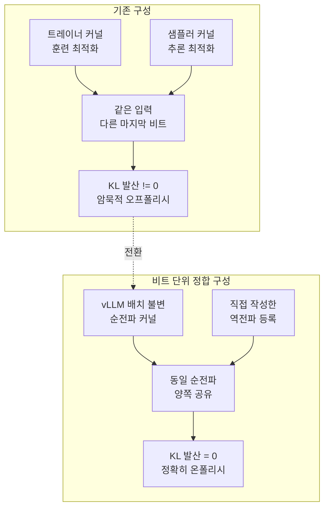

## 왜 읽어야 하나

온폴리시 RL로 모델을 후처리 학습시키는데 같은 설정에서 보상 곡선이 실행마다 달라져 원인을 찾고 있는 분, 그리고 훈련 스택과 서빙 스택을 따로 고르는 것이 나중에 무엇을 청구하는지 알아야 하는 플랫폼 담당자를 위한 글입니다. 결론을 먼저 드리면, 그 불안정의 상당 부분은 하이퍼파라미터가 아니라 **훈련 커널과 추론 커널이 같은 입력에 다른 비트를 내놓는다는 사실**에서 나옵니다. vLLM과 TorchTitan 팀은 순전파의 모든 커널 호출을 감사해 이 차이를 없앴고, KL 발산이 항상 0이 되자 모델은 더 적은 스텝에서 더 높은 총 보상에 도달했습니다. 다만 이 정합은 아직 전체 아키텍처를 덮지 못합니다. Gated DeltaNet 같은 선형 어텐션 계열에서는 지금도 막혀 있고, 그 이유는 게으름이 아니라 재귀 상태라는 구조 자체에 있습니다.


*훈련과 추론이라는 두 경로가 같은 수치로 수렴하는 상태를 형상화했습니다. 한쪽은 매끄럽고 한쪽은 청크로 끊겨 있습니다.*

## 개요

RL 후처리 학습에는 오래된 골칫거리가 있습니다. 샘플러가 만든 토큰과 트레이너가 그 토큰에 매기는 확률이 미묘하게 어긋납니다. 이론상 온폴리시인데 실제로는 아주 살짝 오프폴리시인 상태가 됩니다. 강화학습은 이 작은 수치 불일치를 증폭하기로 유명해서, 결과는 비결정적이고 불안정한 학습 거동으로 나타납니다.

원인은 버그가 아닙니다. 훈련 프레임워크와 추론 프레임워크는 워크로드 성격이 달라서 애초에 다른 커널을 씁니다. 심지어 추론 프레임워크 안에서도 상황에 따라 다른 커널이 선택됩니다. 큰 배치용 커널은 배치 차원에서 공격적으로 병렬화하고, 작은 배치용 커널은 GPU의 병렬 코어를 채우려고 인스턴스 하나 안에서 더 잘게 나눕니다. 부동소수점 덧셈은 결합법칙이 성립하지 않으므로 누적 순서가 바뀌면 마지막 비트가 달라집니다.

이 성질이 실무에서 유난히 사람을 헷갈리게 만드는 이유가 있습니다. 오차 자체는 아주 작습니다. 토큰 하나의 로그 확률에서 마지막 몇 비트가 다른 수준입니다. 그런데 RL은 이 차이를 두 번 증폭합니다. 한 번은 시퀀스 방향으로, 토큰마다 쌓인 비율이 곱해지면서 증폭됩니다. 또 한 번은 학습 방향으로, 그렇게 오염된 신호로 갱신된 정책이 다음 라운드의 샘플을 만들면서 증폭됩니다. 그래서 증상이 나타나는 곳은 원인에서 한참 떨어져 있습니다. 커널 선택이 문제인데 발산은 수백 스텝 뒤 보상 곡선에서 보입니다. 어느 하이퍼파라미터를 만져도 재현되지 않는 불안정을 겪고 있다면 이 경로를 한 번 의심해볼 만합니다.

vLLM과 TorchTitan 팀이 작년 11월에 공개한 [No More Train-Inference Mismatch](https://blog.vllm.ai/2025/11/10/bitwise-consistent-train-inference.html)는 이 문제를 정면으로 없앤 기록입니다. TorchTitan을 훈련 엔진으로, vLLM을 추론 엔진으로 두고 두 프레임워크 사이의 불변성을 확보해, 훈련과 추론의 수치가 비트 단위로 일치하는 오픈소스 온폴리시 RL 실행을 시연했습니다. 그 뒤로 이 작업은 계속 확장되고 있고, 지금 남은 가장 눈에 띄는 빈칸이 선형 어텐션입니다. 이 글은 그 정합이 무엇을 했고, 왜 선형 어텐션에서 유독 어려운지를 공개된 저장소와 이슈를 확인해 정리했습니다.

## 비트 단위 정합은 무엇을 한 것인가

접근은 단순하지만 지루합니다. 순전파 중에 일어나는 모든 커널의 모든 호출을 감사해서 두 프레임워크 사이에서 비트 단위로 동등한지 확인했습니다.

이게 가능했던 전제는 vLLM이 먼저 해둔 배치 불변 추론 작업입니다. 배치 불변이란 같은 시퀀스를 넣으면 함께 배치된 다른 요청이 무엇이든 관계없이 항상 같은 출력이 나온다는 성질입니다. 이 성질이 있는 순전파 커널을 확보한 뒤, 팀은 그 커널들을 훈련 쪽으로 그대로 가져왔습니다.



*순전파 커널을 공유하고 역전파만 따로 붙이는 것이 이 작업의 골자입니다.*

문제는 vLLM에 최적화된 융합 연산이 많다는 점이었습니다. SiLU MLP나 잔차를 더한 RMSNorm 같은 것들입니다. 비트 동등성을 유지하려면 순전파에 그 연산을 그대로 가져와야 하는데, 이 연산들에는 역전파가 없습니다. 그래서 팀은 TorchTitan이 쓰는 평범한 파이토치로 각 연산에 맞는 역전파를 직접 작성해 등록했습니다.

RL 데모는 GSM8K와 정답 여부 보상으로 구성한 일반적인 스크립트입니다. 트레이너는 TorchTitan의 유틸리티를 쓰고, 생성기는 `VLLMRolloutEngine`이라는 얇은 래퍼를 새로 만들어 생성 호출과 가중치 갱신만 감쌌습니다. 전체를 단일 호스트에서 동기적으로, 트레이너와 생성기를 번갈아 실행합니다. 저자들도 이 구성이 정확히 온폴리시라는 것을 보여주기 위한 것이지 대규모 실행에서 흔한 방식은 아니라고 밝혔습니다.

## 숫자가 말한 것

결과는 두 가지로 갈립니다.

트레이너와 다른 커널로 샘플러를 돌린 경우, 즉 배치 불변을 끈 경우에는 100스텝 동안 보상이 낮게 나왔습니다. 비트 단위로 정확한 훈련을 켜면 KL 발산이 항상 0이 되고, 모델은 더 적은 스텝에서 학습되며 더 높은 총 보상에 도달했습니다.

여기서 KL 발산이 0이라는 것은 지표가 좋아졌다는 뜻이 아니라 **알고리즘의 전제가 실제로 성립하게 됐다**는 뜻입니다. 온폴리시 알고리즘은 샘플을 만든 정책과 갱신되는 정책이 같다고 가정하고 유도됩니다. 커널이 다르면 그 가정이 조용히 깨져 있고, 우리는 그걸 학습률이나 클리핑 계수를 바꿔가며 쫓게 됩니다.

대가도 분명합니다. 현재 비트 단위 RL 실행은 그렇지 않은 경우보다 2.4배 느립니다. 배치 불변 커널은 배치 크기에 따라 전략을 바꾸는 최적화를 포기하기 때문에 처음부터 손해를 안고 갑니다. 그리고 이 구성은 아직 `torch.compile`을 쓰지 않습니다. TorchTitan 쪽 모델에 컴파일을 적용하지 않았기 때문에 vLLM도 이거 모드로 강제됩니다. vLLM 자체는 컴파일을 적극적으로 쓰면서도 배치 불변성을 유지할 수 있지만, 프레임워크를 가로지르는 호환을 유지하려면 훈련 쪽 모델도 함께 바뀌어야 합니다.

남은 구조적 부채도 저자들이 직접 적어뒀습니다. 지금은 모델 코드가 훈련용과 추론용 두 벌로 존재합니다. 첫 통합에는 편하지만 장기 유지에는 취약합니다. 어느 한쪽을 조금만 고쳐도 동등성이 깨집니다. 후속 방향은 두 프레임워크가 모델 정의를 공유하는 것이고, 진행 상황은 RFC [#28326](https://github.com/vllm-project/vllm/issues/28326)과 [#27433](https://github.com/vllm-project/vllm/issues/27433)에서 추적됩니다.

## 선형 어텐션이 다음 벽인 이유

지금까지의 이야기는 소프트맥스 어텐션 기준입니다. 그런데 최근 모델들은 순수 어텐션이 아닙니다. Qwen3-Next 계열은 Gated DeltaNet이라는 선형 어텐션과 완전 어텐션을 층마다 번갈아 배치하는 혼합 구조를 씁니다. 선형 어텐션이 긴 컨텍스트 효율을 담당하고 완전 어텐션이 정밀한 추론을 담당하는 분업입니다. vLLM은 이 구조를 지원하려고 Flash Linear Attention의 Triton 커널을 통합했고, 선형 층과 완전 어텐션 층을 함께 관리하는 혼합 KV 캐시 관리자를 도입했습니다.

여기서 배치 불변성이 걸립니다. 지난 5월에 올라온 이슈 [#42960](https://github.com/vllm-project/vllm/issues/42960)이 상황을 정확히 기록해뒀습니다. GDN 층이 포함된 모델에 `VLLM_BATCH_INVARIANT=1`을 설정하면 엔진 기동 자체가 중단됩니다.

```text
RuntimeError: VLLM batch_invariant mode is not supported for GDN_ATTN.
```

이 검사는 `vllm/v1/attention/selector.py`의 `_cached_get_mamba_attn_backend`에서 백엔드를 고르는 순간 발동합니다. 보고자는 A100 80GB에서 Qwen3.6-35B-A3B의 AWQ 4비트 버전으로 재현했고, 0.21.0과 당시 나이틀리 양쪽에서 같은 오류를 확인했습니다. 폴백도 없고 부분 모드도 없는 하드 비호환이라고 적혀 있습니다. 정규 어텐션 경로는 [#42456](https://github.com/vllm-project/vllm/issues/42456)에서 SM80 지원이 들어갔는데, 선형 어텐션 경로에는 그 대응이 아직 없던 상태였습니다.

6월에 Red Hat의 Yuval Luria가 이 이슈를 겨냥한 PR [#45819](https://github.com/vllm-project/vllm/pull/45819)를 올렸습니다. `GDNAttentionBackend`에 `supports_batch_invariance()`를 추가해 다른 백엔드와 같은 패턴을 따르게 하는 네 줄짜리 변경이고, 근거는 GDN 구현이 이미 `torch.argsort`를 `stable=True`로 쓰고 있어 결정론적 거동을 지원한다는 것입니다. 이 PR은 이 글을 쓰는 시점에 아직 열려 있습니다.

플래그 하나로 끝나지 않는 이유는 GDN이 계산되는 방식에 있습니다. 선형 어텐션은 재귀 상태를 시퀀스를 따라 굴립니다. 처리량을 내려면 이 재귀를 청크로 잘라 병렬로 돌려야 하는데, 청크 사이에는 순서 의존성이 남습니다. 이 지점이 얼마나 미끄러운지 보여주는 사례가 실제로 있습니다. `chunk_gated_delta_rule_fwd_h`를 시퀀스 길이 방향으로 더 병렬화해 vLLM 기본 청크 프리필 크기인 8192에서 2.80배 속도 향상을 보고한 PR [#25393](https://github.com/vllm-project/vllm/pull/25393)에, 리뷰가 치명적인 정확성 문제를 지적했습니다. 각 스레드 블록이 앞 블록이 끝낸 상태를 전역 메모리에서 읽어오는데, Triton 그리드의 스레드 블록은 순서나 동기화가 보장되지 않으므로 쓰기 전에 읽는 경합이 발생할 수 있고, 게다가 저장된 것은 앞 청크를 **처리한 뒤**의 상태가 아니라 처리를 **시작할 때**의 상태였습니다. 리뷰는 PR의 벤치마크가 성능만 재고 정확성을 검증하지 않아 이 문제가 잡히지 않았을 것이라고 덧붙였습니다.

이 사례가 말해주는 것은 분명합니다. 선형 어텐션의 상태 재귀에서는 병렬화 전략을 바꾸는 순간 결과가 바뀔 수 있습니다. 소프트맥스 어텐션에서 배치 불변성이 누적 순서를 고정하는 문제였다면, 여기서는 **상태 전파 경계를 고정하는 문제**가 하나 더 얹힙니다. 백엔드에 지원 플래그를 켜는 것과 청크 분할이 달라져도 같은 비트가 나온다고 보장하는 것은 다른 작업입니다.

문제를 더 까다롭게 만드는 것은 청크 경계가 고정된 상수가 아니라는 점입니다. 서빙 엔진은 프리필을 나눠 처리하고, 그 분할은 그 순간 함께 스케줄된 다른 요청과 남은 예산에 따라 달라집니다. 완전 어텐션이라면 이 분할이 달라져도 최종 누적을 고정하는 방식으로 대응할 수 있습니다. 재귀 상태는 그렇지 않습니다. 어디서 끊어 어디까지 굴렸는지가 다음 청크의 초기 상태로 그대로 이어지므로, 분할 자체가 계산 그래프의 일부가 됩니다. 혼합 구조에서는 이 성질이 층마다 번갈아 나타나고, 선형 층과 완전 어텐션 층을 함께 관리하는 캐시 관리자가 그 사이에 놓입니다. 정합을 보장하려면 스케줄러가 만든 분할까지 재현 가능해야 한다는 뜻이고, 이건 커널 한 개의 문제가 아니라 실행 경로 전체의 문제입니다.

## ThakiCloud 제품 적용 시사점

이 주제는 저희에게 학술적이지 않습니다. 고객 특화 모델을 만드는 [Maxis](https://thakicloud.com/tech-blog/ko/llmops/) 축에서 RL 후처리 학습은 핵심 경로이고, 저희는 훈련과 서빙을 같은 조직이 함께 운영합니다.

첫 번째 시사점은 스택 선택의 기준이 하나 늘었다는 것입니다. 지금까지 훈련 프레임워크와 서빙 엔진은 각각의 성능으로 골랐습니다. 온폴리시 RL을 진지하게 돌린다면 여기에 두 엔진 사이의 수치 정합 가능성이 추가됩니다. 정합을 포기하면 학습 불안정을 하이퍼파라미터로 덮게 되고, 그 비용은 실험 횟수로 청구됩니다.

두 번째는 2.4배라는 숫자를 어디에 쓸지입니다. 모든 실행을 비트 단위 정합으로 돌릴 필요는 없습니다. 저희가 실무적으로 유효하다고 보는 구성은 정합 모드를 기준선 검증용으로 두는 것입니다. 새 레시피를 만들 때 짧은 정합 실행으로 KL이 0인 상태의 보상 곡선을 확보해두고, 이후 대규모 실행은 빠른 모드로 돌리되 그 기준선과 벌어지는 폭을 감시합니다. 재현성이 필요한 것은 모든 실행이 아니라 판단의 근거가 되는 실행입니다.

세 번째는 모델 선택에 붙는 조건입니다. 혼합 선형 어텐션 모델은 긴 컨텍스트 서빙에서 매력적이고 [Metis](https://thakicloud.com/tech-blog/ko/llmops/)의 토큰 단가를 낮추는 방향으로 작동합니다. 그러나 그 계열을 온폴리시 RL로 후처리 학습할 계획이라면 지금 시점에서는 재현 가능한 정합 경로가 아직 열려 있지 않다는 점을 전제에 넣어야 합니다. 서빙 효율과 학습 재현성이 같은 아키텍처 선택에서 반대로 당깁니다. 이 균형은 자체 벤치마크로 정할 문제이지 기본값으로 정할 문제가 아닙니다.

이 모든 것이 결국 무엇을 위한 것인가 하면, [Paxis](https://thakicloud.com/tech-blog/ko/agentops/)가 실행하는 업무의 신뢰성입니다. 사내 업무를 자동화하는 에이전트가 특정 작업에서 반복적으로 틀린다면 그 작업의 실행 기록을 학습 신호로 되먹여 고치는 것이 저희 구조입니다. 그런데 학습이 실행마다 다른 곳에 도착하면 무엇이 개선을 만들었는지 귀속시킬 수 없습니다. 비트 단위 정합은 성능 기법이 아니라 **개선을 귀속 가능하게 만드는 계측 조건**에 가깝습니다. 그리고 이 파이프라인은 배치 위치를 가리지 않아야 합니다. 같은 학습과 서빙 구성을 Telox GPU 클러스터에서도, 고객 폐쇄망의 Aegis 위에서도 동일하게 돌릴 수 있어야 재현성이 조직 자산이 됩니다.

## 한계 및 반론

먼저 이 글의 근거 범위를 분명히 해두겠습니다. 저희는 이 실험을 직접 재현하지 않았습니다. 여기 적힌 수치는 vLLM과 TorchTitan 팀이 공개한 값이고, 선형 어텐션 쪽 상태는 공개 이슈와 PR을 확인한 것입니다. 특히 GDN 정합 작업은 지금도 움직이고 있어서, 이 글을 읽는 시점에는 위에 인용한 PR의 상태가 달라져 있을 수 있습니다.

기술적으로도 시연의 범위는 좁습니다. 대상은 Qwen3 1.7B 한 종이고, 단일 호스트에서 트레이너와 생성기를 번갈아 돌리는 동기 구성입니다. 실제 대규모 RL은 생성과 학습을 비동기로 겹쳐 돌리는 경우가 많은데, 그 구성에서는 애초에 정확한 온폴리시가 아니므로 이 기법이 주는 이득의 성격이 달라집니다. 모델 코드가 두 벌로 존재하는 문제도 아직 남아 있어서, 유지 비용을 감안하면 지금 그대로 프로덕션에 옮길 물건은 아닙니다.

반대 논거도 세워두는 편이 정직합니다. 수치 불일치를 없애는 대신 그것을 인정하고 알고리즘 쪽에서 보정하는 길이 있습니다. 중요도 가중치로 오프폴리시성을 명시적으로 다루는 접근은 이미 성숙해 있고, 2.4배의 처리량을 지불하지 않습니다. 같은 시간에 더 많은 샘플을 볼 수 있다면 그쪽이 더 나은 모델을 만들 수도 있습니다. 비트 단위 정합의 진짜 값은 최종 성능이 아니라 디버깅 가능성에 있다고 보는 편이 정확합니다. 실행이 결정적이면 무엇이 무엇을 바꿨는지 물을 수 있고, 그 질문에 답할 수 있는 팀이 결국 더 빨리 갑니다.

## 정리

훈련과 추론이 다른 커널을 쓰면 온폴리시 RL의 전제는 조용히 깨져 있습니다. vLLM과 TorchTitan은 순전파 커널을 공유하고 역전파를 직접 붙이는 방식으로 이 간극을 없앴고, KL 발산이 0이 된 조건에서 학습은 더 적은 스텝에 더 높은 보상으로 갔습니다. 값은 2.4배의 속도 저하와 두 벌로 갈라진 모델 코드입니다. 그리고 이 정합은 아직 선형 어텐션을 덮지 못합니다. GDN의 상태 재귀는 청크 병렬화 전략이 결과를 바꿀 수 있는 구조라, 백엔드 플래그를 켜는 것만으로 끝나지 않습니다.

지금 RL 후처리 학습을 운영 중이라면 한 가지를 먼저 확인해보시길 권합니다. 트레이너가 계산한 로그 확률과 샘플러가 보고한 로그 확률의 차이를 스텝마다 기록하고 있는지입니다. 그 값이 0이 아니면서 학습이 흔들린다면, 다음에 조정할 것은 학습률이 아니라 커널입니다. 그리고 혼합 선형 어텐션 모델을 후보에 올려두셨다면, 서빙 효율이 좋다는 이유만으로 학습 계획까지 그 아키텍처에 태우기 전에 위 이슈의 현재 상태를 한 번 확인하시는 편이 좋습니다.


## 관련 슬라이드

본문 내용을 NotebookLM(`architectural_portfolio` 스타일)으로 요약한 슬라이드입니다.


## 출처

- vLLM and TorchTitan Teams, [No More Train-Inference Mismatch: Bitwise Consistent On-Policy Reinforcement Learning with vLLM and TorchTitan](https://blog.vllm.ai/2025/11/10/bitwise-consistent-train-inference.html), 2025-11-10
- vLLM, [vLLM Now Supports Qwen3-Next: Hybrid Architecture with Extreme Efficiency](https://vllm.ai/blog/2025-09-11-qwen3-next), 2025-09-11
- [Issue #42960: Batch-invariant support for GDN_ATTN](https://github.com/vllm-project/vllm/issues/42960)
- [PR #45819: Add batch invariance support to GDN_ATTN backend](https://github.com/vllm-project/vllm/pull/45819)
- [PR #25393: Speedup chunk_gated_delta_rule_fwd_h](https://github.com/vllm-project/vllm/pull/25393)
- RFC [#28326](https://github.com/vllm-project/vllm/issues/28326), RFC [#27433](https://github.com/vllm-project/vllm/issues/27433)
